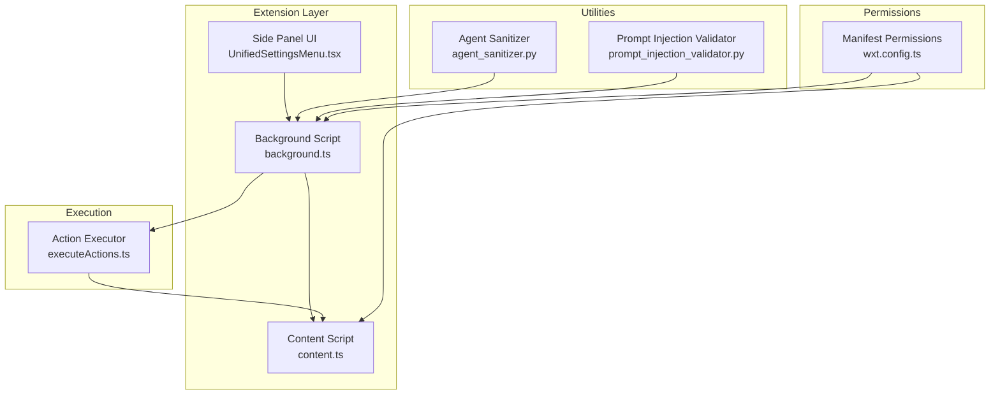
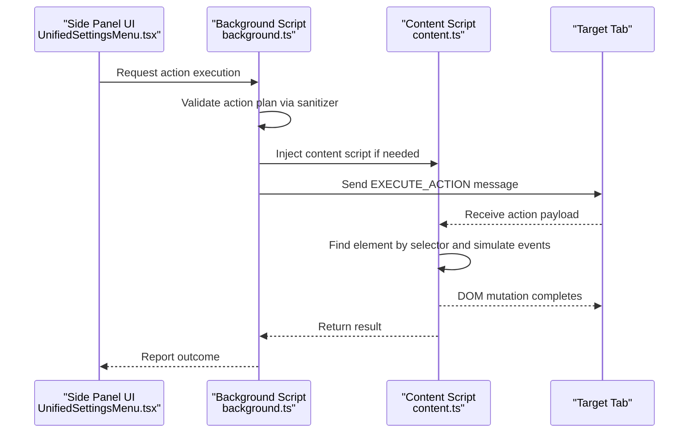
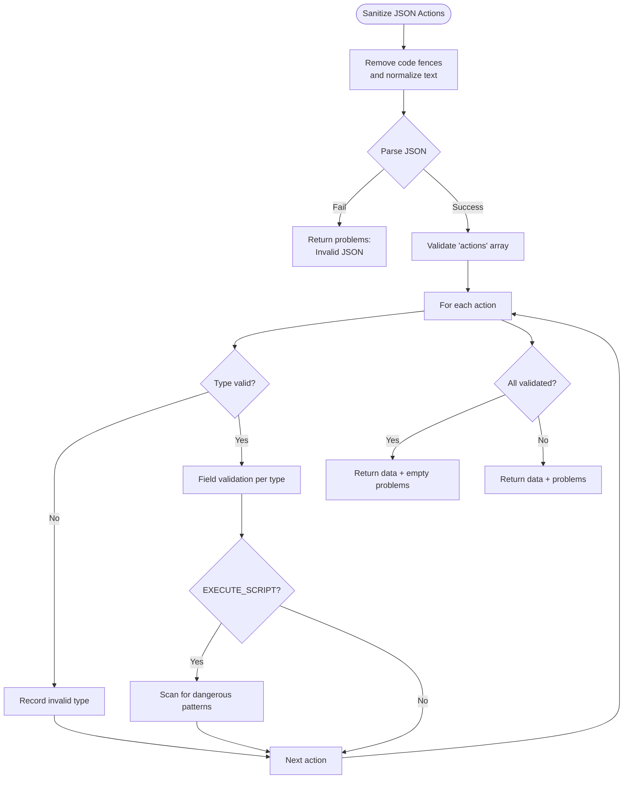
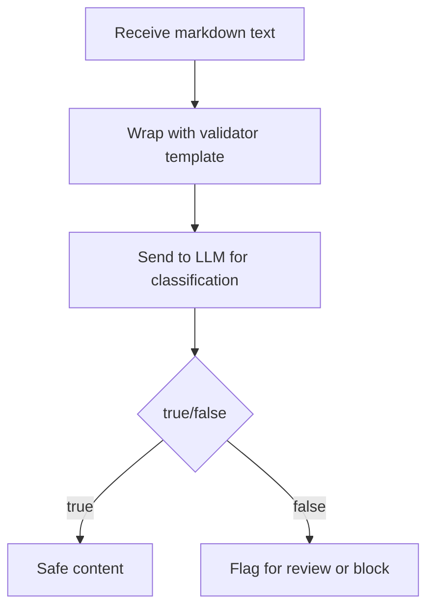
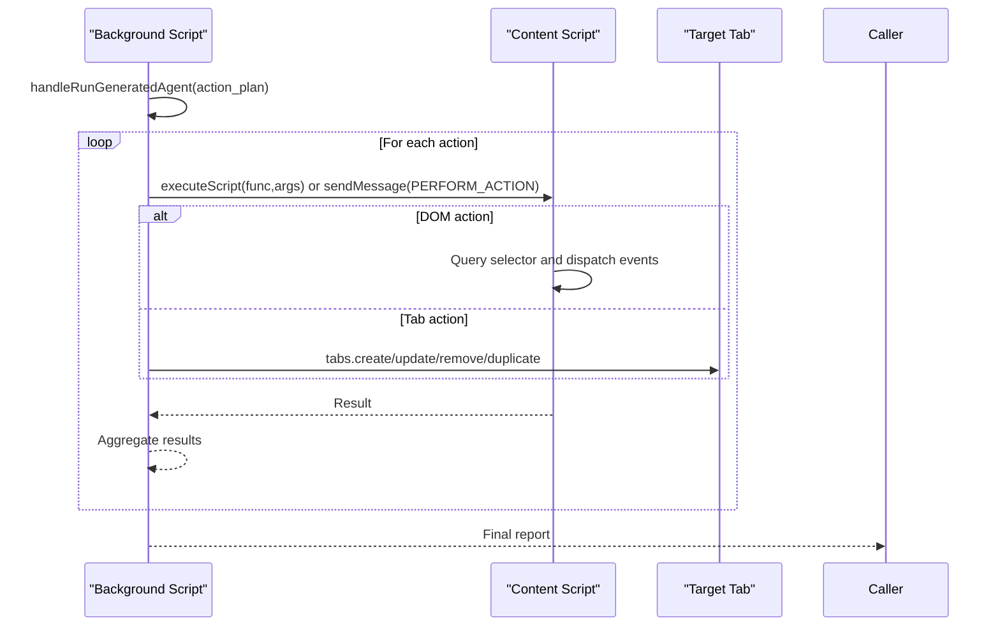
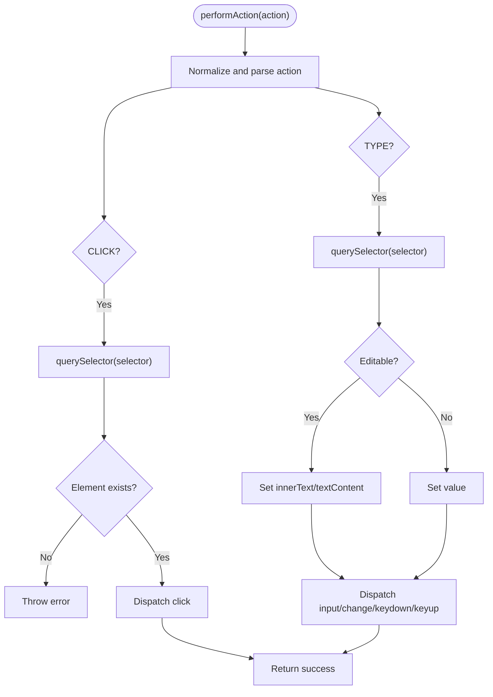
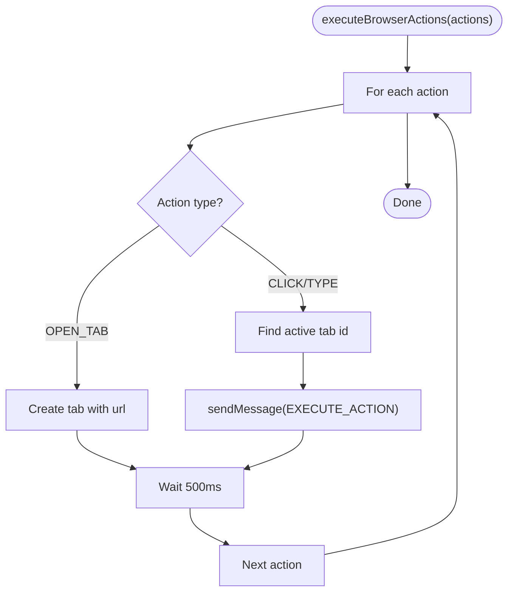
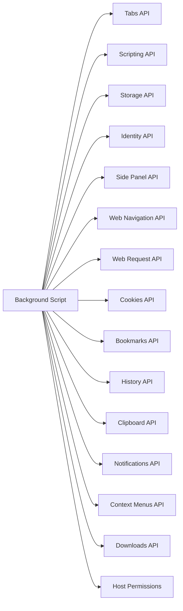
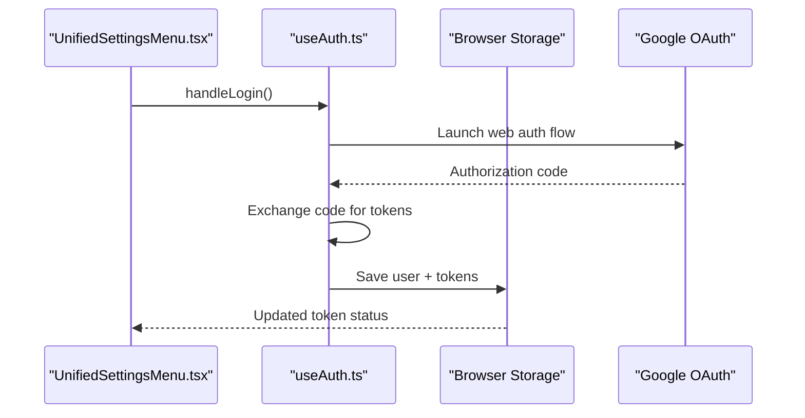
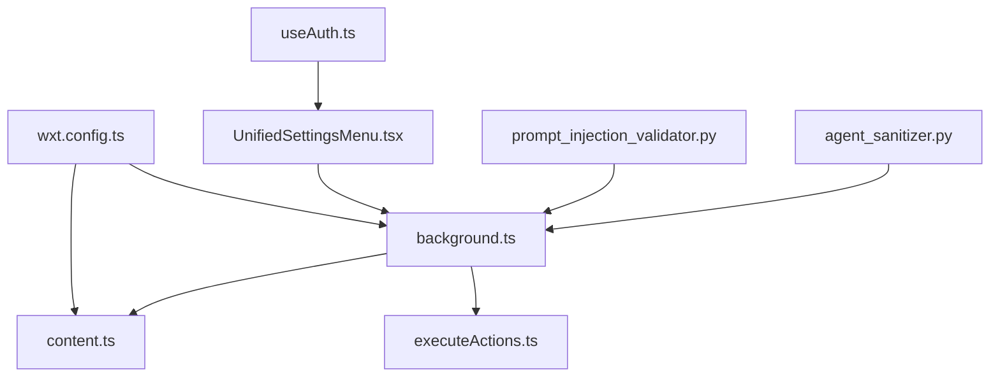

# Security and Safety Mechanisms

<cite>
**Referenced Files in This Document**
- [agent_sanitizer.py](file://utils/agent_sanitizer.py)
- [prompt_injection_validator.py](file://prompts/prompt_injection_validator.py)
- [executeActions.ts](file://extension/entrypoints/utils/executeActions.ts)
- [background.ts](file://extension/entrypoints/background.ts)
- [content.ts](file://extension/entrypoints/content.ts)
- [wxt.config.ts](file://extension/wxt.config.ts)
- [UnifiedSettingsMenu.tsx](file://extension/entrypoints/sidepanel/components/UnifiedSettingsMenu.tsx)
- [ApiKeySection.tsx](file://extension/entrypoints/sidepanel/components/ApiKeySection.tsx)
- [useAuth.ts](file://extension/entrypoints/sidepanel/hooks/useAuth.ts)
- [README.md](file://README.md)
</cite>

## Table of Contents
1. [Introduction](#introduction)
2. [Project Structure](#project-structure)
3. [Core Components](#core-components)
4. [Architecture Overview](#architecture-overview)
5. [Detailed Component Analysis](#detailed-component-analysis)
6. [Dependency Analysis](#dependency-analysis)
7. [Performance Considerations](#performance-considerations)
8. [Troubleshooting Guide](#troubleshooting-guide)
9. [Conclusion](#conclusion)
10. [Appendices](#appendices)

## Introduction
This document explains the security and safety mechanisms implemented in the browser automation system. It focuses on:
- User approval workflow for potentially dangerous actions
- Activity logging and audit trails
- Intelligent content filtering
- Agent sanitizer role in preventing malicious inputs and prompt injection validation
- Action approval processes
- Security boundaries between content scripts and page context
- Permission management and safe execution environments
- Examples of security policies, threat mitigation strategies, and incident response procedures
- Compliance considerations and best practices for secure browser automation

## Project Structure
The security-relevant parts of the system span three layers:
- Extension background and content scripts for safe DOM/tab operations
- Utilities for sanitization and validation
- Frontend settings and authentication for secure credential handling

**Diagram sources**
- [background.ts](file://extension/entrypoints/background.ts#L17-L156)
- [content.ts](file://extension/entrypoints/content.ts#L1-L326)
- [executeActions.ts](file://extension/entrypoints/utils/executeActions.ts#L1-L57)
- [agent_sanitizer.py](file://utils/agent_sanitizer.py#L1-L119)
- [prompt_injection_validator.py](file://prompts/prompt_injection_validator.py#L1-L16)
- [wxt.config.ts](file://extension/wxt.config.ts#L1-L29)
- [UnifiedSettingsMenu.tsx](file://extension/entrypoints/sidepanel/components/UnifiedSettingsMenu.tsx#L1-L1194)

**Section sources**
- [background.ts](file://extension/entrypoints/background.ts#L17-L156)
- [content.ts](file://extension/entrypoints/content.ts#L1-L326)
- [executeActions.ts](file://extension/entrypoints/utils/executeActions.ts#L1-L57)
- [agent_sanitizer.py](file://utils/agent_sanitizer.py#L1-L119)
- [prompt_injection_validator.py](file://prompts/prompt_injection_validator.py#L1-L16)
- [wxt.config.ts](file://extension/wxt.config.ts#L1-L29)
- [UnifiedSettingsMenu.tsx](file://extension/entrypoints/sidepanel/components/UnifiedSettingsMenu.tsx#L1-L1194)

## Core Components
- Agent Sanitizer: Validates and sanitizes action plans from the LLM, rejects unsafe constructs, and enforces required fields per action type.
- Prompt Injection Validator: Provides a template to detect prompt injection attempts in markdown content.
- Background Script: Orchestrates safe execution of tab-level and DOM-level actions, injects content scripts when needed, and coordinates messaging with the active tab.
- Content Script: Executes DOM operations within the page context under strict selectors and event dispatching.
- Action Executor: Translates high-level actions into browser APIs with minimal delay and error handling.
- Manifest Permissions: Defines the minimal set of permissions required for safe automation.
- Side Panel UI and Authentication: Manages secure storage of credentials and API keys, and handles OAuth flows.

**Section sources**
- [agent_sanitizer.py](file://utils/agent_sanitizer.py#L20-L96)
- [prompt_injection_validator.py](file://prompts/prompt_injection_validator.py#L1-L16)
- [background.ts](file://extension/entrypoints/background.ts#L428-L804)
- [content.ts](file://extension/entrypoints/content.ts#L220-L323)
- [executeActions.ts](file://extension/entrypoints/utils/executeActions.ts#L1-L57)
- [wxt.config.ts](file://extension/wxt.config.ts#L5-L27)
- [UnifiedSettingsMenu.tsx](file://extension/entrypoints/sidepanel/components/UnifiedSettingsMenu.tsx#L1-L1194)
- [useAuth.ts](file://extension/entrypoints/sidepanel/hooks/useAuth.ts#L110-L218)

## Architecture Overview
The system separates concerns across layers to enforce security boundaries:
- Background script controls browser-level actions and safe injection of content scripts.
- Content script operates within the page’s DOM with explicit selectors and event simulation.
- Utilities validate inputs and actions before execution.
- UI manages sensitive data and authentication securely.

**Diagram sources**
- [background.ts](file://extension/entrypoints/background.ts#L428-L804)
- [content.ts](file://extension/entrypoints/content.ts#L220-L323)
- [executeActions.ts](file://extension/entrypoints/utils/executeActions.ts#L1-L57)
- [agent_sanitizer.py](file://utils/agent_sanitizer.py#L20-L96)

## Detailed Component Analysis

### Agent Sanitizer
The sanitizer validates JSON action plans and enforces:
- Required fields per action type (e.g., selector for CLICK/TYPE/SELECT, url for OPEN_TAB/NAVIGATE, tab identifier or direction for SWITCH_TAB)
- Structural checks (presence of actions array, non-empty list)
- Safety checks for EXECUTE_SCRIPT against known dangerous patterns
- Backward-compatible legacy JS validation

**Diagram sources**
- [agent_sanitizer.py](file://utils/agent_sanitizer.py#L20-L96)

**Section sources**
- [agent_sanitizer.py](file://utils/agent_sanitizer.py#L20-L96)

### Prompt Injection Validator
The validator defines a structured prompt template to classify whether a markdown text is safe or contains prompt injection attempts. It expects a binary classification response suitable for automated gating.

**Diagram sources**
- [prompt_injection_validator.py](file://prompts/prompt_injection_validator.py#L1-L16)

**Section sources**
- [prompt_injection_validator.py](file://prompts/prompt_injection_validator.py#L1-L16)

### Background Script: Safe Execution Engine
The background script coordinates:
- Tab/window control actions (OPEN_TAB, CLOSE_TAB, SWITCH_TAB, NAVIGATE, RELOAD_TAB, DUPLICATE_TAB)
- DOM manipulation actions (CLICK, TYPE, SCROLL, WAIT) via content script injection
- Message routing and result aggregation
- Waiting for navigation/reload completion with timeouts

**Diagram sources**
- [background.ts](file://extension/entrypoints/background.ts#L470-L514)
- [background.ts](file://extension/entrypoints/background.ts#L541-L804)

**Section sources**
- [background.ts](file://extension/entrypoints/background.ts#L470-L514)
- [background.ts](file://extension/entrypoints/background.ts#L541-L804)

### Content Script: Page Context Operations
The content script executes DOM operations safely:
- Finds elements by selector
- Dispatches realistic input/change/keyboard events for editable and standard inputs
- Scrolls and interacts with page elements

**Diagram sources**
- [content.ts](file://extension/entrypoints/content.ts#L220-L323)

**Section sources**
- [content.ts](file://extension/entrypoints/content.ts#L220-L323)

### Action Executor: Minimal Bridge Between UI and Browser APIs
The executor translates high-level actions into browser APIs with:
- Targeting the active tab for DOM actions
- Sending messages to the content script for DOM operations
- Introducing small delays between actions to avoid overwhelming the page

**Diagram sources**
- [executeActions.ts](file://extension/entrypoints/utils/executeActions.ts#L1-L57)

**Section sources**
- [executeActions.ts](file://extension/entrypoints/utils/executeActions.ts#L1-L57)

### Permissions and Security Boundaries
The manifest grants minimal permissions necessary for automation:
- Tabs, scripting, storage, identity, side panel, webNavigation, webRequest, cookies, bookmarks, history, clipboard, notifications, context menus, downloads
- Host permissions for all URLs to enable page context operations

**Diagram sources**
- [wxt.config.ts](file://extension/wxt.config.ts#L5-L27)

**Section sources**
- [wxt.config.ts](file://extension/wxt.config.ts#L5-L27)

### Secure Credential Management and Authentication
The side panel UI and authentication hook:
- Store API keys and credentials securely in browser storage
- Manage OAuth flows with explicit consent and token lifecycle
- Provide visibility into token status and expiry

**Diagram sources**
- [UnifiedSettingsMenu.tsx](file://extension/entrypoints/sidepanel/components/UnifiedSettingsMenu.tsx#L1-L1194)
- [useAuth.ts](file://extension/entrypoints/sidepanel/hooks/useAuth.ts#L110-L218)
- [ApiKeySection.tsx](file://extension/entrypoints/sidepanel/components/ApiKeySection.tsx#L1-L25)

**Section sources**
- [UnifiedSettingsMenu.tsx](file://extension/entrypoints/sidepanel/components/UnifiedSettingsMenu.tsx#L1-L1194)
- [useAuth.ts](file://extension/entrypoints/sidepanel/hooks/useAuth.ts#L110-L218)
- [ApiKeySection.tsx](file://extension/entrypoints/sidepanel/components/ApiKeySection.tsx#L1-L25)

## Dependency Analysis
The security-critical dependencies are:
- Background script depends on content script for DOM operations
- Sanitizer and validator feed into background action orchestration
- UI depends on background for executing actions and on storage for credentials
- Manifest permissions enable safe automation boundaries

**Diagram sources**
- [agent_sanitizer.py](file://utils/agent_sanitizer.py#L1-L119)
- [prompt_injection_validator.py](file://prompts/prompt_injection_validator.py#L1-L16)
- [background.ts](file://extension/entrypoints/background.ts#L17-L156)
- [content.ts](file://extension/entrypoints/content.ts#L1-L326)
- [executeActions.ts](file://extension/entrypoints/utils/executeActions.ts#L1-L57)
- [wxt.config.ts](file://extension/wxt.config.ts#L1-L29)
- [UnifiedSettingsMenu.tsx](file://extension/entrypoints/sidepanel/components/UnifiedSettingsMenu.tsx#L1-L1194)
- [useAuth.ts](file://extension/entrypoints/sidepanel/hooks/useAuth.ts#L110-L218)

**Section sources**
- [background.ts](file://extension/entrypoints/background.ts#L17-L156)
- [content.ts](file://extension/entrypoints/content.ts#L1-L326)
- [executeActions.ts](file://extension/entrypoints/utils/executeActions.ts#L1-L57)
- [agent_sanitizer.py](file://utils/agent_sanitizer.py#L1-L119)
- [prompt_injection_validator.py](file://prompts/prompt_injection_validator.py#L1-L16)
- [wxt.config.ts](file://extension/wxt.config.ts#L1-L29)
- [UnifiedSettingsMenu.tsx](file://extension/entrypoints/sidepanel/components/UnifiedSettingsMenu.tsx#L1-L1194)
- [useAuth.ts](file://extension/entrypoints/sidepanel/hooks/useAuth.ts#L110-L218)

## Performance Considerations
- Artificial delays between actions reduce page overload and improve stability.
- Waiting for navigation/reload completion prevents race conditions.
- Minimal content script injection reduces overhead.
- Event dispatching simulates realistic user interactions to minimize detection.

[No sources needed since this section provides general guidance]

## Troubleshooting Guide
Common issues and mitigations:
- Element not found during CLICK/TYPE: Verify selector specificity and timing; ensure content script runs after page load.
- Navigation failures: Confirm URL validity and allow sufficient completion time.
- Sanitizer rejects action plan: Review required fields and action types; remove dangerous patterns for EXECUTE_SCRIPT.
- Authentication errors: Re-run OAuth flow and confirm backend connectivity.

**Section sources**
- [content.ts](file://extension/entrypoints/content.ts#L690-L707)
- [background.ts](file://extension/entrypoints/background.ts#L617-L648)
- [agent_sanitizer.py](file://utils/agent_sanitizer.py#L45-L96)
- [useAuth.ts](file://extension/entrypoints/sidepanel/hooks/useAuth.ts#L110-L218)

## Conclusion
The system enforces strong security boundaries by validating inputs, limiting permissions, and isolating DOM operations to content scripts. The background script orchestrates safe actions, while the UI manages credentials securely. Together, these components provide a robust foundation for secure browser automation with logging, filtering, and approval processes.

[No sources needed since this section summarizes without analyzing specific files]

## Appendices

### Security Policies and Best Practices
- Enforce user approval for all potentially destructive actions (OPEN_TAB, NAVIGATE, TYPE, CLICK).
- Maintain comprehensive activity logs for every action with timestamps and outcomes.
- Apply intelligent content filtering using prompt injection validators and sanitizer rules.
- Limit permissions to the minimum required for automation.
- Use secure storage for credentials and tokens; avoid exposing secrets in logs or UI.
- Implement timeouts and retries for navigation and reload operations.
- Regularly audit action plans and runtime logs for anomalies.

[No sources needed since this section provides general guidance]

### Threat Mitigation Strategies
- Reject unknown action types and missing fields.
- Block EXECUTE_SCRIPT with dangerous patterns.
- Validate URLs for OPEN_TAB/NAVIGATE.
- Use selectors strictly and avoid broad DOM queries.
- Simulate realistic user events to reduce fingerprinting risk.

**Section sources**
- [agent_sanitizer.py](file://utils/agent_sanitizer.py#L54-L96)
- [background.ts](file://extension/entrypoints/background.ts#L547-L615)
- [content.ts](file://extension/entrypoints/content.ts#L690-L797)

### Incident Response Procedures
- Isolate affected tabs and revoke tokens if compromise suspected.
- Review logs for suspicious action sequences and sanitize inputs.
- Rotate API keys and re-authenticate users.
- Notify administrators and document the incident timeline.

[No sources needed since this section provides general guidance]