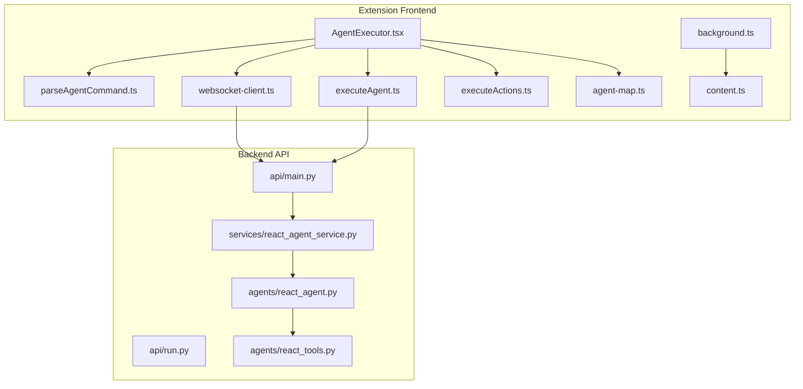
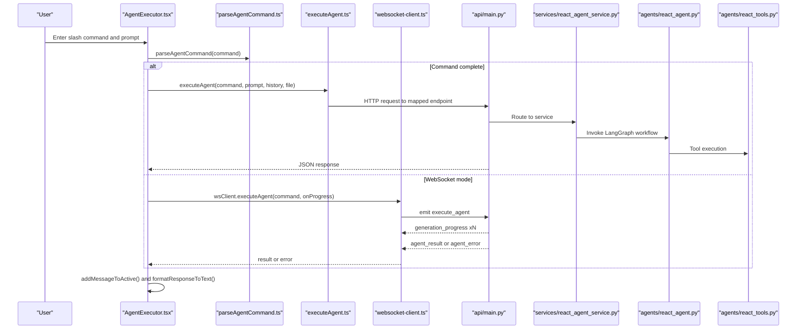
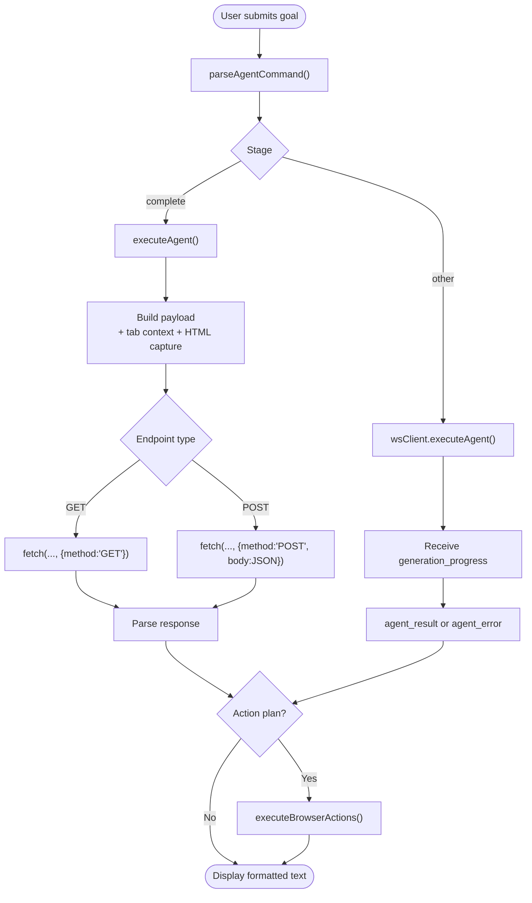
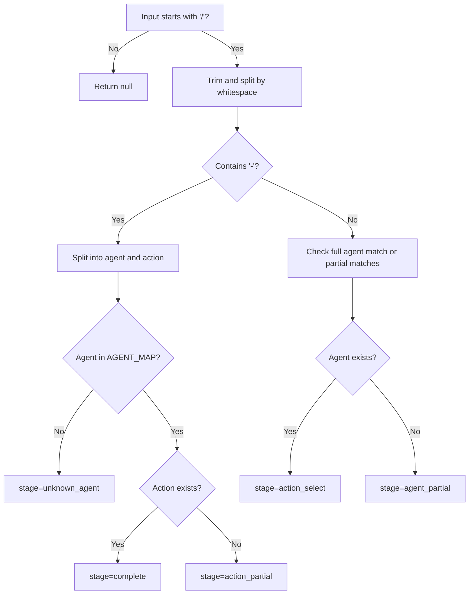
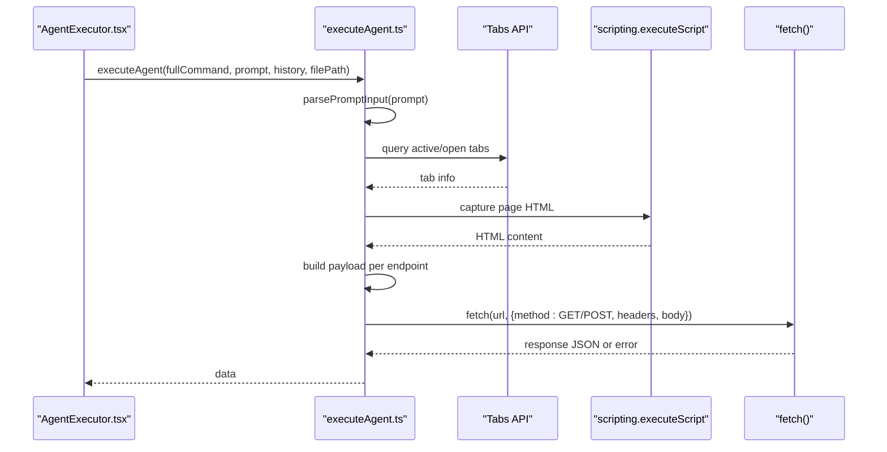
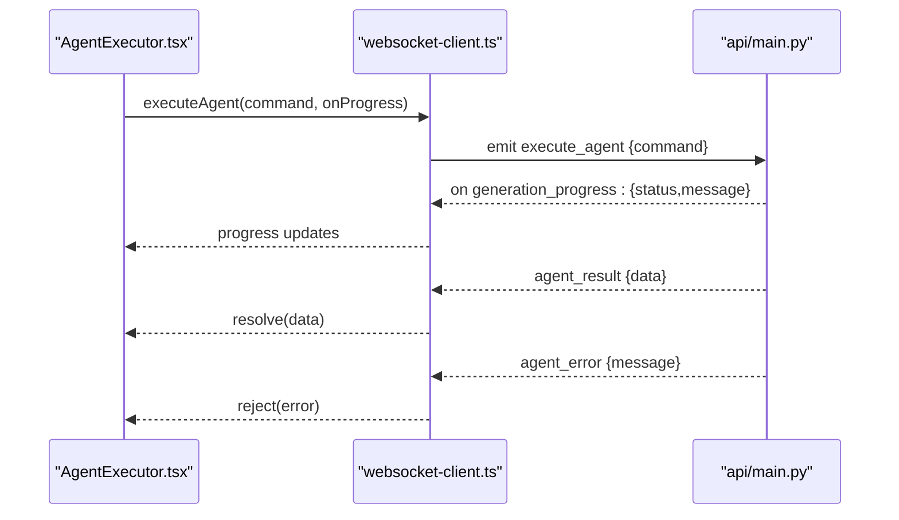
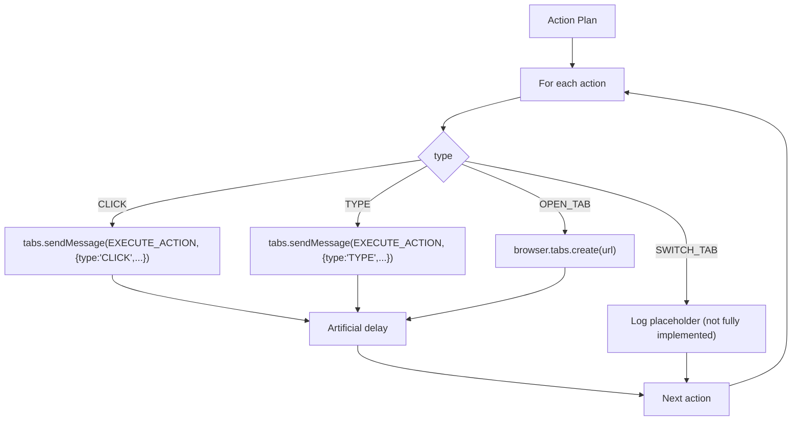
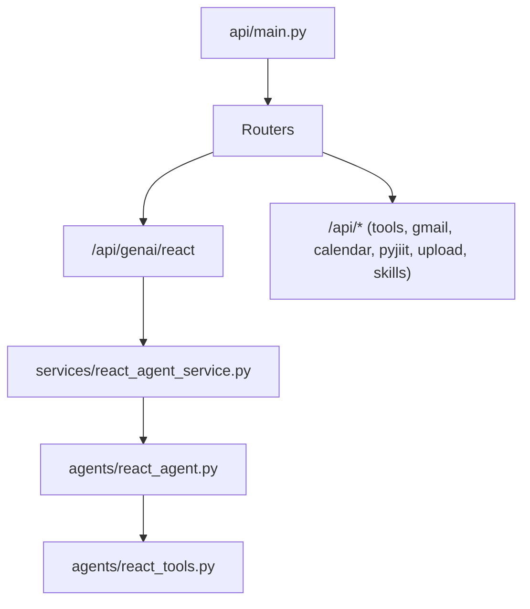
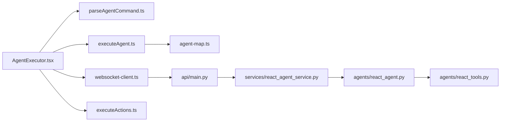

# Agent Execution Engine

<cite>
**Referenced Files in This Document**
- [AgentExecutor.tsx](file://extension/entrypoints/sidepanel/AgentExecutor.tsx)
- [executeAgent.ts](file://extension/entrypoints/utils/executeAgent.ts)
- [parseAgentCommand.ts](file://extension/entrypoints/utils/parseAgentCommand.ts)
- [executeActions.ts](file://extension/entrypoints/utils/executeActions.ts)
- [websocket-client.ts](file://extension/entrypoints/utils/websocket-client.ts)
- [agent-map.ts](file://extension/entrypoints/sidepanel/lib/agent-map.ts)
- [background.ts](file://extension/entrypoints/background.ts)
- [content.ts](file://extension/entrypoints/content.ts)
- [main.py](file://api/main.py)
- [run.py](file://api/run.py)
- [react_agent_service.py](file://services/react_agent_service.py)
- [react_agent.py](file://agents/react_agent.py)
- [react_tools.py](file://agents/react_tools.py)
</cite>

## Table of Contents
1. [Introduction](#introduction)
2. [Project Structure](#project-structure)
3. [Core Components](#core-components)
4. [Architecture Overview](#architecture-overview)
5. [Detailed Component Analysis](#detailed-component-analysis)
6. [Dependency Analysis](#dependency-analysis)
7. [Performance Considerations](#performance-considerations)
8. [Troubleshooting Guide](#troubleshooting-guide)
9. [Conclusion](#conclusion)

## Introduction
This document describes the Agent Execution Engine that powers AI agent interactions within the Agentic Browser extension. It focuses on:
- Orchestrating agent interactions via the AgentExecutor component
- Parsing user commands with parseAgentCommand
- Executing agent invocations with executeAgent
- Real-time streaming via WebSocket integration
- Conversation history management and session persistence
- Browser automation actions triggered by agent responses
- Backend orchestration for the React agent and tooling

## Project Structure
The Agent Execution Engine spans the extension UI, utilities, and the backend API:
- Frontend: React UI (AgentExecutor), command parsing, agent execution, WebSocket client, and browser automation helpers
- Backend: FastAPI application routing to specialized agent services and tools

**Diagram sources**
- [AgentExecutor.tsx](file://extension/entrypoints/sidepanel/AgentExecutor.tsx#L62-L516)
- [parseAgentCommand.ts](file://extension/entrypoints/utils/parseAgentCommand.ts#L5-L86)
- [executeAgent.ts](file://extension/entrypoints/utils/executeAgent.ts#L17-L317)
- [websocket-client.ts](file://extension/entrypoints/utils/websocket-client.ts#L8-L132)
- [executeActions.ts](file://extension/entrypoints/utils/executeActions.ts#L1-L57)
- [agent-map.ts](file://extension/entrypoints/sidepanel/lib/agent-map.ts#L1-L87)
- [background.ts](file://extension/entrypoints/background.ts#L17-L128)
- [content.ts](file://extension/entrypoints/content.ts#L1-L326)
- [main.py](file://api/main.py#L12-L47)
- [run.py](file://api/run.py#L4-L10)
- [react_agent_service.py](file://services/react_agent_service.py#L16-L154)
- [react_agent.py](file://agents/react_agent.py#L138-L191)
- [react_tools.py](file://agents/react_tools.py#L611-L726)

**Section sources**
- [AgentExecutor.tsx](file://extension/entrypoints/sidepanel/AgentExecutor.tsx#L62-L516)
- [main.py](file://api/main.py#L12-L47)

## Core Components
- AgentExecutor: The React component that renders the chat UI, manages sessions/history, parses commands, executes agent workflows, streams progress, and triggers browser actions.
- parseAgentCommand: Parses slash commands into agent/action stages and validates against AGENT_MAP.
- executeAgent: Builds payloads, resolves tab context, captures page HTML, normalizes URLs, and invokes backend endpoints via HTTP or WebSocket depending on the command.
- websocket-client: Provides a WebSocket client to execute agents in real-time with progress streaming and error propagation.
- executeActions: Executes browser automation actions (open tab, click, type) by messaging the active tab’s content script.
- agent-map: Central registry of agents and their endpoints.
- background.ts and content.ts: Extension background and content scripts that support tab management and DOM manipulation actions.

**Section sources**
- [AgentExecutor.tsx](file://extension/entrypoints/sidepanel/AgentExecutor.tsx#L62-L516)
- [parseAgentCommand.ts](file://extension/entrypoints/utils/parseAgentCommand.ts#L5-L86)
- [executeAgent.ts](file://extension/entrypoints/utils/executeAgent.ts#L17-L317)
- [websocket-client.ts](file://extension/entrypoints/utils/websocket-client.ts#L8-L132)
- [executeActions.ts](file://extension/entrypoints/utils/executeActions.ts#L1-L57)
- [agent-map.ts](file://extension/entrypoints/sidepanel/lib/agent-map.ts#L1-L87)
- [background.ts](file://extension/entrypoints/background.ts#L17-L128)
- [content.ts](file://extension/entrypoints/content.ts#L1-L326)

## Architecture Overview
The engine supports two execution modes:
- Direct HTTP execution: executeAgent constructs payloads and sends POST/GET requests to backend endpoints.
- WebSocket execution: AgentExecutor uses wsClient to emit “execute_agent” and receive “generation_progress”, “agent_result”, and “agent_error”.

**Diagram sources**
- [AgentExecutor.tsx](file://extension/entrypoints/sidepanel/AgentExecutor.tsx#L323-L516)
- [parseAgentCommand.ts](file://extension/entrypoints/utils/parseAgentCommand.ts#L5-L86)
- [executeAgent.ts](file://extension/entrypoints/utils/executeAgent.ts#L17-L317)
- [websocket-client.ts](file://extension/entrypoints/utils/websocket-client.ts#L61-L91)
- [main.py](file://api/main.py#L14-L42)
- [react_agent_service.py](file://services/react_agent_service.py#L16-L154)
- [react_agent.py](file://agents/react_agent.py#L138-L191)
- [react_tools.py](file://agents/react_tools.py#L611-L726)

## Detailed Component Analysis

### AgentExecutor Component
Responsibilities:
- Manages sessions and conversation history persisted in browser storage
- Renders chat UI, handles voice input, file attachments, and slash-command suggestions
- Parses commands and decides between direct HTTP execution and WebSocket execution
- Streams progress updates and displays formatted responses
- Executes browser actions when agent responses include structured action plans

Key behaviors:
- Session lifecycle: load/save sessions, migrate legacy chat history, auto-scroll to latest message
- Slash command UX: dynamic suggestions for agents/actions, mention menu for tabs
- Execution flow: default to “react-ask” when no slash command; otherwise route to mapped endpoint
- Response handling: supports both JSON action plans and textual answers with embedded JSON blocks

**Diagram sources**
- [AgentExecutor.tsx](file://extension/entrypoints/sidepanel/AgentExecutor.tsx#L323-L516)
- [executeAgent.ts](file://extension/entrypoints/utils/executeAgent.ts#L17-L317)
- [websocket-client.ts](file://extension/entrypoints/utils/websocket-client.ts#L61-L91)
- [executeActions.ts](file://extension/entrypoints/utils/executeActions.ts#L1-L57)

**Section sources**
- [AgentExecutor.tsx](file://extension/entrypoints/sidepanel/AgentExecutor.tsx#L112-L176)
- [AgentExecutor.tsx](file://extension/entrypoints/sidepanel/AgentExecutor.tsx#L323-L516)

### parseAgentCommand Utility
Purpose:
- Normalize slash commands by trimming and taking the first token
- Resolve agent/action stages: agent_select, action_select, agent_partial, action_partial, unknown_agent, complete
- Validate against AGENT_MAP keys and action keys

Behavior highlights:
- If no “-” in the agent token, treat as agent match or partial match
- If “agent-action” present, validate both agent and action exist in AGENT_MAP
- Return structured stages to guide UI suggestions and execution

**Diagram sources**
- [parseAgentCommand.ts](file://extension/entrypoints/utils/parseAgentCommand.ts#L5-L86)
- [agent-map.ts](file://extension/entrypoints/sidepanel/lib/agent-map.ts#L1-L87)

**Section sources**
- [parseAgentCommand.ts](file://extension/entrypoints/utils/parseAgentCommand.ts#L5-L86)
- [agent-map.ts](file://extension/entrypoints/sidepanel/lib/agent-map.ts#L1-L87)

### executeAgent Utility
Purpose:
- Translate parsed commands into backend requests
- Resolve tab context, capture page HTML, normalize URLs, and attach files
- Construct payloads tailored to each endpoint
- Handle special endpoints with GET vs POST semantics

Key processing steps:
- Parse prompt input to extract explicit URLs and clean text
- Resolve @mentions to active tab or matching tab title/url
- Capture client HTML for context-aware agents
- Normalize GitHub URLs to repository base when appropriate
- Build payloads for:
  - React agent: question + chat_history + tokens + optional HTML + file path
  - YouTube/Website/GitHub: url + question + chat_history + optional HTML + file path
  - Browser action script generator: goal + target_url + DOM structure + constraints
  - Skills execution: skill_name + prompt + chat_history + tokens + optional HTML + file path
  - JIIT login/attendance: credentials/session payloads
- Dispatch GET for health endpoint, otherwise POST with JSON body
- Return parsed JSON or throw formatted HTTP errors

**Diagram sources**
- [executeAgent.ts](file://extension/entrypoints/utils/executeAgent.ts#L17-L317)

**Section sources**
- [executeAgent.ts](file://extension/entrypoints/utils/executeAgent.ts#L17-L317)

### WebSocket Communication
The wsClient encapsulates:
- Connection lifecycle with automatic reconnection
- Event-driven progress streaming (“generation_progress”)
- Request/response pairing via “execute_agent” and “agent_result”
- Error propagation via “agent_error”

AgentExecutor integrates wsClient when the command is not yet complete or when WebSocket mode is preferred.

**Diagram sources**
- [websocket-client.ts](file://extension/entrypoints/utils/websocket-client.ts#L61-L91)
- [AgentExecutor.tsx](file://extension/entrypoints/sidepanel/AgentExecutor.tsx#L455-L516)

**Section sources**
- [websocket-client.ts](file://extension/entrypoints/utils/websocket-client.ts#L8-L132)
- [AgentExecutor.tsx](file://extension/entrypoints/sidepanel/AgentExecutor.tsx#L455-L516)

### Browser Automation Actions
When agent responses include structured action plans, AgentExecutor executes them:
- OPEN_TAB: create a new tab with a given URL
- SWITCH_TAB: switch to a specific tab (placeholder)
- CLICK/TYPE: message the active tab’s content script to perform DOM interactions

**Diagram sources**
- [executeActions.ts](file://extension/entrypoints/utils/executeActions.ts#L1-L57)
- [background.ts](file://extension/entrypoints/background.ts#L428-L514)
- [content.ts](file://extension/entrypoints/content.ts#L220-L323)

**Section sources**
- [executeActions.ts](file://extension/entrypoints/utils/executeActions.ts#L1-L57)
- [background.ts](file://extension/entrypoints/background.ts#L428-L514)
- [content.ts](file://extension/entrypoints/content.ts#L220-L323)

### Backend Orchestration
The backend routes requests to specialized services:
- FastAPI app includes routers for React agent, tools, calendars, Gmail, YouTube, websites, GitHub, JIIT portal, file upload, and skills
- React agent service builds a LangGraph workflow, converts chat history to LangChain messages, optionally injects page context, and invokes the compiled graph
- Tools are dynamically built from context (Google token, PyJIIT session) and include GitHub, web search, website QA, YouTube QA, Gmail operations, calendar operations, and browser/python/bash agents

**Diagram sources**
- [main.py](file://api/main.py#L14-L42)
- [react_agent_service.py](file://services/react_agent_service.py#L16-L154)
- [react_agent.py](file://agents/react_agent.py#L138-L191)
- [react_tools.py](file://agents/react_tools.py#L611-L726)

**Section sources**
- [main.py](file://api/main.py#L14-L42)
- [run.py](file://api/run.py#L4-L10)
- [react_agent_service.py](file://services/react_agent_service.py#L16-L154)
- [react_agent.py](file://agents/react_agent.py#L138-L191)
- [react_tools.py](file://agents/react_tools.py#L611-L726)

## Dependency Analysis
- AgentExecutor depends on:
  - parseAgentCommand for command interpretation
  - executeAgent for HTTP execution
  - wsClient for WebSocket execution
  - executeActions for browser automation
  - agent-map for endpoint resolution
- executeAgent depends on:
  - AGENT_MAP for endpoint mapping
  - browser APIs for tabs, scripting, storage
  - URL normalization and HTML capture
- wsClient depends on:
  - Socket.IO client and emits/receives events
- Backend depends on:
  - LangGraph workflow and tool registry
  - Tool implementations for external integrations

**Diagram sources**
- [AgentExecutor.tsx](file://extension/entrypoints/sidepanel/AgentExecutor.tsx#L62-L516)
- [parseAgentCommand.ts](file://extension/entrypoints/utils/parseAgentCommand.ts#L5-L86)
- [executeAgent.ts](file://extension/entrypoints/utils/executeAgent.ts#L17-L317)
- [websocket-client.ts](file://extension/entrypoints/utils/websocket-client.ts#L8-L132)
- [agent-map.ts](file://extension/entrypoints/sidepanel/lib/agent-map.ts#L1-L87)
- [main.py](file://api/main.py#L14-L42)
- [react_agent_service.py](file://services/react_agent_service.py#L16-L154)
- [react_agent.py](file://agents/react_agent.py#L138-L191)
- [react_tools.py](file://agents/react_tools.py#L611-L726)

**Section sources**
- [AgentExecutor.tsx](file://extension/entrypoints/sidepanel/AgentExecutor.tsx#L62-L516)
- [executeAgent.ts](file://extension/entrypoints/utils/executeAgent.ts#L17-L317)
- [websocket-client.ts](file://extension/entrypoints/utils/websocket-client.ts#L8-L132)
- [main.py](file://api/main.py#L14-L42)

## Performance Considerations
- Payload size: Limit DOM capture and HTML payloads; the DOM extraction caps interactive elements to reduce payload size.
- Network efficiency: Use GET for lightweight health checks; POST for richer payloads.
- Streaming: Prefer WebSocket execution for long-running tasks to provide incremental progress updates.
- Tab operations: Avoid unnecessary tab queries; cache active tab URL when available.
- Tool execution: Batch actions with small delays to prevent overwhelming the page context.

[No sources needed since this section provides general guidance]

## Troubleshooting Guide
Common issues and strategies:
- Command parsing failures:
  - Ensure slash commands follow the “agent-action” pattern or start with “/”
  - Use agent/action suggestions to validate spelling and availability
- WebSocket connectivity:
  - Verify wsClient is connected; reconnect attempts are automatic
  - Inspect “connection_status” events and error messages
- HTTP errors:
  - executeAgent throws formatted errors with HTTP status and body text
  - For file upload endpoint, use the attachment button; direct slash command without a file is rejected
- Tab context and HTML capture:
  - If no active tab is found, fallback to empty context
  - HTML capture failures are logged; ensure permissions and tab availability
- Browser actions:
  - CLICK/TYPE rely on content script messaging; ensure the active tab is reachable
  - SWITCH_TAB is a placeholder; implement tab lookup logic if needed

**Section sources**
- [parseAgentCommand.ts](file://extension/entrypoints/utils/parseAgentCommand.ts#L5-L86)
- [websocket-client.ts](file://extension/entrypoints/utils/websocket-client.ts#L17-L40)
- [executeAgent.ts](file://extension/entrypoints/utils/executeAgent.ts#L228-L232)
- [executeAgent.ts](file://extension/entrypoints/utils/executeAgent.ts#L96-L112)
- [executeActions.ts](file://extension/entrypoints/utils/executeActions.ts#L23-L44)

## Conclusion
The Agent Execution Engine combines a React-driven UI, robust command parsing, flexible execution modes (HTTP/WebSocket), and integrated browser automation to deliver a seamless agent experience. Its modular design allows easy extension of agents and tools while maintaining clear separation of concerns between frontend orchestration and backend processing.