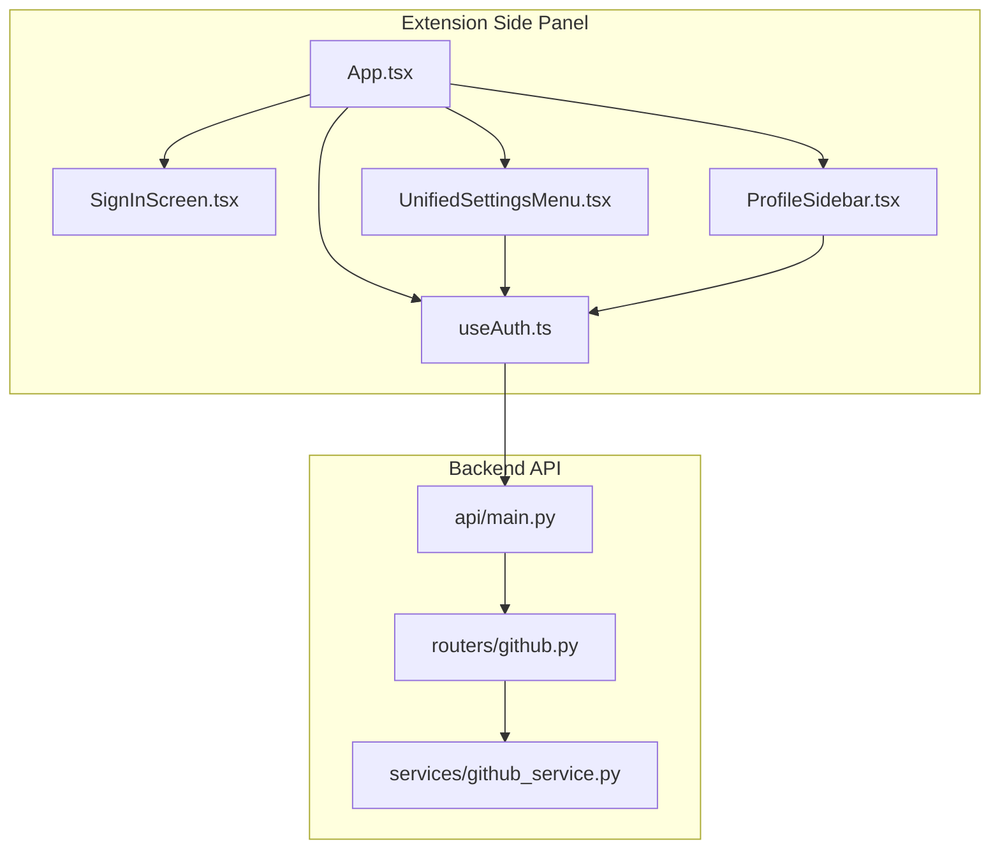
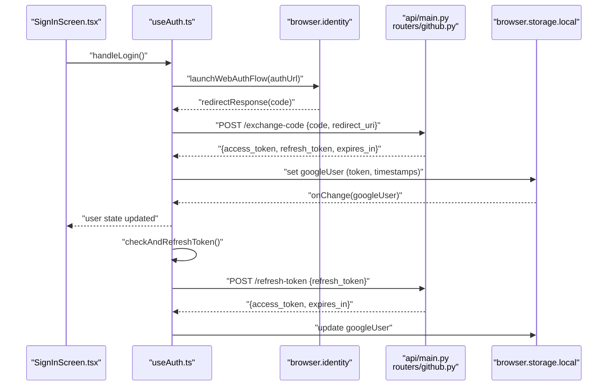
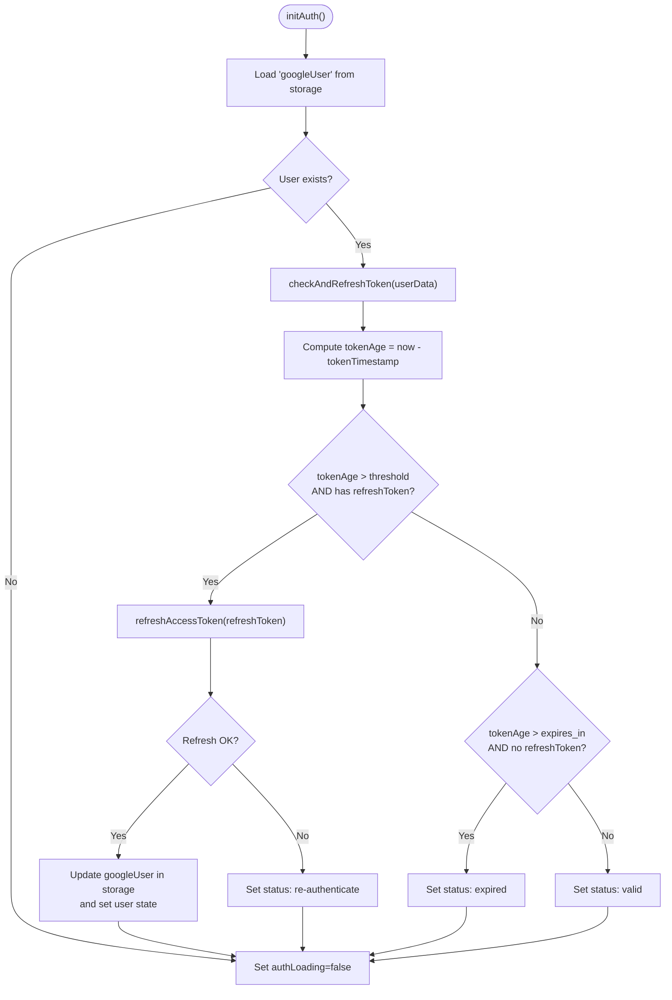
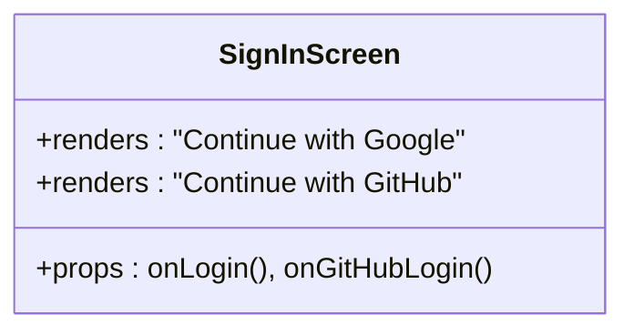
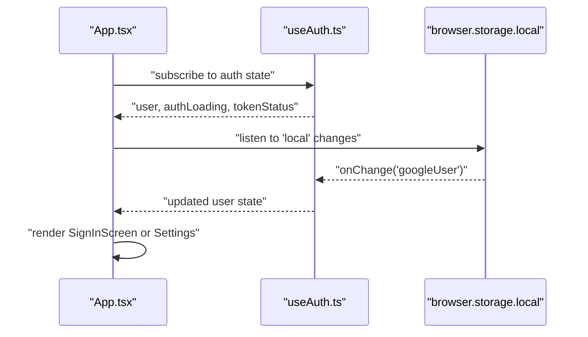
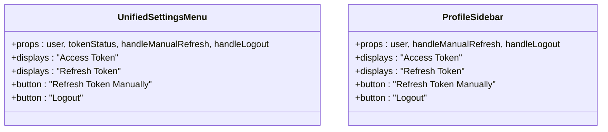
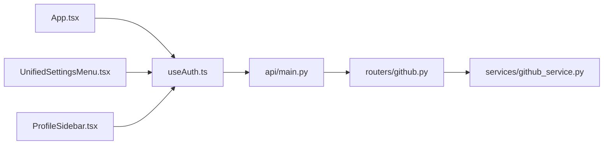

# Authentication System

<cite>
**Referenced Files in This Document**
- [useAuth.ts](file://extension/entrypoints/sidepanel/hooks/useAuth.ts)
- [SignInScreen.tsx](file://extension/entrypoints/sidepanel/components/SignInScreen.tsx)
- [App.tsx](file://extension/entrypoints/sidepanel/App.tsx)
- [ProfileSidebar.tsx](file://extension/entrypoints/sidepanel/components/ProfileSidebar.tsx)
- [UnifiedSettingsMenu.tsx](file://extension/entrypoints/sidepanel/components/UnifiedSettingsMenu.tsx)
- [main.py](file://api/main.py)
- [github.py](file://routers/github.py)
- [github_service.py](file://services/github_service.py)
</cite>

## Table of Contents
1. [Introduction](#introduction)
2. [Project Structure](#project-structure)
3. [Core Components](#core-components)
4. [Architecture Overview](#architecture-overview)
5. [Detailed Component Analysis](#detailed-component-analysis)
6. [Dependency Analysis](#dependency-analysis)
7. [Performance Considerations](#performance-considerations)
8. [Troubleshooting Guide](#troubleshooting-guide)
9. [Conclusion](#conclusion)

## Introduction
This document explains the Authentication System for the Agentic Browser extension. It focuses on:
- The useAuth hook that manages user authentication state, token handling, and session management
- The SignInScreen component that provides login interfaces for Google OAuth and a demo GitHub flow
- The authentication flow from initial login through token refresh cycles
- Browser storage integration and automatic logout mechanisms
- Examples of authentication state management, error handling, and security considerations
- Backend integration points and token validation processes

## Project Structure
The authentication system spans the extension’s side panel (React + browser APIs) and the backend (FastAPI). The key files are:
- Hook for authentication state and token lifecycle
- Login UI component
- Application shell that renders the login screen or settings based on auth state
- Settings UI that displays tokens and exposes manual refresh/logout actions
- Backend API surface for token exchange and refresh

**Diagram sources**
- [App.tsx](file://extension/entrypoints/sidepanel/App.tsx#L11-L25)
- [SignInScreen.tsx](file://extension/entrypoints/sidepanel/components/SignInScreen.tsx#L17-L17)
- [useAuth.ts](file://extension/entrypoints/sidepanel/hooks/useAuth.ts#L17-L42)
- [ProfileSidebar.tsx](file://extension/entrypoints/sidepanel/components/ProfileSidebar.tsx#L149-L207)
- [UnifiedSettingsMenu.tsx](file://extension/entrypoints/sidepanel/components/UnifiedSettingsMenu.tsx#L992-L1032)
- [main.py](file://api/main.py#L12-L40)
- [github.py](file://routers/github.py#L1-L49)
- [github_service.py](file://services/github_service.py#L11-L109)

**Section sources**
- [App.tsx](file://extension/entrypoints/sidepanel/App.tsx#L11-L25)
- [useAuth.ts](file://extension/entrypoints/sidepanel/hooks/useAuth.ts#L17-L42)
- [SignInScreen.tsx](file://extension/entrypoints/sidepanel/components/SignInScreen.tsx#L17-L17)
- [main.py](file://api/main.py#L12-L40)

## Core Components
- useAuth hook
  - Initializes auth state from browser local storage
  - Detects token age and refreshes automatically when appropriate
  - Exposes login via browser.identity OAuth, GitHub demo login, logout, and manual refresh
  - Provides helpers to compute token age and expiry
- SignInScreen component
  - Renders two login options: Google OAuth and GitHub demo
  - Uses styled buttons and animations for UX
- App shell
  - Renders SignInScreen when unauthenticated or UnifiedSettingsMenu when authenticated
  - Handles first-time setup redirection flag
- Settings UI
  - Displays token info and exposes manual refresh and logout actions

**Section sources**
- [useAuth.ts](file://extension/entrypoints/sidepanel/hooks/useAuth.ts#L17-L42)
- [SignInScreen.tsx](file://extension/entrypoints/sidepanel/components/SignInScreen.tsx#L17-L17)
- [App.tsx](file://extension/entrypoints/sidepanel/App.tsx#L157-L165)
- [ProfileSidebar.tsx](file://extension/entrypoints/sidepanel/components/ProfileSidebar.tsx#L149-L207)
- [UnifiedSettingsMenu.tsx](file://extension/entrypoints/sidepanel/components/UnifiedSettingsMenu.tsx#L992-L1032)

## Architecture Overview
The authentication flow integrates browser identity APIs, a backend service, and local storage. The diagram below maps the actual code paths.

**Diagram sources**
- [SignInScreen.tsx](file://extension/entrypoints/sidepanel/components/SignInScreen.tsx#L194-L249)
- [useAuth.ts](file://extension/entrypoints/sidepanel/hooks/useAuth.ts#L128-L207)
- [main.py](file://api/main.py#L12-L40)
- [github.py](file://routers/github.py#L1-L49)

## Detailed Component Analysis

### useAuth Hook
The hook encapsulates:
- Initialization from browser storage
- Automatic token refresh based on token age
- Manual refresh and logout
- Token age/expiry computation
- First-time setup flag handling

Key behaviors:
- On mount, reads stored user data and triggers token refresh checks
- Uses a threshold to decide whether to refresh the access token
- Persists updated tokens back to storage and updates React state
- Exposes handlers for Google OAuth login, GitHub demo login, logout, and manual refresh
- Provides UI helpers to display token age and expiry

**Diagram sources**
- [useAuth.ts](file://extension/entrypoints/sidepanel/hooks/useAuth.ts#L60-L126)

**Section sources**
- [useAuth.ts](file://extension/entrypoints/sidepanel/hooks/useAuth.ts#L17-L42)
- [useAuth.ts](file://extension/entrypoints/sidepanel/hooks/useAuth.ts#L60-L126)
- [useAuth.ts](file://extension/entrypoints/sidepanel/hooks/useAuth.ts#L128-L207)
- [useAuth.ts](file://extension/entrypoints/sidepanel/hooks/useAuth.ts#L210-L236)
- [useAuth.ts](file://extension/entrypoints/sidepanel/hooks/useAuth.ts#L238-L242)
- [useAuth.ts](file://extension/entrypoints/sidepanel/hooks/useAuth.ts#L244-L269)
- [useAuth.ts](file://extension/entrypoints/sidepanel/hooks/useAuth.ts#L271-L295)

### SignInScreen Component
The component renders:
- A hero section with animated visuals
- Two login buttons:
  - Continue with Google (OAuth)
  - Continue with GitHub (demo bypass)
- Responsive styling and hover effects

**Diagram sources**
- [SignInScreen.tsx](file://extension/entrypoints/sidepanel/components/SignInScreen.tsx#L12-L17)
- [SignInScreen.tsx](file://extension/entrypoints/sidepanel/components/SignInScreen.tsx#L193-L291)

**Section sources**
- [SignInScreen.tsx](file://extension/entrypoints/sidepanel/components/SignInScreen.tsx#L17-L17)
- [SignInScreen.tsx](file://extension/entrypoints/sidepanel/components/SignInScreen.tsx#L193-L291)

### App Shell Integration
The App component:
- Consumes useAuth to determine whether to render SignInScreen or UnifiedSettingsMenu
- Handles first-time setup redirection based on a storage flag
- Subscribes to storage changes to stay in sync with the hook

**Diagram sources**
- [App.tsx](file://extension/entrypoints/sidepanel/App.tsx#L11-L25)
- [App.tsx](file://extension/entrypoints/sidepanel/App.tsx#L45-L49)
- [useAuth.ts](file://extension/entrypoints/sidepanel/hooks/useAuth.ts#L24-L42)

**Section sources**
- [App.tsx](file://extension/entrypoints/sidepanel/App.tsx#L11-L25)
- [App.tsx](file://extension/entrypoints/sidepanel/App.tsx#L45-L49)
- [useAuth.ts](file://extension/entrypoints/sidepanel/hooks/useAuth.ts#L24-L42)

### Settings UI (Tokens and Actions)
The settings UI surfaces:
- Access token visibility toggle
- Refresh token visibility toggle (blurred)
- Manual refresh button (when refresh token present)
- Logout button

**Diagram sources**
- [UnifiedSettingsMenu.tsx](file://extension/entrypoints/sidepanel/components/UnifiedSettingsMenu.tsx#L992-L1032)
- [ProfileSidebar.tsx](file://extension/entrypoints/sidepanel/components/ProfileSidebar.tsx#L149-L207)

**Section sources**
- [UnifiedSettingsMenu.tsx](file://extension/entrypoints/sidepanel/components/UnifiedSettingsMenu.tsx#L992-L1032)
- [ProfileSidebar.tsx](file://extension/entrypoints/sidepanel/components/ProfileSidebar.tsx#L149-L207)

## Dependency Analysis
- Frontend-to-backend dependencies
  - useAuth.ts calls backend endpoints for token exchange and refresh
  - App.tsx depends on useAuth for rendering decisions
  - Settings components depend on useAuth for token display and actions
- Backend routing
  - api/main.py registers routers under various prefixes
  - routers/github.py defines a GitHub endpoint used by services
  - services/github_service.py orchestrates GitHub-related operations

**Diagram sources**
- [useAuth.ts](file://extension/entrypoints/sidepanel/hooks/useAuth.ts#L72-L89)
- [main.py](file://api/main.py#L12-L40)
- [github.py](file://routers/github.py#L1-L49)
- [github_service.py](file://services/github_service.py#L11-L109)
- [App.tsx](file://extension/entrypoints/sidepanel/App.tsx#L11-L25)
- [UnifiedSettingsMenu.tsx](file://extension/entrypoints/sidepanel/components/UnifiedSettingsMenu.tsx#L992-L1032)
- [ProfileSidebar.tsx](file://extension/entrypoints/sidepanel/components/ProfileSidebar.tsx#L149-L207)

**Section sources**
- [useAuth.ts](file://extension/entrypoints/sidepanel/hooks/useAuth.ts#L72-L89)
- [main.py](file://api/main.py#L12-L40)
- [github.py](file://routers/github.py#L1-L49)
- [github_service.py](file://services/github_service.py#L11-L109)

## Performance Considerations
- Token refresh threshold
  - The hook refreshes tokens before they reach a configured age threshold, reducing latency during requests
- Local storage synchronization
  - Subscribing to storage changes ensures UI remains consistent across sessions
- UI responsiveness
  - Loading states and alerts provide feedback during long-running operations like OAuth and network requests

[No sources needed since this section provides general guidance]

## Troubleshooting Guide
Common issues and resolutions:
- Authentication cancelled or denied
  - The hook detects cancellation/denial keywords and shows a user-friendly alert
- Backend service not running
  - Errors during token exchange or refresh trigger alerts instructing to verify backend availability
- Token expired or refresh failed
  - The hook sets explicit status messages and advises re-authentication when refresh fails
- Manual refresh unavailable
  - If no refresh token is present, the UI disables manual refresh and prompts re-login

**Section sources**
- [useAuth.ts](file://extension/entrypoints/sidepanel/hooks/useAuth.ts#L190-L207)
- [useAuth.ts](file://extension/entrypoints/sidepanel/hooks/useAuth.ts#L191-L204)
- [useAuth.ts](file://extension/entrypoints/sidepanel/hooks/useAuth.ts#L271-L295)

## Security Considerations
- Token storage
  - Tokens are stored in browser local storage; consider encrypting sensitive fields for production
- Token exposure
  - The settings UI supports toggling token visibility; use caution when sharing screens
- Refresh token handling
  - Refresh tokens enable seamless renewal; ensure secure transport and storage
- OAuth consent
  - The Google OAuth flow requests offline access and broad scopes; review and minimize scopes as needed

[No sources needed since this section provides general guidance]

## Conclusion
The Authentication System combines a React hook, a browser-native OAuth flow, and a backend service to deliver a robust login experience. It supports automatic token refresh, manual refresh, logout, and persistent session state across browser restarts via local storage. The UI components provide clear feedback and controls for token management, while the backend routes integrate with services that consume authenticated tokens.