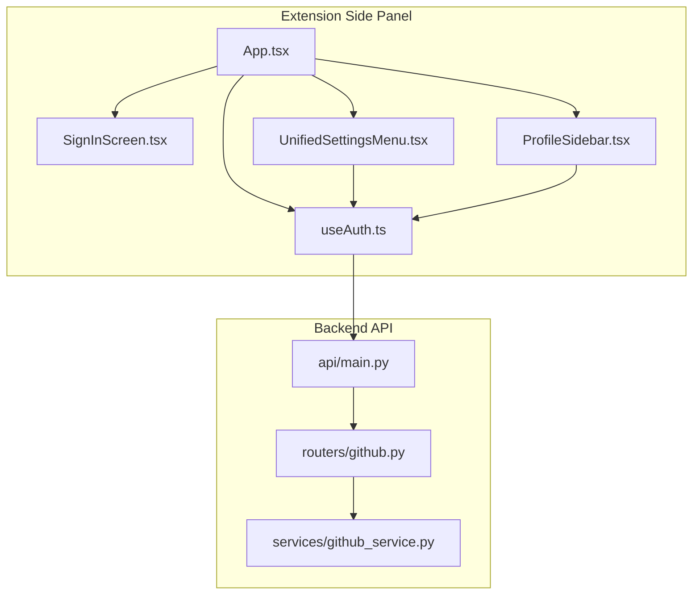
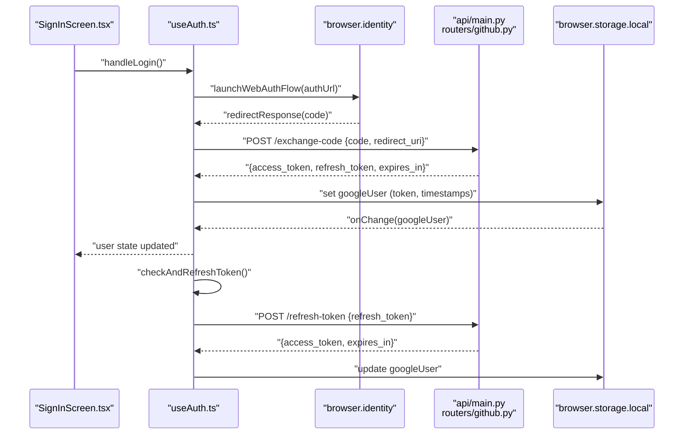
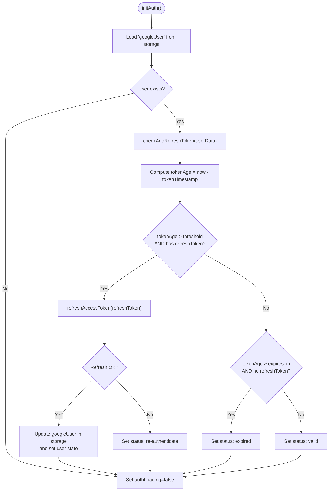
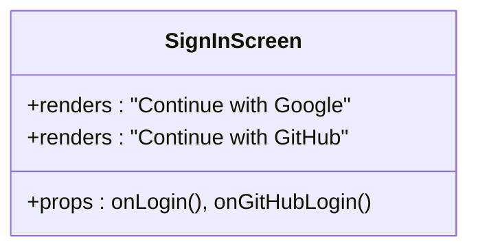
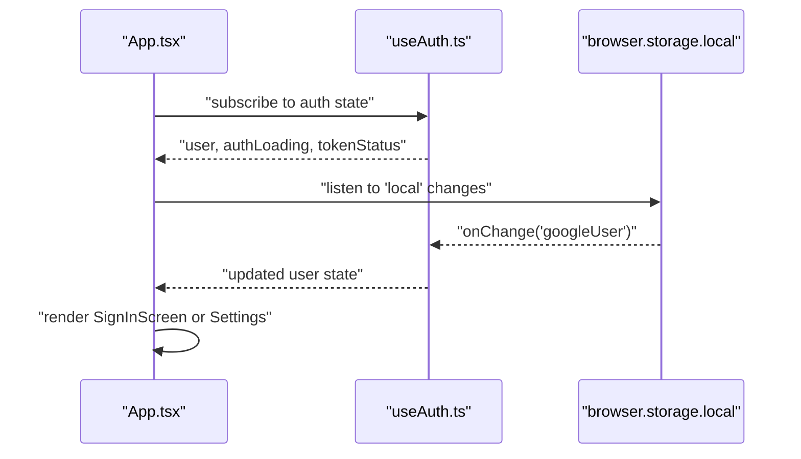
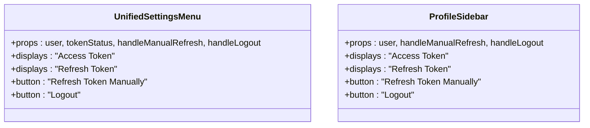
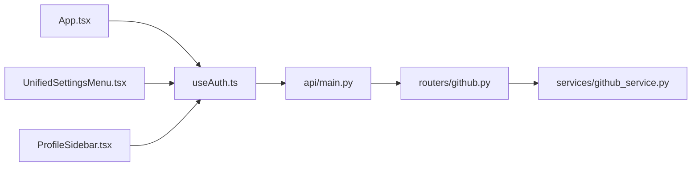

# Authentication system

## Introduction
This page explains the Authentication System for the Agentic Browser extension. It focuses on:
- The useAuth hook that manages user authentication state, token handling, and session management
- The SignInScreen component that provides login interfaces for Google OAuth and a demo GitHub flow
- The authentication flow from initial login through token refresh cycles
- Browser storage integration and automatic logout mechanisms
- Examples of authentication state management, error handling, and security considerations
- Backend integration points and token validation processes

## Project structure
The authentication system spans the extension's side panel (React + browser APIs) and the backend (FastAPI). The key files are:
- Hook for authentication state and token lifecycle
- Login UI component
- Application shell that renders the login screen or settings based on auth state
- Settings UI that displays tokens and exposes manual refresh/logout actions
- Backend API surface for token exchange and refresh

```mermaid
graph TB
subgraph "Extension Side Panel"
A_App["App.tsx"]
A_SignIn["SignInScreen.tsx"]
A_Hook["useAuth.ts"]
A_Profile["ProfileSidebar.tsx"]
A_Settings["UnifiedSettingsMenu.tsx"]
end
subgraph "Backend API"
B_API["api/main.py"]
B_Router["routers/github.py"]
B_Service["services/github_service.py"]
end
A_App --> A_SignIn
A_App --> A_Settings
A_App --> A_Profile
A_App --> A_Hook
A_Hook --> B_API
A_Settings --> A_Hook
A_Profile --> A_Hook
B_API --> B_Router
B_Router --> B_Service
```

## Core components
- useAuth hook
  - Initializes auth state from browser local storage
  - Detects token age and refreshes automatically when appropriate
  - Exposes login via browser.identity OAuth, GitHub demo login, logout, and manual refresh
  - Provides helpers to compute token age and expiry
- SignInScreen component
  - Renders two login options: Google OAuth and GitHub demo
  - Uses styled buttons and animations for UX
- App shell
  - Renders SignInScreen when unauthenticated or UnifiedSettingsMenu when authenticated
  - Handles first-time setup redirection flag
- Settings UI
  - Displays token info and exposes manual refresh and logout actions

## Architecture overview
The authentication flow integrates browser identity APIs, a backend service, and local storage. The diagram below maps the actual code paths.

```mermaid
sequenceDiagram
participant UI as "SignInScreen.tsx"
participant Hook as "useAuth.ts"
participant Browser as "browser.identity"
participant Backend as "api/main.py<br/>routers/github.py"
participant Store as "browser.storage.local"
UI->>Hook : "handleLogin()"
Hook->>Browser : "launchWebAuthFlow(authUrl)"
Browser-->>Hook : "redirectResponse(code)"
Hook->>Backend : "POST /exchange-code {code, redirect_uri}"
Backend-->>Hook : "{access_token, refresh_token, expires_in}"
Hook->>Store : "set googleUser (token, timestamps)"
Store-->>Hook : "onChange(googleUser)"
Hook-->>UI : "user state updated"
Hook->>Hook : "checkAndRefreshToken()"
Hook->>Backend : "POST /refresh-token {refresh_token}"
Backend-->>Hook : "{access_token, expires_in}"
Hook->>Store : "update googleUser"
```

## Detailed component analysis

### useAuth hook
The hook encapsulates:
- Initialization from browser storage
- Automatic token refresh based on token age
- Manual refresh and logout
- Token age/expiry computation
- First-time setup flag handling

Key behaviors:
- On mount, reads stored user data and triggers token refresh checks
- Uses a threshold to decide whether to refresh the access token
- Persists updated tokens back to storage and updates React state
- Exposes handlers for Google OAuth login, GitHub demo login, logout, and manual refresh
- Provides UI helpers to display token age and expiry

```mermaid
flowchart TD
Start(["initAuth()"]) --> Load["Load 'googleUser' from storage"]
Load --> HasUser{"User exists?"}
HasUser --> |No| DoneInit["Set authLoading=false"]
HasUser --> |Yes| Check["checkAndRefreshToken(userData)"]
Check --> Age["Compute tokenAge = now - tokenTimestamp"]
Age --> NeedsRefresh{"tokenAge > threshold<br/>AND has refreshToken?"}
NeedsRefresh --> |Yes| Refresh["refreshAccessToken(refreshToken)"]
Refresh --> RefreshOK{"Refresh OK?"}
RefreshOK --> |Yes| Save["Update googleUser in storage<br/>and set user state"]
RefreshOK --> |No| StatusFail["Set status: re-authenticate"]
NeedsRefresh --> |No| Expired{"tokenAge > expires_in<br/>AND no refreshToken?"}
Expired --> |Yes| StatusExpire["Set status: expired"]
Expired --> |No| StatusValid["Set status: valid"]
Save --> DoneInit
StatusFail --> DoneInit
StatusExpire --> DoneInit
StatusValid --> DoneInit
```

### SignInScreen component
The component renders:
- A hero section with animated visuals
- Two login buttons:
  - Continue with Google (OAuth)
  - Continue with GitHub (demo bypass)
- Responsive styling and hover effects

```mermaid
classDiagram
class SignInScreen {
+props : onLogin(), onGitHubLogin()
+renders : "Continue with Google"
+renders : "Continue with GitHub"
}
```

### App shell integration
The App component:
- Consumes useAuth to determine whether to render SignInScreen or UnifiedSettingsMenu
- Handles first-time setup redirection based on a storage flag
- Subscribes to storage changes to stay in sync with the hook

```mermaid
sequenceDiagram
participant App as "App.tsx"
participant Hook as "useAuth.ts"
participant Store as "browser.storage.local"
App->>Hook : "subscribe to auth state"
Hook-->>App : "user, authLoading, tokenStatus"
App->>Store : "listen to 'local' changes"
Store-->>Hook : "onChange('googleUser')"
Hook-->>App : "updated user state"
App->>App : "render SignInScreen or Settings"
```

### Settings UI (tokens and actions)
The settings UI surfaces:
- Access token visibility toggle
- Refresh token visibility toggle (blurred)
- Manual refresh button (when refresh token present)
- Logout button

```mermaid
classDiagram
class UnifiedSettingsMenu {
+props : user, tokenStatus, handleManualRefresh, handleLogout
+displays : "Access Token"
+displays : "Refresh Token"
+button : "Refresh Token Manually"
+button : "Logout"
}
class ProfileSidebar {
+props : user, handleManualRefresh, handleLogout
+displays : "Access Token"
+displays : "Refresh Token"
+button : "Refresh Token Manually"
+button : "Logout"
}
```

## Dependency analysis
- Frontend-to-backend dependencies
  - useAuth.ts calls backend endpoints for token exchange and refresh
  - App.tsx depends on useAuth for rendering decisions
  - Settings components depend on useAuth for token display and actions
- Backend routing
  - api/main.py registers routers under various prefixes
  - routers/github.py defines a GitHub endpoint used by services
  - services/github_service.py orchestrates GitHub-related operations

```mermaid
graph LR
Hook["useAuth.ts"] --> Backend["api/main.py"]
Backend --> Routers["routers/github.py"]
Routers --> Service["services/github_service.py"]
App["App.tsx"] --> Hook
Settings["UnifiedSettingsMenu.tsx"] --> Hook
Sidebar["ProfileSidebar.tsx"] --> Hook
```

## Performance considerations
- Token refresh threshold
  - The hook refreshes tokens before they reach a configured age threshold, reducing latency during requests
- Local storage synchronization
  - Subscribing to storage changes ensures UI remains consistent across sessions
- UI responsiveness
  - Loading states and alerts provide feedback during long-running operations like OAuth and network requests

[No sources needed since this section provides general guidance]

## Troubleshooting guide
Common issues and resolutions:
- Authentication cancelled or denied
  - The hook detects cancellation/denial keywords and shows a user-friendly alert
- Backend service not running
  - Errors during token exchange or refresh trigger alerts instructing to verify backend availability
- Token expired or refresh failed
  - The hook sets explicit status messages and advises re-authentication when refresh fails
- Manual refresh unavailable
  - If no refresh token is present, the UI disables manual refresh and prompts re-login

## Security considerations
- Token storage
  - Tokens are stored in browser local storage; consider encrypting sensitive fields for production
- Token exposure
  - The settings UI supports toggling token visibility; use caution when sharing screens
- Refresh token handling
  - Refresh tokens enable smooth renewal; ensure secure transport and storage
- OAuth consent
  - The Google OAuth flow requests offline access and broad scopes; review and minimize scopes as needed

[No sources needed since this section provides general guidance]

## Conclusion
The Authentication System combines a React hook, a browser-native OAuth flow, and a backend service to deliver a reliable login experience. It supports automatic token refresh, manual refresh, logout, and persistent session state across browser restarts via local storage. The UI components provide clear feedback and controls for token management, while the backend routes integrate with services that consume authenticated tokens.
