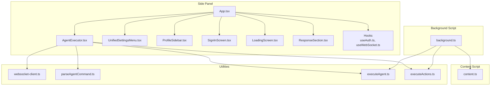
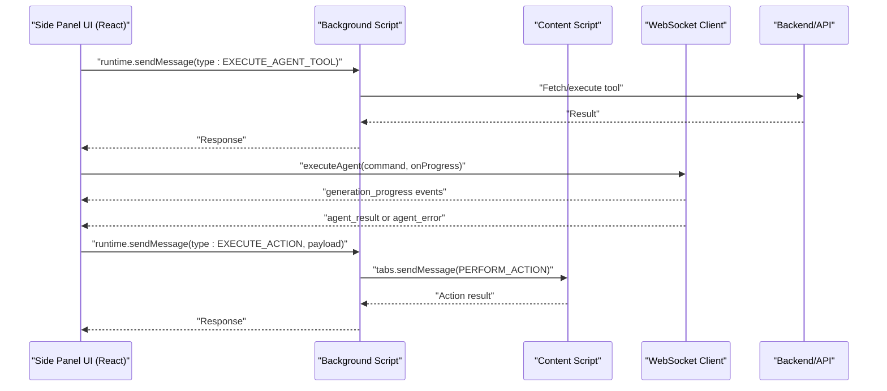
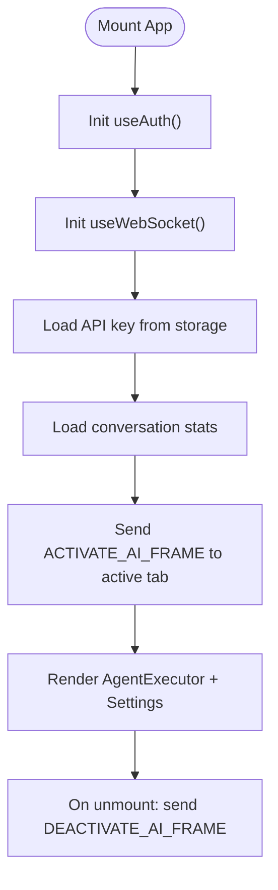
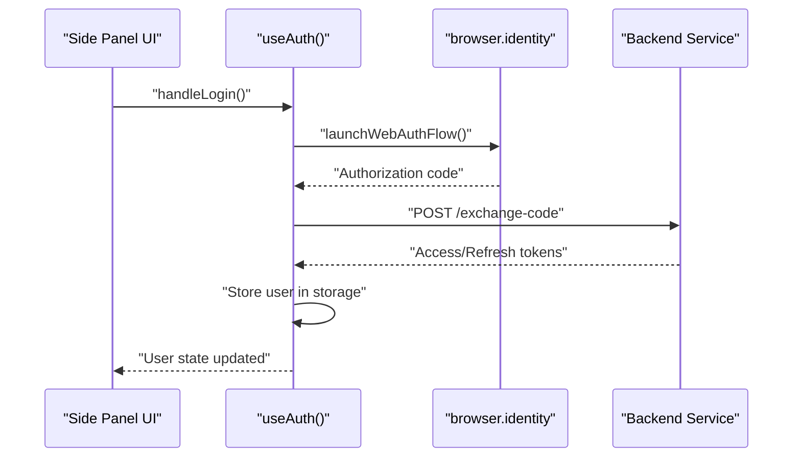
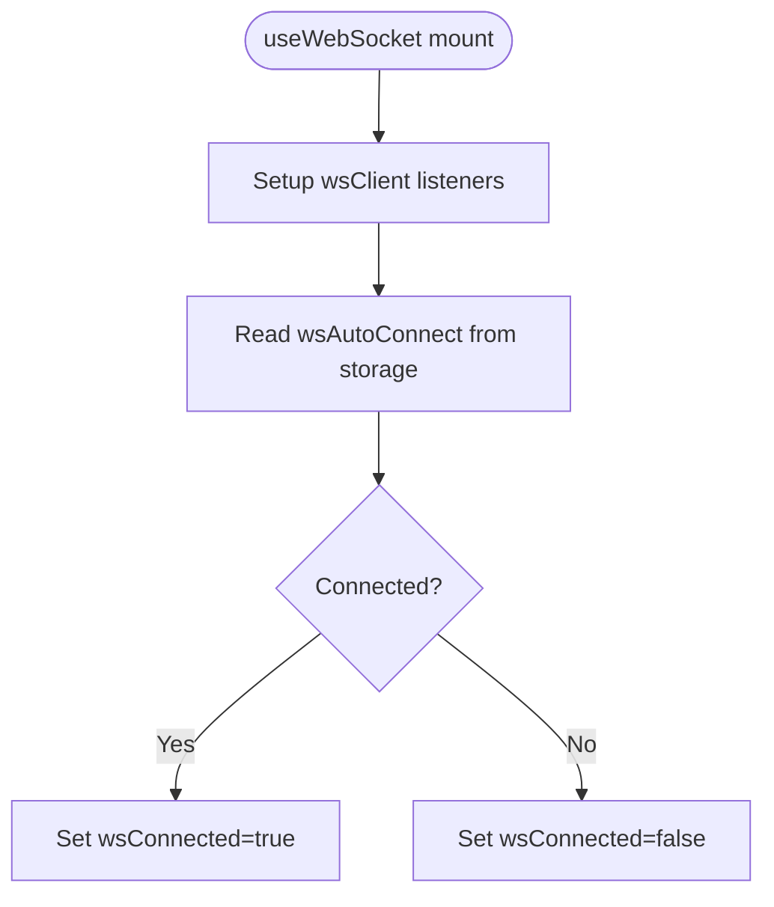
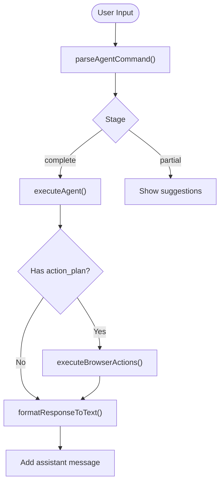
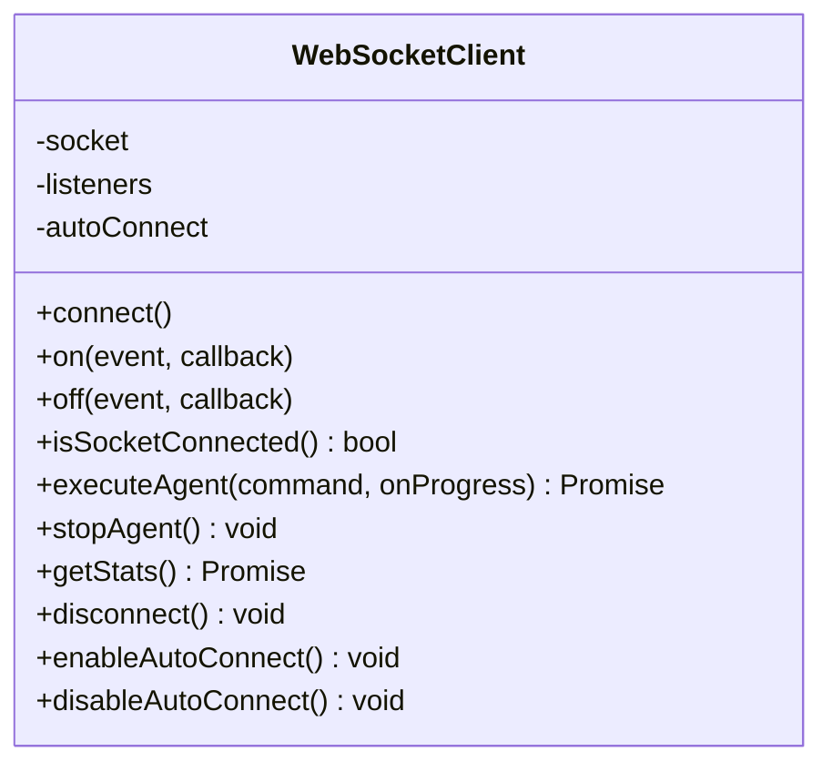
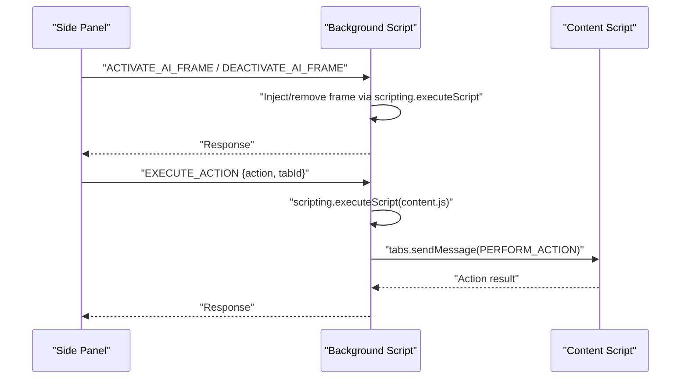
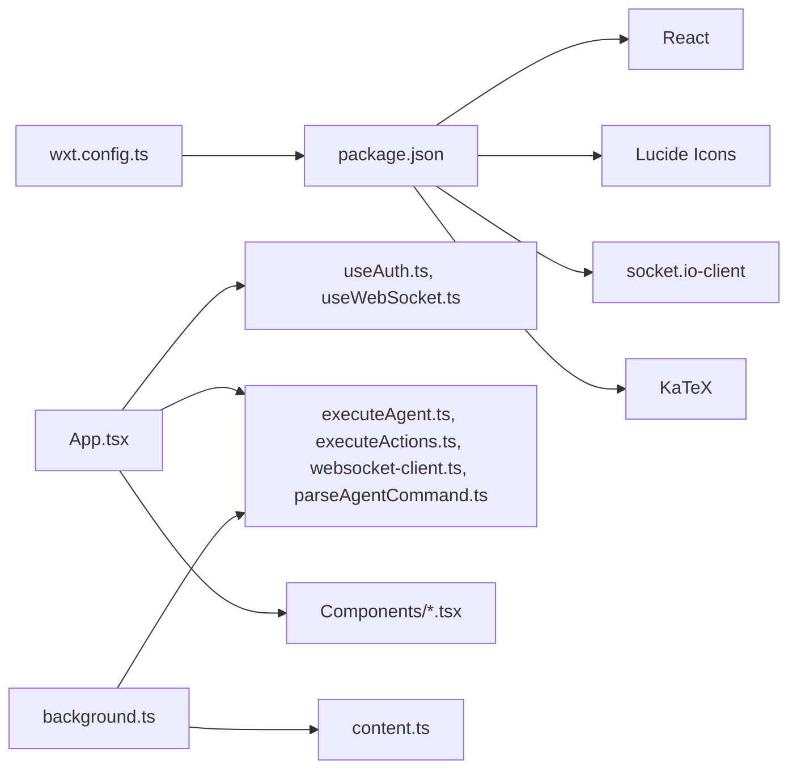

# Browser Extension

<cite>
**Referenced Files in This Document**
- [wxt.config.ts](file://extension/wxt.config.ts)
- [package.json](file://extension/package.json)
- [App.tsx](file://extension/entrypoints/sidepanel/App.tsx)
- [background.ts](file://extension/entrypoints/background.ts)
- [content.ts](file://extension/entrypoints/content.ts)
- [main.tsx](file://extension/entrypoints/sidepanel/main.tsx)
- [useAuth.ts](file://extension/entrypoints/sidepanel/hooks/useAuth.ts)
- [useWebSocket.ts](file://extension/entrypoints/sidepanel/hooks/useWebSocket.ts)
- [AgentExecutor.tsx](file://extension/entrypoints/sidepanel/AgentExecutor.tsx)
- [websocket-client.ts](file://extension/entrypoints/utils/websocket-client.ts)
- [ProfileSidebar.tsx](file://extension/entrypoints/sidepanel/components/ProfileSidebar.tsx)
- [ResponseSection.tsx](file://extension/entrypoints/sidepanel/components/ResponseSection.tsx)
- [LoadingScreen.tsx](file://extension/entrypoints/sidepanel/components/LoadingScreen.tsx)
- [SignInScreen.tsx](file://extension/entrypoints/sidepanel/components/SignInScreen.tsx)
- [UnifiedSettingsMenu.tsx](file://extension/entrypoints/sidepanel/components/UnifiedSettingsMenu.tsx)
- [executeAgent.ts](file://extension/entrypoints/utils/executeAgent.ts)
- [executeActions.ts](file://extension/entrypoints/utils/executeActions.ts)
- [parseAgentCommand.ts](file://extension/entrypoints/utils/parseAgentCommand.ts)
</cite>

## Table of Contents
1. [Introduction](#introduction)
2. [Project Structure](#project-structure)
3. [Core Components](#core-components)
4. [Architecture Overview](#architecture-overview)
5. [Detailed Component Analysis](#detailed-component-analysis)
6. [Dependency Analysis](#dependency-analysis)
7. [Performance Considerations](#performance-considerations)
8. [Troubleshooting Guide](#troubleshooting-guide)
9. [Conclusion](#conclusion)
10. [Appendices](#appendices)

## Introduction
This document explains the Browser Extension component of the Agentic Browser project. It focuses on the React-based side panel built with the WXT framework, covering the side panel UI structure, component organization, state management, messaging between extension components, authentication flow, settings management, and the AgentExecutor implementation. It also documents the WebSocket client for real-time communication, content script integration for page-level automation, and cross-browser compatibility considerations.

## Project Structure
The extension is organized under the extension directory with the following key areas:
- Side panel entrypoint with React app and hooks
- Background script for extension-wide operations and messaging
- Content script for page-level automation
- Utilities for agent execution, action execution, and WebSocket client
- UI components for profile, settings, loading, sign-in, and response sections

**Diagram sources**
- [App.tsx](file://extension/entrypoints/sidepanel/App.tsx#L1-L200)
- [AgentExecutor.tsx](file://extension/entrypoints/sidepanel/AgentExecutor.tsx#L1-L200)
- [UnifiedSettingsMenu.tsx](file://extension/entrypoints/sidepanel/components/UnifiedSettingsMenu.tsx#L1-L200)
- [ProfileSidebar.tsx](file://extension/entrypoints/sidepanel/components/ProfileSidebar.tsx#L1-L120)
- [SignInScreen.tsx](file://extension/entrypoints/sidepanel/components/SignInScreen.tsx#L1-L120)
- [LoadingScreen.tsx](file://extension/entrypoints/sidepanel/components/LoadingScreen.tsx#L1-L18)
- [ResponseSection.tsx](file://extension/entrypoints/sidepanel/components/ResponseSection.tsx#L1-L15)
- [useAuth.ts](file://extension/entrypoints/sidepanel/hooks/useAuth.ts#L1-L120)
- [useWebSocket.ts](file://extension/entrypoints/sidepanel/hooks/useWebSocket.ts#L1-L49)
- [background.ts](file://extension/entrypoints/background.ts#L1-L160)
- [content.ts](file://extension/entrypoints/content.ts#L1-L120)
- [websocket-client.ts](file://extension/entrypoints/utils/websocket-client.ts#L1-L80)
- [parseAgentCommand.ts](file://extension/entrypoints/utils/parseAgentCommand.ts#L1-L86)
- [executeAgent.ts](file://extension/entrypoints/utils/executeAgent.ts#L1-L120)
- [executeActions.ts](file://extension/entrypoints/utils/executeActions.ts#L1-L57)

**Section sources**
- [wxt.config.ts](file://extension/wxt.config.ts#L1-L29)
- [package.json](file://extension/package.json#L1-L40)

## Core Components
- Side panel React app orchestrates authentication, settings, and agent execution.
- Hooks encapsulate authentication and WebSocket connectivity.
- AgentExecutor manages chat sessions, command parsing, agent execution, and action execution.
- Utilities provide command parsing, agent execution, and WebSocket client.
- Background script handles messaging, tab management, and action execution.
- Content script provides page-level automation hooks.

**Section sources**
- [App.tsx](file://extension/entrypoints/sidepanel/App.tsx#L1-L200)
- [useAuth.ts](file://extension/entrypoints/sidepanel/hooks/useAuth.ts#L1-L120)
- [useWebSocket.ts](file://extension/entrypoints/sidepanel/hooks/useWebSocket.ts#L1-L49)
- [AgentExecutor.tsx](file://extension/entrypoints/sidepanel/AgentExecutor.tsx#L1-L200)
- [websocket-client.ts](file://extension/entrypoints/utils/websocket-client.ts#L1-L80)
- [executeAgent.ts](file://extension/entrypoints/utils/executeAgent.ts#L1-L120)
- [executeActions.ts](file://extension/entrypoints/utils/executeActions.ts#L1-L57)
- [background.ts](file://extension/entrypoints/background.ts#L1-L160)
- [content.ts](file://extension/entrypoints/content.ts#L1-L120)

## Architecture Overview
The extension follows a React side panel front-end communicating with a background script and content script. Real-time capabilities are provided by a WebSocket client. Authentication integrates with Google OAuth via the browser identity API and a local backend service.

**Diagram sources**
- [background.ts](file://extension/entrypoints/background.ts#L24-L128)
- [websocket-client.ts](file://extension/entrypoints/utils/websocket-client.ts#L61-L95)
- [AgentExecutor.tsx](file://extension/entrypoints/sidepanel/AgentExecutor.tsx#L456-L516)
- [content.ts](file://extension/entrypoints/content.ts#L197-L213)

## Detailed Component Analysis

### Side Panel Application (App)
- Initializes authentication and WebSocket hooks.
- Loads API key and conversation stats.
- Activates/deactivates AI frame on tab changes.
- Renders AgentExecutor and UnifiedSettingsMenu.

**Diagram sources**
- [App.tsx](file://extension/entrypoints/sidepanel/App.tsx#L11-L101)

**Section sources**
- [App.tsx](file://extension/entrypoints/sidepanel/App.tsx#L1-L200)

### Authentication Hook (useAuth)
- Detects browser type and sets browser info.
- Handles Google OAuth via browser.identity.
- Stores user data in browser storage and refreshes tokens.
- Provides manual refresh and logout helpers.

**Diagram sources**
- [useAuth.ts](file://extension/entrypoints/sidepanel/hooks/useAuth.ts#L128-L208)

**Section sources**
- [useAuth.ts](file://extension/entrypoints/sidepanel/hooks/useAuth.ts#L1-L311)

### WebSocket Hook (useWebSocket)
- Initializes WebSocket client and listens for connection status and progress updates.
- Reads auto-connect preference from storage.
- Exposes connection state to UI.

**Diagram sources**
- [useWebSocket.ts](file://extension/entrypoints/sidepanel/hooks/useWebSocket.ts#L1-L49)
- [websocket-client.ts](file://extension/entrypoints/utils/websocket-client.ts#L17-L40)

**Section sources**
- [useWebSocket.ts](file://extension/entrypoints/sidepanel/hooks/useWebSocket.ts#L1-L49)
- [websocket-client.ts](file://extension/entrypoints/utils/websocket-client.ts#L1-L133)

### Agent Executor (AgentExecutor)
- Manages sessions, messages, and progress updates.
- Parses slash commands and executes agent actions.
- Supports voice input, file attachments, and tab mentions.
- Integrates with WebSocket client for streaming and fallback HTTP for stats.

**Diagram sources**
- [AgentExecutor.tsx](file://extension/entrypoints/sidepanel/AgentExecutor.tsx#L323-L516)
- [parseAgentCommand.ts](file://extension/entrypoints/utils/parseAgentCommand.ts#L1-L86)
- [executeAgent.ts](file://extension/entrypoints/utils/executeAgent.ts#L17-L120)
- [executeActions.ts](file://extension/entrypoints/utils/executeActions.ts#L1-L57)

**Section sources**
- [AgentExecutor.tsx](file://extension/entrypoints/sidepanel/AgentExecutor.tsx#L1-L800)
- [parseAgentCommand.ts](file://extension/entrypoints/utils/parseAgentCommand.ts#L1-L86)
- [executeAgent.ts](file://extension/entrypoints/utils/executeAgent.ts#L1-L299)
- [executeActions.ts](file://extension/entrypoints/utils/executeActions.ts#L1-L57)

### WebSocket Client
- Provides a minimal Socket.IO client wrapper.
- Emits connection status and progress events.
- Executes agent commands and stops execution.

**Diagram sources**
- [websocket-client.ts](file://extension/entrypoints/utils/websocket-client.ts#L8-L133)

**Section sources**
- [websocket-client.ts](file://extension/entrypoints/utils/websocket-client.ts#L1-L133)

### Background Script (background.ts)
- Listens for messages from side panel and content script.
- Handles activation/deactivation of AI frames, tab queries, action execution, and Gemini requests.
- Injects content scripts and relays actions to the active tab.

**Diagram sources**
- [background.ts](file://extension/entrypoints/background.ts#L24-L128)
- [background.ts](file://extension/entrypoints/background.ts#L428-L449)
- [content.ts](file://extension/entrypoints/content.ts#L197-L213)

**Section sources**
- [background.ts](file://extension/entrypoints/background.ts#L1-L160)
- [background.ts](file://extension/entrypoints/background.ts#L428-L514)

### Content Script (content.ts)
- Provides helpers to find elements and perform actions (play/pause video, click, type, scroll).
- Can create overlays for AI frame indication (commented in current implementation).
- Receives action messages from background script.

**Section sources**
- [content.ts](file://extension/entrypoints/content.ts#L1-L326)

### UI Components
- UnifiedSettingsMenu: Collapsible settings/profile panel with tabs, model selection, API key, base URL, Google/JIIT connections, and WebSocket auto-connect.
- ProfileSidebar: Detailed user profile with token controls and logout.
- ResponseSection: Displays agent responses.
- LoadingScreen: Minimal loading UI.
- SignInScreen: OAuth login options with animated branding.

**Section sources**
- [UnifiedSettingsMenu.tsx](file://extension/entrypoints/sidepanel/components/UnifiedSettingsMenu.tsx#L1-L200)
- [ProfileSidebar.tsx](file://extension/entrypoints/sidepanel/components/ProfileSidebar.tsx#L1-L200)
- [ResponseSection.tsx](file://extension/entrypoints/sidepanel/components/ResponseSection.tsx#L1-L15)
- [LoadingScreen.tsx](file://extension/entrypoints/sidepanel/components/LoadingScreen.tsx#L1-L18)
- [SignInScreen.tsx](file://extension/entrypoints/sidepanel/components/SignInScreen.tsx#L1-L120)

## Dependency Analysis
- WXT configuration defines permissions and host permissions for broad site access.
- Dependencies include React, Radix UI, Lucide icons, Socket.IO client, KaTeX, and Tailwind utilities.
- Side panel depends on hooks for auth and WebSocket, and utilities for agent/command/action execution.
- Background script depends on browser APIs for messaging, tabs, scripting, and storage.

**Diagram sources**
- [wxt.config.ts](file://extension/wxt.config.ts#L1-L29)
- [package.json](file://extension/package.json#L17-L32)
- [App.tsx](file://extension/entrypoints/sidepanel/App.tsx#L1-L10)
- [background.ts](file://extension/entrypoints/background.ts#L1-L20)

**Section sources**
- [wxt.config.ts](file://extension/wxt.config.ts#L1-L29)
- [package.json](file://extension/package.json#L1-L40)

## Performance Considerations
- Minimize DOM operations in content script; batch action execution with small delays.
- Debounce or throttle command suggestions and tab fetching in AgentExecutor.
- Use browser storage efficiently; avoid frequent writes by batching.
- Prefer WebSocket streaming for long-running tasks; fallback to HTTP only when necessary.
- Lazy-load heavy components and libraries to reduce initial bundle size.

## Troubleshooting Guide
Common issues and resolutions:
- WebSocket not connecting: Verify VITE_API_URL and auto-connect preference; check connection status events.
- Action execution failures: Ensure content script injection succeeded and tab IDs are valid.
- Authentication errors: Confirm backend service is running and OAuth consent flow completes.
- Tab context resolution: When using @mentions, verify tab query results and fallback to active tab.
- Storage sync: Listen to browser.storage.onChanged for immediate UI updates.

**Section sources**
- [useWebSocket.ts](file://extension/entrypoints/sidepanel/hooks/useWebSocket.ts#L1-L49)
- [background.ts](file://extension/entrypoints/background.ts#L428-L514)
- [useAuth.ts](file://extension/entrypoints/sidepanel/hooks/useAuth.ts#L128-L208)
- [executeAgent.ts](file://extension/entrypoints/utils/executeAgent.ts#L44-L82)

## Conclusion
The extension combines a React side panel with a robust background and content script architecture. It supports real-time agent execution via WebSocket, secure authentication with Google OAuth, flexible settings management, and seamless page automation. Following the guidelines in this document will help extend and maintain the system effectively across browsers.

## Appendices

### Manifest and Permissions
- Permissions include activeTab, tabs, storage, scripting, identity, sidePanel, webNavigation, webRequest, cookies, bookmarks, history, clipboard, notifications, contextMenus, downloads.
- Host permissions grant access to all URLs.

**Section sources**
- [wxt.config.ts](file://extension/wxt.config.ts#L8-L26)

### Cross-Browser Compatibility
- Uses browser.identity and browser.storage APIs compatible with Chromium-based browsers.
- Content script injection uses browser.scripting.executeScript.
- Consider polyfills or feature detection for Firefox-specific differences if extending support.

**Section sources**
- [useAuth.ts](file://extension/entrypoints/sidepanel/hooks/useAuth.ts#L5-L15)
- [background.ts](file://extension/entrypoints/background.ts#L385-L398)

### Development Examples
- Initialize side panel entrypoint and React root:
  - [main.tsx](file://extension/entrypoints/sidepanel/main.tsx#L1-L10)
- Execute an agent command:
  - [AgentExecutor.handleExecute](file://extension/entrypoints/sidepanel/AgentExecutor.tsx#L323-L516)
- Send action to active tab:
  - [background.handleExecuteAction](file://extension/entrypoints/background.ts#L428-L449)
- Connect to WebSocket:
  - [websocket-client.connect](file://extension/entrypoints/utils/websocket-client.ts#L17-L40)