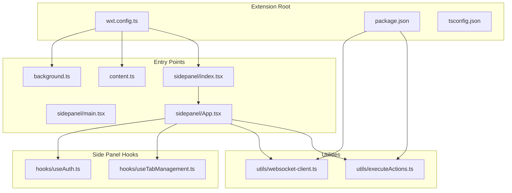
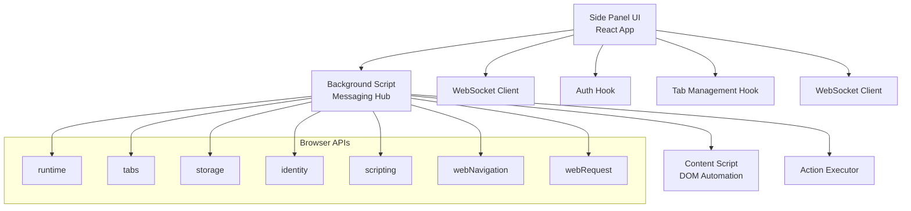
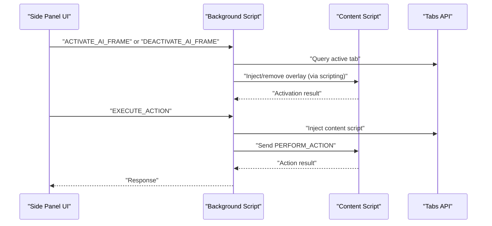
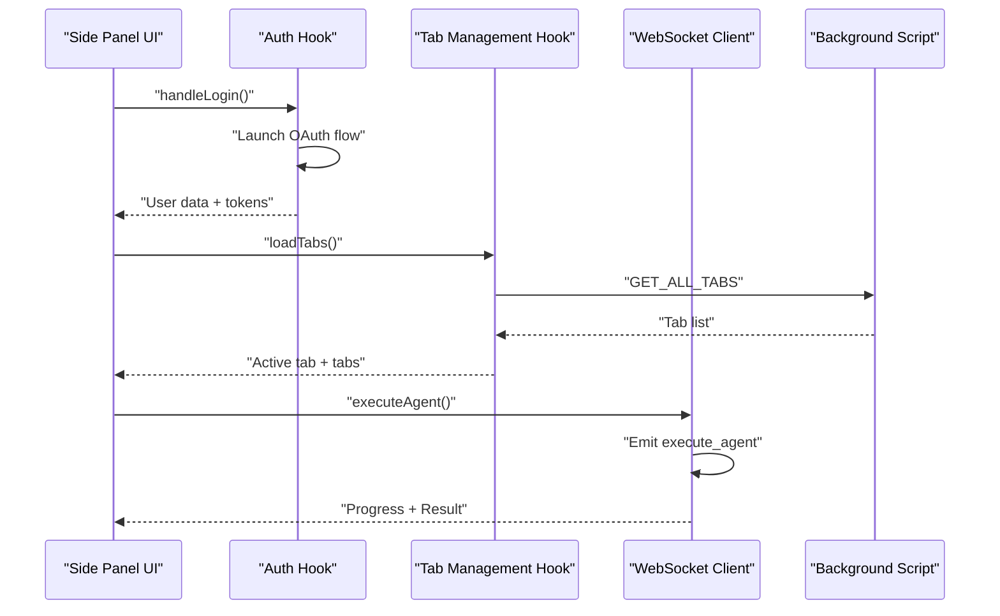
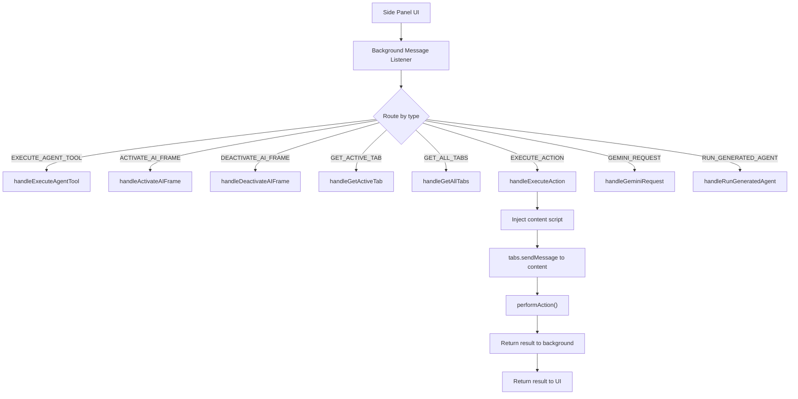
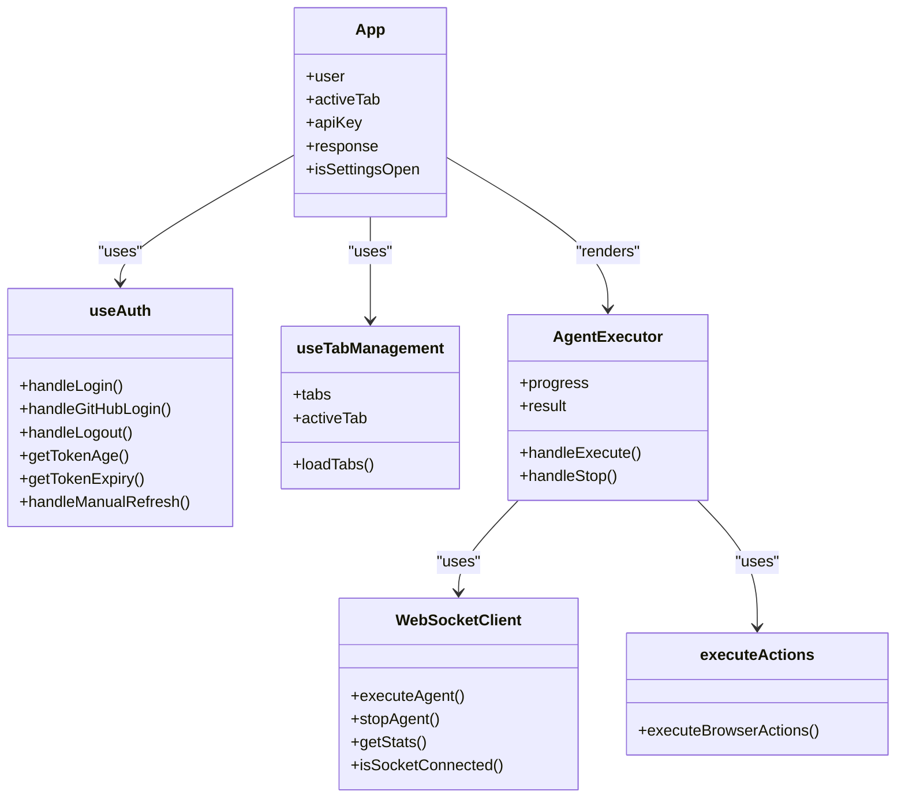
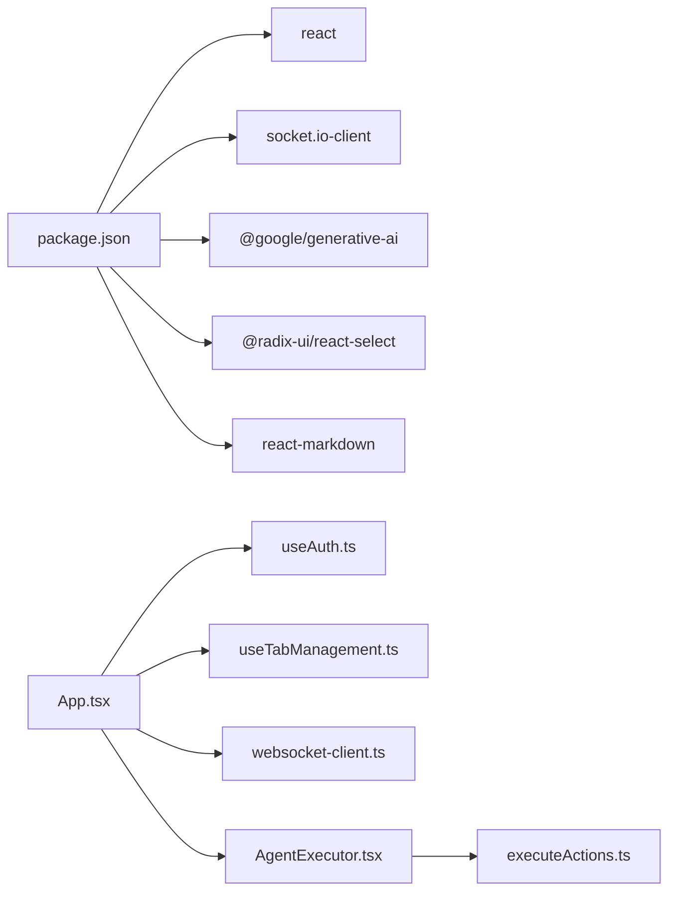

# Extension Architecture

<cite>
**Referenced Files in This Document**
- [wxt.config.ts](file://extension/wxt.config.ts)
- [background.ts](file://extension/entrypoints/background.ts)
- [content.ts](file://extension/entrypoints/content.ts)
- [index.tsx](file://extension/entrypoints/sidepanel/index.tsx)
- [main.tsx](file://extension/entrypoints/sidepanel/main.tsx)
- [App.tsx](file://extension/entrypoints/sidepanel/App.tsx)
- [useAuth.ts](file://extension/entrypoints/sidepanel/hooks/useAuth.ts)
- [useTabManagement.ts](file://extension/entrypoints/sidepanel/hooks/useTabManagement.ts)
- [AgentExecutor.tsx](file://extension/entrypoints/sidepanel/AgentExecutor.tsx)
- [websocket-client.ts](file://extension/entrypoints/utils/websocket-client.ts)
- [executeActions.ts](file://extension/entrypoints/utils/executeActions.ts)
- [package.json](file://extension/package.json)
- [tsconfig.json](file://extension/tsconfig.json)
- [README.md](file://extension/README.md)
</cite>

## Table of Contents
1. [Introduction](#introduction)
2. [Project Structure](#project-structure)
3. [Core Components](#core-components)
4. [Architecture Overview](#architecture-overview)
5. [Detailed Component Analysis](#detailed-component-analysis)
6. [Dependency Analysis](#dependency-analysis)
7. [Performance Considerations](#performance-considerations)
8. [Security Considerations](#security-considerations)
9. [Cross-Browser Compatibility](#cross-browser-compatibility)
10. [Troubleshooting Guide](#troubleshooting-guide)
11. [Conclusion](#conclusion)

## Introduction
This document explains the Browser Extension Architecture built with the WXT framework. It focuses on the three main entry points:
- Background script for extension-wide operations and cross-tab coordination
- Content script for page-level automation and DOM interaction
- Side panel UI for user interaction and agent orchestration

It documents extension configuration, manifest setup, messaging architecture, component relationships, lifecycle management, and integration patterns with browser APIs. Security, permissions, and performance optimization strategies are also covered.

## Project Structure
The extension is organized under the extension directory with WXT entrypoints and React-based UI components. Key areas:
- Configuration: wxt.config.ts defines module usage, permissions, and host permissions
- Background: background.ts handles messaging, tab management, and agent tool execution
- Content: content.ts manages page-level automation and DOM interactions
- Side Panel: React app mounted via shadow DOM with hooks for auth, tabs, and WebSocket
- Utilities: websocket-client.ts, executeActions.ts, and shared parsing utilities

**Diagram sources**
- [wxt.config.ts](file://extension/wxt.config.ts#L1-L29)
- [background.ts](file://extension/entrypoints/background.ts#L1-L1642)
- [content.ts](file://extension/entrypoints/content.ts#L1-L326)
- [index.tsx](file://extension/entrypoints/sidepanel/index.tsx#L1-L26)
- [main.tsx](file://extension/entrypoints/sidepanel/main.tsx#L1-L10)
- [App.tsx](file://extension/entrypoints/sidepanel/App.tsx#L1-L200)
- [useAuth.ts](file://extension/entrypoints/sidepanel/hooks/useAuth.ts#L1-L311)
- [useTabManagement.ts](file://extension/entrypoints/sidepanel/hooks/useTabManagement.ts#L1-L94)
- [websocket-client.ts](file://extension/entrypoints/utils/websocket-client.ts#L1-L133)
- [executeActions.ts](file://extension/entrypoints/utils/executeActions.ts#L1-L57)
- [package.json](file://extension/package.json#L1-L40)
- [tsconfig.json](file://extension/tsconfig.json#L1-L13)

**Section sources**
- [wxt.config.ts](file://extension/wxt.config.ts#L1-L29)
- [package.json](file://extension/package.json#L1-L40)
- [tsconfig.json](file://extension/tsconfig.json#L1-L13)
- [README.md](file://extension/README.md#L1-L4)

## Core Components
- Background Script: Central orchestrator for messaging, tab state, and agent tool execution. Handles message routing for agent actions, tab operations, and Gemini requests.
- Content Script: Page-level automation that injects or removes visual overlays and performs DOM actions (click, type, scroll) via injected scripts.
- Side Panel UI: React application mounted in a shadow DOM, providing user controls, authentication, tab management, and agent execution with WebSocket integration.

Key responsibilities:
- Messaging: bidirectional communication between UI, background, and content scripts
- Permissions: activeTab, tabs, storage, scripting, identity, sidePanel, webNavigation, webRequest, cookies, bookmarks, history, clipboard, notifications, contextMenus, downloads
- Cross-origin: host_permissions for <all_urls>

**Section sources**
- [background.ts](file://extension/entrypoints/background.ts#L1-L1642)
- [content.ts](file://extension/entrypoints/content.ts#L1-L326)
- [index.tsx](file://extension/entrypoints/sidepanel/index.tsx#L1-L26)
- [App.tsx](file://extension/entrypoints/sidepanel/App.tsx#L1-L200)
- [wxt.config.ts](file://extension/wxt.config.ts#L5-L27)

## Architecture Overview
The extension follows a layered architecture:
- UI Layer: Side panel React app with hooks for auth and tab management
- Control Layer: Background script managing messaging and cross-tab operations
- Automation Layer: Content script performing DOM-level actions
- Utility Layer: WebSocket client and action executor utilities

**Diagram sources**
- [background.ts](file://extension/entrypoints/background.ts#L1-L1642)
- [content.ts](file://extension/entrypoints/content.ts#L1-L326)
- [index.tsx](file://extension/entrypoints/sidepanel/index.tsx#L1-L26)
- [App.tsx](file://extension/entrypoints/sidepanel/App.tsx#L1-L200)
- [websocket-client.ts](file://extension/entrypoints/utils/websocket-client.ts#L1-L133)
- [useAuth.ts](file://extension/entrypoints/sidepanel/hooks/useAuth.ts#L1-L311)
- [useTabManagement.ts](file://extension/entrypoints/sidepanel/hooks/useTabManagement.ts#L1-L94)
- [executeActions.ts](file://extension/entrypoints/utils/executeActions.ts#L1-L57)

## Detailed Component Analysis

### Background Script
Responsibilities:
- Message routing for agent tool execution, tab activation/deactivation, tab queries, action execution, Gemini requests, and generated agent runs
- Tab tracking via browser.tabs listeners and storage updates
- Dynamic imports for external libraries (e.g., Gemini SDK)
- Injection of content scripts and inter-tab messaging

Key flows:
- Message listener routes incoming runtime messages to handlers
- Tab management updates local storage for UI consumption
- Action execution injects content scripts and forwards actions to content script

**Diagram sources**
- [background.ts](file://extension/entrypoints/background.ts#L24-L128)
- [background.ts](file://extension/entrypoints/background.ts#L428-L449)
- [content.ts](file://extension/entrypoints/content.ts#L197-L213)

**Section sources**
- [background.ts](file://extension/entrypoints/background.ts#L1-L1642)

### Content Script
Responsibilities:
- Optional creation/removal of visual AI frame overlays
- DOM-level actions (click, type, scroll) via injected functions
- Basic action parsing and execution helpers

Notes:
- The current implementation focuses on DOM manipulation and does not actively listen for messages in the provided snippet
- The commented code shows a previous approach to overlay injection and removal

**Section sources**
- [content.ts](file://extension/entrypoints/content.ts#L1-L326)

### Side Panel UI
Responsibilities:
- Mounts React app in a shadow DOM
- Provides authentication flow (Google OAuth and demo GitHub login)
- Manages active tab and tab list
- Integrates WebSocket client for agent execution and statistics
- Executes agent commands and browser actions

Key integrations:
- Shadow DOM mounting via WXT content script API
- Authentication hook for OAuth and token refresh
- Tab management hook for active tab and tab list
- WebSocket client for agent execution and progress updates
- Action executor for browser-level actions

**Diagram sources**
- [index.tsx](file://extension/entrypoints/sidepanel/index.tsx#L1-L26)
- [App.tsx](file://extension/entrypoints/sidepanel/App.tsx#L1-L200)
- [useAuth.ts](file://extension/entrypoints/sidepanel/hooks/useAuth.ts#L1-L311)
- [useTabManagement.ts](file://extension/entrypoints/sidepanel/hooks/useTabManagement.ts#L1-L94)
- [websocket-client.ts](file://extension/entrypoints/utils/websocket-client.ts#L1-L133)
- [background.ts](file://extension/entrypoints/background.ts#L81-L89)

**Section sources**
- [index.tsx](file://extension/entrypoints/sidepanel/index.tsx#L1-L26)
- [App.tsx](file://extension/entrypoints/sidepanel/App.tsx#L1-L200)
- [useAuth.ts](file://extension/entrypoints/sidepanel/hooks/useAuth.ts#L1-L311)
- [useTabManagement.ts](file://extension/entrypoints/sidepanel/hooks/useTabManagement.ts#L1-L94)
- [websocket-client.ts](file://extension/entrypoints/utils/websocket-client.ts#L1-L133)

### Messaging System Architecture
The messaging system connects the UI, background, and content layers:
- UI sends commands to background via runtime.sendMessage
- Background routes messages to appropriate handlers
- Background injects content scripts and communicates with content script via tabs.sendMessage
- Content script executes DOM actions and returns results

**Diagram sources**
- [background.ts](file://extension/entrypoints/background.ts#L24-L128)
- [background.ts](file://extension/entrypoints/background.ts#L428-L514)
- [content.ts](file://extension/entrypoints/content.ts#L197-L213)

**Section sources**
- [background.ts](file://extension/entrypoints/background.ts#L24-L128)
- [background.ts](file://extension/entrypoints/background.ts#L428-L514)
- [content.ts](file://extension/entrypoints/content.ts#L197-L213)

### Component Relationships
- Side Panel App depends on hooks for authentication and tab management
- AgentExecutor integrates with WebSocket client and action executor
- Background script coordinates messaging and tab operations
- Content script provides DOM-level automation

**Diagram sources**
- [App.tsx](file://extension/entrypoints/sidepanel/App.tsx#L1-L200)
- [useAuth.ts](file://extension/entrypoints/sidepanel/hooks/useAuth.ts#L1-L311)
- [useTabManagement.ts](file://extension/entrypoints/sidepanel/hooks/useTabManagement.ts#L1-L94)
- [AgentExecutor.tsx](file://extension/entrypoints/sidepanel/AgentExecutor.tsx#L1-L800)
- [websocket-client.ts](file://extension/entrypoints/utils/websocket-client.ts#L1-L133)
- [executeActions.ts](file://extension/entrypoints/utils/executeActions.ts#L1-L57)

**Section sources**
- [App.tsx](file://extension/entrypoints/sidepanel/App.tsx#L1-L200)
- [AgentExecutor.tsx](file://extension/entrypoints/sidepanel/AgentExecutor.tsx#L1-L800)
- [websocket-client.ts](file://extension/entrypoints/utils/websocket-client.ts#L1-L133)
- [executeActions.ts](file://extension/entrypoints/utils/executeActions.ts#L1-L57)

## Dependency Analysis
External dependencies include React, Socket.IO client, and Google Generative AI SDK. Internal dependencies are structured around hooks and utilities.

**Diagram sources**
- [package.json](file://extension/package.json#L17-L32)
- [App.tsx](file://extension/entrypoints/sidepanel/App.tsx#L1-L200)
- [useAuth.ts](file://extension/entrypoints/sidepanel/hooks/useAuth.ts#L1-L311)
- [useTabManagement.ts](file://extension/entrypoints/sidepanel/hooks/useTabManagement.ts#L1-L94)
- [websocket-client.ts](file://extension/entrypoints/utils/websocket-client.ts#L1-L133)
- [AgentExecutor.tsx](file://extension/entrypoints/sidepanel/AgentExecutor.tsx#L1-L800)
- [executeActions.ts](file://extension/entrypoints/utils/executeActions.ts#L1-L57)

**Section sources**
- [package.json](file://extension/package.json#L17-L32)

## Performance Considerations
- Minimize DOM operations: batch DOM queries and mutations in content script
- Debounce UI updates: throttle progress updates and tab list refreshes
- Lazy loading: defer heavy computations until needed (e.g., Gemini SDK dynamic import)
- Efficient messaging: avoid excessive message traffic; coalesce updates
- Memory cleanup: remove event listeners and unmount React roots when appropriate
- WebSocket reconnection: configure retry policies and backoff strategies

## Security Considerations
- Permissions: carefully review and limit permissions to those required for functionality
- Host permissions: <all_urls> grants broad access; ensure CSP and content security are enforced
- OAuth: validate redirect URIs and handle errors gracefully; store tokens securely in browser storage
- Content script isolation: avoid exposing sensitive data; sanitize inputs before DOM manipulation
- Cross-origin requests: validate and sanitize external API responses; handle rate limits and errors

## Cross-Browser Compatibility
- WXT supports multiple browsers; ensure browser-specific APIs are handled consistently
- Use browser polyfills or feature detection for APIs not universally available
- Test manifest keys and permissions across Chrome, Firefox, and Edge
- Validate content script injection and messaging behavior differences

## Troubleshooting Guide
Common issues and resolutions:
- Messaging timeouts: verify message listener registration and ensure async responses are sent
- Content script injection failures: confirm scripting permissions and correct file paths
- Tab operations failing: check tabs permissions and active tab queries
- WebSocket connectivity: verify URL configuration and network availability
- Authentication errors: validate OAuth flow and token refresh logic

**Section sources**
- [background.ts](file://extension/entrypoints/background.ts#L24-L128)
- [useAuth.ts](file://extension/entrypoints/sidepanel/hooks/useAuth.ts#L128-L208)
- [websocket-client.ts](file://extension/entrypoints/utils/websocket-client.ts#L17-L40)

## Conclusion
The extension architecture leverages WXT’s entry points and React to deliver a cohesive browser automation experience. The background script centralizes messaging and coordination, the content script handles page-level automation, and the side panel UI provides user interaction and agent orchestration. Proper configuration, security hardening, and performance optimization are essential for robust cross-browser deployment.