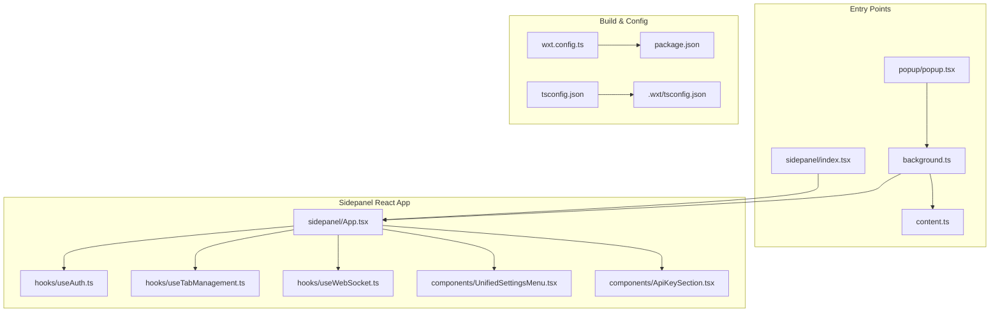
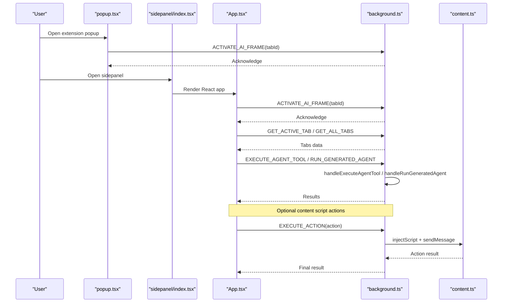
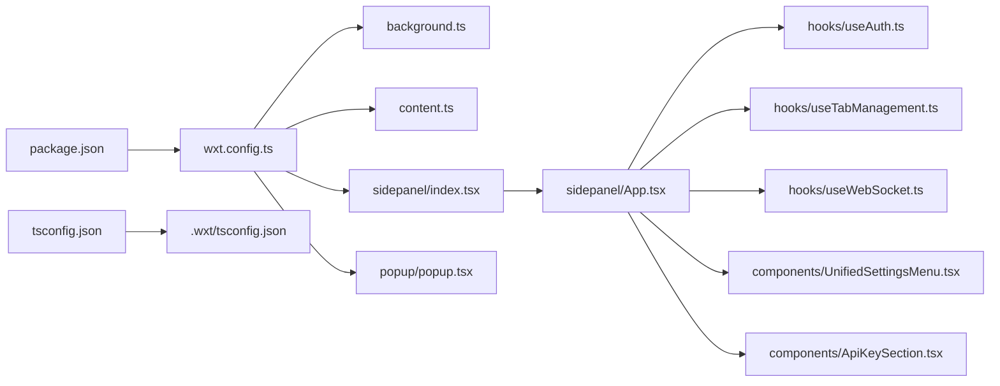

# Extension Development Guide

<cite>
**Referenced Files in This Document**
- [wxt.config.ts](file://extension/wxt.config.ts)
- [package.json](file://extension/package.json)
- [tsconfig.json](file://extension/tsconfig.json)
- [.wxt/tsconfig.json](file://extension/.wxt/tsconfig.json)
- [README.md](file://extension/README.md)
- [background.ts](file://extension/entrypoints/background.ts)
- [content.ts](file://extension/entrypoints/content.ts)
- [index.tsx](file://extension/entrypoints/sidepanel/index.tsx)
- [App.tsx](file://extension/entrypoints/sidepanel/App.tsx)
- [popup.tsx](file://extension/entrypoints/popup/popup.tsx)
- [useAuth.ts](file://extension/entrypoints/sidepanel/hooks/useAuth.ts)
- [useTabManagement.ts](file://extension/entrypoints/sidepanel/hooks/useTabManagement.ts)
- [useWebSocket.ts](file://extension/entrypoints/sidepanel/hooks/useWebSocket.ts)
- [UnifiedSettingsMenu.tsx](file://extension/entrypoints/sidepanel/components/UnifiedSettingsMenu.tsx)
- [ApiKeySection.tsx](file://extension/entrypoints/sidepanel/components/ApiKeySection.tsx)
</cite>

## Table of Contents
1. [Introduction](#introduction)
2. [Project Structure](#project-structure)
3. [Core Components](#core-components)
4. [Architecture Overview](#architecture-overview)
5. [Detailed Component Analysis](#detailed-component-analysis)
6. [Dependency Analysis](#dependency-analysis)
7. [Performance Considerations](#performance-considerations)
8. [Troubleshooting Guide](#troubleshooting-guide)
9. [Conclusion](#conclusion)
10. [Appendices](#appendices)

## Introduction
This guide provides a comprehensive walkthrough for developing browser extensions using the WXT framework. It covers environment setup, configuration, build processes, TypeScript setup, component development patterns, testing strategies, packaging and distribution, cross-browser compatibility, debugging techniques, and performance optimization. It also includes practical examples for adding new components, extending functionality, and integrating with backend services.

## Project Structure
The extension is organized around WXT entrypoints and React components:
- Entry points: background service worker, content script, sidepanel UI, and popup UI
- Sidepanel UI built with React, Shadow DOM injection, and custom hooks
- Shared utilities and WebSocket client integration
- Build and configuration managed via WXT and TypeScript

**Diagram sources**
- [background.ts](file://extension/entrypoints/background.ts#L1-L1642)
- [content.ts](file://extension/entrypoints/content.ts#L1-L326)
- [index.tsx](file://extension/entrypoints/sidepanel/index.tsx#L1-L26)
- [App.tsx](file://extension/entrypoints/sidepanel/App.tsx#L1-L200)
- [popup.tsx](file://extension/entrypoints/popup/popup.tsx#L1-L195)
- [useAuth.ts](file://extension/entrypoints/sidepanel/hooks/useAuth.ts#L1-L311)
- [useTabManagement.ts](file://extension/entrypoints/sidepanel/hooks/useTabManagement.ts#L1-L94)
- [useWebSocket.ts](file://extension/entrypoints/sidepanel/hooks/useWebSocket.ts#L1-L49)
- [UnifiedSettingsMenu.tsx](file://extension/entrypoints/sidepanel/components/UnifiedSettingsMenu.tsx#L1-L1194)
- [ApiKeySection.tsx](file://extension/entrypoints/sidepanel/components/ApiKeySection.tsx#L1-L25)
- [wxt.config.ts](file://extension/wxt.config.ts#L1-L29)
- [package.json](file://extension/package.json#L1-L40)
- [tsconfig.json](file://extension/tsconfig.json#L1-L13)
- [.wxt/tsconfig.json](file://extension/.wxt/tsconfig.json#L1-L28)

**Section sources**
- [wxt.config.ts](file://extension/wxt.config.ts#L1-L29)
- [package.json](file://extension/package.json#L1-L40)
- [tsconfig.json](file://extension/tsconfig.json#L1-L13)
- [.wxt/tsconfig.json](file://extension/.wxt/tsconfig.json#L1-L28)
- [README.md](file://extension/README.md#L1-L4)

## Core Components
- WXT configuration defines module support, manifest metadata, permissions, and host permissions.
- TypeScript configuration extends WXT’s internal tsconfig, enabling JSX and path aliases.
- Package scripts orchestrate development, building, and packaging for multiple browsers.
- Entry points:
  - background.ts: message routing, tab management, agent tool execution, Gemini integration
  - content.ts: optional page overlay and action execution helpers
  - sidepanel/index.tsx: mounts React app into shadow DOM
  - popup/popup.tsx: tab list UI and activation/deactivation messaging
- React hooks encapsulate authentication, tab management, and WebSocket connectivity.
- Settings menu integrates model selection, API keys, base URLs, and credential storage.

**Section sources**
- [wxt.config.ts](file://extension/wxt.config.ts#L1-L29)
- [tsconfig.json](file://extension/tsconfig.json#L1-L13)
- [.wxt/tsconfig.json](file://extension/.wxt/tsconfig.json#L1-L28)
- [package.json](file://extension/package.json#L1-L40)
- [background.ts](file://extension/entrypoints/background.ts#L1-L1642)
- [content.ts](file://extension/entrypoints/content.ts#L1-L326)
- [index.tsx](file://extension/entrypoints/sidepanel/index.tsx#L1-L26)
- [popup.tsx](file://extension/entrypoints/popup/popup.tsx#L1-L195)
- [useAuth.ts](file://extension/entrypoints/sidepanel/hooks/useAuth.ts#L1-L311)
- [useTabManagement.ts](file://extension/entrypoints/sidepanel/hooks/useTabManagement.ts#L1-L94)
- [useWebSocket.ts](file://extension/entrypoints/sidepanel/hooks/useWebSocket.ts#L1-L49)
- [UnifiedSettingsMenu.tsx](file://extension/entrypoints/sidepanel/components/UnifiedSettingsMenu.tsx#L1-L1194)
- [ApiKeySection.tsx](file://extension/entrypoints/sidepanel/components/ApiKeySection.tsx#L1-L25)

## Architecture Overview
The extension follows a MV3 architecture with a background service worker coordinating messaging, tab operations, and agent tool execution. The sidepanel UI runs in a Shadow DOM, communicating with the background via runtime messages. Optional content script provides page-level actions and overlays.

**Diagram sources**
- [popup.tsx](file://extension/entrypoints/popup/popup.tsx#L74-L110)
- [index.tsx](file://extension/entrypoints/sidepanel/index.tsx#L9-L25)
- [App.tsx](file://extension/entrypoints/sidepanel/App.tsx#L54-L101)
- [background.ts](file://extension/entrypoints/background.ts#L24-L128)
- [content.ts](file://extension/entrypoints/content.ts#L197-L213)

## Detailed Component Analysis

### WXT Configuration and Build
- Modules: React module enabled for seamless integration.
- Manifest: Name, description, permissions, and host permissions configured.
- Scripts: dev, build, zip, and compile commands for Chrome and Firefox targets.

**Section sources**
- [wxt.config.ts](file://extension/wxt.config.ts#L1-L29)
- [package.json](file://extension/package.json#L7-L16)

### TypeScript Configuration
- Root tsconfig extends WXT’s internal tsconfig.
- Compiler options enable JSX with React JSX transform, path aliases, and strictness.
- WXT internal tsconfig sets module resolution, strictness, and includes/excludes.

**Section sources**
- [tsconfig.json](file://extension/tsconfig.json#L1-L13)
- [.wxt/tsconfig.json](file://extension/.wxt/tsconfig.json#L1-L28)

### Sidepanel Entry Point and Shadow DOM Injection
- Defines a content script with matches for all URLs and Shadow DOM UI mounting.
- Creates a named UI with inline positioning and lifecycle hooks for mounting/unmounting.

**Section sources**
- [index.tsx](file://extension/entrypoints/sidepanel/index.tsx#L5-L25)

### Sidepanel Application and State Management
- Orchestrates authentication, tab management, WebSocket connectivity, and settings.
- On mount, activates AI frame in the active tab and listens to storage changes.
- Loads API key and conversation stats, with fallbacks to HTTP when WebSocket is unavailable.

**Section sources**
- [App.tsx](file://extension/entrypoints/sidepanel/App.tsx#L11-L101)
- [App.tsx](file://extension/entrypoints/sidepanel/App.tsx#L103-L155)
- [App.tsx](file://extension/entrypoints/sidepanel/App.tsx#L167-L196)

### Authentication Hook
- Handles browser identity launch flow, token exchange, refresh logic, and storage updates.
- Provides token age/expiry calculations and manual refresh capability.
- Supports demo GitHub login bypass for development.

**Section sources**
- [useAuth.ts](file://extension/entrypoints/sidepanel/hooks/useAuth.ts#L17-L42)
- [useAuth.ts](file://extension/entrypoints/sidepanel/hooks/useAuth.ts#L128-L208)
- [useAuth.ts](file://extension/entrypoints/sidepanel/hooks/useAuth.ts#L271-L295)

### Tab Management Hook
- Subscribes to tab events and maintains active tab state.
- Requests all tabs from background and updates UI accordingly.

**Section sources**
- [useTabManagement.ts](file://extension/entrypoints/sidepanel/hooks/useTabManagement.ts#L10-L81)
- [useTabManagement.ts](file://extension/entrypoints/sidepanel/hooks/useTabManagement.ts#L83-L90)

### WebSocket Hook
- Manages connection status and auto-connect preferences.
- Integrates with a WebSocket client to receive progress updates and status changes.

**Section sources**
- [useWebSocket.ts](file://extension/entrypoints/sidepanel/hooks/useWebSocket.ts#L4-L17)
- [useWebSocket.ts](file://extension/entrypoints/sidepanel/hooks/useWebSocket.ts#L19-L26)
- [useWebSocket.ts](file://extension/entrypoints/sidepanel/hooks/useWebSocket.ts#L28-L45)

### Unified Settings Menu
- Provides tabs for Settings and Profile.
- Settings include model selection, API key management, base URL configuration, and auto-connect toggle.
- Profile includes token status, manual refresh, logout, and credential storage.

**Section sources**
- [UnifiedSettingsMenu.tsx](file://extension/entrypoints/sidepanel/components/UnifiedSettingsMenu.tsx#L81-L100)
- [UnifiedSettingsMenu.tsx](file://extension/entrypoints/sidepanel/components/UnifiedSettingsMenu.tsx#L209-L233)
- [UnifiedSettingsMenu.tsx](file://extension/entrypoints/sidepanel/components/UnifiedSettingsMenu.tsx#L248-L286)

### API Key Section Component
- Simple controlled input for API key with save action.

**Section sources**
- [ApiKeySection.tsx](file://extension/entrypoints/sidepanel/components/ApiKeySection.tsx#L7-L23)

### Background Service Worker
- Message router for agent tool execution, tab activation/deactivation, tab queries, action execution, Gemini requests, and generated agent runs.
- Implements robust async handlers with error propagation.
- Tab tracking listeners update stored tab information.

**Section sources**
- [background.ts](file://extension/entrypoints/background.ts#L24-L128)
- [background.ts](file://extension/entrypoints/background.ts#L135-L155)

### Content Script
- Optional overlay creation and removal helpers.
- Action execution helpers for play/pause video, click buttons, fill forms, scroll, and page info retrieval.

**Section sources**
- [content.ts](file://extension/entrypoints/content.ts#L185-L195)
- [content.ts](file://extension/entrypoints/content.ts#L220-L323)

### Popup UI
- Displays active tab and all tabs fetched from storage.
- Activates AI frame on mount and deactivates on cleanup.

**Section sources**
- [popup.tsx](file://extension/entrypoints/popup/popup.tsx#L66-L110)
- [popup.tsx](file://extension/entrypoints/popup/popup.tsx#L117-L181)

## Dependency Analysis
The extension relies on WXT for build and manifest generation, React for UI, and browser extension APIs for messaging, tabs, storage, and scripting. Hooks encapsulate cross-cutting concerns and promote reuse.

**Diagram sources**
- [package.json](file://extension/package.json#L1-L40)
- [wxt.config.ts](file://extension/wxt.config.ts#L1-L29)
- [tsconfig.json](file://extension/tsconfig.json#L1-L13)
- [.wxt/tsconfig.json](file://extension/.wxt/tsconfig.json#L1-L28)
- [background.ts](file://extension/entrypoints/background.ts#L1-L1642)
- [content.ts](file://extension/entrypoints/content.ts#L1-L326)
- [index.tsx](file://extension/entrypoints/sidepanel/index.tsx#L1-L26)
- [App.tsx](file://extension/entrypoints/sidepanel/App.tsx#L1-L200)
- [popup.tsx](file://extension/entrypoints/popup/popup.tsx#L1-L195)
- [useAuth.ts](file://extension/entrypoints/sidepanel/hooks/useAuth.ts#L1-L311)
- [useTabManagement.ts](file://extension/entrypoints/sidepanel/hooks/useTabManagement.ts#L1-L94)
- [useWebSocket.ts](file://extension/entrypoints/sidepanel/hooks/useWebSocket.ts#L1-L49)
- [UnifiedSettingsMenu.tsx](file://extension/entrypoints/sidepanel/components/UnifiedSettingsMenu.tsx#L1-L1194)
- [ApiKeySection.tsx](file://extension/entrypoints/sidepanel/components/ApiKeySection.tsx#L1-L25)

**Section sources**
- [package.json](file://extension/package.json#L1-L40)
- [wxt.config.ts](file://extension/wxt.config.ts#L1-L29)
- [tsconfig.json](file://extension/tsconfig.json#L1-L13)
- [.wxt/tsconfig.json](file://extension/.wxt/tsconfig.json#L1-L28)

## Performance Considerations
- Minimize DOM manipulations in content scripts; batch updates and avoid frequent reflows.
- Debounce tab event listeners to reduce unnecessary storage writes.
- Prefer lazy initialization for heavy modules (e.g., dynamic imports for Gemini SDK).
- Use WebSocket for real-time updates; fall back to HTTP polling gracefully.
- Keep Shadow DOM UI lightweight; defer heavy computations to background or content contexts.
- Avoid excessive background memory retention; clean up listeners and timers on unmount.

## Troubleshooting Guide
Common issues and resolutions:
- Storage change listener signature: Ensure the listener accepts two parameters (changes, areaName) to prevent runtime crashes.
- Background message routing: Verify message types match between sender and receiver; log unknown types for diagnostics.
- Tab activation/deactivation: Confirm tab IDs are present before sending messages; handle errors silently to avoid blocking UI.
- Authentication flow: Validate redirect URIs and scopes; ensure backend endpoints are reachable during token exchange.
- WebSocket connectivity: Implement auto-reconnect logic and fallback to HTTP when disconnected.

**Section sources**
- [popup.tsx](file://extension/entrypoints/popup/popup.tsx#L42-L56)
- [background.ts](file://extension/entrypoints/background.ts#L121-L128)
- [App.tsx](file://extension/entrypoints/sidepanel/App.tsx#L54-L101)
- [useAuth.ts](file://extension/entrypoints/sidepanel/hooks/useAuth.ts#L131-L150)

## Conclusion
This guide outlined the WXT-based extension architecture, configuration, and development patterns. By leveraging React hooks, Shadow DOM UI, and a robust background service worker, the extension achieves modular, maintainable, and scalable functionality. Following the provided practices ensures reliable builds, cross-browser compatibility, and efficient performance.

## Appendices

### Development Environment Setup
- Install dependencies using the package manager configured in the project.
- Run development servers for Chrome and Firefox using WXT scripts.
- Use TypeScript compilation checks to validate type safety.

**Section sources**
- [package.json](file://extension/package.json#L1-L40)
- [README.md](file://extension/README.md#L1-L4)

### Build and Packaging
- Build for Chrome and Firefox using WXT build scripts.
- Generate ZIP archives for distribution using WXT zip scripts.
- Compile TypeScript without emitting to validate types.

**Section sources**
- [package.json](file://extension/package.json#L7-L16)

### Cross-Browser Compatibility
- Permissions and APIs vary slightly across browsers; test on Chrome and Firefox.
- Use browser-specific APIs judiciously and provide fallbacks where necessary.
- Validate manifest entries and permissions in each target browser.

### Testing Strategies
- Unit test hooks and utilities using a testing framework compatible with browser APIs.
- Snapshot test React components to detect layout regressions.
- End-to-end test message flows between popup, sidepanel, and background.
- Mock external services (e.g., Gemini, backend endpoints) for deterministic tests.

### Extension Store Submission and Security Review
- Provide accurate metadata in the manifest (name, description, icons).
- Limit permissions to only those required for core functionality.
- Include privacy policy and terms of service links.
- Ensure secure handling of tokens and credentials; never expose secrets in client-side code.
- Implement secure communication with backend services (HTTPS, token refresh, short-lived tokens).

### Debugging Techniques
- Enable developer mode in the target browser and load unpacked extensions.
- Inspect background/service worker logs for message routing and errors.
- Use React DevTools to inspect component state and props in the sidepanel UI.
- Monitor network requests and WebSocket connections for integration issues.

### Development Workflow Optimization
- Use incremental builds and hot reloading during development.
- Organize components into reusable hooks and shared UI elements.
- Centralize configuration (permissions, endpoints) in WXT config and environment variables.
- Automate linting and formatting to maintain code quality.