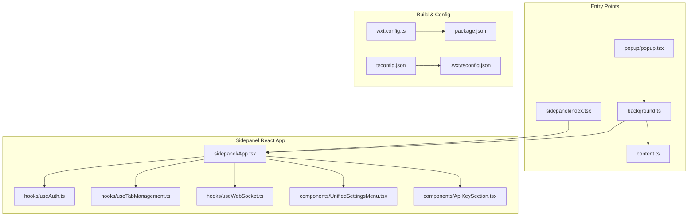
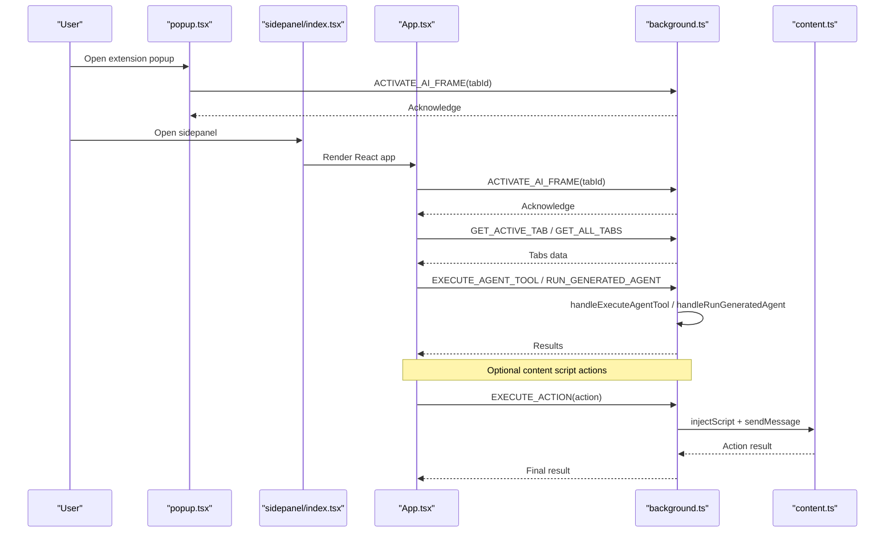
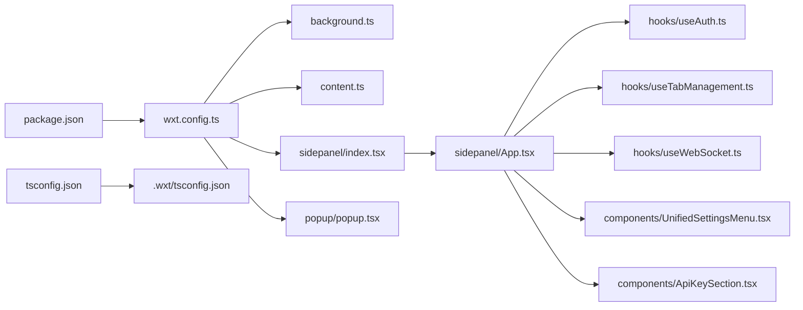

# Extension development guide

## Introduction
This guide provides a detailed walkthrough for developing browser extensions using the WXT framework. It covers environment setup, configuration, build processes, TypeScript setup, component development patterns, testing strategies, packaging and distribution, cross-browser compatibility, debugging techniques, and performance optimization. It also includes practical examples for adding new components, extending functionality, and integrating with backend services.

## Project structure
The extension is organized around WXT entrypoints and React components:
- Entry points: background service worker, content script, sidepanel UI, and popup UI
- Sidepanel UI built with React, Shadow DOM injection, and custom hooks
- Shared utilities and WebSocket client integration
- Build and configuration managed via WXT and TypeScript

```mermaid
graph TB
subgraph "Entry Points"
BG["background.ts"]
CS["content.ts"]
SP["sidepanel/index.tsx"]
POP["popup/popup.tsx"]
end
subgraph "Sidepanel React App"
APP["sidepanel/App.tsx"]
AUTH["hooks/useAuth.ts"]
TAB["hooks/useTabManagement.ts"]
WS["hooks/useWebSocket.ts"]
SET["components/UnifiedSettingsMenu.tsx"]
AK["components/ApiKeySection.tsx"]
end
subgraph "Build & Config"
WXT["wxt.config.ts"]
PKG["package.json"]
TS["tsconfig.json"]
WXT_TS[".wxt/tsconfig.json"]
end
SP --> APP
APP --> AUTH
APP --> TAB
APP --> WS
APP --> SET
APP --> AK
BG --> CS
BG --> APP
POP --> BG
WXT --> PKG
TS --> WXT_TS
```

## Core components
- WXT configuration defines module support, manifest metadata, permissions, and host permissions.
- TypeScript configuration extends WXT's internal tsconfig, enabling JSX and path aliases.
- Package scripts orchestrate development, building, and packaging for multiple browsers.
- Entry points:
  - background.ts: message routing, tab management, agent tool execution, Gemini integration
  - content.ts: optional page overlay and action execution helpers
  - sidepanel/index.tsx: mounts React app into shadow DOM
  - popup/popup.tsx: tab list UI and activation/deactivation messaging
- React hooks encapsulate authentication, tab management, and WebSocket connectivity.
- Settings menu integrates model selection, API keys, base URLs, and credential storage.

## Architecture overview
The extension follows a MV3 architecture with a background service worker coordinating messaging, tab operations, and agent tool execution. The sidepanel UI runs in a Shadow DOM, communicating with the background via runtime messages. Optional content script provides page-level actions and overlays.

```mermaid
sequenceDiagram
participant User as "User"
participant Popup as "popup.tsx"
participant Sidepanel as "sidepanel/index.tsx"
participant App as "App.tsx"
participant BG as "background.ts"
participant Content as "content.ts"
User->>Popup : Open extension popup
Popup->>BG : ACTIVATE_AI_FRAME(tabId)
BG-->>Popup : Acknowledge
User->>Sidepanel : Open sidepanel
Sidepanel->>App : Render React app
App->>BG : ACTIVATE_AI_FRAME(tabId)
BG-->>App : Acknowledge
App->>BG : GET_ACTIVE_TAB / GET_ALL_TABS
BG-->>App : Tabs data
App->>BG : EXECUTE_AGENT_TOOL / RUN_GENERATED_AGENT
BG->>BG : handleExecuteAgentTool / handleRunGeneratedAgent
BG-->>App : Results
Note over App,BG : Optional content script actions
App->>BG : EXECUTE_ACTION(action)
BG->>Content : injectScript + sendMessage
Content-->>BG : Action result
BG-->>App : Final result
```

## Detailed component analysis

### WXT configuration and build
- Modules: React module enabled for smooth integration.
- Manifest: Name, description, permissions, and host permissions configured.
- Scripts: dev, build, zip, and compile commands for Chrome and Firefox targets.

### TypeScript configuration
- Root tsconfig extends WXT's internal tsconfig.
- Compiler options enable JSX with React JSX transform, path aliases, and strictness.
- WXT internal tsconfig sets module resolution, strictness, and includes/excludes.

### Sidepanel entry point and shadow DOM injection
- Defines a content script with matches for all URLs and Shadow DOM UI mounting.
- Creates a named UI with inline positioning and lifecycle hooks for mounting/unmounting.

### Sidepanel application and state management
- Orchestrates authentication, tab management, WebSocket connectivity, and settings.
- On mount, activates AI frame in the active tab and listens to storage changes.
- Loads API key and conversation stats, with fallbacks to HTTP when WebSocket is unavailable.

### Authentication hook
- Handles browser identity launch flow, token exchange, refresh logic, and storage updates.
- Provides token age/expiry calculations and manual refresh capability.
- Supports demo GitHub login bypass for development.

### Tab management hook
- Subscribes to tab events and maintains active tab state.
- Requests all tabs from background and updates UI accordingly.

### WebSocket hook
- Manages connection status and auto-connect preferences.
- Integrates with a WebSocket client to receive progress updates and status changes.

### Unified settings menu
- Provides tabs for Settings and Profile.
- Settings include model selection, API key management, base URL configuration, and auto-connect toggle.
- Profile includes token status, manual refresh, logout, and credential storage.

### API key section component
- Simple controlled input for API key with save action.

### Background service worker
- Message router for agent tool execution, tab activation/deactivation, tab queries, action execution, Gemini requests, and generated agent runs.
- Implements reliable async handlers with error propagation.
- Tab tracking listeners update stored tab information.

### Content script
- Optional overlay creation and removal helpers.
- Action execution helpers for play/pause video, click buttons, fill forms, scroll, and page info retrieval.

### Popup UI
- Displays active tab and all tabs fetched from storage.
- Activates AI frame on mount and deactivates on cleanup.

## Dependency analysis
The extension relies on WXT for build and manifest generation, React for UI, and browser extension APIs for messaging, tabs, storage, and scripting. Hooks encapsulate cross-cutting concerns and promote reuse.

```mermaid
graph LR
PKG["package.json"]
WXT["wxt.config.ts"]
TS["tsconfig.json"]
WXT_TS[".wxt/tsconfig.json"]
BG["background.ts"]
CS["content.ts"]
SP_IDX["sidepanel/index.tsx"]
APP["sidepanel/App.tsx"]
POP["popup/popup.tsx"]
AUTH["hooks/useAuth.ts"]
TAB["hooks/useTabManagement.ts"]
WS["hooks/useWebSocket.ts"]
SET["components/UnifiedSettingsMenu.tsx"]
AK["components/ApiKeySection.tsx"]
PKG --> WXT
WXT --> BG
WXT --> CS
WXT --> SP_IDX
WXT --> POP
SP_IDX --> APP
APP --> AUTH
APP --> TAB
APP --> WS
APP --> SET
APP --> AK
TS --> WXT_TS
```

## Performance considerations
- Minimize DOM manipulations in content scripts; batch updates and avoid frequent reflows.
- Debounce tab event listeners to reduce unnecessary storage writes.
- Prefer lazy initialization for heavy modules (e.g., dynamic imports for Gemini SDK).
- Use WebSocket for real-time updates; fall back to HTTP polling gracefully.
- Keep Shadow DOM UI lightweight; defer heavy computations to background or content contexts.
- Avoid excessive background memory retention; clean up listeners and timers on unmount.

## Troubleshooting guide
Common issues and resolutions:
- Storage change listener signature: Ensure the listener accepts two parameters (changes, areaName) to prevent runtime crashes.
- Background message routing: Verify message types match between sender and receiver; log unknown types for diagnostics.
- Tab activation/deactivation: Confirm tab IDs are present before sending messages; handle errors silently to avoid blocking UI.
- Authentication flow: Validate redirect URIs and scopes; ensure backend endpoints are reachable during token exchange.
- WebSocket connectivity: Implement auto-reconnect logic and fallback to HTTP when disconnected.

## Conclusion
This guide outlined the WXT-based extension architecture, configuration, and development patterns. By using React hooks, Shadow DOM UI, and a reliable background service worker, the extension achieves modular, maintainable, and scalable functionality. Following the provided practices ensures reliable builds, cross-browser compatibility, and efficient performance.

## Appendices

### Development environment setup
- Install dependencies using the package manager configured in the project.
- Run development servers for Chrome and Firefox using WXT scripts.
- Use TypeScript compilation checks to validate type safety.

### Build and packaging
- Build for Chrome and Firefox using WXT build scripts.
- Generate ZIP archives for distribution using WXT zip scripts.
- Compile TypeScript without emitting to validate types.

### Cross-Browser compatibility
- Permissions and APIs vary slightly across browsers; test on Chrome and Firefox.
- Use browser-specific APIs judiciously and provide fallbacks where necessary.
- Validate manifest entries and permissions in each target browser.

### Testing strategies
- Unit test hooks and utilities using a testing framework compatible with browser APIs.
- Snapshot test React components to detect layout regressions.
- End-to-end test message flows between popup, sidepanel, and background.
- Mock external services (e.g., Gemini, backend endpoints) for deterministic tests.

### Extension store submission and security review
- Provide accurate metadata in the manifest (name, description, icons).
- Limit permissions to only those required for core functionality.
- Include privacy policy and terms of service links.
- Ensure secure handling of tokens and credentials; never expose secrets in client-side code.
- Implement secure communication with backend services (HTTPS, token refresh, short-lived tokens).

### Debugging techniques
- Enable developer mode in the target browser and load unpacked extensions.
- Inspect background/service worker logs for message routing and errors.
- Use React DevTools to inspect component state and props in the sidepanel UI.
- Monitor network requests and WebSocket connections for integration issues.

### Development workflow optimization
- Use incremental builds and hot reloading during development.
- Organize components into reusable hooks and shared UI elements.
- Centralize configuration (permissions, endpoints) in WXT config and environment variables.
- Automate linting and formatting to maintain code quality.
