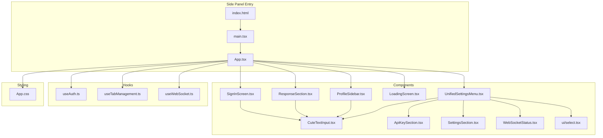
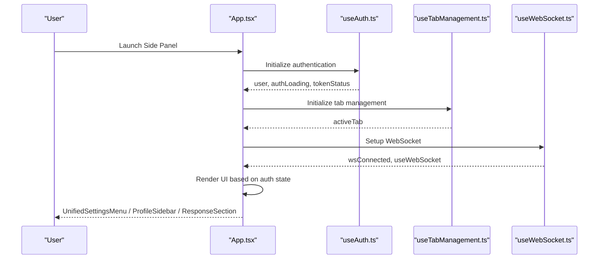
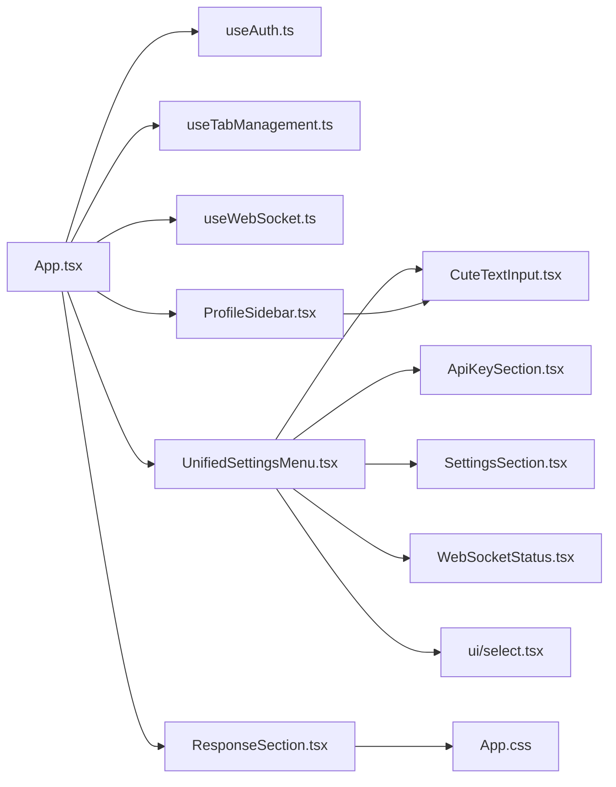

# Side panel UI components

## Introduction
This page provides detailed documentation for the Side Panel UI Components of the Agentic Browser extension. It focuses on the main App.tsx component structure, state management, and component composition patterns. It details the UnifiedSettingsMenu for configuration management, ProfileSidebar for user information display, ResponseSection for showing agent responses, and LoadingScreen for user feedback. The guide explains component hierarchy, prop passing, state synchronization, and styling approaches. It includes examples of component usage, customization options, and responsive design considerations. It also documents the integration with React hooks for authentication, tab management, and WebSocket communication, along with accessibility features, cross-browser styling compatibility, and performance optimization strategies.

## Project structure
The Side Panel UI resides under the extension entrypoint sidepanel and follows a feature-based organization:
- App.tsx orchestrates authentication, tab management, WebSocket integration, and renders the primary UI.
- Components are grouped under components/ with reusable UI primitives under components/ui/.
- Hooks encapsulate cross-cutting concerns: authentication, tab management, and WebSocket connectivity.
- Styling is centralized in App.css with global fonts loaded via index.html.

```mermaid
graph TB
subgraph "Side Panel Entry"
HTML["index.html"]
MAIN["main.tsx"]
APP["App.tsx"]
end
subgraph "Components"
SETTINGS["UnifiedSettingsMenu.tsx"]
PROFILE["ProfileSidebar.tsx"]
RESPONSE["ResponseSection.tsx"]
LOADING["LoadingScreen.tsx"]
SIGNIN["SignInScreen.tsx"]
INPUT["CuteTextInput.tsx"]
APIKEY["ApiKeySection.tsx"]
SETTINGSSHORT["SettingsSection.tsx"]
WSSTATUS["WebSocketStatus.tsx"]
SELECT["ui/select.tsx"]
end
subgraph "Hooks"
AUTH["useAuth.ts"]
TABS["useTabManagement.ts"]
WS["useWebSocket.ts"]
end
subgraph "Styling"
CSS["App.css"]
end
HTML --> MAIN --> APP
APP --> AUTH
APP --> TABS
APP --> WS
APP --> SETTINGS
APP --> PROFILE
APP --> RESPONSE
APP --> LOADING
APP --> SIGNIN
SETTINGS --> INPUT
SETTINGS --> APIKEY
SETTINGS --> SETTINGSSHORT
SETTINGS --> WSSTATUS
SETTINGS --> SELECT
PROFILE --> INPUT
RESPONSE --> INPUT
SIGNIN --> INPUT
APP --> CSS
```

## Core components
This section outlines the primary UI components and their responsibilities:
- UnifiedSettingsMenu: Centralized configuration hub supporting profile, credentials, API keys, base URL, WebSocket preferences, and connection status.
- ProfileSidebar: Displays user profile details, token information, and actions for manual refresh/logout.
- ResponseSection: Renders agent responses in a scrollable container.
- LoadingScreen: Minimal loading interface while authentication resolves.
- SignInScreen: Onboarding screen with OAuth options and animated branding.
- CuteTextInput: Styled input with focus animations and Enter submission support.
- SettingsSection and WebSocketStatus: Compact settings and connection toggles.
- select.tsx: Reusable Radix UI-based Select primitive set.

Key integration points:
- App.tsx manages global state (authentication, tab info, API key, WebSocket connection, conversation stats) and passes props to child components.
- Hooks encapsulate browser APIs and external services (OAuth, tabs, WebSocket client).
- Styling uses CSS modules and global styles for consistent theming.

## Architecture overview
The Side Panel UI follows a unidirectional data flow:
- App.tsx initializes hooks and state, then conditionally renders either LoadingScreen, SignInScreen, or the main UI with AgentExecutor and settings/profile panels.
- Hooks manage browser-specific integrations (storage, tabs, identity, WebSocket).
- Components receive props and trigger updates via callbacks, ensuring predictable state transitions.

```mermaid
sequenceDiagram
participant User as "User"
participant App as "App.tsx"
participant Auth as "useAuth.ts"
participant Tabs as "useTabManagement.ts"
participant WS as "useWebSocket.ts"
User->>App : Launch Side Panel
App->>Auth : Initialize authentication
Auth-->>App : user, authLoading, tokenStatus
App->>Tabs : Initialize tab management
Tabs-->>App : activeTab
App->>WS : Setup WebSocket
WS-->>App : wsConnected, useWebSocket
App->>App : Render UI based on auth state
App-->>User : UnifiedSettingsMenu / ProfileSidebar / ResponseSection
```

## Detailed component analysis

### App.tsx: orchestrator and state hub
Responsibilities:
- Authentication lifecycle: initialize, refresh tokens, handle login/logout.
- Tab management: track active tab and update on changes.
- WebSocket integration: connect/disconnect, listen to events, update response state.
- Conversation statistics: fetch via WebSocket client or HTTP fallback.
- UI routing: render LoadingScreen, SignInScreen, or main app with settings/profile panels.

State and effects:
- Manages local state for API key, response, token visibility, conversation stats, and settings panel open state.
- Subscribes to browser storage changes for API key updates.
- Sends messages to background script to activate/deactivate AI frame.

Propagation pattern:
- Passes authentication and token helpers to UnifiedSettingsMenu and ProfileSidebar.
- Provides WebSocket connection status and response handler to UnifiedSettingsMenu.

Customization and responsiveness:
- Uses fixed positioning for settings panel with smooth transitions.
- Applies backdrop filters and glass-morphism styling via CSS.

Accessibility and cross-browser compatibility:
- Relies on browser APIs (storage, identity, tabs) and applies minimal DOM manipulation.
- Global CSS ensures consistent styling across browsers.

### UnifiedSettingsMenu: configuration management
Responsibilities:
- Hosts two tabs: Settings and Profile.
- Settings tab: model selection, API key management, base URL, Google/JIIT connections, WebSocket auto-connect toggle.
- Profile tab: displays user info, token age/expiry, and advanced details.

State management:
- Maintains active tab, selected LLM, auto-connect preference, and JIIT portal credentials.
- Persists preferences to browser storage and localStorage.

Integration:
- Receives authentication props from App.tsx and exposes callbacks for logout/manual refresh.
- Uses CuteTextInput for secure input and handles Enter key submission.

Styling and UX:
- Fixed-position panel with smooth slide-in/out transitions.
- Glass-morphism design with backdrop blur and gradient backgrounds.
- Interactive elements include hover/focus states and subtle animations.

### ProfileSidebar: user information display
Responsibilities:
- Displays user avatar, name, email, and browser info.
- Shows token age/expiry and optional token visibility toggles.
- Provides manual refresh and logout actions.

Props and behavior:
- Controlled visibility via boolean prop; toggles via callback.
- Uses helper functions from App.tsx to compute token age/expiry.

Styling:
- Absolute positioning with shadow and gradient borders.
- Collapsible advanced details section using native details/summary.

### ResponseSection: agent response display
Responsibilities:
- Renders agent responses in a scrollable container with monospace-friendly styling.

Usage:
- Receives response string from App.tsx and conditionally renders when present.

### LoadingScreen and SignInScreen: authentication flow
- LoadingScreen: Minimal header and loading message while auth resolves.
- SignInScreen: Animated onboarding with OAuth options and feature highlights.

Both screens integrate with useAuth hooks to trigger login flows and update state.

### CuteTextInput: reusable input component
Features:
- Focus state with animated underline.
- Enter key submission support.
- Password/text modes with placeholder and controlled value.

Integration:
- Used within UnifiedSettingsMenu for API key/base URL inputs.

### SettingsSection and WebSocketStatus: compact controls
- SettingsSection: Collapsible settings with API key input and WebSocket connection toggle.
- WebSocketStatus: Simple indicator and reconnect button.

### select.tsx: UI primitive
- Provides a styled Select component set built on Radix UI with consistent theming and accessibility.

## Dependency analysis
Component and hook dependencies:
- App.tsx depends on useAuth, useTabManagement, and useWebSocket.
- UnifiedSettingsMenu depends on browser storage/localStorage and the WebSocket client.
- ProfileSidebar consumes authentication props and helper functions.
- ResponseSection consumes response state from App.tsx.
- SignInScreen triggers authentication flows via useAuth.

```mermaid
graph LR
App["App.tsx"] --> Auth["useAuth.ts"]
App --> Tabs["useTabManagement.ts"]
App --> WS["useWebSocket.ts"]
App --> Settings["UnifiedSettingsMenu.tsx"]
App --> Profile["ProfileSidebar.tsx"]
App --> Response["ResponseSection.tsx"]
Settings --> Input["CuteTextInput.tsx"]
Settings --> API["ApiKeySection.tsx"]
Settings --> WSShort["SettingsSection.tsx"]
Settings --> WSStatus["WebSocketStatus.tsx"]
Settings --> Select["ui/select.tsx"]
Profile --> Input
Response --> CSS["App.css"]
```

## Performance considerations
- Minimize re-renders by lifting state to App.tsx and passing only necessary props down.
- Debounce or throttle frequent updates (e.g., storage change listeners).
- Use lazy initialization for heavy resources (e.g., WebSocket client setup).
- Keep component trees shallow; avoid deep nesting of styled containers.
- Prefer CSS transitions for animations rather than JavaScript-driven ones.
- Use browser storage efficiently; batch writes and avoid excessive reads.

## Troubleshooting guide
Common issues and resolutions:
- Authentication failures: Verify backend service availability and OAuth configuration. Check alerts emitted during login flows.
- WebSocket disconnections: Confirm auto-connect preference and network connectivity; use the reconnect button in settings.
- Tab updates not reflected: Ensure tab listeners are registered and cleaned up properly.
- Styling inconsistencies: Confirm global fonts are loaded and CSS selectors match component classes.

## Conclusion
The Side Panel UI Components form a cohesive, modular system centered around App.tsx. They use React hooks for cross-cutting concerns, maintain consistent styling through global CSS, and provide intuitive controls for configuration and user profile management. The architecture supports scalability, accessibility, and cross-browser compatibility while keeping performance considerations front-of-mind.
