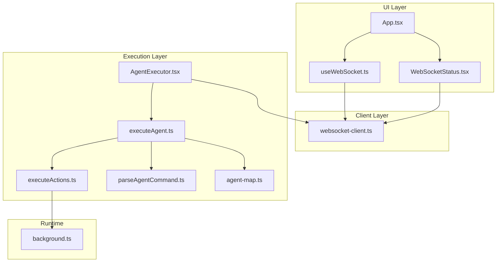
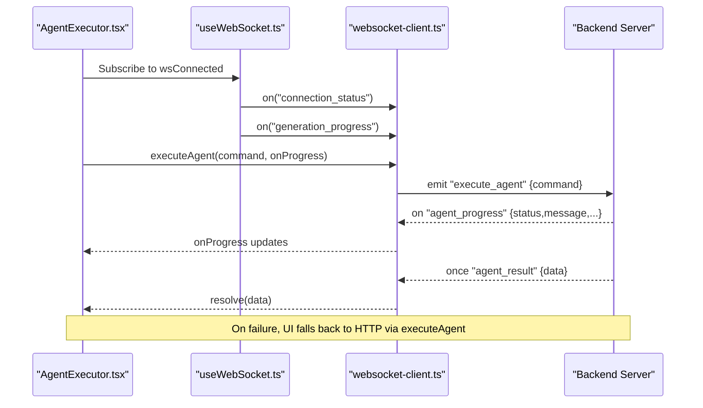
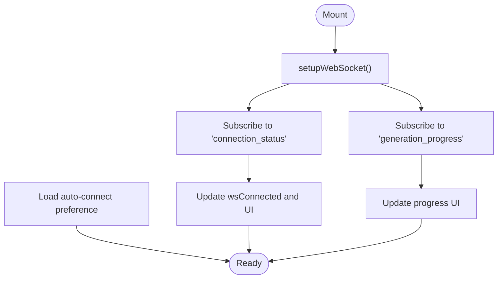
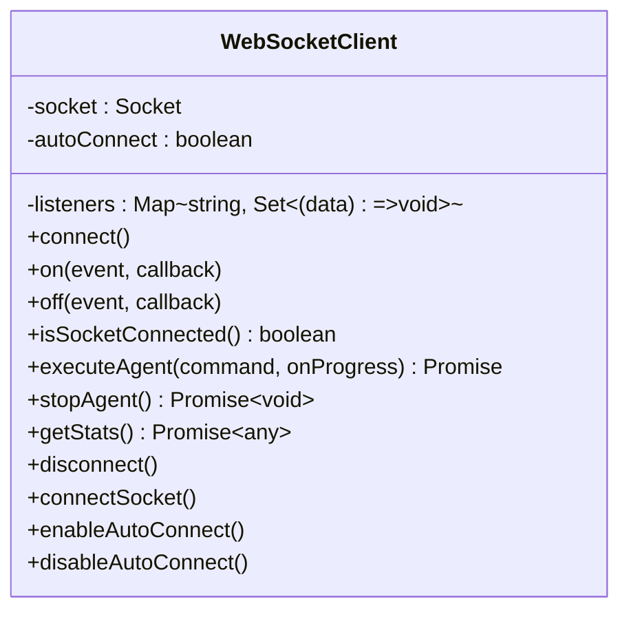
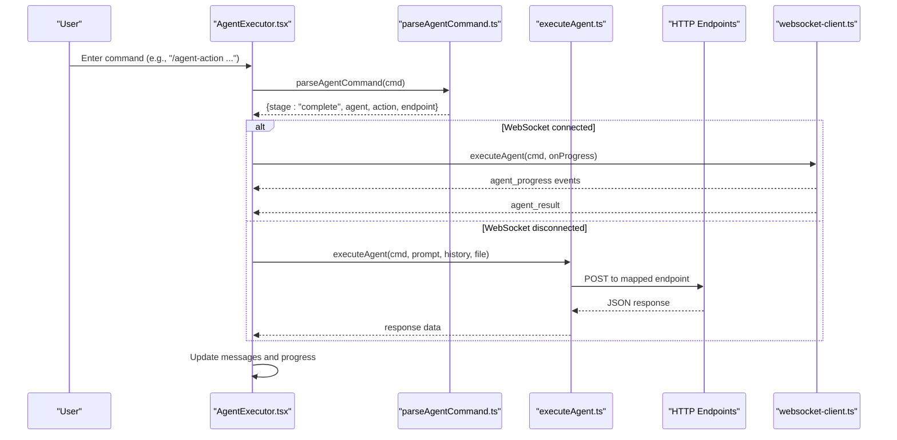
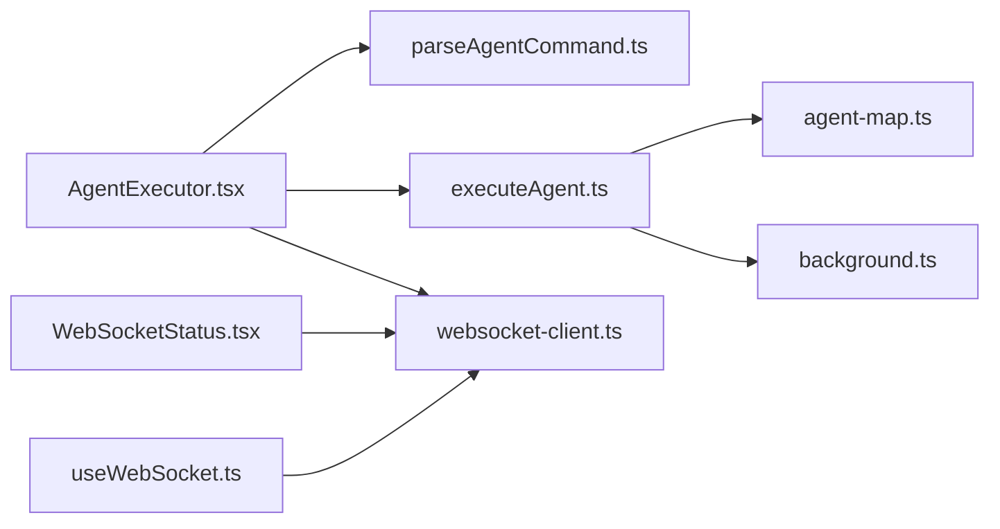

# WebSocket Communication

<cite>
**Referenced Files in This Document**
- [useWebSocket.ts](file://extension/entrypoints/sidepanel/hooks/useWebSocket.ts)
- [websocket-client.ts](file://extension/entrypoints/utils/websocket-client.ts)
- [AgentExecutor.tsx](file://extension/entrypoints/sidepanel/AgentExecutor.tsx)
- [WebSocketStatus.tsx](file://extension/entrypoints/sidepanel/components/WebSocketStatus.tsx)
- [executeAgent.ts](file://extension/entrypoints/utils/executeAgent.ts)
- [executeActions.ts](file://extension/entrypoints/utils/executeActions.ts)
- [parseAgentCommand.ts](file://extension/entrypoints/utils/parseAgentCommand.ts)
- [agent-map.ts](file://extension/entrypoints/sidepanel/lib/agent-map.ts)
- [background.ts](file://extension/entrypoints/background.ts)
- [App.tsx](file://extension/entrypoints/sidepanel/App.tsx)
</cite>

## Table of Contents
1. [Introduction](#introduction)
2. [Project Structure](#project-structure)
3. [Core Components](#core-components)
4. [Architecture Overview](#architecture-overview)
5. [Detailed Component Analysis](#detailed-component-analysis)
6. [Dependency Analysis](#dependency-analysis)
7. [Performance Considerations](#performance-considerations)
8. [Troubleshooting Guide](#troubleshooting-guide)
9. [Conclusion](#conclusion)

## Introduction
This document explains the WebSocket communication implementation for real-time agent interactions in the extension. It covers:
- The useWebSocket hook for connection state tracking and UI feedback
- The WebSocket client for bidirectional communication, message serialization, and error recovery
- Integration with AgentExecutor for dynamic response updates and conversation state management
- Message formats, lifecycle management, reconnection strategies, and HTTP fallback
- Security considerations and performance optimizations

## Project Structure
The WebSocket-related logic spans three primary areas:
- Hook and UI: useWebSocket and WebSocketStatus for connection monitoring and manual reconnect
- Client: websocket-client for transport, event routing, and agent execution APIs
- Executor: AgentExecutor orchestrating commands, progress updates, and fallback HTTP when WebSocket is unavailable

**Diagram sources**
- [useWebSocket.ts](file://extension/entrypoints/sidepanel/hooks/useWebSocket.ts#L1-L49)
- [WebSocketStatus.tsx](file://extension/entrypoints/sidepanel/components/WebSocketStatus.tsx#L1-L36)
- [websocket-client.ts](file://extension/entrypoints/utils/websocket-client.ts#L1-L133)
- [AgentExecutor.tsx](file://extension/entrypoints/sidepanel/AgentExecutor.tsx#L1-L800)
- [executeAgent.ts](file://extension/entrypoints/utils/executeAgent.ts#L1-L299)
- [executeActions.ts](file://extension/entrypoints/utils/executeActions.ts#L1-L57)
- [parseAgentCommand.ts](file://extension/entrypoints/utils/parseAgentCommand.ts#L1-L86)
- [agent-map.ts](file://extension/entrypoints/sidepanel/lib/agent-map.ts#L1-L80)
- [background.ts](file://extension/entrypoints/background.ts#L1-L800)
- [App.tsx](file://extension/entrypoints/sidepanel/App.tsx#L1-L200)

**Section sources**
- [useWebSocket.ts](file://extension/entrypoints/sidepanel/hooks/useWebSocket.ts#L1-L49)
- [websocket-client.ts](file://extension/entrypoints/utils/websocket-client.ts#L1-L133)
- [AgentExecutor.tsx](file://extension/entrypoints/sidepanel/AgentExecutor.tsx#L1-L800)
- [WebSocketStatus.tsx](file://extension/entrypoints/sidepanel/components/WebSocketStatus.tsx#L1-L36)
- [App.tsx](file://extension/entrypoints/sidepanel/App.tsx#L1-L200)

## Core Components
- useWebSocket: Subscribes to connection_status and generation_progress events, tracks wsConnected, and surfaces auto-connect preferences.
- WebSocketClient: Provides a thin wrapper over socket.io-client with event routing, agent execution APIs, and reconnection logic.
- AgentExecutor: Orchestrates agent commands, manages conversation sessions, renders progress, and falls back to HTTP when WebSocket is down.
- WebSocketStatus: UI indicator and manual reconnect/disconnect controls.
- executeAgent: Parses slash commands, resolves tab context, builds payloads, and executes HTTP fallback when needed.
- executeActions: Executes browser actions on the active tab via messaging to content scripts.
- parseAgentCommand and agent-map: Define command parsing and endpoint mapping for agent actions.

**Section sources**
- [useWebSocket.ts](file://extension/entrypoints/sidepanel/hooks/useWebSocket.ts#L1-L49)
- [websocket-client.ts](file://extension/entrypoints/utils/websocket-client.ts#L1-L133)
- [AgentExecutor.tsx](file://extension/entrypoints/sidepanel/AgentExecutor.tsx#L1-L800)
- [WebSocketStatus.tsx](file://extension/entrypoints/sidepanel/components/WebSocketStatus.tsx#L1-L36)
- [executeAgent.ts](file://extension/entrypoints/utils/executeAgent.ts#L1-L299)
- [executeActions.ts](file://extension/entrypoints/utils/executeActions.ts#L1-L57)
- [parseAgentCommand.ts](file://extension/entrypoints/utils/parseAgentCommand.ts#L1-L86)
- [agent-map.ts](file://extension/entrypoints/sidepanel/lib/agent-map.ts#L1-L80)

## Architecture Overview
The system uses socket.io-client for transport with automatic reconnection. The UI subscribes to connection_status and generation_progress to reflect real-time state. AgentExecutor delegates execution to WebSocketClient when connected, otherwise falls back to HTTP endpoints.

**Diagram sources**
- [AgentExecutor.tsx](file://extension/entrypoints/sidepanel/AgentExecutor.tsx#L456-L468)
- [websocket-client.ts](file://extension/entrypoints/utils/websocket-client.ts#L61-L91)
- [useWebSocket.ts](file://extension/entrypoints/sidepanel/hooks/useWebSocket.ts#L28-L45)

## Detailed Component Analysis

### useWebSocket Hook
- Purpose: Initialize WebSocket subscription, track connection state, and expose auto-connect preferences.
- Behavior:
  - Subscribes to connection_status to update wsConnected and UI messages.
  - Subscribes to generation_progress to stream progress updates.
  - Loads auto-connect preference from local storage.
  - Does not disconnect on unmount to allow auto-reconnect.

**Diagram sources**
- [useWebSocket.ts](file://extension/entrypoints/sidepanel/hooks/useWebSocket.ts#L28-L45)

**Section sources**
- [useWebSocket.ts](file://extension/entrypoints/sidepanel/hooks/useWebSocket.ts#L1-L49)

### WebSocket Client
- Transport: socket.io-client with transports ["websocket","polling"], reconnection enabled.
- Events:
  - "connect" -> emits "connection_status" {connected:true}
  - "disconnect" -> emits "connection_status" {connected:false, reason}
  - "generation_progress" -> re-emitted to listeners
- Execution APIs:
  - executeAgent(command, onProgress?) -> Promise resolving on "agent_result" or rejecting on "agent_error"
  - stopAgent() -> emits "stop_agent"
  - getStats() -> emits "get_stats", resolves on "stats_result" or {ok:false} after timeout
- Utility methods: disconnect/connectSocket/enableAutoConnect/disableAutoConnect/isSocketConnected

**Diagram sources**
- [websocket-client.ts](file://extension/entrypoints/utils/websocket-client.ts#L8-L133)

**Section sources**
- [websocket-client.ts](file://extension/entrypoints/utils/websocket-client.ts#L1-L133)

### AgentExecutor Integration
- Command parsing: Uses parseAgentCommand to validate and expand slash commands into agent/action endpoints.
- Conversation state: Maintains sessions/messages with auto-save/load from browser storage.
- Real-time updates: Subscribes to agent_progress events during execution and appends progress entries.
- Dynamic response rendering: Converts structured agent responses to readable text and supports action plans.
- Fallback HTTP: When WebSocket is unavailable, AgentExecutor delegates to executeAgent which builds payloads and calls HTTP endpoints.

**Diagram sources**
- [AgentExecutor.tsx](file://extension/entrypoints/sidepanel/AgentExecutor.tsx#L323-L516)
- [parseAgentCommand.ts](file://extension/entrypoints/utils/parseAgentCommand.ts#L5-L86)
- [executeAgent.ts](file://extension/entrypoints/utils/executeAgent.ts#L17-L299)
- [websocket-client.ts](file://extension/entrypoints/utils/websocket-client.ts#L61-L91)

**Section sources**
- [AgentExecutor.tsx](file://extension/entrypoints/sidepanel/AgentExecutor.tsx#L1-L800)
- [parseAgentCommand.ts](file://extension/entrypoints/utils/parseAgentCommand.ts#L1-L86)
- [executeAgent.ts](file://extension/entrypoints/utils/executeAgent.ts#L1-L299)

### WebSocketStatus Component
- Displays connection indicator and allows manual reconnect/disconnect.
- Toggles wsClient.connect()/disconnect() based on current state.

**Section sources**
- [WebSocketStatus.tsx](file://extension/entrypoints/sidepanel/components/WebSocketStatus.tsx#L1-L36)

### HTTP Fallback Mechanism
- App integrates fallback stats retrieval when WebSocket is disabled or unavailable.
- AgentExecutor uses executeAgent for HTTP execution when WebSocket is not connected.
- executeAgent resolves tab context, constructs payloads per endpoint, and performs GET/POST requests.

**Section sources**
- [App.tsx](file://extension/entrypoints/sidepanel/App.tsx#L115-L155)
- [AgentExecutor.tsx](file://extension/entrypoints/sidepanel/AgentExecutor.tsx#L384-L447)
- [executeAgent.ts](file://extension/entrypoints/utils/executeAgent.ts#L17-L299)

### Browser Action Execution
- executeActions translates high-level actions into tab-level operations.
- Sends messages to the active tab’s content script for DOM manipulation.
- Includes delays between actions to avoid overwhelming the page.

**Section sources**
- [executeActions.ts](file://extension/entrypoints/utils/executeActions.ts#L1-L57)
- [background.ts](file://extension/entrypoints/background.ts#L428-L449)

## Dependency Analysis
- UI depends on WebSocket client for real-time updates.
- AgentExecutor depends on:
  - parseAgentCommand for command validation
  - agent-map for endpoint resolution
  - executeAgent for HTTP fallback
  - executeActions for runtime browser automation
- background.ts handles cross-tab messaging for action execution.

**Diagram sources**
- [AgentExecutor.tsx](file://extension/entrypoints/sidepanel/AgentExecutor.tsx#L1-L800)
- [parseAgentCommand.ts](file://extension/entrypoints/utils/parseAgentCommand.ts#L1-L86)
- [executeAgent.ts](file://extension/entrypoints/utils/executeAgent.ts#L1-L299)
- [agent-map.ts](file://extension/entrypoints/sidepanel/lib/agent-map.ts#L1-L80)
- [websocket-client.ts](file://extension/entrypoints/utils/websocket-client.ts#L1-L133)
- [WebSocketStatus.tsx](file://extension/entrypoints/sidepanel/components/WebSocketStatus.tsx#L1-L36)
- [useWebSocket.ts](file://extension/entrypoints/sidepanel/hooks/useWebSocket.ts#L1-L49)
- [background.ts](file://extension/entrypoints/background.ts#L428-L449)

**Section sources**
- [AgentExecutor.tsx](file://extension/entrypoints/sidepanel/AgentExecutor.tsx#L1-L800)
- [websocket-client.ts](file://extension/entrypoints/utils/websocket-client.ts#L1-L133)

## Performance Considerations
- Reconnection strategy: Automatic reconnection with exponential backoff reduces server load and improves resilience.
- Event-driven updates: Streaming agent_progress minimizes polling overhead and improves perceived responsiveness.
- Payload construction: executeAgent avoids unnecessary data by capturing only required context (e.g., active tab HTML).
- Batched UI updates: Progress updates are appended incrementally to reduce layout thrashing.
- Fallback HTTP: When WebSocket is unavailable, HTTP requests are used to maintain functionality without blocking the UI.

[No sources needed since this section provides general guidance]

## Troubleshooting Guide
Common issues and remedies:
- WebSocket not connecting:
  - Verify VITE_API_URL and network accessibility.
  - Use WebSocketStatus to manually reconnect.
  - Check connection_status events for reasons.
- Execution failures:
  - Inspect agent_error events and error messages.
  - Confirm command parsing via parseAgentCommand.
  - Validate endpoint mapping in agent-map.
- HTTP fallback errors:
  - Review executeAgent error handling and HTTP status codes.
  - Ensure required credentials and context (e.g., active tab) are present.
- Action execution not applied:
  - Confirm content script injection and messaging to active tab.
  - Check background.ts handlers for EXECUTE_ACTION.

**Section sources**
- [websocket-client.ts](file://extension/entrypoints/utils/websocket-client.ts#L17-L40)
- [AgentExecutor.tsx](file://extension/entrypoints/sidepanel/AgentExecutor.tsx#L479-L515)
- [parseAgentCommand.ts](file://extension/entrypoints/utils/parseAgentCommand.ts#L5-L86)
- [executeAgent.ts](file://extension/entrypoints/utils/executeAgent.ts#L292-L298)
- [executeActions.ts](file://extension/entrypoints/utils/executeActions.ts#L1-L57)
- [background.ts](file://extension/entrypoints/background.ts#L428-L449)

## Conclusion
The WebSocket communication layer provides robust, real-time agent interactions with graceful fallback to HTTP. The useWebSocket hook and WebSocketStatus offer clear connection monitoring, while WebSocketClient encapsulates transport and execution APIs. AgentExecutor integrates these capabilities with conversation state management and dynamic response updates, ensuring a responsive and resilient user experience.