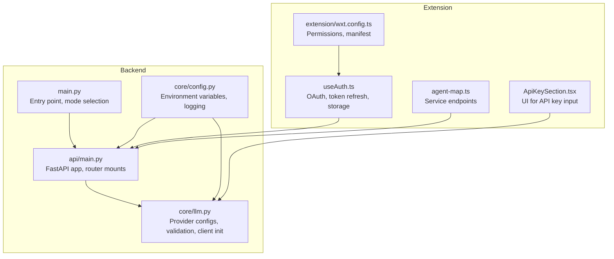
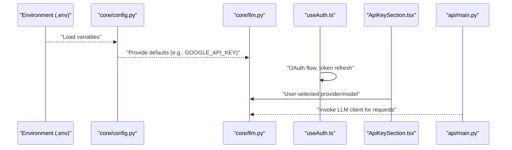
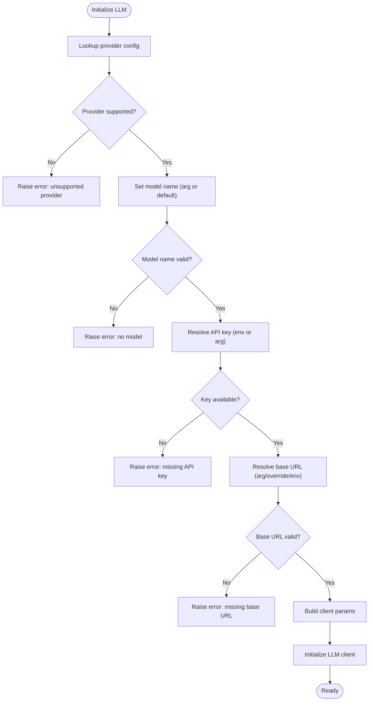
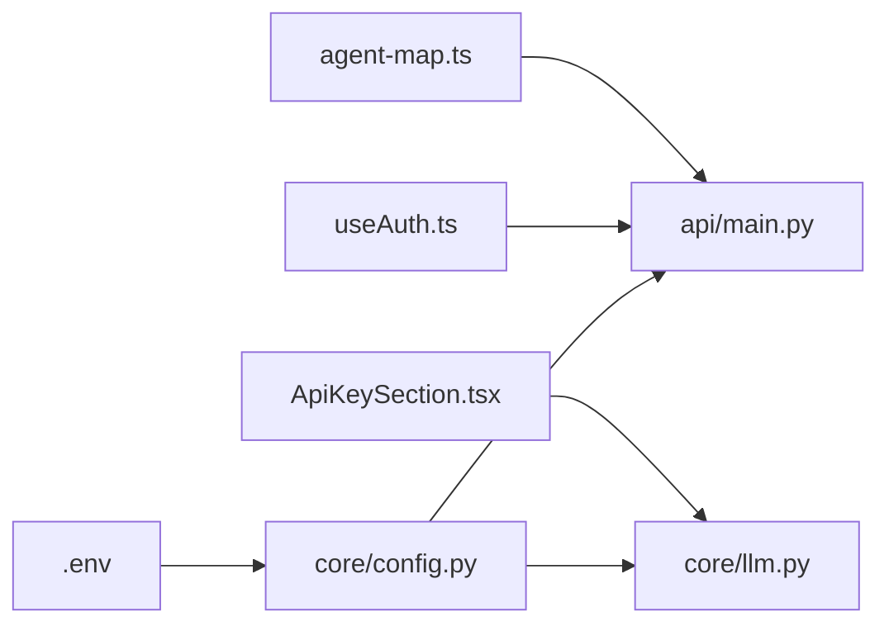

# Configuration management

## Introduction
This page explains the Configuration Management system across the Agentic Browser system. It covers how environment variables are loaded and used, how LLM providers are configured and validated, how service credentials and tokens are managed in the extension, and how configuration flows from environment variables to runtime UI inputs. It also documents the configuration hierarchy, fallback mechanisms, development versus production differences, and best practices for secure handling of sensitive data.

## Project structure
Configuration spans three primary areas:
- Backend core configuration and LLM provider selection
- API server bootstrap and routing
- Extension-side authentication, token lifecycle, and UI-driven configuration inputs

```mermaid
graph TB
subgraph "Backend"
CFG["core/config.py<br/>Environment variables, logging"]
LLM["core/llm.py<br/>Provider configs, validation, client init"]
API["api/main.py<br/>FastAPI app, router mounts"]
MAIN["main.py<br/>Entry point, mode selection"]
end
subgraph "Extension"
WXT["extension/wxt.config.ts<br/>Permissions, manifest"]
AUTH["useAuth.ts<br/>OAuth, token refresh, storage"]
KEYUI["ApiKeySection.tsx<br/>UI for API key input"]
MAP["agent-map.ts<br/>Service endpoints"]
end
MAIN --> API
API --> LLM
CFG --> API
CFG --> LLM
AUTH --> API
KEYUI --> LLM
MAP --> API
WXT --> AUTH
```

## Core components
- Environment configuration loader and defaults
  - Loads environment variables from a.env file and sets defaults for environment, debug mode, backend host/port, and Google API key.
  - Provides a logger factory that respects the computed log level.
  - Reference: `core/config.py`

- LLM provider configuration and initialization
  - Centralized provider registry with per-provider class, environment variable names, default models, and parameter mappings.
  - Validation logic ensures required keys/base URLs are present depending on provider.
  - Supports multiple backends: Google, OpenAI-compatible, Anthropic, Ollama, DeepSeek, OpenRouter.
  - Reference: `core/llm.py`, `core/llm.py`

- API server bootstrap and routing
  - FastAPI application definition and router mounts for various services.
  - Reference: `api/main.py`

- Entry point and mode selection
  - CLI entry point supports running as API or MCP server, with optional non-interactive default to API.
  - Reference: `main.py`

- Extension configuration and permissions
  - Manifest defines permissions and host permissions for the extension.
  - Reference: `extension/wxt.config.ts`

## Architecture overview
The configuration architecture follows a layered approach:
- Environment variables are loaded early in the process and influence logging, backend host/port, and default Google API key.
- LLM configuration is provider-centric with explicit environment variable requirements and fallbacks.
- The extension manages service credentials via OAuth and local storage, exposing UI controls for API key input and provider/model selection.
- Service endpoints are declared in the extension and mounted in the API server.

```mermaid
sequenceDiagram
participant Env as "Environment (.env)"
participant CoreCfg as "core/config.py"
participant LLM as "core/llm.py"
participant ExtAuth as "useAuth.ts"
participant ExtKeyUI as "ApiKeySection.tsx"
participant API as "api/main.py"
Env-->>CoreCfg : "Load variables"
CoreCfg-->>LLM : "Provide defaults (e.g., GOOGLE_API_KEY)"
ExtAuth->>ExtAuth : "OAuth flow, token refresh"
ExtKeyUI->>LLM : "User-selected provider/model"
API-->>LLM : "Invoke LLM client for requests"
```

## Detailed component analysis

### Environment configuration system
- Variable loading
  - Loads.env variables at import time.
  - Sets environment and debug flags with sensible defaults.
  - Defines backend host and port with defaults suitable for local development.
  - Extracts a default Google API key for convenience.
  - Reference: `core/config.py`

- Logging configuration
  - Computes logging level based on debug flag and applies it globally.
  - Exposes a logger factory to ensure consistent logging across modules.
  - Reference: `core/config.py`

- Development vs Production differences
  - Debug mode toggles logging verbosity.
  - Host/port defaults target local development; adjust for production deployments.
  - Reference: `core/config.py`

- Configuration validation
  - Logging level is derived from environment variables; misconfiguration affects observability.
  - Reference: `core/config.py`

### LLM provider configuration and fallback mechanisms
- Provider registry
  - Centralized mapping of provider identifiers to LangChain classes, environment variables, default models, and parameter mappings.
  - Includes support for Google, OpenAI-compatible, Anthropic, Ollama, DeepSeek, and OpenRouter.
  - Reference: `core/llm.py`

- Initialization logic
  - Validates provider existence and model availability.
  - Resolves API key from constructor argument or environment variable depending on provider requirements.
  - Resolves base URL from constructor, override, or environment variable; raises explicit errors if missing.
  - Builds parameter dictionary and initializes the underlying LLM client.
  - Reference: `core/llm.py`

- Fallback mechanisms
  - Uses provider-specific defaults for model names.
  - Applies base URL overrides for certain providers (e.g., DeepSeek, OpenRouter).
  - Raises descriptive errors when required credentials or URLs are missing.
  - Reference: `core/llm.py`

- BYOKeys approach
  - Supports passing API keys directly to the constructor for providers that require them.
  - For providers that do not require API keys (e.g., Ollama), passing an API key is tolerated with a warning.
  - Reference: `core/llm.py`

- Example provider selection flow

```mermaid
flowchart TD
Start(["Initialize LLM"]) --> CheckProvider["Lookup provider config"]
CheckProvider --> ProviderFound{"Provider supported?"}
ProviderFound --> |No| ErrorProvider["Raise error: unsupported provider"]
ProviderFound --> |Yes| SetModel["Set model name (arg or default)"]
SetModel --> ModelValid{"Model name valid?"}
ModelValid --> |No| ErrorModel["Raise error: no model"]
ModelValid --> |Yes| ResolveKey["Resolve API key (env or arg)"]
ResolveKey --> KeyProvided{"Key available?"}
KeyProvided --> |No| ErrorKey["Raise error: missing API key"]
KeyProvided --> |Yes| ResolveBaseURL["Resolve base URL (arg/override/env)"]
ResolveBaseURL --> URLValid{"Base URL valid?"}
URLValid --> |No| ErrorURL["Raise error: missing base URL"]
URLValid --> |Yes| BuildParams["Build client params"]
BuildParams --> InitClient["Initialize LLM client"]
InitClient --> Done(["Ready"])
```

### Service credentials, authentication, and token management
- Extension OAuth and token lifecycle
  - Uses browser identity APIs to initiate OAuth with Google, exchange authorization code for tokens, and persist user data in local storage.
  - Implements automatic token refresh when nearing expiration and manual refresh capability.
  - Handles token status display and user feedback.
  - Reference: `extension/entrypoints/sidepanel/hooks/useAuth.ts`

- Service endpoint mapping
  - Declares service endpoints for Gmail, Calendar, Google Search, YouTube, Website, GitHub, JIIT portal, React AI, Browser Agent, and File Upload.
  - Reference: `extension/entrypoints/sidepanel/lib/agent-map.ts`

- UI-driven API key input
  - Provides a password-protected input component for API keys and a save action.
  - Reference: `extension/entrypoints/sidepanel/components/ApiKeySection.tsx`

- Permissions and host access
  - Manifest defines broad permissions and host permissions required by the extension.
  - Reference: `extension/wxt.config.ts`

### Configuration hierarchy: environment variables to runtime UI inputs
- Backend
  - Environment variables loaded via dotenv and applied to logging and defaults.
  - LLM provider selection and initialization consume environment variables for API keys and base URLs.
  - Reference: `core/config.py`, `core/llm.py`

- Frontend
  - UI components allow users to change provider and model selections and save API keys.
  - These selections influence how the LLM client is constructed and invoked downstream.
  - Reference: `extension/entrypoints/sidepanel/components/ApiKeySection.tsx`, `core/llm.py`

- API server
  - Routers mount service endpoints; the extension's agent map aligns with these routes.
  - Reference: `api/main.py`, `extension/entrypoints/sidepanel/lib/agent-map.ts`

### Configuration validation and error handling
- LLM initialization validation
  - Explicit checks for unsupported providers, missing model names, missing API keys, and missing base URLs.
  - Descriptive error messages guide users to set environment variables or pass arguments.
  - Reference: `core/llm.py`

- Logging and diagnostics
  - Logger factory ensures consistent logging levels derived from environment variables.
  - Reference: `core/config.py`

- Frontend error handling
  - OAuth failures and token refresh errors are surfaced to the user with actionable messages.
  - Reference: `extension/entrypoints/sidepanel/hooks/useAuth.ts`

### Configuration hot-reloading and dynamic updates
- Environment variables
  - The backend loads.env at import time; changes require restarting the process to take effect.
  - Reference: `core/config.py`, `main.py`

- Extension UI updates
  - Local storage changes trigger UI updates; token refresh occurs automatically when needed.
  - Reference: `extension/entrypoints/sidepanel/hooks/useAuth.ts`

## Dependency analysis
- Backend dependencies
  - FastAPI application depends on core configuration for logging and on LLM provider configuration for model selection.
  - Reference: `api/main.py`, `core/config.py`, `core/llm.py`

- Frontend dependencies
  - Authentication hook depends on browser identity APIs and local storage.
  - UI components depend on provider/model choices and local storage persistence.
  - Reference: `extension/entrypoints/sidepanel/hooks/useAuth.ts`, `extension/entrypoints/sidepanel/components/ApiKeySection.tsx`

```mermaid
graph LR
DOTENV[".env"] --> CFG["core/config.py"]
CFG --> API["api/main.py"]
CFG --> LLM["core/llm.py"]
AUTH["useAuth.ts"] --> API
KEYUI["ApiKeySection.tsx"] --> LLM
MAP["agent-map.ts"] --> API
```

## Performance considerations
- Avoid repeated environment parsing: load.env once at startup and reuse cached values.
- Minimize LLM client reinitialization: cache the LLM instance and reuse it across requests.
- Reduce network calls: batch token refreshes and avoid unnecessary re-authentication.
- Logging overhead: tune logging level in production to reduce I/O.

## Troubleshooting guide
- Missing API key for a provider
  - Symptom: Initialization error indicating missing API key for the selected provider.
  - Resolution: Set the appropriate environment variable or pass the key directly to the LLM constructor.
  - Reference: `core/llm.py`

- Missing base URL for a provider
  - Symptom: Initialization error indicating missing base URL for the selected provider.
  - Resolution: Set the provider's base URL environment variable or pass it explicitly.
  - Reference: `core/llm.py`

- Unsupported provider
  - Symptom: Error indicating an unsupported provider identifier.
  - Resolution: Choose a supported provider from the registry.
  - Reference: `core/llm.py`

- OAuth failure in extension
  - Symptom: Authentication failed alerts and inability to exchange code for tokens.
  - Resolution: Ensure the backend is running, verify redirect URI, and confirm required scopes.
  - Reference: `extension/entrypoints/sidepanel/hooks/useAuth.ts`

- Token refresh issues
  - Symptom: Token expired or failed to refresh.
  - Resolution: Use manual refresh or re-authenticate; ensure refresh token is available.
  - Reference: `extension/entrypoints/sidepanel/hooks/useAuth.ts`

- Logging verbosity
  - Symptom: Too verbose or too quiet logs.
  - Resolution: Adjust debug flag to toggle logging level.
  - Reference: `core/config.py`

## Conclusion
The Agentic Browser configuration system combines environment-driven defaults with explicit provider configuration and runtime UI inputs. The backend enforces strict validation for LLM providers, while the extension manages authentication and token lifecycles. By following the outlined best practices and troubleshooting steps, teams can reliably deploy and operate the system across development and production environments.

## Appendices

### Environment variables and defaults
- Environment and debug flags
  - Reference: `core/config.py`
- Backend host and port
  - Reference: `core/config.py`
- Google API key default
  - Reference: `core/config.py`
- LLM provider environment variables
  - Reference: `core/llm.py`

### Deployment scenarios and examples
- Development
  - Run the API server locally with default host/port and enable debug logging.
  - Reference: `core/config.py`, `main.py`
- Production
  - Set environment variables for production host/port and credentials.
  - Reference: `core/config.py`, `core/llm.py`

### Best practices for sensitive configuration
- Store API keys and secrets in environment variables; avoid committing them to source control.
- Use provider-specific environment variables and avoid embedding secrets in code.
- Limit extension permissions to those required for functionality.
- Reference: `core/llm.py`, `extension/wxt.config.ts`
