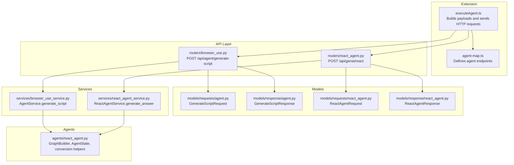
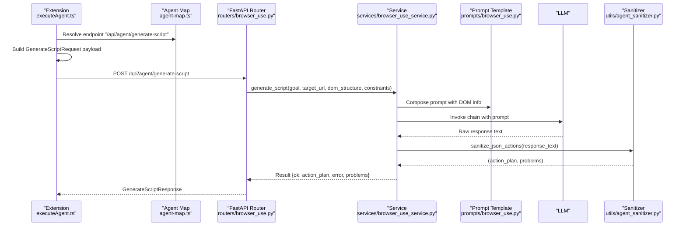
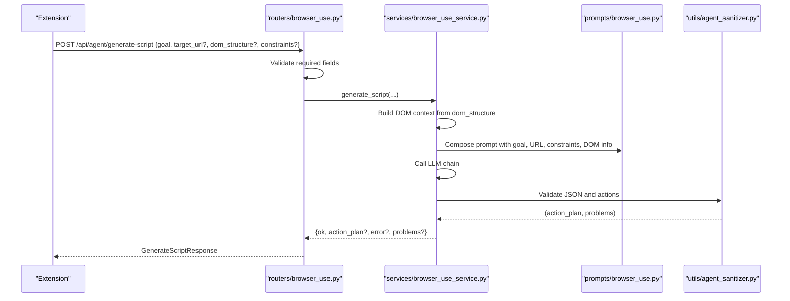
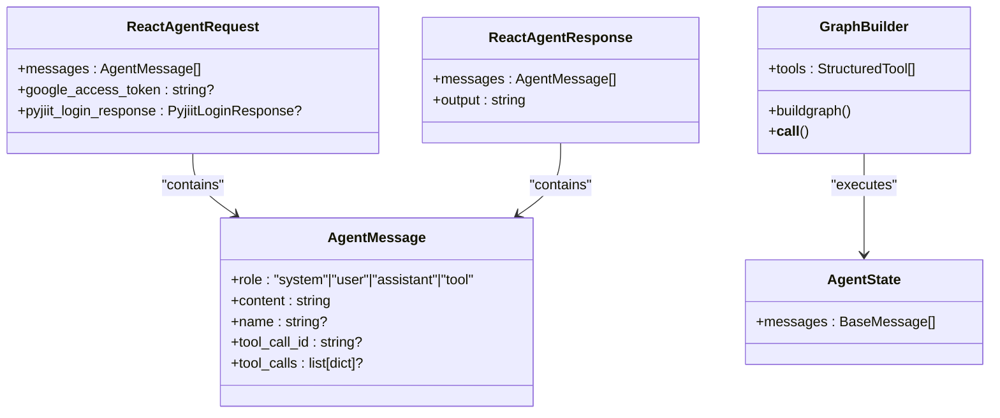
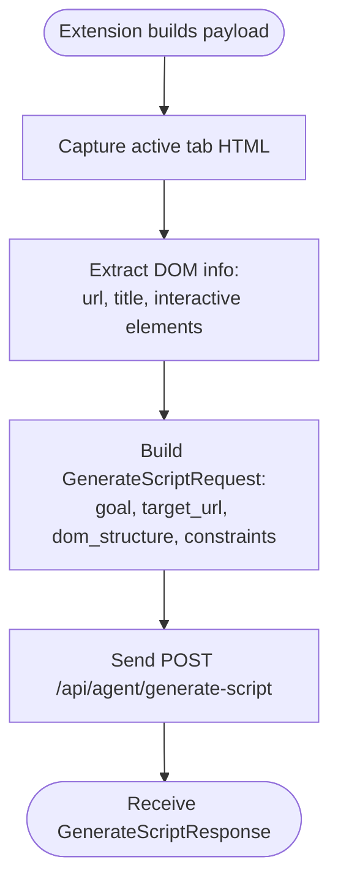
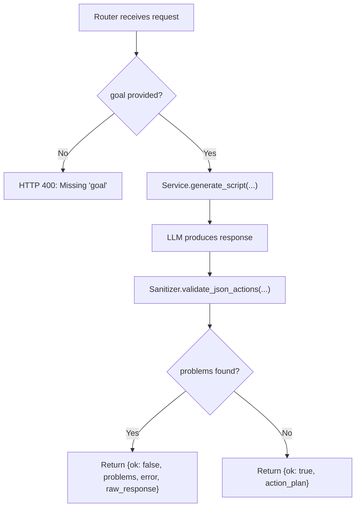
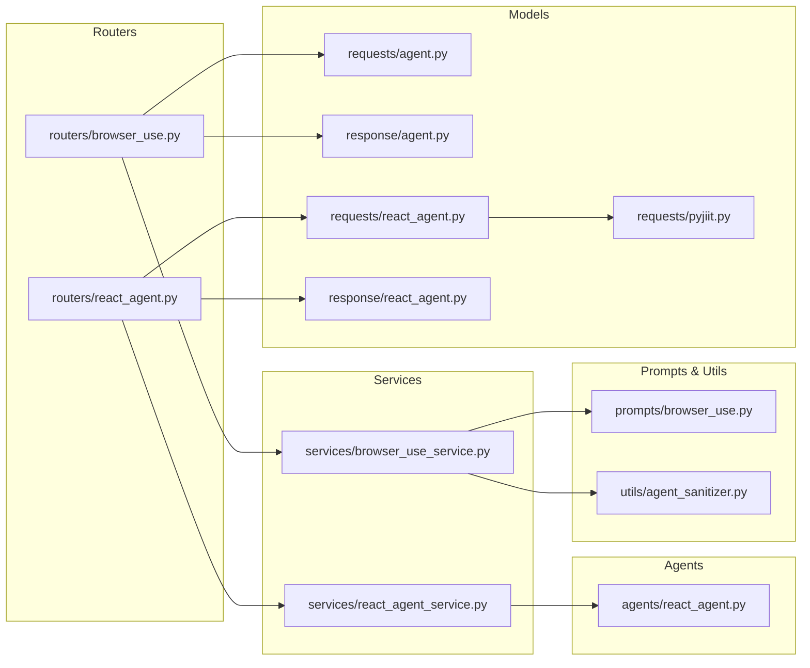

# Agent Communication Models

<cite>
**Referenced Files in This Document**
- [models/requests/agent.py](file://models/requests/agent.py)
- [models/response/agent.py](file://models/response/agent.py)
- [routers/browser_use.py](file://routers/browser_use.py)
- [services/browser_use_service.py](file://services/browser_use_service.py)
- [prompts/browser_use.py](file://prompts/browser_use.py)
- [utils/agent_sanitizer.py](file://utils/agent_sanitizer.py)
- [models/requests/react_agent.py](file://models/requests/react_agent.py)
- [models/response/react_agent.py](file://models/response/react_agent.py)
- [agents/react_agent.py](file://agents/react_agent.py)
- [services/react_agent_service.py](file://services/react_agent_service.py)
- [routers/react_agent.py](file://routers/react_agent.py)
- [extension/entrypoints/utils/executeAgent.ts](file://extension/entrypoints/utils/executeAgent.ts)
- [extension/entrypoints/sidepanel/lib/agent-map.ts](file://extension/entrypoints/sidepanel/lib/agent-map.ts)
- [models/requests/pyjiit.py](file://models/requests/pyjiit.py)
</cite>

## Table of Contents
1. [Introduction](#introduction)
2. [Project Structure](#project-structure)
3. [Core Components](#core-components)
4. [Architecture Overview](#architecture-overview)
5. [Detailed Component Analysis](#detailed-component-analysis)
6. [Dependency Analysis](#dependency-analysis)
7. [Performance Considerations](#performance-considerations)
8. [Troubleshooting Guide](#troubleshooting-guide)
9. [Conclusion](#conclusion)

## Introduction
This document provides comprehensive data model documentation for agent communication schemas, focusing on:
- The GenerateScriptRequest model used for browser automation requests, including goal specification, target URL handling, DOM structure representation, and constraint definitions
- The corresponding response model and validation rules
- The agent message payload structure, conversation context management, and state preservation mechanisms
- Field definitions, optional parameter handling, and data type specifications
- Examples of request/response cycles, error handling patterns, and validation scenarios
- The relationship between agent models and the reactive agent system architecture

## Project Structure
The agent communication models span three primary layers:
- Request/response models: Strongly typed Pydantic models defining the shape of incoming/outgoing data
- Routers: FastAPI endpoints that validate inputs and orchestrate service calls
- Services: Business logic that interacts with LLMs, sanitizers, and external systems

**Diagram sources**
- [extension/entrypoints/utils/executeAgent.ts](file://extension/entrypoints/utils/executeAgent.ts#L169-L227)
- [extension/entrypoints/sidepanel/lib/agent-map.ts](file://extension/entrypoints/sidepanel/lib/agent-map.ts#L64-L69)
- [routers/browser_use.py](file://routers/browser_use.py#L16-L51)
- [routers/react_agent.py](file://routers/react_agent.py#L18-L57)
- [models/requests/agent.py](file://models/requests/agent.py#L5-L10)
- [models/response/agent.py](file://models/response/agent.py#L5-L11)
- [models/requests/react_agent.py](file://models/requests/react_agent.py#L27-L45)
- [models/response/react_agent.py](file://models/response/react_agent.py#L10-L15)
- [services/browser_use_service.py](file://services/browser_use_service.py#L11-L96)
- [services/react_agent_service.py](file://services/react_agent_service.py#L16-L154)
- [agents/react_agent.py](file://agents/react_agent.py#L40-L191)

**Section sources**
- [extension/entrypoints/utils/executeAgent.ts](file://extension/entrypoints/utils/executeAgent.ts#L169-L227)
- [extension/entrypoints/sidepanel/lib/agent-map.ts](file://extension/entrypoints/sidepanel/lib/agent-map.ts#L64-L69)
- [routers/browser_use.py](file://routers/browser_use.py#L16-L51)
- [routers/react_agent.py](file://routers/react_agent.py#L18-L57)
- [models/requests/agent.py](file://models/requests/agent.py#L5-L10)
- [models/response/agent.py](file://models/response/agent.py#L5-L11)
- [models/requests/react_agent.py](file://models/requests/react_agent.py#L27-L45)
- [models/response/react_agent.py](file://models/response/react_agent.py#L10-L15)
- [services/browser_use_service.py](file://services/browser_use_service.py#L11-L96)
- [services/react_agent_service.py](file://services/react_agent_service.py#L16-L154)
- [agents/react_agent.py](file://agents/react_agent.py#L40-L191)

## Core Components
This section documents the two primary agent communication schemas and their relationships.

### GenerateScriptRequest Model
Purpose: Defines the input schema for generating a browser automation action plan from a natural language goal.

Fields:
- goal: Required string describing the automation task
- target_url: Optional string; defaults to empty string if omitted
- dom_structure: Optional dictionary; defaults to empty dictionary if omitted
- constraints: Optional dictionary; defaults to empty dictionary if omitted

Validation and behavior:
- Goal is mandatory; router rejects requests without it
- DOM structure and constraints are optional and used to enrich the LLM prompt
- Router forwards validated fields to the service

Data type specifications:
- goal: string
- target_url: string | null
- dom_structure: dict[str, Any] | null
- constraints: dict[str, Any] | null

Optional parameter handling:
- Empty string fallback for target_url
- Empty dict fallback for dom_structure and constraints

**Section sources**
- [models/requests/agent.py](file://models/requests/agent.py#L5-L10)
- [routers/browser_use.py](file://routers/browser_use.py#L22-L30)

### GenerateScriptResponse Model
Purpose: Defines the standardized response for automation plan generation.

Fields:
- ok: Boolean flag indicating success or failure
- action_plan: Optional dictionary containing the generated JSON action plan
- error: Optional string describing the error on failure
- problems: Optional list of validation problem strings
- raw_response: Optional string containing the raw LLM output for inspection

Validation and behavior:
- On success: ok is true and action_plan is populated
- On validation failure: ok is false, problems is set, error describes the issue
- On general failure: ok is false, error contains the error message

**Section sources**
- [models/response/agent.py](file://models/response/agent.py#L5-L11)
- [services/browser_use_service.py](file://services/browser_use_service.py#L82-L91)

### ReactAgentRequest and ReactAgentResponse Models
Purpose: Define the input and output schemas for the reactive agent system that handles general conversational tasks with optional tool use.

ReactAgentRequest fields:
- messages: Required list of AgentMessage entries; minimum length 1
- google_access_token: Optional string; supports multiple aliases for tolerance
- pyjiit_login_response: Optional nested PyjiitLoginResponse object

AgentMessage fields:
- role: Literal role among "system", "user", "assistant", "tool"
- content: Required string with minimum length 1
- name: Optional string
- tool_call_id: Optional string; alias supported
- tool_calls: Optional list of tool call dictionaries

ReactAgentResponse fields:
- messages: Final conversation state including the agent reply
- output: Content of the latest assistant message

Validation and behavior:
- Messages list must not be empty
- Role must be one of the allowed literals
- Tool calls are preserved when present
- Response mirrors the final state of the conversation

**Section sources**
- [models/requests/react_agent.py](file://models/requests/react_agent.py#L10-L45)
- [models/response/react_agent.py](file://models/response/react_agent.py#L10-L15)
- [models/requests/pyjiit.py](file://models/requests/pyjiit.py#L54-L91)

## Architecture Overview
The agent communication architecture integrates extension-driven payload construction, API validation, service orchestration, and agent/graph execution.

**Diagram sources**
- [extension/entrypoints/utils/executeAgent.ts](file://extension/entrypoints/utils/executeAgent.ts#L169-L227)
- [extension/entrypoints/sidepanel/lib/agent-map.ts](file://extension/entrypoints/sidepanel/lib/agent-map.ts#L64-L69)
- [routers/browser_use.py](file://routers/browser_use.py#L16-L51)
- [services/browser_use_service.py](file://services/browser_use_service.py#L11-L96)
- [prompts/browser_use.py](file://prompts/browser_use.py#L5-L138)
- [utils/agent_sanitizer.py](file://utils/agent_sanitizer.py#L20-L96)

## Detailed Component Analysis

### GenerateScriptRequest/Response Workflow
This workflow demonstrates the end-to-end cycle for generating a browser automation action plan.

**Diagram sources**
- [routers/browser_use.py](file://routers/browser_use.py#L16-L51)
- [services/browser_use_service.py](file://services/browser_use_service.py#L11-L96)
- [prompts/browser_use.py](file://prompts/browser_use.py#L5-L138)
- [utils/agent_sanitizer.py](file://utils/agent_sanitizer.py#L20-L96)

**Section sources**
- [routers/browser_use.py](file://routers/browser_use.py#L16-L51)
- [services/browser_use_service.py](file://services/browser_use_service.py#L11-L96)
- [prompts/browser_use.py](file://prompts/browser_use.py#L5-L138)
- [utils/agent_sanitizer.py](file://utils/agent_sanitizer.py#L20-L96)

### React Agent Message Payload and Conversation State
The reactive agent system manages conversation context and preserves state across turns.

**Diagram sources**
- [models/requests/react_agent.py](file://models/requests/react_agent.py#L10-L45)
- [models/response/react_agent.py](file://models/response/react_agent.py#L10-L15)
- [agents/react_agent.py](file://agents/react_agent.py#L40-L191)

**Section sources**
- [models/requests/react_agent.py](file://models/requests/react_agent.py#L10-L45)
- [models/response/react_agent.py](file://models/response/react_agent.py#L10-L15)
- [agents/react_agent.py](file://agents/react_agent.py#L40-L191)

### DOM Structure Representation and Target URL Handling
The extension captures DOM information and constructs the GenerateScriptRequest payload.

**Diagram sources**
- [extension/entrypoints/utils/executeAgent.ts](file://extension/entrypoints/utils/executeAgent.ts#L169-L227)

**Section sources**
- [extension/entrypoints/utils/executeAgent.ts](file://extension/entrypoints/utils/executeAgent.ts#L169-L227)

### Validation Rules and Error Handling Patterns
Validation spans multiple layers:
- Router-level validation ensures required fields are present
- Service-level prompt composition and LLM invocation
- Sanitizer validates JSON structure and action semantics
- Error responses maintain a consistent shape

**Diagram sources**
- [routers/browser_use.py](file://routers/browser_use.py#L22-L44)
- [services/browser_use_service.py](file://services/browser_use_service.py#L82-L91)
- [utils/agent_sanitizer.py](file://utils/agent_sanitizer.py#L20-L96)

**Section sources**
- [routers/browser_use.py](file://routers/browser_use.py#L22-L44)
- [services/browser_use_service.py](file://services/browser_use_service.py#L82-L91)
- [utils/agent_sanitizer.py](file://utils/agent_sanitizer.py#L20-L96)

## Dependency Analysis
The following diagram shows key dependencies between models, routers, services, and utilities.

**Diagram sources**
- [models/requests/agent.py](file://models/requests/agent.py#L5-L10)
- [models/response/agent.py](file://models/response/agent.py#L5-L11)
- [models/requests/react_agent.py](file://models/requests/react_agent.py#L27-L45)
- [models/response/react_agent.py](file://models/response/react_agent.py#L10-L15)
- [models/requests/pyjiit.py](file://models/requests/pyjiit.py#L54-L91)
- [routers/browser_use.py](file://routers/browser_use.py#L16-L51)
- [routers/react_agent.py](file://routers/react_agent.py#L18-L57)
- [services/browser_use_service.py](file://services/browser_use_service.py#L11-L96)
- [services/react_agent_service.py](file://services/react_agent_service.py#L16-L154)
- [agents/react_agent.py](file://agents/react_agent.py#L138-L191)
- [prompts/browser_use.py](file://prompts/browser_use.py#L5-L138)
- [utils/agent_sanitizer.py](file://utils/agent_sanitizer.py#L20-L96)

**Section sources**
- [models/requests/agent.py](file://models/requests/agent.py#L5-L10)
- [models/response/agent.py](file://models/response/agent.py#L5-L11)
- [models/requests/react_agent.py](file://models/requests/react_agent.py#L27-L45)
- [models/response/react_agent.py](file://models/response/react_agent.py#L10-L15)
- [models/requests/pyjiit.py](file://models/requests/pyjiit.py#L54-L91)
- [routers/browser_use.py](file://routers/browser_use.py#L16-L51)
- [routers/react_agent.py](file://routers/react_agent.py#L18-L57)
- [services/browser_use_service.py](file://services/browser_use_service.py#L11-L96)
- [services/react_agent_service.py](file://services/react_agent_service.py#L16-L154)
- [agents/react_agent.py](file://agents/react_agent.py#L138-L191)
- [prompts/browser_use.py](file://prompts/browser_use.py#L5-L138)
- [utils/agent_sanitizer.py](file://utils/agent_sanitizer.py#L20-L96)

## Performance Considerations
- DOM structure truncation: Interactive elements are limited to avoid excessive payload sizes
- Prompt token limits: DOM summaries cap the number of interactive elements included
- Caching: The reactive agent graph is cached to reduce compilation overhead
- Optional fields: Using optional fields reduces unnecessary data transfer and processing

## Troubleshooting Guide
Common issues and resolutions:
- Missing goal: Router returns HTTP 400 with a descriptive message
- Validation failures: Service returns ok=false with problems list and raw_response for debugging
- General errors: Service returns ok=false with error message
- React agent errors: Service logs and returns a generic apology message

**Section sources**
- [routers/browser_use.py](file://routers/browser_use.py#L22-L44)
- [services/browser_use_service.py](file://services/browser_use_service.py#L82-L91)
- [services/react_agent_service.py](file://services/react_agent_service.py#L147-L153)

## Conclusion
The agent communication models provide a robust, typed interface for both browser automation and conversational AI tasks. The GenerateScriptRequest model enables precise automation planning by incorporating DOM context and constraints, while the ReactAgentRequest/Response models support rich conversational exchanges with optional tool use. Validation and error handling are consistently applied across layers to ensure predictable behavior and clear feedback.