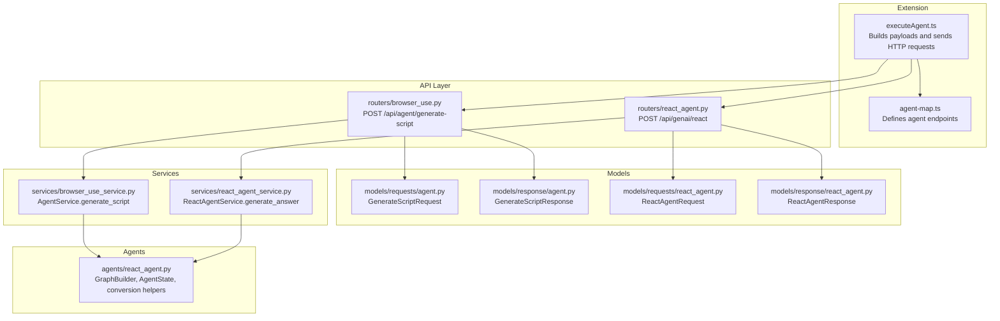
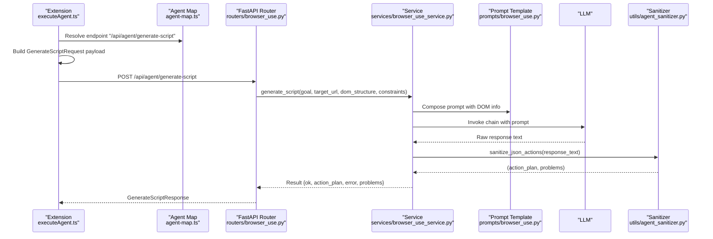
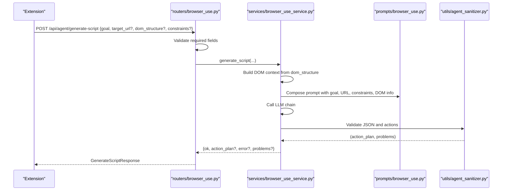
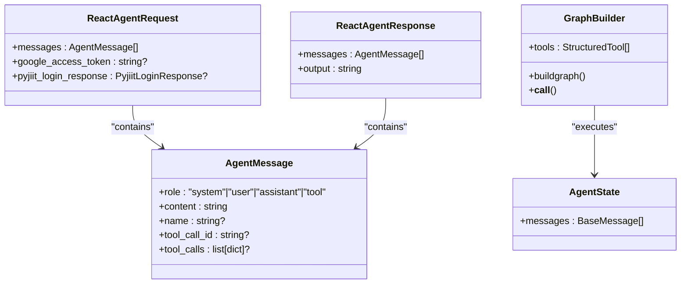
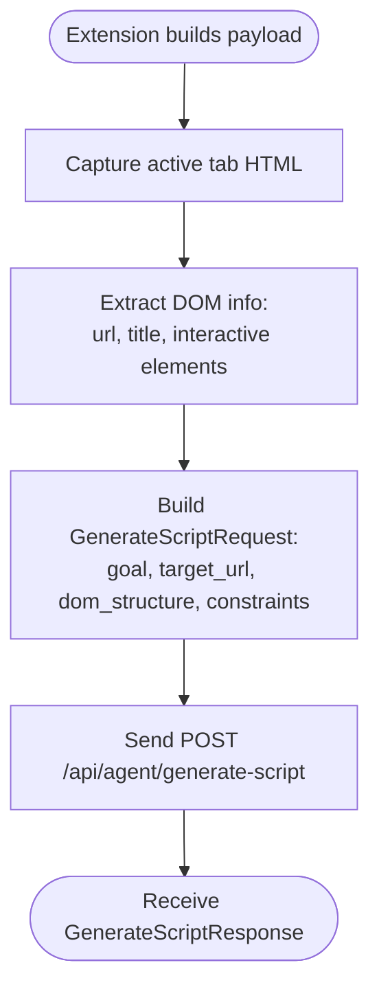
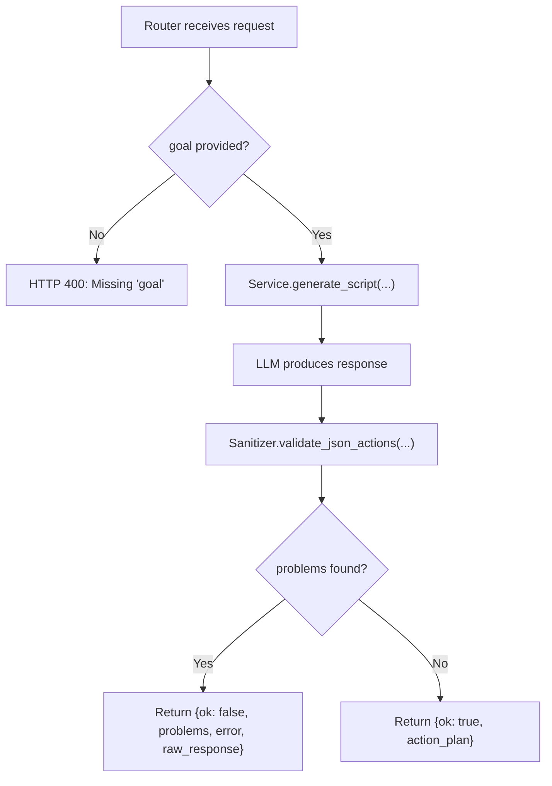
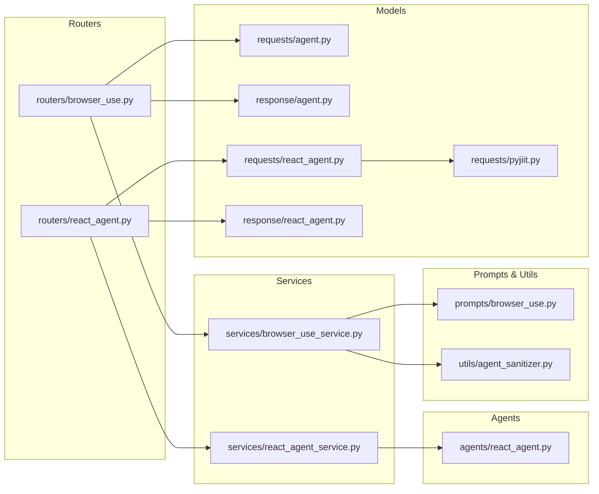

# Agent communication models

## Introduction
This page provides detailed data model documentation for agent communication schemas, focusing on:
- The GenerateScriptRequest model used for browser automation requests, including goal specification, target URL handling, DOM structure representation, and constraint definitions
- The corresponding response model and validation rules
- The agent message payload structure, conversation context management, and state preservation mechanisms
- Field definitions, optional parameter handling, and data type specifications
- Examples of request/response cycles, error handling patterns, and validation scenarios
- The relationship between agent models and the reactive agent system architecture

## Project structure
The agent communication models span three primary layers:
- Request/response models: Strongly typed Pydantic models defining the shape of incoming/outgoing data
- Routers: FastAPI endpoints that validate inputs and orchestrate service calls
- Services: Business logic that interacts with LLMs, sanitizers, and external systems

```mermaid
graph TB
subgraph "Extension"
EX["executeAgent.ts<br/>Builds payloads and sends HTTP requests"]
MAP["agent-map.ts<br/>Defines agent endpoints"]
end
subgraph "API Layer"
RT["routers/browser_use.py<br/>POST /api/agent/generate-script"]
RR["routers/react_agent.py<br/>POST /api/genai/react"]
end
subgraph "Models"
REQ1["models/requests/agent.py<br/>GenerateScriptRequest"]
RES1["models/response/agent.py<br/>GenerateScriptResponse"]
REQ2["models/requests/react_agent.py<br/>ReactAgentRequest"]
RES2["models/response/react_agent.py<br/>ReactAgentResponse"]
end
subgraph "Services"
SVC1["services/browser_use_service.py<br/>AgentService.generate_script"]
SVC2["services/react_agent_service.py<br/>ReactAgentService.generate_answer"]
end
subgraph "Agents"
AG["agents/react_agent.py<br/>GraphBuilder, AgentState, conversion helpers"]
end
EX --> MAP
EX --> RT
EX --> RR
RT --> REQ1
RT --> RES1
RR --> REQ2
RR --> RES2
RT --> SVC1
RR --> SVC2
SVC1 --> AG
SVC2 --> AG
```

## Core components
This section documents the two primary agent communication schemas and their relationships.

### GenerateScriptRequest model
Purpose: Defines the input schema for generating a browser automation action plan from a natural language goal.

Fields:
- goal: Required string describing the automation task
- target_url: Optional string; defaults to empty string if omitted
- dom_structure: Optional dictionary; defaults to empty dictionary if omitted
- constraints: Optional dictionary; defaults to empty dictionary if omitted

Validation and behavior:
- Goal is mandatory; router rejects requests without it
- DOM structure and constraints are optional and used to enrich the LLM prompt
- Router forwards validated fields to the service

Data type specifications:
- goal: string
- target_url: string | null
- dom_structure: dict[str, Any] | null
- constraints: dict[str, Any] | null

Optional parameter handling:
- Empty string fallback for target_url
- Empty dict fallback for dom_structure and constraints

### GenerateScriptResponse model
Purpose: Defines the standardized response for automation plan generation.

Fields:
- ok: Boolean flag indicating success or failure
- action_plan: Optional dictionary containing the generated JSON action plan
- error: Optional string describing the error on failure
- problems: Optional list of validation problem strings
- raw_response: Optional string containing the raw LLM output for inspection

Validation and behavior:
- On success: ok is true and action_plan is populated
- On validation failure: ok is false, problems is set, error describes the issue
- On general failure: ok is false, error contains the error message

### ReactAgentRequest and ReactAgentResponse models
Purpose: Define the input and output schemas for the reactive agent system that handles general conversational tasks with optional tool use.

ReactAgentRequest fields:
- messages: Required list of AgentMessage entries; minimum length 1
- google_access_token: Optional string; supports multiple aliases for tolerance
- pyjiit_login_response: Optional nested PyjiitLoginResponse object

AgentMessage fields:
- role: Literal role among "system", "user", "assistant", "tool"
- content: Required string with minimum length 1
- name: Optional string
- tool_call_id: Optional string; alias supported
- tool_calls: Optional list of tool call dictionaries

ReactAgentResponse fields:
- messages: Final conversation state including the agent reply
- output: Content of the latest assistant message

Validation and behavior:
- Messages list must not be empty
- Role must be one of the allowed literals
- Tool calls are preserved when present
- Response mirrors the final state of the conversation

## Architecture overview
The agent communication architecture integrates extension-driven payload construction, API validation, service orchestration, and agent/graph execution.

```mermaid
sequenceDiagram
participant Ext as "Extension<br/>executeAgent.ts"
participant Map as "Agent Map<br/>agent-map.ts"
participant API as "FastAPI Router<br/>routers/browser_use.py"
participant Svc as "Service<br/>services/browser_use_service.py"
participant Prompt as "Prompt Template<br/>prompts/browser_use.py"
participant LLM as "LLM"
participant San as "Sanitizer<br/>utils/agent_sanitizer.py"
Ext->>Map : Resolve endpoint "/api/agent/generate-script"
Ext->>Ext : Build GenerateScriptRequest payload
Ext->>API : POST /api/agent/generate-script
API->>Svc : generate_script(goal, target_url, dom_structure, constraints)
Svc->>Prompt : Compose prompt with DOM info
Svc->>LLM : Invoke chain with prompt
LLM-->>Svc : Raw response text
Svc->>San : sanitize_json_actions(response_text)
San-->>Svc : (action_plan, problems)
Svc-->>API : Result {ok, action_plan, error, problems}
API-->>Ext : GenerateScriptResponse
```

## Detailed component analysis

### GenerateScriptRequest/Response workflow
This workflow demonstrates the end-to-end cycle for generating a browser automation action plan.

```mermaid
sequenceDiagram
participant Ext as "Extension"
participant Router as "routers/browser_use.py"
participant Service as "services/browser_use_service.py"
participant Prompt as "prompts/browser_use.py"
participant San as "utils/agent_sanitizer.py"
Ext->>Router : POST /api/agent/generate-script {goal, target_url?, dom_structure?, constraints?}
Router->>Router : Validate required fields
Router->>Service : generate_script(...)
Service->>Service : Build DOM context from dom_structure
Service->>Prompt : Compose prompt with goal, URL, constraints, DOM info
Service->>Service : Call LLM chain
Service->>San : Validate JSON and actions
San-->>Service : (action_plan, problems)
Service-->>Router : {ok, action_plan?, error?, problems?}
Router-->>Ext : GenerateScriptResponse
```

### React agent message payload and conversation state
The reactive agent system manages conversation context and preserves state across turns.

```mermaid
classDiagram
class AgentMessage {
+role : "system"|"user"|"assistant"|"tool"
+content : string
+name : string?
+tool_call_id : string?
+tool_calls : list[dict]?
}
class ReactAgentRequest {
+messages : AgentMessage[]
+google_access_token : string?
+pyjiit_login_response : PyjiitLoginResponse?
}
class ReactAgentResponse {
+messages : AgentMessage[]
+output : string
}
class AgentState {
+messages : BaseMessage[]
}
class GraphBuilder {
+tools : StructuredTool[]
+buildgraph()
+__call__()
}
ReactAgentRequest --> AgentMessage : "contains"
ReactAgentResponse --> AgentMessage : "contains"
GraphBuilder --> AgentState : "executes"
```

### DOM structure representation and target URL handling
The extension captures DOM information and constructs the GenerateScriptRequest payload.

```mermaid
flowchart TD
Start(["Extension builds payload"]) --> Capture["Capture active tab HTML"]
Capture --> Extract["Extract DOM info:<br/>url, title, interactive elements"]
Extract --> BuildReq["Build GenerateScriptRequest:<br/>goal, target_url, dom_structure, constraints"]
BuildReq --> Send["Send POST /api/agent/generate-script"]
Send --> End(["Receive GenerateScriptResponse"])
```

### Validation rules and error handling patterns
Validation spans multiple layers:
- Router-level validation ensures required fields are present
- Service-level prompt composition and LLM invocation
- Sanitizer validates JSON structure and action semantics
- Error responses maintain a consistent shape

```mermaid
flowchart TD
A["Router receives request"] --> B{"goal provided?"}
B -- No --> E["HTTP 400: Missing 'goal'"]
B -- Yes --> C["Service.generate_script(...)"]
C --> D["LLM produces response"]
D --> F["Sanitizer.validate_json_actions(...)"]
F --> G{"problems found?"}
G -- Yes --> H["Return {ok: false, problems, error, raw_response}"]
G -- No --> I["Return {ok: true, action_plan}"]
```

## Dependency analysis
The following diagram shows key dependencies between models, routers, services, and utilities.

```mermaid
graph LR
subgraph "Models"
M1["requests/agent.py"]
M2["response/agent.py"]
M3["requests/react_agent.py"]
M4["response/react_agent.py"]
M5["requests/pyjiit.py"]
end
subgraph "Routers"
R1["routers/browser_use.py"]
R2["routers/react_agent.py"]
end
subgraph "Services"
S1["services/browser_use_service.py"]
S2["services/react_agent_service.py"]
end
subgraph "Agents"
A1["agents/react_agent.py"]
end
subgraph "Prompts & Utils"
P1["prompts/browser_use.py"]
U1["utils/agent_sanitizer.py"]
end
R1 --> M1
R1 --> M2
R1 --> S1
S1 --> P1
S1 --> U1
R2 --> M3
R2 --> M4
R2 --> S2
S2 --> A1
M3 --> M5
```

## Performance considerations
- DOM structure truncation: Interactive elements are limited to avoid excessive payload sizes
- Prompt token limits: DOM summaries cap the number of interactive elements included
- Caching: The reactive agent graph is cached to reduce compilation overhead
- Optional fields: Using optional fields reduces unnecessary data transfer and processing

## Troubleshooting guide
Common issues and resolutions:
- Missing goal: Router returns HTTP 400 with a descriptive message
- Validation failures: Service returns ok=false with problems list and raw_response for debugging
- General errors: Service returns ok=false with error message
- React agent errors: Service logs and returns a generic apology message

## Conclusion
The agent communication models provide a reliable, typed interface for both browser automation and conversational AI tasks. The GenerateScriptRequest model enables precise automation planning by incorporating DOM context and constraints, while the ReactAgentRequest/Response models support rich conversational exchanges with optional tool use. Validation and error handling are consistently applied across layers to ensure predictable behavior and clear feedback.
