# Data models and schemas

## Introduction
This page describes the data model layer of the Agentic Browser system. It focuses on Pydantic-based request and response schemas used across the backend APIs, including agent messaging payloads, browser action requests, service integration models, and YouTube-related data structures. For each model, we document fields, types, validation rules, aliases, defaults, and relationships. We also explain serialization/deserialization behavior, validation patterns, error handling approaches, and security considerations.

## Project structure
The data models are organized under a dedicated models package with two subpackages:
- models/requests: request schemas for various services and endpoints
- models/response: response schemas for the same services and endpoints
- models/yt.py: shared YouTube metadata model

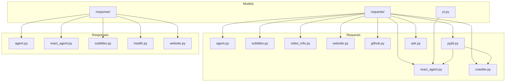
```mermaid
graph TB
subgraph "Models"
RQ["requests/"]
RS["response/"]
YT["yt.py"]
end
subgraph "Requests"
AG["agent.py"]
RA["react_agent.py"]
ST["subtitles.py"]
VI["video_info.py"]
WS["website.py"]
CR["crawller.py"]
GH["github.py"]
PJ["pyjiit.py"]
ASK["ask.py"]
end
subgraph "Responses"
GAR["agent.py"]
RAR["react_agent.py"]
STR["subtitles.py"]
HR["health.py"]
WSR["website.py"]
end
RQ --> AG
RQ --> RA
RQ --> ST
RQ --> VI
RQ --> WS
RQ --> CR
RQ --> GH
RQ --> PJ
RQ --> ASK
RS --> GAR
RS --> RAR
RS --> STR
RS --> HR
RS --> WSR
YT --> RA
PJ --> RA
PJ --> CR
```

## Core components
This section summarizes the primary data models and their roles.

- YouTube metadata model
  - Purpose: Encapsulates YouTube video metadata and optional captions/transcript.
  - Fields: title, description, duration, uploader, upload_date, view_count, like_count, tags, categories, captions, transcript.
  - Types: str, int, List[str], Optional[str].
  - Defaults: sensible defaults for strings and integers; empty lists for collections; None for optional text fields.

- Agent messaging model
  - Purpose: Represents a single message in an agent conversation with support for tool calls.
  - Fields: role (enum-like literal), content (validated non-empty), name, tool_call_id, tool_calls.
  - Validation: minimum length for content; alias handling for toolCalls/toolCallId; whitespace stripping configured.

- React agent request
  - Purpose: Top-level request carrying conversation history and optional authentication context.
  - Fields: messages (non-empty list), google_access_token (alias handling), pyjiit_login_response (optional nested model).
  - Aliases: flexible validation and serialization aliases for token and login response fields.

- Crawler request
  - Purpose: Request for content crawling with optional chat history, OAuth token, PyJIIT login context, client HTML snapshot, and attached file path.
  - Validation: chat_history defaults to empty list; aliases for token; populated by name behavior.

- Website request
  - Purpose: Query for website QA with optional client HTML and attached file.
  - Fields: url, question, chat_history (default empty), client_html (optional), attached_file_path (optional).

- Subtitles request
  - Purpose: Fetch subtitles for a given URL with optional language.
  - Fields: url, lang (defaults to English).

- Video info request
  - Purpose: Retrieve basic video metadata by URL.
  - Fields: url.

- GitHub request
  - Purpose: Query GitHub resources with validated URL type.
  - Fields: url (HttpUrl), question, chat_history (default empty), attached_file_path (optional).

- Ask request
  - Purpose: General-purpose question-answering request with optional attachments.
  - Fields: url, question, chat_history (default empty), attached_file_path (optional).

- PyJIIT nested models
  - Purpose: Represent authentication and session metadata from the PyJIIT portal.
  - Includes: PyjiitInstituteEntry, PyjiitRegData, PyjiitRawResponse, PyjiitLoginResponse.
  - Notable validations: typed fields with descriptions; optional fields for DOB, member type, enrollment, tokens, timestamps; institute list as a collection.

- Response models
  - GenerateScriptResponse: ok flag, optional structured action plan, error message, problem list, raw response.
  - ReactAgentResponse: final messages list and output content string.
  - SubtitlesResponse: subtitles text.
  - HealthResponse: status and message.
  - WebsiteResponse: answer text.

## Architecture overview
The data model layer is consumed by routers and services to validate incoming requests and produce standardized responses. Authentication contexts (Google OAuth and PyJIIT login) are embedded as optional fields in several requests to enable downstream service integrations.

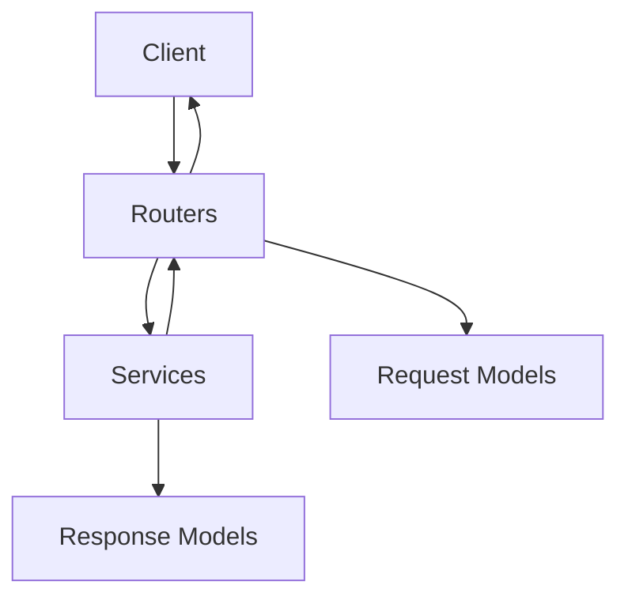
```mermaid
graph TB
Client["Client"]
Router["Routers"]
Service["Services"]
ModelReq["Request Models"]
ModelRes["Response Models"]
Client --> Router
Router --> ModelReq
Router --> Service
Service --> ModelRes
Service --> Router
Router --> Client
```

[No sources needed since this diagram shows conceptual workflow, not actual code structure]

## Detailed component analysis

### YouTube metadata model (YTVideoInfo)
- Purpose: Standardized representation of YouTube video metadata and optional captions/transcript.
- Fields and types:
  - title: str (default "Unknown")
  - description: str (default "")
  - duration: int (default 0)
  - uploader: str (default "Unknown")
  - upload_date: str (default "")
  - view_count: int (default 0)
  - like_count: int (default 0)
  - tags: List[str] (default [])
  - categories: List[str] (default [])
  - captions: Optional[str] (default None)
  - transcript: Optional[str] (default None)
- Validation and behavior:
  - No explicit validators; relies on Pydantic type coercion and defaults.
- Usage:
  - Imported via models/__init__.py and used by YouTube-related services and routers.

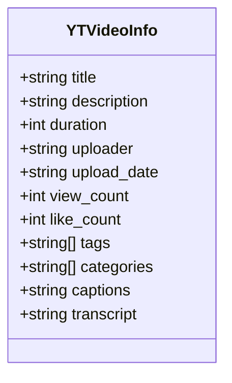
```mermaid
classDiagram
class YTVideoInfo {
+string title
+string description
+int duration
+string uploader
+string upload_date
+int view_count
+int like_count
+string[] tags
+string[] categories
+string captions
+string transcript
}
```

### Agent messaging payload (AgentMessage)
- Purpose: Represents a single message in an agent conversation, including optional tool call metadata.
- Fields and types:
  - role: Literal["system","user","assistant","tool"]
  - content: str (required, minimum length enforced)
  - name: Optional[str]
  - tool_call_id: Optional[str] (alias "toolCallId")
  - tool_calls: Optional[List[Dict[str, Any]]] (alias "toolCalls"; description indicates optional tool call payloads)
- Validation and behavior:
  - populate_by_name enabled for consistent alias handling.
  - Strips whitespace from string fields globally.
- Usage:
  - Used within ReactAgentRequest and ReactAgentResponse.

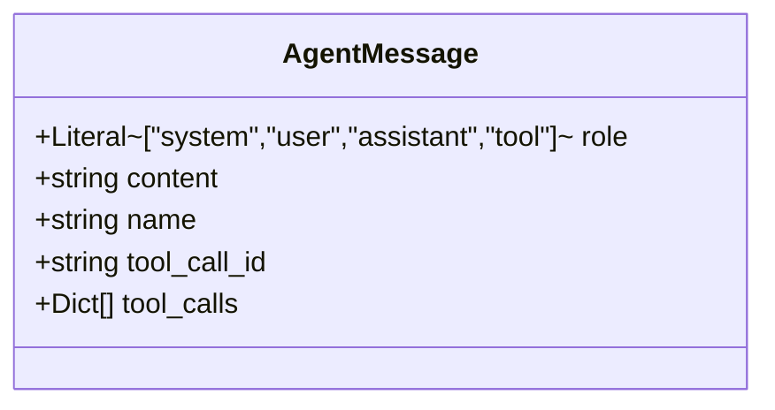
```mermaid
classDiagram
class AgentMessage {
+Literal~["system","user","assistant","tool"]~ role
+string content
+string name
+string tool_call_id
+Dict[] tool_calls
}
```

### React agent request (ReactAgentRequest)
- Purpose: Top-level request for the React agent containing conversation history and optional authentication context.
- Fields and types:
  - messages: List[AgentMessage] (required, minimum length 1)
  - google_access_token: Optional[str] (alias "google_access_token" and a misspelled variant; serialized as "google_access_token")
  - pyjiit_login_response: Optional[PyjiitLoginResponse]
- Validation and behavior:
  - populate_by_name enabled.
  - Flexible aliasing supports tolerant parsing and consistent serialization.

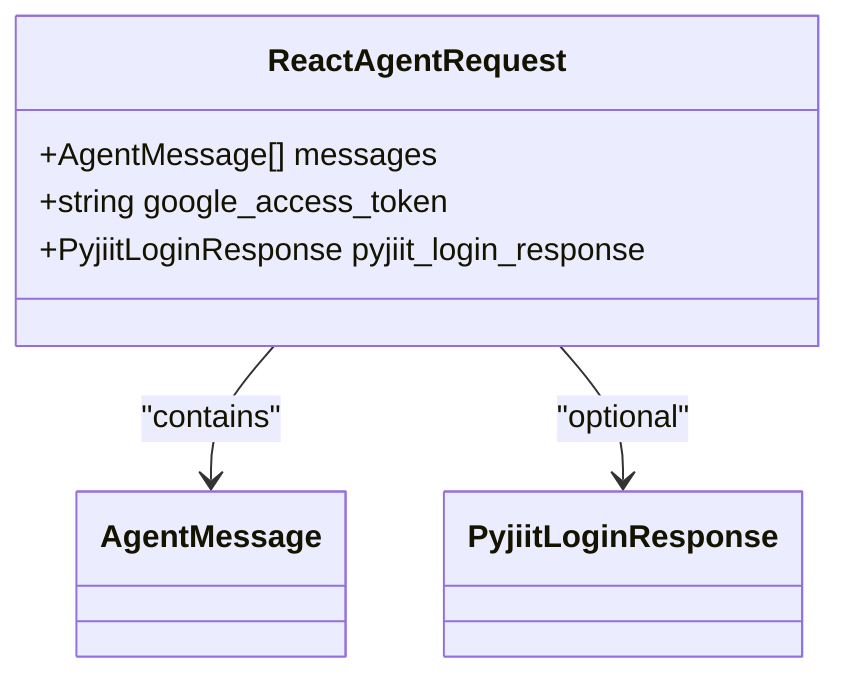
```mermaid
classDiagram
class ReactAgentRequest {
+AgentMessage[] messages
+string google_access_token
+PyjiitLoginResponse pyjiit_login_response
}
class AgentMessage
class PyjiitLoginResponse
ReactAgentRequest --> AgentMessage : "contains"
ReactAgentRequest --> PyjiitLoginResponse : "optional"
```

### Crawler request (CrawlerRequest)
- Purpose: Request for content crawling with optional context and authentication.
- Fields and types:
  - question: str
  - chat_history: Optional[list[dict[str, Any]]] (default empty list)
  - google_access_token: Optional[str] (alias "google_access_token" and a misspelled variant; serialized consistently)
  - pyjiit_login_response: Optional[PyjiitLoginResponse]
  - client_html: Optional[str]
  - attached_file_path: Optional[str]
- Validation and behavior:
  - populate_by_name enabled.
  - Defaults ensure reliable handling when optional fields are absent.

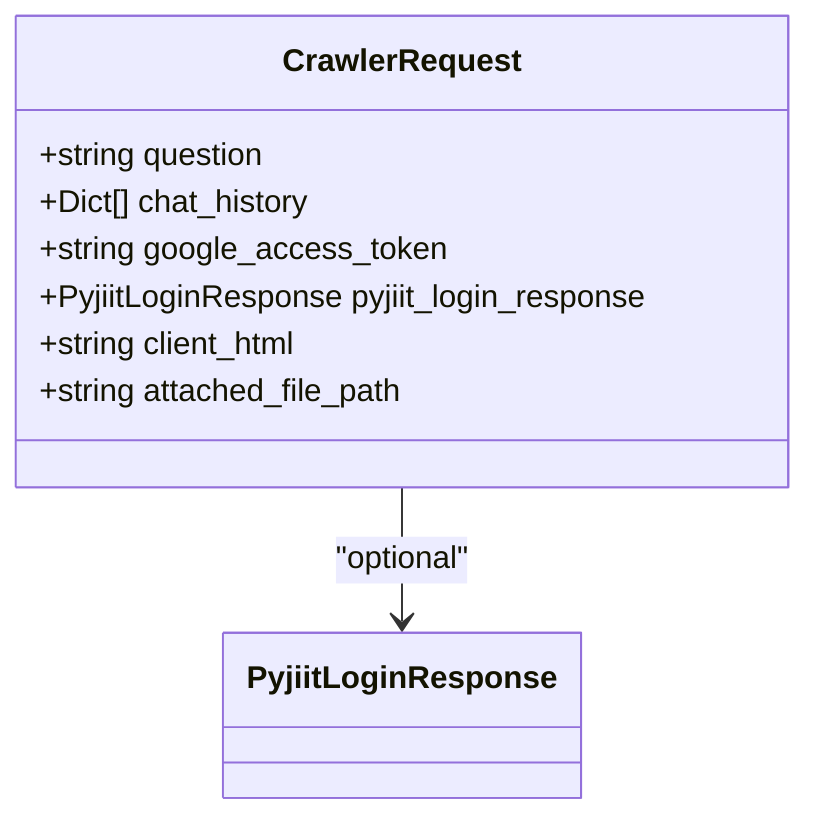
```mermaid
classDiagram
class CrawlerRequest {
+string question
+Dict[] chat_history
+string google_access_token
+PyjiitLoginResponse pyjiit_login_response
+string client_html
+string attached_file_path
}
class PyjiitLoginResponse
CrawlerRequest --> PyjiitLoginResponse : "optional"
```

### Website request (WebsiteRequest)
- Purpose: Query for website QA with optional client HTML and attached file.
- Fields and types:
  - url: str
  - question: str
  - chat_history: Optional[list[dict]] (default empty)
  - client_html: Optional[str]
  - attached_file_path: Optional[str]
- Validation and behavior:
  - Minimal validation; defaults ensure safe handling.

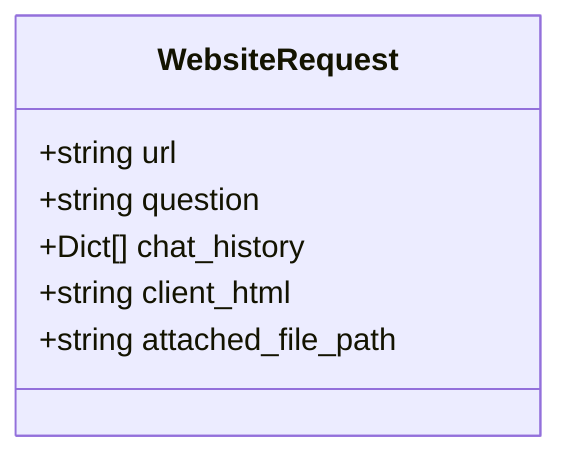
```mermaid
classDiagram
class WebsiteRequest {
+string url
+string question
+Dict[] chat_history
+string client_html
+string attached_file_path
}
```

### Subtitles request (SubtitlesRequest)
- Purpose: Fetch subtitles for a given URL with optional language.
- Fields and types:
  - url: str
  - lang: Optional[str] (default "en")
- Validation and behavior:
  - No explicit validators; relies on type coercion.

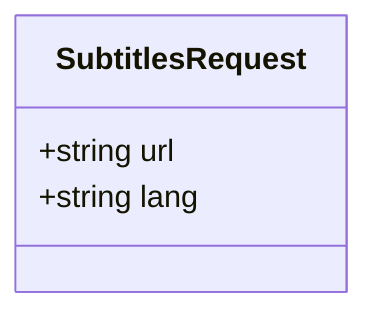
```mermaid
classDiagram
class SubtitlesRequest {
+string url
+string lang
}
```

### Video info request (VideoInfoRequest)
- Purpose: Retrieve basic video metadata by URL.
- Fields and types:
  - url: str
- Validation and behavior:
  - No explicit validators; relies on type coercion.

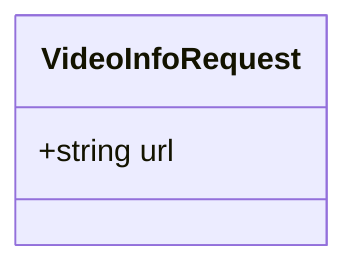
```mermaid
classDiagram
class VideoInfoRequest {
+string url
}
```

### GitHub request (GitHubRequest)
- Purpose: Query GitHub resources with validated URL type.
- Fields and types:
  - url: HttpUrl
  - question: str
  - chat_history: list[dict] (default empty)
  - attached_file_path: str | None
- Validation and behavior:
  - HttpUrl ensures strict URL validation.

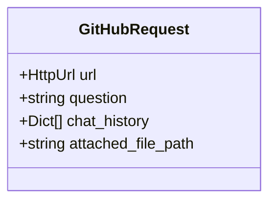
```mermaid
classDiagram
class GitHubRequest {
+HttpUrl url
+string question
+Dict[] chat_history
+string attached_file_path
}
```

### Ask request (AskRequest)
- Purpose: General-purpose question-answering request with optional attachments.
- Fields and types:
  - url: str
  - question: str
  - chat_history: Optional[List[Dict]] (default empty)
  - attached_file_path: Optional[str]
- Validation and behavior:
  - Minimal validation; defaults ensure safe handling.

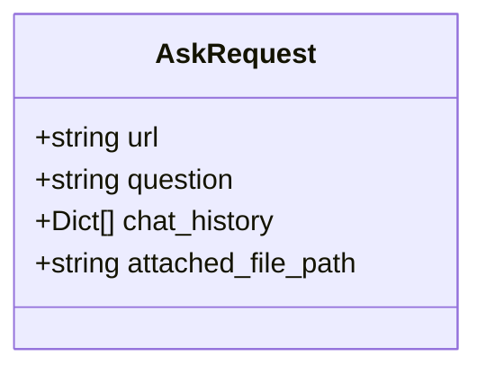
```mermaid
classDiagram
class AskRequest {
+string url
+string question
+Dict[] chat_history
+string attached_file_path
}
```

### PyJIIT nested models (PyjiitInstituteEntry, PyjiitRegData, PyjiitRawResponse, PyjiitLoginResponse)
- Purpose: Represent authentication and session metadata from the PyJIIT portal.
- Fields and types:
  - PyjiitInstituteEntry: label (str), value (str)
  - PyjiitRegData: bypass (str), clientid (str), userDOB (Optional[str]), name (Optional[str]), lastvisitdate (Optional[str]), membertype (Optional[str]), enrollmentno (Optional[str]), userid (Optional[str]), expiredpassword (Optional[str]), institutelist (List[PyjiitInstituteEntry]), memberid (Optional[str]), token (Optional[str])
  - PyjiitRawResponse: regdata (PyjiitRegData), clientidforlink (Optional[str])
  - PyjiitLoginResponse: raw_response (PyjiitRawResponse), regdata (PyjiitRegData), institute (Optional[str]), instituteid (Optional[str]), memberid (Optional[str]), userid (Optional[str]), token (Optional[str]), expiry (Optional[datetime]), clientid (Optional[str]), membertype (Optional[str]), name (Optional[str])
- Validation and behavior:
  - populate_by_name enabled for PyjiitLoginResponse.
  - Descriptions annotate intent and semantics of fields.

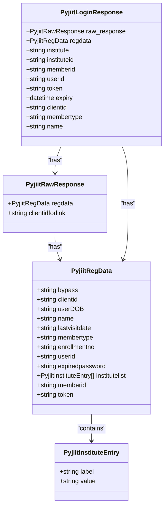
```mermaid
classDiagram
class PyjiitInstituteEntry {
+string label
+string value
}
class PyjiitRegData {
+string bypass
+string clientid
+string userDOB
+string name
+string lastvisitdate
+string membertype
+string enrollmentno
+string userid
+string expiredpassword
+PyjiitInstituteEntry[] institutelist
+string memberid
+string token
}
class PyjiitRawResponse {
+PyjiitRegData regdata
+string clientidforlink
}
class PyjiitLoginResponse {
+PyjiitRawResponse raw_response
+PyjiitRegData regdata
+string institute
+string instituteid
+string memberid
+string userid
+string token
+datetime expiry
+string clientid
+string membertype
+string name
}
PyjiitRegData --> PyjiitInstituteEntry : "contains"
PyjiitRawResponse --> PyjiitRegData : "has"
PyjiitLoginResponse --> PyjiitRawResponse : "has"
PyjiitLoginResponse --> PyjiitRegData : "has"
```

### Response models
- GenerateScriptResponse: ok (bool), action_plan (Optional[Dict[str, Any]]), error (Optional[str]), problems (Optional[List[str]]), raw_response (Optional[str])
- ReactAgentResponse: messages (List[AgentMessage]), output (str)
- SubtitlesResponse: subtitles (str)
- HealthResponse: status (str), message (str)
- WebsiteResponse: answer (str)

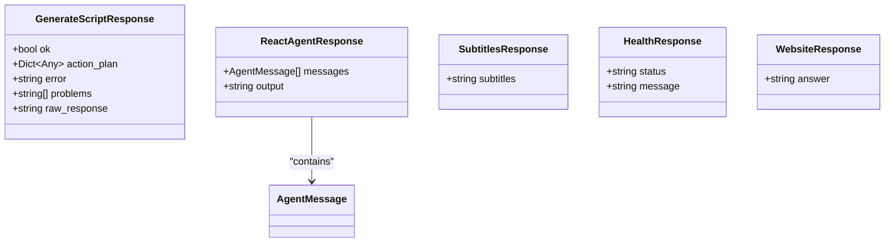
```mermaid
classDiagram
class GenerateScriptResponse {
+bool ok
+Dict~Any~ action_plan
+string error
+string[] problems
+string raw_response
}
class ReactAgentResponse {
+AgentMessage[] messages
+string output
}
class SubtitlesResponse {
+string subtitles
}
class HealthResponse {
+string status
+string message
}
class WebsiteResponse {
+string answer
}
class AgentMessage
ReactAgentResponse --> AgentMessage : "contains"
```

## Dependency analysis
- ReactAgentRequest depends on AgentMessage and PyjiitLoginResponse.
- CrawlerRequest optionally depends on PyjiitLoginResponse.
- PyjiitLoginResponse composes PyjiitRawResponse and PyjiitRegData.
- Response models are standalone and used to serialize service outputs.

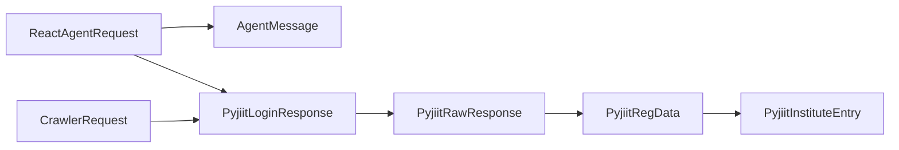
```mermaid
graph LR
RA["ReactAgentRequest"] --> AM["AgentMessage"]
RA --> PLR["PyjiitLoginResponse"]
CR["CrawlerRequest"] --> PLR
PLR --> PRR["PyjiitRawResponse"]
PRR --> PRD["PyjiitRegData"]
PRD --> PIE["PyjiitInstituteEntry"]
```

## Performance considerations
- Prefer minimal validation overhead: most models rely on type coercion and defaults; avoid expensive validators.
- Use Optional fields judiciously to reduce unnecessary allocations when data is absent.
- For large payloads (e.g., tool_calls), keep payloads compact and avoid redundant copies.
- Use alias normalization to reduce parsing ambiguity and improve throughput.

[No sources needed since this section provides general guidance]

## Troubleshooting guide
- Validation errors:
  - Non-empty content in AgentMessage triggers validation failures if missing or blank after trimming.
  - Missing required fields in requests cause validation errors; ensure presence of required fields or provide defaults.
- Alias mismatches:
  - Google access token and PyJIIT login response accept alternative spellings during validation but serialize consistently under specified aliases.
- Type coercion:
  - HttpUrl in GitHubRequest enforces strict URL validation; invalid URLs will fail early.
- Serialization differences:
  - ToolCalls/toolCallId and similar fields use aliases; ensure clients send the appropriate keys to pass validation.

## Conclusion
The Agentic Browser data model layer uses Pydantic to define clear, validated request and response schemas. Authentication contexts are integrated via optional nested models, while YouTube metadata is encapsulated in a reusable model. Aliases and defaults improve resilience against client-side inconsistencies. Responses standardize outcomes across services, enabling predictable integration.

[No sources needed since this section summarizes without analyzing specific files]

## Appendices

### Data lifecycle and transformation
- Deserialization: Requests are parsed from JSON into Pydantic models; aliases resolve to canonical field names; defaults fill missing optional fields.
- Validation: Pydantic enforces types, lengths, and optional constraints; custom descriptions clarify intent.
- Processing: Services operate on validated models; nested models propagate context (e.g., PyJIIT login).
- Serialization: Responses are serialized back to JSON; aliases ensure consistent field names for clients.

[No sources needed since this section provides general guidance]

### Security and privacy considerations
- Token handling:
  - Google access tokens and PyJIIT tokens are optional fields; ensure they are transmitted securely and handled with least privilege.
- Sensitive data:
  - Avoid logging raw tokens or personal data; sanitize logs and audit access.
- URL validation:
  - Use HttpUrl for external resource access to prevent malformed inputs.

[No sources needed since this section provides general guidance]

### Schema evolution and backwards compatibility
- Add new optional fields with defaults to preserve backward compatibility.
- Introduce aliases for renamed fields to accept legacy clients while serializing under new names.
- Avoid removing required fields; deprecate with migration paths.
- Keep nested models cohesive and version-aware to minimize breaking changes.

[No sources needed since this section provides general guidance]
