# Service Integration Models

<cite>
**Referenced Files in This Document**
- [models/requests/__init__.py](file://models/requests/__init__.py)
- [models/response/__init__.py](file://models/response/__init__.py)
- [models/requests/ask.py](file://models/requests/ask.py)
- [models/response/ask.py](file://models/response/ask.py)
- [models/requests/crawller.py](file://models/requests/crawller.py)
- [models/response/crawller.py](file://models/response/crawller.py)
- [models/requests/github.py](file://models/requests/github.py)
- [models/response/gihub.py](file://models/response/gihub.py)
- [models/requests/react_agent.py](file://models/requests/react_agent.py)
- [models/response/react_agent.py](file://models/response/react_agent.py)
- [models/requests/pyjiit.py](file://models/requests/pyjiit.py)
- [models/requests/website.py](file://models/requests/website.py)
- [models/response/website.py](file://models/response/website.py)
- [models/requests/subtitles.py](file://models/requests/subtitles.py)
- [models/response/subtitles.py](file://models/response/subtitles.py)
- [models/yt.py](file://models/yt.py)
- [services/github_service.py](file://services/github_service.py)
</cite>

## Table of Contents
1. [Introduction](#introduction)
2. [Project Structure](#project-structure)
3. [Core Components](#core-components)
4. [Architecture Overview](#architecture-overview)
5. [Detailed Component Analysis](#detailed-component-analysis)
6. [Dependency Analysis](#dependency-analysis)
7. [Performance Considerations](#performance-considerations)
8. [Troubleshooting Guide](#troubleshooting-guide)
9. [Conclusion](#conclusion)

## Introduction
This document describes the service integration schemas used across external services in the project. It focuses on request/response models for general service queries, crawler-specific structures, and GitHub integration models. It explains field definitions, validation rules, and transformation patterns, highlights shared patterns and service-specific variations, and outlines how these models relate to service implementations. Authentication data handling, rate-limiting considerations, and validation requirements are also addressed.

## Project Structure
The service integration models are organized under a dedicated models namespace with separate packages for requests and responses. Supporting models include PyJIIT authentication payloads and YouTube video info structures. Services consume these models to orchestrate external integrations.

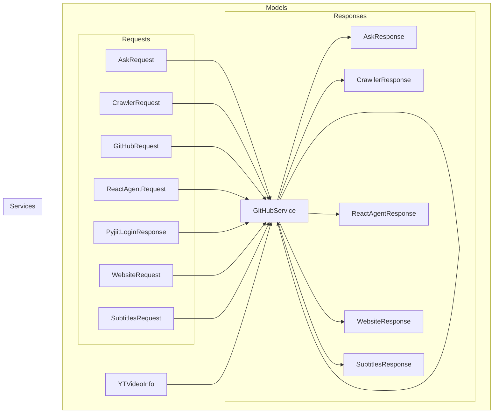

**Diagram sources**
- [models/requests/ask.py](file://models/requests/ask.py#L1-L10)
- [models/response/ask.py](file://models/response/ask.py#L1-L8)
- [models/requests/crawller.py](file://models/requests/crawller.py#L1-L35)
- [models/response/crawller.py](file://models/response/crawller.py#L1-L6)
- [models/requests/github.py](file://models/requests/github.py#L1-L9)
- [models/response/gihub.py](file://models/response/gihub.py#L1-L6)
- [models/requests/react_agent.py](file://models/requests/react_agent.py#L1-L45)
- [models/response/react_agent.py](file://models/response/react_agent.py#L1-L15)
- [models/requests/pyjiit.py](file://models/requests/pyjiit.py#L1-L91)
- [models/requests/website.py](file://models/requests/website.py#L1-L11)
- [models/response/website.py](file://models/response/website.py#L1-L6)
- [models/requests/subtitles.py](file://models/requests/subtitles.py#L1-L8)
- [models/response/subtitles.py](file://models/response/subtitles.py#L1-L6)
- [models/yt.py](file://models/yt.py#L1-L17)
- [services/github_service.py](file://services/github_service.py#L1-L109)

**Section sources**
- [models/requests/__init__.py](file://models/requests/__init__.py#L1-L21)
- [models/response/__init__.py](file://models/response/__init__.py#L1-L20)

## Core Components
This section summarizes the primary request/response models used across services, highlighting shared fields and service-specific extensions.

- AskRequest/AskResponse
  - Purpose: General-purpose query with optional chat history and optional file attachment.
  - Fields:
    - AskRequest: url, question, chat_history (default empty list), attached_file_path (optional).
    - AskResponse: answer, video_title, video_channel.
  - Validation: Basic presence and type checks via Pydantic; url is validated as a URL in GitHubRequest variant.
  - Transformation: Used by services to construct prompts and parse LLM outputs.

- CrawlerRequest/CrawllerResponse
  - Purpose: Crawler-focused query with optional OAuth token, persisted PyJIIT login, client HTML, and optional file attachment.
  - Fields:
    - CrawlerRequest: question, chat_history (default empty list), google_access_token (alias support), pyjiit_login_response (alias support), client_html (optional), attached_file_path (optional).
    - CrawllerResponse: answer.
  - Validation: Aliased fields support tolerant parsing; Pydantic enforces presence/typing.
  - Transformation: Enables authenticated crawling and context injection.

- GitHubRequest/GitHubResponse
  - Purpose: GitHub repository Q&A with URL validation and optional attachments.
  - Fields:
    - GitHubRequest: url (HttpUrl), question, chat_history (default empty list), attached_file_path (optional).
    - GitHubResponse: content.
  - Validation: url enforced as HttpUrl; optional attachments supported.
  - Transformation: Converts repository to markdown, optionally attaches files, and invokes LLM chain.

- ReactAgentRequest/ReactAgentResponse
  - Purpose: Multi-turn conversational agent with structured messages and optional authentication.
  - Fields:
    - AgentMessage: role (enum-like literal), content (min length 1), name (optional), tool_call_id (optional), tool_calls (optional).
    - ReactAgentRequest: messages (non-empty list), google_access_token (alias support), pyjiit_login_response (alias support).
    - ReactAgentResponse: messages (final conversation state), output (latest assistant message).
  - Validation: Role constrained; content min length enforced; aliases supported.
  - Transformation: Aggregates tool calls and assistant replies into a final state.

- WebsiteRequest/WebsiteResponse
  - Purpose: Website-based Q&A with optional client HTML and file attachment.
  - Fields:
    - WebsiteRequest: url, question, chat_history (default empty list), client_html (optional), attached_file_path (optional).
    - WebsiteResponse: answer.
  - Validation: Basic presence/type checks; url treated as string.
  - Transformation: Supplies extracted page context to LLM.

- SubtitlesRequest/SubtitlesResponse
  - Purpose: Subtitle retrieval for a given video URL and language.
  - Fields:
    - SubtitlesRequest: url, lang (default "en").
    - SubtitlesResponse: subtitles.
  - Validation: Basic presence/type checks.
  - Transformation: Returns subtitle text for downstream processing.

- PyjiitLoginResponse
  - Purpose: Authentication payload from PyJIIT portal with derived session metadata.
  - Fields: raw_response, regdata, institute, instituteid, memberid, userid, token, expiry, clientid, membertype, name.
  - Validation: Nested typed fields; populate_by_name enabled.
  - Transformation: Provides JWT token and session identifiers for authenticated requests.

- YTVideoInfo
  - Purpose: Structured metadata for YouTube videos.
  - Fields: title, description, duration, uploader, upload_date, view_count, like_count, tags, categories, captions, transcript.
  - Validation: Defaults ensure safe fallbacks; optional fields accommodate missing data.
  - Transformation: Normalizes scraped or API-derived video metadata.

**Section sources**
- [models/requests/ask.py](file://models/requests/ask.py#L1-L10)
- [models/response/ask.py](file://models/response/ask.py#L1-L8)
- [models/requests/crawller.py](file://models/requests/crawller.py#L1-L35)
- [models/response/crawller.py](file://models/response/crawller.py#L1-L6)
- [models/requests/github.py](file://models/requests/github.py#L1-L9)
- [models/response/gihub.py](file://models/response/gihub.py#L1-L6)
- [models/requests/react_agent.py](file://models/requests/react_agent.py#L1-L45)
- [models/response/react_agent.py](file://models/response/react_agent.py#L1-L15)
- [models/requests/website.py](file://models/requests/website.py#L1-L11)
- [models/response/website.py](file://models/response/website.py#L1-L6)
- [models/requests/subtitles.py](file://models/requests/subtitles.py#L1-L8)
- [models/response/subtitles.py](file://models/response/subtitles.py#L1-L6)
- [models/requests/pyjiit.py](file://models/requests/pyjiit.py#L1-L91)
- [models/yt.py](file://models/yt.py#L1-L17)

## Architecture Overview
The service integration architecture follows a clear separation of concerns:
- Models define strict request/response schemas with validation.
- Services consume models, transform inputs, and produce outputs.
- Authentication payloads (e.g., PyJIIT) are embedded in requests to enable secure access to protected resources.
- Some services conditionally attach files or inject chat history to enrich prompts.

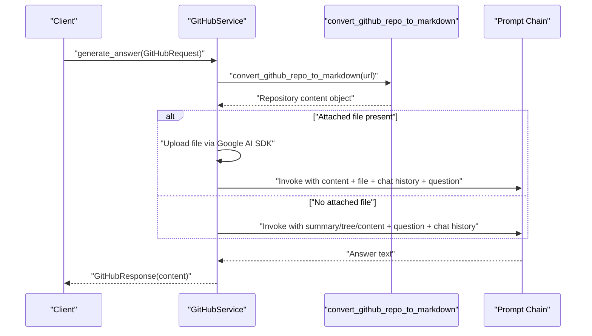

**Diagram sources**
- [models/requests/github.py](file://models/requests/github.py#L1-L9)
- [models/response/gihub.py](file://models/response/gihub.py#L1-L6)
- [services/github_service.py](file://services/github_service.py#L1-L109)

## Detailed Component Analysis

### AskRequest/AskResponse
- Shared pattern: Accepts a URL and question, supports optional chat history and an attached file path.
- Validation: Pydantic enforces field presence/type; url is validated as a URL in GitHubRequest variant.
- Transformation: Services use these fields to build prompts and parse LLM outputs into answer/video metadata.

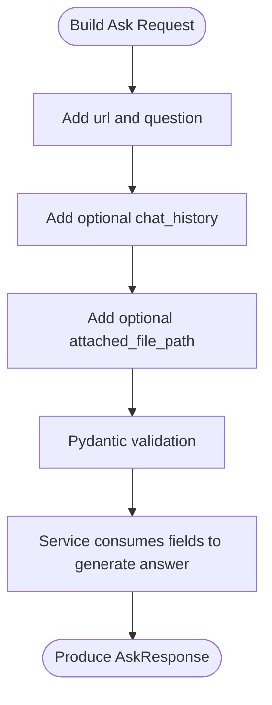

**Diagram sources**
- [models/requests/ask.py](file://models/requests/ask.py#L1-L10)
- [models/response/ask.py](file://models/response/ask.py#L1-L8)

**Section sources**
- [models/requests/ask.py](file://models/requests/ask.py#L1-L10)
- [models/response/ask.py](file://models/response/ask.py#L1-L8)

### CrawlerRequest/CrawllerResponse
- Shared pattern: Supports chat history, optional OAuth token, persisted PyJIIT login, client HTML, and attached file.
- Validation: Aliased fields tolerate minor typos during deserialization; defaults ensure safe handling.
- Transformation: Enables authenticated crawling and contextual enrichment via client HTML and attachments.

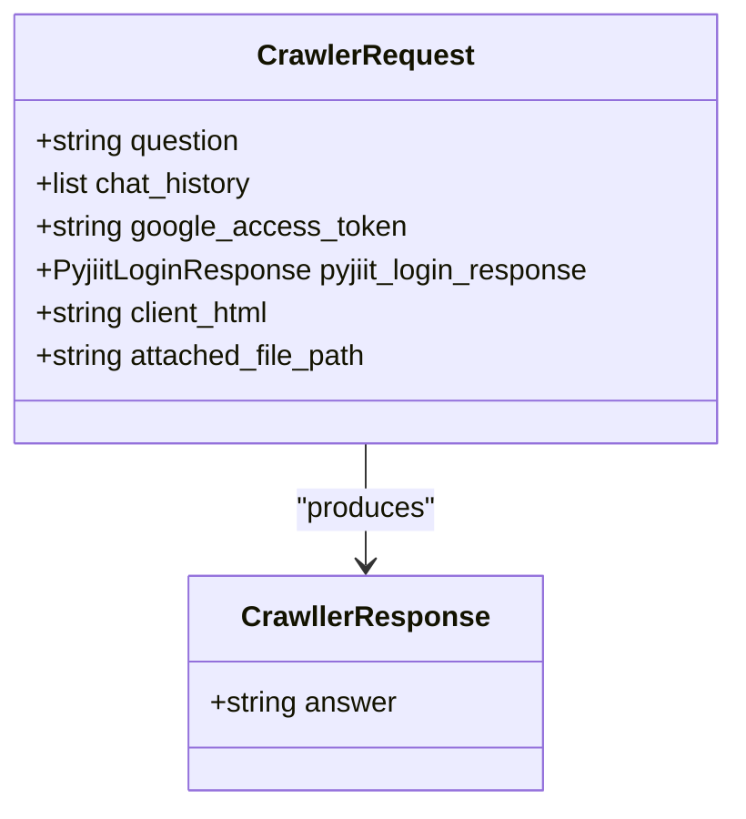

**Diagram sources**
- [models/requests/crawller.py](file://models/requests/crawller.py#L1-L35)
- [models/response/crawller.py](file://models/response/crawller.py#L1-L6)

**Section sources**
- [models/requests/crawller.py](file://models/requests/crawller.py#L1-L35)
- [models/response/crawller.py](file://models/response/crawller.py#L1-L6)

### GitHubRequest/GitHubResponse
- Shared pattern: Validates URL as HttpUrl; supports optional chat history and attached file.
- Validation: Strict URL validation; optional fields allow flexible invocation.
- Transformation: Converts repository to markdown, optionally attaches files, and invokes LLM chain to produce content.

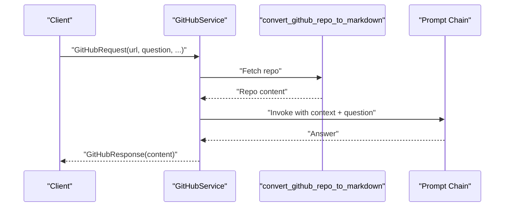

**Diagram sources**
- [models/requests/github.py](file://models/requests/github.py#L1-L9)
- [models/response/gihub.py](file://models/response/gihub.py#L1-L6)
- [services/github_service.py](file://services/github_service.py#L1-L109)

**Section sources**
- [models/requests/github.py](file://models/requests/github.py#L1-L9)
- [models/response/gihub.py](file://models/response/gihub.py#L1-L6)
- [services/github_service.py](file://services/github_service.py#L1-L109)

### ReactAgentRequest/ReactAgentResponse
- Shared pattern: Messages carry roles and optional tool calls; supports authentication via OAuth and PyJIIT login.
- Validation: Role constrained; content minimum length enforced; aliases improve robustness.
- Transformation: Aggregates final conversation state and assistant output for downstream consumption.

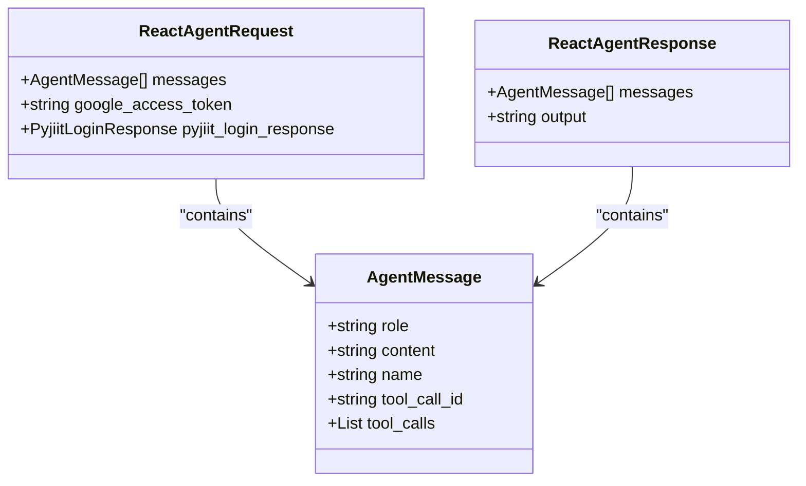

**Diagram sources**
- [models/requests/react_agent.py](file://models/requests/react_agent.py#L1-L45)
- [models/response/react_agent.py](file://models/response/react_agent.py#L1-L15)

**Section sources**
- [models/requests/react_agent.py](file://models/requests/react_agent.py#L1-L45)
- [models/response/react_agent.py](file://models/response/react_agent.py#L1-L15)

### WebsiteRequest/WebsiteResponse
- Shared pattern: Accepts URL and question with optional client HTML and attached file.
- Validation: Basic presence/type checks; chat history defaults to empty list.
- Transformation: Supplies page context to LLM for targeted answers.

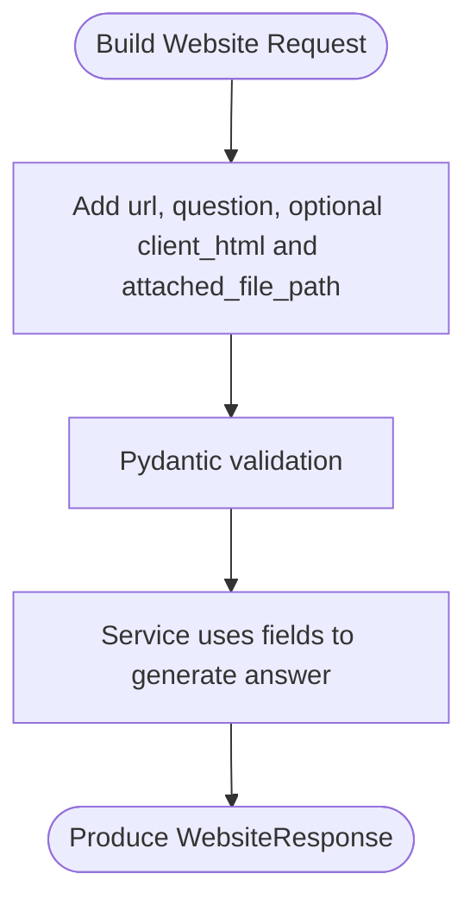

**Diagram sources**
- [models/requests/website.py](file://models/requests/website.py#L1-L11)
- [models/response/website.py](file://models/response/website.py#L1-L6)

**Section sources**
- [models/requests/website.py](file://models/requests/website.py#L1-L11)
- [models/response/website.py](file://models/response/website.py#L1-L6)

### SubtitlesRequest/SubtitlesResponse
- Shared pattern: Retrieves subtitles for a given video URL and language.
- Validation: Basic presence/type checks; default language ensures robustness.
- Transformation: Returns subtitle text for downstream processing.

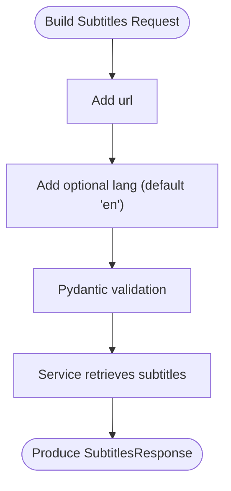

**Diagram sources**
- [models/requests/subtitles.py](file://models/requests/subtitles.py#L1-L8)
- [models/response/subtitles.py](file://models/response/subtitles.py#L1-L6)

**Section sources**
- [models/requests/subtitles.py](file://models/requests/subtitles.py#L1-L8)
- [models/response/subtitles.py](file://models/response/subtitles.py#L1-L6)

### PyjiitLoginResponse
- Shared pattern: Encapsulates PyJIIT portal response and derived session metadata.
- Validation: Nested typed fields; populate_by_name enabled for consistent field access.
- Transformation: Provides JWT token and identifiers for authenticated requests across services.

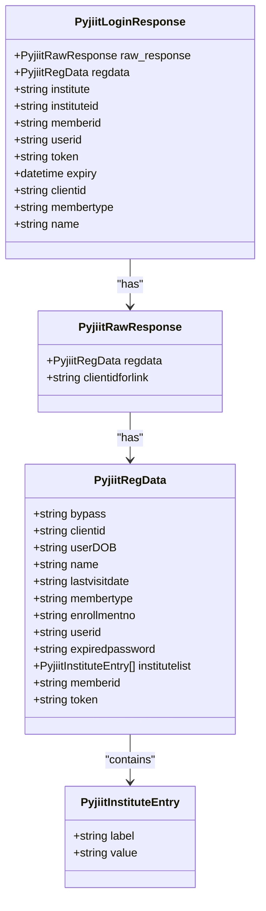

**Diagram sources**
- [models/requests/pyjiit.py](file://models/requests/pyjiit.py#L1-L91)

**Section sources**
- [models/requests/pyjiit.py](file://models/requests/pyjiit.py#L1-L91)

### YTVideoInfo
- Shared pattern: Normalizes YouTube metadata with sensible defaults.
- Validation: Defaults prevent missing-field errors; optional fields handle sparse data.
- Transformation: Standardizes video info for downstream consumers.

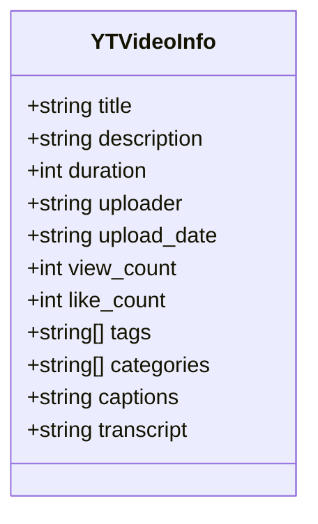

**Diagram sources**
- [models/yt.py](file://models/yt.py#L1-L17)

**Section sources**
- [models/yt.py](file://models/yt.py#L1-L17)

## Dependency Analysis
The models are decoupled from service implementations, enabling reuse across services. Authentication payloads (PyJIIT) are embedded in requests to support authenticated flows. Services selectively use subsets of request fields and map outputs to response models.

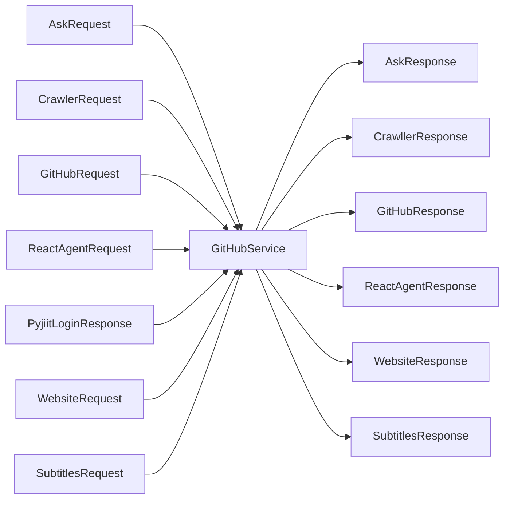

**Diagram sources**
- [models/requests/ask.py](file://models/requests/ask.py#L1-L10)
- [models/response/ask.py](file://models/response/ask.py#L1-L8)
- [models/requests/crawller.py](file://models/requests/crawller.py#L1-L35)
- [models/response/crawller.py](file://models/response/crawller.py#L1-L6)
- [models/requests/github.py](file://models/requests/github.py#L1-L9)
- [models/response/gihub.py](file://models/response/gihub.py#L1-L6)
- [models/requests/react_agent.py](file://models/requests/react_agent.py#L1-L45)
- [models/response/react_agent.py](file://models/response/react_agent.py#L1-L15)
- [models/requests/website.py](file://models/requests/website.py#L1-L11)
- [models/response/website.py](file://models/response/website.py#L1-L6)
- [models/requests/subtitles.py](file://models/requests/subtitles.py#L1-L8)
- [models/response/subtitles.py](file://models/response/subtitles.py#L1-L6)
- [models/requests/pyjiit.py](file://models/requests/pyjiit.py#L1-L91)
- [services/github_service.py](file://services/github_service.py#L1-L109)

**Section sources**
- [models/requests/__init__.py](file://models/requests/__init__.py#L1-L21)
- [models/response/__init__.py](file://models/response/__init__.py#L1-L20)

## Performance Considerations
- Truncation and context limits: Services may truncate large repository content to fit model context windows.
- File uploads: Attaching large files increases payload size; consider chunking or streaming where applicable.
- Tokenization: Prefer summarization and selective content inclusion to reduce token usage.
- Caching: Reuse processed repository summaries and transcripts when possible.
- Rate limiting: Respect provider quotas; implement retries with exponential backoff for throttled requests.

## Troubleshooting Guide
Common issues and resolutions:
- Invalid GitHub URL: Ensure the URL points to the repository root; otherwise, return a clear message instructing to navigate to the main repository page.
- Access failures: Verify repository visibility and URL correctness; return actionable guidance for 404 or clone-related errors.
- Context window exceeded: For very large repositories, suggest narrowing the question to specific files or directories.
- Attached file processing: If file upload fails, log the error and return a user-friendly message.
- Authentication: Validate PyJIIT token presence and expiry; ensure aliases are handled consistently.

**Section sources**
- [services/github_service.py](file://services/github_service.py#L1-L109)

## Conclusion
The service integration models provide a consistent, validated foundation for interacting with external services. Shared patterns enable cross-service compatibility, while service-specific variants address unique requirements such as authentication, file attachments, and specialized transformations. By adhering to these schemas and leveraging the outlined best practices, developers can implement robust integrations with predictable validation, error handling, and performance characteristics.