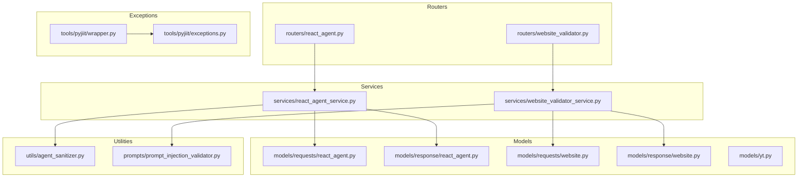
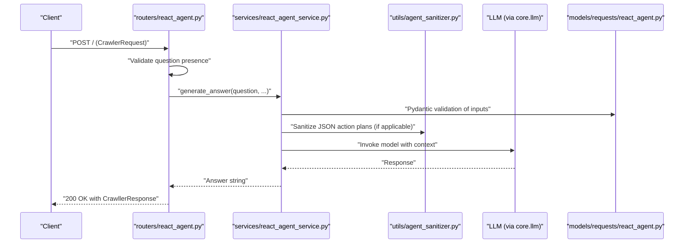
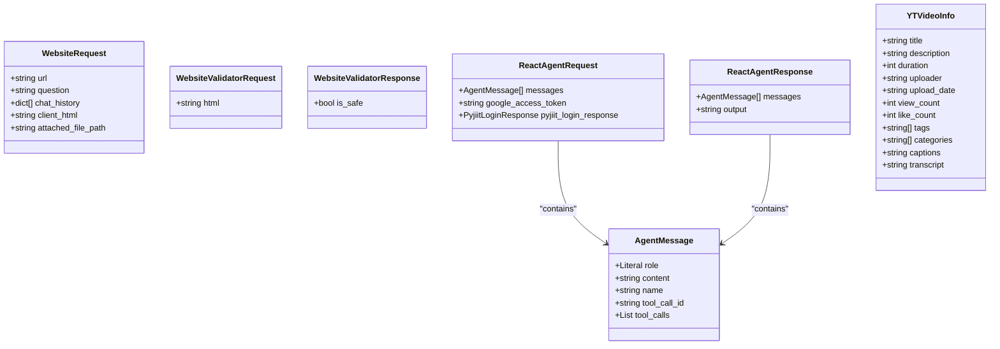
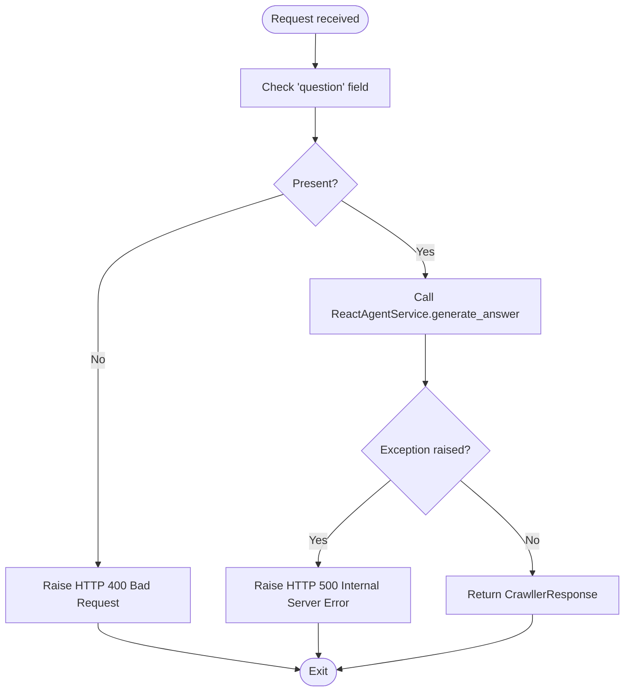
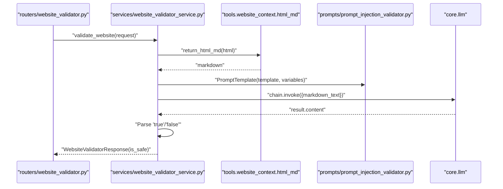
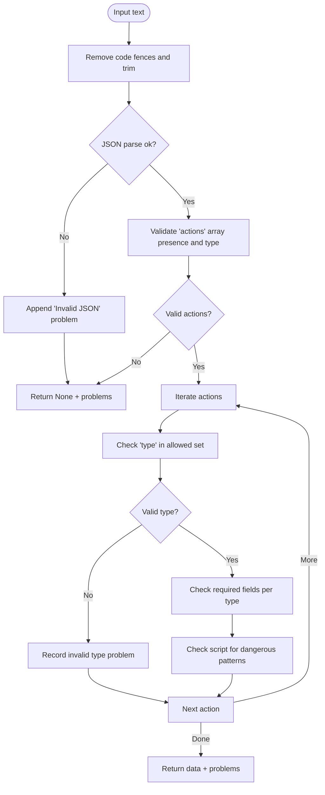
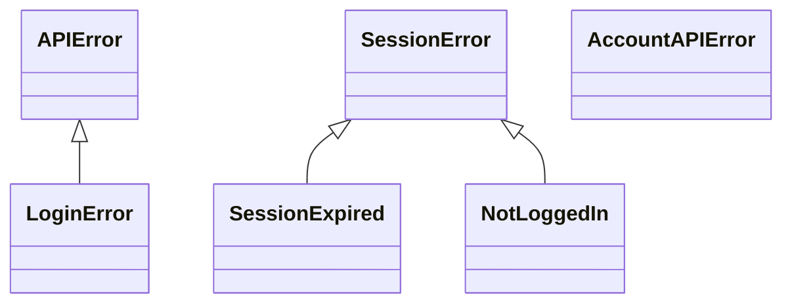
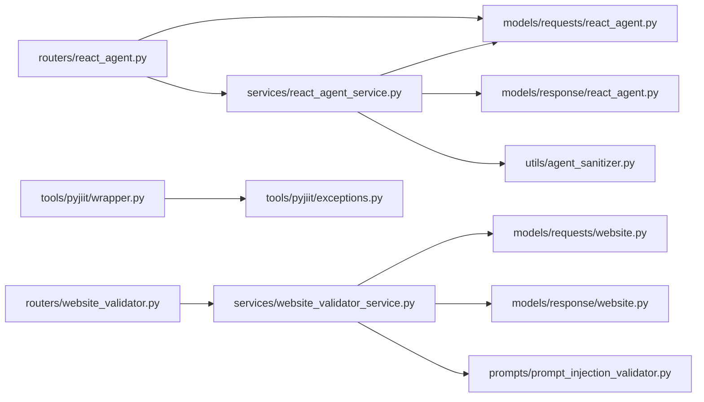

# Validation and error handling

## Introduction
This page explains the validation and error handling patterns used across the application's model schemas and services. It focuses on:
- Pydantic validation rules and configuration
- Custom sanitization and prompt injection detection
- Error response formats and exception handling
- Input validation workflows and security considerations
- Debugging techniques and performance optimization strategies

## Project structure
The validation and error handling spans several layers:
- Request/response models using Pydantic
- Routers that enforce basic input checks and translate exceptions
- Services that orchestrate validation, sanitization, and LLM-based checks
- Utilities for sanitization and prompt injection detection
- Domain-specific exception classes for reliable error signaling

```mermaid
graph TB
subgraph "Routers"
RA["routers/react_agent.py"]
WV["routers/website_validator.py"]
end
subgraph "Services"
RAS["services/react_agent_service.py"]
WVS["services/website_validator_service.py"]
end
subgraph "Models"
RAM["models/requests/react_agent.py"]
RAR["models/response/react_agent.py"]
WRM["models/requests/website.py"]
WRR["models/response/website.py"]
YTM["models/yt.py"]
end
subgraph "Utilities"
SAN["utils/agent_sanitizer.py"]
PINJ["prompts/prompt_injection_validator.py"]
end
subgraph "Exceptions"
PYEX["tools/pyjiit/exceptions.py"]
PYWR["tools/pyjiit/wrapper.py"]
end
RA --> RAS
WV --> WVS
RAS --> RAM
RAS --> RAR
WVS --> WRM
WVS --> WRR
RAS --> SAN
WVS --> PINJ
PYWR --> PYEX
```

## Core components
- Pydantic models define strict input contracts and defaults:
  - WebsiteRequest: validates URL, question, optional chat history, optional client HTML, and optional file path.
  - WebsiteValidatorRequest/Response: validates HTML input and produces a boolean safety flag.
  - AgentMessage and ReactAgentRequest: enforce message roles, minimum lengths, optional tool metadata, aliases for legacy fields, and whitespace trimming.
  - ReactAgentResponse: ensures final messages and output content are present.
  - YTVideoInfo: typed fields for YouTube metadata with defaults and optional transcript/captions.
- Router-level validation:
  - React agent endpoint enforces presence of question and converts errors to HTTP exceptions.
  - Website validator endpoint exposes a dedicated route returning a Pydantic response model.
- Sanitization utilities:
  - JSON action plan sanitizer validates structure, required fields, and action safety (including disallowed script patterns).
  - Legacy JS sanitizer detects disallowed patterns for backward compatibility.
- Prompt injection detection:
  - Website validator service converts HTML to Markdown and queries an LLM with a prompt designed to detect injection attempts.
- Exception taxonomy:
  - Domain-specific exceptions for API errors, login/session states, and account-related failures.

## Architecture overview
The validation pipeline integrates router-level checks, Pydantic model validation, and service-layer sanitization and LLM-based safety checks.

```mermaid
sequenceDiagram
participant Client as "Client"
participant Router as "routers/react_agent.py"
participant Service as "services/react_agent_service.py"
participant San as "utils/agent_sanitizer.py"
participant LLM as "LLM (via core.llm)"
participant Model as "models/requests/react_agent.py"
Client->>Router : "POST / (CrawlerRequest)"
Router->>Router : "Validate question presence"
Router->>Service : "generate_answer(question, ...)"
Service->>Model : "Pydantic validation of inputs"
Service->>San : "Sanitize JSON action plans (if applicable)"
Service->>LLM : "Invoke model with context"
LLM-->>Service : "Response"
Service-->>Router : "Answer string"
Router-->>Client : "200 OK with CrawllerResponse"
```

## Detailed component analysis

### Pydantic validation rules and configuration
- WebsiteRequest
  - Enforces presence of URL and question.
  - chat_history defaults to an empty list; client_html and attached_file_path are optional.
  - No explicit length constraints are applied at the model level.
- WebsiteValidatorRequest/Response
  - WebsiteValidatorRequest accepts raw HTML; WebsiteValidatorResponse returns a boolean flag indicating safety.
- AgentMessage
  - role is constrained to a fixed set of literal values.
  - content has a minimum length constraint; whitespace is stripped globally via model configuration.
  - tool_call_id and tool_calls support aliases for backward compatibility.
- ReactAgentRequest
  - messages must be a non-empty list.
  - google_access_token supports aliasing for legacy clients; whitespace normalization enabled.
  - pyjiit_login_response is optional and can accept either a Pydantic model or dict.
- ReactAgentResponse
  - Ensures final messages and output content are present.
- YTVideoInfo
  - Provides sensible defaults for all fields; transcripts and captions are optional.

```mermaid
classDiagram
class WebsiteRequest {
+string url
+string question
+dict[] chat_history
+string client_html
+string attached_file_path
}
class WebsiteValidatorRequest {
+string html
}
class WebsiteValidatorResponse {
+bool is_safe
}
class AgentMessage {
+Literal role
+string content
+string name
+string tool_call_id
+List tool_calls
}
class ReactAgentRequest {
+AgentMessage[] messages
+string google_access_token
+PyjiitLoginResponse pyjiit_login_response
}
class ReactAgentResponse {
+AgentMessage[] messages
+string output
}
class YTVideoInfo {
+string title
+string description
+int duration
+string uploader
+string upload_date
+int view_count
+int like_count
+string[] tags
+string[] categories
+string captions
+string transcript
}
ReactAgentRequest --> AgentMessage : "contains"
ReactAgentResponse --> AgentMessage : "contains"
```

### Router-Level validation and error handling
- React agent endpoint
  - Validates that the question is present; otherwise raises an HTTP 400.
  - Delegates to the service; any unhandled exceptions are caught and mapped to HTTP 500 with a sanitized detail.
- Website validator endpoint
  - Uses a Pydantic response model to serialize the safety result.

```mermaid
flowchart TD
Start(["Request received"]) --> CheckQuestion["Check 'question' field"]
CheckQuestion --> HasQuestion{"Present?"}
HasQuestion --> |No| HTTP400["Raise HTTP 400 Bad Request"]
HasQuestion --> |Yes| CallService["Call ReactAgentService.generate_answer"]
CallService --> HandleError{"Exception raised?"}
HandleError --> |Yes| HTTP500["Raise HTTP 500 Internal Server Error"]
HandleError --> |No| ReturnOK["Return CrawllerResponse"]
HTTP400 --> End(["Exit"])
HTTP500 --> End
ReturnOK --> End
```

### Website validator service: prompt injection detection
- Converts HTML to Markdown.
- Constructs a prompt template designed to detect prompt injection attempts.
- Invokes an LLM chain and interprets the result to produce a boolean safety flag.

```mermaid
sequenceDiagram
participant Router as "routers/website_validator.py"
participant Service as "services/website_validator_service.py"
participant HTMLMD as "tools.website_context.html_md"
participant Prompt as "prompts/prompt_injection_validator.py"
participant LLM as "core.llm"
Router->>Service : "validate_website(request)"
Service->>HTMLMD : "return_html_md(html)"
HTMLMD-->>Service : "markdown"
Service->>Prompt : "PromptTemplate(template, variables)"
Service->>LLM : "chain.invoke({markdown_text})"
LLM-->>Service : "result.content"
Service->>Service : "Parse 'true'/'false'"
Service-->>Router : "WebsiteValidatorResponse(is_safe)"
```

### Agent sanitizer: JSON action plan validation
- Removes code fences and trims input.
- Parses JSON and validates top-level structure and actions list.
- Enforces required fields per action type and applies safety checks for custom scripts.
- Returns parsed data and a list of validation problems.

```mermaid
flowchart TD
S(["Input text"]) --> Strip["Remove code fences and trim"]
Strip --> TryParse{"JSON parse ok?"}
TryParse --> |No| ReportErr["Append 'Invalid JSON' problem"] --> ReturnNull["Return None + problems"]
TryParse --> |Yes| ValidateStruct["Validate 'actions' array presence and type"]
ValidateStruct --> ActionsOk{"Valid actions?"}
ActionsOk --> |No| ReturnNull
ActionsOk --> |Yes| LoopActions["Iterate actions"]
LoopActions --> CheckType["Check 'type' in allowed set"]
CheckType --> TypeOk{"Valid type?"}
TypeOk --> |No| RecordProblem["Record invalid type problem"] --> NextAction["Next action"]
TypeOk --> |Yes| CheckFields["Check required fields per type"]
CheckFields --> ScriptSafety["Check script for dangerous patterns"]
ScriptSafety --> NextAction
NextAction --> |More| LoopActions
NextAction --> |Done| Done["Return data + problems"]
```

### Exception handling and security considerations
- Domain-specific exceptions:
  - APIError, LoginError, SessionError, SessionExpired, NotLoggedIn, AccountAPIError.
- Wrapper behavior:
  - Authentication guard checks session presence and raises appropriate exceptions.
  - HTTP responses are validated; unauthorized responses trigger session expiration handling.
- Security implications:
  - Prompt injection detection via LLM reduces risk of instruction contamination.
  - JSON action plan sanitizer enforces structural integrity and blocks known dangerous patterns.
  - Legacy JS sanitizer provides additional safeguards for older code paths.

```mermaid
classDiagram
class APIError
class LoginError
class SessionError
class SessionExpired
class NotLoggedIn
class AccountAPIError
APIError <|-- LoginError
SessionError <|-- SessionExpired
SessionError <|-- NotLoggedIn
```

## Dependency analysis
- Routers depend on services and Pydantic models for request/response shaping.
- Services depend on models for validation, on utilities for sanitization, and on LLMs for safety decisions.
- Exceptions are centralized under a domain module and used by wrappers to signal state transitions.

```mermaid
graph LR
RA["routers/react_agent.py"] --> RAS["services/react_agent_service.py"]
RA --> RAM["models/requests/react_agent.py"]
RAS --> RAM
RAS --> RAR["models/response/react_agent.py"]
WV["routers/website_validator.py"] --> WVS["services/website_validator_service.py"]
WVS --> WRM["models/requests/website.py"]
WVS --> WRR["models/response/website.py"]
WVS --> PINJ["prompts/prompt_injection_validator.py"]
RAS --> SAN["utils/agent_sanitizer.py"]
PYWR["tools/pyjiit/wrapper.py"] --> PYEX["tools/pyjiit/exceptions.py"]
```

## Performance considerations
- Prefer minimal validation overhead by using Pydantic's built-in constraints (e.g., min_length, literal enums).
- Avoid repeated parsing by caching intermediate results when feasible (e.g., Markdown conversion).
- Limit LLM calls to necessary inputs; batch or cache where appropriate.
- Use streaming or chunked processing for large documents to reduce latency.
- Apply early exits in sanitizers to avoid unnecessary work when inputs fail basic checks.

## Troubleshooting guide
- Router-level 400 errors:
  - Ensure the question field is present and non-empty.
  - Verify request body matches the expected model shape.
- Router-level 500 errors:
  - Inspect service logs for underlying exceptions.
  - Confirm that the service returns a string on error rather than raising unhandled exceptions.
- Website validation failures:
  - Confirm HTML is well-formed before invoking the validator.
  - Review LLM response interpretation logic for unexpected content.
- JSON action plan issues:
  - Validate that actions arrays contain required fields per action type.
  - Check for disallowed script patterns flagged by the sanitizer.
- Exception classification:
  - Distinguish between session-related and API-level errors to apply correct retry/backoff strategies.

## Conclusion
The application employs a layered validation strategy combining Pydantic models, router-level checks, sanitization utilities, and LLM-based safety assessments. Exceptions are explicitly modeled to improve observability and error handling. By adhering to these patterns, developers can maintain reliable input validation, secure processing, and predictable error reporting across the system.
