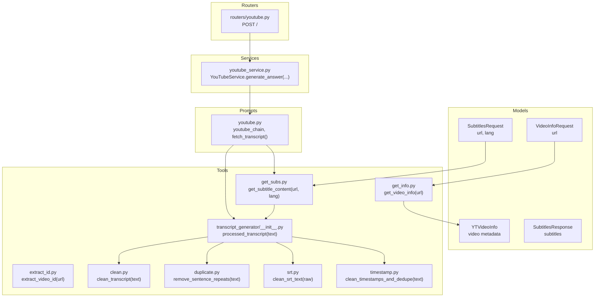
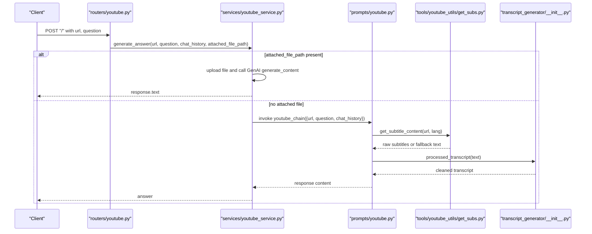
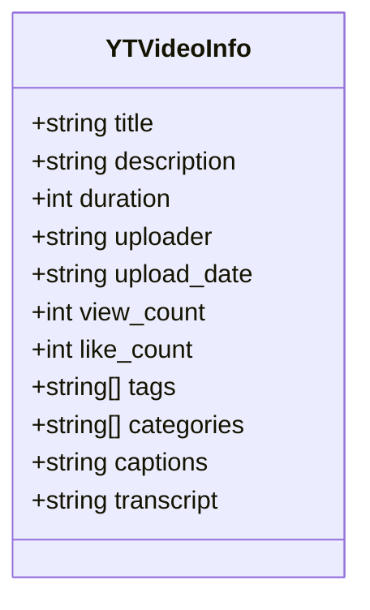
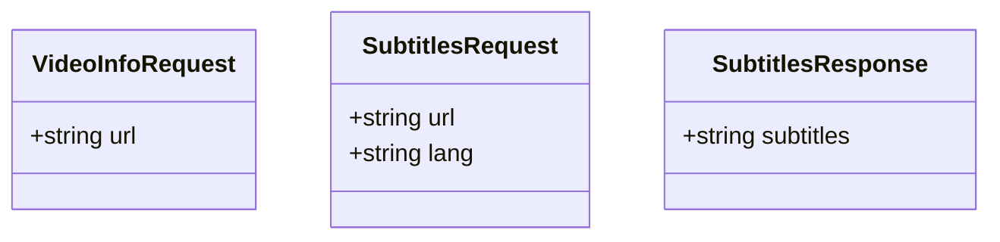
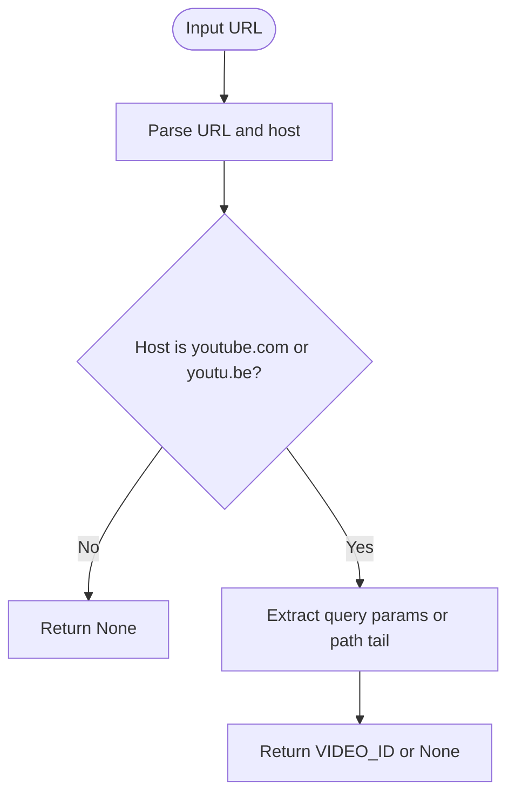
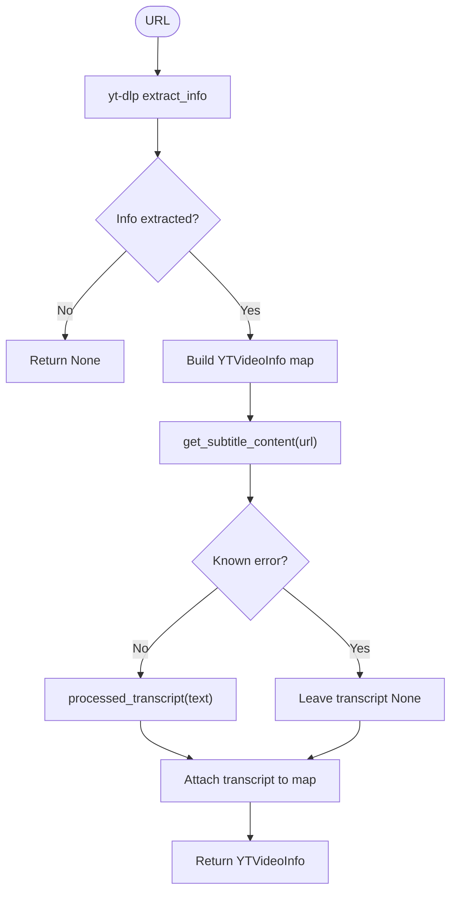
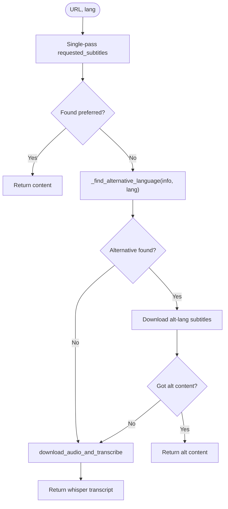
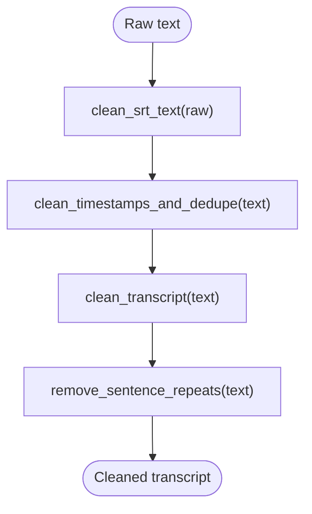
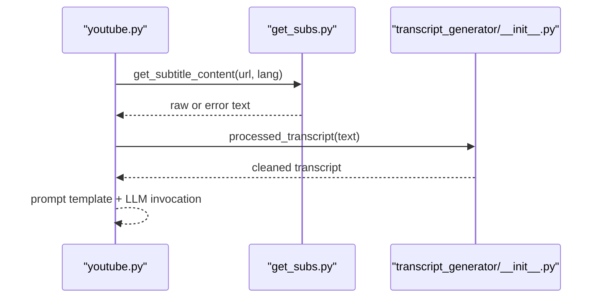
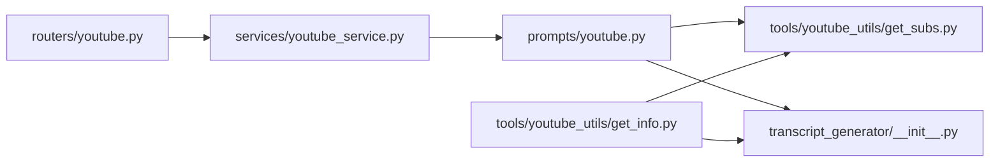

# YouTube Data Models

<cite>
**Referenced Files in This Document**
- [models/yt.py](file://models/yt.py)
- [tools/youtube_utils/get_info.py](file://tools/youtube_utils/get_info.py)
- [tools/youtube_utils/get_subs.py](file://tools/youtube_utils/get_subs.py)
- [tools/youtube_utils/extract_id.py](file://tools/youtube_utils/extract_id.py)
- [tools/youtube_utils/transcript_generator/__init__.py](file://tools/youtube_utils/transcript_generator/__init__.py)
- [tools/youtube_utils/transcript_generator/clean.py](file://tools/youtube_utils/transcript_generator/clean.py)
- [tools/youtube_utils/transcript_generator/duplicate.py](file://tools/youtube_utils/transcript_generator/duplicate.py)
- [tools/youtube_utils/transcript_generator/srt.py](file://tools/youtube_utils/transcript_generator/srt.py)
- [tools/youtube_utils/transcript_generator/timestamp.py](file://tools/youtube_utils/transcript_generator/timestamp.py)
- [prompts/youtube.py](file://prompts/youtube.py)
- [services/youtube_service.py](file://services/youtube_service.py)
- [routers/youtube.py](file://routers/youtube.py)
- [models/requests/video_info.py](file://models/requests/video_info.py)
- [models/requests/subtitles.py](file://models/requests/subtitles.py)
- [models/response/subtitles.py](file://models/response/subtitles.py)
</cite>

## Table of Contents
1. [Introduction](#introduction)
2. [Project Structure](#project-structure)
3. [Core Components](#core-components)
4. [Architecture Overview](#architecture-overview)
5. [Detailed Component Analysis](#detailed-component-analysis)
6. [Dependency Analysis](#dependency-analysis)
7. [Performance Considerations](#performance-considerations)
8. [Troubleshooting Guide](#troubleshooting-guide)
9. [Conclusion](#conclusion)
10. [Appendices](#appendices)

## Introduction
This document describes the YouTube-related data models and processing pipeline used to extract, transform, and consume YouTube video metadata and transcripts. It covers:
- Data structures for video metadata and transcript data
- Subtitle retrieval and transcript cleaning schemas
- Validation and normalization patterns for YouTube URLs and video IDs
- Transformation patterns for timestamps and content deduplication
- Error handling and fallback strategies during content extraction
- Integration points with the YouTube service and prompt chain

## Project Structure
The YouTube processing stack spans models, tools, prompts, services, and routers:
- Data models define typed structures for video info and request/response payloads
- Tools implement URL parsing, metadata extraction, subtitle retrieval, and transcript cleaning
- Prompts orchestrate context assembly and LLM prompting
- Services coordinate processing and integrate with external APIs
- Routers expose endpoints for YouTube queries

**Diagram sources**
- [models/yt.py](file://models/yt.py#L5-L17)
- [tools/youtube_utils/extract_id.py](file://tools/youtube_utils/extract_id.py#L8-L24)
- [tools/youtube_utils/get_info.py](file://tools/youtube_utils/get_info.py#L11-L77)
- [tools/youtube_utils/get_subs.py](file://tools/youtube_utils/get_subs.py#L8-L276)
- [tools/youtube_utils/transcript_generator/__init__.py](file://tools/youtube_utils/transcript_generator/__init__.py#L11-L22)
- [tools/youtube_utils/transcript_generator/clean.py](file://tools/youtube_utils/transcript_generator/clean.py#L22-L67)
- [tools/youtube_utils/transcript_generator/duplicate.py](file://tools/youtube_utils/transcript_generator/duplicate.py#L4-L26)
- [tools/youtube_utils/transcript_generator/srt.py](file://tools/youtube_utils/transcript_generator/srt.py#L4-L30)
- [tools/youtube_utils/transcript_generator/timestamp.py](file://tools/youtube_utils/transcript_generator/timestamp.py#L10-L32)
- [prompts/youtube.py](file://prompts/youtube.py#L37-L75)
- [services/youtube_service.py](file://services/youtube_service.py#L8-L71)
- [routers/youtube.py](file://routers/youtube.py#L15-L59)

**Section sources**
- [models/yt.py](file://models/yt.py#L1-L17)
- [tools/youtube_utils/get_info.py](file://tools/youtube_utils/get_info.py#L1-L77)
- [tools/youtube_utils/get_subs.py](file://tools/youtube_utils/get_subs.py#L1-L276)
- [tools/youtube_utils/extract_id.py](file://tools/youtube_utils/extract_id.py#L1-L24)
- [tools/youtube_utils/transcript_generator/__init__.py](file://tools/youtube_utils/transcript_generator/__init__.py#L1-L22)
- [prompts/youtube.py](file://prompts/youtube.py#L1-L158)
- [services/youtube_service.py](file://services/youtube_service.py#L1-L71)
- [routers/youtube.py](file://routers/youtube.py#L1-L59)
- [models/requests/video_info.py](file://models/requests/video_info.py#L1-L7)
- [models/requests/subtitles.py](file://models/requests/subtitles.py#L1-L8)
- [models/response/subtitles.py](file://models/response/subtitles.py#L1-L6)

## Core Components
- YTVideoInfo: Typed container for YouTube video metadata and optional transcript
- VideoInfoRequest: Minimal request for video info endpoint
- SubtitlesRequest: Request specifying URL and preferred subtitle language
- SubtitlesResponse: Response containing extracted subtitles
- extract_video_id: Utility to extract YouTube video IDs from supported URL forms
- get_video_info: Orchestrates metadata extraction and optional transcript assembly
- get_subtitle_content: Retrieves subtitles with fallback to audio transcription
- processed_transcript: Pipeline of transcript cleaning and normalization
- youtube_chain: Prompt chain assembling context and invoking the LLM

**Section sources**
- [models/yt.py](file://models/yt.py#L5-L17)
- [models/requests/video_info.py](file://models/requests/video_info.py#L5-L7)
- [models/requests/subtitles.py](file://models/requests/subtitles.py#L5-L8)
- [models/response/subtitles.py](file://models/response/subtitles.py#L4-L6)
- [tools/youtube_utils/extract_id.py](file://tools/youtube_utils/extract_id.py#L8-L24)
- [tools/youtube_utils/get_info.py](file://tools/youtube_utils/get_info.py#L11-L77)
- [tools/youtube_utils/get_subs.py](file://tools/youtube_utils/get_subs.py#L8-L276)
- [tools/youtube_utils/transcript_generator/__init__.py](file://tools/youtube_utils/transcript_generator/__init__.py#L11-L22)
- [prompts/youtube.py](file://prompts/youtube.py#L37-L75)

## Architecture Overview
End-to-end YouTube processing flow:
- Router validates inputs and delegates to YouTubeService
- Service either uses a direct file-based path (with Google GenAI) or invokes the prompt chain
- Prompt chain fetches transcript via get_subtitle_content and processed_transcript
- get_video_info enriches metadata and optionally attaches cleaned transcript
- Tools handle URL parsing, subtitle retrieval, and robust fallbacks

**Diagram sources**
- [routers/youtube.py](file://routers/youtube.py#L15-L59)
- [services/youtube_service.py](file://services/youtube_service.py#L8-L71)
- [prompts/youtube.py](file://prompts/youtube.py#L37-L75)
- [tools/youtube_utils/get_subs.py](file://tools/youtube_utils/get_subs.py#L8-L276)
- [tools/youtube_utils/transcript_generator/__init__.py](file://tools/youtube_utils/transcript_generator/__init__.py#L11-L22)

## Detailed Component Analysis

### Data Model: YTVideoInfo
YTVideoInfo defines the canonical video metadata structure used across the system. It includes:
- title: Video title with default fallback
- description: Video description
- duration: Video duration in seconds
- uploader: Channel or uploader name
- upload_date: ISO-like date string
- view_count: Number of views
- like_count: Number of likes
- tags: List of tags
- categories: List of categories
- captions: Optional caption content
- transcript: Optional cleaned transcript

**Diagram sources**
- [models/yt.py](file://models/yt.py#L5-L17)

**Section sources**
- [models/yt.py](file://models/yt.py#L5-L17)

### Data Model: Requests and Responses
- VideoInfoRequest: Minimal payload requiring a URL for video info retrieval
- SubtitlesRequest: Payload requiring a URL and optional language preference
- SubtitlesResponse: Response carrying the extracted subtitles

**Diagram sources**
- [models/requests/video_info.py](file://models/requests/video_info.py#L5-L7)
- [models/requests/subtitles.py](file://models/requests/subtitles.py#L5-L8)
- [models/response/subtitles.py](file://models/response/subtitles.py#L4-L6)

**Section sources**
- [models/requests/video_info.py](file://models/requests/video_info.py#L1-L7)
- [models/requests/subtitles.py](file://models/requests/subtitles.py#L1-L8)
- [models/response/subtitles.py](file://models/response/subtitles.py#L1-L6)

### URL Parsing and Validation: extract_video_id
The extract_video_id utility parses YouTube URLs and supports:
- youtube.com/watch?v=VIDEO_ID
- youtu.be/VIDEO_ID
It returns the extracted video ID or None on failure.

**Diagram sources**
- [tools/youtube_utils/extract_id.py](file://tools/youtube_utils/extract_id.py#L8-L24)

**Section sources**
- [tools/youtube_utils/extract_id.py](file://tools/youtube_utils/extract_id.py#L8-L24)

### Metadata Extraction: get_video_info
get_video_info uses yt-dlp to extract metadata and optionally attach a cleaned transcript:
- Builds yt-dlp options to avoid downloads and warnings
- Extracts metadata fields into YTVideoInfo-compatible dictionary
- Attempts subtitle retrieval and applies error detection
- Applies processed_transcript to normalize and clean the transcript
- Returns YTVideoInfo with optional transcript

**Diagram sources**
- [tools/youtube_utils/get_info.py](file://tools/youtube_utils/get_info.py#L11-L77)
- [tools/youtube_utils/get_subs.py](file://tools/youtube_utils/get_subs.py#L8-L276)
- [tools/youtube_utils/transcript_generator/__init__.py](file://tools/youtube_utils/transcript_generator/__init__.py#L11-L22)

**Section sources**
- [tools/youtube_utils/get_info.py](file://tools/youtube_utils/get_info.py#L11-L77)

### Subtitle Retrieval and Fallback: get_subtitle_content
Subtitle retrieval follows a prioritized strategy:
- Single-pass attempt for preferred language (manual + auto-generated + auto-translated)
- Alternative language selection from available tracks
- One retry for alternative language if needed
- Fallback to audio download and transcription via faster-whisper

**Diagram sources**
- [tools/youtube_utils/get_subs.py](file://tools/youtube_utils/get_subs.py#L8-L276)

**Section sources**
- [tools/youtube_utils/get_subs.py](file://tools/youtube_utils/get_subs.py#L8-L276)

### Transcript Cleaning Pipeline: processed_transcript
The processed_transcript pipeline normalizes and cleans raw subtitle text:
- clean_srt_text: Removes SRT/VTT timestamp lines and artifacts
- clean_timestamps_and_dedupe: Strips arrow-based timestamps and inline cues, deduplicates lines
- clean_transcript: Paragraphizes and removes cue/spkr tags
- remove_sentence_repeats: Collapses repeated sentences

**Diagram sources**
- [tools/youtube_utils/transcript_generator/__init__.py](file://tools/youtube_utils/transcript_generator/__init__.py#L11-L22)
- [tools/youtube_utils/transcript_generator/srt.py](file://tools/youtube_utils/transcript_generator/srt.py#L4-L30)
- [tools/youtube_utils/transcript_generator/timestamp.py](file://tools/youtube_utils/transcript_generator/timestamp.py#L10-L32)
- [tools/youtube_utils/transcript_generator/clean.py](file://tools/youtube_utils/transcript_generator/clean.py#L22-L67)
- [tools/youtube_utils/transcript_generator/duplicate.py](file://tools/youtube_utils/transcript_generator/duplicate.py#L4-L26)

**Section sources**
- [tools/youtube_utils/transcript_generator/__init__.py](file://tools/youtube_utils/transcript_generator/__init__.py#L11-L22)
- [tools/youtube_utils/transcript_generator/srt.py](file://tools/youtube_utils/transcript_generator/srt.py#L4-L30)
- [tools/youtube_utils/transcript_generator/timestamp.py](file://tools/youtube_utils/transcript_generator/timestamp.py#L10-L32)
- [tools/youtube_utils/transcript_generator/clean.py](file://tools/youtube_utils/transcript_generator/clean.py#L22-L67)
- [tools/youtube_utils/transcript_generator/duplicate.py](file://tools/youtube_utils/transcript_generator/duplicate.py#L4-L26)

### Prompt Chain and Answer Generation: youtube_chain
The prompt chain composes context from fetched transcripts and invokes the LLM:
- fetch_transcript: Retrieves and cleans transcript, handling known error conditions
- get_context: Supplies transcript to the chain
- youtube_chain: Assembles prompt with context, question, and chat history
- youtube_service: Invokes chain or uses file-based path depending on attachment

**Diagram sources**
- [prompts/youtube.py](file://prompts/youtube.py#L37-L75)
- [tools/youtube_utils/get_subs.py](file://tools/youtube_utils/get_subs.py#L8-L276)
- [tools/youtube_utils/transcript_generator/__init__.py](file://tools/youtube_utils/transcript_generator/__init__.py#L11-L22)

**Section sources**
- [prompts/youtube.py](file://prompts/youtube.py#L37-L75)
- [services/youtube_service.py](file://services/youtube_service.py#L8-L71)
- [routers/youtube.py](file://routers/youtube.py#L15-L59)

## Dependency Analysis
- Router depends on YouTubeService for processing
- YouTubeService depends on the prompt chain and optional GenAI SDK
- Prompt chain depends on get_subtitle_content and processed_transcript
- get_video_info depends on get_subtitle_content and processed_transcript
- get_subtitle_content depends on yt-dlp and faster-whisper for fallback

**Diagram sources**
- [routers/youtube.py](file://routers/youtube.py#L1-L59)
- [services/youtube_service.py](file://services/youtube_service.py#L1-L71)
- [prompts/youtube.py](file://prompts/youtube.py#L1-L158)
- [tools/youtube_utils/get_info.py](file://tools/youtube_utils/get_info.py#L1-L77)
- [tools/youtube_utils/get_subs.py](file://tools/youtube_utils/get_subs.py#L1-L276)
- [tools/youtube_utils/transcript_generator/__init__.py](file://tools/youtube_utils/transcript_generator/__init__.py#L1-L22)

**Section sources**
- [routers/youtube.py](file://routers/youtube.py#L1-L59)
- [services/youtube_service.py](file://services/youtube_service.py#L1-L71)
- [prompts/youtube.py](file://prompts/youtube.py#L1-L158)
- [tools/youtube_utils/get_info.py](file://tools/youtube_utils/get_info.py#L1-L77)
- [tools/youtube_utils/get_subs.py](file://tools/youtube_utils/get_subs.py#L1-L276)
- [tools/youtube_utils/transcript_generator/__init__.py](file://tools/youtube_utils/transcript_generator/__init__.py#L1-L22)

## Performance Considerations
- Minimize redundant subtitle downloads by preferring single-pass retrieval and caching cleaned transcripts where appropriate
- Use language prioritization to reduce fallback attempts
- Favor CPU-based whisper models for resource-constrained environments
- Avoid unnecessary file writes by cleaning temporary directories promptly after processing

## Troubleshooting Guide
Common issues and resolutions:
- Video unavailable: Detected by known error messages and DownloadError variants; fallback to whisper transcription is triggered
- Rate limiting (429): Detected and triggers whisper fallback
- No subtitles available: Falls back to audio download and transcription
- Known error prefixes: Recognized and treated as non-transcript errors
- Cleanup failures: Temporary directories are removed with logging on cleanup errors

Operational checks:
- Verify GOOGLE_API_KEY or GEMINI_API_KEY for file-based processing
- Confirm yt-dlp and faster-whisper availability and permissions for temp directories
- Validate URL formats supported by extract_video_id

**Section sources**
- [tools/youtube_utils/get_subs.py](file://tools/youtube_utils/get_subs.py#L80-L116)
- [tools/youtube_utils/get_subs.py](file://tools/youtube_utils/get_subs.py#L201-L276)
- [services/youtube_service.py](file://services/youtube_service.py#L20-L52)

## Conclusion
The YouTube data model and processing pipeline provide a robust, layered approach to extracting and transforming YouTube content. The design emphasizes:
- Strongly typed data models for predictable consumption
- Comprehensive subtitle retrieval with intelligent fallbacks
- A modular transcript cleaning pipeline for normalized content
- Clear separation of concerns between routing, service orchestration, and tooling
- Practical error handling and cleanup to maintain reliability

## Appendices

### Data Model Reference

- YTVideoInfo
  - title: string, default "Unknown"
  - description: string, default empty
  - duration: integer, default 0
  - uploader: string, default "Unknown"
  - upload_date: string, default empty
  - view_count: integer, default 0
  - like_count: integer, default 0
  - tags: array of strings, default empty
  - categories: array of strings, default empty
  - captions: string or null, default null
  - transcript: string or null, default null

- VideoInfoRequest
  - url: string

- SubtitlesRequest
  - url: string
  - lang: string, default "en"

- SubtitlesResponse
  - subtitles: string

Validation and normalization rules:
- URL parsing supports youtube.com/watch?v=VIDEO_ID and youtu.be/VIDEO_ID
- Transcript cleaning removes timestamps, cue tags, speaker tags, and duplicate lines
- Error detection treats specific messages and prefixes as non-transcript errors
- Fallback to whisper transcription ensures minimal failure impact

**Section sources**
- [models/yt.py](file://models/yt.py#L5-L17)
- [models/requests/video_info.py](file://models/requests/video_info.py#L5-L7)
- [models/requests/subtitles.py](file://models/requests/subtitles.py#L5-L8)
- [models/response/subtitles.py](file://models/response/subtitles.py#L4-L6)
- [tools/youtube_utils/extract_id.py](file://tools/youtube_utils/extract_id.py#L8-L24)
- [tools/youtube_utils/transcript_generator/__init__.py](file://tools/youtube_utils/transcript_generator/__init__.py#L11-L22)
- [tools/youtube_utils/get_subs.py](file://tools/youtube_utils/get_subs.py#L40-L67)