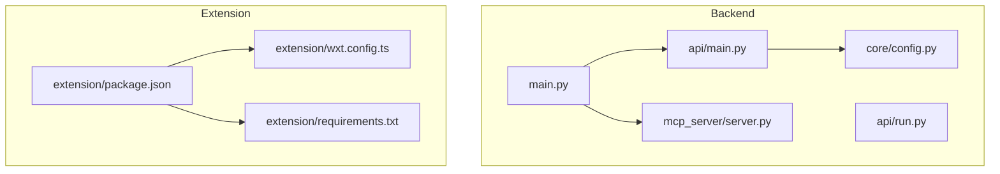
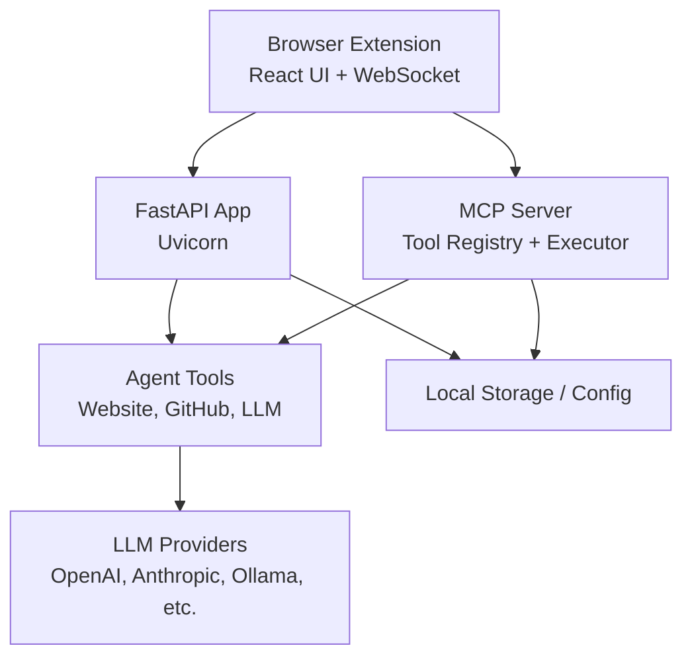
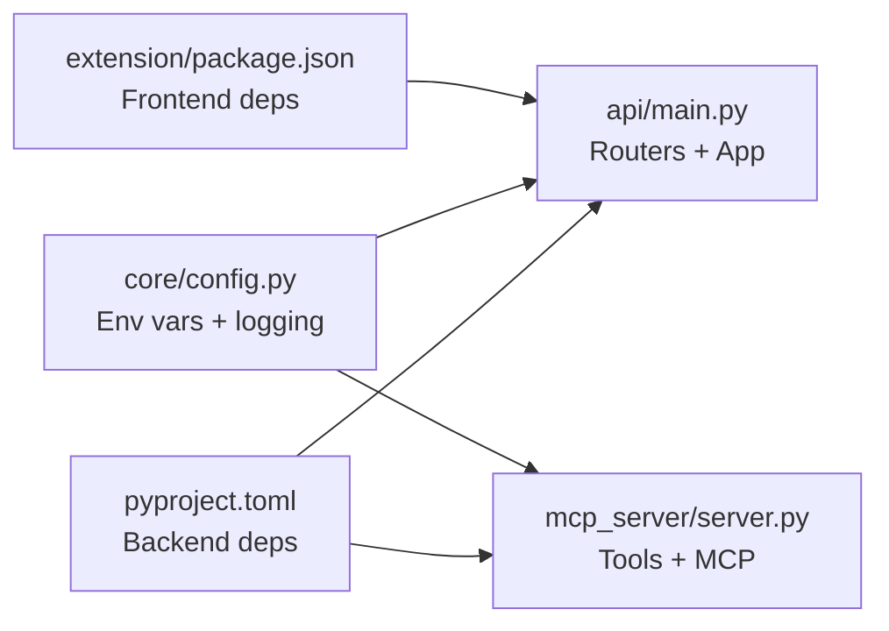

# Deployment and Operations

<cite>
**Referenced Files in This Document**
- [README.md](file://README.md)
- [main.py](file://main.py)
- [pyproject.toml](file://pyproject.toml)
- [api/main.py](file://api/main.py)
- [api/run.py](file://api/run.py)
- [core/config.py](file://core/config.py)
- [mcp_server/server.py](file://mcp_server/server.py)
- [extension/package.json](file://extension/package.json)
- [extension/wxt.config.ts](file://extension/wxt.config.ts)
- [extension/requirements.txt](file://extension/requirements.txt)
</cite>

## Table of Contents
1. [Introduction](#introduction)
2. [Project Structure](#project-structure)
3. [Core Components](#core-components)
4. [Architecture Overview](#architecture-overview)
5. [Detailed Component Analysis](#detailed-component-analysis)
6. [Dependency Analysis](#dependency-analysis)
7. [Performance Considerations](#performance-considerations)
8. [Troubleshooting Guide](#troubleshooting-guide)
9. [Conclusion](#conclusion)
10. [Appendices](#appendices)

## Introduction
This document provides comprehensive deployment and operations guidance for Agentic Browser. It covers deployment strategies for both the backend MCP server and the browser extension across development, staging, and production environments. It also documents containerization approaches, environment setup, CI/CD considerations, monitoring/logging, performance optimization, scaling, extension publishing workflows, operational procedures, security, backups, disaster recovery, and troubleshooting.

## Project Structure
Agentic Browser comprises:
- A Python backend with a FastAPI application and an MCP server
- A browser extension built with React and WXT (WebExtensions Toolkit)
- Modular routers, tools, and services supporting agent workflows
- Configuration and environment variable management

**Diagram sources**
- [main.py](file://main.py#L1-L58)
- [api/main.py](file://api/main.py#L1-L47)
- [api/run.py](file://api/run.py#L1-L15)
- [core/config.py](file://core/config.py#L1-L26)
- [mcp_server/server.py](file://mcp_server/server.py#L1-L139)
- [extension/package.json](file://extension/package.json#L1-L40)
- [extension/wxt.config.ts](file://extension/wxt.config.ts#L1-L29)
- [extension/requirements.txt](file://extension/requirements.txt#L1-L6)

**Section sources**
- [README.md](file://README.md#L1-L185)
- [main.py](file://main.py#L1-L58)
- [api/main.py](file://api/main.py#L1-L47)
- [api/run.py](file://api/run.py#L1-L15)
- [core/config.py](file://core/config.py#L1-L26)
- [mcp_server/server.py](file://mcp_server/server.py#L1-L139)
- [extension/package.json](file://extension/package.json#L1-L40)
- [extension/wxt.config.ts](file://extension/wxt.config.ts#L1-L29)
- [extension/requirements.txt](file://extension/requirements.txt#L1-L6)

## Core Components
- Backend entrypoint and mode selection
  - The primary script selects between running the API server or the MCP server and supports non-interactive defaults.
  - See [main.py](file://main.py#L11-L54).

- FastAPI application and router composition
  - The API server initializes a FastAPI app and mounts multiple routers for different capabilities.
  - See [api/main.py](file://api/main.py#L12-L41).

- Uvicorn runner
  - The API server is started via Uvicorn with configurable host, port, and reload behavior.
  - See [api/run.py](file://api/run.py#L4-L10).

- Environment configuration and logging
  - Centralized environment variables for environment type, debug mode, host, port, and Google API key.
  - Logging level is derived from environment and configured globally.
  - See [core/config.py](file://core/config.py#L8-L25).

- MCP server and tool definitions
  - The MCP server exposes tools for LLM generation, GitHub Q&A, and website content conversion.
  - Tools are defined with typed input schemas and executed via a call handler.
  - See [mcp_server/server.py](file://mcp_server/server.py#L16-L80) and [mcp_server/server.py](file://mcp_server/server.py#L83-L124).

- Extension build and manifest
  - The extension uses WXT with React and defines permissions and host permissions in the manifest.
  - Build scripts include dev, build, zip, and platform-specific targets.
  - See [extension/wxt.config.ts](file://extension/wxt.config.ts#L3-L28) and [extension/package.json](file://extension/package.json#L7-L16).

**Section sources**
- [main.py](file://main.py#L11-L54)
- [api/main.py](file://api/main.py#L12-L41)
- [api/run.py](file://api/run.py#L4-L10)
- [core/config.py](file://core/config.py#L8-L25)
- [mcp_server/server.py](file://mcp_server/server.py#L16-L80)
- [mcp_server/server.py](file://mcp_server/server.py#L83-L124)
- [extension/wxt.config.ts](file://extension/wxt.config.ts#L3-L28)
- [extension/package.json](file://extension/package.json#L7-L16)

## Architecture Overview
Agentic Browser runs two primary servers:
- API server (FastAPI/Uvicorn) exposing REST endpoints for agent and service integrations
- MCP server (Model Context Protocol) for LLM-driven tool execution and browser orchestration

**Diagram sources**
- [api/main.py](file://api/main.py#L12-L41)
- [mcp_server/server.py](file://mcp_server/server.py#L16-L80)
- [mcp_server/server.py](file://mcp_server/server.py#L83-L124)
- [core/config.py](file://core/config.py#L8-L25)

## Detailed Component Analysis

### Backend Deployment Strategies
- Development
  - Run the API server with hot reload enabled for rapid iteration.
  - Example invocation: [api/run.py](file://api/run.py#L4-L10).
  - Environment variables: set environment type to development and enable debug logging via [core/config.py](file://core/config.py#L8-L18).

- Staging
  - Use non-reload mode and configure host/port per [api/run.py](file://api/run.py#L4-L10).
  - Set environment variables for staging via [core/config.py](file://core/config.py#L8-L11).

- Production
  - Deploy behind a reverse proxy and configure production-grade logging and ports.
  - Use the CLI entrypoints defined in [pyproject.toml](file://pyproject.toml#L31-L33) to start servers.

- Mode selection
  - Choose between API and MCP modes using the CLI in [main.py](file://main.py#L11-L54).

**Section sources**
- [api/run.py](file://api/run.py#L4-L10)
- [core/config.py](file://core/config.py#L8-L18)
- [pyproject.toml](file://pyproject.toml#L31-L33)
- [main.py](file://main.py#L11-L54)

### Containerization Approach
- Python backend
  - Use a Python 3.12+ base image and install dependencies from [pyproject.toml](file://pyproject.toml#L7-L29).
  - Expose port 5454 (or configurable via environment) as defined in [core/config.py](file://core/config.py#L10-L11).
  - Entrypoint can invoke the CLI in [main.py](file://main.py#L11-L54) or use the script entrypoints from [pyproject.toml](file://pyproject.toml#L31-L33).

- Browser extension
  - Build artifacts are generated under [extension/.output/](file://extension/.output/) after running build commands in [extension/package.json](file://extension/package.json#L7-L16).
  - Manifest and permissions are defined in [extension/wxt.config.ts](file://extension/wxt.config.ts#L5-L27).

- Notes
  - The extension includes a small Flask-based requirements file ([extension/requirements.txt](file://extension/requirements.txt#L1-L6)) that appears unrelated to the main Python backend; confirm whether it is used for local development tooling or testing.

**Section sources**
- [pyproject.toml](file://pyproject.toml#L7-L29)
- [core/config.py](file://core/config.py#L10-L11)
- [main.py](file://main.py#L11-L54)
- [pyproject.toml](file://pyproject.toml#L31-L33)
- [extension/package.json](file://extension/package.json#L7-L16)
- [extension/wxt.config.ts](file://extension/wxt.config.ts#L5-L27)
- [extension/requirements.txt](file://extension/requirements.txt#L1-L6)

### Environment Setup Procedures
- Environment variables
  - Configure environment type, debug flag, host, port, and Google API key via [core/config.py](file://core/config.py#L8-L14).
  - The main entrypoint loads environment variables using python-dotenv as seen in [main.py](file://main.py#L7-L8).

- API server configuration
  - Host and port are passed to the Uvicorn runner in [api/run.py](file://api/run.py#L4-L10).

- MCP server configuration
  - The MCP server uses stdio transport and registers tools defined in [mcp_server/server.py](file://mcp_server/server.py#L16-L80).

**Section sources**
- [core/config.py](file://core/config.py#L8-L14)
- [main.py](file://main.py#L7-L8)
- [api/run.py](file://api/run.py#L4-L10)
- [mcp_server/server.py](file://mcp_server/server.py#L16-L80)

### Infrastructure Requirements
- Compute and OS
  - Python 3.12+ runtime for the backend.
  - Node.js and pnpm for building the extension.

- Networking
  - API server binds to BACKEND_HOST and listens on BACKEND_PORT; ensure firewall rules permit inbound connections.
  - MCP server communicates via stdio; ensure the extension can spawn and communicate with the server process.

- Storage and caching
  - Local storage for session data and configuration; ensure adequate disk space for logs and temporary files.

- LLM providers
  - Configure provider credentials and base URLs as required by the MCP tools in [mcp_server/server.py](file://mcp_server/server.py#L88-L99).

**Section sources**
- [pyproject.toml](file://pyproject.toml#L6-L6)
- [core/config.py](file://core/config.py#L10-L11)
- [mcp_server/server.py](file://mcp_server/server.py#L88-L99)

### CI/CD Pipeline Setup
- Recommended stages
  - Install dependencies: Python (backend) and Node.js (extension)
  - Lint and test (Python and TypeScript)
  - Build extension artifacts using scripts in [extension/package.json](file://extension/package.json#L7-L16)
  - Build backend distribution (wheel/sdist) using [pyproject.toml](file://pyproject.toml#L1-L34)
  - Artifact publication and deployment to target environments

- Versioning and release tagging
  - Use semantic versioning aligned with the project metadata in [pyproject.toml](file://pyproject.toml#L2-L4).

- Secrets management
  - Store provider keys and environment variables in CI secrets; avoid committing sensitive data.

- Deployment automation
  - Use environment-specific configuration files and scripts to deploy the API server and MCP server to staging and production.

[No sources needed since this section provides general guidance]

### Monitoring and Logging Strategies
- Logging
  - Centralized logging level controlled by environment variables in [core/config.py](file://core/config.py#L17-L18).
  - Use structured logging for API and MCP servers to facilitate correlation and alerting.

- Metrics and health checks
  - Expose a health endpoint under the API server as included in [api/main.py](file://api/main.py#L29).
  - Monitor CPU, memory, and network usage of the Python processes.

- Observability
  - Integrate with your platform’s logging and metrics stack; consider exporting logs to a centralized system.

**Section sources**
- [core/config.py](file://core/config.py#L17-L18)
- [api/main.py](file://api/main.py#L29)

### Performance Optimization Techniques
- API server
  - Disable reload in production and tune worker/process counts for Uvicorn.
  - Optimize route handlers and database/vector store queries.

- MCP server
  - Cache tool results where appropriate and limit concurrent heavy operations.
  - Use provider-specific connection pooling and timeouts.

- Extension
  - Minimize bundle size and defer heavy computations to the backend.
  - Use lazy loading for UI components.

[No sources needed since this section provides general guidance]

### Scaling Considerations
- Horizontal scaling
  - Scale the API server behind a load balancer; maintain stateless design.
  - Use message queues or shared state for MCP coordination if extending to distributed workers.

- Vertical scaling
  - Increase CPU/memory for LLM-heavy operations; provision GPU instances if using local models.

- Caching and persistence
  - Cache frequently accessed website content and embeddings; ensure durability for session data.

[No sources needed since this section provides general guidance]

### Extension Publishing Process
- Chrome Web Store
  - Build extension artifacts using [extension/package.json](file://extension/package.json#L10-L11).
  - Prepare manifest and permissions in [extension/wxt.config.ts](file://extension/wxt.config.ts#L5-L27).
  - Package and upload the extension following Chrome Developer Dashboard guidelines.

- Firefox Add-ons
  - Build for Firefox using the Firefox-specific script in [extension/package.json](file://extension/package.json#L9-L11).
  - Follow Mozilla Add-on Developer Hub submission process.

- Signing and certification
  - Ensure all assets are properly signed and meet platform policies.
  - Maintain version alignment between backend and extension.

**Section sources**
- [extension/package.json](file://extension/package.json#L7-L16)
- [extension/wxt.config.ts](file://extension/wxt.config.ts#L5-L27)

### Operational Procedures
- Maintenance
  - Regularly update dependencies and patch vulnerabilities.
  - Rotate provider keys and review environment configurations.

- Updates
  - Use blue-green or rolling deployments for zero-downtime updates.
  - Validate extension compatibility after backend changes.

- Rollback strategies
  - Keep previous container images and extension builds available.
  - Revert API and MCP server versions quickly if issues arise.

- Incident response
  - Enable alerting on critical errors and timeouts.
  - Collect logs from both API and MCP servers for forensic analysis.

[No sources needed since this section provides general guidance]

### Security Considerations
- Least privilege
  - Limit extension permissions to those declared in [extension/wxt.config.ts](file://extension/wxt.config.ts#L8-L26).

- Secrets management
  - Store API keys in environment variables and avoid hardcoding.
  - Restrict access to deployment systems and CI secrets.

- Transport and isolation
  - Use HTTPS for API endpoints and secure communication channels.
  - Isolate MCP server processes and restrict IPC access.

- Audit and compliance
  - Maintain audit logs for user actions and tool invocations.
  - Implement content filtering and allowlists as per project goals.

**Section sources**
- [extension/wxt.config.ts](file://extension/wxt.config.ts#L8-L26)

### Backup and Disaster Recovery
- Data backup
  - Back up configuration files, logs, and persistent data stores.
  - Automate periodic snapshots of production volumes.

- Recovery procedures
  - Test restoration procedures regularly.
  - Maintain documented runbooks for failover scenarios.

[No sources needed since this section provides general guidance]

## Dependency Analysis
- Backend dependencies
  - Core libraries include FastAPI, Uvicorn, LangChain/LangGraph, MCP, and provider adapters as defined in [pyproject.toml](file://pyproject.toml#L7-L29).

- Extension dependencies
  - React, Socket.IO client, Tailwind, and WXT as defined in [extension/package.json](file://extension/package.json#L17-L39).

- Environment and configuration
  - Environment variables drive behavior and logging in [core/config.py](file://core/config.py#L8-L25).

**Diagram sources**
- [pyproject.toml](file://pyproject.toml#L7-L29)
- [extension/package.json](file://extension/package.json#L17-L39)
- [core/config.py](file://core/config.py#L8-L25)
- [mcp_server/server.py](file://mcp_server/server.py#L16-L80)
- [api/main.py](file://api/main.py#L12-L41)

**Section sources**
- [pyproject.toml](file://pyproject.toml#L7-L29)
- [extension/package.json](file://extension/package.json#L17-L39)
- [core/config.py](file://core/config.py#L8-L25)
- [mcp_server/server.py](file://mcp_server/server.py#L16-L80)
- [api/main.py](file://api/main.py#L12-L41)

## Performance Considerations
- API server
  - Tune Uvicorn workers and keep-alive timeouts.
  - Cache expensive operations and optimize route handlers.

- MCP server
  - Batch tool calls and reuse LLM clients.
  - Apply rate limiting and circuit breakers for external providers.

- Extension
  - Minimize DOM operations and offload heavy work to the backend.
  - Use debouncing and throttling for user interactions.

[No sources needed since this section provides general guidance]

## Troubleshooting Guide
- Backend does not start
  - Verify environment variables and host/port configuration in [core/config.py](file://core/config.py#L10-L11).
  - Confirm the selected mode and entrypoint in [main.py](file://main.py#L11-L54).

- API server not reachable
  - Check Uvicorn binding in [api/run.py](file://api/run.py#L4-L10).
  - Ensure firewall rules allow inbound traffic on the configured port.

- MCP server not responding
  - Confirm MCP tool definitions and execution path in [mcp_server/server.py](file://mcp_server/server.py#L83-L124).
  - Validate provider credentials and base URLs used in tool calls.

- Extension build failures
  - Review build scripts in [extension/package.json](file://extension/package.json#L7-L16).
  - Check manifest permissions in [extension/wxt.config.ts](file://extension/wxt.config.ts#L5-L27).

- Permission errors
  - Review extension permissions in [extension/wxt.config.ts](file://extension/wxt.config.ts#L8-L26).

**Section sources**
- [core/config.py](file://core/config.py#L10-L11)
- [main.py](file://main.py#L11-L54)
- [api/run.py](file://api/run.py#L4-L10)
- [mcp_server/server.py](file://mcp_server/server.py#L83-L124)
- [extension/package.json](file://extension/package.json#L7-L16)
- [extension/wxt.config.ts](file://extension/wxt.config.ts#L8-L26)

## Conclusion
Agentic Browser’s deployment model centers on a Python backend (FastAPI and MCP) and a React-based browser extension. By leveraging environment-driven configuration, containerization, and CI/CD automation, teams can reliably operate the system across development, staging, and production. Robust monitoring, security hardening, and operational playbooks ensure stability and resilience.

## Appendices
- Environment variables reference
  - Environment type, debug flag, host, port, and Google API key are managed in [core/config.py](file://core/config.py#L8-L14).

- CLI entrypoints
  - Backend scripts are defined in [pyproject.toml](file://pyproject.toml#L31-L33).

- Extension build and packaging
  - Build and packaging commands are defined in [extension/package.json](file://extension/package.json#L7-L16).

**Section sources**
- [core/config.py](file://core/config.py#L8-L14)
- [pyproject.toml](file://pyproject.toml#L31-L33)
- [extension/package.json](file://extension/package.json#L7-L16)