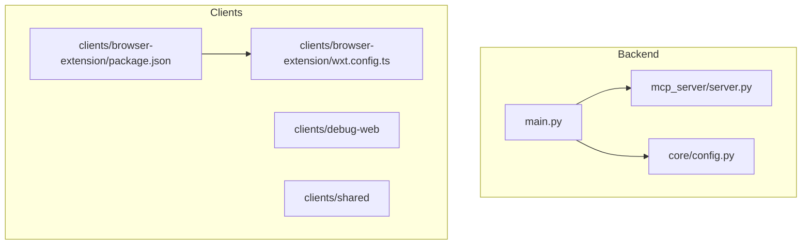
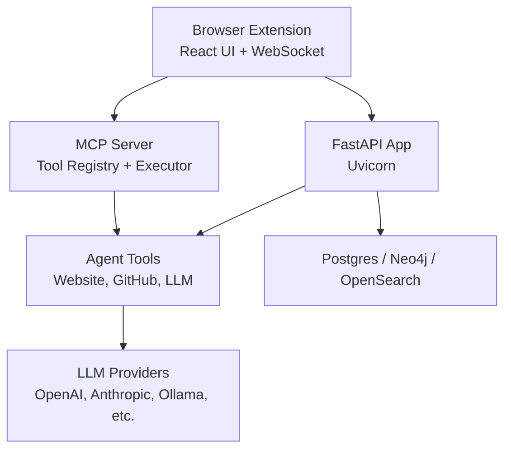
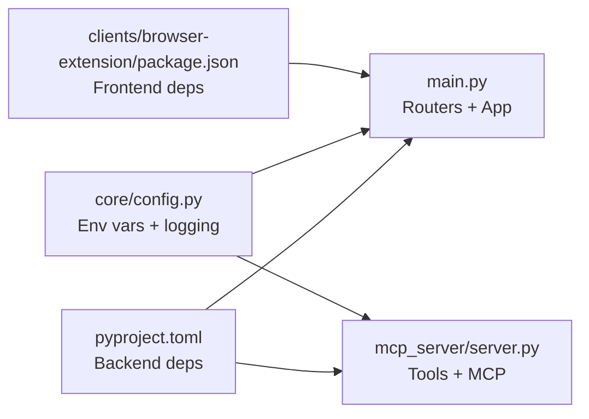

# Deployment and operations

## Introduction
How to run the FastAPI and MCP servers and ship the extension across dev, staging, and production. Covers env setup, containers, logging, publishing, and recovery when things die.

Source: [github.com/tashifkhan/agentic-browser](https://github.com/tashifkhan/agentic-browser)

## Project structure
Agentic Browser comprises:
- A Python backend (Python >=3.12) with FastAPI in `main.py` and MCP in `mcp_server/`
- LangGraph/LangChain agents, routers, tools, services, and skills
- Memory via sqlmodel/asyncpg, Neo4j, and OpenSearch
- A pnpm workspace: `clients/browser-extension`, `clients/debug-web`, `clients/shared`

```mermaid
graph TB
subgraph "Backend"
A_main["main.py"]
A_cfg["core/config.py"]
A_mcp["mcp_server/server.py"]
end
subgraph "Clients"
E_pkg["clients/browser-extension/package.json"]
E_wxt["clients/browser-extension/wxt.config.ts"]
DBG["clients/debug-web"]
SHR["clients/shared"]
end
A_main --> A_mcp
A_main --> A_cfg
E_pkg --> E_wxt
```

## Core components
- Backend entrypoint
 - `main.py` builds the FastAPI app, mounts `/mcp`, and starts Uvicorn via `run()`.
 - CLI aliases in `pyproject.toml`: `agentic-api-run` and `agentic-mcp`.

- FastAPI application and router composition
 - Routers live under `routers/`. Memory routes come from `memory/api/router.py`.
 - See `main.py`.

- Uvicorn runner
 - Host, port, and reload are arguments on `main.run()` (default port 5454).
 - See `main.py`.

- Environment configuration and logging
 - Centralized environment variables for environment type, debug mode, host, port, and provider keys.
 - Logging level is derived from environment and configured globally.
 - See `core/config.py`.

- MCP server and tool definitions
 - The MCP server exposes tools for LLM generation, GitHub Q&A, and website content conversion.
 - HTTP transport is mounted at `/mcp`; stdio transport is `agentic-mcp`.
 - See `mcp_server/server.py`.

- Extension build and manifest
 - The extension uses WXT with React. Permissions live in the manifest.
 - Root scripts: `pnpm dev:extension`, `pnpm build:extension`, `pnpm zip:extension`.
 - See `clients/browser-extension/wxt.config.ts` and `clients/browser-extension/package.json`.

## Architecture overview
Agentic Browser runs two primary servers:
- API server (FastAPI/Uvicorn) exposing REST endpoints for agent and service integrations
- MCP server (Model Context Protocol) for LLM-driven tool execution, over stdio or `/mcp`

```mermaid
graph TB
Client["Browser Extension<br/>React UI + WebSocket"]
API["FastAPI App<br/>Uvicorn"]
MCP["MCP Server<br/>Tool Registry + Executor"]
Tools["Agent Tools<br/>Website, GitHub, LLM"]
LLM["LLM Providers<br/>OpenAI, Anthropic, Ollama, etc."]
Storage["Postgres / Neo4j / OpenSearch"]
Client --> API
Client --> MCP
API --> Tools
MCP --> Tools
Tools --> LLM
API --> Storage
```

## Detailed component analysis

### Backend deployment strategies
- Development
 - Run the API with hot reload: `python main.py` or `agentic-api-run`.
 - Environment variables: set environment type to development and enable debug logging via `core/config.py`.

- Staging
 - Use non-reload mode (`reload=False` on `main.run()`).
 - Set environment variables for staging via `core/config.py`.

- Production
 - Deploy behind a reverse proxy and configure production-grade logging and ports.
 - Use the CLI entrypoints defined in `pyproject.toml`.

- Mode selection
 - API: `python main.py` / `agentic-api-run`.
 - Stdio MCP: `agentic-mcp`. HTTP MCP is always mounted at `/mcp` on the API process.

### Containerization approach
- Python backend
 - Use a Python 3.12+ base image and install dependencies from `pyproject.toml`.
 - Expose port 5454 (or configurable via environment) as defined in `core/config.py`.
 - Entrypoint can invoke `main:run` or `mcp_server.server:run`.
 - `docker-compose.yml` runs Postgres, Neo4j, and OpenSearch for memory.

- Browser extension
 - Build artifacts land under `clients/browser-extension/.output/` after `pnpm build:extension`.
 - Manifest and permissions are defined in `clients/browser-extension/wxt.config.ts`.

### Environment setup procedures
- Environment variables
 - Configure environment type, debug flag, host, port, and provider keys via `core/config.py`.
 - The main entrypoint loads environment variables using python-dotenv as seen in `main.py`.

- API server configuration
 - Host and port are passed to the Uvicorn runner in `main.py`.

- MCP server configuration
 - Stdio MCP registers tools defined in `mcp_server/server.py`.
 - Streamable HTTP MCP is mounted at `/mcp` on the FastAPI app.

### Infrastructure requirements
- Compute and OS
 - Python 3.12+ runtime for the backend.
 - Node.js and pnpm 9 for the workspace.

- Networking
 - API server binds to BACKEND_HOST and listens on BACKEND_PORT; ensure firewall rules permit inbound connections.
 - MCP over stdio needs a client that can spawn the process. HTTP MCP uses `/mcp`.

- Storage
 - Postgres (asyncpg/sqlmodel), Neo4j, and OpenSearch for memory. Compose maps Postgres 5433, Neo4j 7687, OpenSearch 9201.

- LLM providers
 - Configure provider credentials and base URLs as required by MCP tools in `mcp_server/server.py`.

### CI/CD pipeline setup
- Recommended stages
 - Install dependencies: Python (backend) and pnpm (workspace)
 - Lint and test (Python and TypeScript)
 - Build extension artifacts with `pnpm build:extension`
 - Build backend distribution (wheel/sdist) using `pyproject.toml`
 - Artifact publication and deployment to target environments

- Versioning and release tagging
 - Use semantic versioning aligned with the project metadata in `pyproject.toml`.

- Secrets management
 - Store provider keys and environment variables in CI secrets; avoid committing sensitive data.

- Deployment automation
 - Use environment-specific configuration files and scripts to deploy the API server and MCP server to staging and production.

### Monitoring and logging strategies
- Logging
 - Centralized logging level controlled by environment variables in `core/config.py`.
 - Use structured logging for API and MCP servers to help correlation and alerting.

- Metrics and health checks
 - Expose a health endpoint under `/api/genai/health` as included in `main.py`.
 - Monitor CPU, memory, and network usage of the Python processes.

- Observability
 - Integrate with your platform's logging and metrics stack; consider exporting logs to a centralized system.

### Performance optimization techniques
- API server
 - Disable reload in production and tune worker/process counts for Uvicorn.
 - Optimize route handlers and database/vector store queries.

- MCP server
 - Cache tool results where appropriate and limit concurrent heavy operations.
 - Use provider-specific connection pooling and timeouts.

- Extension
 - Minimize bundle size and defer heavy computations to the backend.
 - Use lazy loading for UI components.

### Scaling considerations
- Horizontal scaling
 - Scale the API server behind a load balancer; keep FastAPI workers stateless.
 - Use message queues or shared state for MCP coordination if extending to distributed workers.

- Vertical scaling
 - Increase CPU/memory for LLM-heavy operations; provision GPU instances if using local models.

- Caching and persistence
 - Cache frequently accessed website content and embeddings; ensure durability for session data.

### Extension publishing process
- Chrome Web Store
 - Build with `pnpm build:extension` or `pnpm zip:extension`.
 - Prepare manifest and permissions in `clients/browser-extension/wxt.config.ts`.
 - Package and upload the extension following Chrome Developer Dashboard guidelines.

- Firefox Add-ons
 - Build with `pnpm build:extension:firefox` or `pnpm zip:extension:firefox`.
 - Follow Mozilla Add-on Developer Hub submission process.

- Signing and certification
 - Ensure all assets are properly signed and meet platform policies.
 - Maintain version alignment between backend and extension.

### Operational procedures
- Maintenance
 - Regularly update dependencies and patch vulnerabilities.
 - Rotate provider keys and review environment configurations.

- Updates
 - Use blue-green or rolling deployments for zero-downtime updates.
 - Validate extension compatibility after backend changes.

- Rollback strategies
 - Keep previous container images and extension builds available.
 - Revert API and MCP server versions quickly if issues arise.

- Incident response
 - Enable alerting on critical errors and timeouts.
 - Collect logs from both API and MCP servers for forensic analysis.

### Security considerations
- Least privilege
 - Limit extension permissions to those declared in `clients/browser-extension/wxt.config.ts`.

- Secrets management
 - Store API keys in environment variables and avoid hardcoding.
 - Restrict access to deployment systems and CI secrets.

- Transport and isolation
 - Use HTTPS for API endpoints and secure communication channels.
 - Isolate MCP server processes and restrict IPC access.

- Audit and compliance
 - Maintain audit logs for user actions and tool invocations.
 - Implement content filtering and allowlists as per project goals.

### Backup and disaster recovery
- Data backup
 - Back up configuration files, logs, and persistent data stores (Postgres, Neo4j, OpenSearch volumes).
 - Automate periodic snapshots of production volumes.

- Recovery procedures
 - Test restoration procedures regularly.
 - Maintain documented runbooks for failover scenarios.

## Dependency analysis
- Backend dependencies
 - Core libraries include FastAPI, Uvicorn, LangChain/LangGraph, MCP, sqlmodel, asyncpg, neo4j, and opensearch-py as defined in `pyproject.toml`.

- Extension dependencies
 - React, Socket.IO client, and WXT as defined in `clients/browser-extension/package.json`.
 - Shared UI/API code lives in `clients/shared`.

- Environment and configuration
 - Environment variables drive behavior and logging in `core/config.py`.

```mermaid
graph LR
P["pyproject.toml<br/>Backend deps"]
E["clients/browser-extension/package.json<br/>Frontend deps"]
C["core/config.py<br/>Env vars + logging"]
M["mcp_server/server.py<br/>Tools + MCP"]
A["main.py<br/>Routers + App"]
P --> A
P --> M
C --> A
C --> M
E --> A
```

## Performance considerations
- API server
 - Tune Uvicorn workers and keep-alive timeouts.
 - Cache expensive operations and optimize route handlers.

- MCP server
 - Batch tool calls and reuse LLM clients.
 - Apply rate limiting and circuit breakers for external providers.

- Extension
 - Minimize DOM operations and offload heavy work to the backend.
 - Use debouncing and throttling for user interactions.

## Troubleshooting guide
- Backend does not start
 - Verify environment variables and host/port configuration in `core/config.py`.
 - Confirm the selected entrypoint in `main.py` or `agentic-mcp`.

- API server not reachable
 - Check Uvicorn binding in `main.py`.
 - Ensure firewall rules allow inbound traffic on the configured port.

- MCP server not responding
 - Confirm MCP tool definitions and execution path in `mcp_server/server.py`.
 - Validate provider credentials and base URLs used in tool calls.

- Extension build failures
 - Review scripts in root `package.json` and `clients/browser-extension/package.json`.
 - Check manifest permissions in `clients/browser-extension/wxt.config.ts`.

- Permission errors
 - Review extension permissions in `clients/browser-extension/wxt.config.ts`.

## Conclusion
Treat API keys as secrets, keep extension permissions tight, and watch health plus structured logs. Packaging lives in `clients/browser-extension/package.json`; server entrypoints are `agentic-api-run` and `agentic-mcp`.

## Appendices
- Environment variables reference
 - Environment type, debug flag, host, port, and Google API key are managed in `core/config.py`.

- CLI entrypoints
 - Backend scripts are defined in `pyproject.toml`.

- Extension build and packaging
 - Root commands: `pnpm dev:extension`, `pnpm build:extension`, `pnpm zip:extension`.
