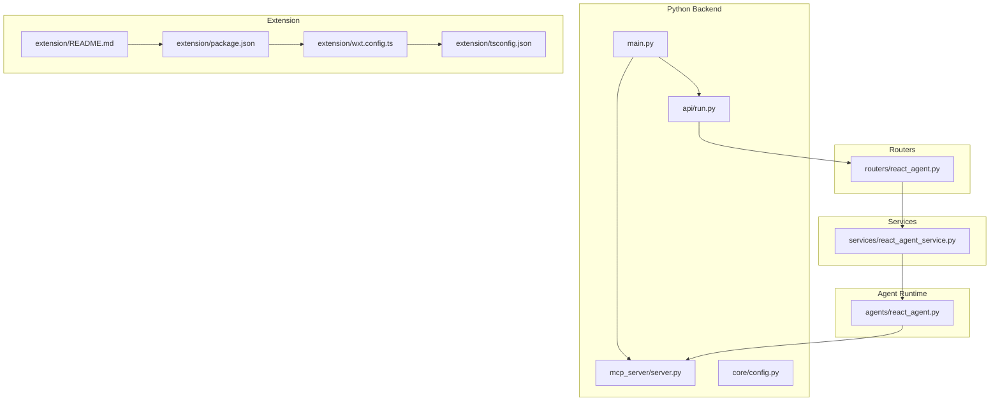
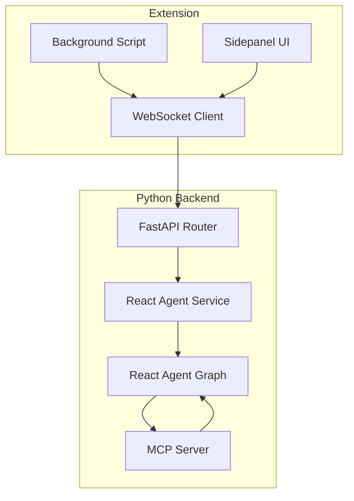
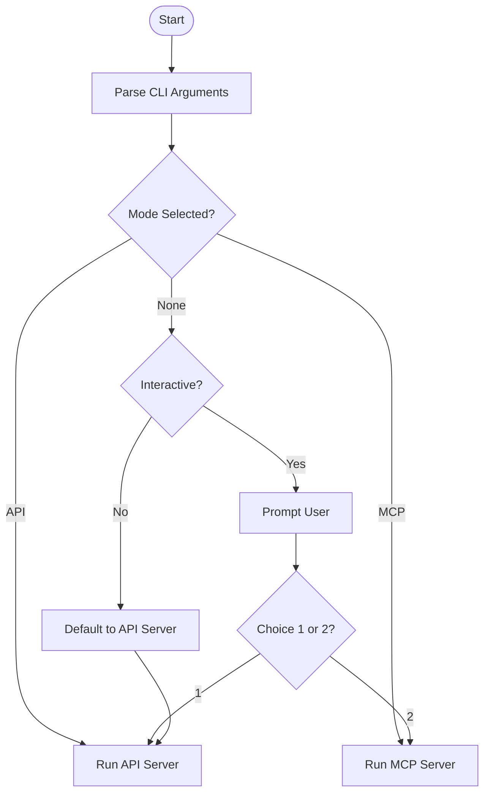
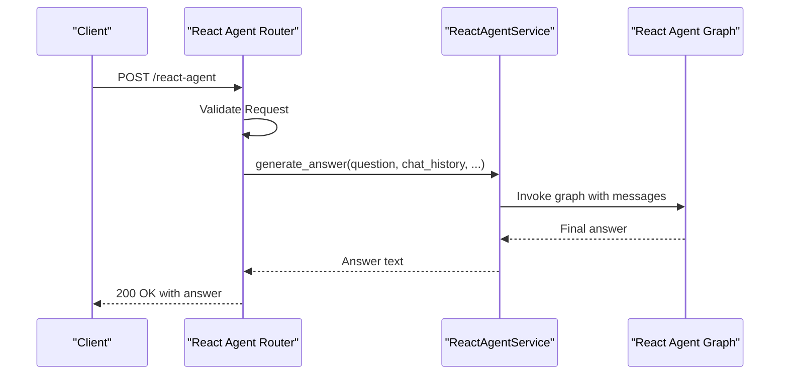
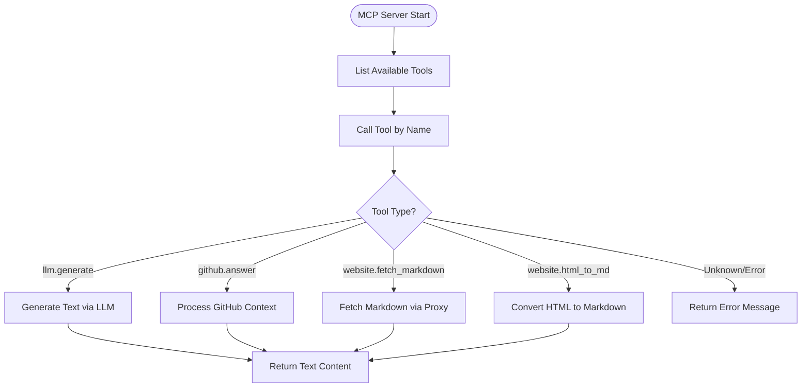
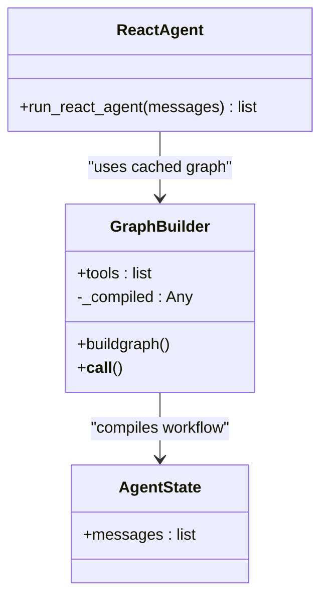
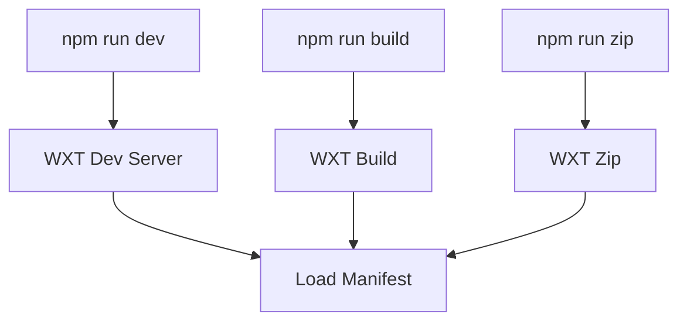
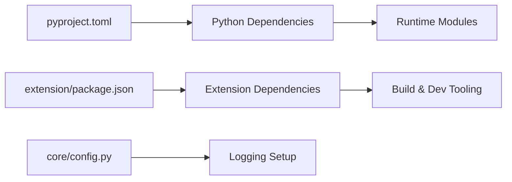

# Development Guidelines

<cite>
**Referenced Files in This Document**
- [README.md](file://README.md)
- [main.py](file://main.py)
- [pyproject.toml](file://pyproject.toml)
- [api/run.py](file://api/run.py)
- [core/config.py](file://core/config.py)
- [mcp_server/server.py](file://mcp_server/server.py)
- [agents/react_agent.py](file://agents/react_agent.py)
- [routers/react_agent.py](file://routers/react_agent.py)
- [services/react_agent_service.py](file://services/react_agent_service.py)
- [extension/README.md](file://extension/README.md)
- [extension/package.json](file://extension/package.json)
- [extension/wxt.config.ts](file://extension/wxt.config.ts)
- [extension/tsconfig.json](file://extension/tsconfig.json)
</cite>

## Table of Contents
1. [Introduction](#introduction)
2. [Project Structure](#project-structure)
3. [Core Components](#core-components)
4. [Architecture Overview](#architecture-overview)
5. [Detailed Component Analysis](#detailed-component-analysis)
6. [Dependency Analysis](#dependency-analysis)
7. [Performance Considerations](#performance-considerations)
8. [Troubleshooting Guide](#troubleshooting-guide)
9. [Development Workflow](#development-workflow)
10. [Code Standards and Conventions](#code-standards-and-conventions)
11. [Testing Requirements](#testing-requirements)
12. [Documentation Standards](#documentation-standards)
13. [Release Procedures](#release-procedures)
14. [Conclusion](#conclusion)

## Introduction
This document provides comprehensive development guidelines for contributors working on Agentic Browser. It covers code standards for Python backend, TypeScript frontend, and browser extension development, outlines the development workflow, debugging techniques, performance profiling, code review processes, quality assurance practices, environment setup, IDE configuration, and contribution guidelines for new features, tool system extensions, and service integrations.

## Project Structure
Agentic Browser is organized into distinct layers:
- Python backend: FastAPI server and MCP server for model-agnostic agent orchestration
- Agent runtime: LangGraph-based React agent with tool integration
- Services: Domain-specific services orchestrating tools and external APIs
- Models: Request/response DTOs for typed API interactions
- Prompts: Prompt templates and validators
- Tools: Modular tool implementations for browser actions, RAG, and third-party integrations
- Extension: React-based browser extension with sidepanel, background scripts, and utilities

**Diagram sources**
- [main.py](file://main.py#L1-L58)
- [api/run.py](file://api/run.py#L1-L15)
- [mcp_server/server.py](file://mcp_server/server.py#L1-L139)
- [core/config.py](file://core/config.py#L1-L26)
- [agents/react_agent.py](file://agents/react_agent.py#L1-L191)
- [services/react_agent_service.py](file://services/react_agent_service.py#L1-L154)
- [routers/react_agent.py](file://routers/react_agent.py#L1-L57)
- [extension/README.md](file://extension/README.md#L1-L4)
- [extension/package.json](file://extension/package.json#L1-L40)
- [extension/wxt.config.ts](file://extension/wxt.config.ts#L1-L29)
- [extension/tsconfig.json](file://extension/tsconfig.json#L1-L13)

**Section sources**
- [README.md](file://README.md#L1-L185)
- [main.py](file://main.py#L1-L58)
- [pyproject.toml](file://pyproject.toml#L1-L34)

## Core Components
- Entry point and server selection: The main entry chooses between API and MCP modes, supporting interactive and non-interactive modes.
- API server: Uvicorn-based FastAPI app with reload capability for development.
- MCP server: Model Context Protocol server exposing tools for LLMs and website context conversion.
- Agent runtime: LangGraph-based React agent with tool binding and caching.
- Services: Orchestrate agent workflows, integrate external SDKs, and manage context.
- Extension: React-based sidepanel, background scripts, and utilities for agent execution and WebSocket communication.

**Section sources**
- [main.py](file://main.py#L11-L58)
- [api/run.py](file://api/run.py#L4-L10)
- [mcp_server/server.py](file://mcp_server/server.py#L13-L139)
- [agents/react_agent.py](file://agents/react_agent.py#L138-L191)
- [services/react_agent_service.py](file://services/react_agent_service.py#L16-L154)
- [extension/README.md](file://extension/README.md#L1-L4)

## Architecture Overview
Agentic Browser follows a model-agnostic architecture with a Python MCP server bridging LLM reasoning and browser automation. The React agent orchestrates multi-step workflows, while the extension provides a secure UI and WebSocket connectivity.

**Diagram sources**
- [routers/react_agent.py](file://routers/react_agent.py#L1-L57)
- [services/react_agent_service.py](file://services/react_agent_service.py#L16-L154)
- [agents/react_agent.py](file://agents/react_agent.py#L138-L191)
- [mcp_server/server.py](file://mcp_server/server.py#L13-L139)

## Detailed Component Analysis

### Python Backend Entry Point
- Supports mutually exclusive modes: API server or MCP server.
- Non-interactive mode defaults to API server when requested.
- Environment loading via dotenv for configuration.

**Diagram sources**
- [main.py](file://main.py#L11-L58)

**Section sources**
- [main.py](file://main.py#L11-L58)

### API Server and Router
- Uvicorn runner with configurable host, port, and reload.
- Router validates inputs and delegates to service layer.
- Service handles agent execution and returns responses.

**Diagram sources**
- [routers/react_agent.py](file://routers/react_agent.py#L18-L57)
- [services/react_agent_service.py](file://services/react_agent_service.py#L17-L145)
- [agents/react_agent.py](file://agents/react_agent.py#L183-L191)

**Section sources**
- [api/run.py](file://api/run.py#L4-L10)
- [routers/react_agent.py](file://routers/react_agent.py#L1-L57)
- [services/react_agent_service.py](file://services/react_agent_service.py#L1-L154)
- [agents/react_agent.py](file://agents/react_agent.py#L1-L191)

### MCP Server and Tools
- Exposes tools for LLM generation, GitHub Q&A, and website content conversion.
- Uses typed inputs and structured responses via MCP types.
- Error handling returns descriptive text responses.

**Diagram sources**
- [mcp_server/server.py](file://mcp_server/server.py#L16-L124)

**Section sources**
- [mcp_server/server.py](file://mcp_server/server.py#L1-L139)

### React Agent Graph
- LangGraph workflow with agent node and tool execution node.
- Caching via LRU cache for compiled graph.
- Message normalization and conversion between payloads and LangChain messages.

**Diagram sources**
- [agents/react_agent.py](file://agents/react_agent.py#L138-L191)

**Section sources**
- [agents/react_agent.py](file://agents/react_agent.py#L1-L191)

### Extension Configuration and Build
- WXT configuration defines permissions and host permissions.
- Package scripts for dev, build, and zip targets.
- TypeScript configuration extends WXT’s tsconfig with path aliases.

**Diagram sources**
- [extension/package.json](file://extension/package.json#L7-L16)
- [extension/wxt.config.ts](file://extension/wxt.config.ts#L3-L28)
- [extension/tsconfig.json](file://extension/tsconfig.json#L1-L13)

**Section sources**
- [extension/README.md](file://extension/README.md#L1-L4)
- [extension/package.json](file://extension/package.json#L1-L40)
- [extension/wxt.config.ts](file://extension/wxt.config.ts#L1-L29)
- [extension/tsconfig.json](file://extension/tsconfig.json#L1-L13)

## Dependency Analysis
- Python dependencies declared in project metadata and scripts for CLI entry points.
- Extension dependencies include React, Radix UI, Tailwind utilities, and WXT tooling.
- Core configuration loads environment variables and sets logging levels.

**Diagram sources**
- [pyproject.toml](file://pyproject.toml#L1-L34)
- [extension/package.json](file://extension/package.json#L17-L39)
- [core/config.py](file://core/config.py#L1-L26)

**Section sources**
- [pyproject.toml](file://pyproject.toml#L1-L34)
- [core/config.py](file://core/config.py#L1-L26)

## Performance Considerations
- Use LRU caching for compiled agent graphs to avoid repeated compilation overhead.
- Minimize synchronous I/O in hot paths; leverage async patterns in services and routers.
- Profile long-running tool invocations and external API calls; consider timeouts and retries.
- Monitor logging verbosity in production to reduce I/O overhead.
- Optimize HTML-to-markdown conversions and file uploads for large content.

## Troubleshooting Guide
Common debugging techniques:
- Backend debugging
  - Enable debug logging via environment variables and inspect loggers.
  - Use Uvicorn reload during development for rapid iteration.
  - Validate tool inputs and return structured error messages from MCP server.
- Agent debugging
  - Inspect message payloads and tool calls; normalize content for consistent handling.
  - Verify graph compilation and caching behavior.
- Extension debugging
  - Use browser devtools to inspect background scripts, sidepanel, and WebSocket connections.
  - Validate permissions and host permissions in WXT manifest.
- API testing
  - Test routers with valid and invalid inputs; confirm HTTP status codes and error messages.
  - Mock external services for deterministic test runs.

**Section sources**
- [core/config.py](file://core/config.py#L8-L26)
- [api/run.py](file://api/run.py#L4-L10)
- [mcp_server/server.py](file://mcp_server/server.py#L83-L124)
- [agents/react_agent.py](file://agents/react_agent.py#L52-L121)
- [extension/wxt.config.ts](file://extension/wxt.config.ts#L8-L27)

## Development Workflow
- Branching strategy
  - Use feature branches per feature or bug fix.
  - Keep branches up to date with upstream main.
- Commit message conventions
  - Use imperative mood; keep subject concise and add body for context and rationale.
- Pull request guidelines
  - Include clear description, linked issues, and acceptance criteria.
  - Ensure tests pass and code is reviewed by maintainers.

## Code Standards and Conventions

### Python Backend
- Naming
  - Modules: snake_case; classes: PascalCase; functions: snake_case; constants: UPPER_CASE.
- Imports
  - Group standard library, third-party, and local imports; separate with blank lines.
- Typing
  - Use TypedDict for request/response payloads; annotate async functions and return types.
- Logging
  - Use module-scoped loggers; configure levels via environment variables.
- Error handling
  - Return structured error responses; catch and log exceptions in routers and services.

### TypeScript Frontend
- Naming
  - Components: PascalCase; hooks: useXxx; utilities: camelCase.
- Imports
  - Prefer absolute paths via baseUrl and path mapping.
- React
  - Use functional components with hooks; keep state local where appropriate.
- Build and scripts
  - Use WXT scripts for development, building, and packaging.

### Browser Extension
- Permissions
  - Define minimal required permissions in manifest; host permissions for all URLs.
- Sidepanel and background
  - Separate concerns: background for lifecycle and messaging; sidepanel for UI and UX.
- WebSocket
  - Implement connection management and reconnection strategies.

**Section sources**
- [agents/react_agent.py](file://agents/react_agent.py#L40-L121)
- [routers/react_agent.py](file://routers/react_agent.py#L18-L57)
- [services/react_agent_service.py](file://services/react_agent_service.py#L16-L154)
- [extension/tsconfig.json](file://extension/tsconfig.json#L3-L12)
- [extension/wxt.config.ts](file://extension/wxt.config.ts#L8-L27)

## Testing Requirements
- Unit tests
  - Test individual functions, services, and tool logic with pytest.
  - Mock external dependencies to isolate units.
- Integration tests
  - Validate router-service-agent pipeline with realistic inputs.
  - Test MCP tool invocation with various inputs and error conditions.
- Frontend tests
  - Use React testing libraries for component and hook tests.
  - Validate WebSocket client behavior and sidepanel interactions.

## Documentation Standards
- Inline documentation
  - Document public functions, classes, and modules with purpose, parameters, and return values.
- API documentation
  - Maintain OpenAPI/Swagger-compatible routers and models.
- README updates
  - Update feature descriptions and contribution steps as needed.

## Release Procedures
- Versioning
  - Increment version in project metadata and package manifests.
- Packaging
  - Build Python wheel and distribution artifacts; package extension builds.
- Validation
  - Smoke-test API and extension in development environments.
- Distribution
  - Publish to package registries and extension stores following their guidelines.

## Conclusion
These guidelines establish a consistent foundation for developing Agentic Browser across Python, TypeScript, and the browser extension. By adhering to the outlined standards, workflows, and troubleshooting practices, contributors can efficiently extend the tool system, integrate new services, and maintain high-quality, secure, and model-agnostic agent capabilities.