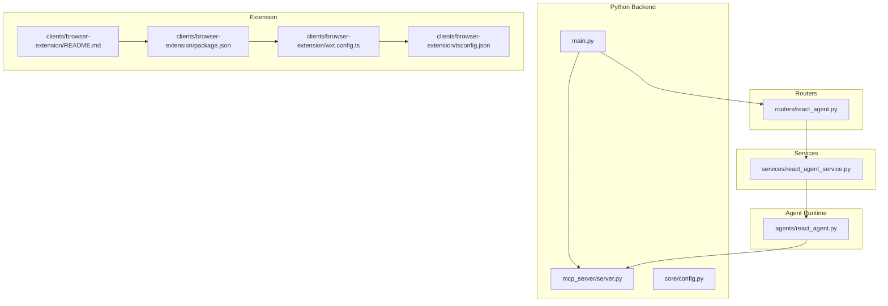
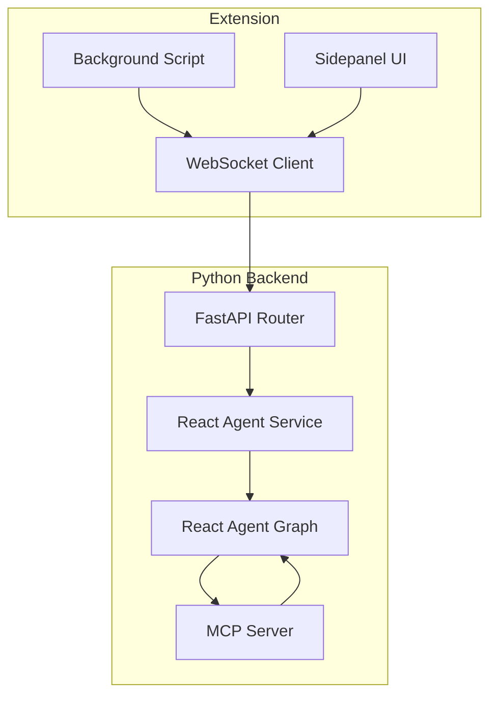
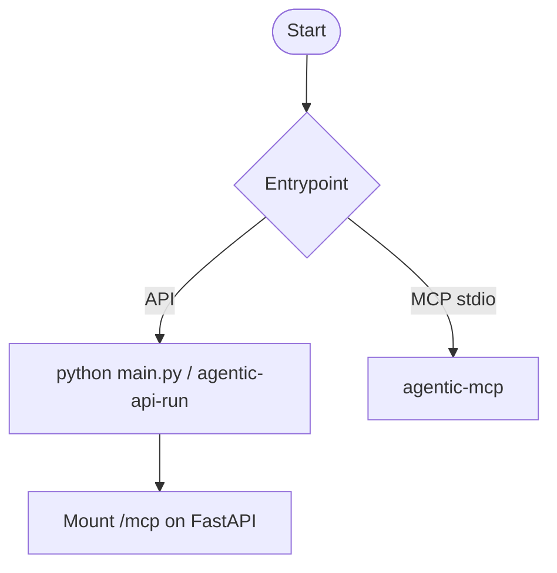
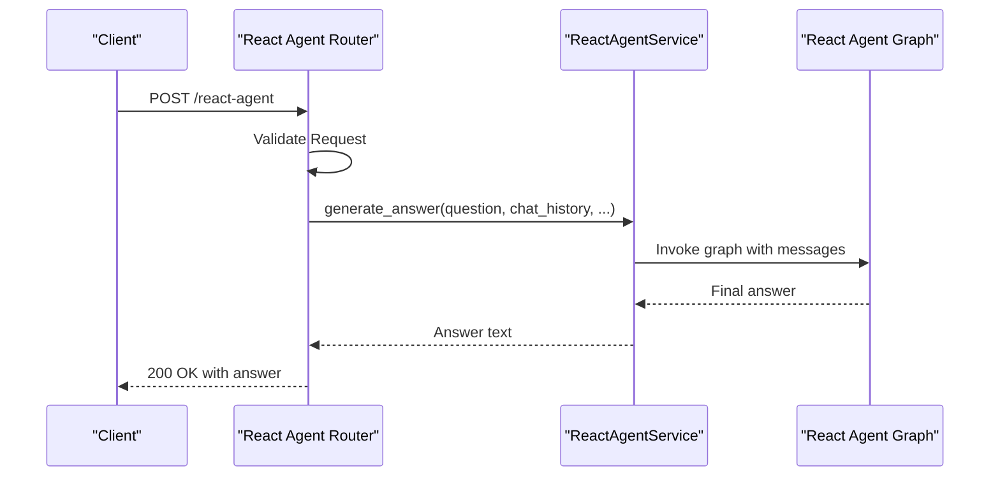
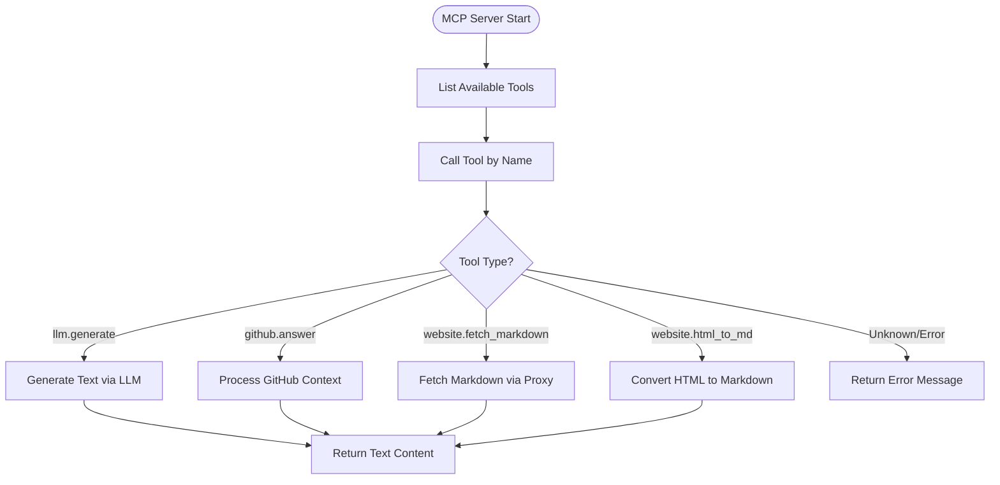
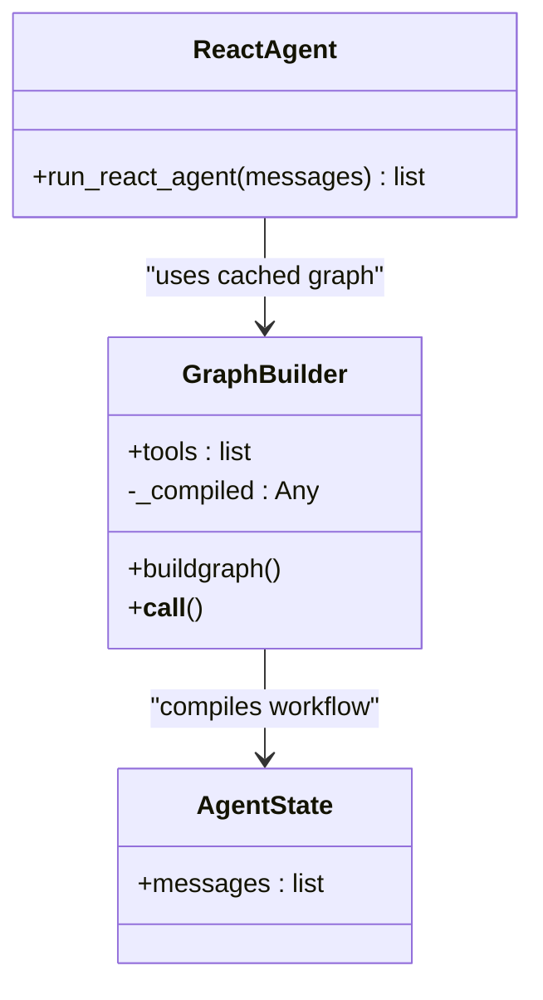
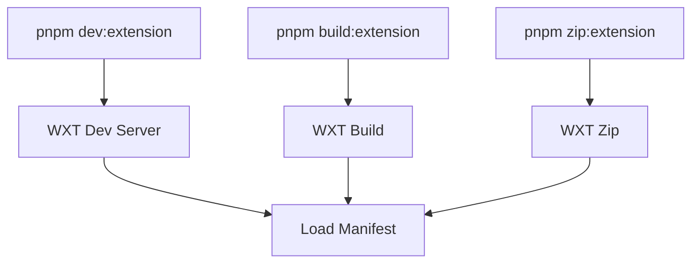
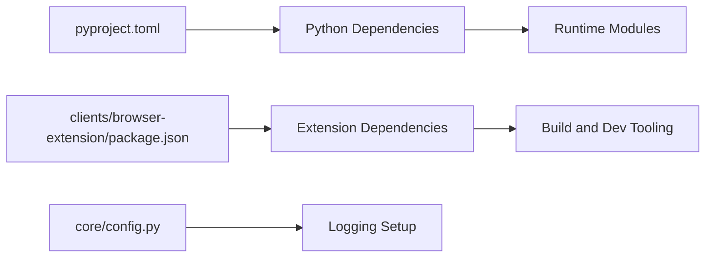

# Development guidelines

## Introduction
Standards for the Python backend, TypeScript clients, and how changes move from branch to review. Use this when you add a tool, a service, or touch shared schemas.

Source: [github.com/tashifkhan/agentic-browser](https://github.com/tashifkhan/agentic-browser)

## Project structure
Layout:
- Python backend: FastAPI in `main.py` and MCP in `mcp_server/` for model-agnostic agent orchestration
- Agent runtime: LangGraph-based React agent with tool integration (`agents/`)
- Services, routers, tools, skills
- Memory: sqlmodel/asyncpg, Neo4j, OpenSearch
- Models: Request/response DTOs for typed API interactions
- Prompts: Prompt templates and validators
- Clients: pnpm workspace under `clients/` (`browser-extension`, `debug-web`, `shared`)

```mermaid
graph TB
subgraph "Python Backend"
MAIN["main.py"]
MCP_SRV["mcp_server/server.py"]
CFG["core/config.py"]
end
subgraph "Agent Runtime"
REACT_AGENT["agents/react_agent.py"]
end
subgraph "Services"
REACT_SVC["services/react_agent_service.py"]
end
subgraph "Routers"
REACT_ROUTER["routers/react_agent.py"]
end
subgraph "Extension"
EXT_README["clients/browser-extension/README.md"]
PKG["clients/browser-extension/package.json"]
WXT["clients/browser-extension/wxt.config.ts"]
TSCONFIG["clients/browser-extension/tsconfig.json"]
end
MAIN --> MCP_SRV
MAIN --> REACT_ROUTER
REACT_ROUTER --> REACT_SVC
REACT_SVC --> REACT_AGENT
REACT_AGENT --> MCP_SRV
EXT_README --> PKG
PKG --> WXT
WXT --> TSCONFIG
```

## Core components
- Entry point: `main.py` starts FastAPI (Uvicorn) and mounts MCP at `/mcp`. Stdio MCP is `agentic-mcp`.
- API server: Uvicorn-based FastAPI app with reload capability for development.
- MCP server: Model Context Protocol server exposing tools for LLMs and website context conversion.
- Agent runtime: LangGraph-based React agent with tool binding and caching.
- Services: Orchestrate agent workflows, integrate external SDKs, and manage context.
- Extension: React sidepanel, background scripts, and utilities for agent execution and WebSocket communication.

## Architecture overview
Agentic Browser follows a model-agnostic architecture with a Python MCP server bridging LLM reasoning and browser automation. The React agent orchestrates multi-step workflows, while the extension provides a UI and WebSocket connectivity.

```mermaid
graph TB
subgraph "Extension"
BG["Background Script"]
SIDE["Sidepanel UI"]
WS["WebSocket Client"]
end
subgraph "Python Backend"
API["FastAPI Router"]
SVC["React Agent Service"]
AGENT["React Agent Graph"]
MCP["MCP Server"]
end
BG --> WS
SIDE --> WS
WS --> API
API --> SVC
SVC --> AGENT
AGENT --> MCP
MCP --> AGENT
```

## Detailed component analysis

### Python backend entry point
- FastAPI process: `python main.py` or `agentic-api-run`.
- Stdio MCP: `agentic-mcp` (`mcp_server.server:run`).
- Environment loading via dotenv for configuration.

```mermaid
flowchart TD
Start(["Start"]) --> Choose{"Entrypoint"}
Choose --> |API| RunAPI["python main.py / agentic-api-run"]
Choose --> |MCP stdio| RunMCP["agentic-mcp"]
RunAPI --> Mount["Mount /mcp on FastAPI"]
```

### API server and router
- Uvicorn runner with configurable host, port, and reload.
- Router validates inputs and delegates to service layer.
- Service handles agent execution and returns responses.

```mermaid
sequenceDiagram
participant Client as "Client"
participant Router as "React Agent Router"
participant Service as "ReactAgentService"
participant Agent as "React Agent Graph"
Client->>Router : POST /react-agent
Router->>Router : Validate Request
Router->>Service : generate_answer(question, chat_history, ...)
Service->>Agent : Invoke graph with messages
Agent-->>Service : Final answer
Service-->>Router : Answer text
Router-->>Client : 200 OK with answer
```

### MCP server and tools
- Exposes tools for LLM generation, GitHub Q&A, and website content conversion.
- Uses typed inputs and structured responses via MCP types.
- Error handling returns descriptive text responses.

```mermaid
flowchart TD
StartMCP(["MCP Server Start"]) --> ListTools["List Available Tools"]
ListTools --> CallTool["Call Tool by Name"]
CallTool --> Dispatch{"Tool Type?"}
Dispatch --> |llm.generate| GenText["Generate Text via LLM"]
Dispatch --> |github.answer| GHQnA["Process GitHub Context"]
Dispatch --> |website.fetch_markdown| FetchMD["Fetch Markdown via Proxy"]
Dispatch --> |website.html_to_md| HTMLtoMD["Convert HTML to Markdown"]
GenText --> Return["Return Text Content"]
GHQnA --> Return
FetchMD --> Return
HTMLtoMD --> Return
Dispatch --> |Unknown/Error| ErrorResp["Return Error Message"]
```

### React agent graph
- LangGraph workflow with agent node and tool execution node.
- Caching via LRU cache for compiled graph.
- Message normalization and conversion between payloads and LangChain messages.

```mermaid
classDiagram
class GraphBuilder {
+tools : list
-_compiled : Any
+buildgraph()
+__call__()
}
class AgentState {
+messages : list
}
class ReactAgent {
+run_react_agent(messages) list
}
GraphBuilder --> AgentState : "compiles workflow"
ReactAgent --> GraphBuilder : "uses cached graph"
```

### Extension configuration and build
- WXT configuration defines permissions and host permissions.
- Root pnpm scripts for dev, build, and zip targets.
- TypeScript configuration extends WXT's tsconfig with path aliases.

```mermaid
flowchart TD
Dev["pnpm dev:extension"] --> WXTDev["WXT Dev Server"]
Build["pnpm build:extension"] --> WXTBuild["WXT Build"]
Zip["pnpm zip:extension"] --> WXTZip["WXT Zip"]
WXTDev --> Manifest["Load Manifest"]
WXTBuild --> Manifest
WXTZip --> Manifest
```

## Dependency analysis
- Python dependencies declared in project metadata and scripts for CLI entry points.
- Extension dependencies include React, Radix UI, and WXT tooling, plus `@agentic-browser/shared`.
- Core configuration loads environment variables and sets logging levels.

```mermaid
graph LR
PYMETA["pyproject.toml"] --> DEPS["Python Dependencies"]
DEPS --> RUNTIME["Runtime Modules"]
PKGJSON["clients/browser-extension/package.json"] --> EXTDEPS["Extension Dependencies"]
EXTDEPS --> BUILD["Build and Dev Tooling"]
CFG["core/config.py"] --> LOGGING["Logging Setup"]
```

## Performance considerations
- Use LRU caching for compiled agent graphs to avoid repeated compilation overhead.
- Minimize synchronous I/O in hot paths; use async patterns in services and routers.
- Profile long-running tool invocations and external API calls; consider timeouts and retries.
- Monitor logging verbosity in production to reduce I/O overhead.
- Optimize HTML-to-markdown conversions and file uploads for large content.

## Troubleshooting guide
Common debugging techniques:
- Backend debugging
 - Enable debug logging via environment variables and inspect loggers.
 - Use Uvicorn reload during development for rapid iteration.
 - Validate tool inputs and return structured error messages from MCP server.
- Agent debugging
 - Inspect message payloads and tool calls; normalize content for consistent handling.
 - Verify graph compilation and caching behavior.
- Extension debugging
 - Use browser devtools to inspect background scripts, sidepanel, and WebSocket connections.
 - Validate permissions and host permissions in WXT manifest.
- API testing
 - Test routers with valid and invalid inputs; confirm HTTP status codes and error messages.
 - Mock external services for deterministic test runs.

## Development workflow
- Branching strategy
 - Use feature branches per feature or bug fix.
 - Keep branches up to date with upstream main.
- Commit message conventions
 - Use imperative mood; keep subject concise and add body for context and rationale.
- Pull request guidelines
 - Include clear description, linked issues, and acceptance criteria.
 - Ensure tests pass and code is reviewed by maintainers.

## Code standards and conventions

### Python backend
- Naming
 - Modules: snake_case; classes: PascalCase; functions: snake_case; constants: UPPER_CASE.
- Imports
 - Group standard library, third-party, and local imports; separate with blank lines.
- Typing
 - Use TypedDict for request/response payloads; annotate async functions and return types.
- Logging
 - Use module-scoped loggers; configure levels via environment variables.
- Error handling
 - Return structured error responses; catch and log exceptions in routers and services.

### TypeScript frontend
- Naming
 - Components: PascalCase; hooks: useXxx; utilities: camelCase.
- Imports
 - Prefer absolute paths via baseUrl and path mapping.
- React
 - Use functional components with hooks; keep state local where appropriate.
- Build and scripts
 - From repo root: `pnpm dev:extension`, `pnpm build:extension`, `pnpm --filter @agentic-browser/browser-extension compile`.

### Browser extension
- Permissions
 - Define required permissions in `clients/browser-extension/wxt.config.ts`; host permissions for all URLs.
- Sidepanel and background
 - Separate concerns: background for lifecycle and messaging; sidepanel for UI.
- WebSocket
 - Implement connection management and reconnection strategies.

## Testing requirements
- Unit tests
 - Test individual functions, services, and tool logic with pytest.
 - Mock external dependencies to isolate units.
- Integration tests
 - Validate router-service-agent pipeline with realistic inputs.
 - Test MCP tool invocation with various inputs and error conditions.
- Frontend tests
 - Use React testing libraries for component and hook tests.
 - Validate WebSocket client behavior and sidepanel interactions.

## Documentation standards
- Inline documentation
 - Document public functions, classes, and modules with purpose, parameters, and return values.
- API documentation
 - Maintain OpenAPI/Swagger-compatible routers and models.
- README updates
 - Update feature descriptions and contribution steps as needed.

## Release procedures
- Versioning
 - Increment version in project metadata and package manifests.
- Packaging
 - Build Python wheel and distribution artifacts; package extension builds with `pnpm zip:extension`.
- Validation
 - Smoke-test API and extension in development environments.
- Distribution
 - Publish to package registries and extension stores following their guidelines.

## Conclusion
Match the existing layout, keep types honest, and prove new tools with a small test. Security review matters more than clever abstractions here.
