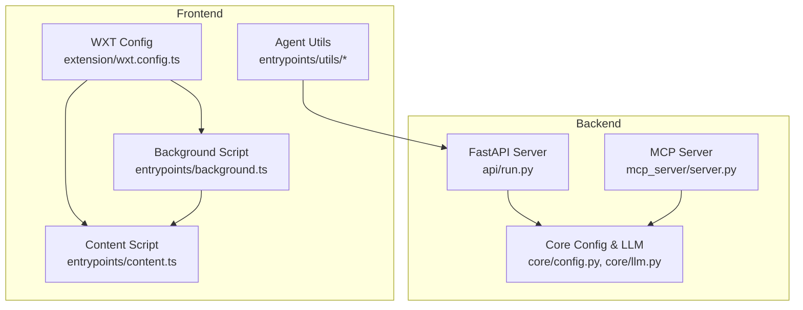
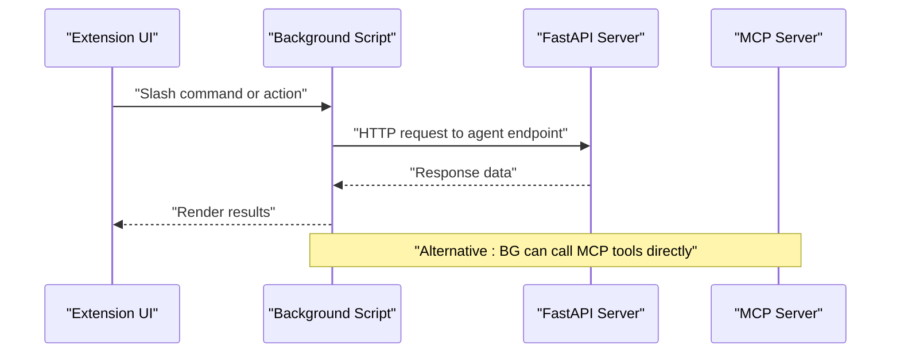
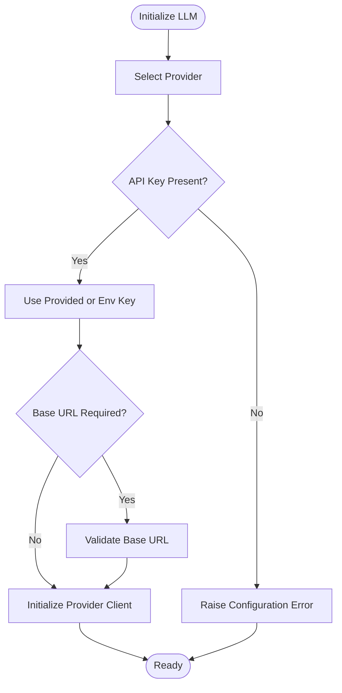
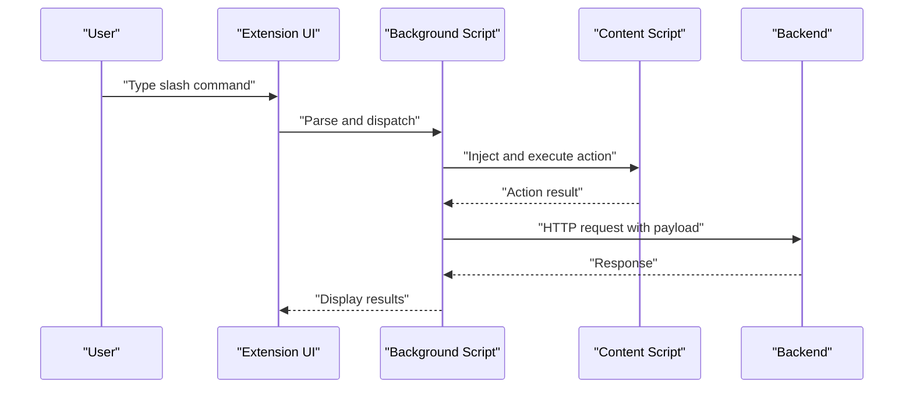
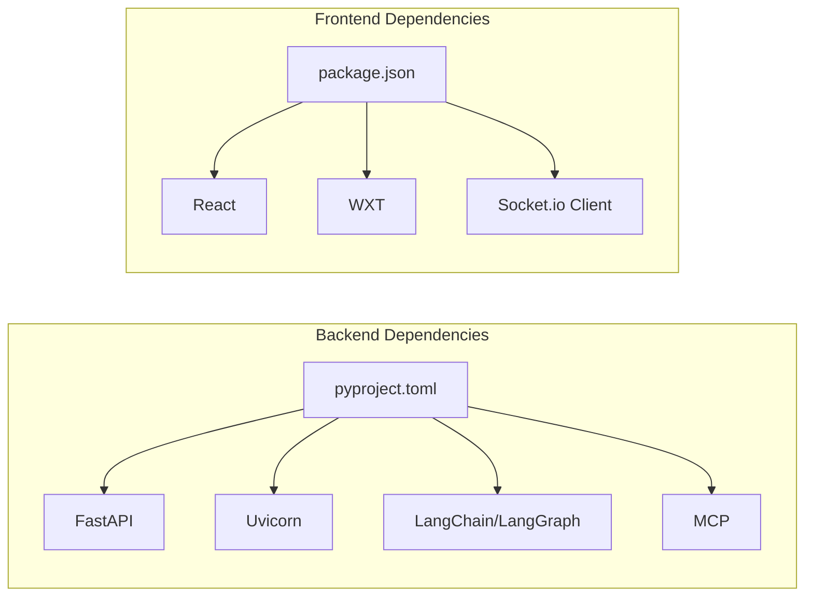

# Getting Started

<cite>
**Referenced Files in This Document**
- [README.md](file://README.md)
- [main.py](file://main.py)
- [pyproject.toml](file://pyproject.toml)
- [api/run.py](file://api/run.py)
- [mcp_server/server.py](file://mcp_server/server.py)
- [core/config.py](file://core/config.py)
- [core/llm.py](file://core/llm.py)
- [extension/package.json](file://extension/package.json)
- [extension/wxt.config.ts](file://extension/wxt.config.ts)
- [extension/entrypoints/background.ts](file://extension/entrypoints/background.ts)
- [extension/entrypoints/content.ts](file://extension/entrypoints/content.ts)
- [extension/entrypoints/utils/executeAgent.ts](file://extension/entrypoints/utils/executeAgent.ts)
- [extension/entrypoints/utils/parseAgentCommand.ts](file://extension/entrypoints/utils/parseAgentCommand.ts)
- [extension/entrypoints/sidepanel/components/ApiKeySection.tsx](file://extension/entrypoints/sidepanel/components/ApiKeySection.tsx)
</cite>

## Table of Contents
1. [Introduction](#introduction)
2. [Project Structure](#project-structure)
3. [Prerequisites](#prerequisites)
4. [Installation](#installation)
5. [Initial Setup](#initial-setup)
6. [Quick Start](#quick-start)
7. [Architecture Overview](#architecture-overview)
8. [Detailed Component Analysis](#detailed-component-analysis)
9. [Dependency Analysis](#dependency-analysis)
10. [Performance Considerations](#performance-considerations)
11. [Troubleshooting Guide](#troubleshooting-guide)
12. [Conclusion](#conclusion)
13. [Appendices](#appendices)

## Introduction
Agentic Browser is a next-generation browser extension powered by a Python MCP (Model Context Protocol) server. It enables an intelligent agent to understand and act on web content, supporting multiple LLM providers and offering a secure, declarative action system for browser automation.

Key goals:
- Model-agnostic agent backend using Python, LangChain, and MCP
- Secure browser extension using WebExtensions API
- Advanced agent workflows with retrieval-augmented generation and multi-step tasks
- Strong guardrails and transparency layers
- Open-source extensibility

**Section sources**
- [README.md](file://README.md#L1-L185)

## Project Structure
The repository is organized into backend and frontend components:
- Backend (Python): FastAPI server and MCP server
- Frontend (TypeScript/React): Browser extension built with WXT
- Shared tools and services for specialized workflows



**Diagram sources**
- [api/run.py](file://api/run.py#L1-L15)
- [mcp_server/server.py](file://mcp_server/server.py#L1-L139)
- [core/config.py](file://core/config.py#L1-L26)
- [core/llm.py](file://core/llm.py#L1-L215)
- [extension/wxt.config.ts](file://extension/wxt.config.ts#L1-L29)
- [extension/entrypoints/background.ts](file://extension/entrypoints/background.ts#L1-L1642)
- [extension/entrypoints/content.ts](file://extension/entrypoints/content.ts#L1-L326)
- [extension/entrypoints/utils/executeAgent.ts](file://extension/entrypoints/utils/executeAgent.ts#L1-L299)

**Section sources**
- [README.md](file://README.md#L174-L185)
- [pyproject.toml](file://pyproject.toml#L1-L34)
- [extension/package.json](file://extension/package.json#L1-L40)

## Prerequisites
Before installing Agentic Browser, ensure your environment meets the following requirements:

- Python
  - Version requirement: Python >= 3.12
  - Package manager: uv (recommended) or pip
  - Virtual environment recommended

- Node.js and Package Manager
  - Node.js version: managed by the project’s package manager configuration
  - Package manager: pnpm (recommended) or npm
  - TypeScript support included in the frontend configuration

- Browser Extension Development
  - Chromium-based browsers (Chrome, Edge, Brave) or Firefox for development
  - Permissions and manifest configuration defined in the extension manifest
  - WebExtensions API support for background scripts, content scripts, and side panel

- LLM Provider Keys (optional for initial setup)
  - Supported providers include Google, OpenAI, Anthropic, Ollama, DeepSeek, OpenRouter
  - API keys or base URLs configured via environment variables or UI

**Section sources**
- [pyproject.toml](file://pyproject.toml#L6-L6)
- [extension/package.json](file://extension/package.json#L1-L40)
- [extension/wxt.config.ts](file://extension/wxt.config.ts#L1-L29)
- [core/llm.py](file://core/llm.py#L21-L75)

## Installation
Follow these step-by-step instructions to install both backend and frontend components.

### Backend (Python)
1. Clone the repository and navigate to the project root.
2. Create and activate a Python virtual environment (recommended).
3. Install dependencies using uv:
   - Run: uv pip install -e .
4. Verify installation by checking installed packages from pyproject.toml.

Notes:
- The project uses uv for dependency resolution and installation.
- The FastAPI server and MCP server are both supported via the main entry point.

**Section sources**
- [pyproject.toml](file://pyproject.toml#L1-L34)
- [main.py](file://main.py#L1-L58)

### Frontend (Extension)
1. Navigate to the extension directory.
2. Install dependencies using pnpm:
   - Run: pnpm install
3. Build or develop the extension:
   - Development: pnpm dev
   - Production build: pnpm build
   - Firefox builds: pnpm dev:firefox or pnpm build:firefox

Manifest and permissions:
- The extension manifest defines permissions for tabs, storage, scripting, identity, side panel, web navigation, web request, cookies, bookmarks, history, clipboard, notifications, context menus, and downloads.
- Host permissions include <all_urls>.

**Section sources**
- [extension/package.json](file://extension/package.json#L1-L40)
- [extension/wxt.config.ts](file://extension/wxt.config.ts#L1-L29)

## Initial Setup
Configure environment variables and basic settings before launching the servers.

### Environment Configuration
- Backend host and port defaults are configurable via environment variables.
- Debug logging level is controlled by environment variables.

Key variables:
- BACKEND_HOST: Server host binding (default: 0.0.0.0)
- BACKEND_PORT: Server port (default: 5454)
- DEBUG: Enable debug logging (default depends on environment)
- GOOGLE_API_KEY: Google provider API key (required for Google provider)
- OPENAI_API_KEY, ANTHROPIC_API_KEY, OLLAMA_BASE_URL, DEEPSEEK_API_KEY, OPENROUTER_API_KEY: Additional provider keys and base URLs

Note: The backend loads environment variables from a .env file automatically.

**Section sources**
- [core/config.py](file://core/config.py#L1-L26)
- [core/llm.py](file://core/llm.py#L21-L75)

### API Key Setup for LLM Providers
- For Google provider, set GOOGLE_API_KEY.
- For OpenAI, Anthropic, DeepSeek, and OpenRouter, set the respective API keys.
- For Ollama, configure OLLAMA_BASE_URL if using a custom endpoint.
- Keys can be provided directly to the LLM client or via environment variables.

UI-based key management:
- The extension includes a UI component for saving API keys locally in the extension storage.

**Section sources**
- [core/llm.py](file://core/llm.py#L121-L155)
- [extension/entrypoints/sidepanel/components/ApiKeySection.tsx](file://extension/entrypoints/sidepanel/components/ApiKeySection.tsx#L1-L25)

### Basic Configuration Options
- Backend host/port: Controlled by environment variables.
- Debug logging: Controlled by environment variables.
- Provider selection and model defaults are defined in the LLM configuration.

**Section sources**
- [core/config.py](file://core/config.py#L8-L18)
- [core/llm.py](file://core/llm.py#L21-L75)

## Quick Start
Launch the MCP server, install the browser extension, and perform basic browser automation tasks.

### Launch the MCP Server
1. From the project root, run the main entry point with the MCP flag:
   - Command: python main.py --mcp
2. Alternatively, use the script alias defined in pyproject.toml:
   - Command: agentic-mcp

Verification:
- The MCP server initializes and exposes tools for LLM generation, GitHub Q&A, and website content conversion.

**Section sources**
- [main.py](file://main.py#L11-L54)
- [mcp_server/server.py](file://mcp_server/server.py#L1-L139)
- [pyproject.toml](file://pyproject.toml#L31-L34)

### Install the Browser Extension
1. Build the extension:
   - Development: pnpm dev
   - Production: pnpm build
2. Load the unpacked extension in your browser:
   - Chrome/Edge: Load unpacked from the extension build output directory
   - Firefox: Use the appropriate developer loading mechanism

Permissions:
- The extension requests broad permissions for tabs, storage, scripting, identity, side panel, web navigation, web request, cookies, bookmarks, history, clipboard, notifications, context menus, and downloads.

**Section sources**
- [extension/package.json](file://extension/package.json#L7-L16)
- [extension/wxt.config.ts](file://extension/wxt.config.ts#L8-L27)

### Perform Basic Browser Automation Tasks
- Use slash commands in the extension UI to trigger agent workflows.
- Example slash commands include:
  - /browser-action: Execute browser automation tasks (navigate, click, type, scroll)
  - /react-ask: Chat with the React ReAct agent
  - /google-search: Perform a quick web search
  - /gmail-unread: Check unread emails
  - /calendar-events: View upcoming schedule
  - /youtube-ask: Q&A with YouTube videos

Execution flow:
- The extension parses slash commands and routes them to the backend via HTTP requests.
- The background script handles messaging and action execution, including tab/window control and DOM manipulation.

**Section sources**
- [README.md](file://README.md#L161-L171)
- [extension/entrypoints/utils/parseAgentCommand.ts](file://extension/entrypoints/utils/parseAgentCommand.ts#L1-L86)
- [extension/entrypoints/utils/executeAgent.ts](file://extension/entrypoints/utils/executeAgent.ts#L1-L299)
- [extension/entrypoints/background.ts](file://extension/entrypoints/background.ts#L428-L514)

## Architecture Overview
Agentic Browser integrates a Python MCP server with a React-based browser extension. The extension communicates with the backend to execute agent workflows and browser actions.

```mermaid
graph TB
subgraph "Browser Extension"
BG["Background Script<br/>entrypoints/background.ts"]
CT["Content Script<br/>entrypoints/content.ts"]
UI["Side Panel & UI"]
end
subgraph "Backend"
MCP["MCP Server<br/>mcp_server/server.py"]
API["FastAPI Server<br/>api/run.py"]
CFG["Config & LLM<br/>core/config.py, core/llm.py"]
end
UI --> BG
BG <- --> API
BG <- --> MCP
MCP --> CFG
API --> CFG
CT --> BG
```

**Diagram sources**
- [mcp_server/server.py](file://mcp_server/server.py#L1-L139)
- [api/run.py](file://api/run.py#L1-L15)
- [core/config.py](file://core/config.py#L1-L26)
- [core/llm.py](file://core/llm.py#L1-L215)
- [extension/entrypoints/background.ts](file://extension/entrypoints/background.ts#L1-L1642)
- [extension/entrypoints/content.ts](file://extension/entrypoints/content.ts#L1-L326)

## Detailed Component Analysis

### Backend Servers
- FastAPI Server
  - Starts the API server with configurable host and port.
  - Provides endpoints for agent workflows and tools.
- MCP Server
  - Exposes tools for LLM generation, GitHub Q&A, and website content conversion.
  - Supports multiple providers with dynamic configuration.



**Diagram sources**
- [api/run.py](file://api/run.py#L1-L15)
- [mcp_server/server.py](file://mcp_server/server.py#L83-L124)
- [extension/entrypoints/background.ts](file://extension/entrypoints/background.ts#L428-L514)

**Section sources**
- [api/run.py](file://api/run.py#L1-L15)
- [mcp_server/server.py](file://mcp_server/server.py#L1-L139)

### LLM Configuration and Provider Support
- Provider configurations define default models, API key environment variables, and base URLs.
- The LLM client validates keys and base URLs and raises descriptive errors if missing.



**Diagram sources**
- [core/llm.py](file://core/llm.py#L21-L170)

**Section sources**
- [core/llm.py](file://core/llm.py#L21-L170)

### Extension Components
- Background Script
  - Handles messaging, tab/window control, and action execution.
  - Injects content scripts and performs DOM manipulation.
- Content Script
  - Provides lightweight page interaction helpers.
- Agent Utilities
  - Parse slash commands and route to backend endpoints.
  - Capture page context and construct payloads for agent workflows.



**Diagram sources**
- [extension/entrypoints/utils/parseAgentCommand.ts](file://extension/entrypoints/utils/parseAgentCommand.ts#L1-L86)
- [extension/entrypoints/utils/executeAgent.ts](file://extension/entrypoints/utils/executeAgent.ts#L1-L299)
- [extension/entrypoints/background.ts](file://extension/entrypoints/background.ts#L428-L514)
- [extension/entrypoints/content.ts](file://extension/entrypoints/content.ts#L1-L326)

**Section sources**
- [extension/entrypoints/background.ts](file://extension/entrypoints/background.ts#L1-L1642)
- [extension/entrypoints/content.ts](file://extension/entrypoints/content.ts#L1-L326)
- [extension/entrypoints/utils/executeAgent.ts](file://extension/entrypoints/utils/executeAgent.ts#L1-L299)
- [extension/entrypoints/utils/parseAgentCommand.ts](file://extension/entrypoints/utils/parseAgentCommand.ts#L1-L86)

## Dependency Analysis
- Backend dependencies are declared in pyproject.toml and include FastAPI, Uvicorn, LangChain, LangGraph, MCP, and others.
- Frontend dependencies are declared in extension/package.json and include React, WXT, socket.io-client, and UI libraries.



**Diagram sources**
- [pyproject.toml](file://pyproject.toml#L7-L29)
- [extension/package.json](file://extension/package.json#L17-L39)

**Section sources**
- [pyproject.toml](file://pyproject.toml#L1-L34)
- [extension/package.json](file://extension/package.json#L1-L40)

## Performance Considerations
- Use uv for faster dependency resolution and installation compared to pip.
- Prefer production builds for the extension to minimize bundle size.
- Minimize repeated DOM queries and injections; batch actions when possible.
- Configure logging appropriately (DEBUG vs INFO) to reduce overhead during production runs.

[No sources needed since this section provides general guidance]

## Troubleshooting Guide
Common setup and runtime issues:

- Missing Python version
  - Ensure Python >= 3.12 is installed and selected in your environment.

- Missing Node.js or pnpm
  - Install Node.js and pnpm; rebuild the extension after installation.

- Backend server startup
  - Use the main entry point with the MCP flag to start the MCP server.
  - Verify host and port settings via environment variables.

- LLM provider configuration errors
  - Ensure required API keys or base URLs are set for the chosen provider.
  - Check for typos in environment variable names.

- Extension not loading
  - Confirm permissions in the manifest and load the extension as unpacked.
  - Check browser developer tools for errors.

- Action execution failures
  - Verify that the active tab is reachable and not blocked by CORS or privacy restrictions.
  - Review background script logs for detailed error messages.

**Section sources**
- [main.py](file://main.py#L11-L54)
- [core/llm.py](file://core/llm.py#L121-L155)
- [extension/wxt.config.ts](file://extension/wxt.config.ts#L8-L27)
- [extension/entrypoints/background.ts](file://extension/entrypoints/background.ts#L428-L514)

## Conclusion
Agentic Browser combines a powerful Python MCP server with a modern React-based browser extension to deliver model-agnostic, secure, and extensible web automation. By following the prerequisites, installation steps, and initial setup guide, you can quickly launch the backend servers, install the extension, and start performing automated browser tasks using slash commands.

[No sources needed since this section summarizes without analyzing specific files]

## Appendices

### Appendix A: Environment Variables Reference
- BACKEND_HOST: Backend host binding (default: 0.0.0.0)
- BACKEND_PORT: Backend port (default: 5454)
- DEBUG: Enable debug logging
- GOOGLE_API_KEY: Google provider API key
- OPENAI_API_KEY: OpenAI provider API key
- ANTHROPIC_API_KEY: Anthropic provider API key
- OLLAMA_BASE_URL: Ollama base URL
- DEEPSEEK_API_KEY: DeepSeek provider API key
- OPENROUTER_API_KEY: OpenRouter provider API key

**Section sources**
- [core/config.py](file://core/config.py#L8-L18)
- [core/llm.py](file://core/llm.py#L21-L75)

### Appendix B: Example Slash Commands
- /browser-action: Execute browser automation tasks (navigate, click, type, scroll)
- /react-ask: Chat with the React ReAct agent
- /google-search: Perform a quick web search
- /gmail-unread: Check unread emails
- /calendar-events: View upcoming schedule
- /youtube-ask: Q&A with YouTube videos

**Section sources**
- [README.md](file://README.md#L161-L171)