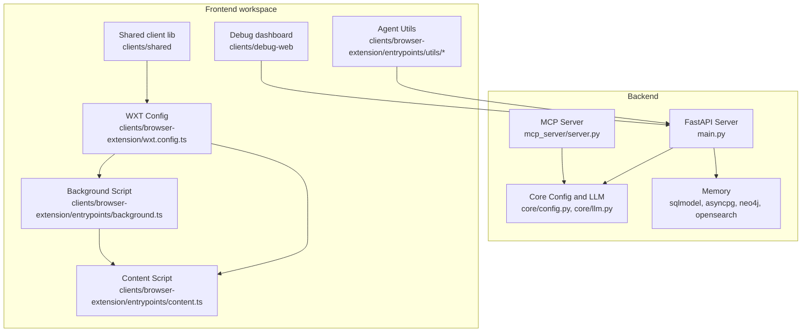
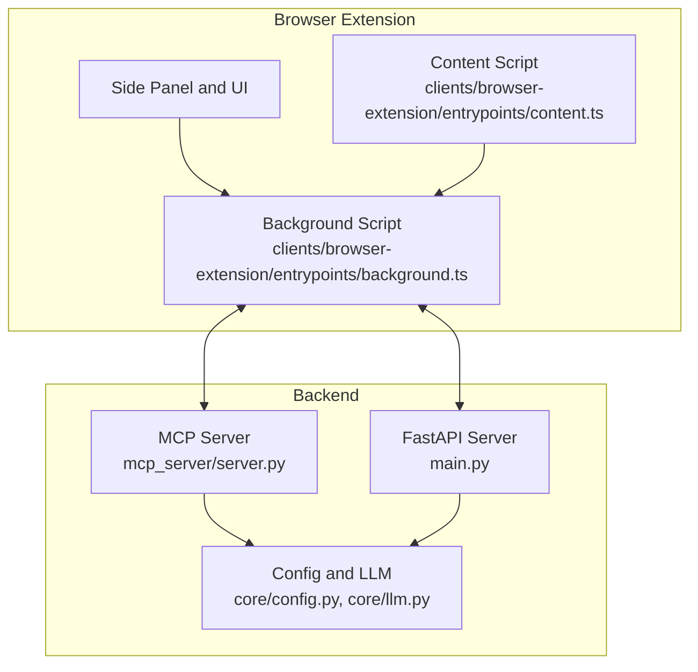
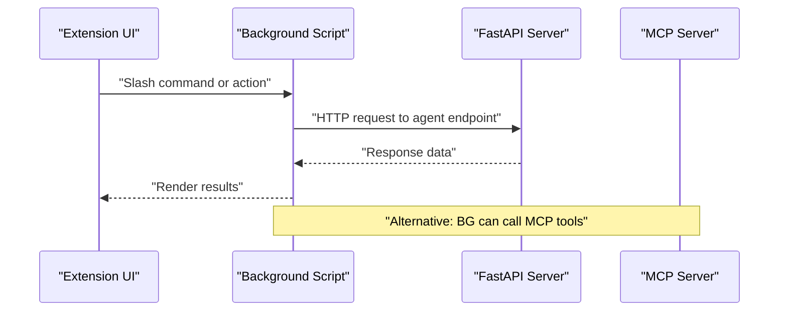
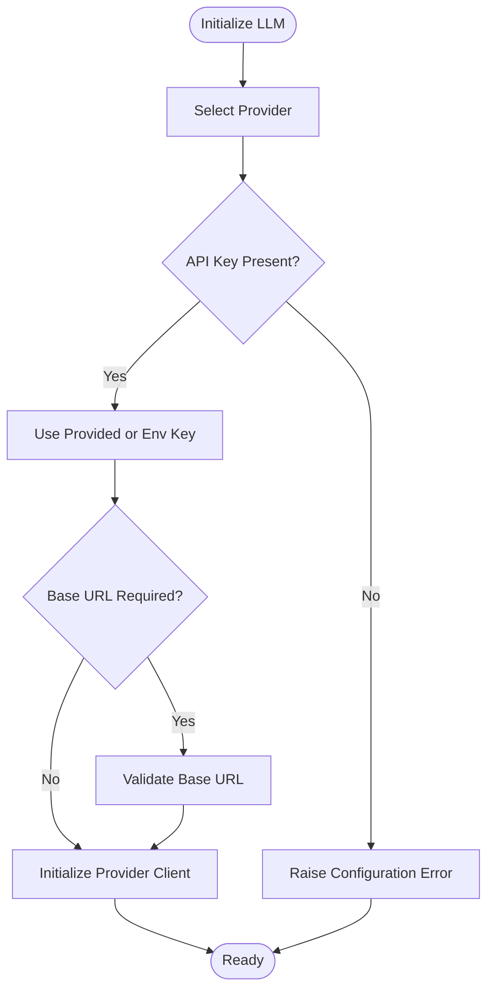
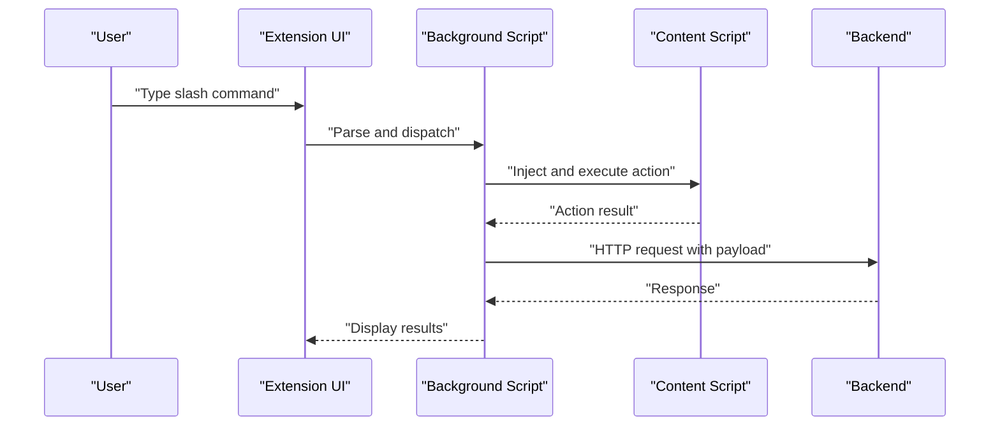
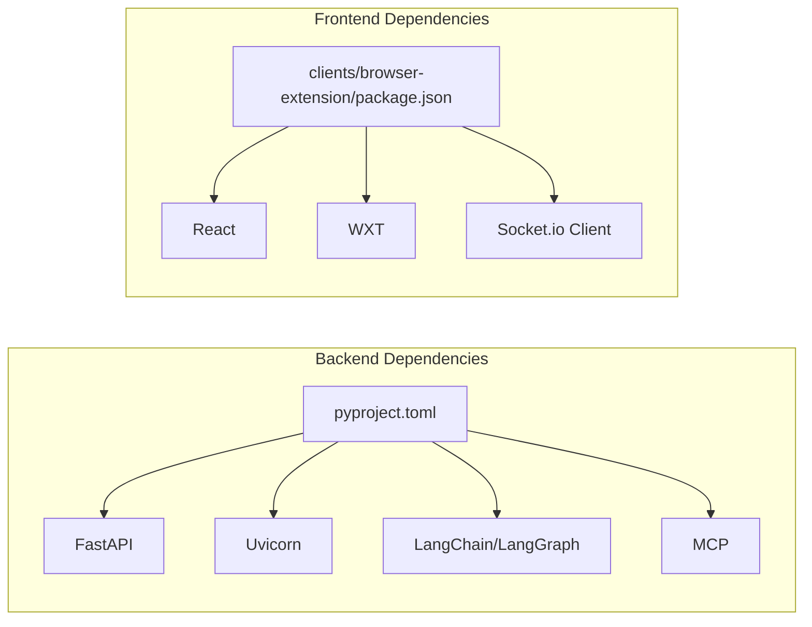

# Getting started

## Introduction
Agentic Browser pairs a Python FastAPI and MCP backend with a WXT/React extension. Point it at an LLM provider, load the extension, and you can ask for page actions that run through a declarative, reviewed plan.

Source: [github.com/tashifkhan/agentic-browser](https://github.com/tashifkhan/agentic-browser)

## Project structure
The repo is a monorepo:
- Backend (Python >=3.12): FastAPI app in `main.py`, MCP in `mcp_server/`, agents, routers, tools, services, skills, and memory (sqlmodel/asyncpg, Neo4j, OpenSearch)
- Frontend workspace (pnpm): `clients/browser-extension` (WXT), `clients/debug-web` (Vite dashboard), `clients/shared`


```mermaid
graph TB
subgraph "Backend"
A["FastAPI Server<br/>main.py"]
B["MCP Server<br/>mcp_server/server.py"]
C["Core Config and LLM<br/>core/config.py, core/llm.py"]
MEM["Memory<br/>sqlmodel, asyncpg, neo4j, opensearch"]
end
subgraph "Frontend workspace"
D["WXT Config<br/>clients/browser-extension/wxt.config.ts"]
E["Background Script<br/>clients/browser-extension/entrypoints/background.ts"]
F["Content Script<br/>clients/browser-extension/entrypoints/content.ts"]
G["Agent Utils<br/>clients/browser-extension/entrypoints/utils/*"]
DBG["Debug dashboard<br/>clients/debug-web"]
SHR["Shared client lib<br/>clients/shared"]
end
A --> C
B --> C
A --> MEM
D --> E
D --> F
E --> F
G --> A
DBG --> A
SHR --> D
```

## Prerequisites
Before installing Agentic Browser, ensure your environment meets the following requirements:

- Python
 - Version requirement: Python >= 3.12
 - Package manager: uv (recommended) or pip
 - Virtual environment recommended

- Node.js and pnpm
 - Workspace `packageManager` is `pnpm@9.0.0` in the root `package.json`
 - TypeScript is configured in the client packages

- Browser extension development
 - Chromium-based browsers (Chrome, Edge, Brave) or Firefox
 - Permissions and manifest live in `clients/browser-extension/wxt.config.ts`
 - WebExtensions API support for background scripts, content scripts, and side panel

- LLM provider keys (optional for initial setup)
 - Supported providers include Google, OpenAI, Anthropic, Ollama, DeepSeek, OpenRouter
 - API keys or base URLs configured via environment variables or UI

## Installation
Install the backend and the pnpm workspace.

### Backend (Python)
1. Clone the repository and stay at the project root.
2. Create and activate a Python virtual environment (recommended).
3. Install dependencies using uv:
 - Run: `uv pip install -e .`
4. Verify packages from `pyproject.toml`.

Notes:
- The project uses uv for dependency resolution (`uv.lock`).
- FastAPI and MCP share the same Python package. CLI aliases in `pyproject.toml` are `agentic-api-run` (`main:run`) and `agentic-mcp` (`mcp_server.server:run`).

### Frontend (pnpm workspace)
From the repository root:

```bash
pnpm install
pnpm dev:extension
pnpm build:extension
pnpm dev:debug
```

Those scripts filter the workspace packages:

```bash
pnpm --filter @agentic-browser/browser-extension dev
pnpm --filter @agentic-browser/browser-extension build
pnpm --filter @agentic-browser/browser-extension dev:firefox
pnpm --filter @agentic-browser/debug-web dev
```

You can also run the same scripts inside `clients/browser-extension/` after a root `pnpm install`. Do not `cd extension`; that directory is gone.

Manifest and permissions:
- The extension manifest defines permissions for tabs, storage, scripting, identity, side panel, web navigation, web request, cookies, bookmarks, history, clipboard, notifications, context menus, and downloads.
- Host permissions include `<all_urls>`.

## Initial setup
Configure environment variables and basic settings before launching the servers.

### Environment configuration
- Backend host and port defaults are configurable via environment variables.
- Debug logging level is controlled by environment variables.

Key variables:
- BACKEND_HOST: Server host binding (default: 0.0.0.0)
- BACKEND_PORT: Server port (default: 5454)
- DEBUG: Enable debug logging (default depends on environment)
- GOOGLE_API_KEY: Google provider API key (required for Google provider)
- OPENAI_API_KEY, ANTHROPIC_API_KEY, OLLAMA_BASE_URL, DEEPSEEK_API_KEY, OPENROUTER_API_KEY: Additional provider keys and base URLs

Note: The backend loads environment variables from a `.env` file automatically.

### API key setup for LLM providers
- For Google provider, set GOOGLE_API_KEY.
- For OpenAI, Anthropic, DeepSeek, and OpenRouter, set the respective API keys.
- For Ollama, configure OLLAMA_BASE_URL if using a custom endpoint.
- Keys can be provided directly to the LLM client or via environment variables.

UI-based key management:
- The extension includes a UI component for saving API keys locally in extension storage.

### Basic configuration options
- Backend host/port: Controlled by environment variables.
- Debug logging: Controlled by environment variables.
- Provider selection and model defaults are defined in the LLM configuration.

## Quick start
Launch the API (and optional MCP stdio server), install the browser extension, and try a slash command.

### Launch the API and MCP
1. From the project root, start FastAPI (Uvicorn on port 5454 by default):
 - Command: `python main.py`
 - Alias: `agentic-api-run`
2. MCP is mounted on the same app at `/mcp`. For stdio MCP, use the script alias:
 - Command: `agentic-mcp`

Verification:
- The FastAPI app serves health and agent routes under `/api/*`.
- The MCP server exposes tools for LLM generation, GitHub Q&A, and website content conversion.

### Install the browser extension
1. From the repo root, build or develop the extension:
 - Development: `pnpm dev:extension`
 - Production: `pnpm build:extension`
 - Firefox: `pnpm dev:extension:firefox` or `pnpm build:extension:firefox`
2. Load the unpacked extension in your browser:
 - Chrome/Edge: Load unpacked from `clients/browser-extension/.output/`
 - Firefox: Use the Firefox developer loading path for the Firefox build output

Permissions:
- The extension requests broad permissions for tabs, storage, scripting, identity, side panel, web navigation, web request, cookies, bookmarks, history, clipboard, notifications, context menus, and downloads.

### Perform basic browser automation tasks
- Use slash commands in the extension UI to trigger agent workflows.
- Example slash commands include:
 - /browser-action: Execute browser automation tasks (navigate, click, type, scroll)
 - /react-ask: Chat with the React ReAct agent
 - /google-search: Perform a quick web search
 - /gmail-unread: Check unread emails
 - /calendar-events: View upcoming schedule
 - /youtube-ask: Q&A with YouTube videos

Execution flow:
- The extension parses slash commands and routes them to the backend via HTTP requests.
- The background script handles messaging and action execution, including tab/window control and DOM manipulation.

## Architecture overview
Agentic Browser integrates a Python FastAPI/MCP backend with a React-based browser extension. The extension talks HTTP and WebSocket to the API. MCP is available over stdio or at `/mcp` on the FastAPI process.


```mermaid
graph TB
subgraph "Browser Extension"
BG["Background Script<br/>clients/browser-extension/entrypoints/background.ts"]
CT["Content Script<br/>clients/browser-extension/entrypoints/content.ts"]
UI["Side Panel and UI"]
end
subgraph "Backend"
MCP["MCP Server<br/>mcp_server/server.py"]
API["FastAPI Server<br/>main.py"]
CFG["Config and LLM<br/>core/config.py, core/llm.py"]
end
UI --> BG
BG <--> API
BG <--> MCP
MCP --> CFG
API --> CFG
CT --> BG
```

## Detailed component analysis

### Backend servers
- FastAPI Server
 - Starts with configurable host and port from `main.py` (`run()` uses Uvicorn).
 - Provides endpoints for agent workflows, memory, skills, and tools.
- MCP Server
 - Exposes tools for LLM generation, GitHub Q&A, and website content conversion.
 - Supports multiple providers with dynamic configuration.


```mermaid
sequenceDiagram
participant Client as "Extension UI"
participant BG as "Background Script"
participant API as "FastAPI Server"
participant MCP as "MCP Server"
Client->>BG : "Slash command or action"
BG->>API : "HTTP request to agent endpoint"
API-->>BG : "Response data"
BG-->>Client : "Render results"
Note over BG,MCP : "Alternative: BG can call MCP tools"
```

### LLM configuration and provider support
- Provider configurations define default models, API key environment variables, and base URLs.
- The LLM client validates keys and base URLs and raises descriptive errors if missing.


```mermaid
flowchart TD
Start(["Initialize LLM"]) --> CheckProvider["Select Provider"]
CheckProvider --> ValidateKey{"API Key Present?"}
ValidateKey --> |Yes| UseKey["Use Provided or Env Key"]
ValidateKey --> |No| RaiseError["Raise Configuration Error"]
UseKey --> CheckBaseUrl{"Base URL Required?"}
CheckBaseUrl --> |Yes| ValidateBaseUrl["Validate Base URL"]
CheckBaseUrl --> |No| InitClient["Initialize Provider Client"]
ValidateBaseUrl --> InitClient
InitClient --> Done(["Ready"])
RaiseError --> Done
```

### Extension components
- Background Script
 - Handles messaging, tab/window control, and action execution.
 - Injects content scripts and performs DOM manipulation.
- Content Script
 - Provides lightweight page interaction helpers.
- Agent Utilities
 - Parse slash commands and route to backend endpoints.
 - Capture page context and construct payloads for agent workflows.


```mermaid
sequenceDiagram
participant User as "User"
participant UI as "Extension UI"
participant BG as "Background Script"
participant CT as "Content Script"
participant API as "Backend"
User->>UI : "Type slash command"
UI->>BG : "Parse and dispatch"
BG->>CT : "Inject and execute action"
CT-->>BG : "Action result"
BG->>API : "HTTP request with payload"
API-->>BG : "Response"
BG-->>UI : "Display results"
```

## Dependency analysis
- Backend dependencies are declared in `pyproject.toml` and include FastAPI, Uvicorn, LangChain, LangGraph, MCP, sqlmodel, asyncpg, neo4j, and opensearch-py.
- Frontend dependencies are declared in `clients/browser-extension/package.json` and include React, WXT, socket.io-client, and `@agentic-browser/shared`.


```mermaid
graph LR
subgraph "Backend Dependencies"
P["pyproject.toml"]
F["FastAPI"]
U["Uvicorn"]
L["LangChain/LangGraph"]
M["MCP"]
end
subgraph "Frontend Dependencies"
N["clients/browser-extension/package.json"]
R["React"]
W["WXT"]
S["Socket.io Client"]
end
P --> F
P --> U
P --> L
P --> M
N --> R
N --> W
N --> S
```

## Performance considerations
- Use uv for faster dependency resolution and installation compared to pip.
- Prefer production builds for the extension to minimize bundle size.
- Minimize repeated DOM queries and injections; batch actions when possible.
- Configure logging appropriately (DEBUG vs INFO) to reduce overhead during production runs.

## Troubleshooting guide
Common setup and runtime issues:

- Missing Python version
 - Ensure Python >= 3.12 is installed and selected in your environment.

- Missing Node.js or pnpm
 - Install Node.js and pnpm 9; run `pnpm install` at the repo root.

- Backend server startup
 - Use `python main.py` or `agentic-api-run` for the API.
 - Use `agentic-mcp` for stdio MCP.
 - Verify host and port settings via environment variables.

- LLM provider configuration errors
 - Ensure required API keys or base URLs are set for the chosen provider.
 - Check for typos in environment variable names.

- Extension not loading
 - Confirm permissions in `clients/browser-extension/wxt.config.ts` and load the unpacked build from `.output/`.
 - Check browser developer tools for errors.

- Action execution failures
 - Verify that the active tab is reachable and not blocked by CORS or privacy restrictions.
 - Review background script logs for detailed error messages.

## Conclusion
Backend is Python (FastAPI + MCP). Frontend is the WXT package under `clients/browser-extension/`. Once both are running and a provider key is set, slash commands and the side panel are enough to try a real task.

## Appendices

### Appendix A: environment variables reference
- BACKEND_HOST: Backend host binding (default: 0.0.0.0)
- BACKEND_PORT: Backend port (default: 5454)
- DEBUG: Enable debug logging
- GOOGLE_API_KEY: Google provider API key
- OPENAI_API_KEY: OpenAI provider API key
- ANTHROPIC_API_KEY: Anthropic provider API key
- OLLAMA_BASE_URL: Ollama base URL
- DEEPSEEK_API_KEY: DeepSeek provider API key
- OPENROUTER_API_KEY: OpenRouter provider API key

### Appendix B: example slash commands
  - /browser-action: Execute browser automation tasks (navigate, click, type, scroll)
  - /react-ask: Chat with the React ReAct agent
  - /google-search: Perform a quick web search
  - /gmail-unread: Check unread emails
  - /calendar-events: View upcoming schedule
  - /youtube-ask: Q&A with YouTube videos
