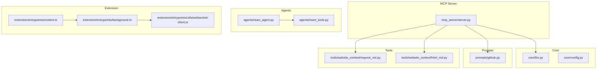
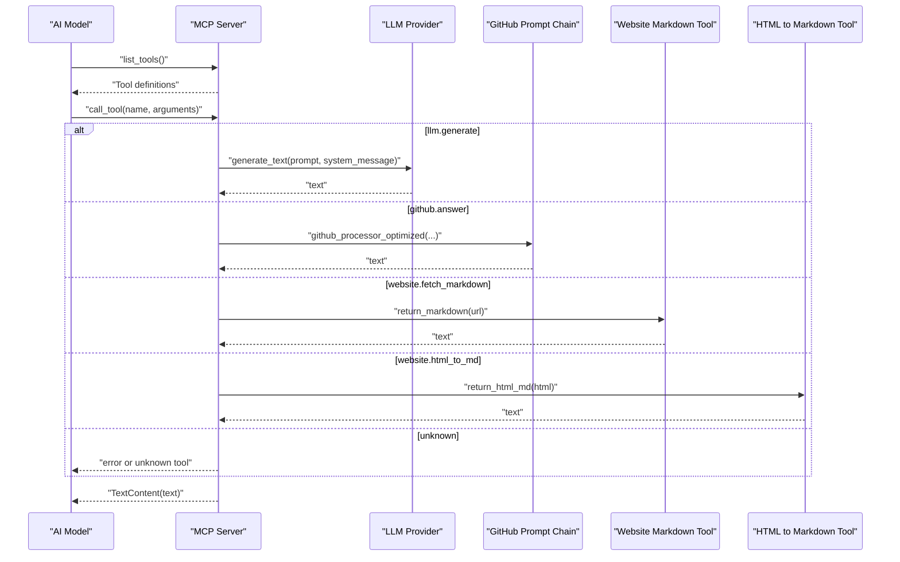
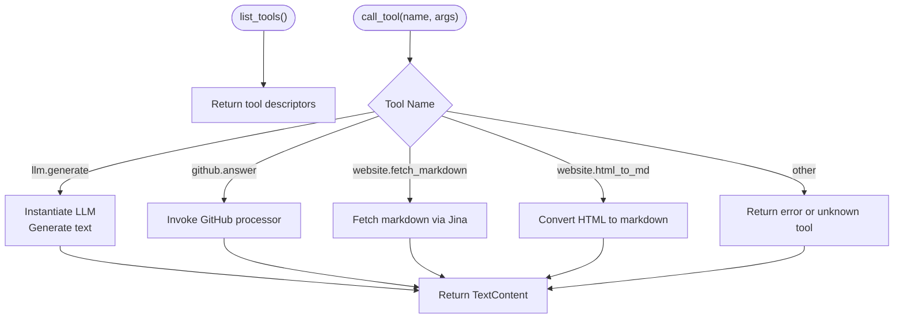
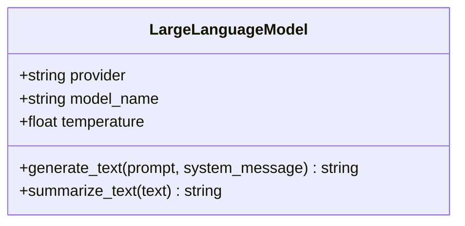
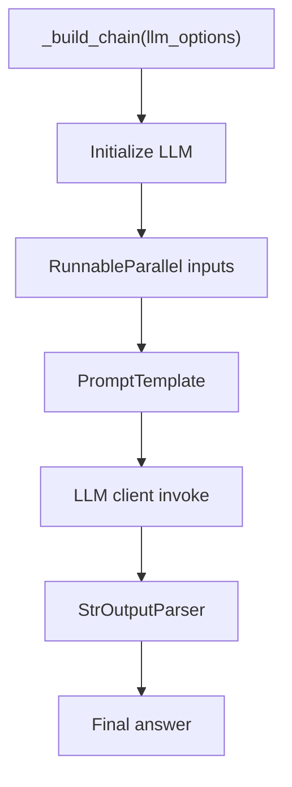
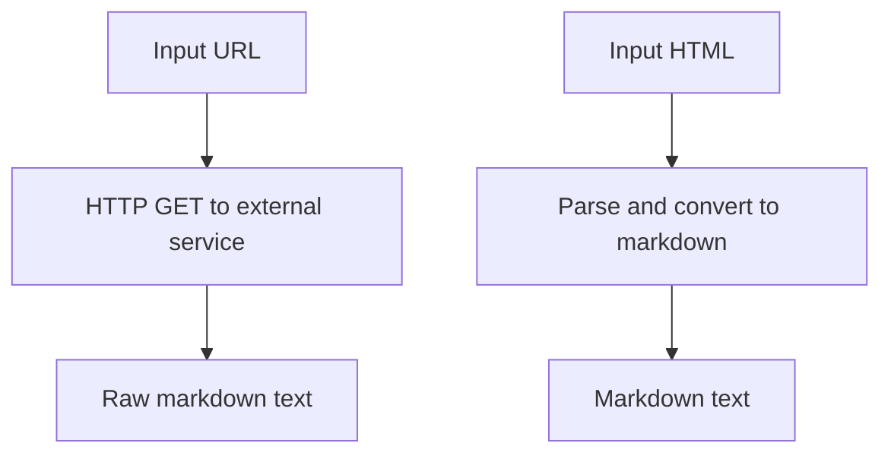
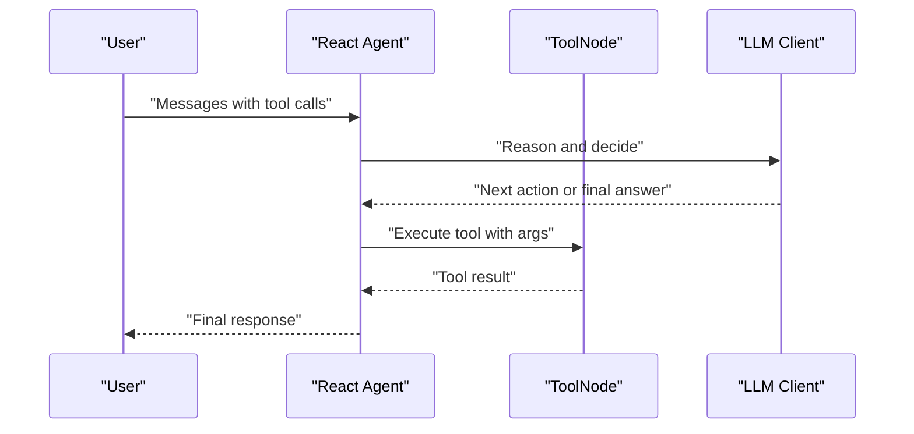
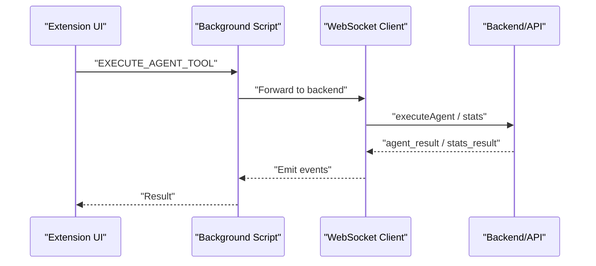
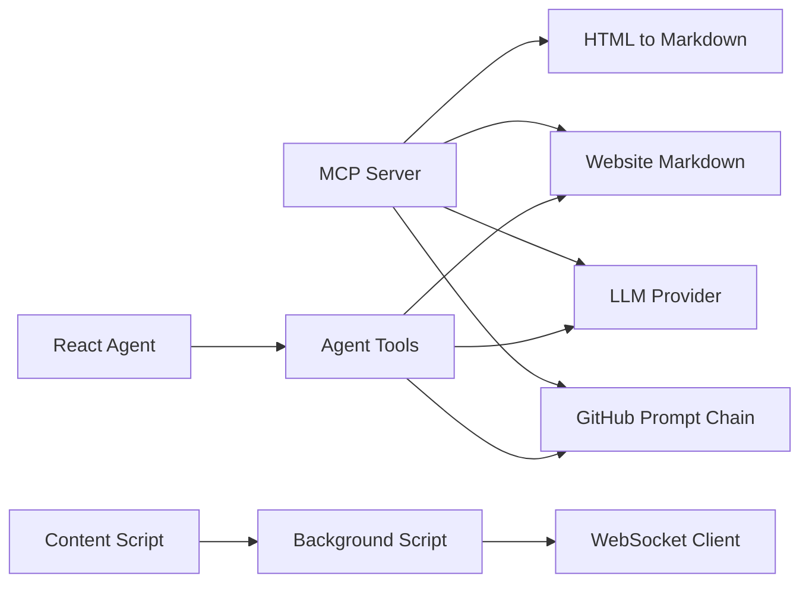

# MCP Server

<cite>
**Referenced Files in This Document**
- [mcp_server/server.py](file://mcp_server/server.py)
- [core/llm.py](file://core/llm.py)
- [prompts/github.py](file://prompts/github.py)
- [tools/website_context/request_md.py](file://tools/website_context/request_md.py)
- [tools/website_context/html_md.py](file://tools/website_context/html_md.py)
- [agents/react_agent.py](file://agents/react_agent.py)
- [agents/react_tools.py](file://agents/react_tools.py)
- [extension/entrypoints/utils/websocket-client.ts](file://extension/entrypoints/utils/websocket-client.ts)
- [extension/entrypoints/background.ts](file://extension/entrypoints/background.ts)
- [extension/entrypoints/content.ts](file://extension/entrypoints/content.ts)
- [core/config.py](file://core/config.py)
</cite>

## Table of Contents
1. [Introduction](#introduction)
2. [Project Structure](#project-structure)
3. [Core Components](#core-components)
4. [Architecture Overview](#architecture-overview)
5. [Detailed Component Analysis](#detailed-component-analysis)
6. [Dependency Analysis](#dependency-analysis)
7. [Performance Considerations](#performance-considerations)
8. [Troubleshooting Guide](#troubleshooting-guide)
9. [Conclusion](#conclusion)
10. [Appendices](#appendices)

## Introduction
This document explains the Model Context Protocol (MCP) Server implementation in the Agentic Browser project. It covers how the MCP server exposes tools to AI models via stdio, how tools are defined and registered, and how requests and responses are handled. It also documents the communication patterns between the MCP server, the browser extension, and AI agents, along with prompt engineering aspects, configuration management, tool lifecycle, error handling, and security/performance considerations.

## Project Structure
The MCP server lives under a dedicated module and integrates with core LLM capabilities, prompt chains, and website context extraction tools. The broader system includes an agent framework and a browser extension that communicates with a backend via WebSocket.

**Diagram sources**
- [mcp_server/server.py](file://mcp_server/server.py#L1-L139)
- [core/llm.py](file://core/llm.py#L1-L215)
- [prompts/github.py](file://prompts/github.py#L1-L110)
- [tools/website_context/request_md.py](file://tools/website_context/request_md.py#L1-L30)
- [tools/website_context/html_md.py](file://tools/website_context/html_md.py#L1-L27)
- [agents/react_agent.py](file://agents/react_agent.py#L1-L191)
- [agents/react_tools.py](file://agents/react_tools.py#L1-L721)
- [extension/entrypoints/background.ts](file://extension/entrypoints/background.ts#L1-L800)
- [extension/entrypoints/content.ts](file://extension/entrypoints/content.ts#L1-L326)
- [extension/entrypoints/utils/websocket-client.ts](file://extension/entrypoints/utils/websocket-client.ts#L1-L133)

**Section sources**
- [mcp_server/server.py](file://mcp_server/server.py#L1-L139)
- [core/llm.py](file://core/llm.py#L1-L215)
- [prompts/github.py](file://prompts/github.py#L1-L110)
- [tools/website_context/request_md.py](file://tools/website_context/request_md.py#L1-L30)
- [tools/website_context/html_md.py](file://tools/website_context/html_md.py#L1-L27)
- [agents/react_agent.py](file://agents/react_agent.py#L1-L191)
- [agents/react_tools.py](file://agents/react_tools.py#L1-L721)
- [extension/entrypoints/background.ts](file://extension/entrypoints/background.ts#L1-L800)
- [extension/entrypoints/content.ts](file://extension/entrypoints/content.ts#L1-L326)
- [extension/entrypoints/utils/websocket-client.ts](file://extension/entrypoints/utils/websocket-client.ts#L1-L133)
- [core/config.py](file://core/config.py#L1-L26)

## Core Components
- MCP Server: Defines and registers tools, handles tool invocations, and streams responses back to the AI model over stdio.
- LLM Provider Abstraction: Centralizes provider selection, model instantiation, and text generation.
- Prompt Chains: Provide domain-specific prompting for GitHub repositories and other domains.
- Website Context Tools: Fetch and convert website content to markdown for downstream consumption.
- Agent Framework: Provides a structured agent with tool execution and state management.
- Extension: Implements background and content scripts and a WebSocket client for agent orchestration.

**Section sources**
- [mcp_server/server.py](file://mcp_server/server.py#L13-L124)
- [core/llm.py](file://core/llm.py#L78-L191)
- [prompts/github.py](file://prompts/github.py#L85-L110)
- [tools/website_context/request_md.py](file://tools/website_context/request_md.py#L7-L29)
- [tools/website_context/html_md.py](file://tools/website_context/html_md.py#L5-L11)
- [agents/react_agent.py](file://agents/react_agent.py#L123-L175)
- [agents/react_tools.py](file://agents/react_tools.py#L524-L720)
- [extension/entrypoints/utils/websocket-client.ts](file://extension/entrypoints/utils/websocket-client.ts#L8-L132)

## Architecture Overview
The MCP server runs as a standalone process communicating over stdio. AI models request tools via MCP, and the server executes them, returning textual content. The browser extension coordinates agent actions and can communicate with a backend via WebSocket. The agent framework orchestrates tool use and manages conversational state.

**Diagram sources**
- [mcp_server/server.py](file://mcp_server/server.py#L16-L124)
- [core/llm.py](file://core/llm.py#L171-L190)
- [prompts/github.py](file://prompts/github.py#L85-L110)
- [tools/website_context/request_md.py](file://tools/website_context/request_md.py#L7-L29)
- [tools/website_context/html_md.py](file://tools/website_context/html_md.py#L5-L11)

## Detailed Component Analysis

### MCP Server: Tool Definition and Invocation
- Tool Registration: The server registers four tools via a decorator that returns a list of tool descriptors with names, descriptions, and JSON Schemas for inputs.
- Tool Execution: The server routes tool calls to specific handlers, instantiating providers or invoking utility functions, and returns TextContent responses.

**Diagram sources**
- [mcp_server/server.py](file://mcp_server/server.py#L16-L124)

**Section sources**
- [mcp_server/server.py](file://mcp_server/server.py#L16-L124)

### LLM Provider Abstraction
- Provider Configurations: Centralized mapping of providers to underlying SDK clients, default models, and parameter mappings.
- Initialization: Validates API keys and base URLs, constructs the appropriate client, and raises descriptive errors on misconfiguration.
- Generation: Accepts optional system messages and returns generated text.

**Diagram sources**
- [core/llm.py](file://core/llm.py#L78-L191)

**Section sources**
- [core/llm.py](file://core/llm.py#L21-L75)
- [core/llm.py](file://core/llm.py#L78-L191)

### Prompt Engineering for GitHub Tools
- Prompt Template: System and user prompt template designed to constrain responses to repository context.
- Runnable Chain: Composes inputs (tree, summary, content, question, chat history) with a formatter and an LLM client to produce a final answer.

**Diagram sources**
- [prompts/github.py](file://prompts/github.py#L75-L82)
- [prompts/github.py](file://prompts/github.py#L85-L110)

**Section sources**
- [prompts/github.py](file://prompts/github.py#L10-L63)
- [prompts/github.py](file://prompts/github.py#L75-L110)

### Website Context Tools
- Fetch Markdown: Uses an external service to retrieve markdown content for a given URL.
- HTML to Markdown: Converts raw HTML to markdown using parsing utilities.

**Diagram sources**
- [tools/website_context/request_md.py](file://tools/website_context/request_md.py#L7-L29)
- [tools/website_context/html_md.py](file://tools/website_context/html_md.py#L5-L11)

**Section sources**
- [tools/website_context/request_md.py](file://tools/website_context/request_md.py#L7-L29)
- [tools/website_context/html_md.py](file://tools/website_context/html_md.py#L5-L11)

### Agent Framework and Tool Lifecycle
- Agent State: Maintains conversation context and supports tool calls with structured messages.
- ToolNode Integration: Tools are structured and invoked by the agent’s tool node, enabling conditional routing between agent reasoning and tool execution.
- Tool Definitions: Rich tool schemas and coroutines encapsulate domain-specific capabilities.

**Diagram sources**
- [agents/react_agent.py](file://agents/react_agent.py#L123-L175)
- [agents/react_tools.py](file://agents/react_tools.py#L524-L720)

**Section sources**
- [agents/react_agent.py](file://agents/react_agent.py#L123-L175)
- [agents/react_tools.py](file://agents/react_tools.py#L524-L720)

### Browser Extension Communication Patterns
- Background Script: Handles messaging for agent tool execution, tab management, and action dispatch.
- Content Script: Provides lightweight DOM-aware actions and can be extended for richer interactions.
- WebSocket Client: Manages connection to a backend, emits progress events, and supports agent execution commands.

**Diagram sources**
- [extension/entrypoints/background.ts](file://extension/entrypoints/background.ts#L24-L128)
- [extension/entrypoints/utils/websocket-client.ts](file://extension/entrypoints/utils/websocket-client.ts#L61-L108)

**Section sources**
- [extension/entrypoints/background.ts](file://extension/entrypoints/background.ts#L24-L128)
- [extension/entrypoints/content.ts](file://extension/entrypoints/content.ts#L1-L326)
- [extension/entrypoints/utils/websocket-client.ts](file://extension/entrypoints/utils/websocket-client.ts#L8-L132)

## Dependency Analysis
- MCP Server depends on:
  - LLM provider abstraction for text generation
  - Prompt chains for contextual QA
  - Website context tools for content retrieval/conversion
- Agent framework depends on:
  - Structured tools and prompt chains
  - LLM provider for reasoning
- Extension depends on:
  - Background and content scripts for browser automation
  - WebSocket client for backend coordination

**Diagram sources**
- [mcp_server/server.py](file://mcp_server/server.py#L7-L11)
- [agents/react_tools.py](file://agents/react_tools.py#L13-L29)
- [extension/entrypoints/background.ts](file://extension/entrypoints/background.ts#L1-L800)
- [extension/entrypoints/utils/websocket-client.ts](file://extension/entrypoints/utils/websocket-client.ts#L1-L133)

**Section sources**
- [mcp_server/server.py](file://mcp_server/server.py#L1-L139)
- [agents/react_tools.py](file://agents/react_tools.py#L1-L721)
- [extension/entrypoints/background.ts](file://extension/entrypoints/background.ts#L1-L800)
- [extension/entrypoints/utils/websocket-client.ts](file://extension/entrypoints/utils/websocket-client.ts#L1-L133)

## Performance Considerations
- Asynchronous Execution: MCP tool handlers and agent workflows leverage async patterns to avoid blocking.
- Threading for Blocking IO: Agent tools use threads for blocking operations (e.g., HTTP requests, file reads) to keep the event loop responsive.
- Caching: Agent graph compilation is cached to reduce startup overhead.
- Provider Selection: LLM initialization validates environment variables early to fail fast and avoid runtime retries.

[No sources needed since this section provides general guidance]

## Troubleshooting Guide
- MCP Tool Not Found: Ensure the requested tool name matches the registered tool names and schemas.
- LLM Initialization Failures: Verify provider configuration, API keys, and base URLs. The LLM provider raises explicit errors when required environment variables are missing.
- GitHub Processor Errors: Confirm that the prompt chain receives all required inputs and that the LLM client is reachable.
- Website Tools Failures: Check network connectivity to the external markdown service and input URL validity.
- Extension WebSocket Issues: Validate backend URL and network connectivity; the WebSocket client logs connection events and errors.

**Section sources**
- [mcp_server/server.py](file://mcp_server/server.py#L122-L123)
- [core/llm.py](file://core/llm.py#L101-L105)
- [core/llm.py](file://core/llm.py#L121-L134)
- [prompts/github.py](file://prompts/github.py#L93-L109)
- [tools/website_context/request_md.py](file://tools/website_context/request_md.py#L13-L29)
- [extension/entrypoints/utils/websocket-client.ts](file://extension/entrypoints/utils/websocket-client.ts#L17-L40)

## Conclusion
The MCP Server provides a focused, extensible interface for exposing tools to AI models. By centralizing LLM providers, prompt engineering, and content extraction utilities, it enables secure, structured interactions between AI agents and browser automation. The agent framework and extension components complement the MCP server to deliver a cohesive agentic browser experience.

[No sources needed since this section summarizes without analyzing specific files]

## Appendices

### Configuration Management
- Environment Variables: API keys and base URLs are resolved from environment variables per provider configuration.
- Logging: Centralized logging configuration supports development and production environments.

**Section sources**
- [core/llm.py](file://core/llm.py#L121-L155)
- [core/config.py](file://core/config.py#L13-L25)

### Security Considerations
- API Keys and Base URLs: Providers requiring secrets rely on environment variables; avoid embedding credentials in code.
- Tool Inputs: MCP tool schemas define required fields and types to reduce injection risks.
- Extension Permissions: Background and content scripts should limit permissions to those required for automation.

**Section sources**
- [core/llm.py](file://core/llm.py#L121-L134)
- [mcp_server/server.py](file://mcp_server/server.py#L22-L78)
- [extension/entrypoints/background.ts](file://extension/entrypoints/background.ts#L1-L800)
- [extension/entrypoints/content.ts](file://extension/entrypoints/content.ts#L1-L326)

### Example Tool Implementations and Client Integration
- MCP Tool Implementations: See the tool registration and call handlers for patterns to add new tools.
- Client Integration: Use the WebSocket client to integrate agent execution and progress reporting with the extension.

**Section sources**
- [mcp_server/server.py](file://mcp_server/server.py#L16-L124)
- [extension/entrypoints/utils/websocket-client.ts](file://extension/entrypoints/utils/websocket-client.ts#L61-L108)