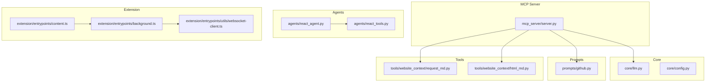
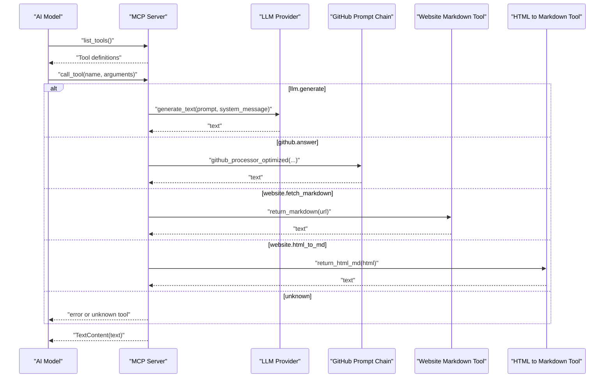
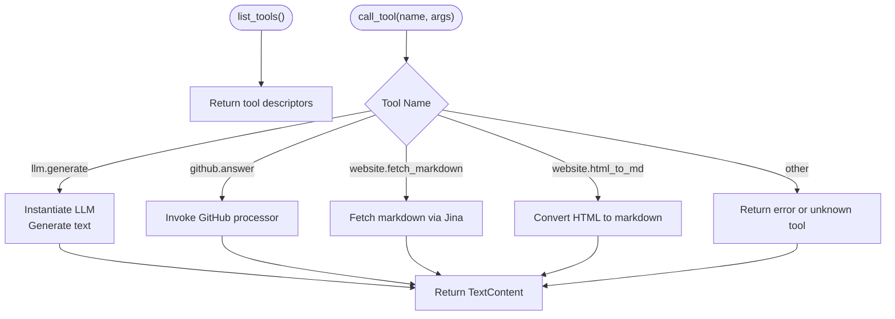
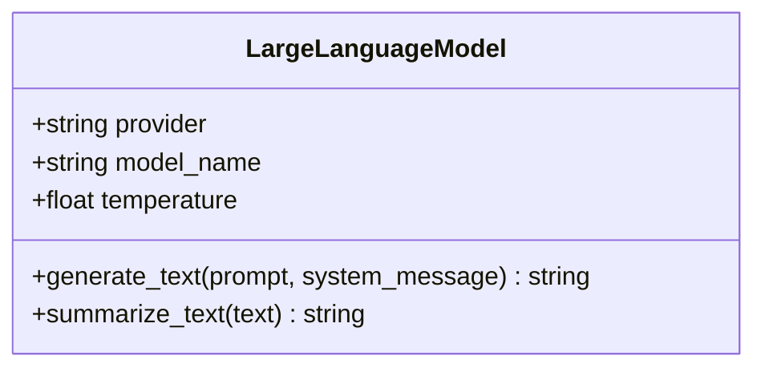
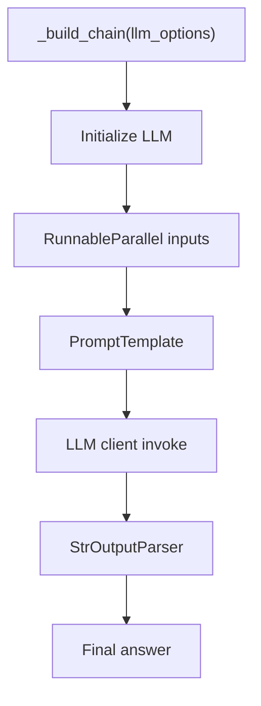
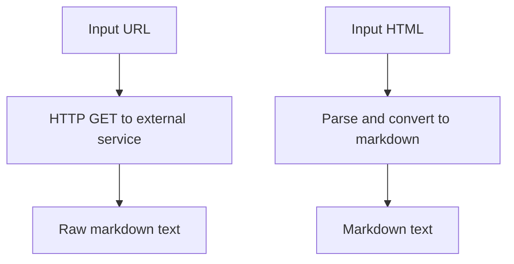
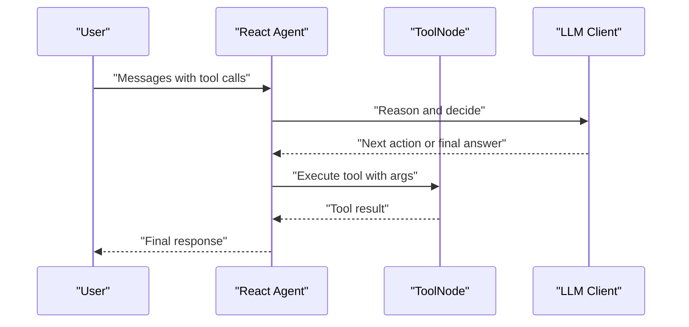
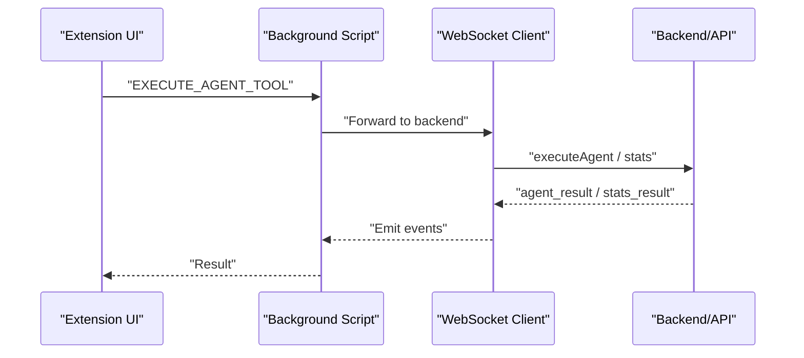
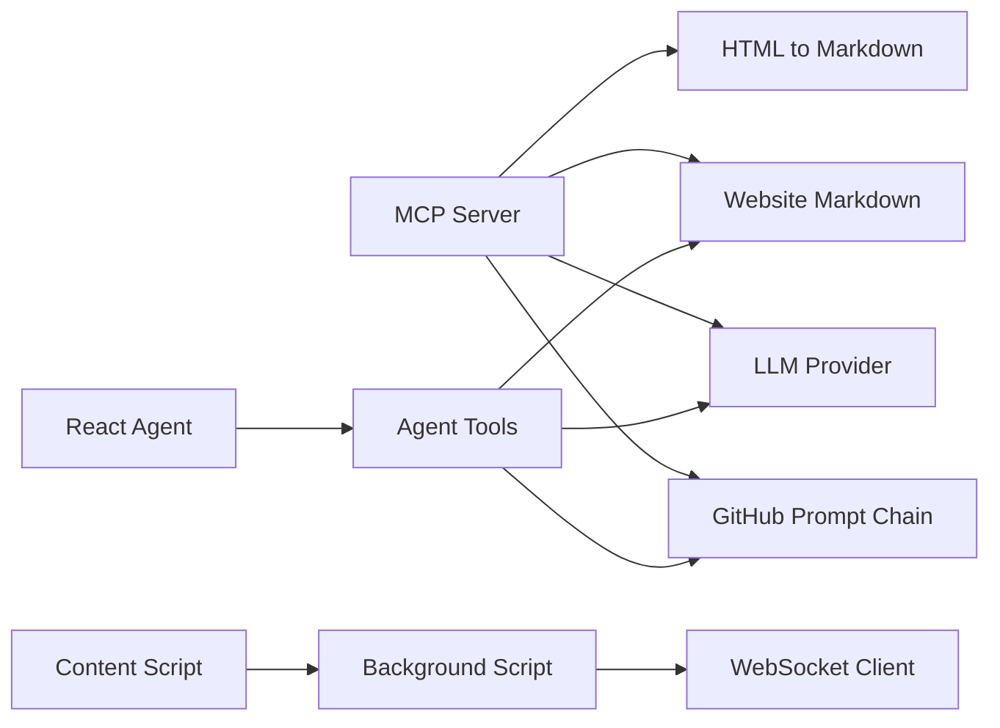

# MCP server

## Introduction
This page explains the Model Context Protocol (MCP) Server implementation in the Agentic Browser project. It covers how the MCP server exposes tools to AI models via stdio, how tools are defined and registered, and how requests and responses are handled. It also documents the communication patterns between the MCP server, the browser extension, and AI agents, along with prompt engineering aspects, configuration management, tool lifecycle, error handling, and security/performance considerations.

## Project structure
The MCP server lives under a dedicated module and integrates with core LLM capabilities, prompt chains, and website context extraction tools. The broader system includes an agent framework and a browser extension that communicates with a backend via WebSocket.

```mermaid
graph TB
subgraph "MCP Server"
MCP["mcp_server/server.py"]
end
subgraph "Core"
LLM["core/llm.py"]
CFG["core/config.py"]
end
subgraph "Prompts"
GH["prompts/github.py"]
end
subgraph "Tools"
WM["tools/website_context/request_md.py"]
HM["tools/website_context/html_md.py"]
end
subgraph "Agents"
RA["agents/react_agent.py"]
RT["agents/react_tools.py"]
end
subgraph "Extension"
BG["extension/entrypoints/background.ts"]
CT["extension/entrypoints/content.ts"]
WS["extension/entrypoints/utils/websocket-client.ts"]
end
MCP --> LLM
MCP --> GH
MCP --> WM
MCP --> HM
RA --> RT
BG --> WS
CT --> BG
```

## Core components
- MCP Server: Defines and registers tools, handles tool invocations, and streams responses back to the AI model over stdio.
- LLM Provider Abstraction: Centralizes provider selection, model instantiation, and text generation.
- Prompt Chains: Provide domain-specific prompting for GitHub repositories and other domains.
- Website Context Tools: Fetch and convert website content to markdown for downstream consumption.
- Agent Framework: Provides a structured agent with tool execution and state management.
- Extension: Implements background and content scripts and a WebSocket client for agent orchestration.

## Architecture overview
The MCP server runs as a standalone process communicating over stdio. AI models request tools via MCP, and the server executes them, returning textual content. The browser extension coordinates agent actions and can communicate with a backend via WebSocket. The agent framework orchestrates tool use and manages conversational state.

```mermaid
sequenceDiagram
participant AI as "AI Model"
participant MCP as "MCP Server"
participant LLM as "LLM Provider"
participant GH as "GitHub Prompt Chain"
participant WM as "Website Markdown Tool"
participant HM as "HTML to Markdown Tool"
AI->>MCP : "list_tools()"
MCP-->>AI : "Tool definitions"
AI->>MCP : "call_tool(name, arguments)"
alt llm.generate
MCP->>LLM : "generate_text(prompt, system_message)"
LLM-->>MCP : "text"
else github.answer
MCP->>GH : "github_processor_optimized(...)"
GH-->>MCP : "text"
else website.fetch_markdown
MCP->>WM : "return_markdown(url)"
WM-->>MCP : "text"
else website.html_to_md
MCP->>HM : "return_html_md(html)"
HM-->>MCP : "text"
else unknown
MCP-->>AI : "error or unknown tool"
end
MCP-->>AI : "TextContent(text)"
```

## Detailed component analysis

### MCP server: tool definition and invocation
- Tool Registration: The server registers four tools via a decorator that returns a list of tool descriptors with names, descriptions, and JSON Schemas for inputs.
- Tool Execution: The server routes tool calls to specific handlers, instantiating providers or invoking utility functions, and returns TextContent responses.

```mermaid
flowchart TD
Start(["list_tools()"]) --> ListTools["Return tool descriptors"]
CallStart(["call_tool(name, args)"]) --> Route{"Tool Name"}
Route --> |llm.generate| Gen["Instantiate LLM<br/>Generate text"]
Route --> |github.answer| GH["Invoke GitHub processor"]
Route --> |website.fetch_markdown| WM["Fetch markdown via Jina"]
Route --> |website.html_to_md| HM["Convert HTML to markdown"]
Route --> |other| Err["Return error or unknown tool"]
Gen --> Return["Return TextContent"]
GH --> Return
WM --> Return
HM --> Return
Err --> Return
```

### LLM provider abstraction
- Provider Configurations: Centralized mapping of providers to underlying SDK clients, default models, and parameter mappings.
- Initialization: Validates API keys and base URLs, constructs the appropriate client, and raises descriptive errors on misconfiguration.
- Generation: Accepts optional system messages and returns generated text.

```mermaid
classDiagram
class LargeLanguageModel {
+string provider
+string model_name
+float temperature
+generate_text(prompt, system_message) string
+summarize_text(text) string
}
```

### Prompt engineering for GitHub tools
- Prompt Template: System and user prompt template designed to constrain responses to repository context.
- Runnable Chain: Composes inputs (tree, summary, content, question, chat history) with a formatter and an LLM client to produce a final answer.

```mermaid
flowchart TD
Build["_build_chain(llm_options)"] --> LLM["Initialize LLM"]
LLM --> Chain["RunnableParallel inputs"]
Chain --> Prompt["PromptTemplate"]
Prompt --> Invoke["LLM client invoke"]
Invoke --> Parse["StrOutputParser"]
Parse --> Result["Final answer"]
```

### Website context tools
- Fetch Markdown: Uses an external service to retrieve markdown content for a given URL.
- HTML to Markdown: Converts raw HTML to markdown using parsing utilities.

```mermaid
flowchart TD
URL["Input URL"] --> Fetch["HTTP GET to external service"]
Fetch --> MD["Raw markdown text"]
HTML["Input HTML"] --> Convert["Parse and convert to markdown"]
Convert --> MD2["Markdown text"]
```

### Agent framework and tool lifecycle
- Agent State: Maintains conversation context and supports tool calls with structured messages.
- ToolNode Integration: Tools are structured and invoked by the agent's tool node, enabling conditional routing between agent reasoning and tool execution.
- Tool Definitions: Rich tool schemas and coroutines encapsulate domain-specific capabilities.

```mermaid
sequenceDiagram
participant User as "User"
participant Agent as "React Agent"
participant Tools as "ToolNode"
participant LLM as "LLM Client"
User->>Agent : "Messages with tool calls"
Agent->>LLM : "Reason and decide"
LLM-->>Agent : "Next action or final answer"
Agent->>Tools : "Execute tool with args"
Tools-->>Agent : "Tool result"
Agent-->>User : "Final response"
```

### Browser extension communication patterns
- Background Script: Handles messaging for agent tool execution, tab management, and action dispatch.
- Content Script: Provides lightweight DOM-aware actions and can be extended for richer interactions.
- WebSocket Client: Manages connection to a backend, emits progress events, and supports agent execution commands.

```mermaid
sequenceDiagram
participant Ext as "Extension UI"
participant BG as "Background Script"
participant WS as "WebSocket Client"
participant BE as "Backend/API"
Ext->>BG : "EXECUTE_AGENT_TOOL"
BG->>WS : "Forward to backend"
WS->>BE : "executeAgent / stats"
BE-->>WS : "agent_result / stats_result"
WS-->>BG : "Emit events"
BG-->>Ext : "Result"
```

## Dependency analysis
- MCP Server depends on:
  - LLM provider abstraction for text generation
  - Prompt chains for contextual QA
  - Website context tools for content retrieval/conversion
- Agent framework depends on:
  - Structured tools and prompt chains
  - LLM provider for reasoning
- Extension depends on:
  - Background and content scripts for browser automation
  - WebSocket client for backend coordination

```mermaid
graph LR
MCP["MCP Server"] --> LLM["LLM Provider"]
MCP --> GH["GitHub Prompt Chain"]
MCP --> WM["Website Markdown"]
MCP --> HM["HTML to Markdown"]
RA["React Agent"] --> RT["Agent Tools"]
RT --> GH
RT --> WM
RT --> LLM
BG["Background Script"] --> WS["WebSocket Client"]
CT["Content Script"] --> BG
```

## Performance considerations
- Asynchronous Execution: MCP tool handlers and agent workflows use async patterns to avoid blocking.
- Threading for Blocking IO: Agent tools use threads for blocking operations (e.g., HTTP requests, file reads) to keep the event loop responsive.
- Caching: Agent graph compilation is cached to reduce startup overhead.
- Provider Selection: LLM initialization validates environment variables early to fail fast and avoid runtime retries.

[No sources needed since this section provides general guidance]

## Troubleshooting guide
- MCP Tool Not Found: Ensure the requested tool name matches the registered tool names and schemas.
- LLM Initialization Failures: Verify provider configuration, API keys, and base URLs. The LLM provider raises explicit errors when required environment variables are missing.
- GitHub Processor Errors: Confirm that the prompt chain receives all required inputs and that the LLM client is reachable.
- Website Tools Failures: Check network connectivity to the external markdown service and input URL validity.
- Extension WebSocket Issues: Validate backend URL and network connectivity; the WebSocket client logs connection events and errors.

## Conclusion
The MCP Server provides a focused, extensible interface for exposing tools to AI models. By centralizing LLM providers, prompt engineering, and content extraction utilities, it enables secure, structured interactions between AI agents and browser automation. The agent framework and extension components complement the MCP server to deliver a cohesive agentic browser experience.

[No sources needed since this section summarizes without analyzing specific files]

## Appendices

### Configuration management
- Environment Variables: API keys and base URLs are resolved from environment variables per provider configuration.
- Logging: Centralized logging configuration supports development and production environments.

### Security considerations
- API Keys and Base URLs: Providers requiring secrets rely on environment variables; avoid embedding credentials in code.
- Tool Inputs: MCP tool schemas define required fields and types to reduce injection risks.
- Extension Permissions: Background and content scripts should limit permissions to those required for automation.

### Example tool implementations and client integration
- MCP Tool Implementations: See the tool registration and call handlers for patterns to add new tools.
- Client Integration: Use the WebSocket client to integrate agent execution and progress reporting with the extension.
