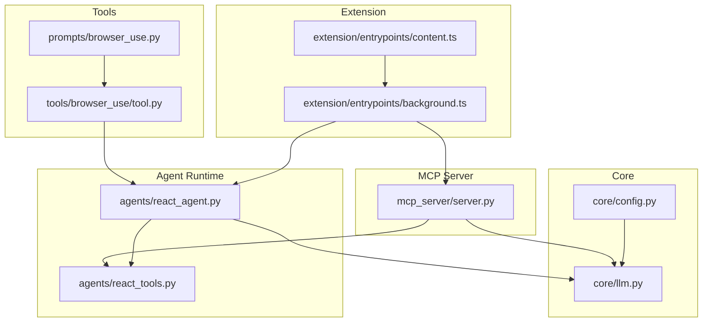
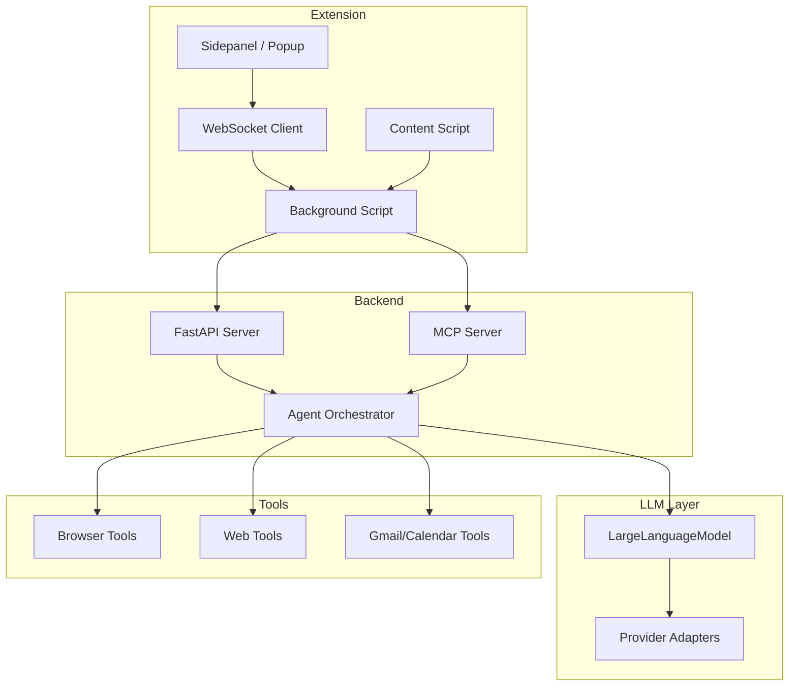
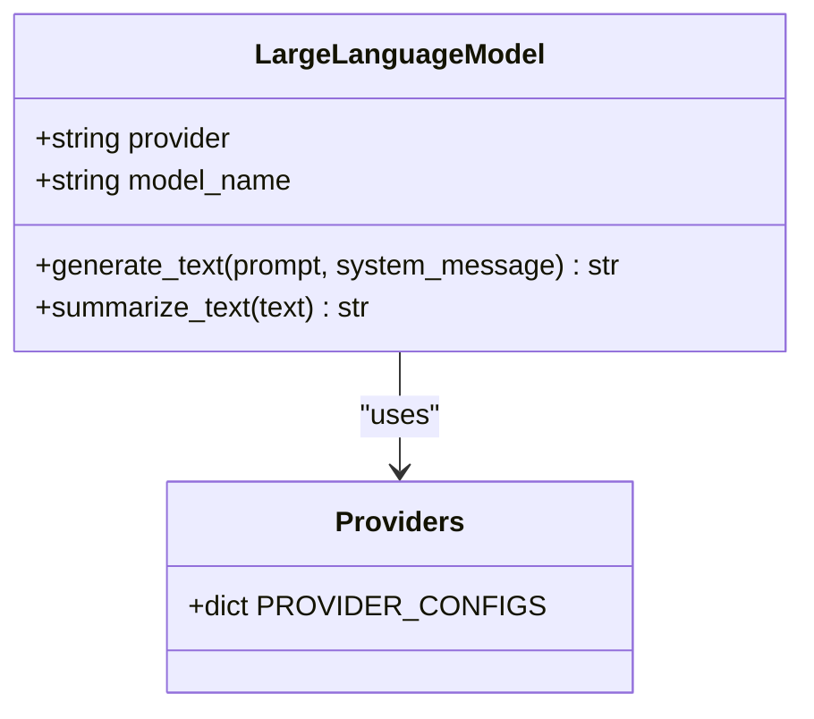
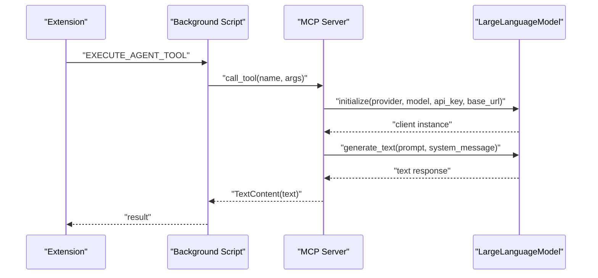
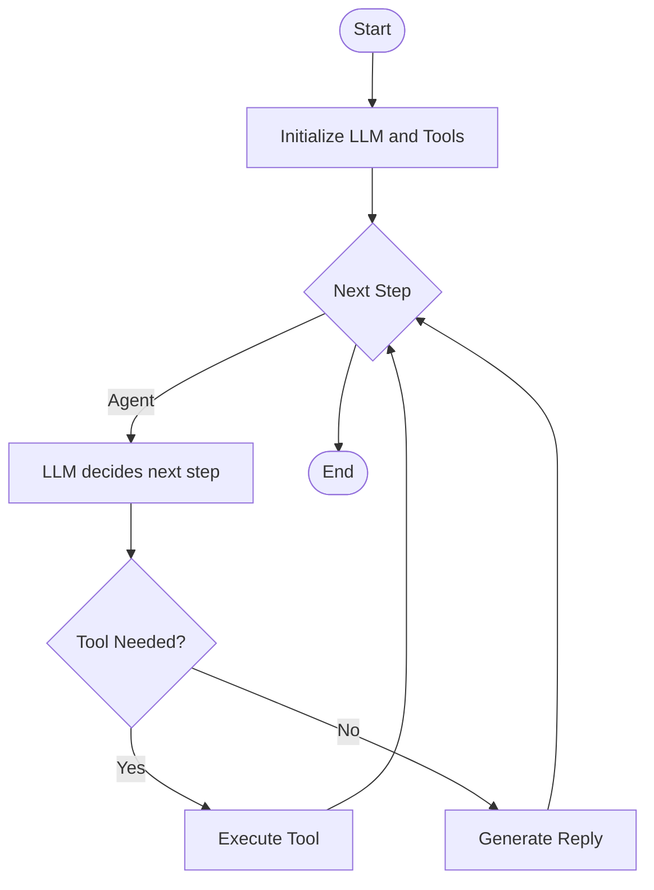
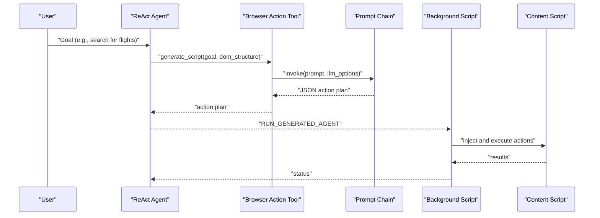
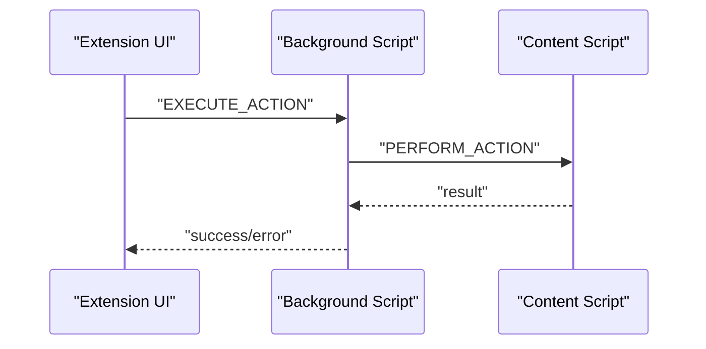
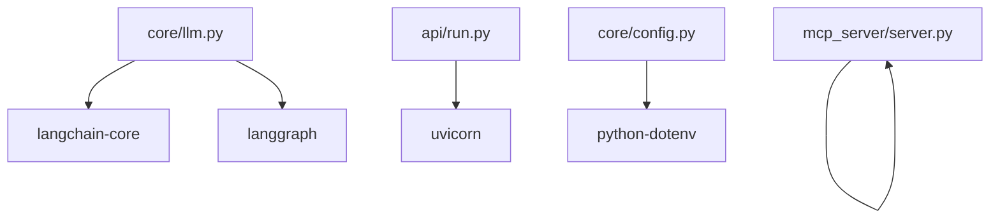

# Project overview

## Introduction
Agentic Browser is a next-generation browser extension designed to act as an intelligent agent that understands and controls web content. Its mission is to bridge modern LLM reasoning with real browser interactivity, enabling users to issue natural-language commands that are translated into safe, human-approved actions on live web pages. The project emphasizes model-agnostic intelligence, privacy-respecting design, and open-source extensibility, positioning itself as an adaptive, secure platform for AI-driven web automation.

## Project structure
The repository is organized into cohesive layers:
- Core runtime and configuration
- Agent orchestration and tooling
- MCP server for model-agnostic communication
- Browser extension (background, content scripts, UI)
- Services and tools for specialized workflows
- Prompts and utilities for grounded reasoning

```mermaid
graph TB
subgraph "Core"
CFG["core/config.py"]
LLM["core/llm.py"]
end
subgraph "Agent Runtime"
RA["agents/react_agent.py"]
RT["agents/react_tools.py"]
end
subgraph "MCP Server"
MCP["mcp_server/server.py"]
end
subgraph "Extension"
BG["extension/entrypoints/background.ts"]
CT["extension/entrypoints/content.ts"]
end
subgraph "Tools"
BA["tools/browser_use/tool.py"]
PU["prompts/browser_use.py"]
end
CFG --> LLM
RA --> RT
RA --> LLM
MCP --> LLM
MCP --> RT
BG --> RA
BG --> MCP
BA --> RA
PU --> BA
CT --> BG
```

## Core components
- Model-agnostic LLM integration: A unified adapter supporting multiple providers and local models.
- MCP-compliant server: Exposes tools and LLM generation via the Model Context Protocol.
- Agent orchestration: LangGraph-based ReAct agent with a rich toolset for web, calendar, email, and browser actions.
- Browser extension: Secure background and content scripts with declarative action execution.
- Prompt engineering: Specialized prompts for generating safe, structured action plans for browser automation.

## Architecture overview
Agentic Browser follows a layered architecture:
- Frontend: Extension UI and messaging channels
- Backend: FastAPI server and MCP server
- Agent runtime: LangGraph workflows and tooling
- LLM adapters: Provider-agnostic clients
- Safety: Guardrails and declarative action system

```mermaid
graph TB
subgraph "Extension"
UI["Sidepanel / Popup"]
WS["WebSocket Client"]
BG["Background Script"]
CT["Content Script"]
end
subgraph "Backend"
API["FastAPI Server"]
MCP["MCP Server"]
AG["Agent Orchestrator"]
end
subgraph "LLM Layer"
LLM["LargeLanguageModel"]
AD["Provider Adapters"]
end
subgraph "Tools"
BT["Browser Tools"]
WT["Web Tools"]
GT["Gmail/Calendar Tools"]
end
UI --> WS
WS --> BG
BG --> API
BG --> MCP
API --> AG
MCP --> AG
AG --> LLM
AG --> BT
AG --> WT
AG --> GT
LLM --> AD
CT --> BG
```

## Detailed component analysis

### Mission and objectives
- Model-agnostic intelligence: Smooth switching across providers and local models.
- Secure browser extension: WebExtensions-based design with explicit user approvals.
- Advanced agent workflows: RAG, persistent memory, and multi-step automation.
- Guardrails and transparency: User consent, logging, filtering, and allowlists.
- Open-source extensibility: Modular architecture for community contributions.

### Key architectural principles
- Model-agnostic design: Unified LLM adapter supports OpenAI, Anthropic, Ollama, and others.
- BYOKeys approach: Users supply their own API keys via environment or UI.
- MCP compliance: Structured tool definitions and standardized LLM invocation.
- Declarative action system: Natural language goals mapped to JSON action plans.

### Technical stack overview
- Agent orchestration: LangChain, LangGraph for stateful workflows.
- Browser control: WebExtensions API for tab/window control and DOM injection.
- LLM adapters: OpenRouter, Ollama, Anthropic, OpenAI, Hugging Face integrations.
- Backend agent: Python MCP server exposing tools and LLM generation.
- Retrieval and citation: Vector databases and RAG pipelines.
- Safety and guardrails: Logging, filtering, and explicit user consent.

### Core objectives in practice
- Model-agnostic agent backend: Python, LangChain, MCP framework with provider adapters.
- Secure browser extension: Chrome/Firefox compatible via WebExtensions.
- Advanced agent workflows: RAG, persistent memory, multi-step tasks.
- Guardrails and transparency: User approval, logs, filtering, allowlists.
- Open-source extensibility: Modular tool and service architecture.

### Model-Agnostic LLM adapter
The LLM adapter encapsulates provider-specific clients behind a unified interface. It supports multiple providers, validates API keys, and constructs client instances with configurable base URLs and models.

```mermaid
classDiagram
class LargeLanguageModel {
+string provider
+string model_name
+generate_text(prompt, system_message) str
+summarize_text(text) str
}
class Providers {
+dict PROVIDER_CONFIGS
}
LargeLanguageModel --> Providers : "uses"
```

### MCP server and tooling
The MCP server exposes standardized tools for LLM generation, GitHub QA, website fetching, and HTML-to-markdown conversion. It dynamically initializes LLM clients based on incoming arguments and returns structured text content.

```mermaid
sequenceDiagram
participant Ext as "Extension"
participant BG as "Background Script"
participant MCP as "MCP Server"
participant LLM as "LargeLanguageModel"
Ext->>BG : "EXECUTE_AGENT_TOOL"
BG->>MCP : "call_tool(name, args)"
MCP->>LLM : "initialize(provider, model, api_key, base_url)"
LLM-->>MCP : "client instance"
MCP->>LLM : "generate_text(prompt, system_message)"
LLM-->>MCP : "text response"
MCP-->>BG : "TextContent(text)"
BG-->>Ext : "result"
```

### Agent orchestration and tools
The ReAct agent uses LangGraph to alternate between reasoning and tool execution. It binds tools dynamically, manages conversation context, and converts between internal and external message formats.

```mermaid
flowchart TD
Start(["Start"]) --> Init["Initialize LLM and Tools"]
Init --> Loop{"Next Step"}
Loop --> |Agent| Plan["LLM decides next step"]
Plan --> ToolCheck{"Tool Needed?"}
ToolCheck --> |Yes| Exec["Execute Tool"]
ToolCheck --> |No| Reply["Generate Reply"]
Exec --> Loop
Reply --> Loop
Loop --> End(["End"])
```

### Browser action agent and declarative actions
The browser action agent translates natural language goals into JSON action plans. The prompt defines available actions (DOM manipulation and tab/window control) and enforces strict output formatting and selector selection rules.

```mermaid
sequenceDiagram
participant User as "User"
participant Agent as "ReAct Agent"
participant BA as "Browser Action Tool"
participant PU as "Prompt Chain"
participant BG as "Background Script"
participant CT as "Content Script"
User->>Agent : "Goal (e.g., search for flights)"
Agent->>BA : "generate_script(goal, dom_structure)"
BA->>PU : "invoke(prompt, llm_options)"
PU-->>BA : "JSON action plan"
BA-->>Agent : "action plan"
Agent-->>BG : "RUN_GENERATED_AGENT"
BG->>CT : "inject and execute actions"
CT-->>BG : "results"
BG-->>Agent : "status"
```

### Extension messaging and security
The extension uses explicit message types for agent tool execution, tab/window control, and action execution. Every action is logged and requires user consent, ensuring transparency and safety.

```mermaid
sequenceDiagram
participant UI as "Extension UI"
participant BG as "Background Script"
participant CT as "Content Script"
UI->>BG : "EXECUTE_ACTION"
BG->>CT : "PERFORM_ACTION"
CT-->>BG : "result"
BG-->>UI : "success/error"
```

## Dependency analysis
The project relies on a curated set of libraries for LLM integration, web automation, and agent orchestration. The dependency graph highlights the central role of LangChain/LangGraph and MCP.

```mermaid
graph TB
LCA["langchain-core"]
LCG["langgraph"]
MCP["mcp"]
UVI["uvicorn"]
DOT["python-dotenv"]
LLM["core/llm.py"] --> LCA
LLM --> LCG
MCP["mcp_server/server.py"] --> MCP
API["api/run.py"] --> UVI
CFG["core/config.py"] --> DOT
```

## Performance considerations
- Asynchronous tool execution: Tools use asyncio and thread pools to avoid blocking the main loop.
- Provider configuration caching: LLM clients are constructed on-demand with validated credentials.
- Minimal DOM manipulation: Content scripts inject only necessary scripts and dispatch minimal events.
- Efficient prompting: Prompt templates are concise and output-only JSON to reduce parsing overhead.

[No sources needed since this section provides general guidance]

## Troubleshooting guide
Common issues and resolutions:
- Missing environment variables: Ensure API keys and base URLs are configured in the environment.
- LLM initialization failures: Verify provider availability, base URLs, and model names.
- Extension action errors: Confirm tab permissions and that the content script is injected before execution.
- MCP tool errors: Validate tool names and argument schemas; check server logs for exceptions.

## Conclusion
Agentic Browser delivers a model-agnostic, secure, and extensible platform for intelligent web automation. By combining MCP-compliant tooling, a declarative action system, and reliable guardrails, it enables users to safely automate complex web tasks while maintaining control and transparency. The modular architecture invites community contributions and positions the project as a foundation for adaptive AI browser automation.
