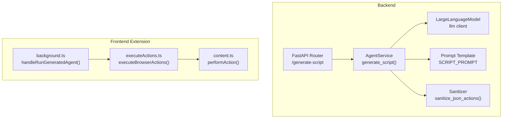
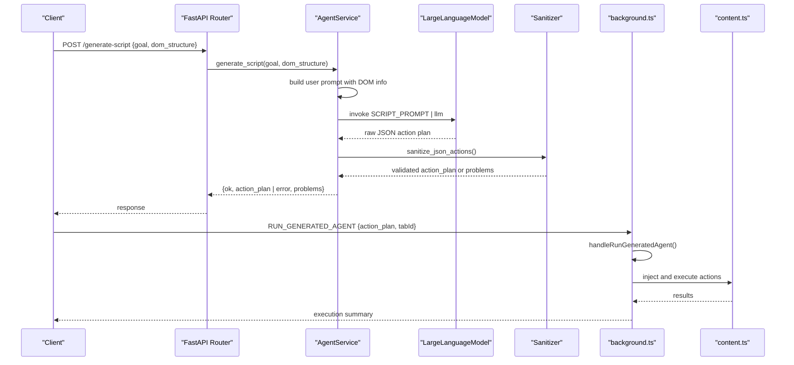
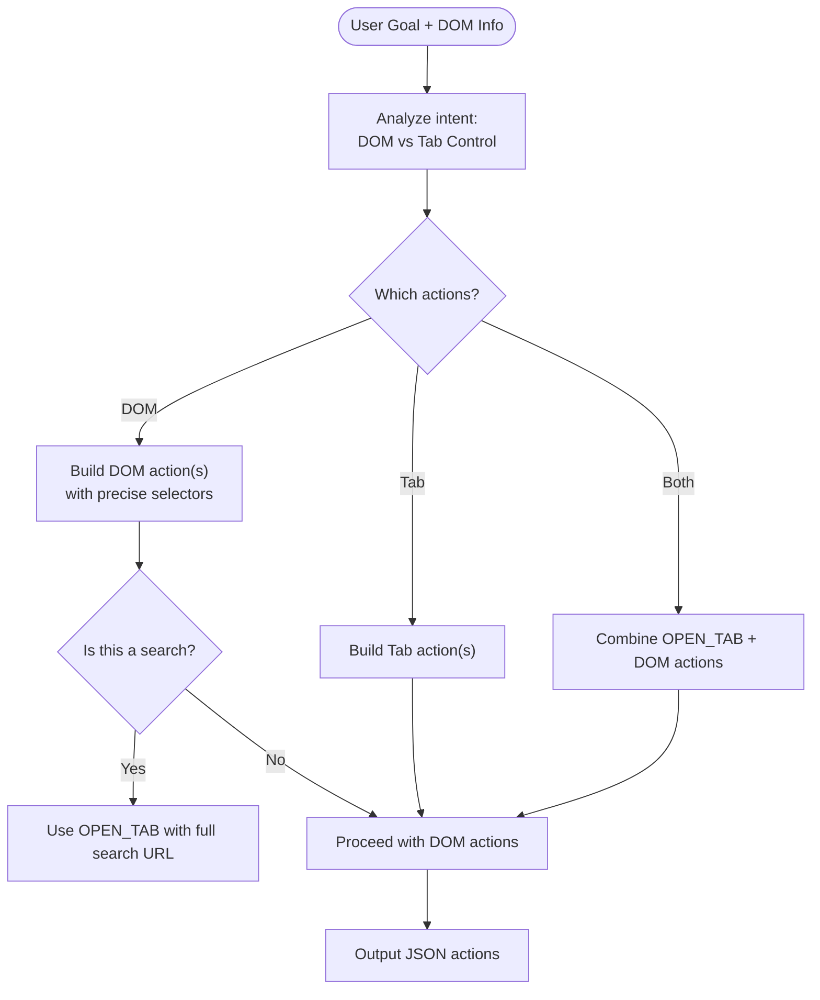
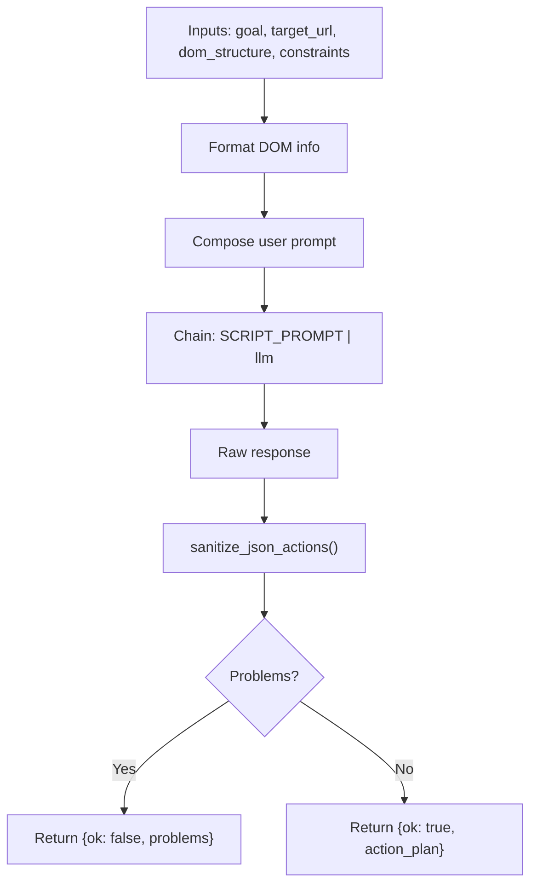
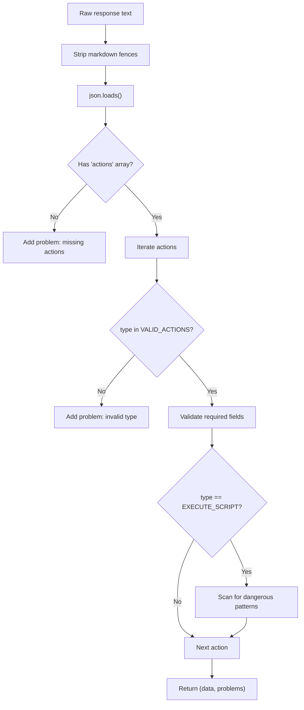
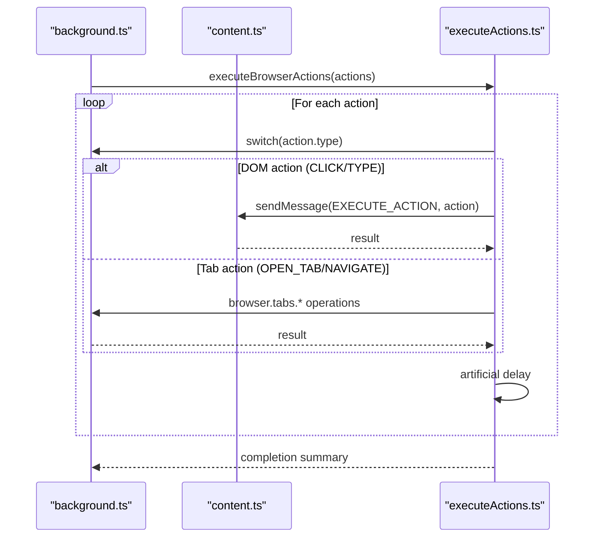
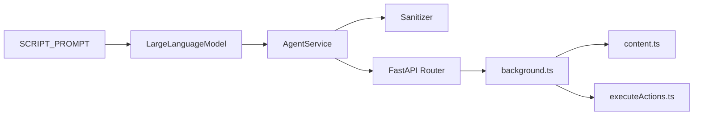

# Browser Automation Prompts

<cite>
**Referenced Files in This Document**
- [prompts/browser_use.py](file://prompts/browser_use.py)
- [services/browser_use_service.py](file://services/browser_use_service.py)
- [tools/browser_use/tool.py](file://tools/browser_use/tool.py)
- [routers/browser_use.py](file://routers/browser_use.py)
- [models/requests/agent.py](file://models/requests/agent.py)
- [models/response/agent.py](file://models/response/agent.py)
- [utils/agent_sanitizer.py](file://utils/agent_sanitizer.py)
- [core/llm.py](file://core/llm.py)
- [extension/entrypoints/utils/executeActions.ts](file://extension/entrypoints/utils/executeActions.ts)
- [extension/entrypoints/background.ts](file://extension/entrypoints/background.ts)
- [extension/entrypoints/content.ts](file://extension/entrypoints/content.ts)
- [extension/entrypoints/utils/parseAgentCommand.ts](file://extension/entrypoints/utils/parseAgentCommand.ts)
- [prompts/prompt_injection_validator.py](file://prompts/prompt_injection_validator.py)
- [README.md](file://README.md)
</cite>

## Table of Contents
1. [Introduction](#introduction)
2. [Project Structure](#project-structure)
3. [Core Components](#core-components)
4. [Architecture Overview](#architecture-overview)
5. [Detailed Component Analysis](#detailed-component-analysis)
6. [Dependency Analysis](#dependency-analysis)
7. [Performance Considerations](#performance-considerations)
8. [Troubleshooting Guide](#troubleshooting-guide)
9. [Conclusion](#conclusion)
10. [Appendices](#appendices)

## Introduction
This document explains the browser automation prompt system used to translate natural language commands into executable browser actions. It covers the prompt templates that guide the model to produce JSON action plans, the validation and sanitization pipeline, and the end-to-end execution flow from API to browser automation. It also documents error recovery strategies, safety validations, prompt optimization for browser compatibility, and integration with the broader agent ecosystem.

## Project Structure
The browser automation capability spans:
- Prompt definition and chaining for action generation
- Service layer orchestrating LLM invocation and response sanitization
- FastAPI router exposing the generation endpoint
- Tool wrapper for structured tool usage
- Browser extension background/content scripts for action execution
- Utilities for safety validation and prompt injection checks

**Diagram sources**
- [routers/browser_use.py](file://routers/browser_use.py#L16-L44)
- [services/browser_use_service.py](file://services/browser_use_service.py#L12-L95)
- [core/llm.py](file://core/llm.py#L78-L205)
- [prompts/browser_use.py](file://prompts/browser_use.py#L5-L133)
- [utils/agent_sanitizer.py](file://utils/agent_sanitizer.py#L20-L96)
- [extension/entrypoints/background.ts](file://extension/entrypoints/background.ts#L470-L514)
- [extension/entrypoints/utils/executeActions.ts](file://extension/entrypoints/utils/executeActions.ts#L1-L56)
- [extension/entrypoints/content.ts](file://extension/entrypoints/content.ts#L220-L323)

**Section sources**
- [README.md](file://README.md#L23-L76)
- [routers/browser_use.py](file://routers/browser_use.py#L1-L51)
- [services/browser_use_service.py](file://services/browser_use_service.py#L1-L96)
- [prompts/browser_use.py](file://prompts/browser_use.py#L1-L138)
- [utils/agent_sanitizer.py](file://utils/agent_sanitizer.py#L1-L119)
- [extension/entrypoints/background.ts](file://extension/entrypoints/background.ts#L1-L1642)
- [extension/entrypoints/utils/executeActions.ts](file://extension/entrypoints/utils/executeActions.ts#L1-L57)
- [extension/entrypoints/content.ts](file://extension/entrypoints/content.ts#L1-L326)

## Core Components
- Prompt template for action planning: Defines available actions, selector precedence, and critical rules for DOM vs tab control actions.
- Agent service: Formats DOM context, invokes the LLM, parses and validates the JSON action plan, and returns sanitized results.
- Sanitizer: Validates JSON structure, required fields per action type, and safety constraints for custom scripts.
- LLM adapter: Provides a model-agnostic client supporting multiple providers and base URLs.
- Router and tool: Expose the generation endpoint and wrap it as a structured tool for agent workflows.
- Extension execution: Background and content scripts execute actions on the active tab, with content helpers for DOM-level operations.

**Section sources**
- [prompts/browser_use.py](file://prompts/browser_use.py#L5-L133)
- [services/browser_use_service.py](file://services/browser_use_service.py#L12-L95)
- [utils/agent_sanitizer.py](file://utils/agent_sanitizer.py#L20-L96)
- [core/llm.py](file://core/llm.py#L78-L205)
- [routers/browser_use.py](file://routers/browser_use.py#L16-L44)
- [tools/browser_use/tool.py](file://tools/browser_use/tool.py#L27-L48)
- [extension/entrypoints/background.ts](file://extension/entrypoints/background.ts#L470-L514)
- [extension/entrypoints/utils/executeActions.ts](file://extension/entrypoints/utils/executeActions.ts#L1-L56)
- [extension/entrypoints/content.ts](file://extension/entrypoints/content.ts#L220-L323)

## Architecture Overview
End-to-end flow from natural language to browser execution:

**Diagram sources**
- [routers/browser_use.py](file://routers/browser_use.py#L16-L44)
- [services/browser_use_service.py](file://services/browser_use_service.py#L12-L95)
- [core/llm.py](file://core/llm.py#L78-L205)
- [utils/agent_sanitizer.py](file://utils/agent_sanitizer.py#L20-L96)
- [extension/entrypoints/background.ts](file://extension/entrypoints/background.ts#L470-L514)
- [extension/entrypoints/content.ts](file://extension/entrypoints/content.ts#L220-L323)

## Detailed Component Analysis

### Prompt Template and Action Planning
- Purpose: Provide a precise, structured prompt that instructs the model to output a JSON action plan containing atomic actions.
- Available actions: DOM manipulation (click, type, scroll, wait, select, execute_script) and tab/window control (open_tab, close_tab, switch_tab, navigate, reload_tab, duplicate_tab).
- Selector guidance: Encourages using the most specific and reliable selectors from the provided DOM structure.
- Search-first strategy: Prefers constructing full search URLs directly in OPEN_TAB actions rather than opening blank pages and typing.
- Critical rules: Clear separation between DOM actions (on http/https) and tab control actions; emphasize descriptions and atomicity.

**Diagram sources**
- [prompts/browser_use.py](file://prompts/browser_use.py#L89-L116)

**Section sources**
- [prompts/browser_use.py](file://prompts/browser_use.py#L5-L133)

### Agent Service: Prompt Assembly and Validation
- Assembles a user prompt including goal, target URL, constraints, and formatted DOM information.
- Invokes the LLM via a chained prompt-to-LLM pipeline.
- Parses the raw response and sanitizes/validates the JSON action plan.
- Returns structured results with validation problems or the sanitized action plan.

**Diagram sources**
- [services/browser_use_service.py](file://services/browser_use_service.py#L12-L95)
- [utils/agent_sanitizer.py](file://utils/agent_sanitizer.py#L20-L96)

**Section sources**
- [services/browser_use_service.py](file://services/browser_use_service.py#L12-L95)
- [models/requests/agent.py](file://models/requests/agent.py#L5-L10)
- [models/response/agent.py](file://models/response/agent.py#L5-L11)

### Sanitizer and Safety Validation
- Removes markdown fences and normalizes JSON.
- Validates presence of actions array, non-empty list, and per-action fields.
- Enforces required fields per action type (e.g., selector for click/type/select, url for open_tab/navigate, tabId/direction for switch_tab).
- Custom script safety: Scans for dangerous patterns and flags them as problems.

**Diagram sources**
- [utils/agent_sanitizer.py](file://utils/agent_sanitizer.py#L20-L96)

**Section sources**
- [utils/agent_sanitizer.py](file://utils/agent_sanitizer.py#L20-L96)

### LLM Adapter and Provider Support
- Supports multiple providers (Google, OpenAI, Anthropic, Ollama, DeepSeek, OpenRouter) with configurable models and base URLs.
- Initializes the LangChain chat model client and exposes a shared llm instance.

**Section sources**
- [core/llm.py](file://core/llm.py#L21-L75)
- [core/llm.py](file://core/llm.py#L78-L205)

### API Endpoint and Tool Wrapper
- FastAPI endpoint validates inputs and delegates to the AgentService.
- Structured tool wraps the generation for agent workflows with typed inputs.

**Section sources**
- [routers/browser_use.py](file://routers/browser_use.py#L16-L44)
- [tools/browser_use/tool.py](file://tools/browser_use/tool.py#L27-L48)
- [models/requests/agent.py](file://models/requests/agent.py#L5-L10)
- [models/response/agent.py](file://models/response/agent.py#L5-L11)

### Extension Execution: From Plan to DOM
- Background script runs generated action plans, injecting content scripts and sending messages for DOM-level actions.
- Content script performs simple keyword-based actions and can be extended for more precise DOM manipulation.
- Utility executes a list of actions sequentially with delays and error handling.

**Diagram sources**
- [extension/entrypoints/utils/executeActions.ts](file://extension/entrypoints/utils/executeActions.ts#L1-L56)
- [extension/entrypoints/background.ts](file://extension/entrypoints/background.ts#L470-L514)
- [extension/entrypoints/content.ts](file://extension/entrypoints/content.ts#L220-L323)

**Section sources**
- [extension/entrypoints/background.ts](file://extension/entrypoints/background.ts#L470-L514)
- [extension/entrypoints/utils/executeActions.ts](file://extension/entrypoints/utils/executeActions.ts#L1-L56)
- [extension/entrypoints/content.ts](file://extension/entrypoints/content.ts#L220-L323)

### Prompt Injection Safety
- Dedicated validator prompt determines whether provided markdown text contains prompt injection attempts.
- Returns a simple safety verdict suitable for gating downstream processing.

**Section sources**
- [prompts/prompt_injection_validator.py](file://prompts/prompt_injection_validator.py#L1-L16)

### Command Parsing for Agent Invocation
- Utility parses slash-command-style inputs into agent and action selection stages, enabling structured tool invocation.

**Section sources**
- [extension/entrypoints/utils/parseAgentCommand.ts](file://extension/entrypoints/utils/parseAgentCommand.ts#L5-L86)

## Dependency Analysis
- Prompt-to-LLM pipeline: The service composes a ChatPromptTemplate and pipes it to the LLM client.
- Validation dependency: The sanitizer is invoked immediately after LLM response parsing.
- Execution dependency: The background script depends on the content script for DOM-level actions and uses browser APIs for tab-level actions.

**Diagram sources**
- [prompts/browser_use.py](file://prompts/browser_use.py#L5-L133)
- [core/llm.py](file://core/llm.py#L78-L205)
- [services/browser_use_service.py](file://services/browser_use_service.py#L12-L95)
- [utils/agent_sanitizer.py](file://utils/agent_sanitizer.py#L20-L96)
- [routers/browser_use.py](file://routers/browser_use.py#L16-L44)
- [extension/entrypoints/background.ts](file://extension/entrypoints/background.ts#L470-L514)
- [extension/entrypoints/utils/executeActions.ts](file://extension/entrypoints/utils/executeActions.ts#L1-L56)
- [extension/entrypoints/content.ts](file://extension/entrypoints/content.ts#L220-L323)

**Section sources**
- [prompts/browser_use.py](file://prompts/browser_use.py#L5-L133)
- [services/browser_use_service.py](file://services/browser_use_service.py#L12-L95)
- [utils/agent_sanitizer.py](file://utils/agent_sanitizer.py#L20-L96)
- [routers/browser_use.py](file://routers/browser_use.py#L16-L44)
- [extension/entrypoints/background.ts](file://extension/entrypoints/background.ts#L470-L514)
- [extension/entrypoints/utils/executeActions.ts](file://extension/entrypoints/utils/executeActions.ts#L1-L56)
- [extension/entrypoints/content.ts](file://extension/entrypoints/content.ts#L220-L323)

## Performance Considerations
- Token efficiency: Limit interactive element listings to reduce prompt size and cost.
- Atomic actions: Keep each action small and focused to improve reliability and reduce retries.
- Delays and waits: Introduce minimal artificial delays between actions to accommodate page loading; tune based on observed latency.
- Provider selection: Choose providers and models aligned with latency and cost targets; adjust temperature for determinism.
- Caching: Consider caching repeated DOM structures or frequently used search URLs to minimize recomputation.

[No sources needed since this section provides general guidance]

## Troubleshooting Guide
Common issues and remedies:
- Invalid JSON or missing fields: The sanitizer reports missing actions array, empty actions, or required fields per action type. Fix the prompt instructions or model behavior to adhere to the schema.
- Dangerous script patterns: EXECUTE_SCRIPT actions with unsafe patterns are flagged. Replace with safer alternatives or remove.
- DOM action on chrome:// pages: The prompt explicitly forbids DOM actions on chrome:// URLs. Use tab control actions instead.
- Selector mismatches: Ensure selectors are derived from the provided DOM structure and match the page context.
- Execution timeouts: The background script waits for navigation/reload completion; add explicit WAIT actions when appropriate.

**Section sources**
- [utils/agent_sanitizer.py](file://utils/agent_sanitizer.py#L20-L96)
- [prompts/browser_use.py](file://prompts/browser_use.py#L89-L116)
- [services/browser_use_service.py](file://services/browser_use_service.py#L72-L95)
- [extension/entrypoints/background.ts](file://extension/entrypoints/background.ts#L541-L800)

## Conclusion
The browser automation prompt system couples a precise, structured prompt with robust validation and execution layers. By enforcing clear action types, selector precedence, and safety rules, it reliably translates natural language into executable browser scripts. The modular design enables provider flexibility, easy debugging, and extensibility for diverse browser contexts.

[No sources needed since this section summarizes without analyzing specific files]

## Appendices

### Prompt Variations Across Browser Contexts
- Search-heavy tasks: Prefer OPEN_TAB with constructed search URLs to avoid typing on chrome:// pages.
- Form-filling scenarios: Use TYPE with precise selectors; ensure the target is an http/https site.
- Navigation-heavy workflows: Combine OPEN_TAB with WAIT and subsequent DOM actions for robustness.
- Multi-tab workflows: Use SWITCH_TAB and CLOSE_TAB thoughtfully, ensuring tab IDs are valid.

**Section sources**
- [prompts/browser_use.py](file://prompts/browser_use.py#L110-L116)
- [prompts/browser_use.py](file://prompts/browser_use.py#L94-L107)

### Prompt Versioning and Adaptation
- Version the prompt template by incrementing identifiers and maintaining backward-compatible examples.
- Adapt selector guidance per site patterns (e.g., contenteditable, aria-labels) while preserving core rules.
- Maintain separate templates for specialized contexts (e.g., chat interfaces) with tailored examples.

**Section sources**
- [prompts/browser_use.py](file://prompts/browser_use.py#L28-L88)

### Integration with the Broader Agent System
- The tool wrapper integrates the browser action agent into agent workflows with typed inputs.
- The router exposes a standardized endpoint for external clients.
- The extension’s background/content scripts provide a bridge between model-declared actions and browser APIs.

**Section sources**
- [tools/browser_use/tool.py](file://tools/browser_use/tool.py#L27-L48)
- [routers/browser_use.py](file://routers/browser_use.py#L16-L44)
- [extension/entrypoints/background.ts](file://extension/entrypoints/background.ts#L470-L514)
- [extension/entrypoints/content.ts](file://extension/entrypoints/content.ts#L220-L323)