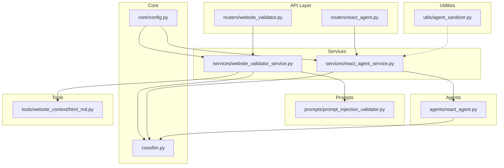
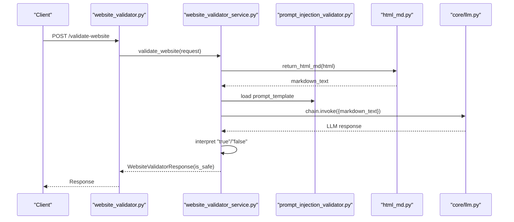
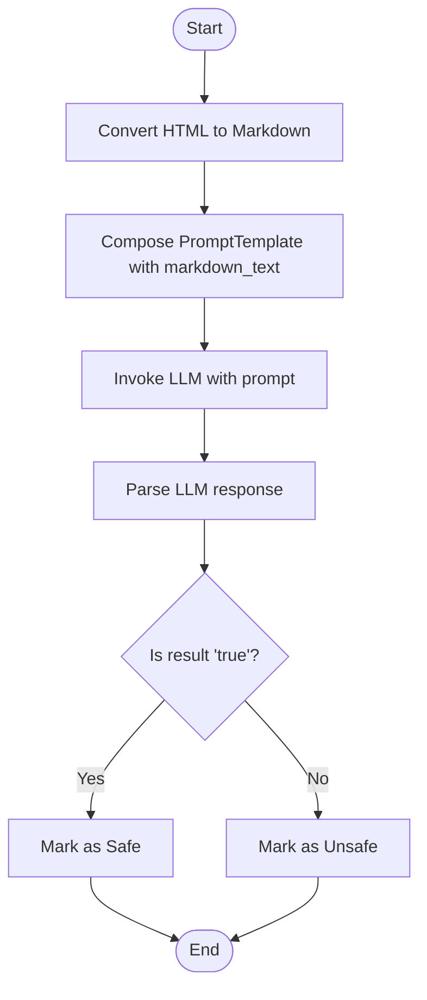
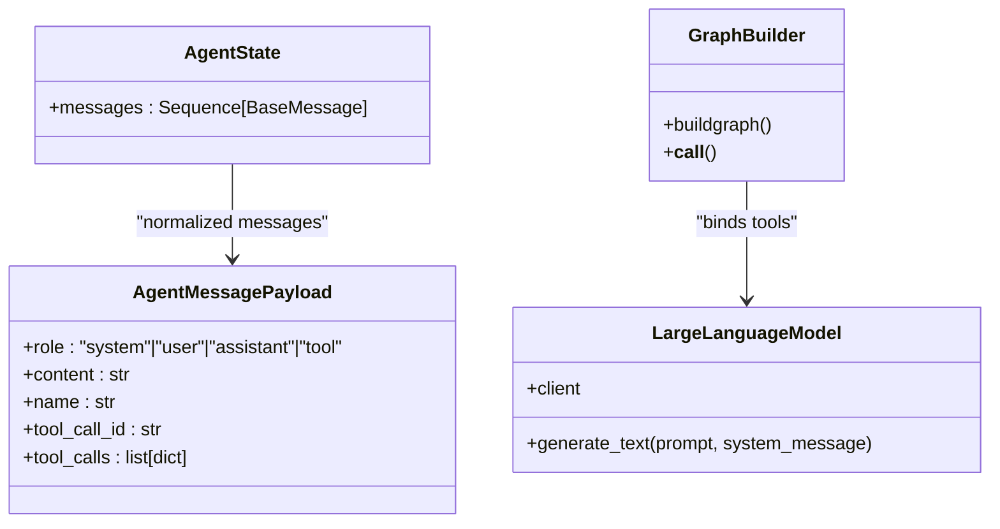
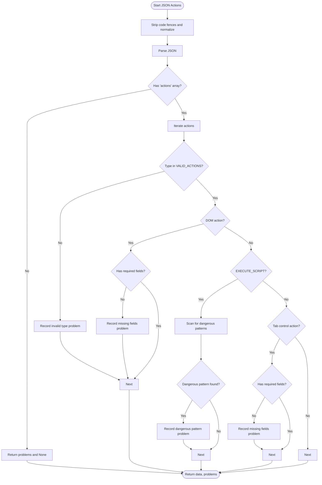
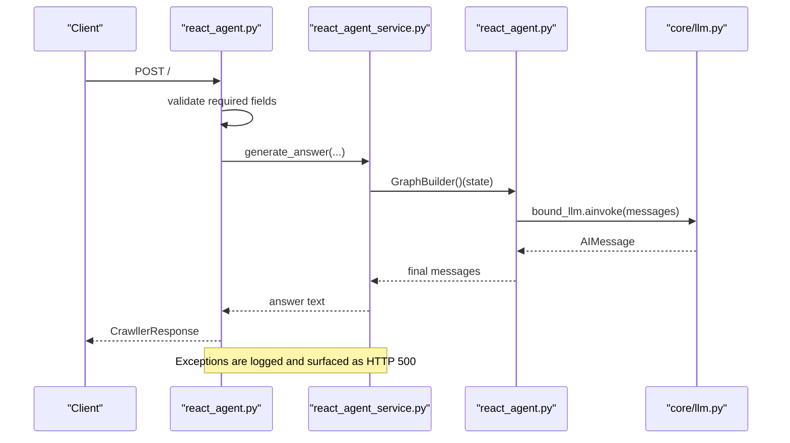
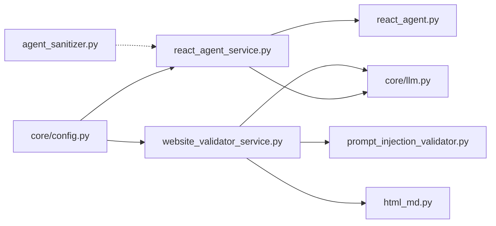

# Prompt Security and Validation

<cite>
**Referenced Files in This Document**
- [prompt_injection_validator.py](file://prompts/prompt_injection_validator.py)
- [website_validator_service.py](file://services/website_validator_service.py)
- [website_validator.py](file://routers/website_validator.py)
- [agent_sanitizer.py](file://utils/agent_sanitizer.py)
- [react_agent.py](file://agents/react_agent.py)
- [react_agent_service.py](file://services/react_agent_service.py)
- [crawller.py](file://models/requests/crawller.py)
- [llm.py](file://core/llm.py)
- [config.py](file://core/config.py)
- [html_md.py](file://tools/website_context/html_md.py)
</cite>

## Table of Contents
1. [Introduction](#introduction)
2. [Project Structure](#project-structure)
3. [Core Components](#core-components)
4. [Architecture Overview](#architecture-overview)
5. [Detailed Component Analysis](#detailed-component-analysis)
6. [Dependency Analysis](#dependency-analysis)
7. [Performance Considerations](#performance-considerations)
8. [Troubleshooting Guide](#troubleshooting-guide)
9. [Conclusion](#conclusion)
10. [Appendices](#appendices)

## Introduction
This document focuses on prompt security and injection prevention mechanisms implemented in the codebase. It explains how the system detects and mitigates prompt injection risks, sanitizes inputs for agents and external data sources, and enforces guardrails to prevent prompt poisoning, jailbreaking attempts, and malicious input exploitation. It also documents validation rules, logging and error handling for suspicious inputs, and secure prompt construction guidelines, along with integration points across the backend and agent workflows.

## Project Structure
Security-relevant components are organized across prompts, services, routers, agents, utilities, and core infrastructure:
- Prompts define the instruction templates used to detect prompt injection.
- Services orchestrate validation and agent generation, including logging and error handling.
- Routers expose endpoints for validation and agent execution.
- Agents encapsulate the reasoning graph and message normalization.
- Utilities provide sanitization for JSON action plans and legacy JS validation.
- Core modules manage LLM providers and logging configuration.

**Diagram sources**
- [website_validator.py](file://routers/website_validator.py#L1-L15)
- [react_agent.py](file://routers/react_agent.py#L1-L57)
- [website_validator_service.py](file://services/website_validator_service.py#L1-L38)
- [react_agent_service.py](file://services/react_agent_service.py#L1-L154)
- [prompt_injection_validator.py](file://prompts/prompt_injection_validator.py#L1-L16)
- [react_agent.py](file://agents/react_agent.py#L1-L191)
- [agent_sanitizer.py](file://utils/agent_sanitizer.py#L1-L119)
- [llm.py](file://core/llm.py#L1-L215)
- [config.py](file://core/config.py#L1-L26)
- [html_md.py](file://tools/website_context/html_md.py#L1-L27)

**Section sources**
- [website_validator.py](file://routers/website_validator.py#L1-L15)
- [react_agent.py](file://routers/react_agent.py#L1-L57)
- [website_validator_service.py](file://services/website_validator_service.py#L1-L38)
- [react_agent_service.py](file://services/react_agent_service.py#L1-L154)
- [prompt_injection_validator.py](file://prompts/prompt_injection_validator.py#L1-L16)
- [react_agent.py](file://agents/react_agent.py#L1-L191)
- [agent_sanitizer.py](file://utils/agent_sanitizer.py#L1-L119)
- [llm.py](file://core/llm.py#L1-L215)
- [config.py](file://core/config.py#L1-L26)
- [html_md.py](file://tools/website_context/html_md.py#L1-L27)

## Core Components
- Prompt Injection Validator: A dedicated prompt template instructs the LLM to classify website content as safe or unsafe for prompt injection.
- Website Validator Service: Converts HTML to Markdown, constructs a validation chain, and interprets LLM output to produce a safety decision.
- Agent Sanitizer: Validates and sanitizes JSON action plans produced by the agent to prevent unsafe browser actions and script execution.
- React Agent and Service: Orchestrate message handling, optional file processing, and context injection from client HTML, with logging and error handling.
- LLM Provider Abstraction: Centralizes provider selection, model configuration, and error handling for LLM calls.
- Logging and Configuration: Global logging level and logger factory enable consistent security event logging.

**Section sources**
- [prompt_injection_validator.py](file://prompts/prompt_injection_validator.py#L1-L16)
- [website_validator_service.py](file://services/website_validator_service.py#L1-L38)
- [agent_sanitizer.py](file://utils/agent_sanitizer.py#L1-L119)
- [react_agent_service.py](file://services/react_agent_service.py#L1-L154)
- [react_agent.py](file://agents/react_agent.py#L1-L191)
- [llm.py](file://core/llm.py#L1-L215)
- [config.py](file://core/config.py#L1-L26)

## Architecture Overview
The system integrates three major security flows:
- Website Content Safety: HTML → Markdown → Prompt Injection Classification → Safety Decision
- Agent Action Safety: Agent-generated JSON → Sanitization → Execution Guardrails
- Agent Prompt Safety: System prompt and context injection guarded by normalized messages and provider configuration

**Diagram sources**
- [website_validator.py](file://routers/website_validator.py#L1-L15)
- [website_validator_service.py](file://services/website_validator_service.py#L1-L38)
- [prompt_injection_validator.py](file://prompts/prompt_injection_validator.py#L1-L16)
- [html_md.py](file://tools/website_context/html_md.py#L1-L27)
- [llm.py](file://core/llm.py#L1-L215)

## Detailed Component Analysis

### Prompt Injection Validator Implementation
- Purpose: Determine whether website content may contain prompt injection attempts that could manipulate LLM behavior.
- Template Design: The prompt instructs the LLM to analyze content and respond with a simple boolean classification.
- Validation Chain: The service composes a LangChain prompt with the LLM and extracts a single “true” or “false” response to decide safety.

**Diagram sources**
- [website_validator_service.py](file://services/website_validator_service.py#L17-L37)
- [prompt_injection_validator.py](file://prompts/prompt_injection_validator.py#L1-L16)
- [html_md.py](file://tools/website_context/html_md.py#L5-L11)

**Section sources**
- [prompt_injection_validator.py](file://prompts/prompt_injection_validator.py#L1-L16)
- [website_validator_service.py](file://services/website_validator_service.py#L17-L37)
- [html_md.py](file://tools/website_context/html_md.py#L5-L11)

### Agent Prompt Safety and Message Normalization
- System Prompt: A controlled system message guides the agent’s behavior and credentials handling.
- Message Normalization: Messages are normalized to ensure consistent content representation across roles.
- Graph Execution: The compiled LangGraph workflow ensures deterministic agent behavior and consistent message handling.

**Diagram sources**
- [react_agent.py](file://agents/react_agent.py#L40-L121)
- [react_agent.py](file://agents/react_agent.py#L138-L180)
- [llm.py](file://core/llm.py#L78-L205)

**Section sources**
- [react_agent.py](file://agents/react_agent.py#L25-L34)
- [react_agent.py](file://agents/react_agent.py#L52-L77)
- [react_agent.py](file://agents/react_agent.py#L123-L180)
- [llm.py](file://core/llm.py#L78-L205)

### Agent Action Sanitization and Mitigation Strategies
- JSON Action Plan Validation: Ensures presence of required fields, validates action types, and checks required parameters per action category.
- Script Safety Checks: Detects potentially dangerous patterns in custom scripts to prevent unsafe execution.
- Legacy JS Validation: Provides a secondary filter for legacy JS patterns.

**Diagram sources**
- [agent_sanitizer.py](file://utils/agent_sanitizer.py#L20-L95)

**Section sources**
- [agent_sanitizer.py](file://utils/agent_sanitizer.py#L20-L95)

### Endpoint Security and Error Handling
- Website Validation Endpoint: Exposes a POST endpoint that delegates to the validator service and returns a safety decision.
- Agent Endpoint: Validates request fields, invokes the agent service, and handles exceptions with logging and HTTP error responses.

**Diagram sources**
- [react_agent.py](file://routers/react_agent.py#L18-L56)
- [react_agent_service.py](file://services/react_agent_service.py#L17-L154)
- [react_agent.py](file://agents/react_agent.py#L123-L190)
- [llm.py](file://core/llm.py#L171-L190)

**Section sources**
- [website_validator.py](file://routers/website_validator.py#L12-L14)
- [react_agent.py](file://routers/react_agent.py#L18-L56)
- [react_agent_service.py](file://services/react_agent_service.py#L17-L154)

## Dependency Analysis
- Website Validator depends on:
  - HTML-to-Markdown conversion
  - Prompt template for injection detection
  - LLM client for classification
- Agent Service depends on:
  - GraphBuilder for workflow compilation
  - LLM client for generation
  - Logging for security event capture
- Agent Sanitizer is independent but integrates with agent action outputs.
- LLM Provider abstraction centralizes provider selection and error handling.

**Diagram sources**
- [website_validator_service.py](file://services/website_validator_service.py#L1-L38)
- [prompt_injection_validator.py](file://prompts/prompt_injection_validator.py#L1-L16)
- [html_md.py](file://tools/website_context/html_md.py#L1-L27)
- [llm.py](file://core/llm.py#L1-L215)
- [react_agent_service.py](file://services/react_agent_service.py#L1-L154)
- [react_agent.py](file://agents/react_agent.py#L1-L191)
- [agent_sanitizer.py](file://utils/agent_sanitizer.py#L1-L119)
- [config.py](file://core/config.py#L1-L26)

**Section sources**
- [website_validator_service.py](file://services/website_validator_service.py#L1-L38)
- [react_agent_service.py](file://services/react_agent_service.py#L1-L154)
- [agent_sanitizer.py](file://utils/agent_sanitizer.py#L1-L119)
- [llm.py](file://core/llm.py#L1-L215)
- [config.py](file://core/config.py#L1-L26)

## Performance Considerations
- Prompt Injection Detection: The validation chain performs a single LLM invocation per request; keep prompt concise and avoid excessive context to minimize latency.
- Agent Workflows: Graph caching via LRU reduces repeated compilation overhead; ensure message normalization avoids unnecessary conversions.
- Sanitization: Regex-based checks are linear in input size; keep action plans minimal and avoid overly complex scripts.
- Logging: Configure appropriate log levels to balance observability and performance.

[No sources needed since this section provides general guidance]

## Troubleshooting Guide
Common issues and remediation steps:
- Validation returns unexpected results:
  - Verify HTML input is well-formed and not empty.
  - Confirm the LLM provider is configured and reachable.
  - Check that the prompt template remains unchanged and the response format matches expectations.
- Agent action plan errors:
  - Ensure required fields are present for each action type.
  - Review dangerous script patterns flagged by sanitization.
  - Validate that action types are part of the allowed set.
- Endpoint failures:
  - Inspect router-level HTTP exceptions and service logs.
  - Confirm environment variables for API keys and base URLs are set.
- Logging:
  - Adjust logging level via configuration and review logs for security events.

**Section sources**
- [website_validator_service.py](file://services/website_validator_service.py#L17-L37)
- [agent_sanitizer.py](file://utils/agent_sanitizer.py#L20-L95)
- [react_agent.py](file://routers/react_agent.py#L43-L56)
- [llm.py](file://core/llm.py#L121-L155)
- [config.py](file://core/config.py#L16-L25)

## Conclusion
The system employs a layered security approach: HTML-to-Markdown conversion and LLM-based classification for prompt injection detection, strict JSON action plan validation with script safety checks, and robust logging and error handling across endpoints and agent workflows. These measures collectively reduce the risk of prompt poisoning, jailbreaking, and malicious input exploitation while maintaining flexibility and performance.

[No sources needed since this section summarizes without analyzing specific files]

## Appendices

### Validation Rules and Threat Modeling
- Prompt Injection Detection:
  - Input: Website HTML
  - Transformation: HTML → Markdown
  - Output: Boolean classification indicating safety
- Agent Action Validation:
  - Required fields per action type
  - Allowed action categories
  - Script pattern scanning for dangerous constructs
- Threat Modeling Approaches:
  - Principle of least privilege for actions
  - Separation of concerns between content parsing and safety decisions
  - Defensive logging and HTTP error surfacing

**Section sources**
- [prompt_injection_validator.py](file://prompts/prompt_injection_validator.py#L1-L16)
- [website_validator_service.py](file://services/website_validator_service.py#L17-L37)
- [agent_sanitizer.py](file://utils/agent_sanitizer.py#L20-L95)

### Secure Prompt Construction Guidelines
- Keep system prompts concise and explicit about prohibited behaviors.
- Avoid exposing internal instructions or model internals in user-facing prompts.
- Use structured outputs (e.g., single-word classifications) to reduce ambiguity.
- Inject only sanitized context and avoid raw user-provided HTML or scripts.

**Section sources**
- [react_agent.py](file://agents/react_agent.py#L25-L34)
- [website_validator_service.py](file://services/website_validator_service.py#L17-L37)
- [agent_sanitizer.py](file://utils/agent_sanitizer.py#L63-L74)

### Integration with the Broader Security Framework
- Logging: Centralized logger factory and environment-based log levels.
- Providers: Unified LLM provider configuration with explicit error handling.
- Endpoints: Clear separation of validation and agent execution routes.

**Section sources**
- [config.py](file://core/config.py#L16-L25)
- [llm.py](file://core/llm.py#L78-L205)
- [react_agent.py](file://routers/react_agent.py#L1-L57)
- [website_validator.py](file://routers/website_validator.py#L1-L15)