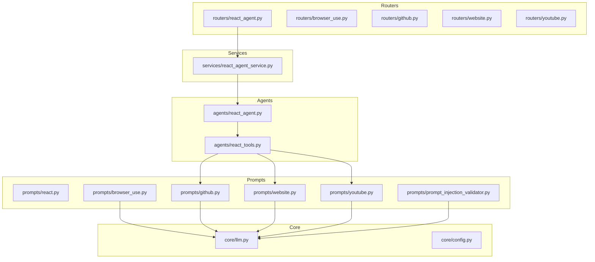
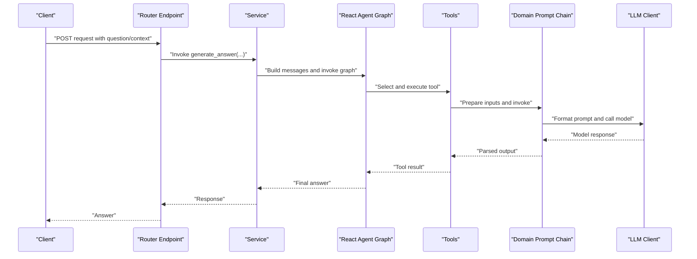
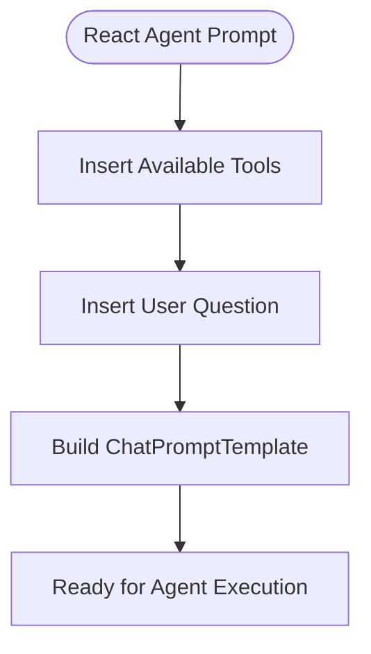
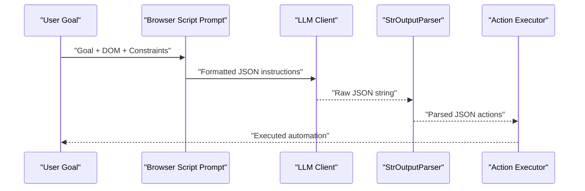
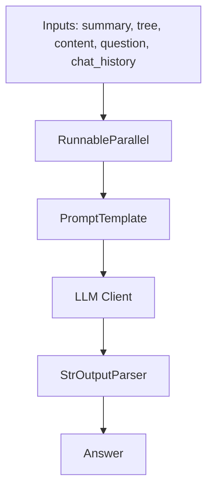
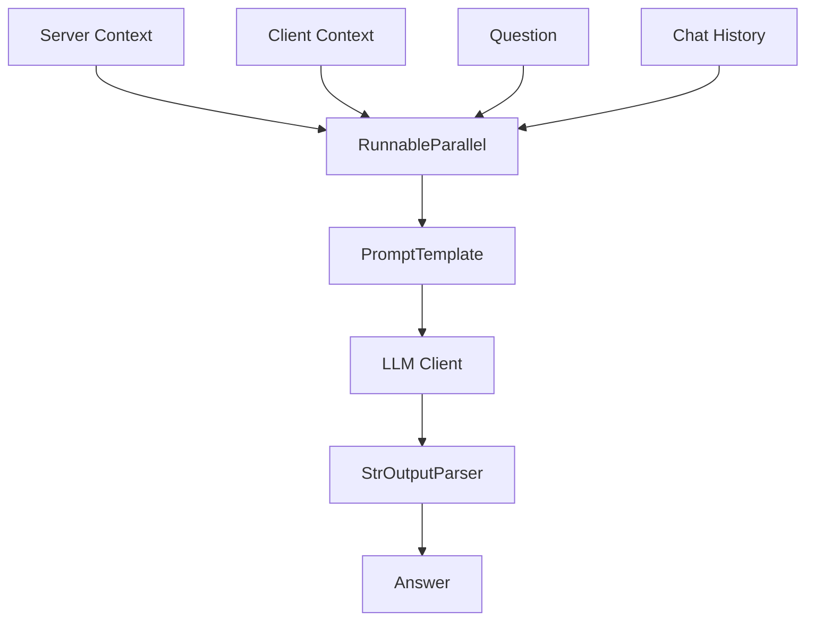
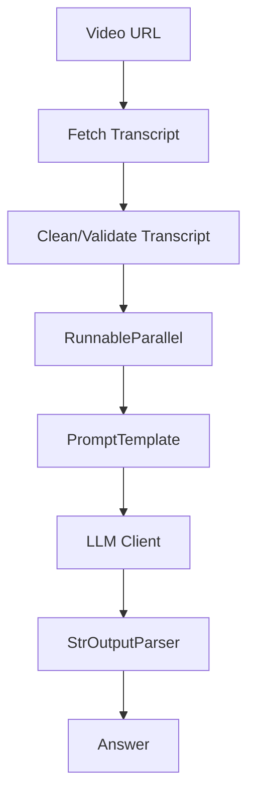
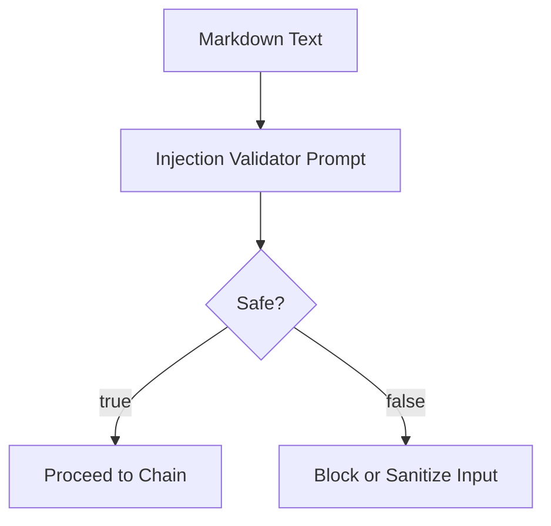
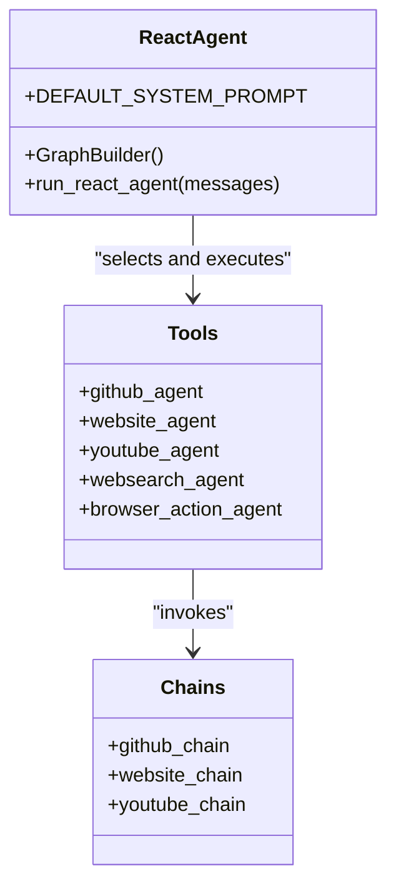
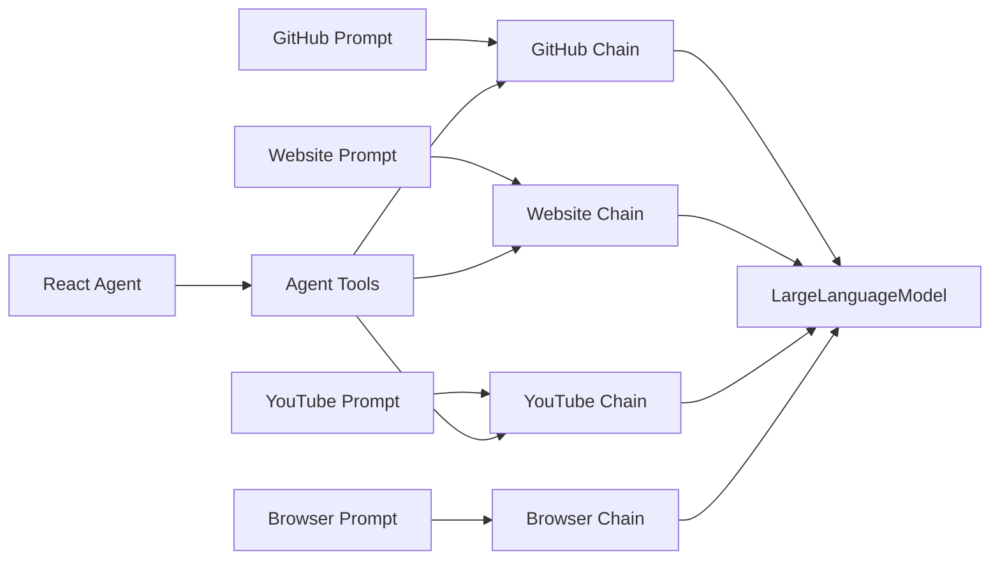

# Prompts and Prompt Engineering

<cite>
**Referenced Files in This Document**
- [prompts/react.py](file://prompts/react.py)
- [prompts/browser_use.py](file://prompts/browser_use.py)
- [prompts/github.py](file://prompts/github.py)
- [prompts/website.py](file://prompts/website.py)
- [prompts/youtube.py](file://prompts/youtube.py)
- [prompts/prompt_injection_validator.py](file://prompts/prompt_injection_validator.py)
- [agents/react_agent.py](file://agents/react_agent.py)
- [agents/react_tools.py](file://agents/react_tools.py)
- [services/react_agent_service.py](file://services/react_agent_service.py)
- [routers/react_agent.py](file://routers/react_agent.py)
- [routers/browser_use.py](file://routers/browser_use.py)
- [routers/github.py](file://routers/github.py)
- [routers/website.py](file://routers/website.py)
- [routers/youtube.py](file://routers/youtube.py)
- [core/llm.py](file://core/llm.py)
- [core/config.py](file://core/config.py)
</cite>

## Table of Contents
1. [Introduction](#introduction)
2. [Project Structure](#project-structure)
3. [Core Components](#core-components)
4. [Architecture Overview](#architecture-overview)
5. [Detailed Component Analysis](#detailed-component-analysis)
6. [Dependency Analysis](#dependency-analysis)
7. [Performance Considerations](#performance-considerations)
8. [Troubleshooting Guide](#troubleshooting-guide)
9. [Conclusion](#conclusion)
10. [Appendices](#appendices)

## Introduction
This document explains the Prompts and Prompt Engineering system used across the platform. It covers how domain-specific prompts are organized and managed for different agent capabilities, including React agents, browser automation, GitHub integration, website analysis, and YouTube processing. It also documents the prompt injection validation system, security measures, prompt optimization techniques, template system design, dynamic prompt generation patterns, and the relationship between prompts and agent behavior, tool selection, and response quality. Finally, it provides best practices, A/B testing approaches, performance optimization, versioning and localization considerations, debugging techniques, and guidelines for creating effective prompts.

## Project Structure
The prompt system is organized by domain and capability:
- Domain prompts live under prompts/ and define reusable prompt templates and chains.
- Agent orchestration lives under agents/ and integrates tools and prompts into workflows.
- Routers and services expose endpoints and coordinate prompt-driven processing.
- LLM configuration and environment are centralized in core/.

**Diagram sources**
- [prompts/react.py](file://prompts/react.py#L1-L21)
- [prompts/browser_use.py](file://prompts/browser_use.py#L1-L138)
- [prompts/github.py](file://prompts/github.py#L1-L110)
- [prompts/website.py](file://prompts/website.py#L1-L115)
- [prompts/youtube.py](file://prompts/youtube.py#L1-L158)
- [prompts/prompt_injection_validator.py](file://prompts/prompt_injection_validator.py#L1-L16)
- [agents/react_agent.py](file://agents/react_agent.py#L1-L191)
- [agents/react_tools.py](file://agents/react_tools.py#L1-L721)
- [services/react_agent_service.py](file://services/react_agent_service.py#L1-L154)
- [routers/react_agent.py](file://routers/react_agent.py#L1-L57)
- [routers/browser_use.py](file://routers/browser_use.py#L1-L51)
- [routers/github.py](file://routers/github.py#L1-L49)
- [routers/website.py](file://routers/website.py#L1-L43)
- [routers/youtube.py](file://routers/youtube.py#L1-L59)
- [core/llm.py](file://core/llm.py#L1-L215)
- [core/config.py](file://core/config.py#L1-L26)

**Section sources**
- [prompts/react.py](file://prompts/react.py#L1-L21)
- [prompts/browser_use.py](file://prompts/browser_use.py#L1-L138)
- [prompts/github.py](file://prompts/github.py#L1-L110)
- [prompts/website.py](file://prompts/website.py#L1-L115)
- [prompts/youtube.py](file://prompts/youtube.py#L1-L158)
- [prompts/prompt_injection_validator.py](file://prompts/prompt_injection_validator.py#L1-L16)
- [agents/react_agent.py](file://agents/react_agent.py#L1-L191)
- [agents/react_tools.py](file://agents/react_tools.py#L1-L721)
- [services/react_agent_service.py](file://services/react_agent_service.py#L1-L154)
- [routers/react_agent.py](file://routers/react_agent.py#L1-L57)
- [routers/browser_use.py](file://routers/browser_use.py#L1-L51)
- [routers/github.py](file://routers/github.py#L1-L49)
- [routers/website.py](file://routers/website.py#L1-L43)
- [routers/youtube.py](file://routers/youtube.py#L1-L59)
- [core/llm.py](file://core/llm.py#L1-L215)
- [core/config.py](file://core/config.py#L1-L26)

## Core Components
- Prompt templates and chains:
  - React agent prompt template for tool-use orchestration.
  - Browser automation script generator prompt with explicit JSON action plan and strict rules.
  - GitHub prompt with structured context windows and guidelines.
  - Website prompt combining server-fetched and client-rendered contexts.
  - YouTube prompt focused on video metadata and transcripts.
  - Prompt injection validator prompt for safety checks.
- LLM abstraction:
  - Provider-agnostic initialization supporting multiple providers and environment-driven configuration.
- Agent orchestration:
  - React agent graph with tool selection and execution.
  - Tool integrations that feed domain-specific prompts and chains.
- Endpoints:
  - Routers for React agent, browser automation, GitHub, website, and YouTube workflows.

**Section sources**
- [prompts/react.py](file://prompts/react.py#L1-L21)
- [prompts/browser_use.py](file://prompts/browser_use.py#L1-L138)
- [prompts/github.py](file://prompts/github.py#L1-L110)
- [prompts/website.py](file://prompts/website.py#L1-L115)
- [prompts/youtube.py](file://prompts/youtube.py#L1-L158)
- [prompts/prompt_injection_validator.py](file://prompts/prompt_injection_validator.py#L1-L16)
- [core/llm.py](file://core/llm.py#L1-L215)
- [agents/react_agent.py](file://agents/react_agent.py#L1-L191)
- [agents/react_tools.py](file://agents/react_tools.py#L1-L721)
- [routers/react_agent.py](file://routers/react_agent.py#L1-L57)
- [routers/browser_use.py](file://routers/browser_use.py#L1-L51)
- [routers/github.py](file://routers/github.py#L1-L49)
- [routers/website.py](file://routers/website.py#L1-L43)
- [routers/youtube.py](file://routers/youtube.py#L1-L59)

## Architecture Overview
The prompt architecture follows a layered design:
- Templates define the instruction and context framing for each domain.
- Chains assemble templates with LLM clients and output parsers.
- Tools integrate chains into agent workflows.
- Routers and services expose endpoints that prepare inputs and invoke chains or agents.
- LLM configuration centralizes provider selection and runtime parameters.

**Diagram sources**
- [routers/react_agent.py](file://routers/react_agent.py#L1-L57)
- [services/react_agent_service.py](file://services/react_agent_service.py#L1-L154)
- [agents/react_agent.py](file://agents/react_agent.py#L1-L191)
- [agents/react_tools.py](file://agents/react_tools.py#L1-L721)
- [prompts/github.py](file://prompts/github.py#L1-L110)
- [prompts/website.py](file://prompts/website.py#L1-L115)
- [prompts/youtube.py](file://prompts/youtube.py#L1-L158)
- [core/llm.py](file://core/llm.py#L1-L215)

## Detailed Component Analysis

### React Agent Prompt Template
- Purpose: Defines the system role and tool-use instructions for the React agent.
- Structure: Provides a structured template with placeholders for tools and question.
- Integration: Used by the React agent graph to maintain conversation context and tool selection.

**Diagram sources**
- [prompts/react.py](file://prompts/react.py#L1-L21)
- [agents/react_agent.py](file://agents/react_agent.py#L1-L191)

**Section sources**
- [prompts/react.py](file://prompts/react.py#L1-L21)
- [agents/react_agent.py](file://agents/react_agent.py#L1-L191)

### Browser Automation Script Generator
- Purpose: Generates precise JSON action plans for Chrome extension automation.
- Structure: Explicit action vocabulary, strict JSON output rules, selector prioritization, and search URL construction patterns.
- Chain: Uses a ChatPromptTemplate with a system message and user input, connected to an LLM client and string parser.

**Diagram sources**
- [prompts/browser_use.py](file://prompts/browser_use.py#L1-L138)
- [core/llm.py](file://core/llm.py#L1-L215)

**Section sources**
- [prompts/browser_use.py](file://prompts/browser_use.py#L1-L138)
- [core/llm.py](file://core/llm.py#L1-L215)

### GitHub Integration Prompt
- Purpose: Answer questions about a GitHub repository using repository context.
- Structure: Repository summary, file tree, relevant file content, chat history, and explicit guidelines.
- Chain: RunnableParallel that merges inputs, applies PromptTemplate, and connects to LLM and parser.

**Diagram sources**
- [prompts/github.py](file://prompts/github.py#L1-L110)
- [core/llm.py](file://core/llm.py#L1-L215)

**Section sources**
- [prompts/github.py](file://prompts/github.py#L1-L110)
- [agents/react_tools.py](file://agents/react_tools.py#L1-L721)

### Website Analysis Prompt
- Purpose: Answer questions about a website using both server-fetched and client-rendered contexts.
- Structure: Clear guidance on context precedence, formatting rules, and scope limitations.
- Chain: RunnableParallel that merges server/client contexts, question, and chat history.

**Diagram sources**
- [prompts/website.py](file://prompts/website.py#L1-L115)
- [core/llm.py](file://core/llm.py#L1-L215)

**Section sources**
- [prompts/website.py](file://prompts/website.py#L1-L115)
- [agents/react_tools.py](file://agents/react_tools.py#L1-L721)

### YouTube Processing Prompt
- Purpose: Answer questions about a YouTube video using metadata and transcripts.
- Structure: Guidelines for summaries, statistics, sentiment, and recommendations; robust error handling for transcript retrieval.
- Chain: RunnableParallel that fetches transcript context and feeds PromptTemplate.

**Diagram sources**
- [prompts/youtube.py](file://prompts/youtube.py#L1-L158)
- [core/llm.py](file://core/llm.py#L1-L215)

**Section sources**
- [prompts/youtube.py](file://prompts/youtube.py#L1-L158)
- [agents/react_tools.py](file://agents/react_tools.py#L1-L721)

### Prompt Injection Validation System
- Purpose: Detect potential prompt injection attempts in markdown inputs.
- Structure: Simple classification prompt returning a boolean safety signal.
- Integration: Can be used as a pre-processing step to sanitize inputs before invoking domain prompts.

**Diagram sources**
- [prompts/prompt_injection_validator.py](file://prompts/prompt_injection_validator.py#L1-L16)

**Section sources**
- [prompts/prompt_injection_validator.py](file://prompts/prompt_injection_validator.py#L1-L16)

### Relationship Between Prompts and Agent Behavior
- Tool selection: The React agent graph binds tools and decides when to execute them based on prompts and model reasoning.
- Response quality: Domain-specific prompts guide the model to focus on relevant context windows and adhere to formatting and scope rules.
- Dynamic generation: Tools dynamically construct inputs for domain prompts, enabling adaptive behavior based on runtime context (e.g., client HTML, chat history).

**Diagram sources**
- [agents/react_agent.py](file://agents/react_agent.py#L1-L191)
- [agents/react_tools.py](file://agents/react_tools.py#L1-L721)
- [prompts/github.py](file://prompts/github.py#L1-L110)
- [prompts/website.py](file://prompts/website.py#L1-L115)
- [prompts/youtube.py](file://prompts/youtube.py#L1-L158)

**Section sources**
- [agents/react_agent.py](file://agents/react_agent.py#L1-L191)
- [agents/react_tools.py](file://agents/react_tools.py#L1-L721)

## Dependency Analysis
- Prompt-to-chain mapping:
  - GitHub prompt maps to GitHub chain.
  - Website prompt maps to website chain.
  - YouTube prompt maps to YouTube chain.
  - Browser prompt maps to a chain built with LargeLanguageModel.
- Agent-to-tool mapping:
  - React agent builds a toolset dynamically from context and invokes tools that use domain prompts.
- LLM provider configuration:
  - Provider selection and model initialization are centralized, enabling consistent behavior across prompts.

**Diagram sources**
- [prompts/github.py](file://prompts/github.py#L1-L110)
- [prompts/website.py](file://prompts/website.py#L1-L115)
- [prompts/youtube.py](file://prompts/youtube.py#L1-L158)
- [prompts/browser_use.py](file://prompts/browser_use.py#L1-L138)
- [agents/react_tools.py](file://agents/react_tools.py#L1-L721)
- [core/llm.py](file://core/llm.py#L1-L215)

**Section sources**
- [agents/react_tools.py](file://agents/react_tools.py#L1-L721)
- [core/llm.py](file://core/llm.py#L1-L215)

## Performance Considerations
- Asynchronous tool invocation:
  - Tools use threads for blocking operations to avoid blocking the event loop during prompt execution.
- RunnableParallel composition:
  - Parallel merging of inputs reduces overhead and aligns with LangChain best practices.
- LLM provider configuration:
  - Centralized provider selection and environment-driven configuration enable tuning of latency and cost.
- Prompt reuse and caching:
  - Reusable prompt templates and cached compiled graphs reduce repeated work.

[No sources needed since this section provides general guidance]

## Troubleshooting Guide
- Prompt injection detection:
  - Use the injection validator prompt to flag unsafe inputs before invoking domain prompts.
- Error handling in chains:
  - GitHub and YouTube chains wrap invocations with try/catch and return informative error messages.
- Logging and observability:
  - Services log messages and errors to aid debugging; routers propagate exceptions appropriately.
- Environment configuration:
  - Ensure provider credentials and base URLs are configured; initialization failures indicate misconfiguration.

**Section sources**
- [prompts/prompt_injection_validator.py](file://prompts/prompt_injection_validator.py#L1-L16)
- [prompts/github.py](file://prompts/github.py#L85-L110)
- [prompts/youtube.py](file://prompts/youtube.py#L145-L158)
- [services/react_agent_service.py](file://services/react_agent_service.py#L1-L154)
- [routers/react_agent.py](file://routers/react_agent.py#L1-L57)
- [core/llm.py](file://core/llm.py#L1-L215)

## Conclusion
The prompt system is modular, provider-agnostic, and tailored to distinct domains. By structuring prompts around clear context windows, enforcing strict formatting, and integrating them with asynchronous tooling and agent orchestration, the system achieves reliable, high-quality responses. Security is addressed through explicit validation prompts and careful input handling. Performance is optimized through parallel composition and efficient chain design. The architecture supports future enhancements such as A/B testing, localization, and versioning.

[No sources needed since this section summarizes without analyzing specific files]

## Appendices

### Prompt Engineering Best Practices
- Define clear roles and constraints in system prompts.
- Use structured context windows and explicit formatting rules.
- Enforce output constraints (e.g., JSON-only) to reduce ambiguity.
- Include examples and preferred patterns for complex tasks.
- Validate inputs and sanitize context to prevent prompt injection.

[No sources needed since this section provides general guidance]

### A/B Testing Approaches
- Maintain multiple prompt variants per domain.
- Randomize variant selection at request time.
- Track response quality metrics and latency.
- Roll out changes gradually and monitor for regressions.

[No sources needed since this section provides general guidance]

### Performance Optimization
- Use RunnableParallel to merge inputs efficiently.
- Cache compiled agent graphs and chains where appropriate.
- Prefer streaming or chunked processing for long contexts.
- Tune provider parameters (temperature, max tokens) per domain.

[No sources needed since this section provides general guidance]

### Prompt Versioning and Localization
- Version prompts alongside semantic versioning of features.
- Store prompt variants in separate files or branches for controlled rollouts.
- Localize prompts by adapting examples and cultural references while preserving structure.

[No sources needed since this section provides general guidance]

### Debugging Techniques
- Log raw inputs and outputs for each chain.
- Use small, reproducible test cases with minimal context.
- Validate prompt injection risks before production deployment.
- Monitor provider quotas and latency to detect anomalies.

[No sources needed since this section provides general guidance]