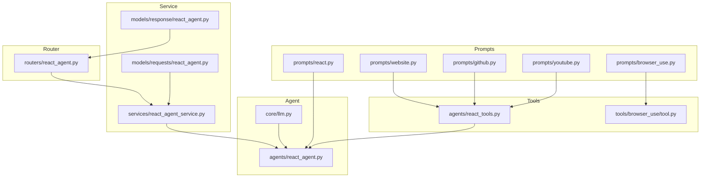
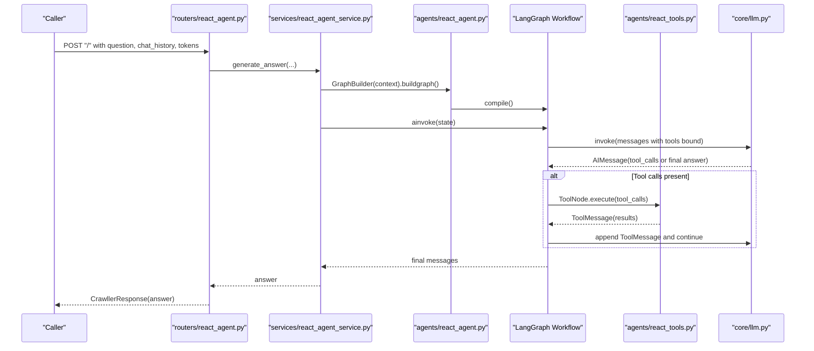
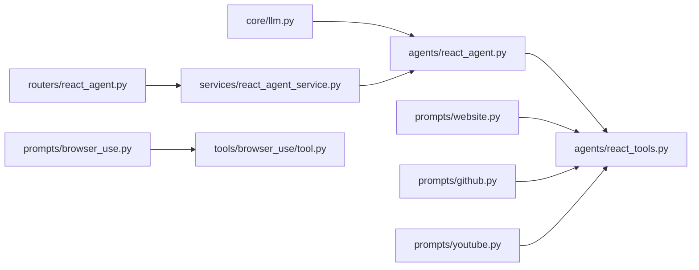

# React Agent Prompts

<cite>
**Referenced Files in This Document**
- [prompts/react.py](file://prompts/react.py)
- [agents/react_agent.py](file://agents/react_agent.py)
- [agents/react_tools.py](file://agents/react_tools.py)
- [services/react_agent_service.py](file://services/react_agent_service.py)
- [routers/react_agent.py](file://routers/react_agent.py)
- [prompts/website.py](file://prompts/website.py)
- [prompts/github.py](file://prompts/github.py)
- [prompts/youtube.py](file://prompts/youtube.py)
- [prompts/browser_use.py](file://prompts/browser_use.py)
- [tools/browser_use/tool.py](file://tools/browser_use/tool.py)
- [core/llm.py](file://core/llm.py)
- [models/requests/react_agent.py](file://models/requests/react_agent.py)
- [models/response/react_agent.py](file://models/response/react_agent.py)
</cite>

## Table of Contents
1. [Introduction](#introduction)
2. [Project Structure](#project-structure)
3. [Core Components](#core-components)
4. [Architecture Overview](#architecture-overview)
5. [Detailed Component Analysis](#detailed-component-analysis)
6. [Dependency Analysis](#dependency-analysis)
7. [Performance Considerations](#performance-considerations)
8. [Troubleshooting Guide](#troubleshooting-guide)
9. [Conclusion](#conclusion)
10. [Appendices](#appendices)

## Introduction
This document explains the React agent prompt system and patterns used to orchestrate tool-enabled reasoning and response generation. It covers:
- The core prompt structure that integrates available tools and manages conversation context
- How the agent decides whether to use tools and how it formats responses
- Dynamic tool injection based on runtime context
- Multi-turn conversation handling and context propagation
- Prompt variations for different domains (websites, GitHub repositories, YouTube videos)
- Best practices for prompt optimization, error handling, and debugging
- Scalability and performance considerations for production deployments

## Project Structure
The React agent pipeline spans prompts, tools, agent orchestration, and service layers:
- Prompts define domain-specific templates and formatting expectations
- Tools encapsulate capabilities and inject structured parameters
- The agent orchestrates tool use via a LangGraph workflow
- Services assemble context and invoke the agent
- Routers expose the agent as an API endpoint

**Diagram sources**
- [prompts/react.py](file://prompts/react.py#L1-L21)
- [prompts/website.py](file://prompts/website.py#L1-L115)
- [prompts/github.py](file://prompts/github.py#L1-L110)
- [prompts/youtube.py](file://prompts/youtube.py#L1-L158)
- [prompts/browser_use.py](file://prompts/browser_use.py#L1-L138)
- [agents/react_tools.py](file://agents/react_tools.py#L1-L721)
- [tools/browser_use/tool.py](file://tools/browser_use/tool.py#L1-L49)
- [agents/react_agent.py](file://agents/react_agent.py#L1-L191)
- [core/llm.py](file://core/llm.py#L1-L215)
- [services/react_agent_service.py](file://services/react_agent_service.py#L1-L154)
- [models/requests/react_agent.py](file://models/requests/react_agent.py#L1-L45)
- [models/response/react_agent.py](file://models/response/react_agent.py#L1-L15)
- [routers/react_agent.py](file://routers/react_agent.py#L1-L57)

**Section sources**
- [prompts/react.py](file://prompts/react.py#L1-L21)
- [agents/react_agent.py](file://agents/react_agent.py#L1-L191)
- [agents/react_tools.py](file://agents/react_tools.py#L1-L721)
- [services/react_agent_service.py](file://services/react_agent_service.py#L1-L154)
- [routers/react_agent.py](file://routers/react_agent.py#L1-L57)
- [prompts/website.py](file://prompts/website.py#L1-L115)
- [prompts/github.py](file://prompts/github.py#L1-L110)
- [prompts/youtube.py](file://prompts/youtube.py#L1-L158)
- [prompts/browser_use.py](file://prompts/browser_use.py#L1-L138)
- [tools/browser_use/tool.py](file://tools/browser_use/tool.py#L1-L49)
- [core/llm.py](file://core/llm.py#L1-L215)
- [models/requests/react_agent.py](file://models/requests/react_agent.py#L1-L45)
- [models/response/react_agent.py](file://models/response/react_agent.py#L1-L15)

## Core Components
- React prompt template: Defines the system-like framing for tool availability and usage instructions, parameterized with tools and the current question.
- Tool registry and builders: Define tool schemas, runtime augmentation (e.g., adding Google/Gmail/Calendar/PyJIIT tools when credentials are present), and structured tool coroutines.
- Agent graph: A LangGraph workflow that binds tools to the LLM, routes tool calls, and loops until completion.
- Service layer: Assembles context (chat history, client HTML, tokens, login payloads), injects page context as a SystemMessage, and invokes the compiled graph.
- Router: Exposes the agent via FastAPI, validating inputs and returning standardized responses.

Key implementation references:
- Prompt template and binding: [prompts/react.py](file://prompts/react.py#L1-L21)
- Agent graph and tool binding: [agents/react_agent.py](file://agents/react_agent.py#L123-L170)
- Tool builder and runtime augmentation: [agents/react_tools.py](file://agents/react_tools.py#L609-L699)
- Service context assembly and page context injection: [services/react_agent_service.py](file://services/react_agent_service.py#L67-L118)
- Router input validation and response: [routers/react_agent.py](file://routers/react_agent.py#L18-L39)

**Section sources**
- [prompts/react.py](file://prompts/react.py#L1-L21)
- [agents/react_agent.py](file://agents/react_agent.py#L123-L170)
- [agents/react_tools.py](file://agents/react_tools.py#L609-L699)
- [services/react_agent_service.py](file://services/react_agent_service.py#L67-L118)
- [routers/react_agent.py](file://routers/react_agent.py#L18-L39)

## Architecture Overview
The React agent follows a tool-use loop:
- The agent receives a conversation state (including a system message if missing)
- The LLM selects whether to use tools and produces tool calls
- The ToolNode executes tools and returns results
- The agent consumes tool outputs and continues reasoning until a final answer is produced

**Diagram sources**
- [routers/react_agent.py](file://routers/react_agent.py#L18-L39)
- [services/react_agent_service.py](file://services/react_agent_service.py#L17-L145)
- [agents/react_agent.py](file://agents/react_agent.py#L138-L170)
- [agents/react_tools.py](file://agents/react_tools.py#L609-L699)
- [core/llm.py](file://core/llm.py#L78-L169)

## Detailed Component Analysis

### React Prompt Template and Tool Integration
- Purpose: Introduce the agent’s role, enumerate available tools, and instruct tool invocation syntax. The template is parameterized with the formatted tools list and the incoming question.
- Dynamic tool integration: Tools are bound to the LLM at runtime via the agent node. The prompt itself does not change; the tool list injected into the LLM call determines which tools are available.
- Conversation context: The system message is prepended automatically if missing, ensuring continuity across turns.

References:
- Template definition and ChatPromptTemplate creation: [prompts/react.py](file://prompts/react.py#L3-L20)
- Automatic system message insertion and LLM binding: [agents/react_agent.py](file://agents/react_agent.py#L123-L135)

**Section sources**
- [prompts/react.py](file://prompts/react.py#L3-L20)
- [agents/react_agent.py](file://agents/react_agent.py#L123-L135)

### Tool Selection and Execution Loop
- Tool selection: The LLM chooses whether to use tools based on the conversation state and tool availability. Tool calls are parsed and executed by the ToolNode.
- Conditional routing: The graph routes to the ToolNode when tool_calls are detected; otherwise, it ends.
- Loop behavior: Results from tools are appended as ToolMessages, allowing the agent to continue reasoning until a final answer is produced.

References:
- Graph construction and conditional edges: [agents/react_agent.py](file://agents/react_agent.py#L154-L170)
- ToolNode usage: [agents/react_agent.py](file://agents/react_agent.py#L159)

**Section sources**
- [agents/react_agent.py](file://agents/react_agent.py#L154-L170)

### Context Management and Multi-Turn Conversations
- Chat history: The service converts prior entries into Human/System/AI messages and appends them to the state.
- Page context: When client HTML is provided, it is converted to markdown and injected as a SystemMessage to inform the agent about the current page.
- Message normalization: Payloads are normalized to LangChain message types, preserving tool_calls and tool_call_id.

References:
- Chat history conversion and page context injection: [services/react_agent_service.py](file://services/react_agent_service.py#L84-L118)
- Payload normalization helpers: [agents/react_agent.py](file://agents/react_agent.py#L52-L120)

**Section sources**
- [services/react_agent_service.py](file://services/react_agent_service.py#L84-L118)
- [agents/react_agent.py](file://agents/react_agent.py#L52-L120)

### Domain-Specific Prompt Variations
- Website QA: Combines server-fetched and client-rendered contexts, prioritizing client context for accuracy.
- GitHub repository QA: Uses repository summary, file tree, and content to answer coding questions.
- YouTube QA: Builds context from video info and transcripts, with strict scope limitations.
- Browser automation script generation: Produces JSON action plans for Chrome extension automation.

References:
- Website prompt and chain: [prompts/website.py](file://prompts/website.py#L12-L114)
- GitHub prompt and chain: [prompts/github.py](file://prompts/github.py#L10-L82)
- YouTube prompt and chain: [prompts/youtube.py](file://prompts/youtube.py#L77-L157)
- Browser automation prompt: [prompts/browser_use.py](file://prompts/browser_use.py#L5-L133)

**Section sources**
- [prompts/website.py](file://prompts/website.py#L12-L114)
- [prompts/github.py](file://prompts/github.py#L10-L82)
- [prompts/youtube.py](file://prompts/youtube.py#L77-L157)
- [prompts/browser_use.py](file://prompts/browser_use.py#L5-L133)

### Tool Registry and Parameter Injection Patterns
- Tool schemas: Each tool defines a Pydantic model specifying parameters and constraints.
- Runtime augmentation: Tools are conditionally added based on context (e.g., Google access tokens, PyJIIT session payload).
- Partial application: Default credentials are injected via partial to avoid requiring explicit parameters in every call.

References:
- Tool schemas and coroutines: [agents/react_tools.py](file://agents/react_tools.py#L61-L210)
- Conditional tool addition: [agents/react_tools.py](file://agents/react_tools.py#L609-L699)
- Browser automation tool: [tools/browser_use/tool.py](file://tools/browser_use/tool.py#L12-L48)

**Section sources**
- [agents/react_tools.py](file://agents/react_tools.py#L61-L210)
- [agents/react_tools.py](file://agents/react_tools.py#L609-L699)
- [tools/browser_use/tool.py](file://tools/browser_use/tool.py#L12-L48)

### Response Generation and Formatting
- Final answer extraction: The service returns the content of the last assistant message.
- Standardized responses: The router wraps the answer in a response model.

References:
- Final message extraction: [services/react_agent_service.py](file://services/react_agent_service.py#L139-L144)
- Response model: [models/response/react_agent.py](file://models/response/react_agent.py#L10-L15)
- Router response: [routers/react_agent.py](file://routers/react_agent.py#L18-L39)

**Section sources**
- [services/react_agent_service.py](file://services/react_agent_service.py#L139-L144)
- [models/response/react_agent.py](file://models/response/react_agent.py#L10-L15)
- [routers/react_agent.py](file://routers/react_agent.py#L18-L39)

### API and Request Contracts
- Request model: Supports messages, optional Google access token, and PyJIIT login payload.
- Response model: Returns the final messages and the assistant’s output.

References:
- Request model: [models/requests/react_agent.py](file://models/requests/react_agent.py#L27-L44)
- Response model: [models/response/react_agent.py](file://models/response/react_agent.py#L10-L15)

**Section sources**
- [models/requests/react_agent.py](file://models/requests/react_agent.py#L27-L44)
- [models/response/react_agent.py](file://models/response/react_agent.py#L10-L15)

## Dependency Analysis
- LLM provider abstraction: The agent relies on a unified LLM client configured via environment variables and provider parameters.
- Tool-to-agent coupling: Tools are registered and bound to the LLM inside the agent node; the prompt template remains decoupled from tool specifics.
- Service-to-agent coupling: The service constructs the graph with context-aware tools and feeds the conversation state.

**Diagram sources**
- [core/llm.py](file://core/llm.py#L78-L169)
- [agents/react_agent.py](file://agents/react_agent.py#L123-L170)
- [agents/react_tools.py](file://agents/react_tools.py#L609-L699)
- [services/react_agent_service.py](file://services/react_agent_service.py#L80-L137)
- [routers/react_agent.py](file://routers/react_agent.py#L18-L39)
- [prompts/website.py](file://prompts/website.py#L12-L114)
- [prompts/github.py](file://prompts/github.py#L10-L82)
- [prompts/youtube.py](file://prompts/youtube.py#L77-L157)
- [prompts/browser_use.py](file://prompts/browser_use.py#L5-L133)
- [tools/browser_use/tool.py](file://tools/browser_use/tool.py#L12-L48)

**Section sources**
- [core/llm.py](file://core/llm.py#L78-L169)
- [agents/react_agent.py](file://agents/react_agent.py#L123-L170)
- [agents/react_tools.py](file://agents/react_tools.py#L609-L699)
- [services/react_agent_service.py](file://services/react_agent_service.py#L80-L137)
- [routers/react_agent.py](file://routers/react_agent.py#L18-L39)
- [prompts/website.py](file://prompts/website.py#L12-L114)
- [prompts/github.py](file://prompts/github.py#L10-L82)
- [prompts/youtube.py](file://prompts/youtube.py#L77-L157)
- [prompts/browser_use.py](file://prompts/browser_use.py#L5-L133)
- [tools/browser_use/tool.py](file://tools/browser_use/tool.py#L12-L48)

## Performance Considerations
- Tool binding overhead: Binding tools to the LLM increases prompt size; keep tool descriptions concise and only include necessary tools.
- Graph caching: The agent graph is cached via LRU cache to avoid repeated compilation costs.
- Async I/O: Tools perform blocking operations in threads; ensure thread pool sizing aligns with concurrency needs.
- Prompt size limits: For long chat histories or large page contexts, consider truncation strategies or summarization before invoking the agent.
- Provider latency: Choose providers and models appropriate for your latency SLAs; configure base URLs and API keys correctly.

References:
- Graph caching: [agents/react_agent.py](file://agents/react_agent.py#L178-L180)
- Threaded tool execution: [agents/react_tools.py](file://agents/react_tools.py#L233-L247)

**Section sources**
- [agents/react_agent.py](file://agents/react_agent.py#L178-L180)
- [agents/react_tools.py](file://agents/react_tools.py#L233-L247)

## Troubleshooting Guide
- Missing API keys or base URLs: Initialization of the LLM client validates provider configuration; errors surface during initialization.
- Tool execution failures: Tools wrap exceptions and return error messages; check service logs for details.
- Unexpected tool calls: Verify tool schemas and ensure parameters match the expected types.
- Conversation state anomalies: Confirm that payloads are normalized to LangChain messages and that tool_call_id and tool_calls are preserved.

References:
- LLM initialization and error handling: [core/llm.py](file://core/llm.py#L101-L169)
- Tool error handling: [agents/react_tools.py](file://agents/react_tools.py#L294-L301)
- Payload normalization: [agents/react_agent.py](file://agents/react_agent.py#L80-L120)

**Section sources**
- [core/llm.py](file://core/llm.py#L101-L169)
- [agents/react_tools.py](file://agents/react_tools.py#L294-L301)
- [agents/react_agent.py](file://agents/react_agent.py#L80-L120)

## Conclusion
The React agent prompt system combines a flexible tool registry with a LangGraph-driven reasoning loop. The prompt template focuses on tool availability and invocation syntax, while dynamic tool injection and context management enable robust, multi-domain responses. By leveraging structured tool schemas, careful context assembly, and provider-agnostic LLM configuration, the system supports scalable deployment and maintainable prompt engineering.

## Appendices

### Prompt Template Customization Checklist
- Keep tool descriptions concise and actionable
- Clearly specify tool invocation syntax and constraints
- Include fallback responses for unavailable data
- Align formatting expectations with downstream parsers

References:
- Prompt template: [prompts/react.py](file://prompts/react.py#L3-L20)

**Section sources**
- [prompts/react.py](file://prompts/react.py#L3-L20)

### Best Practices for Prompt Optimization
- Use explicit instructions for tool usage and response formatting
- Inject only necessary context to reduce token usage
- Validate and sanitize inputs to prevent prompt injection
- Monitor tool call success rates and refine tool schemas accordingly

References:
- Prompt injection validator template: [prompts/prompt_injection_validator.py](file://prompts/prompt_injection_validator.py#L1-L16)

**Section sources**
- [prompts/prompt_injection_validator.py](file://prompts/prompt_injection_validator.py#L1-L16)