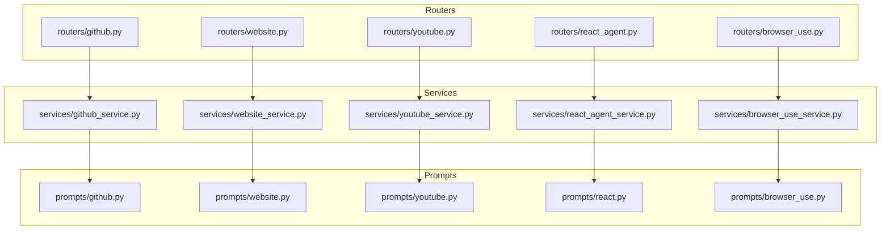
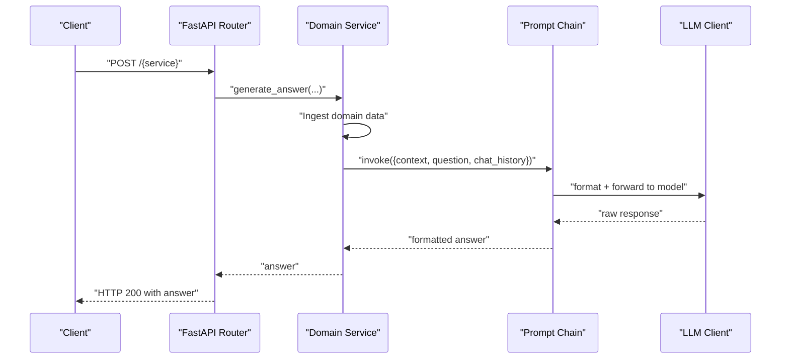
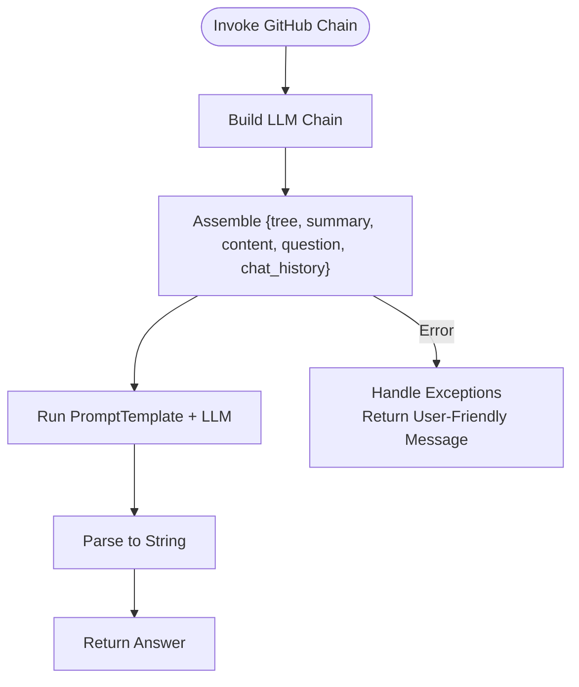
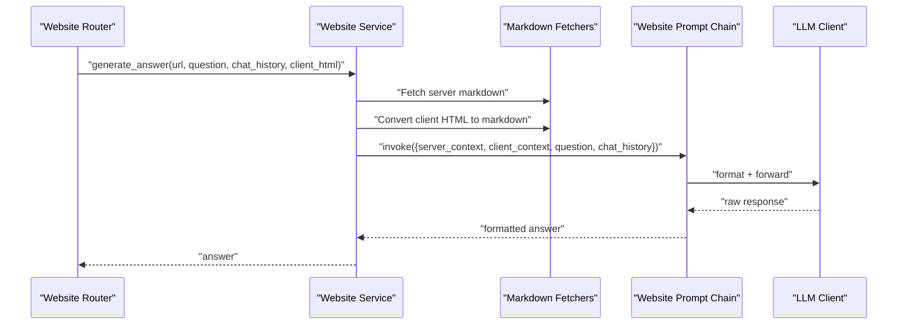
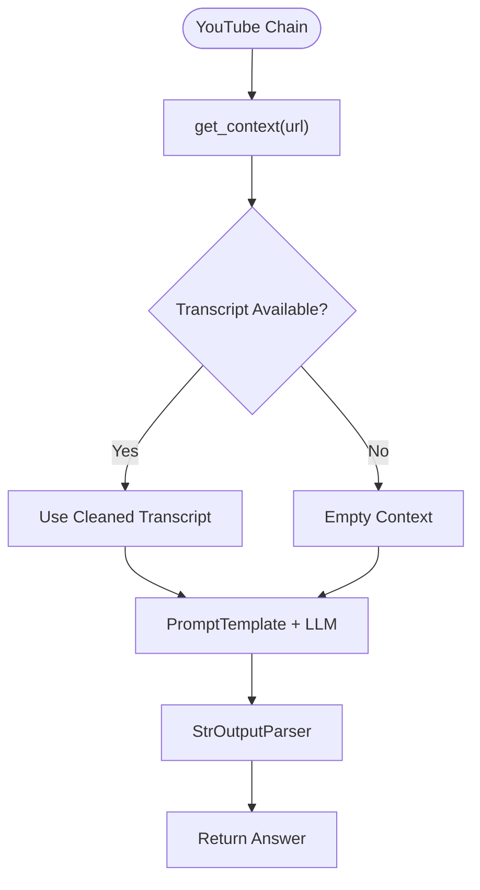
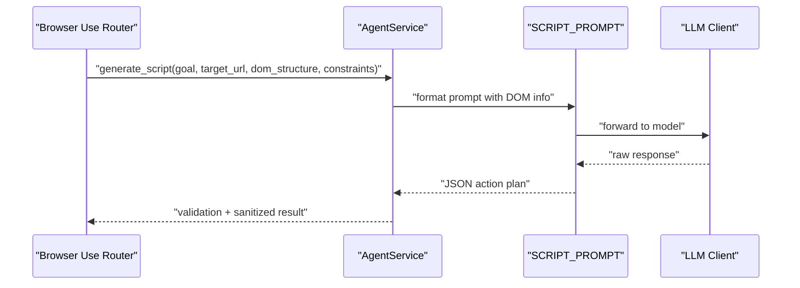
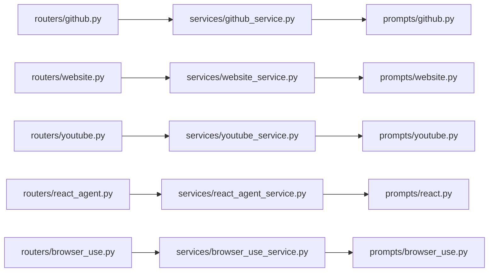

# Service-Specific Prompts

<cite>
**Referenced Files in This Document**
- [prompts/github.py](file://prompts/github.py)
- [prompts/website.py](file://prompts/website.py)
- [prompts/youtube.py](file://prompts/youtube.py)
- [prompts/react.py](file://prompts/react.py)
- [prompts/browser_use.py](file://prompts/browser_use.py)
- [services/github_service.py](file://services/github_service.py)
- [services/website_service.py](file://services/website_service.py)
- [services/youtube_service.py](file://services/youtube_service.py)
- [services/react_agent_service.py](file://services/react_agent_service.py)
- [services/browser_use_service.py](file://services/browser_use_service.py)
- [routers/github.py](file://routers/github.py)
- [routers/website.py](file://routers/website.py)
- [routers/youtube.py](file://routers/youtube.py)
- [routers/react_agent.py](file://routers/react_agent.py)
- [routers/browser_use.py](file://routers/browser_use.py)
</cite>

## Table of Contents
1. [Introduction](#introduction)
2. [Project Structure](#project-structure)
3. [Core Components](#core-components)
4. [Architecture Overview](#architecture-overview)
5. [Detailed Component Analysis](#detailed-component-analysis)
6. [Dependency Analysis](#dependency-analysis)
7. [Performance Considerations](#performance-considerations)
8. [Troubleshooting Guide](#troubleshooting-guide)
9. [Conclusion](#conclusion)

## Introduction
This document explains the domain-specific prompt systems powering integrated services for GitHub repository analysis, website content understanding, and YouTube video processing. It covers prompt templates, parameter handling, response formatting, service integration, error handling, and optimization strategies. It also describes how prompts are chained across services and how context is preserved for robust, scalable agent workflows.

## Project Structure
The repository organizes prompts, services, and FastAPI routers per domain. Prompts define the instruction templates and chains; services orchestrate ingestion, context assembly, and LLM invocation; routers expose HTTP endpoints for each service.

**Diagram sources**
- [routers/github.py](file://routers/github.py#L1-L49)
- [routers/website.py](file://routers/website.py#L1-L43)
- [routers/youtube.py](file://routers/youtube.py#L1-L59)
- [routers/react_agent.py](file://routers/react_agent.py#L1-L57)
- [routers/browser_use.py](file://routers/browser_use.py#L1-L51)
- [services/github_service.py](file://services/github_service.py#L1-L109)
- [services/website_service.py](file://services/website_service.py#L1-L97)
- [services/youtube_service.py](file://services/youtube_service.py#L1-L71)
- [services/react_agent_service.py](file://services/react_agent_service.py#L1-L154)
- [services/browser_use_service.py](file://services/browser_use_service.py#L1-L96)
- [prompts/github.py](file://prompts/github.py#L1-L110)
- [prompts/website.py](file://prompts/website.py#L1-L115)
- [prompts/youtube.py](file://prompts/youtube.py#L1-L158)
- [prompts/react.py](file://prompts/react.py#L1-L21)
- [prompts/browser_use.py](file://prompts/browser_use.py#L1-L138)

**Section sources**
- [routers/github.py](file://routers/github.py#L1-L49)
- [routers/website.py](file://routers/website.py#L1-L43)
- [routers/youtube.py](file://routers/youtube.py#L1-L59)
- [routers/react_agent.py](file://routers/react_agent.py#L1-L57)
- [routers/browser_use.py](file://routers/browser_use.py#L1-L51)
- [services/github_service.py](file://services/github_service.py#L1-L109)
- [services/website_service.py](file://services/website_service.py#L1-L97)
- [services/youtube_service.py](file://services/youtube_service.py#L1-L71)
- [services/react_agent_service.py](file://services/react_agent_service.py#L1-L154)
- [services/browser_use_service.py](file://services/browser_use_service.py#L1-L96)
- [prompts/github.py](file://prompts/github.py#L1-L110)
- [prompts/website.py](file://prompts/website.py#L1-L115)
- [prompts/youtube.py](file://prompts/youtube.py#L1-L158)
- [prompts/react.py](file://prompts/react.py#L1-L21)
- [prompts/browser_use.py](file://prompts/browser_use.py#L1-L138)

## Core Components
- GitHub prompt system: Builds a chain that merges repository summary, file tree, and content with a user question and optional chat history. It enforces strict reliance on provided context and uses Markdown formatting.
- Website prompt system: Merges server-fetched and client-rendered contexts, prioritizing client-side content for dynamic and authenticated views. Provides guidelines for summaries, structure, links/media, metadata, and formatting.
- YouTube prompt system: Assembles a transcript-based context (with error handling) and applies a focused schema for summaries, duration, stats, themes, sentiment, and recommendations.
- React agent prompt: Supplies a tool-use instruction template for agents that rely on tool availability and structured reasoning.
- Browser automation prompt: Defines a precise JSON action plan for Chrome extension automation, including DOM manipulation and tab/window control actions, with strong constraints and examples.

**Section sources**
- [prompts/github.py](file://prompts/github.py#L10-L78)
- [prompts/website.py](file://prompts/website.py#L12-L114)
- [prompts/youtube.py](file://prompts/youtube.py#L77-L138)
- [prompts/react.py](file://prompts/react.py#L3-L20)
- [prompts/browser_use.py](file://prompts/browser_use.py#L5-L137)

## Architecture Overview
The system follows a consistent pattern:
- Routers validate and parse requests, then delegate to services.
- Services ingest domain-specific data (repository, website content, YouTube transcripts), assemble context, and invoke prompt chains.
- Prompts define the instruction template and optional context assembly via Runnable chains.
- Responses are normalized and returned through routers.

**Diagram sources**
- [routers/github.py](file://routers/github.py#L16-L44)
- [services/github_service.py](file://services/github_service.py#L18-L108)
- [prompts/github.py](file://prompts/github.py#L75-L82)
- [routers/website.py](file://routers/website.py#L14-L32)
- [services/website_service.py](file://services/website_service.py#L21-L92)
- [prompts/website.py](file://prompts/website.py#L96-L114)
- [routers/youtube.py](file://routers/youtube.py#L15-L48)
- [services/youtube_service.py](file://services/youtube_service.py#L16-L66)
- [prompts/youtube.py](file://prompts/youtube.py#L141-L157)

## Detailed Component Analysis

### GitHub Integration Prompts
- Prompt template: System role, repository summary, file tree, relevant content, optional chat history, explicit guidelines, and formatting rules.
- Input variables: tree, summary, content, question, chat_history.
- Chain composition: RunnableParallel extracts inputs; PromptTemplate formats; LLM client executes; StrOutputParser returns text.
- Parameter handling: Router validates presence of url and question; service passes chat_history as a string; optional attached file triggers direct GenAI SDK usage.
- Response formatting: Markdown with code blocks and bullet lists; strict adherence to provided context.
- Error handling: Dedicated error messages for invalid URLs, accessibility, token limit exceeded, and general failures.
- Optimization: Truncates repository content when using GenAI SDK to fit payload limits; preserves concise summaries and trees.

**Diagram sources**
- [prompts/github.py](file://prompts/github.py#L75-L110)
- [services/github_service.py](file://services/github_service.py#L82-L108)

**Section sources**
- [prompts/github.py](file://prompts/github.py#L10-L78)
- [prompts/github.py](file://prompts/github.py#L85-L110)
- [services/github_service.py](file://services/github_service.py#L18-L108)
- [routers/github.py](file://routers/github.py#L16-L44)

### Website Analysis Prompts
- Prompt template: Dual-context guidance (server-fetched vs client-rendered), explicit preference for client context, and detailed guidelines for summaries, structure, links/media, metadata, tables, and math formatting.
- Input variables: server_context, client_context, question, chat_history.
- Chain composition: RunnableParallel builds inputs; PromptTemplate + LLM client; StrOutputParser.
- Parameter handling: Router validates url and question; service converts client HTML to markdown; chat_history assembled as a string; optional attached file bypasses chain and uses GenAI SDK.
- Response formatting: Plain markdown with bullet points, tables, and LaTeX for math.
- Error handling: Generalized error message on processing failure; client context fallback when unavailable.

**Diagram sources**
- [routers/website.py](file://routers/website.py#L14-L32)
- [services/website_service.py](file://services/website_service.py#L21-L92)
- [prompts/website.py](file://prompts/website.py#L96-L114)

**Section sources**
- [prompts/website.py](file://prompts/website.py#L12-L114)
- [services/website_service.py](file://services/website_service.py#L13-L96)
- [routers/website.py](file://routers/website.py#L14-L32)

### YouTube Processing Prompts
- Prompt template: Focused assistant role for YouTube video questions, guidelines for summary, duration, stats, themes, sentiment, and recommendations, and strict scope limitations.
- Input variables: context (transcript), question, chat_history.
- Chain composition: RunnableParallel with a get_context function that fetches and cleans subtitles/transcripts; PromptTemplate + LLM client; StrOutputParser.
- Parameter handling: Router validates url and question; service optionally uploads attached file via GenAI SDK; chat_history passed as string.
- Response formatting: Plain markdown with bullet points, tables, and LaTeX.
- Error handling: Known error detection for transcript retrieval; returns empty context when errors occur; service wraps exceptions and returns user-friendly messages.

**Diagram sources**
- [prompts/youtube.py](file://prompts/youtube.py#L70-L138)
- [prompts/youtube.py](file://prompts/youtube.py#L145-L157)
- [services/youtube_service.py](file://services/youtube_service.py#L53-L66)

**Section sources**
- [prompts/youtube.py](file://prompts/youtube.py#L77-L138)
- [services/youtube_service.py](file://services/youtube_service.py#L16-L70)
- [routers/youtube.py](file://routers/youtube.py#L15-L48)

### React Agent Prompt
- Template: Instructional prompt for agents that use tools, framing the question, listing available tools, and instructing to use tools to gather information.
- Purpose: Complements the broader React agent orchestration (outside the scope of this document) by providing a consistent tool-use instruction.

**Section sources**
- [prompts/react.py](file://prompts/react.py#L3-L20)

### Browser Automation Prompt
- Template: Comprehensive instruction for generating JSON action plans for Chrome extension automation. Includes DOM manipulation and tab/window control actions, selector guidance, search URL construction, and strict output rules.
- Chain composition: ChatPromptTemplate piped to LLM; response parsed via StrOutputParser.
- Parameter handling: Router constructs a user prompt from goal, target URL, DOM structure, and constraints; service sanitizes and validates JSON action plan.

**Diagram sources**
- [routers/browser_use.py](file://routers/browser_use.py#L16-L44)
- [services/browser_use_service.py](file://services/browser_use_service.py#L18-L91)
- [prompts/browser_use.py](file://prompts/browser_use.py#L5-L137)

**Section sources**
- [prompts/browser_use.py](file://prompts/browser_use.py#L5-L137)
- [services/browser_use_service.py](file://services/browser_use_service.py#L11-L95)
- [routers/browser_use.py](file://routers/browser_use.py#L16-L44)

## Dependency Analysis
- Routers depend on models and services to handle requests and responses.
- Services depend on prompts for chain composition and on domain tools for context ingestion.
- Prompts depend on the LLM client abstraction and LangChain components for formatting and parsing.

**Diagram sources**
- [routers/github.py](file://routers/github.py#L1-L49)
- [services/github_service.py](file://services/github_service.py#L1-L109)
- [prompts/github.py](file://prompts/github.py#L1-L110)
- [routers/website.py](file://routers/website.py#L1-L43)
- [services/website_service.py](file://services/website_service.py#L1-L97)
- [prompts/website.py](file://prompts/website.py#L1-L115)
- [routers/youtube.py](file://routers/youtube.py#L1-L59)
- [services/youtube_service.py](file://services/youtube_service.py#L1-L71)
- [prompts/youtube.py](file://prompts/youtube.py#L1-L158)
- [routers/react_agent.py](file://routers/react_agent.py#L1-L57)
- [services/react_agent_service.py](file://services/react_agent_service.py#L1-L154)
- [prompts/react.py](file://prompts/react.py#L1-L21)
- [routers/browser_use.py](file://routers/browser_use.py#L1-L51)
- [services/browser_use_service.py](file://services/browser_use_service.py#L1-L96)
- [prompts/browser_use.py](file://prompts/browser_use.py#L1-L138)

**Section sources**
- [routers/github.py](file://routers/github.py#L1-L49)
- [services/github_service.py](file://services/github_service.py#L1-L109)
- [prompts/github.py](file://prompts/github.py#L1-L110)
- [routers/website.py](file://routers/website.py#L1-L43)
- [services/website_service.py](file://services/website_service.py#L1-L97)
- [prompts/website.py](file://prompts/website.py#L1-L115)
- [routers/youtube.py](file://routers/youtube.py#L1-L59)
- [services/youtube_service.py](file://services/youtube_service.py#L1-L71)
- [prompts/youtube.py](file://prompts/youtube.py#L1-L158)
- [routers/react_agent.py](file://routers/react_agent.py#L1-L57)
- [services/react_agent_service.py](file://services/react_agent_service.py#L1-L154)
- [prompts/react.py](file://prompts/react.py#L1-L21)
- [routers/browser_use.py](file://routers/browser_use.py#L1-L51)
- [services/browser_use_service.py](file://services/browser_use_service.py#L1-L96)
- [prompts/browser_use.py](file://prompts/browser_use.py#L1-L138)

## Performance Considerations
- Context size management:
  - GitHub service truncates repository content when using GenAI SDK to avoid payload limits.
  - Website service assembles concise server and client contexts; client context is preferred but fallback is supported.
  - YouTube service cleans transcripts and falls back to empty context on known errors.
- Token limits and retries:
  - GitHub service detects token limit exceeded and suggests narrowing the scope.
  - Browser automation limits DOM preview entries to reduce token usage.
- Streaming and latency:
  - Chains are synchronous in current implementation; consider streaming responses at routers/services for long-running prompts.
- Model selection:
  - Services support passing llm_options to prompt builders for model tuning.

[No sources needed since this section provides general guidance]

## Troubleshooting Guide
- GitHub
  - Invalid repository URL: Returns guidance to use the repository root.
  - Access issues (404/clone): Requests public repository verification.
  - Token limit exceeded: Advises focusing on specific files/directories.
- Website
  - General processing error: Returns a friendly message to retry.
  - Client HTML missing: Falls back to server context; client context is optional.
- YouTube
  - Transcript retrieval errors: Known error messages detected and handled gracefully; returns empty context.
  - LLM invocation errors: Wrapped with a user-friendly message.
- Browser automation
  - JSON validation failures: Validation returns problems; endpoint returns structured error response.
- React agent
  - Attached file upload failures: Logs and returns a user-friendly message; otherwise normal operation.

**Section sources**
- [services/github_service.py](file://services/github_service.py#L23-L37)
- [services/github_service.py](file://services/github_service.py#L103-L107)
- [services/website_service.py](file://services/website_service.py#L94-L96)
- [prompts/youtube.py](file://prompts/youtube.py#L40-L67)
- [services/youtube_service.py](file://services/youtube_service.py#L68-L70)
- [services/browser_use_service.py](file://services/browser_use_service.py#L82-L89)
- [services/react_agent_service.py](file://services/react_agent_service.py#L63-L65)

## Conclusion
The prompt systems are modular, domain-focused, and integrated with robust services and routers. They emphasize context grounding, strict formatting, and resilient error handling. By preserving and combining context across services—especially client-side rendering for websites and transcripts for YouTube—the system supports advanced, cross-domain reasoning and automation.