# Security Considerations

<cite>
**Referenced Files in This Document**
- [prompt_injection_validator.py](file://prompts/prompt_injection_validator.py)
- [agent_sanitizer.py](file://utils/agent_sanitizer.py)
- [executeActions.ts](file://extension/entrypoints/utils/executeActions.ts)
- [executeAgent.ts](file://extension/entrypoints/utils/executeAgent.ts)
- [website_validator.py](file://routers/website_validator.py)
- [useAuth.ts](file://extension/entrypoints/sidepanel/hooks/useAuth.ts)
- [useWebSocket.ts](file://extension/entrypoints/sidepanel/hooks/useWebSocket.ts)
- [background.ts](file://extension/entrypoints/background.ts)
- [content.ts](file://extension/entrypoints/content.ts)
- [config.py](file://core/config.py)
- [main.py](file://api/main.py)
- [encryption.py](file://tools/pyjiit/encryption.py)
- [utils.py](file://tools/pyjiit/utils.py)
</cite>

## Table of Contents
1. [Introduction](#introduction)
2. [Project Structure](#project-structure)
3. [Core Components](#core-components)
4. [Architecture Overview](#architecture-overview)
5. [Detailed Component Analysis](#detailed-component-analysis)
6. [Dependency Analysis](#dependency-analysis)
7. [Performance Considerations](#performance-considerations)
8. [Troubleshooting Guide](#troubleshooting-guide)
9. [Conclusion](#conclusion)
10. [Appendices](#appendices)

## Introduction
This document provides comprehensive security documentation for Agentic Browser. It covers the security architecture, guardrails, transparency layers, and safety mechanisms. It explains the user approval system for browser actions, activity logging, intelligent content filtering, prompt injection prevention, agent sanitization, secure domain allowlisting, BYOKeys security model, encrypted credential storage, secure communication protocols, threat modeling, vulnerability assessment, and best practices for browser extension development. It also addresses data protection, privacy, compliance, configuration guidelines, penetration testing, incident response, security testing methodologies, code review practices, and security monitoring strategies.

## Project Structure
Agentic Browser consists of:
- Frontend extension (background, content, sidepanel UI, utilities)
- Backend API (FastAPI) with routers and services
- Core configuration and environment management
- Tools for secure credential handling and content processing
- Prompts and sanitizers for safety

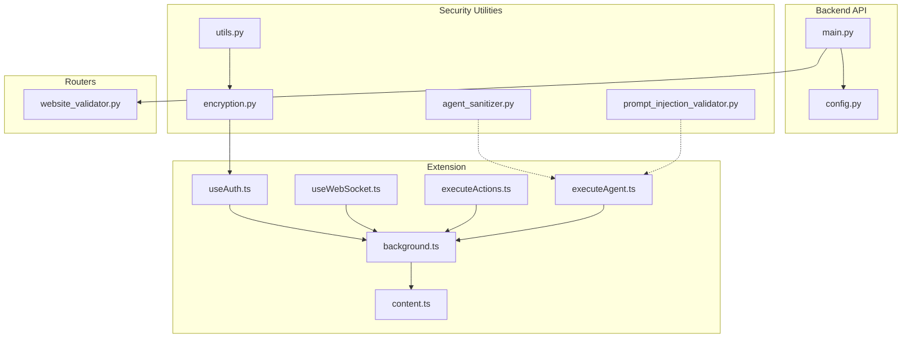

**Diagram sources**
- [background.ts](file://extension/entrypoints/background.ts#L1-L160)
- [content.ts](file://extension/entrypoints/content.ts#L1-L60)
- [executeActions.ts](file://extension/entrypoints/utils/executeActions.ts#L1-L57)
- [executeAgent.ts](file://extension/entrypoints/utils/executeAgent.ts#L1-L120)
- [useAuth.ts](file://extension/entrypoints/sidepanel/hooks/useAuth.ts#L1-L80)
- [useWebSocket.ts](file://extension/entrypoints/sidepanel/hooks/useWebSocket.ts#L1-L49)
- [main.py](file://api/main.py#L1-L47)
- [config.py](file://core/config.py#L1-L26)
- [agent_sanitizer.py](file://utils/agent_sanitizer.py#L1-L119)
- [prompt_injection_validator.py](file://prompts/prompt_injection_validator.py#L1-L16)
- [encryption.py](file://tools/pyjiit/encryption.py#L1-L60)
- [utils.py](file://tools/pyjiit/utils.py#L1-L21)
- [website_validator.py](file://routers/website_validator.py#L1-L15)

**Section sources**
- [main.py](file://api/main.py#L1-L47)
- [config.py](file://core/config.py#L1-L26)
- [background.ts](file://extension/entrypoints/background.ts#L1-L160)
- [content.ts](file://extension/entrypoints/content.ts#L1-L60)
- [executeAgent.ts](file://extension/entrypoints/utils/executeAgent.ts#L1-L120)
- [agent_sanitizer.py](file://utils/agent_sanitizer.py#L1-L119)
- [prompt_injection_validator.py](file://prompts/prompt_injection_validator.py#L1-L16)
- [encryption.py](file://tools/pyjiit/encryption.py#L1-L60)
- [utils.py](file://tools/pyjiit/utils.py#L1-L21)
- [website_validator.py](file://routers/website_validator.py#L1-L15)

## Core Components
- Prompt Injection Prevention: A dedicated prompt template validates incoming markdown for prompt injection attempts.
- Agent Sanitization: Validates and sanitizes JSON action plans from the LLM, enforcing strict action schemas and blocking dangerous patterns.
- User Approval System: Sidepanel hooks orchestrate OAuth flows and manage tokens; WebSocket fallback ensures resilient operation.
- Activity Logging: Background worker logs messages and tracks tab state; content script logs per-page actions.
- Intelligent Content Filtering: Website validator router exposes a validation endpoint; GitHub URL normalization reduces noise.
- Secure Communication: BYOKeys model keeps API keys local; encrypted credential storage uses symmetric encryption with daily rotating keys.
- Authentication and Authorization: OAuth with browser identity APIs; token refresh and expiry handling; storage-based token persistence.
- Domain Allowlisting: Explicit URL normalization and validation routes limit risky contexts.

**Section sources**
- [prompt_injection_validator.py](file://prompts/prompt_injection_validator.py#L1-L16)
- [agent_sanitizer.py](file://utils/agent_sanitizer.py#L1-L119)
- [useAuth.ts](file://extension/entrypoints/sidepanel/hooks/useAuth.ts#L128-L208)
- [useWebSocket.ts](file://extension/entrypoints/sidepanel/hooks/useWebSocket.ts#L1-L49)
- [background.ts](file://extension/entrypoints/background.ts#L24-L128)
- [content.ts](file://extension/entrypoints/content.ts#L197-L213)
- [website_validator.py](file://routers/website_validator.py#L1-L15)
- [executeAgent.ts](file://extension/entrypoints/utils/executeAgent.ts#L134-L168)
- [encryption.py](file://tools/pyjiit/encryption.py#L10-L53)
- [utils.py](file://tools/pyjiit/utils.py#L6-L21)

## Architecture Overview
The security architecture integrates frontend and backend components with layered protections:
- Extension runtime enforces user consent and safe action execution.
- Background worker coordinates tab operations and injects content scripts.
- Content script performs DOM-level actions with strict selectors.
- Backend API validates inputs, normalizes URLs, and applies encryption for sensitive payloads.
- Configuration loads environment variables and logging levels securely.

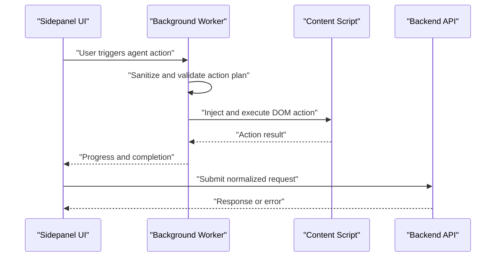

**Diagram sources**
- [executeAgent.ts](file://extension/entrypoints/utils/executeAgent.ts#L1-L120)
- [background.ts](file://extension/entrypoints/background.ts#L428-L514)
- [content.ts](file://extension/entrypoints/content.ts#L220-L323)
- [main.py](file://api/main.py#L29-L41)

## Detailed Component Analysis

### Prompt Injection Prevention
- Purpose: Detect and reject prompt injection attempts in markdown inputs.
- Mechanism: Dedicated prompt template instructs the model to classify inputs as safe or unsafe.
- Impact: Reduces risk of LLM jailbreaking and unintended behavior.

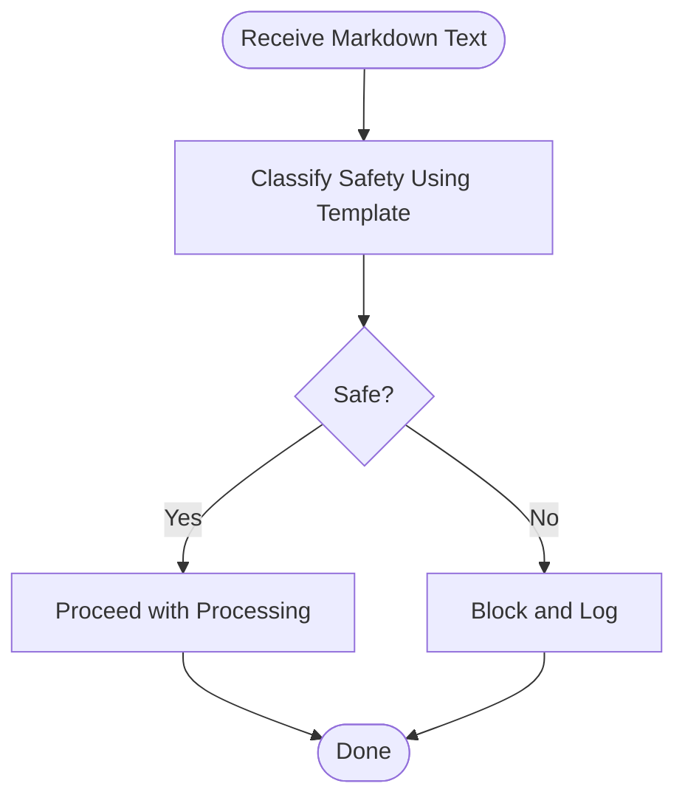

**Diagram sources**
- [prompt_injection_validator.py](file://prompts/prompt_injection_validator.py#L1-L16)

**Section sources**
- [prompt_injection_validator.py](file://prompts/prompt_injection_validator.py#L1-L16)

### Agent Sanitization and Action Validation
- Purpose: Enforce strict schemas for LLM-generated action plans and block dangerous patterns.
- Mechanism: Validates JSON structure, action types, required fields, and disallows unsafe scripts.
- Impact: Prevents arbitrary code execution and malformed actions.

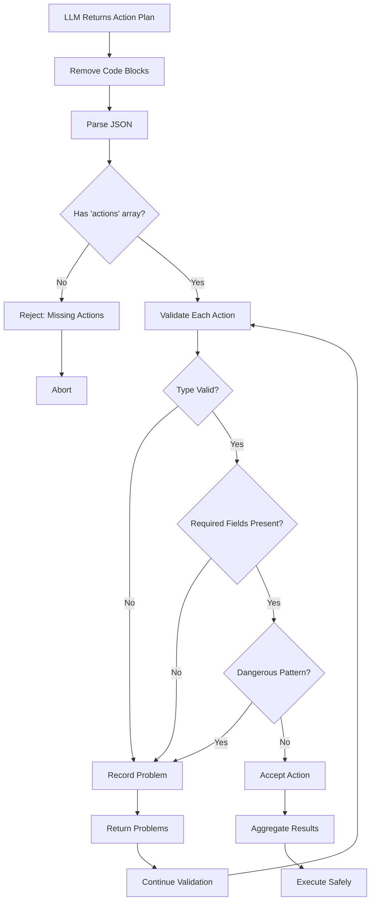

**Diagram sources**
- [agent_sanitizer.py](file://utils/agent_sanitizer.py#L20-L96)

**Section sources**
- [agent_sanitizer.py](file://utils/agent_sanitizer.py#L1-L119)

### User Approval System and Authentication
- Purpose: Manage OAuth flows, token lifecycle, and user consent.
- Mechanism: Uses browser identity APIs for OAuth; stores tokens in extension storage; supports manual refresh and expiry checks.
- Impact: Ensures secure, auditable access to external services.

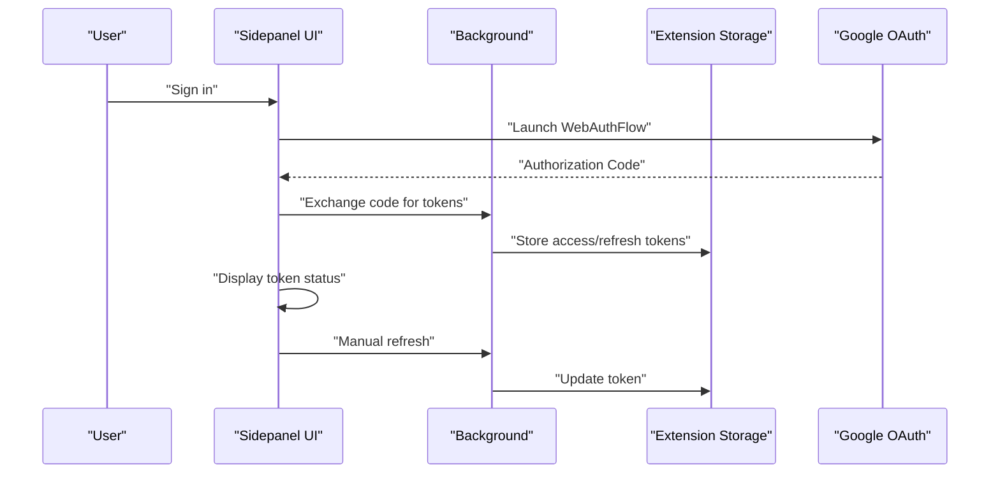

**Diagram sources**
- [useAuth.ts](file://extension/entrypoints/sidepanel/hooks/useAuth.ts#L128-L208)
- [background.ts](file://extension/entrypoints/background.ts#L72-L116)

**Section sources**
- [useAuth.ts](file://extension/entrypoints/sidepanel/hooks/useAuth.ts#L1-L311)
- [background.ts](file://extension/entrypoints/background.ts#L72-L116)

### Activity Logging and Transparency
- Purpose: Provide visibility into extension actions and state.
- Mechanism: Background worker logs messages; content script logs per-page actions; WebSocket status updates UI.
- Impact: Enables auditing and troubleshooting.

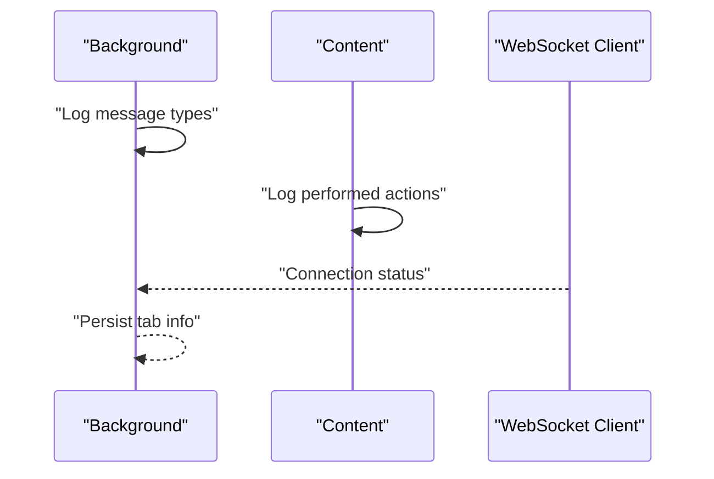

**Diagram sources**
- [background.ts](file://extension/entrypoints/background.ts#L24-L128)
- [content.ts](file://extension/entrypoints/content.ts#L197-L213)
- [useWebSocket.ts](file://extension/entrypoints/sidepanel/hooks/useWebSocket.ts#L1-L49)

**Section sources**
- [background.ts](file://extension/entrypoints/background.ts#L135-L156)
- [content.ts](file://extension/entrypoints/content.ts#L197-L213)
- [useWebSocket.ts](file://extension/entrypoints/sidepanel/hooks/useWebSocket.ts#L1-L49)

### Intelligent Content Filtering and URL Normalization
- Purpose: Reduce risk by normalizing URLs and validating content contexts.
- Mechanism: Normalize GitHub URLs to repository-level; expose validation endpoint; capture client HTML for context.
- Impact: Limits noisy or risky contexts for agent actions.

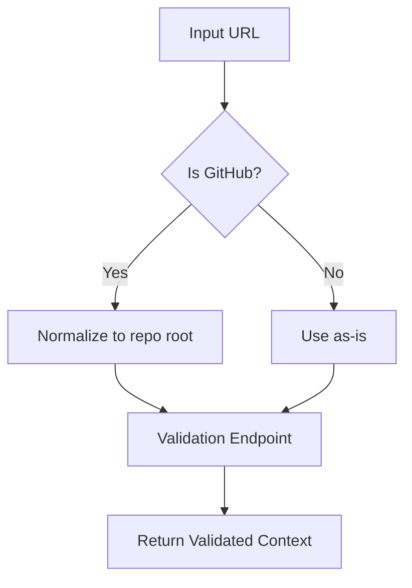

**Diagram sources**
- [executeAgent.ts](file://extension/entrypoints/utils/executeAgent.ts#L134-L168)
- [website_validator.py](file://routers/website_validator.py#L1-L15)

**Section sources**
- [executeAgent.ts](file://extension/entrypoints/utils/executeAgent.ts#L134-L168)
- [website_validator.py](file://routers/website_validator.py#L1-L15)

### BYOKeys Security Model and Secure Communication
- Purpose: Ensure API keys never leave the local extension context.
- Mechanism: Dynamic import of Gemini SDK in background; API key supplied per-request; encryption utilities for sensitive payloads.
- Impact: Minimizes exposure of secrets and secures credential transport.

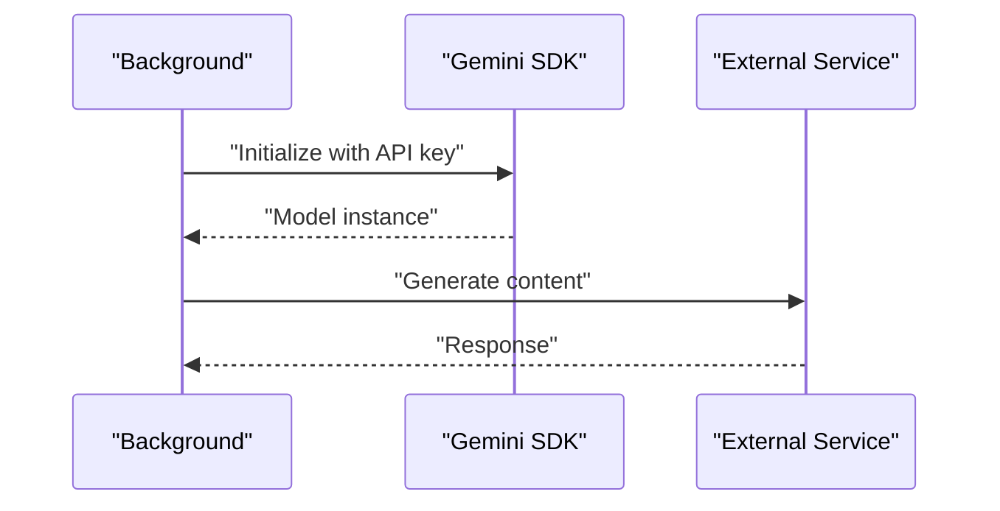

**Diagram sources**
- [background.ts](file://extension/entrypoints/background.ts#L451-L468)

**Section sources**
- [background.ts](file://extension/entrypoints/background.ts#L451-L468)
- [executeAgent.ts](file://extension/entrypoints/utils/executeAgent.ts#L30-L82)

### Encrypted Credential Storage
- Purpose: Protect stored credentials using symmetric encryption with daily rotating keys.
- Mechanism: AES-CBC with fixed IV; key derived from date and random sequences; serialization/deserialization helpers.
- Impact: Adds cryptographic barrier against local storage theft.

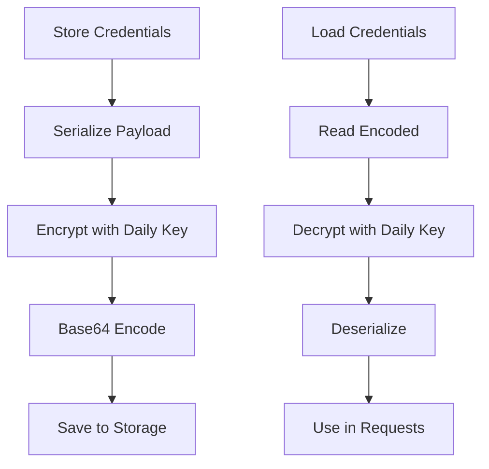

**Diagram sources**
- [encryption.py](file://tools/pyjiit/encryption.py#L30-L53)
- [utils.py](file://tools/pyjiit/utils.py#L6-L21)

**Section sources**
- [encryption.py](file://tools/pyjiit/encryption.py#L1-L60)
- [utils.py](file://tools/pyjiit/utils.py#L1-L21)

### Browser Action Execution and Safety
- Purpose: Safely execute user-approved actions with minimal risk.
- Mechanism: Background worker injects content scripts; executes DOM actions with selectors; enforces delays and waits.
- Impact: Limits cross-site scripting risks and prevents runaway automation.

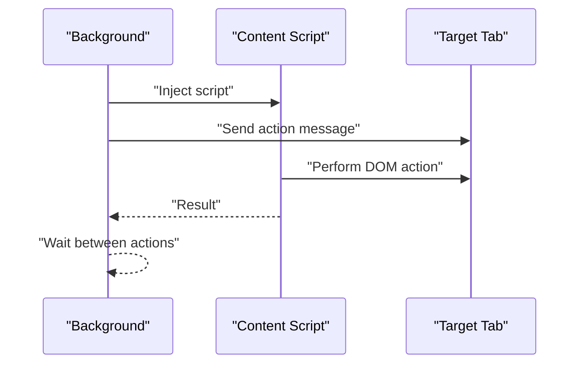

**Diagram sources**
- [background.ts](file://extension/entrypoints/background.ts#L428-L514)
- [executeActions.ts](file://extension/entrypoints/utils/executeActions.ts#L1-L57)
- [content.ts](file://extension/entrypoints/content.ts#L220-L323)

**Section sources**
- [background.ts](file://extension/entrypoints/background.ts#L428-L514)
- [executeActions.ts](file://extension/entrypoints/utils/executeActions.ts#L1-L57)
- [content.ts](file://extension/entrypoints/content.ts#L220-L323)

## Dependency Analysis
- Extension-to-Backend: Sidepanel and background communicate via message passing; backend routes handle normalized requests.
- Security Utilities: Encryption utilities depend on date/time utilities; sanitizer and prompt validator are standalone.
- Configuration: Environment variables drive logging and host/port configuration.

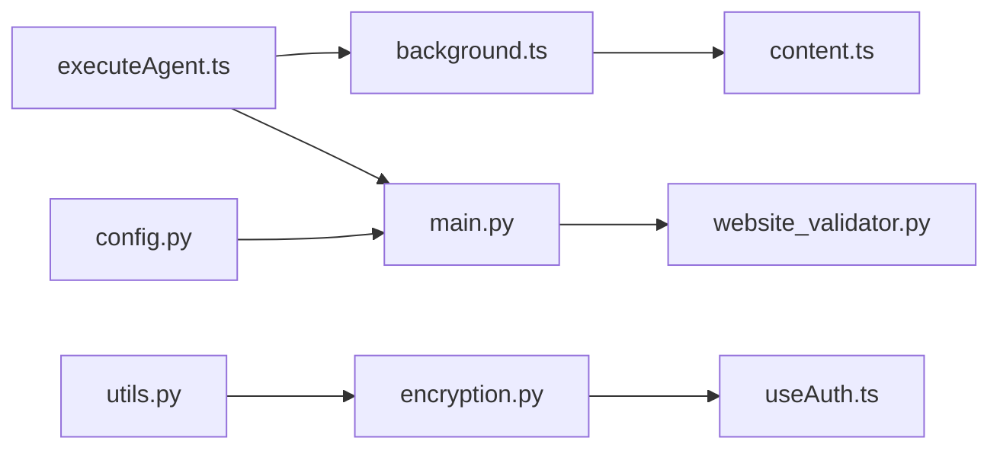

**Diagram sources**
- [executeAgent.ts](file://extension/entrypoints/utils/executeAgent.ts#L1-L120)
- [background.ts](file://extension/entrypoints/background.ts#L1-L160)
- [content.ts](file://extension/entrypoints/content.ts#L1-L60)
- [main.py](file://api/main.py#L1-L47)
- [website_validator.py](file://routers/website_validator.py#L1-L15)
- [encryption.py](file://tools/pyjiit/encryption.py#L1-L60)
- [utils.py](file://tools/pyjiit/utils.py#L1-L21)
- [config.py](file://core/config.py#L1-L26)

**Section sources**
- [main.py](file://api/main.py#L1-L47)
- [config.py](file://core/config.py#L1-L26)
- [background.ts](file://extension/entrypoints/background.ts#L1-L160)
- [executeAgent.ts](file://extension/entrypoints/utils/executeAgent.ts#L1-L120)
- [encryption.py](file://tools/pyjiit/encryption.py#L1-L60)
- [utils.py](file://tools/pyjiit/utils.py#L1-L21)
- [website_validator.py](file://routers/website_validator.py#L1-L15)

## Performance Considerations
- Action Delays: Artificial delays between actions reduce rate-limiting and UI contention.
- Tab Navigation Waits: Waiting for navigation/reload completion avoids race conditions.
- Payload Limits: DOM extraction limits reduce memory footprint.
- Logging Overhead: Excessive logging can impact performance; tune levels appropriately.

[No sources needed since this section provides general guidance]

## Troubleshooting Guide
- Authentication Failures: Verify backend availability, OAuth client configuration, and token refresh logic.
- WebSocket Disconnections: Fallback to HTTP is supported; check connection status and auto-connect settings.
- Action Failures: Validate selectors, ensure content script injection succeeds, and confirm tab context.
- Encryption Issues: Confirm daily key rotation and encoding/decoding steps.

**Section sources**
- [useAuth.ts](file://extension/entrypoints/sidepanel/hooks/useAuth.ts#L128-L208)
- [useWebSocket.ts](file://extension/entrypoints/sidepanel/hooks/useWebSocket.ts#L19-L45)
- [background.ts](file://extension/entrypoints/background.ts#L428-L514)
- [executeActions.ts](file://extension/entrypoints/utils/executeActions.ts#L1-L57)
- [encryption.py](file://tools/pyjiit/encryption.py#L30-L53)

## Conclusion
Agentic Browser implements a layered security model combining prompt injection detection, agent sanitization, user consent, encrypted storage, and secure communication. The architecture emphasizes transparency, resilience (via WebSocket fallback), and safe action execution. Adhering to the recommended configurations, testing methodologies, and operational procedures will help maintain a robust and compliant deployment.

[No sources needed since this section summarizes without analyzing specific files]

## Appendices

### Security Configuration Guidelines
- Environment Variables
  - Configure logging levels and backend host/port via environment variables.
  - Store secrets using secure secret managers; avoid committing to source control.
- API Endpoints
  - Restrict route prefixes and enable CORS policies appropriate to the extension origin.
- Extension Permissions
  - Grant only necessary permissions; minimize host permissions and content script matches.
- Encryption
  - Rotate keys daily; keep IVs constant; encode payloads before storage.

**Section sources**
- [config.py](file://core/config.py#L1-L26)
- [encryption.py](file://tools/pyjiit/encryption.py#L7-L37)
- [utils.py](file://tools/pyjiit/utils.py#L6-L21)

### Penetration Testing Approaches
- Input Validation
  - Test prompt injection vectors against the prompt injection validator.
  - Validate JSON action plans with malformed and malicious payloads.
- Authentication
  - Verify OAuth flows, token refresh, and expiration handling under network failures.
- Browser Actions
  - Attempt to inject unsafe selectors and scripts; ensure sanitization blocks them.
- Cryptography
  - Validate encryption boundaries and key derivation logic.

[No sources needed since this section provides general guidance]

### Incident Response Procedures
- Detection
  - Monitor logs for authentication errors, WebSocket disconnections, and action failures.
- Containment
  - Temporarily disable affected routes or revoke tokens.
- Eradication
  - Patch vulnerabilities; rotate keys; update OAuth client secrets if compromised.
- Recovery
  - Re-enable services gradually; validate functionality; monitor metrics.
- Postmortem
  - Document root causes, remediation steps, and preventive controls.

[No sources needed since this section provides general guidance]

### Security Testing Methodologies
- Static Analysis
  - Scan for hardcoded secrets, unsafe patterns, and insecure dependencies.
- Dynamic Analysis
  - Run automated tests against sanitized inputs and authenticated flows.
- Fuzzing
  - Fuzz JSON action plans and URL normalization logic.
- Penetration Testing
  - Perform authorized assessments targeting extension and backend.

[No sources needed since this section provides general guidance]

### Code Review Practices
- Input Sanitization
  - Require sanitization and validation for all LLM outputs and user inputs.
- Authentication
  - Enforce token refresh and expiry checks; avoid storing tokens longer than necessary.
- Browser APIs
  - Validate permissions and message routing; avoid broad host permissions.
- Cryptography
  - Review key derivation, IV usage, and encoding/decoding correctness.

[No sources needed since this section provides general guidance]

### Security Monitoring Strategies
- Logs
  - Centralize extension and backend logs; apply retention policies.
- Metrics
  - Track authentication success rates, action execution rates, and WebSocket connectivity.
- Alerts
  - Alert on repeated failures, unusual spikes, and authentication anomalies.

[No sources needed since this section provides general guidance]

### Secure Development Practices
- Least Privilege
  - Limit extension permissions and API access.
- Defense in Depth
  - Combine multiple safeguards: sanitization, validation, encryption, and authorization.
- Secure Defaults
  - Disable debug logs in production; enforce HTTPS and secure cookies.
- Updates Management
  - Establish a process for timely updates to dependencies and cryptography libraries.

[No sources needed since this section provides general guidance]