# Security considerations

## Introduction
Security model for Agentic Browser: user approval for browser actions, activity logs, content filtering, prompt-injection checks, action-plan sanitization, domain allowlists, and BYOKeys so credentials never sit on our servers.

## Project structure
Agentic Browser consists of:
- Frontend extension (background, content, sidepanel UI, utilities)
- Backend API (FastAPI) with routers and services
- Core configuration and environment management
- Tools for secure credential handling and content processing
- Prompts and sanitizers for safety

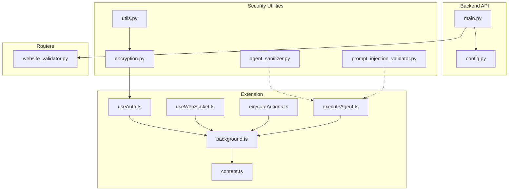
```mermaid
graph TB
subgraph "Extension"
BG["background.ts"]
CT["content.ts"]
EXA["executeActions.ts"]
EXG["executeAgent.ts"]
UA["useAuth.ts"]
UWS["useWebSocket.ts"]
end
subgraph "Backend API"
API["main.py"]
CFG["config.py"]
end
subgraph "Security Utilities"
SAN["agent_sanitizer.py"]
PINJ["prompt_injection_validator.py"]
ENC["encryption.py"]
UTL["utils.py"]
end
subgraph "Routers"
WV["website_validator.py"]
end
UA --> BG
UWS --> BG
EXA --> BG
EXG --> BG
BG --> CT
API --> WV
API --> CFG
SAN -.-> EXG
PINJ -.-> EXG
ENC --> UA
UTL --> ENC
```

## Core components
- Prompt Injection Prevention: A dedicated prompt template validates incoming markdown for prompt injection attempts.
- Agent Sanitization: Validates and sanitizes JSON action plans from the LLM, enforcing strict action schemas and blocking dangerous patterns.
- User Approval System: Sidepanel hooks orchestrate OAuth flows and manage tokens; WebSocket falls back to HTTP when the socket drops.
- Activity Logging: Background worker logs messages and tracks tab state; content script logs per-page actions.
- Intelligent Content Filtering: Website validator router exposes a validation endpoint; GitHub URL normalization reduces noise.
- Secure Communication: BYOKeys model keeps API keys local; encrypted credential storage uses symmetric encryption with daily rotating keys.
- Authentication and Authorization: OAuth with browser identity APIs; token refresh and expiry handling; storage-based token persistence.
- Domain Allowlisting: Explicit URL normalization and validation routes limit risky contexts.

## Architecture overview
Security cuts across frontend and backend:
- Extension runtime enforces user consent and safe action execution.
- Background worker coordinates tab operations and injects content scripts.
- Content script performs DOM-level actions with strict selectors.
- Backend API validates inputs, normalizes URLs, and applies encryption for sensitive payloads.
- Configuration loads environment variables and logging levels securely.

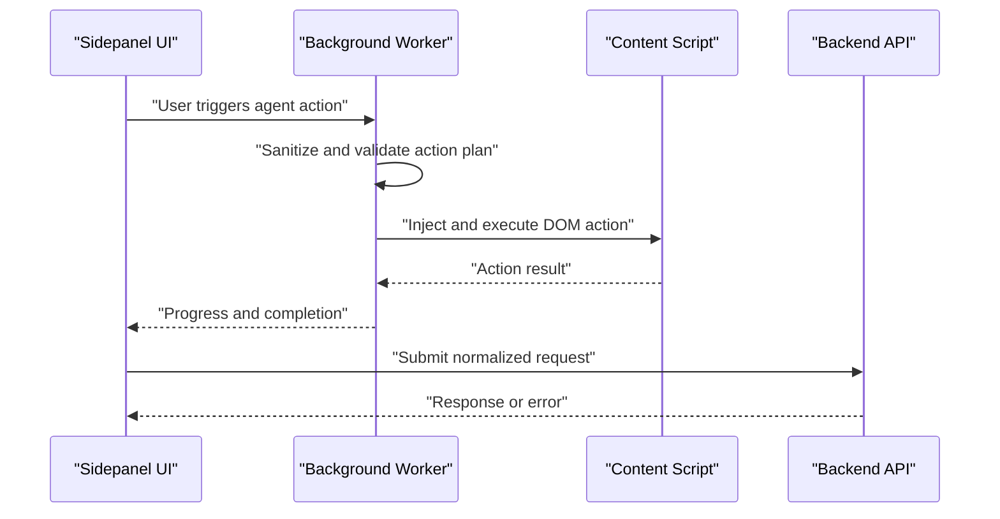
```mermaid
sequenceDiagram
participant UI as "Sidepanel UI"
participant BG as "Background Worker"
participant CS as "Content Script"
participant API as "Backend API"
UI->>BG : "User triggers agent action"
BG->>BG : "Sanitize and validate action plan"
BG->>CS : "Inject and execute DOM action"
CS-->>BG : "Action result"
BG-->>UI : "Progress and completion"
UI->>API : "Submit normalized request"
API-->>UI : "Response or error"
```

## Detailed component analysis

### Prompt injection prevention
- Purpose: Detect and reject prompt injection attempts in markdown inputs.
- Mechanism: Dedicated prompt template instructs the model to classify inputs as safe or unsafe.
- Impact: Reduces risk of LLM jailbreaking and unintended behavior.

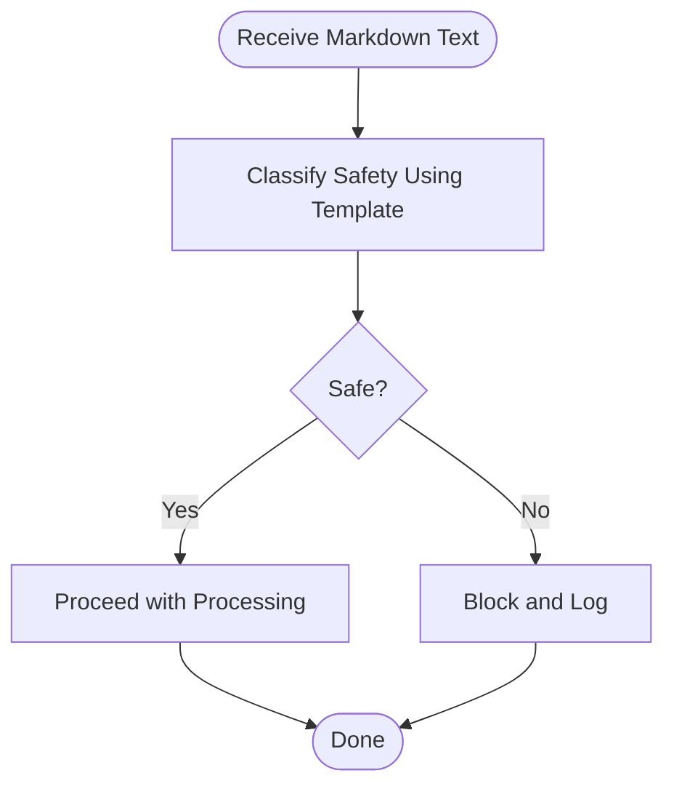
```mermaid
flowchart TD
Start(["Receive Markdown Text"]) --> Classify["Classify Safety Using Template"]
Classify --> Safe{"Safe?"}
Safe --> |Yes| Approve["Proceed with Processing"]
Safe --> |No| Block["Block and Log"]
Approve --> End(["Done"])
Block --> End
```

### Agent sanitization and action validation
- Purpose: Enforce strict schemas for LLM-generated action plans and block dangerous patterns.
- Mechanism: Validates JSON structure, action types, required fields, and disallows unsafe scripts.
- Impact: Prevents arbitrary code execution and malformed actions.

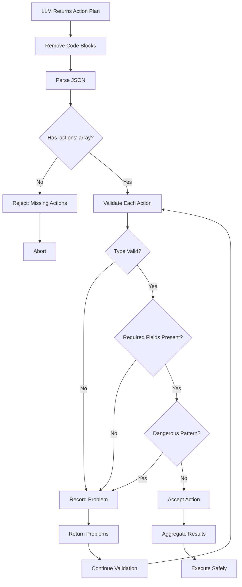
```mermaid
flowchart TD
A["LLM Returns Action Plan"] --> B["Remove Code Blocks"]
B --> C["Parse JSON"]
C --> D{"Has 'actions' array?"}
D --> |No| E["Reject: Missing Actions"]
D --> |Yes| F["Validate Each Action"]
F --> G{"Type Valid?"}
G --> |No| H["Record Problem"]
G --> |Yes| I{"Required Fields Present?"}
I --> |No| H
I --> |Yes| J{"Dangerous Pattern?"}
J --> |Yes| H
J --> |No| K["Accept Action"]
H --> L["Return Problems"]
K --> M["Aggregate Results"]
E --> N["Abort"]
L --> O["Continue Validation"]
M --> P["Execute Safely"]
O --> F
```

### User approval system and authentication
- Purpose: Manage OAuth flows, token lifecycle, and user consent.
- Mechanism: Uses browser identity APIs for OAuth; stores tokens in extension storage; supports manual refresh and expiry checks.
- Impact: Access to external services stays auditable.

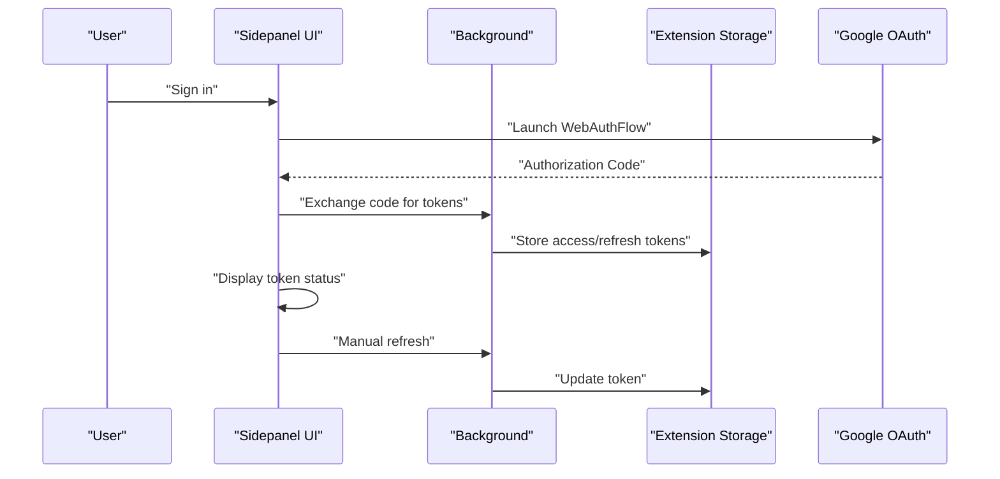
```mermaid
sequenceDiagram
participant User as "User"
participant UI as "Sidepanel UI"
participant BG as "Background"
participant Ext as "Extension Storage"
participant OAuth as "Google OAuth"
User->>UI : "Sign in"
UI->>OAuth : "Launch WebAuthFlow"
OAuth-->>UI : "Authorization Code"
UI->>BG : "Exchange code for tokens"
BG->>Ext : "Store access/refresh tokens"
UI->>UI : "Display token status"
UI->>BG : "Manual refresh"
BG->>Ext : "Update token"
```

### Activity logging and transparency
- Purpose: Provide visibility into extension actions and state.
- Mechanism: Background worker logs messages; content script logs per-page actions; WebSocket status updates UI.
- Impact: You can audit and troubleshoot from the logs.

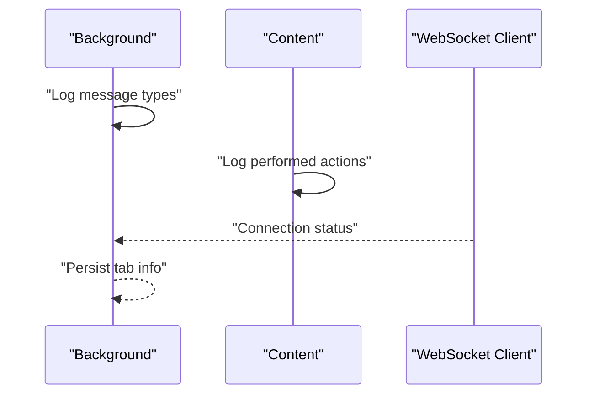
```mermaid
sequenceDiagram
participant BG as "Background"
participant CS as "Content"
participant WS as "WebSocket Client"
BG->>BG : "Log message types"
CS->>CS : "Log performed actions"
WS-->>BG : "Connection status"
BG-->>BG : "Persist tab info"
```

### Intelligent content filtering and URL normalization
- Purpose: Reduce risk by normalizing URLs and validating content contexts.
- Mechanism: Normalize GitHub URLs to repository-level; expose validation endpoint; capture client HTML for context.
- Impact: Limits noisy or risky contexts for agent actions.

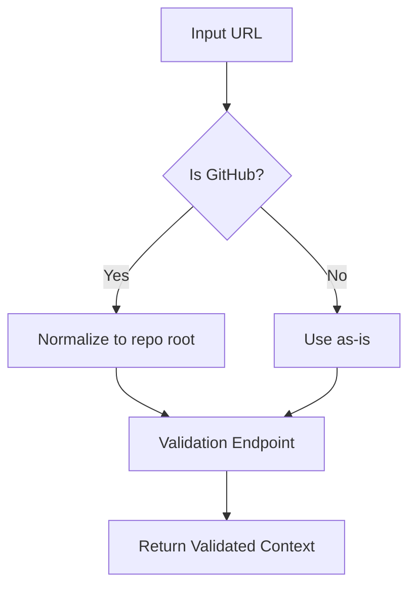
```mermaid
flowchart TD
S["Input URL"] --> P{"Is GitHub?"}
P --> |Yes| N["Normalize to repo root"]
P --> |No| R["Use as-is"]
N --> V["Validation Endpoint"]
R --> V
V --> O["Return Validated Context"]
```

### BYOKeys security model and secure communication
- Purpose: API keys stay in the local extension context.
- Mechanism: Dynamic import of Gemini SDK in background; API key supplied per-request; encryption utilities for sensitive payloads.
- Impact: Minimizes exposure of secrets and secures credential transport.

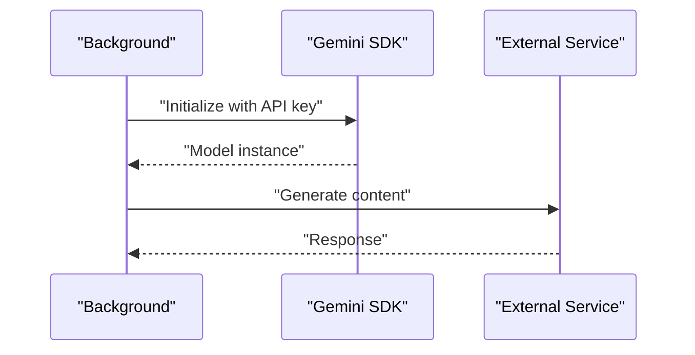
```mermaid
sequenceDiagram
participant BG as "Background"
participant SDK as "Gemini SDK"
participant API as "External Service"
BG->>SDK : "Initialize with API key"
SDK-->>BG : "Model instance"
BG->>API : "Generate content"
API-->>BG : "Response"
```

### Encrypted credential storage
- Purpose: Protect stored credentials using symmetric encryption with daily rotating keys.
- Mechanism: AES-CBC with fixed IV; key derived from date and random sequences; serialization/deserialization helpers.
- Impact: Adds cryptographic barrier against local storage theft.

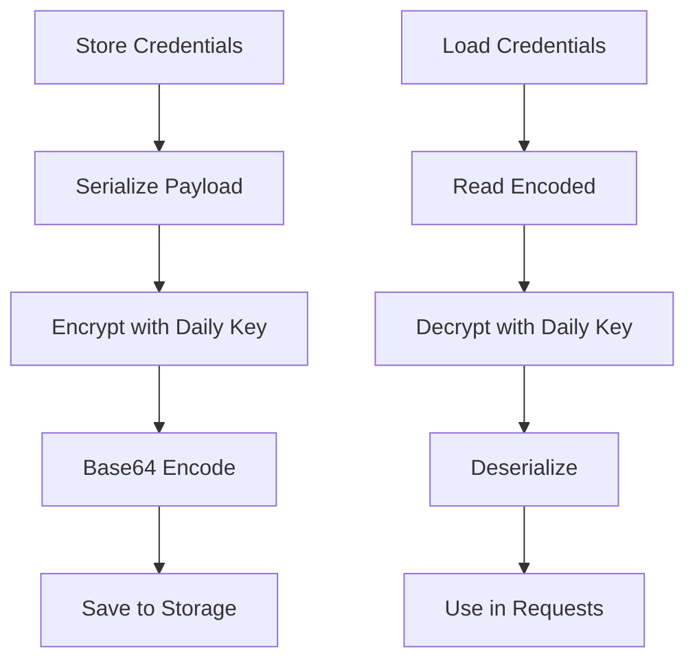
```mermaid
flowchart TD
A["Store Credentials"] --> B["Serialize Payload"]
B --> C["Encrypt with Daily Key"]
C --> D["Base64 Encode"]
D --> E["Save to Storage"]
F["Load Credentials"] --> G["Read Encoded"]
G --> H["Decrypt with Daily Key"]
H --> I["Deserialize"]
I --> J["Use in Requests"]
```

### Browser action execution and safety
- Purpose: Safely execute user-approved actions with minimal risk.
- Mechanism: Background worker injects content scripts; executes DOM actions with selectors; enforces delays and waits.
- Impact: Limits cross-site scripting risks and prevents runaway automation.

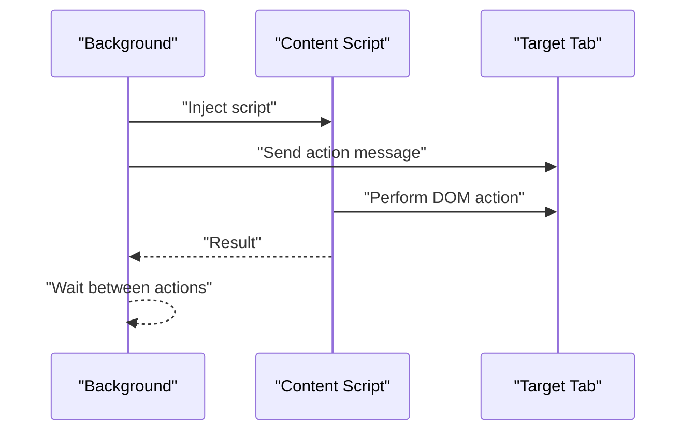
```mermaid
sequenceDiagram
participant BG as "Background"
participant CS as "Content Script"
participant Tab as "Target Tab"
BG->>CS : "Inject script"
BG->>Tab : "Send action message"
CS->>Tab : "Perform DOM action"
CS-->>BG : "Result"
BG-->>BG : "Wait between actions"
```

## Dependency analysis
- Extension-to-Backend: Sidepanel and background communicate via message passing; backend routes handle normalized requests.
- Security Utilities: Encryption utilities depend on date/time utilities; sanitizer and prompt validator are standalone.
- Configuration: Environment variables drive logging and host/port configuration.

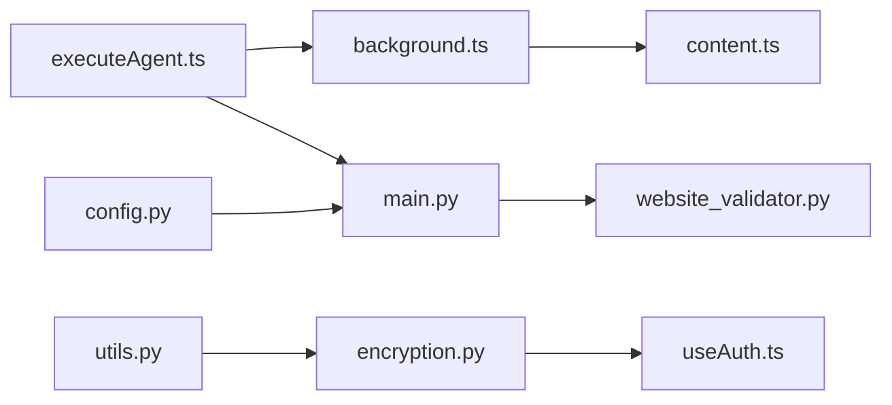
```mermaid
graph LR
EXG["executeAgent.ts"] --> BG["background.ts"]
BG --> CT["content.ts"]
EXG --> API["main.py"]
API --> WV["website_validator.py"]
ENC["encryption.py"] --> UA["useAuth.ts"]
UTL["utils.py"] --> ENC
CFG["config.py"] --> API
```

## Performance considerations
- Action Delays: Artificial delays between actions reduce rate-limiting and UI contention.
- Tab Navigation Waits: Waiting for navigation/reload completion avoids race conditions.
- Payload Limits: DOM extraction limits reduce memory footprint.
- Logging Overhead: Excessive logging can impact performance; tune levels appropriately.

## Troubleshooting guide
- Authentication Failures: Verify backend availability, OAuth client configuration, and token refresh logic.
- WebSocket Disconnections: Fallback to HTTP is supported; check connection status and auto-connect settings.
- Action Failures: Validate selectors, ensure content script injection succeeds, and confirm tab context.
- Encryption Issues: Confirm daily key rotation and encoding/decoding steps.

## Conclusion
Approve actions before they run, keep keys in the browser or env, and treat untrusted page text as hostile input. The sanitizer and injection checks are mandatory, not optional polish.

## Appendices

### Security configuration guidelines
- Environment Variables
 - Configure logging levels and backend host/port via environment variables.
 - Store secrets using secure secret managers; avoid committing to source control.
- API Endpoints
 - Restrict route prefixes and enable CORS policies appropriate to the extension origin.
- Extension Permissions
 - Grant only necessary permissions; minimize host permissions and content script matches.
- Encryption
 - Rotate keys daily; keep IVs constant; encode payloads before storage.

### Penetration testing approaches
- Input Validation
 - Test prompt injection vectors against the prompt injection validator.
 - Validate JSON action plans with malformed and malicious payloads.
- Authentication
 - Verify OAuth flows, token refresh, and expiration handling under network failures.
- Browser Actions
 - Attempt to inject unsafe selectors and scripts; ensure sanitization blocks them.
- Cryptography
 - Validate encryption boundaries and key derivation logic.

### Incident response procedures
- Detection
 - Monitor logs for authentication errors, WebSocket disconnections, and action failures.
- Containment
 - Temporarily disable affected routes or revoke tokens.
- Eradication
 - Patch vulnerabilities; rotate keys; update OAuth client secrets if compromised.
- Recovery
 - Re-enable services gradually; validate functionality; monitor metrics.
- Postmortem
 - Document root causes, remediation steps, and preventive controls.

### Security testing methodologies
- Static Analysis
 - Scan for hardcoded secrets, unsafe patterns, and insecure dependencies.
- Dynamic Analysis
 - Run automated tests against sanitized inputs and authenticated flows.
- Fuzzing
 - Fuzz JSON action plans and URL normalization logic.
- Penetration Testing
 - Perform authorized assessments targeting extension and backend.

### Code review practices
- Input Sanitization
 - Require sanitization and validation for all LLM outputs and user inputs.
- Authentication
 - Enforce token refresh and expiry checks; avoid storing tokens longer than necessary.
- Browser APIs
 - Validate permissions and message routing; avoid broad host permissions.
- Cryptography
 - Review key derivation, IV usage, and encoding/decoding correctness.

### Security monitoring strategies
- Logs
 - Centralize extension and backend logs; apply retention policies.
- Metrics
 - Track authentication success rates, action execution rates, and WebSocket connectivity.
- Alerts
 - Alert on repeated failures, unusual spikes, and authentication anomalies.

### Secure development practices
- Least Privilege
 - Limit extension permissions and API access.
- Defense in Depth
 - Combine multiple safeguards: sanitization, validation, encryption, and authorization.
- Secure Defaults
 - Disable debug logs in production; enforce HTTPS and secure cookies.
- Updates Management
 - Establish a process for timely updates to dependencies and cryptography libraries.

