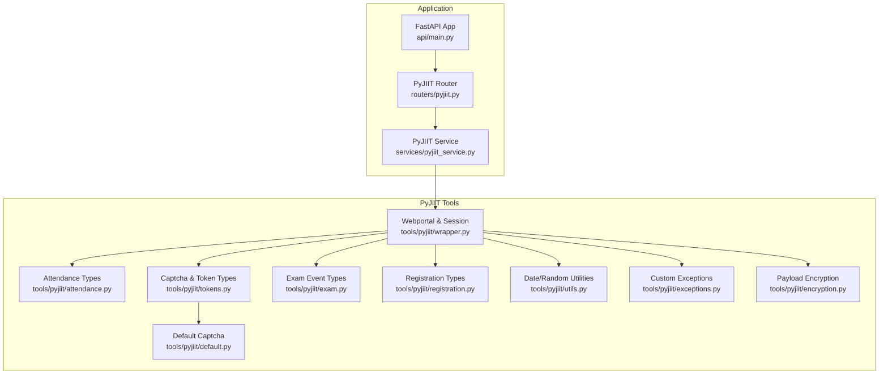
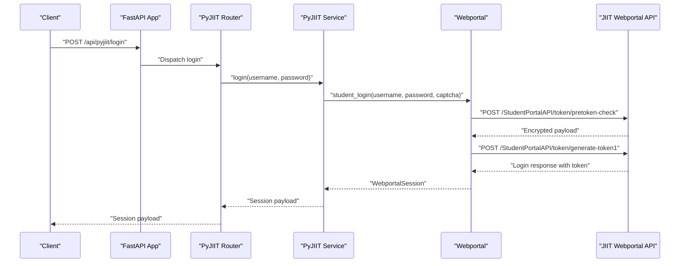
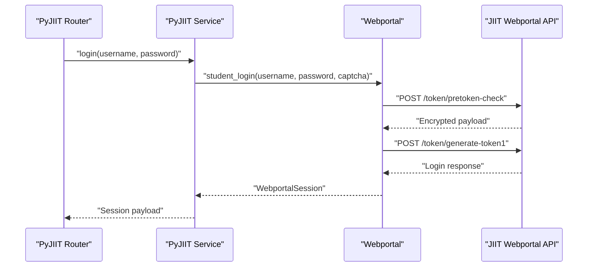
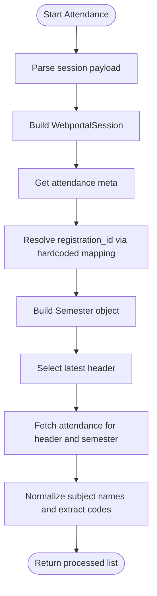
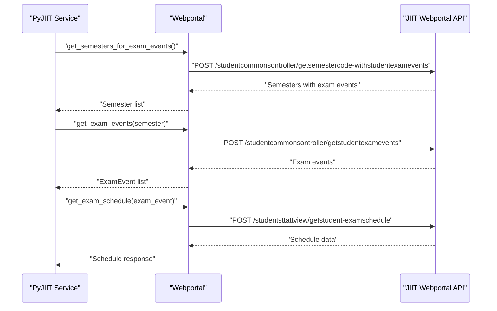
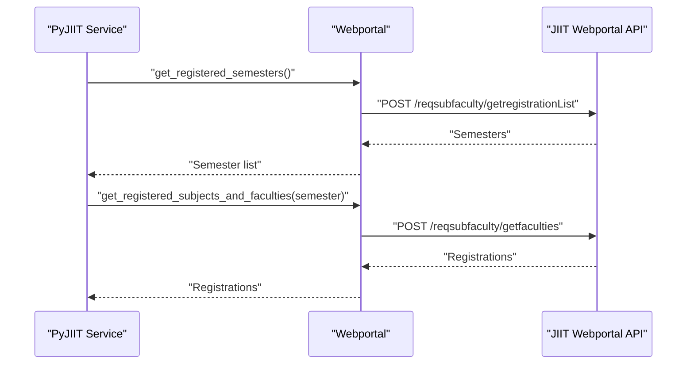
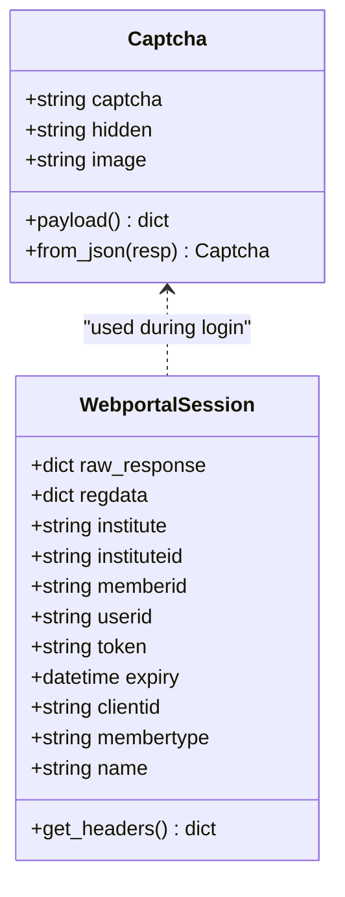
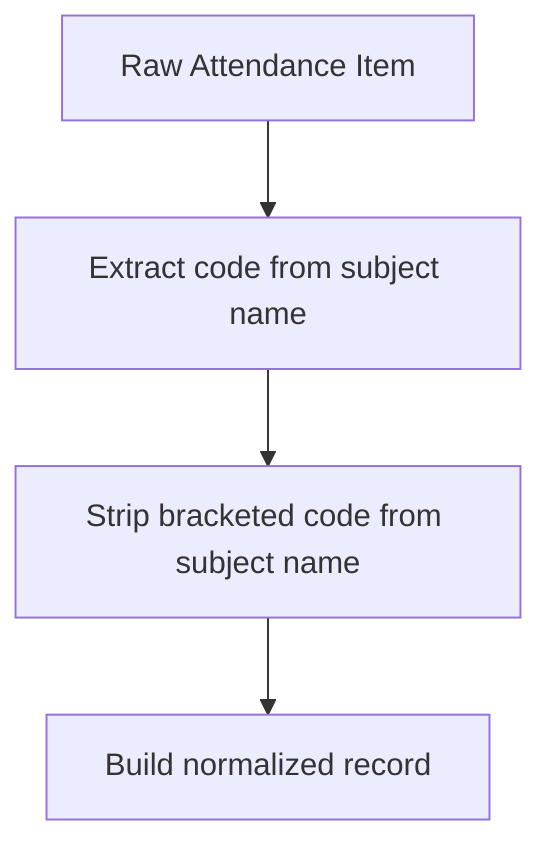
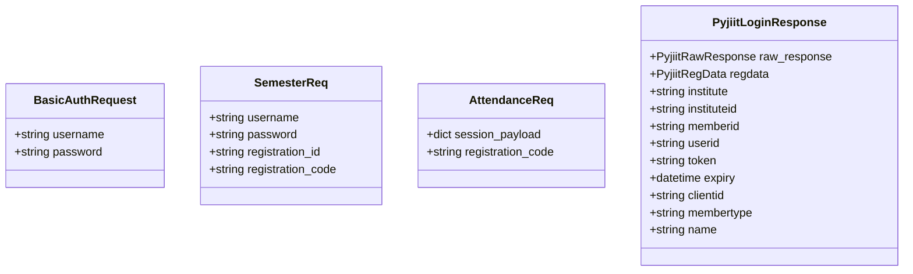
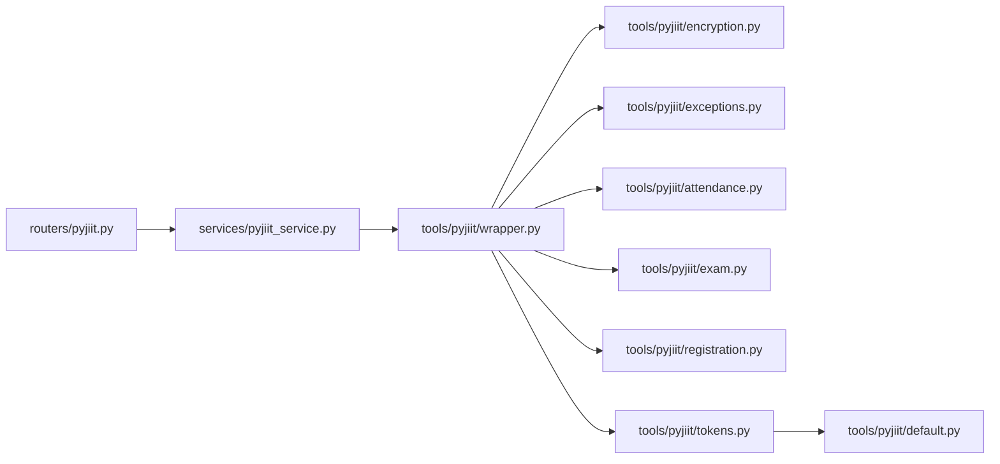

# Academic portal integration

## Introduction
This page explains the JIIT academic portal integration built around the pyjiit service layer. It covers authentication, session management, and academic data workflows including attendance tracking, exam schedule retrieval, course registration assistance, and token management. It also documents request/response handling, data extraction patterns, grade and schedule parsing, security considerations, session timeouts, performance optimization, and troubleshooting for common portal access issues.

## Project structure
The integration spans a FastAPI application with dedicated router and service layers for pyjiit, backed by a set of pyjiit utilities that encapsulate portal communication, encryption, and data models.

```mermaid
graph TB
subgraph "Application"
API["FastAPI App<br/>api/main.py"]
Router["PyJIIT Router<br/>routers/pyjiit.py"]
Service["PyJIIT Service<br/>services/pyjiit_service.py"]
end
subgraph "PyJIIT Tools"
Wrapper["Webportal & Session<br/>tools/pyjiit/wrapper.py"]
Attendance["Attendance Types<br/>tools/pyjiit/attendance.py"]
Tokens["Captcha & Token Types<br/>tools/pyjiit/tokens.py"]
Defaults["Default Captcha<br/>tools/pyjiit/default.py"]
Exam["Exam Event Types<br/>tools/pyjiit/exam.py"]
Registration["Registration Types<br/>tools/pyjiit/registration.py"]
Utils["Date/Random Utilities<br/>tools/pyjiit/utils.py"]
Exceptions["Custom Exceptions<br/>tools/pyjiit/exceptions.py"]
Encryption["Payload Encryption<br/>tools/pyjiit/encryption.py"]
end
API --> Router --> Service
Service --> Wrapper
Wrapper --> Attendance
Wrapper --> Tokens
Wrapper --> Exam
Wrapper --> Registration
Wrapper --> Encryption
Wrapper --> Exceptions
Wrapper --> Utils
Tokens --> Defaults
```

## Core components
- PyJIIT Router: Exposes endpoints for login, semesters, and attendance. It validates requests and delegates to the service layer.
- PyJIIT Service: Orchestrates session creation, data retrieval, and response shaping. It handles session deserialization and hard-coded semester selection for attendance.
- Webportal and WebportalSession: Encapsulate portal authentication, token decoding, and HTTP interactions with the JIIT API.
- Data Models: Attendance, ExamEvent, Registrations, and Semester types define structured academic data.
- Encryption and Utilities: Payload serialization/deserialization, LocalName header generation, and date-based keys enable secure communication.
- Exceptions: Distinct exception types model API errors, login failures, session invalidation, and account-related issues.

## Architecture overview
The system follows a layered architecture:
- API Layer: FastAPI app registers routers and exposes endpoints under a unified prefix.
- Router Layer: Validates requests and invokes the service layer.
- Service Layer: Manages sessions and orchestrates academic data workflows.
- Tool Layer: Implements portal-specific logic, encryption, and data models.

```mermaid
sequenceDiagram
participant Client as "Client"
participant API as "FastAPI App"
participant Router as "PyJIIT Router"
participant Service as "PyJIIT Service"
participant WP as "Webportal"
participant Portal as "JIIT Webportal API"
Client->>API : "POST /api/pyjiit/login"
API->>Router : "Dispatch login"
Router->>Service : "login(username, password)"
Service->>WP : "student_login(username, password, captcha)"
WP->>Portal : "POST /StudentPortalAPI/token/pretoken-check"
Portal-->>WP : "Encrypted payload"
WP->>Portal : "POST /StudentPortalAPI/token/generate-token1"
Portal-->>WP : "Login response with token"
WP-->>Service : "WebportalSession"
Service-->>Router : "Session payload"
Router-->>Client : "Session payload"
```

## Detailed component analysis

### Authentication and session management
- Login flow:
  - Router accepts BasicAuthRequest credentials.
  - Service constructs a Webportal instance and calls student_login with a default captcha.
  - Webportal performs two-step token exchange and returns a WebportalSession containing token, expiry, and metadata.
- Session decoding:
  - WebportalSession parses the token to compute expiry and prepares Authorization headers.
- Session validation:
  - The authenticated decorator checks session presence and optionally expiry (currently commented out due to API behavior).

```mermaid
sequenceDiagram
participant Router as "PyJIIT Router"
participant Service as "PyJIIT Service"
participant WP as "Webportal"
participant Portal as "JIIT Webportal API"
Router->>Service : "login(username, password)"
Service->>WP : "student_login(username, password, captcha)"
WP->>Portal : "POST /token/pretoken-check"
Portal-->>WP : "Encrypted payload"
WP->>Portal : "POST /token/generate-token1"
Portal-->>WP : "Login response"
WP-->>Service : "WebportalSession"
Service-->>Router : "Session payload"
```

### Attendance tracking
- Workflow:
  - Service accepts a session payload (raw or nested) and builds a WebportalSession.
  - Retrieves attendance meta to obtain headers and semesters.
  - Uses a hardcoded registration mapping to resolve registration_id for a target registration_code.
  - Builds a Semester object and fetches attendance for the latest header.
  - Processes raw attendance items to normalize subject names and extract codes.
- Output:
  - Returns a list of attendance records with normalized subject names and extracted codes.

```mermaid
flowchart TD
Start(["Start Attendance"]) --> Parse["Parse session payload"]
Parse --> BuildSession["Build WebportalSession"]
BuildSession --> Meta["Get attendance meta"]
Meta --> ResolveSem["Resolve registration_id via hardcoded mapping"]
ResolveSem --> BuildSem["Build Semester object"]
BuildSem --> LatestHeader["Select latest header"]
LatestHeader --> Fetch["Fetch attendance for header and semester"]
Fetch --> Normalize["Normalize subject names and extract codes"]
Normalize --> Return(["Return processed list"])
```

### Exam schedule retrieval
- Workflow:
  - Retrieve semesters with exam events for the student.
  - Select an exam event and fetch the schedule for that event.
- Output:
  - Returns schedule data for the chosen exam event.

```mermaid
sequenceDiagram
participant Service as "PyJIIT Service"
participant WP as "Webportal"
participant Portal as "JIIT Webportal API"
Service->>WP : "get_semesters_for_exam_events()"
WP->>Portal : "POST /studentcommonsontroller/getsemestercode-withstudentexamevents"
Portal-->>WP : "Semesters with exam events"
WP-->>Service : "Semester list"
Service->>WP : "get_exam_events(semester)"
WP->>Portal : "POST /studentcommonsontroller/getstudentexamevents"
Portal-->>WP : "Exam events"
WP-->>Service : "ExamEvent list"
Service->>WP : "get_exam_schedule(exam_event)"
WP->>Portal : "POST /studentsttattview/getstudent-examschedule"
Portal-->>WP : "Schedule data"
WP-->>Service : "Schedule response"
```

### Course registration assistance
- Workflow:
  - Retrieve registered semesters for the student.
  - Fetch registered subjects and faculty details for a given semester.
- Output:
  - Returns total credits and a list of RegisteredSubject entries.

```mermaid
sequenceDiagram
participant Service as "PyJIIT Service"
participant WP as "Webportal"
participant Portal as "JIIT Webportal API"
Service->>WP : "get_registered_semesters()"
WP->>Portal : "POST /reqsubfaculty/getregistrationList"
Portal-->>WP : "Semesters"
WP-->>Service : "Semester list"
Service->>WP : "get_registered_subjects_and_faculties(semester)"
WP->>Portal : "POST /reqsubfaculty/getfaculties"
Portal-->>WP : "Registrations"
WP-->>Service : "Registrations"
```

### Token management capabilities
- Captcha handling:
  - Default captcha is provided for initial login attempts.
  - Captcha instances carry captcha, hidden, and image fields and can produce a payload.
- Token decoding:
  - WebportalSession decodes the token's payload to compute expiry.
- LocalName header:
  - Encryption utilities generate a LocalName header required for every request.

```mermaid
classDiagram
class Captcha {
+string captcha
+string hidden
+string image
+payload() dict
+from_json(resp) Captcha
}
class WebportalSession {
+dict raw_response
+dict regdata
+string institute
+string instituteid
+string memberid
+string userid
+string token
+datetime expiry
+string clientid
+string membertype
+string name
+get_headers() dict
}
Captcha <.. WebportalSession : "used during login"
```

### Academic data processing workflows
- Attendance normalization:
  - Extract codes from subject names using regex and strip bracketed suffixes.
- Grade and Transcript:
  - Retrieve semesters for grade card, fetch program and branch IDs, and obtain grade card data.
  - Download marks PDF for a semester.
- SGPA/CGPA:
  - Fetch cumulative and semester-wise SGPA/CGPA data.

```mermaid
flowchart TD
A["Raw Attendance Item"] --> B["Extract code from subject name"]
B --> C["Strip bracketed code from subject name"]
C --> D["Build normalized record"]
```

### Request/Response handling for academic operations
- Login:
  - Request: BasicAuthRequest with username and password.
  - Response: Session payload compatible with WebportalSession.
- Semesters:
  - Request: Session payload (full or raw).
  - Response: List of registration_id and registration_code pairs.
- Attendance:
  - Request: Session payload and optional registration_code.
  - Response: Normalized attendance records.

```mermaid
classDiagram
class BasicAuthRequest {
+string username
+string password
}
class SemesterReq {
+string username
+string password
+string registration_id
+string registration_code
}
class AttendanceReq {
+dict session_payload
+string registration_code
}
class PyjiitLoginResponse {
+PyjiitRawResponse raw_response
+PyjiitRegData regdata
+string institute
+string instituteid
+string memberid
+string userid
+string token
+datetime expiry
+string clientid
+string membertype
+string name
}
```

## Dependency analysis
- Router depends on PyJIIT Service for business logic.
- Service depends on Webportal and WebportalSession for session management and API interactions.
- Webportal depends on Encryption utilities for payload handling and on Exceptions for error modeling.
- Data models (Attendance, ExamEvent, Registrations, Semester) are used across workflows.

```mermaid
graph LR
Router["routers/pyjiit.py"] --> Service["services/pyjiit_service.py"]
Service --> Wrapper["tools/pyjiit/wrapper.py"]
Wrapper --> Encryption["tools/pyjiit/encryption.py"]
Wrapper --> Exceptions["tools/pyjiit/exceptions.py"]
Wrapper --> Attendance["tools/pyjiit/attendance.py"]
Wrapper --> Exam["tools/pyjiit/exam.py"]
Wrapper --> Registration["tools/pyjiit/registration.py"]
Wrapper --> Tokens["tools/pyjiit/tokens.py"]
Tokens --> Defaults["tools/pyjiit/default.py"]
```

## Performance considerations
- Payload encryption/decryption overhead: Serialization and AES operations occur per request; minimize unnecessary re-encryptions by caching session tokens and reusing headers.
- Network latency: Batch related operations (e.g., semesters, registrations, attendance) within a single session to reduce repeated authentication overhead.
- Regex normalization: Keep normalization logic efficient; avoid repeated computations by precomputing patterns.
- Token expiry handling: While automatic expiry checks are currently disabled due to API behavior, monitor for future reliability improvements.

[No sources needed since this section provides general guidance]

## Troubleshooting guide
- Authentication failures:
  - Verify username/password and captcha correctness. The default captcha is provided for convenience but may require dynamic retrieval in production.
  - Inspect LoginError exceptions raised during token exchange.
- Session timeouts/expiry:
  - WebportalSession decodes token expiry; handle SessionExpired errors when encountered.
  - Re-authenticate using the login endpoint to refresh the session.
- Data synchronization problems:
  - Confirm that the session payload is passed correctly (either full response or raw response dict).
  - For attendance, ensure the hardcoded registration mapping aligns with the intended semester.
- Portal downtime:
  - Monitor HTTP 401 responses and APIError exceptions; retry after the portal stabilizes.
- Subject normalization issues:
  - Review regex patterns used to extract codes from subject names and adjust if naming conventions change.

## Conclusion
The pyjiit integration provides a reliable foundation for accessing JIIT academic data through a clean service layer and well-defined academic workflows. By using session-aware wrappers, structured data models, and secure payload handling, the system supports attendance tracking, exam schedules, course registration insights, and token management. Proper error handling, session lifecycle management, and performance-conscious design ensure reliable operation against the portal's API.

[No sources needed since this section summarizes without analyzing specific files]

## Appendices

### API endpoints overview
- POST /api/pyjiit/login
  - Request: BasicAuthRequest
  - Response: Session payload compatible with WebportalSession
- POST /api/pyjiit/semesters
  - Request: Session payload (full or raw)
  - Response: List of registration_id and registration_code pairs
- POST /api/pyjiit/attendence
  - Request: AttendanceReq (session_payload, optional registration_code)
  - Response: Normalized attendance records
