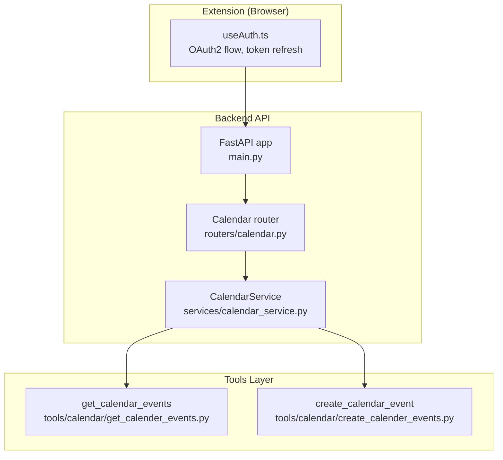
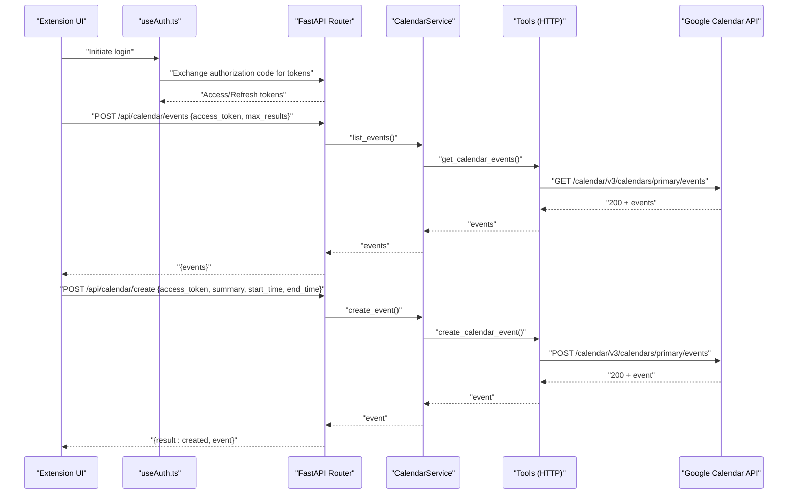
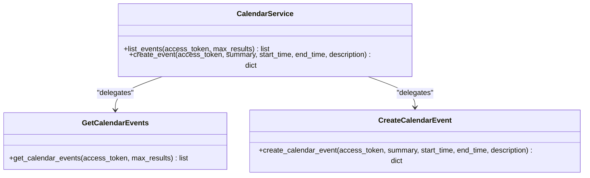
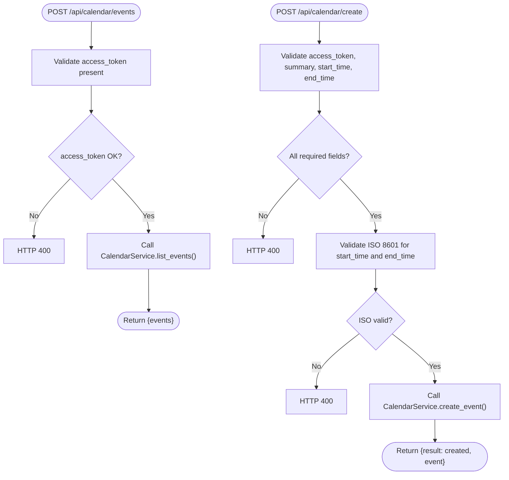
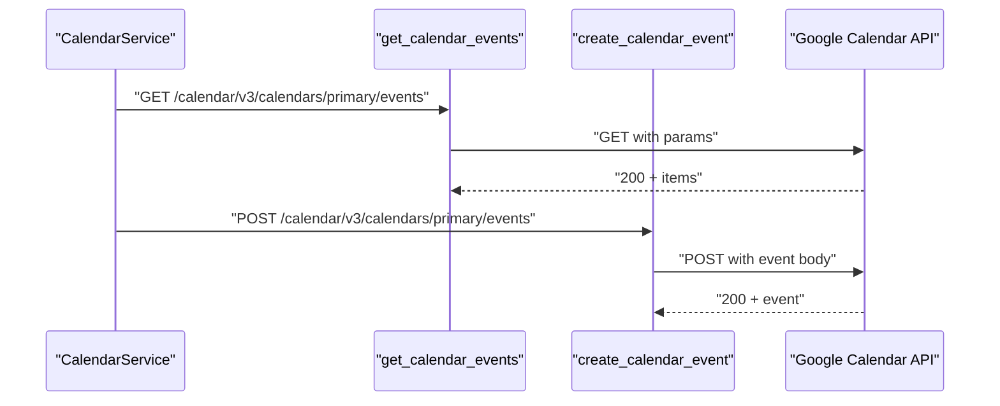
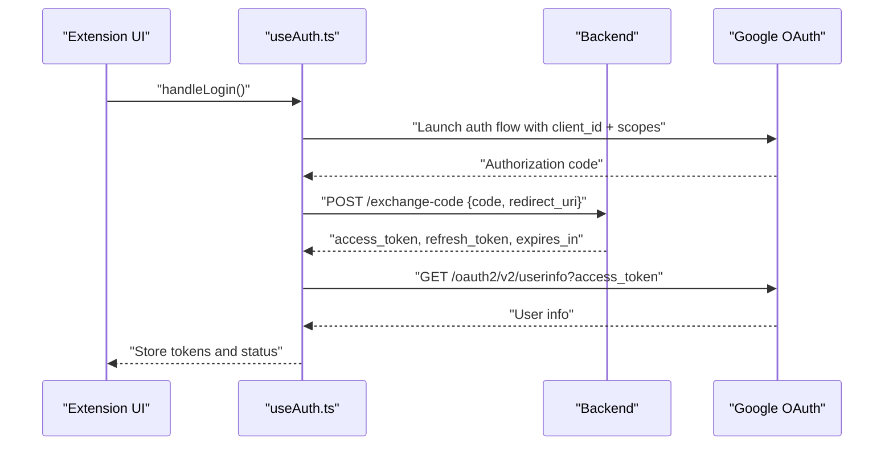
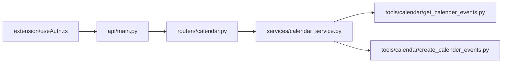

# Calendar Integration

<cite>
**Referenced Files in This Document**
- [calendar_service.py](file://services/calendar_service.py)
- [calendar.py](file://routers/calendar.py)
- [create_calender_events.py](file://tools/calendar/create_calender_events.py)
- [get_calender_events.py](file://tools/calendar/get_calender_events.py)
- [useAuth.ts](file://extension/entrypoints/sidepanel/hooks/useAuth.ts)
- [react_tools.py](file://agents/react_tools.py)
- [main.py](file://api/main.py)
- [config.py](file://core/config.py)
</cite>

## Table of Contents
1. [Introduction](#introduction)
2. [Project Structure](#project-structure)
3. [Core Components](#core-components)
4. [Architecture Overview](#architecture-overview)
5. [Detailed Component Analysis](#detailed-component-analysis)
6. [Dependency Analysis](#dependency-analysis)
7. [Performance Considerations](#performance-considerations)
8. [Troubleshooting Guide](#troubleshooting-guide)
9. [Conclusion](#conclusion)

## Introduction
This document explains the Google Calendar service integration implemented in the project. It covers calendar operations (event listing and creation), the OAuth2 authentication flow for Google Calendar API, scope configuration, request/response handling, and operational guidelines. It also documents date/time handling, timezone behavior, and practical guidance for performance and troubleshooting.

## Project Structure
The calendar integration spans three layers:
- Frontend extension: handles OAuth2 login, token storage, and token refresh.
- Backend API: exposes endpoints to list and create calendar events using an access token.
- Tools layer: wraps Google Calendar API calls (HTTP requests) for listing and creating events.

**Diagram sources**
- [main.py](file://api/main.py#L12-L41)
- [calendar.py](file://routers/calendar.py#L1-L113)
- [calendar_service.py](file://services/calendar_service.py#L1-L38)
- [get_calender_events.py](file://tools/calendar/get_calender_events.py#L1-L52)
- [create_calender_events.py](file://tools/calendar/create_calender_events.py#L1-L70)
- [useAuth.ts](file://extension/entrypoints/sidepanel/hooks/useAuth.ts#L1-L311)

**Section sources**
- [main.py](file://api/main.py#L12-L41)
- [calendar.py](file://routers/calendar.py#L1-L113)
- [calendar_service.py](file://services/calendar_service.py#L1-L38)
- [get_calender_events.py](file://tools/calendar/get_calender_events.py#L1-L52)
- [create_calender_events.py](file://tools/calendar/create_calender_events.py#L1-L70)
- [useAuth.ts](file://extension/entrypoints/sidepanel/hooks/useAuth.ts#L1-L311)

## Core Components
- CalendarService: orchestrates calendar operations by delegating to tools that call Google Calendar API.
- Routers: FastAPI endpoints validating inputs and invoking CalendarService.
- Tools: HTTP clients to Google Calendar API for listing and creating events.
- Extension auth hook: manages OAuth2 login, token refresh, and storage.

Key responsibilities:
- Event listing: fetches upcoming primary calendar events with pagination and ordering.
- Event creation: posts a new event to the primary calendar with ISO 8601 timestamps and UTC timezone.
- Authentication: obtains and refreshes access tokens via browser identity APIs and backend token exchange endpoints.

**Section sources**
- [calendar_service.py](file://services/calendar_service.py#L8-L38)
- [calendar.py](file://routers/calendar.py#L32-L112)
- [get_calender_events.py](file://tools/calendar/get_calender_events.py#L6-L23)
- [create_calender_events.py](file://tools/calendar/create_calender_events.py#L6-L40)
- [useAuth.ts](file://extension/entrypoints/sidepanel/hooks/useAuth.ts#L128-L190)

## Architecture Overview
The integration follows a layered architecture:
- Extension frontend authenticates the user and stores tokens.
- Backend routes accept validated requests and delegate to the service layer.
- Service layer invokes tools that call Google Calendar API.
- Tools encapsulate HTTP calls and error handling.

**Diagram sources**
- [useAuth.ts](file://extension/entrypoints/sidepanel/hooks/useAuth.ts#L128-L190)
- [calendar.py](file://routers/calendar.py#L32-L112)
- [calendar_service.py](file://services/calendar_service.py#L8-L38)
- [get_calender_events.py](file://tools/calendar/get_calender_events.py#L6-L23)
- [create_calender_events.py](file://tools/calendar/create_calender_events.py#L6-L40)

## Detailed Component Analysis

### CalendarService
- Responsibilities:
  - List events: delegates to the listing tool with access token and max results.
  - Create event: delegates to the creation tool with access token, summary, start/end times, and optional description.
- Error handling: logs exceptions and re-raises to the caller.

**Diagram sources**
- [calendar_service.py](file://services/calendar_service.py#L8-L38)
- [get_calender_events.py](file://tools/calendar/get_calender_events.py#L6-L23)
- [create_calender_events.py](file://tools/calendar/create_calender_events.py#L6-L40)

**Section sources**
- [calendar_service.py](file://services/calendar_service.py#L8-L38)

### Routers: Calendar Endpoints
- GET-style endpoints (POST with request bodies) for:
  - Listing events: validates presence of access token and max results; forwards to service.
  - Creating events: validates presence of access token, summary, and ISO 8601 start/end times; forwards to service.
- Request validation:
  - Enforces ISO 8601 format for start_time and end_time.
  - Returns HTTP 400 for invalid or missing fields.
- Response:
  - Listing returns a list of events.
  - Creation returns a result and the created event object.

**Diagram sources**
- [calendar.py](file://routers/calendar.py#L32-L112)

**Section sources**
- [calendar.py](file://routers/calendar.py#L32-L112)

### Tools: Google Calendar API Wrappers
- Listing events:
  - Endpoint: primary calendar events.
  - Query parameters: max results, order by start time, single events, minimum time from now.
  - Timeout: short-lived GET.
- Creating events:
  - Endpoint: primary calendar events.
  - Payload: summary, description, start/end with dateTime and timezone set to UTC.
  - Timeout: moderate POST.
- Error handling: raises exceptions on non-200 responses.

**Diagram sources**
- [get_calender_events.py](file://tools/calendar/get_calender_events.py#L6-L23)
- [create_calender_events.py](file://tools/calendar/create_calender_events.py#L6-L40)

**Section sources**
- [get_calender_events.py](file://tools/calendar/get_calender_events.py#L6-L23)
- [create_calender_events.py](file://tools/calendar/create_calender_events.py#L6-L40)

### Authentication Flow (OAuth2)
- Extension login:
  - Uses browser identity APIs to launch web auth flow with configured client ID and scopes.
  - Scopes include Google Calendar and Gmail scopes.
  - Exchanges authorization code for tokens via backend endpoints.
  - Stores access and refresh tokens, along with metadata.
- Token refresh:
  - Automatically refreshes access tokens when nearing expiration if a refresh token exists.
  - Provides manual refresh capability in UI.

**Diagram sources**
- [useAuth.ts](file://extension/entrypoints/sidepanel/hooks/useAuth.ts#L128-L190)

**Section sources**
- [useAuth.ts](file://extension/entrypoints/sidepanel/hooks/useAuth.ts#L128-L190)

### Agent Tool Integration
- React agent tools define Pydantic models for calendar operations:
  - CalendarToolInput: access token and max results.
  - CalendarCreateEventInput: summary, start_time, end_time, description, optional access token.
- Tools:
  - _calendar_tool: fetches events via get_calendar_events.
  - _calendar_create_event_tool: creates events via create_calendar_event.
- Behavior:
  - Bounds max_results to a safe range.
  - Uses provided token or a default token when available.

**Section sources**
- [react_tools.py](file://agents/react_tools.py#L158-L198)
- [react_tools.py](file://agents/react_tools.py#L378-L435)

## Dependency Analysis
- API wiring:
  - FastAPI app registers the calendar router under /api/calendar.
- Router-to-service:
  - Routers depend on CalendarService instances.
- Service-to-tools:
  - CalendarService depends on tools for listing and creating events.
- Frontend-to-backend:
  - Extension uses backend endpoints to exchange code and manage tokens.

**Diagram sources**
- [main.py](file://api/main.py#L14-L40)
- [calendar.py](file://routers/calendar.py#L1-L113)
- [calendar_service.py](file://services/calendar_service.py#L1-L38)
- [get_calender_events.py](file://tools/calendar/get_calender_events.py#L1-L52)
- [create_calender_events.py](file://tools/calendar/create_calender_events.py#L1-L70)
- [useAuth.ts](file://extension/entrypoints/sidepanel/hooks/useAuth.ts#L1-L311)

**Section sources**
- [main.py](file://api/main.py#L14-L40)
- [calendar.py](file://routers/calendar.py#L1-L113)
- [calendar_service.py](file://services/calendar_service.py#L1-L38)
- [get_calender_events.py](file://tools/calendar/get_calender_events.py#L1-L52)
- [create_calender_events.py](file://tools/calendar/create_calender_events.py#L1-L70)
- [useAuth.ts](file://extension/entrypoints/sidepanel/hooks/useAuth.ts#L1-L311)

## Performance Considerations
- Timeouts:
  - Listing events uses a short timeout for responsiveness.
  - Creating events uses a slightly longer timeout to accommodate network variability.
- Pagination and ordering:
  - Listing events orders by start time and returns single events only, reducing payload size.
- Rate limits:
  - No explicit quota handling is implemented in the code. When interacting with Google Calendar API, observe per-user and per-project quotas. Consider batching operations and adding retry/backoff logic if needed.
- Timezone handling:
  - Event creation sets timezone to UTC in the request payload. Ensure callers supply ISO 8601 timestamps in the intended local time; the API will interpret them accordingly.

[No sources needed since this section provides general guidance]

## Troubleshooting Guide
Common issues and resolutions:
- Missing or invalid access token:
  - Ensure the access token is present and not expired. Use the extension’s token display and refresh controls.
- Invalid ISO 8601 timestamps:
  - Verify start_time and end_time conform to ISO 8601. The router enforces this and returns HTTP 400 otherwise.
- Network timeouts:
  - Listing and creation endpoints specify timeouts. Retry after verifying connectivity and token validity.
- Token refresh failures:
  - If automatic refresh fails, use the manual refresh button in the extension UI to obtain a new access token.
- Backend endpoint errors:
  - The router catches exceptions and returns HTTP 500 with the error message. Check backend logs for details.

Operational checks:
- Confirm backend is running and reachable.
- Verify the calendar router is registered under /api/calendar.
- Ensure the extension has stored a valid access token and refresh token when available.

**Section sources**
- [calendar.py](file://routers/calendar.py#L36-L56)
- [calendar.py](file://routers/calendar.py#L74-L112)
- [useAuth.ts](file://extension/entrypoints/sidepanel/hooks/useAuth.ts#L91-L126)
- [useAuth.ts](file://extension/entrypoints/sidepanel/hooks/useAuth.ts#L271-L295)

## Conclusion
The calendar integration provides a clean separation of concerns: the extension manages authentication and token lifecycle, the backend exposes typed endpoints with validation, the service layer coordinates operations, and the tools encapsulate Google Calendar API interactions. By adhering to ISO 8601 timestamps, UTC timezone semantics, and robust error handling, the system supports reliable calendar operations. For production deployments, consider adding quota awareness, retry/backoff strategies, and enhanced logging for diagnostics.