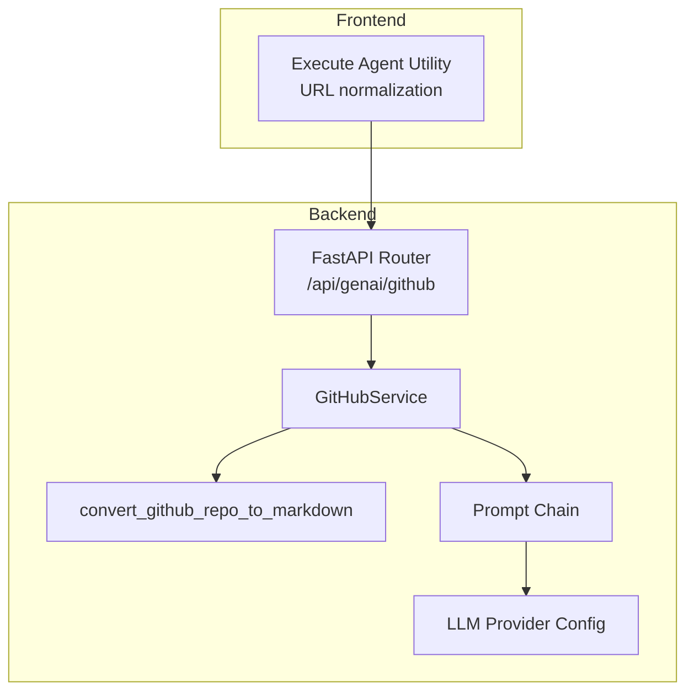
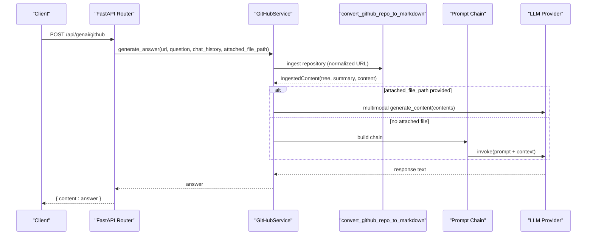
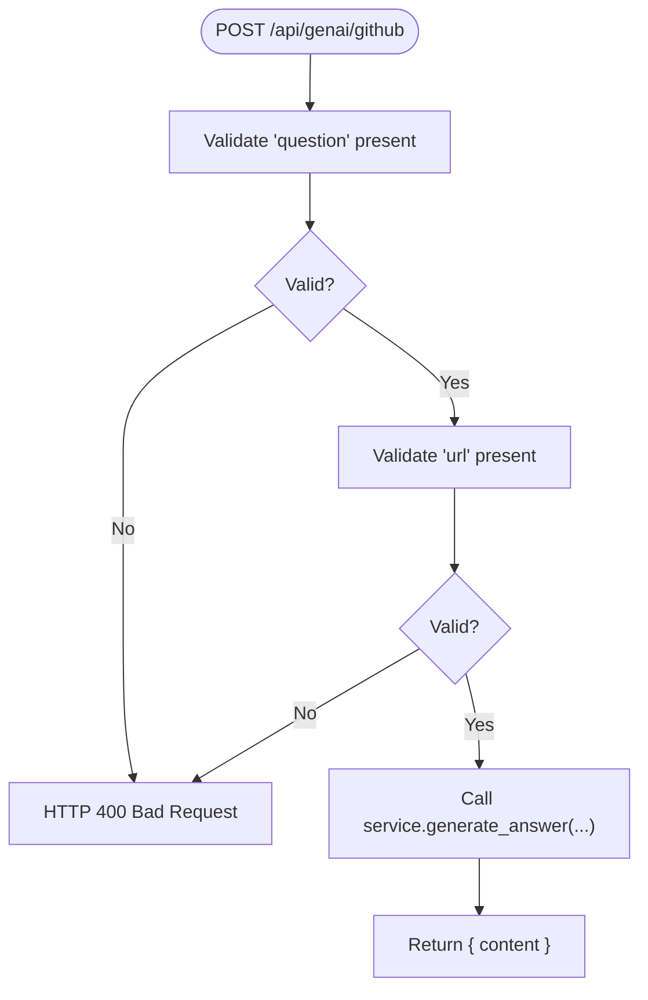
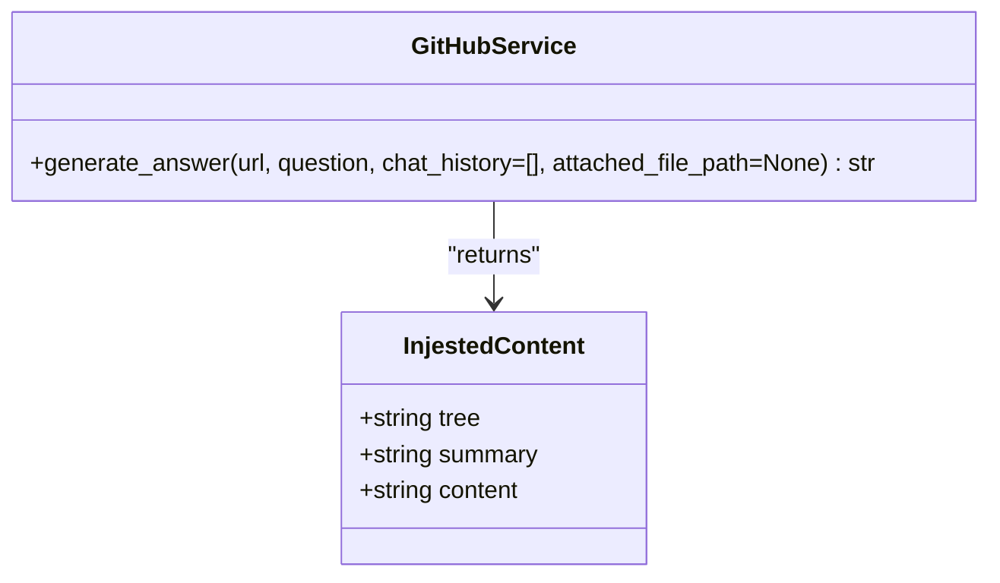
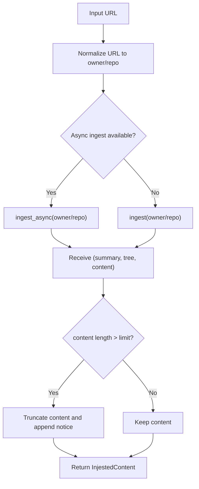
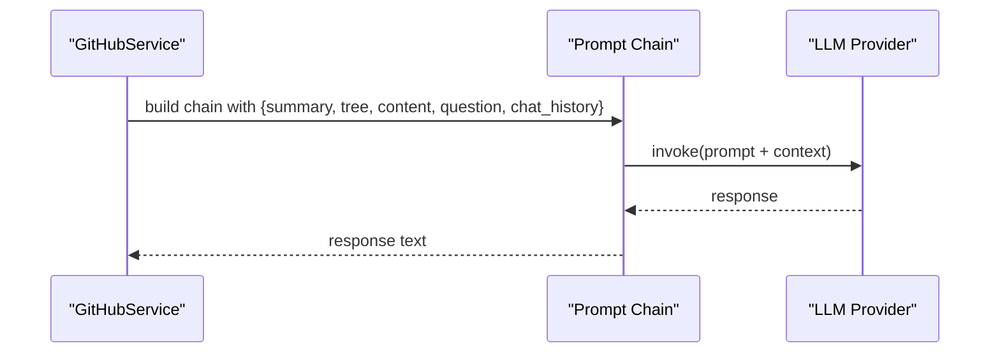
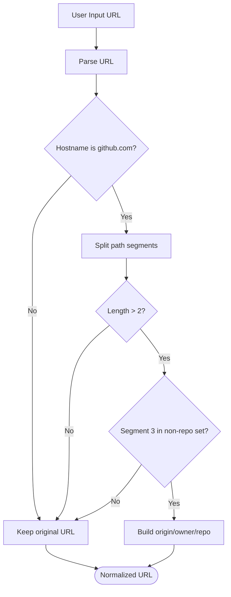
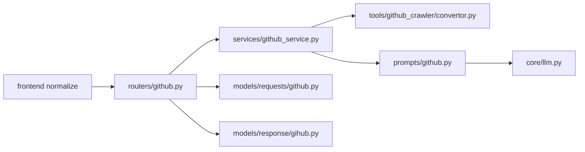

# GitHub Integration

<cite>
**Referenced Files in This Document**
- [services/github_service.py](file://services/github_service.py)
- [routers/github.py](file://routers/github.py)
- [models/requests/github.py](file://models/requests/github.py)
- [models/response/gihub.py](file://models/response/gihub.py)
- [tools/github_crawler/convertor.py](file://tools/github_crawler/convertor.py)
- [prompts/github.py](file://prompts/github.py)
- [core/config.py](file://core/config.py)
- [core/llm.py](file://core/llm.py)
- [extension/entrypoints/utils/executeAgent.ts](file://extension/entrypoints/utils/executeAgent.ts)
- [extension/entrypoints/sidepanel/hooks/useAuth.ts](file://extension/entrypoints/sidepanel/hooks/useAuth.ts)
</cite>

## Table of Contents
1. [Introduction](#introduction)
2. [Project Structure](#project-structure)
3. [Core Components](#core-components)
4. [Architecture Overview](#architecture-overview)
5. [Detailed Component Analysis](#detailed-component-analysis)
6. [Dependency Analysis](#dependency-analysis)
7. [Performance Considerations](#performance-considerations)
8. [Troubleshooting Guide](#troubleshooting-guide)
9. [Conclusion](#conclusion)
10. [Appendices](#appendices)

## Introduction
This document explains the GitHub service integration, focusing on repository analysis, code crawling, and content extraction. It covers the FastAPI router, service orchestration, data ingestion via a third-party library, prompt composition, and LLM-driven answer generation. It also documents request/response models, error handling strategies, and security considerations around tokens and API limits. Practical examples illustrate repository analysis workflows, code search patterns, and content processing.

## Project Structure
The GitHub integration spans a FastAPI router, a service layer, a data conversion utility, prompt composition, and LLM configuration. The frontend normalizes GitHub URLs before sending requests to the backend.

**Diagram sources**
- [routers/github.py](file://routers/github.py#L16-L44)
- [services/github_service.py](file://services/github_service.py#L11-L109)
- [tools/github_crawler/convertor.py](file://tools/github_crawler/convertor.py#L62-L86)
- [prompts/github.py](file://prompts/github.py#L75-L82)
- [core/llm.py](file://core/llm.py#L78-L170)
- [extension/entrypoints/utils/executeAgent.ts](file://extension/entrypoints/utils/executeAgent.ts#L137-L155)

**Section sources**
- [routers/github.py](file://routers/github.py#L1-L49)
- [services/github_service.py](file://services/github_service.py#L1-L109)
- [tools/github_crawler/convertor.py](file://tools/github_crawler/convertor.py#L1-L99)
- [prompts/github.py](file://prompts/github.py#L1-L110)
- [core/llm.py](file://core/llm.py#L1-L215)
- [extension/entrypoints/utils/executeAgent.ts](file://extension/entrypoints/utils/executeAgent.ts#L137-L155)

## Core Components
- FastAPI Router: Validates inputs, enforces presence of required fields, and delegates to the service.
- GitHubService: Orchestrates ingestion, optional file attachment processing, and LLM-based answer generation.
- Converter Tool: Normalizes GitHub URLs and ingests repository content into structured markdown-like chunks.
- Prompt Chain: Composes a contextual prompt using repository summary, tree, and content.
- LLM Configuration: Provides provider selection, model defaults, and environment-based API key resolution.
- Frontend URL Normalization: Ensures requests target the repository root rather than specific pages.

**Section sources**
- [routers/github.py](file://routers/github.py#L16-L44)
- [services/github_service.py](file://services/github_service.py#L11-L109)
- [tools/github_crawler/convertor.py](file://tools/github_crawler/convertor.py#L29-L86)
- [prompts/github.py](file://prompts/github.py#L75-L110)
- [core/llm.py](file://core/llm.py#L78-L170)
- [extension/entrypoints/utils/executeAgent.ts](file://extension/entrypoints/utils/executeAgent.ts#L137-L155)

## Architecture Overview
The system follows a clear separation of concerns:
- Router validates and extracts request parameters.
- Service orchestrates ingestion and optional multimodal processing.
- Converter normalizes URLs and retrieves repository metadata and content.
- Prompt chain composes a contextualized query for the LLM.
- LLM provider resolves credentials and executes the query.

**Diagram sources**
- [routers/github.py](file://routers/github.py#L16-L44)
- [services/github_service.py](file://services/github_service.py#L11-L109)
- [tools/github_crawler/convertor.py](file://tools/github_crawler/convertor.py#L62-L86)
- [prompts/github.py](file://prompts/github.py#L75-L82)
- [core/llm.py](file://core/llm.py#L78-L170)

## Detailed Component Analysis

### Router: GitHub Endpoint
- Validates presence of question and url.
- Constructs a service instance and invokes the handler.
- Returns a JSON object containing the generated content.

**Diagram sources**
- [routers/github.py](file://routers/github.py#L20-L44)

**Section sources**
- [routers/github.py](file://routers/github.py#L1-L49)

### Service: GitHubService
- Ingests repository content asynchronously.
- Handles errors from ingestion and maps them to user-friendly messages.
- Supports an optional attached file path for multimodal processing via a Google GenAI client.
- Builds a LangChain prompt chain and invokes the configured LLM.
- Applies context-window-aware truncation and returns the LLM’s response.

**Diagram sources**
- [services/github_service.py](file://services/github_service.py#L11-L109)
- [tools/github_crawler/convertor.py](file://tools/github_crawler/convertor.py#L29-L33)

**Section sources**
- [services/github_service.py](file://services/github_service.py#L11-L109)

### Converter Tool: convert_github_repo_to_markdown
- Normalizes GitHub URLs to repository root by stripping non-repository path segments.
- Uses asynchronous ingestion when available; falls back to synchronous ingestion otherwise.
- Enforces a maximum content length to fit within LLM context windows.
- Returns structured content suitable for downstream processing.

**Diagram sources**
- [tools/github_crawler/convertor.py](file://tools/github_crawler/convertor.py#L35-L86)

**Section sources**
- [tools/github_crawler/convertor.py](file://tools/github_crawler/convertor.py#L1-L99)

### Prompt Chain and LLM Integration
- The prompt template composes a system message and user question with repository summary, tree, and content.
- A LangChain chain merges inputs and invokes the selected LLM provider.
- The LLM configuration supports multiple providers and resolves API keys from environment variables.

**Diagram sources**
- [prompts/github.py](file://prompts/github.py#L75-L82)
- [core/llm.py](file://core/llm.py#L78-L170)

**Section sources**
- [prompts/github.py](file://prompts/github.py#L1-L110)
- [core/llm.py](file://core/llm.py#L1-L215)

### Frontend URL Normalization
- The frontend normalizes GitHub URLs by removing non-repository path segments before sending requests to the backend.
- This ensures the backend receives a canonical repository URL.

**Diagram sources**
- [extension/entrypoints/utils/executeAgent.ts](file://extension/entrypoints/utils/executeAgent.ts#L137-L155)

**Section sources**
- [extension/entrypoints/utils/executeAgent.ts](file://extension/entrypoints/utils/executeAgent.ts#L137-L155)

## Dependency Analysis
- Router depends on request/response models and GitHubService.
- Service depends on the converter tool and prompt chain.
- Converter depends on an external ingestion library and performs URL normalization.
- Prompt chain depends on the LLM provider configuration.
- LLM provider resolves API keys from environment variables.

**Diagram sources**
- [routers/github.py](file://routers/github.py#L1-L49)
- [services/github_service.py](file://services/github_service.py#L1-L109)
- [tools/github_crawler/convertor.py](file://tools/github_crawler/convertor.py#L1-L99)
- [prompts/github.py](file://prompts/github.py#L1-L110)
- [core/llm.py](file://core/llm.py#L1-L215)
- [models/requests/github.py](file://models/requests/github.py#L1-L9)
- [models/response/gihub.py](file://models/response/gihub.py#L1-L6)
- [extension/entrypoints/utils/executeAgent.ts](file://extension/entrypoints/utils/executeAgent.ts#L137-L155)

**Section sources**
- [routers/github.py](file://routers/github.py#L1-L49)
- [services/github_service.py](file://services/github_service.py#L1-L109)
- [tools/github_crawler/convertor.py](file://tools/github_crawler/convertor.py#L1-L99)
- [prompts/github.py](file://prompts/github.py#L1-L110)
- [core/llm.py](file://core/llm.py#L1-L215)
- [models/requests/github.py](file://models/requests/github.py#L1-L9)
- [models/response/gihub.py](file://models/response/gihub.py#L1-L6)
- [extension/entrypoints/utils/executeAgent.ts](file://extension/entrypoints/utils/executeAgent.ts#L137-L155)

## Performance Considerations
- Asynchronous ingestion reduces blocking and improves throughput for concurrent requests.
- Content truncation prevents excessive token usage and avoids context-window overflow.
- Optional multimodal processing with file attachments should be used judiciously to avoid exceeding provider limits.
- Provider selection and model defaults are configurable; choosing smaller models or providers with higher limits can improve cost and latency trade-offs.

[No sources needed since this section provides general guidance]

## Troubleshooting Guide
Common issues and resolutions:
- Invalid repository URL or non-root path:
  - Symptom: Error indicating invalid repository root or inability to clone/access.
  - Resolution: Ensure the URL points to the repository root (owner/repo). The frontend normalizes URLs automatically.
- Repository not accessible:
  - Symptom: Access denied or 404-like error.
  - Resolution: Verify the repository is public or that appropriate permissions are configured if private.
- Context window exceeded:
  - Symptom: Token limit exceeded error.
  - Resolution: Ask focused questions about specific files or directories to reduce content volume.
- Missing API keys:
  - Symptom: Initialization or invocation failures for LLM providers.
  - Resolution: Set the required environment variables for the chosen provider.
- Authentication problems:
  - Symptom: Authentication failures in the extension.
  - Resolution: Confirm the backend service is running and retry authentication.

**Section sources**
- [services/github_service.py](file://services/github_service.py#L23-L37)
- [services/github_service.py](file://services/github_service.py#L99-L108)
- [core/llm.py](file://core/llm.py#L121-L129)
- [extension/entrypoints/sidepanel/hooks/useAuth.ts](file://extension/entrypoints/sidepanel/hooks/useAuth.ts#L190-L208)

## Conclusion
The GitHub integration provides a robust pipeline for repository analysis and code search. By normalizing URLs, ingesting repository content, composing contextual prompts, and invoking an LLM, it enables intelligent code assistance. Proper configuration of API keys, awareness of context limits, and adherence to URL normalization best practices ensure reliable operation.

[No sources needed since this section summarizes without analyzing specific files]

## Appendices

### Request/Response Models
- Request model fields:
  - url: HTTP(S) URL to the repository.
  - question: The query to be answered.
  - chat_history: Optional conversation history.
  - attached_file_path: Optional path to a file for multimodal processing.
- Response model fields:
  - content: The generated answer.

**Section sources**
- [models/requests/github.py](file://models/requests/github.py#L4-L9)
- [models/response/gihub.py](file://models/response/gihub.py#L4-L6)

### Security Considerations
- Tokens and API keys:
  - Configure provider-specific API keys via environment variables.
  - Avoid embedding secrets in code or logs.
- Rate limiting:
  - Choose providers and models aligned with expected usage.
  - Implement retries with backoff and consider batching strategies.
- Data privacy:
  - Limit exposure of sensitive repository content.
  - Prefer public repositories or ensure proper access controls for private ones.

**Section sources**
- [core/config.py](file://core/config.py#L13-L14)
- [core/llm.py](file://core/llm.py#L121-L129)