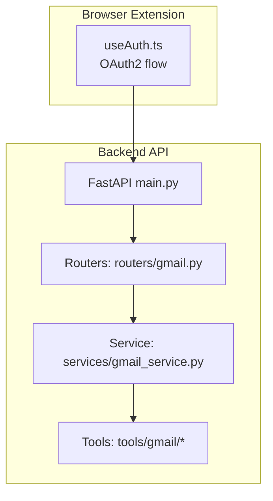
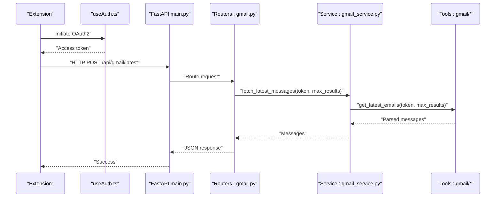
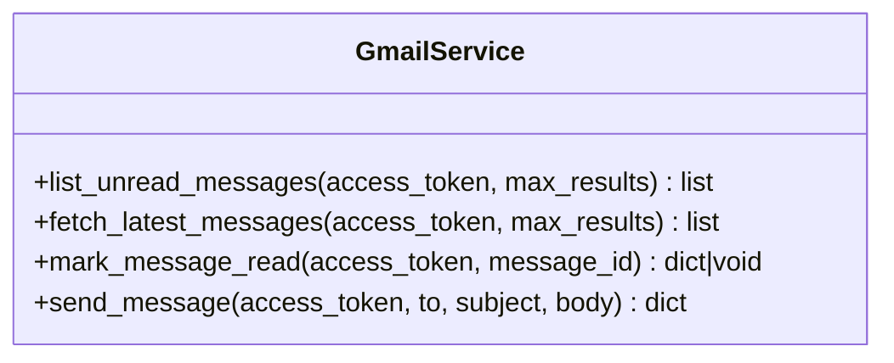
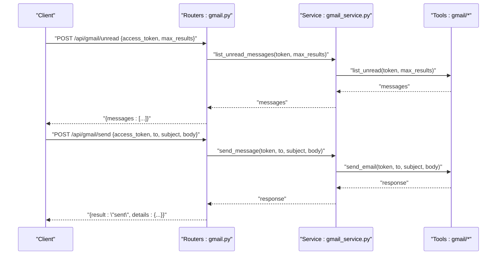
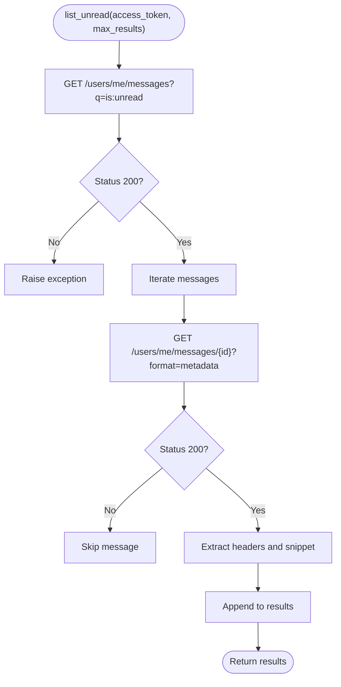
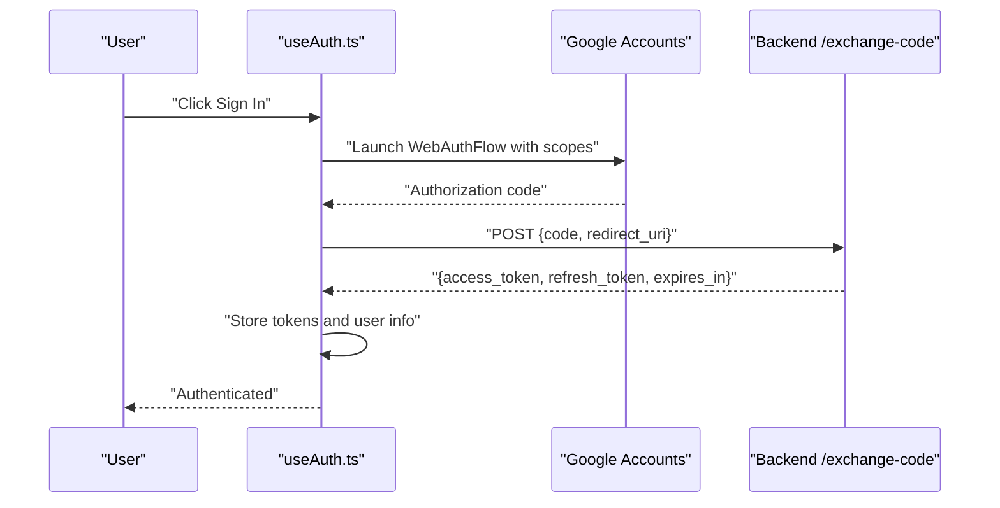
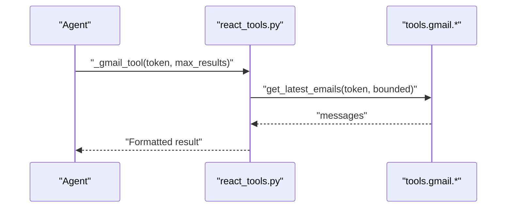
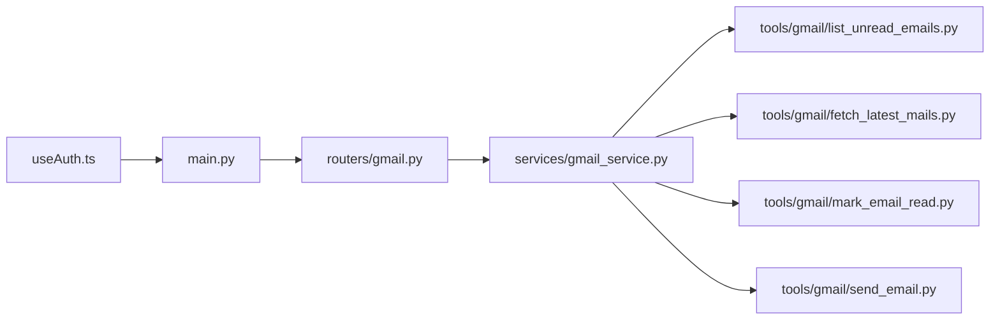

# Gmail Integration

<cite>
**Referenced Files in This Document**
- [gmail_service.py](file://services/gmail_service.py)
- [gmail.py](file://routers/gmail.py)
- [__init__.py](file://tools/gmail/__init__.py)
- [fetch_latest_mails.py](file://tools/gmail/fetch_latest_mails.py)
- [list_unread_emails.py](file://tools/gmail/list_unread_emails.py)
- [mark_email_read.py](file://tools/gmail/mark_email_read.py)
- [send_email.py](file://tools/gmail/send_email.py)
- [useAuth.ts](file://extension/entrypoints/sidepanel/hooks/useAuth.ts)
- [react_tools.py](file://agents/react_tools.py)
- [main.py](file://api/main.py)
- [config.py](file://core/config.py)
</cite>

## Table of Contents
1. [Introduction](#introduction)
2. [Project Structure](#project-structure)
3. [Core Components](#core-components)
4. [Architecture Overview](#architecture-overview)
5. [Detailed Component Analysis](#detailed-component-analysis)
6. [Dependency Analysis](#dependency-analysis)
7. [Performance Considerations](#performance-considerations)
8. [Troubleshooting Guide](#troubleshooting-guide)
9. [Conclusion](#conclusion)

## Introduction
This document explains the Gmail service integration implemented in the project. It covers the API surface for listing unread messages, fetching latest messages, marking messages as read, and sending emails. It also documents the OAuth2 authentication flow used by the browser extension, the FastAPI router and service layer, and outlines best practices for rate limiting, caching, and error recovery. The goal is to help developers integrate Gmail capabilities reliably and efficiently.

## Project Structure
The Gmail integration spans several layers:
- Tools: Lightweight, focused functions that call the Gmail API directly.
- Service: A cohesive service layer that orchestrates tool invocations and centralizes error logging.
- Router: FastAPI endpoints that validate requests, enforce defaults, and delegate to the service.
- Frontend: Chrome extension authentication flow that obtains and manages access tokens.
- Agents: Optional integration points for agent-driven workflows.

**Diagram sources**
- [main.py](file://api/main.py#L12-L46)
- [gmail.py](file://routers/gmail.py#L1-L149)
- [gmail_service.py](file://services/gmail_service.py#L1-L56)
- [useAuth.ts](file://extension/entrypoints/sidepanel/hooks/useAuth.ts#L130-L208)

**Section sources**
- [main.py](file://api/main.py#L12-L46)
- [gmail.py](file://routers/gmail.py#L1-L149)
- [gmail_service.py](file://services/gmail_service.py#L1-L56)
- [useAuth.ts](file://extension/entrypoints/sidepanel/hooks/useAuth.ts#L130-L208)

## Core Components
- Service layer: Provides four primary operations—listing unread messages, fetching latest messages, marking a message as read, and sending an email—by delegating to tools and wrapping errors with logging.
- Tools: Each operation is implemented as a small function that constructs the appropriate Gmail API request and parses responses.
- Router: Exposes HTTP endpoints under /api/gmail with request validation and sensible defaults.
- Authentication: The extension performs OAuth2 with explicit scopes and exchanges the authorization code for tokens.

Key responsibilities:
- Validation: Ensures required fields are present and applies safe defaults for max results.
- Error handling: Converts low-level failures into structured HTTP exceptions while preserving logs.
- Token usage: All operations require a valid access token supplied by the caller.

**Section sources**
- [gmail_service.py](file://services/gmail_service.py#L10-L56)
- [gmail.py](file://routers/gmail.py#L38-L149)
- [list_unread_emails.py](file://tools/gmail/list_unread_emails.py#L10-L48)
- [fetch_latest_mails.py](file://tools/gmail/fetch_latest_mails.py#L4-L42)
- [mark_email_read.py](file://tools/gmail/mark_email_read.py#L10-L28)
- [send_email.py](file://tools/gmail/send_email.py#L20-L31)

## Architecture Overview
The integration follows a layered pattern:
- Router validates requests and delegates to the service.
- Service wraps tool calls and logs exceptions.
- Tools call the Gmail API directly using Bearer tokens.
- Frontend handles OAuth2 and token storage/renewal.

**Diagram sources**
- [main.py](file://api/main.py#L12-L46)
- [gmail.py](file://routers/gmail.py#L68-L94)
- [gmail_service.py](file://services/gmail_service.py#L22-L31)
- [fetch_latest_mails.py](file://tools/gmail/fetch_latest_mails.py#L4-L42)
- [useAuth.ts](file://extension/entrypoints/sidepanel/hooks/useAuth.ts#L130-L208)

## Detailed Component Analysis

### Service Layer: GmailService
The service encapsulates all Gmail operations and centralizes logging. It accepts an access token and optional parameters, then invokes the corresponding tool function. Exceptions are logged and re-raised to the router.

**Diagram sources**
- [gmail_service.py](file://services/gmail_service.py#L10-L56)

**Section sources**
- [gmail_service.py](file://services/gmail_service.py#L10-L56)

### Router: /api/gmail Endpoints
The router defines four endpoints:
- POST /unread: Lists unread messages with a configurable max_results.
- POST /latest: Fetches latest inbox messages with a configurable max_results.
- POST /mark_read: Marks a specific message as read.
- POST /send: Sends a plaintext email.

Each endpoint validates required fields, applies defaults, and delegates to the service. Errors are converted to HTTP exceptions with appropriate status codes.

**Diagram sources**
- [gmail.py](file://routers/gmail.py#L38-L149)
- [gmail_service.py](file://services/gmail_service.py#L10-L56)
- [list_unread_emails.py](file://tools/gmail/list_unread_emails.py#L10-L48)
- [send_email.py](file://tools/gmail/send_email.py#L20-L31)

**Section sources**
- [gmail.py](file://routers/gmail.py#L38-L149)

### Tools: Gmail API Operations
- Listing unread messages: Queries messages matching “is:unread” and fetches metadata for headers and snippet.
- Fetching latest messages: Queries messages in the inbox with label and query filters, then retrieves headers/snippet per message.
- Marking as read: Calls the modify endpoint to remove the UNREAD label.
- Sending emails: Builds a base64-encoded raw message and posts to the send endpoint.

**Diagram sources**
- [list_unread_emails.py](file://tools/gmail/list_unread_emails.py#L10-L48)

**Section sources**
- [list_unread_emails.py](file://tools/gmail/list_unread_emails.py#L10-L48)
- [fetch_latest_mails.py](file://tools/gmail/fetch_latest_mails.py#L4-L42)
- [mark_email_read.py](file://tools/gmail/mark_email_read.py#L10-L28)
- [send_email.py](file://tools/gmail/send_email.py#L20-L31)

### Authentication and OAuth2 Setup
The extension performs OAuth2 with the following characteristics:
- Client ID and scopes configured for calendar, Gmail read/modify/send/labels, and profile information.
- Uses browser.identity to launch a web auth flow and exchange the authorization code for tokens.
- Stores access and refresh tokens, along with user info, in local storage.
- Provides manual refresh and status indicators.

**Diagram sources**
- [useAuth.ts](file://extension/entrypoints/sidepanel/hooks/useAuth.ts#L130-L208)

**Section sources**
- [useAuth.ts](file://extension/entrypoints/sidepanel/hooks/useAuth.ts#L130-L208)

### Agent Integration
Agents can invoke Gmail operations via structured tools that accept an access token and optional parameters. The agent tools wrap the underlying tool functions and provide bounded parameter ranges.

**Diagram sources**
- [react_tools.py](file://agents/react_tools.py#L279-L301)

**Section sources**
- [react_tools.py](file://agents/react_tools.py#L279-L301)

## Dependency Analysis
- Router depends on the service layer.
- Service depends on tools.
- Tools depend on the Gmail API and HTTP client.
- Frontend depends on Google OAuth endpoints and the backend token exchange endpoint.

**Diagram sources**
- [main.py](file://api/main.py#L12-L46)
- [gmail.py](file://routers/gmail.py#L1-L149)
- [gmail_service.py](file://services/gmail_service.py#L1-L56)
- [list_unread_emails.py](file://tools/gmail/list_unread_emails.py#L1-L48)
- [fetch_latest_mails.py](file://tools/gmail/fetch_latest_mails.py#L1-L42)
- [mark_email_read.py](file://tools/gmail/mark_email_read.py#L1-L28)
- [send_email.py](file://tools/gmail/send_email.py#L1-L31)

**Section sources**
- [gmail.py](file://routers/gmail.py#L1-L149)
- [gmail_service.py](file://services/gmail_service.py#L1-L56)

## Performance Considerations
- Request timeouts: Tools use short timeouts to avoid blocking the server. Consider retry policies with exponential backoff for transient failures.
- Batch operations: Prefer single-page queries with reasonable max_results to minimize round trips. For large-scale processing, paginate carefully and avoid fetching full message bodies unless necessary.
- Metadata-first approach: Use metadata retrieval for listing operations to reduce payload sizes.
- Concurrency: The service layer does not implement concurrency; if scaling is needed, consider thread/process pools or asynchronous clients.
- Caching: Cache recent message IDs keyed by account to deduplicate processing. Invalidate cache on mark_read or send operations.
- Rate limiting: Respect Gmail API quotas. Monitor rate limit headers and implement backoff strategies. Consider batching writes and reads where feasible.
- Logging: Centralized logging in the service helps track performance and error patterns.

[No sources needed since this section provides general guidance]

## Troubleshooting Guide
Common issues and resolutions:
- Authentication failures
  - Symptoms: 400/401 responses, inability to exchange code for tokens.
  - Checks: Ensure the frontend launched the web auth flow with correct scopes and redirect URI. Verify the backend /exchange-code endpoint is reachable and returns tokens.
  - Actions: Re-initiate OAuth, confirm scopes include Gmail read/modify/send/labels, and ensure offline access is requested if refresh is needed.
- Missing access token
  - Symptoms: 400 responses indicating missing access_token.
  - Checks: Confirm the request includes access_token and that it is not empty.
  - Actions: Prompt the user to authenticate again or pass a valid token.
- Rate limiting
  - Symptoms: 429 responses or throttled requests.
  - Checks: Inspect response headers for quota metrics and adjust request frequency.
  - Actions: Implement exponential backoff, reduce max_results, and cache results to minimize repeated queries.
- Message parsing errors
  - Symptoms: Empty or partial message lists.
  - Checks: Validate that metadata retrieval succeeded and headers are present.
  - Actions: Retry failed message fetches individually and log skipped entries.
- Sending failures
  - Symptoms: Non-200 responses when posting to send.
  - Checks: Confirm raw message encoding and required fields.
  - Actions: Rebuild the raw message and resend; check recipient address validity.

**Section sources**
- [gmail.py](file://routers/gmail.py#L42-L65)
- [gmail.py](file://routers/gmail.py#L72-L94)
- [gmail.py](file://routers/gmail.py#L101-L120)
- [gmail.py](file://routers/gmail.py#L127-L148)
- [useAuth.ts](file://extension/entrypoints/sidepanel/hooks/useAuth.ts#L130-L208)

## Conclusion
The Gmail integration is cleanly separated into tools, a service layer, and a FastAPI router. The browser extension handles OAuth2 and token lifecycle, enabling secure access to Gmail APIs. By following the outlined patterns for request validation, error handling, and performance considerations, teams can extend and maintain the integration effectively. For production workloads, incorporate robust retry/backoff, caching, and careful monitoring of API quotas.