# Service integrations

## Introduction
This page describes the Service Integration layer that encapsulates business logic for interacting with external systems. It explains how service classes abstract integrations for GitHub repository analysis and crawling, Gmail email management, Calendar scheduling, YouTube video content processing, academic portal access for the JIIT web portal, and general website analysis. It also documents request/response handling, error management, authentication mechanisms, rate-limiting considerations, data transformation processes, security and privacy practices, and performance optimization strategies for external API interactions. Examples of usage, integration patterns, and extension points for adding new services are included.

## Project structure
The Service Integration layer is organized around:
- Services: Thin orchestration classes that call tools and prompts, handle errors, and transform data.
- Routers: FastAPI endpoints that validate requests, enforce authentication, and delegate to services.
- Tools: Low-level adapters to external APIs or utilities (e.g., GitHub crawler, YouTube transcript fetcher, website scraper).
- Prompts: LLM chains/pipelines that structure prompts and orchestrate model calls.
- Models: Request/response DTOs for routers.
- Core: Logging, configuration, and LLM model configuration.

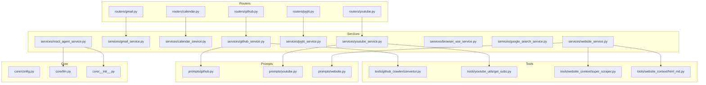
```mermaid
graph TB
subgraph "Routers"
RG["routers/github.py"]
RMG["routers/gmail.py"]
RCal["routers/calendar.py"]
RYT["routers/youtube.py"]
RPJIIT["routers/pyjiit.py"]
end
subgraph "Services"
SGIH["services/github_service.py"]
SGM["services/gmail_service.py"]
SCAL["services/calendar_service.py"]
SYT["services/youtube_service.py"]
SPJIIT["services/pyjiit_service.py"]
SWEB["services/website_service.py"]
SAGENT["services/browser_use_service.py"]
SGS["services/google_search_service.py"]
SRA["services/react_agent_service.py"]
end
subgraph "Tools"
TGHC["tools/github_crawler/convertor.py"]
TYSUB["tools/youtube_utils/get_subs.py"]
TWS["tools/website_context/super_scraper.py"]
TWMD["tools/website_context/html_md.py"]
end
subgraph "Prompts"
PGH["prompts/github.py"]
PYT["prompts/youtube.py"]
PWEB["prompts/website.py"]
end
subgraph "Core"
CCFG["core/config.py"]
CLLM["core/llm.py"]
CLOG["core/__init__.py"]
end
RG --> SGIH
RMG --> SGM
RCal --> SCAL
RYT --> SYT
RPJIIT --> SPJIIT
SGIH --> TGHC
SGIH --> PGH
SYT --> TYSUB
SYT --> PYT
SWEB --> TWS
SWEB --> TWMD
SWEB --> PWEB
SRA --> CLOG
SRA --> CLLM
```

## Core components
- GitHubService: Converts a GitHub repository into a structured markdown representation, then uses a prompt chain to answer questions. Supports optional file attachments via Google GenAI SDK.
- GmailService: Provides list/unread, latest messages, mark read, and send operations using an access token.
- CalendarService: Lists calendar events and creates events using an access token.
- YouTubeService: Generates answers using video metadata and transcripts, optionally with file attachments via Google GenAI SDK.
- PyjiitService: Handles login, semester discovery, and attendance retrieval for the JIIT web portal, with a hardcoded semester mapping.
- WebsiteService: Fetches remote content via a server-side scraper and augments with client-side HTML-to-markdown conversion, then uses a prompt chain to answer questions.
- BrowserUseService: Generates a JSON action plan for automating browser tasks based on goals and DOM structure.
- GoogleSearchService: Executes a web search pipeline and returns results.
- ReactAgentService: Orchestrates a multi-modal reactive agent with optional file uploads and context injection.

## Architecture overview
The Service Integration layer follows a service-oriented architecture:
- Routers validate and sanitize requests, enforce authentication, and pass typed models to services.
- Services encapsulate business logic, orchestrate tools and prompts, and manage error handling.
- Tools abstract external API calls and data transformations.
- Prompts define LLM chains for natural language processing tasks.
- Core provides logging, configuration, and LLM model configuration.

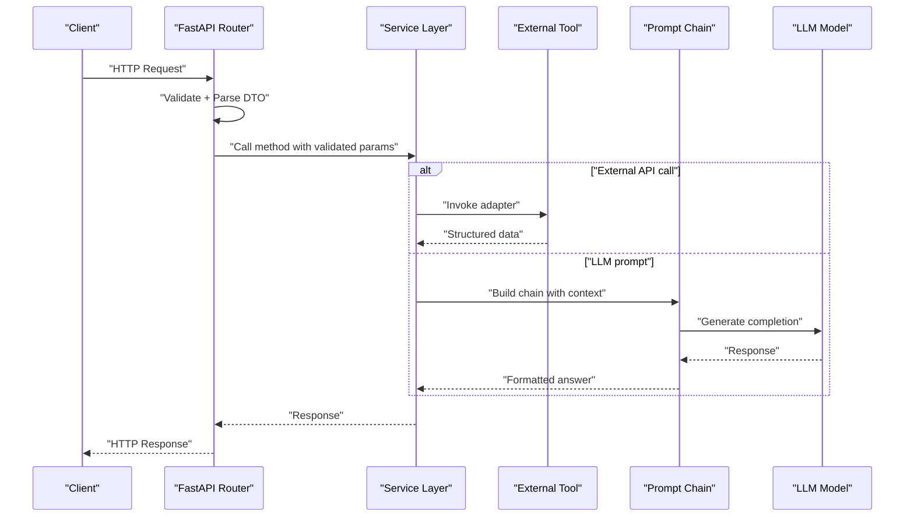
```mermaid
sequenceDiagram
participant Client as "Client"
participant Router as "FastAPI Router"
participant Service as "Service Layer"
participant Tool as "External Tool"
participant Prompt as "Prompt Chain"
participant LLM as "LLM Model"
Client->>Router : "HTTP Request"
Router->>Router : "Validate + Parse DTO"
Router->>Service : "Call method with validated params"
alt "External API call"
Service->>Tool : "Invoke adapter"
Tool-->>Service : "Structured data"
else "LLM prompt"
Service->>Prompt : "Build chain with context"
Prompt->>LLM : "Generate completion"
LLM-->>Prompt : "Response"
Prompt-->>Service : "Formatted answer"
end
Service-->>Router : "Response"
Router-->>Client : "HTTP Response"
```

## Detailed component analysis

### GitHub integration
- Purpose: Convert a GitHub repository into a structured markdown representation and answer questions using an LLM prompt chain.
- Key steps:
  - Repository ingestion via a GitHub crawler tool.
  - Optional file attachment processing via Google GenAI SDK.
  - Prompt chain invocation with summary, tree, content, and chat history.
  - Error handling for invalid URLs, access issues, and token limits.
- Authentication: No direct authentication required for public repositories; private repositories require appropriate permissions outside this service.
- Rate limiting: Subject to GitHub API quotas; consider caching and pagination where applicable.
- Security: Avoid exposing sensitive data; sanitize inputs and limit context size.

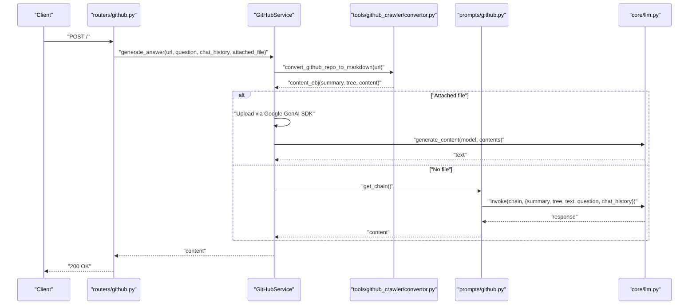
```mermaid
sequenceDiagram
participant Client as "Client"
participant Router as "routers/github.py"
participant Service as "GitHubService"
participant Tool as "tools/github_crawler/convertor.py"
participant Prompt as "prompts/github.py"
participant LLM as "core/llm.py"
Client->>Router : "POST /"
Router->>Service : "generate_answer(url, question, chat_history, attached_file)"
Service->>Tool : "convert_github_repo_to_markdown(url)"
Tool-->>Service : "content_obj(summary, tree, content)"
alt "Attached file"
Service->>Service : "Upload via Google GenAI SDK"
Service->>LLM : "generate_content(model, contents)"
LLM-->>Service : "text"
else "No file"
Service->>Prompt : "get_chain()"
Prompt->>LLM : "invoke(chain, {summary, tree, text, question, chat_history})"
LLM-->>Prompt : "response"
Prompt-->>Service : "content"
end
Service-->>Router : "content"
Router-->>Client : "200 OK"
```

### Gmail integration
- Purpose: Manage emails via Gmail API using an OAuth access token.
- Operations:
  - List unread messages with configurable max results.
  - Fetch latest messages with configurable max results.
  - Mark a message as read.
  - Send an email.
- Authentication: Requires a valid access token.
- Rate limiting: Subject to Gmail API quotas; batch operations where possible.
- Security: Store tokens securely; avoid logging sensitive data.

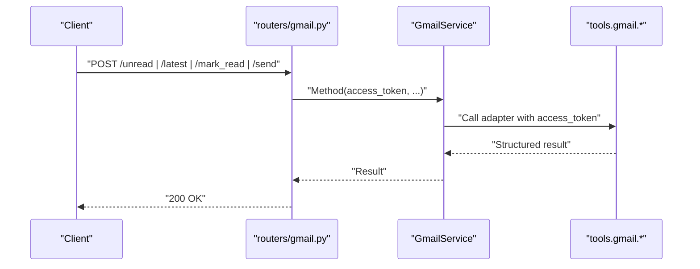
```mermaid
sequenceDiagram
participant Client as "Client"
participant Router as "routers/gmail.py"
participant Service as "GmailService"
participant Tool as "tools.gmail.*"
Client->>Router : "POST /unread | /latest | /mark_read | /send"
Router->>Service : "Method(access_token, ...)"
Service->>Tool : "Call adapter with access_token"
Tool-->>Service : "Structured result"
Service-->>Router : "Result"
Router-->>Client : "200 OK"
```

### Calendar integration
- Purpose: Interact with Google Calendar using an OAuth access token.
- Operations:
  - List upcoming events with configurable max results.
  - Create an event with summary, start/end times, and description.
- Authentication: Requires a valid access token.
- Rate limiting: Subject to Calendar API quotas; throttle requests.
- Security: Protect tokens; validate ISO 8601 timestamps.

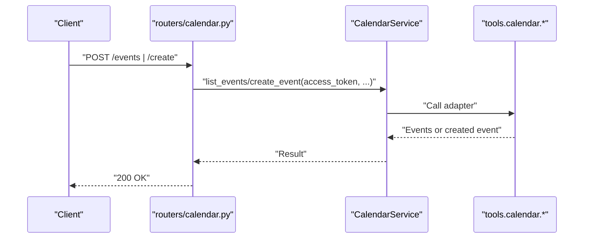
```mermaid
sequenceDiagram
participant Client as "Client"
participant Router as "routers/calendar.py"
participant Service as "CalendarService"
participant Tool as "tools.calendar.*"
Client->>Router : "POST /events | /create"
Router->>Service : "list_events/create_event(access_token, ...)"
Service->>Tool : "Call adapter"
Tool-->>Service : "Events or created event"
Service-->>Router : "Result"
Router-->>Client : "200 OK"
```

### YouTube processing
- Purpose: Answer questions about YouTube videos using metadata and transcripts, optionally with file attachments.
- Key steps:
  - Optional transcript extraction.
  - Optional file attachment via Google GenAI SDK.
  - Prompt chain invocation with URL, question, and chat history.
- Authentication: No direct authentication required for public videos; private videos may require access.
- Rate limiting: Subject to YouTube and external provider quotas; cache transcripts.
- Security: Avoid leaking sensitive context; sanitize inputs.

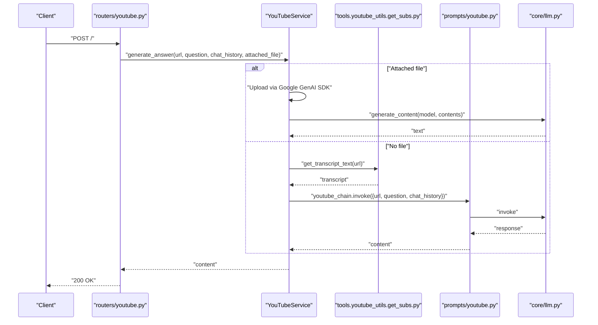
```mermaid
sequenceDiagram
participant Client as "Client"
participant Router as "routers/youtube.py"
participant Service as "YouTubeService"
participant Tool as "tools.youtube_utils.get_subs.py"
participant Prompt as "prompts/youtube.py"
participant LLM as "core/llm.py"
Client->>Router : "POST /"
Router->>Service : "generate_answer(url, question, chat_history, attached_file)"
alt "Attached file"
Service->>Service : "Upload via Google GenAI SDK"
Service->>LLM : "generate_content(model, contents)"
LLM-->>Service : "text"
else "No file"
Service->>Tool : "get_transcript_text(url)"
Tool-->>Service : "transcript"
Service->>Prompt : "youtube_chain.invoke({url, question, chat_history})"
Prompt->>LLM : "invoke"
LLM-->>Prompt : "response"
Prompt-->>Service : "content"
end
Service-->>Router : "content"
Router-->>Client : "200 OK"
```

### Academic portal access (PyJIIT)
- Purpose: Authenticate and retrieve academic data from the JIIT web portal.
- Operations:
  - Login to establish a session.
  - Discover registered semesters.
  - Retrieve attendance for a specific or default semester (hardcoded mapping).
- Authentication: Username/password login; session payload used for subsequent requests.
- Rate limiting: Subject to portal rate limits; avoid frequent polling.
- Security: Protect credentials and session payloads; avoid logging sensitive data.

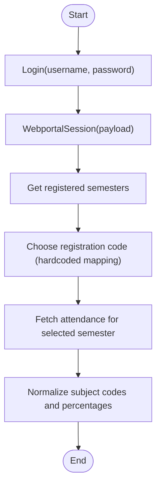
```mermaid
flowchart TD
Start(["Start"]) --> Login["Login(username, password)"]
Login --> Session["WebportalSession(payload)"]
Session --> Semesters["Get registered semesters"]
Semesters --> ChooseSem["Choose registration code (hardcoded mapping)"]
ChooseSem --> Attendance["Fetch attendance for selected semester"]
Attendance --> Transform["Normalize subject codes and percentages"]
Transform --> End(["End"])
```

### Website analysis
- Purpose: Answer questions about a given URL using server-side scraping and optional client-side HTML augmentation.
- Key steps:
  - Server-side markdown generation via a web scraper.
  - Optional client-side HTML-to-markdown conversion.
  - Optional file attachment via Google GenAI SDK.
  - Prompt chain invocation with combined context.
- Authentication: No authentication required for public websites.
- Rate limiting: Respect robots.txt and site policies; consider caching.
- Security: Sanitize HTML and avoid leaking internal context.

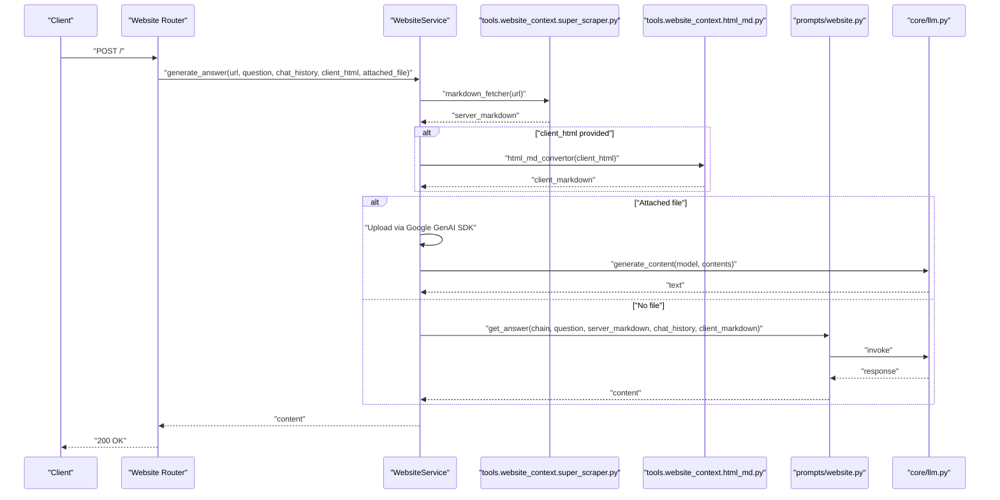
```mermaid
sequenceDiagram
participant Client as "Client"
participant Router as "Website Router"
participant Service as "WebsiteService"
participant Scraper as "tools.website_context.super_scraper.py"
participant HtmlMd as "tools.website_context.html_md.py"
participant Prompt as "prompts/website.py"
participant LLM as "core/llm.py"
Client->>Router : "POST /"
Router->>Service : "generate_answer(url, question, chat_history, client_html, attached_file)"
Service->>Scraper : "markdown_fetcher(url)"
Scraper-->>Service : "server_markdown"
alt "client_html provided"
Service->>HtmlMd : "html_md_convertor(client_html)"
HtmlMd-->>Service : "client_markdown"
end
alt "Attached file"
Service->>Service : "Upload via Google GenAI SDK"
Service->>LLM : "generate_content(model, contents)"
LLM-->>Service : "text"
else "No file"
Service->>Prompt : "get_answer(chain, question, server_markdown, chat_history, client_markdown)"
Prompt->>LLM : "invoke"
LLM-->>Prompt : "response"
Prompt-->>Service : "content"
end
Service-->>Router : "content"
Router-->>Client : "200 OK"
```

### Browser automation script generation
- Purpose: Generate a JSON action plan for automating browser tasks based on a goal and DOM structure.
- Key steps:
  - Format DOM info and constraints into a prompt.
  - Invoke an LLM chain to produce a JSON action plan.
  - Sanitize and validate the resulting JSON.
- Authentication: Not applicable.
- Rate limiting: Not applicable.
- Security: Validate and sanitize generated JSON to prevent unsafe actions.

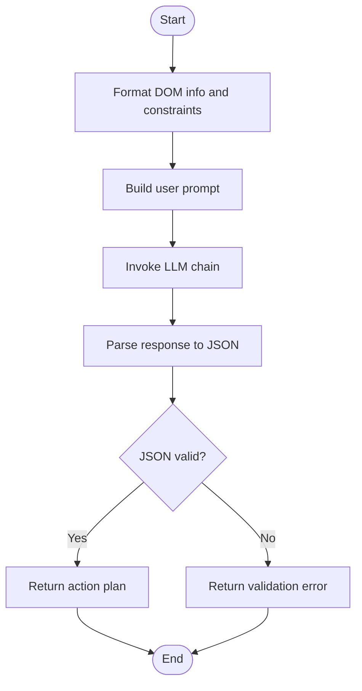
```mermaid
flowchart TD
Start(["Start"]) --> Format["Format DOM info and constraints"]
Format --> BuildPrompt["Build user prompt"]
BuildPrompt --> InvokeLLM["Invoke LLM chain"]
InvokeLLM --> Parse["Parse response to JSON"]
Parse --> Validate{"JSON valid?"}
Validate --> |Yes| ReturnPlan["Return action plan"]
Validate --> |No| ReturnError["Return validation error"]
ReturnPlan --> End(["End"])
ReturnError --> End
```

### Google search
- Purpose: Execute a web search pipeline and return results.
- Authentication: Not applicable.
- Rate limiting: Subject to search provider quotas; implement client-side throttling.
- Security: Avoid exposing sensitive queries; sanitize results.

### React agent
- Purpose: Orchestrate a multi-modal reactive agent with optional file uploads and context injection.
- Key steps:
  - Optional file upload via Google GenAI SDK.
  - Optional client HTML-to-markdown context injection.
  - Build a message list with chat history and human question.
  - Invoke a graph-based agent to produce a final answer.
- Authentication: Not applicable for file uploads; external integrations may require tokens.
- Rate limiting: Subject to GenAI and external provider quotas.
- Security: Sanitize inputs and avoid leaking context.

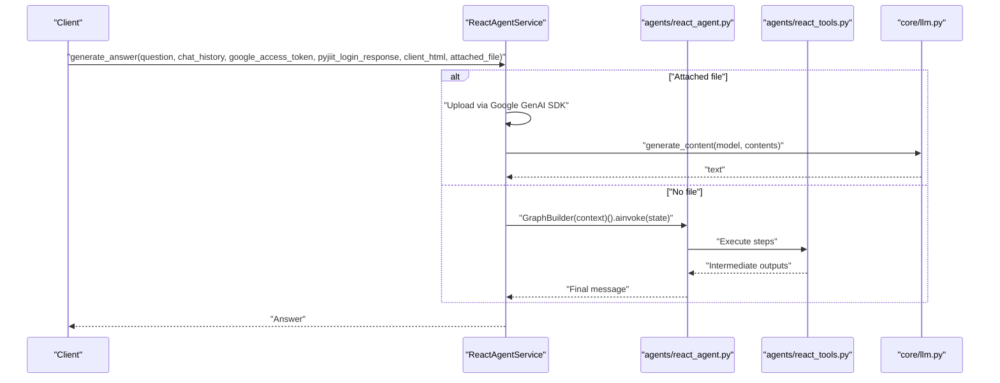
```mermaid
sequenceDiagram
participant Client as "Client"
participant Service as "ReactAgentService"
participant Agent as "agents/react_agent.py"
participant Tools as "agents/react_tools.py"
participant LLM as "core/llm.py"
Client->>Service : "generate_answer(question, chat_history, google_access_token, pyjiit_login_response, client_html, attached_file)"
alt "Attached file"
Service->>Service : "Upload via Google GenAI SDK"
Service->>LLM : "generate_content(model, contents)"
LLM-->>Service : "text"
else "No file"
Service->>Agent : "GraphBuilder(context)().ainvoke(state)"
Agent->>Tools : "Execute steps"
Tools-->>Agent : "Intermediate outputs"
Agent-->>Service : "Final message"
end
Service-->>Client : "Answer"
```

## Dependency analysis
- Cohesion: Each service encapsulates a single domain (GitHub, Gmail, Calendar, YouTube, PyJIIT, Website, Browser automation, Search, React Agent).
- Coupling: Services depend on tools and prompts; routers depend on services; minimal cross-service coupling.
- External dependencies: Google GenAI SDK, external APIs (GitHub, Gmail, Calendar, YouTube, JIIT portal), web scrapers.
- Circular dependencies: None observed among services and routers.

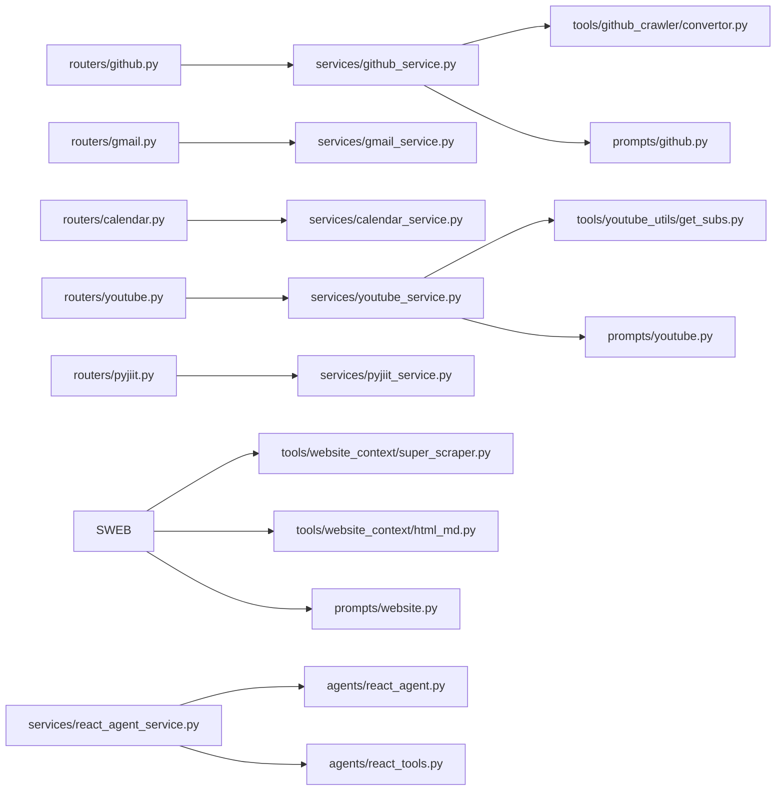
```mermaid
graph LR
RG["routers/github.py"] --> SGIH["services/github_service.py"]
RMG["routers/gmail.py"] --> SGM["services/gmail_service.py"]
RCal["routers/calendar.py"] --> SCAL["services/calendar_service.py"]
RYT["routers/youtube.py"] --> SYT["services/youtube_service.py"]
RPJIIT["routers/pyjiit.py"] --> SPJIIT["services/pyjiit_service.py"]
SGIH --> TGHC["tools/github_crawler/convertor.py"]
SYT --> TYSUB["tools/youtube_utils/get_subs.py"]
SWEB --> TWS["tools/website_context/super_scraper.py"]
SWEB --> TWMD["tools/website_context/html_md.py"]
SGIH --> PGH["prompts/github.py"]
SYT --> PYT["prompts/youtube.py"]
SWEB --> PWEB["prompts/website.py"]
SRA["services/react_agent_service.py"] --> AG["agents/react_agent.py"]
SRA --> AT["agents/react_tools.py"]
```

## Performance considerations
- External API quotas: Implement retry with exponential backoff and circuit breakers for external providers.
- Payload limits: Truncate or summarize large contexts; use streaming where supported.
- Caching: Cache frequently accessed data (e.g., YouTube transcripts, website metadata) with appropriate TTLs.
- Concurrency: Use async/await for I/O-bound operations; limit concurrent external calls.
- Model costs: Prefer smaller models for routine tasks; reserve larger models for complex reasoning.
- Network latency: Batch requests where possible; pre-warm connections.

## Troubleshooting guide
- GitHub repository access:
  - Invalid URL or 404: Ensure the repository URL points to the repository root and is public or accessible.
  - PathKind errors: Verify the URL format.
- LLM token limits:
  - Context window exceeded: Reduce input size or ask focused questions.
- Gmail/Calendar:
  - Missing access token: Ensure the token is provided and valid.
  - Invalid time formats: Confirm ISO 8601 strings for start/end times.
- YouTube:
  - Transcript fetch failures: Transcripts may not be available; fallback to video metadata.
- PyJIIT:
  - Login failures: Verify credentials; check session payload validity.
  - Hardcoded semester mapping: Ensure the target semester exists in the mapping.
- React Agent:
  - Validation errors: Inspect sanitized JSON and adjust prompts or constraints.

## Conclusion
The Service Integration layer cleanly separates concerns between routing, business logic, tooling, and prompting. It supports reliable integrations with GitHub, Gmail, Calendar, YouTube, the JIIT academic portal, and general website analysis. By centralizing error handling, authentication, and data transformation, it enables maintainable extensions and consistent behavior across external integrations.

## Appendices

### Request/Response handling patterns
- Routers validate inputs, enforce authentication, and return standardized responses.
- Services encapsulate retries, logging, and error translation.
- Tools abstract external API specifics and return structured data.
- Prompts standardize LLM interactions and context formatting.

### Authentication mechanisms
- OAuth access tokens for Gmail and Calendar.
- Username/password for PyJIIT login; session payloads for subsequent operations.
- No authentication for public GitHub repositories and general website analysis.

### API rate limiting considerations
- Implement client-side rate limiting and exponential backoff.
- Use caching to reduce repeated calls.
- Monitor provider quotas and alert on near-threshold usage.

### Data transformation processes
- GitHub: Repository to markdown summary, tree, and content.
- YouTube: Transcript extraction and optional file uploads.
- Website: Server-side scraping and client-side HTML-to-markdown conversion.
- PyJIIT: Normalization of attendance data and subject codes.

### Security and privacy
- Avoid logging sensitive data (tokens, credentials, personal info).
- Sanitize inputs and outputs; validate JSON action plans.
- Use HTTPS and secure storage for tokens and session payloads.

### Extension points for new services
- Create a new service class under services/.
- Define request/response models under models/.
- Implement routers under routers/.
- Add tools under tools/ for external integrations.
- Integrate prompts under prompts/ for LLM-driven workflows.
- Wire dependencies using FastAPI Depends and ensure proper error handling.
