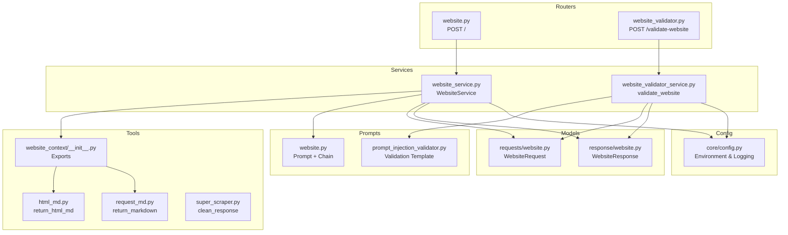
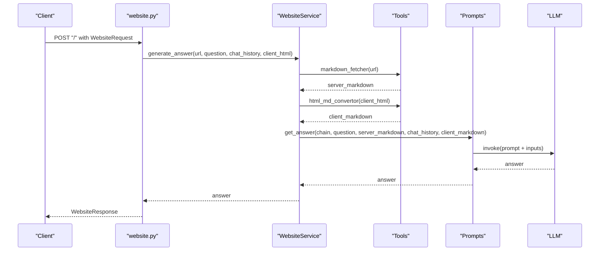
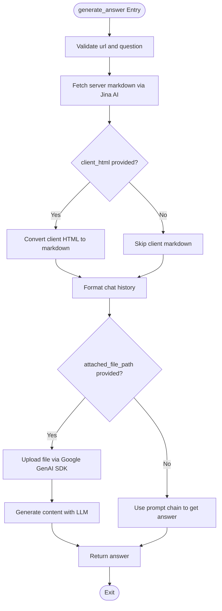
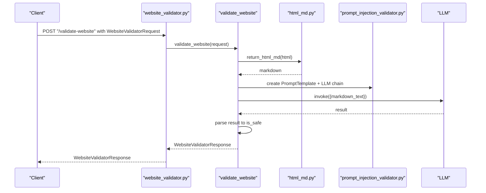
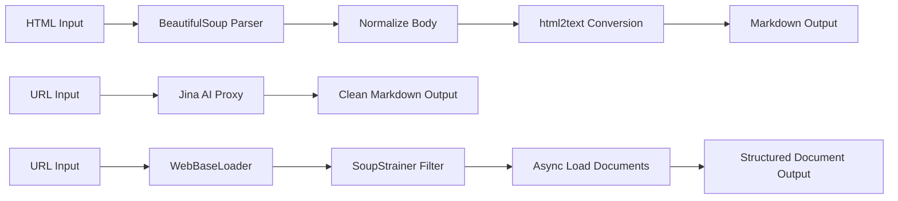
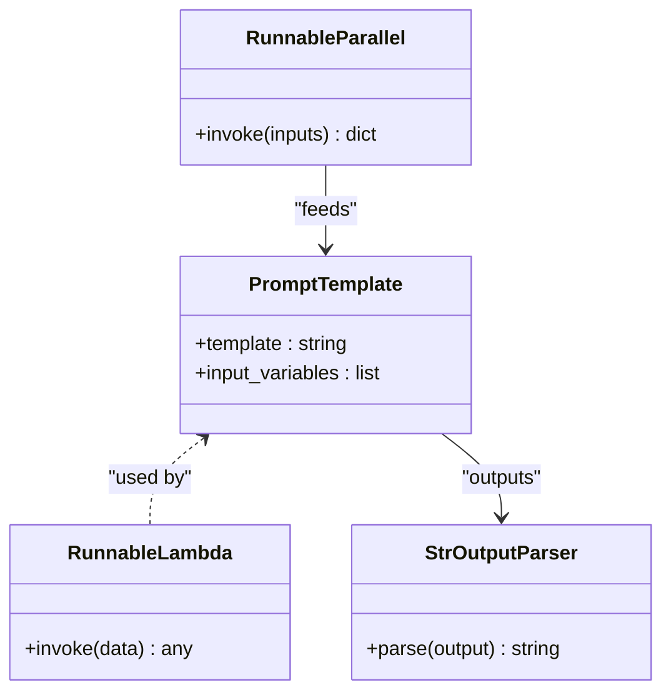
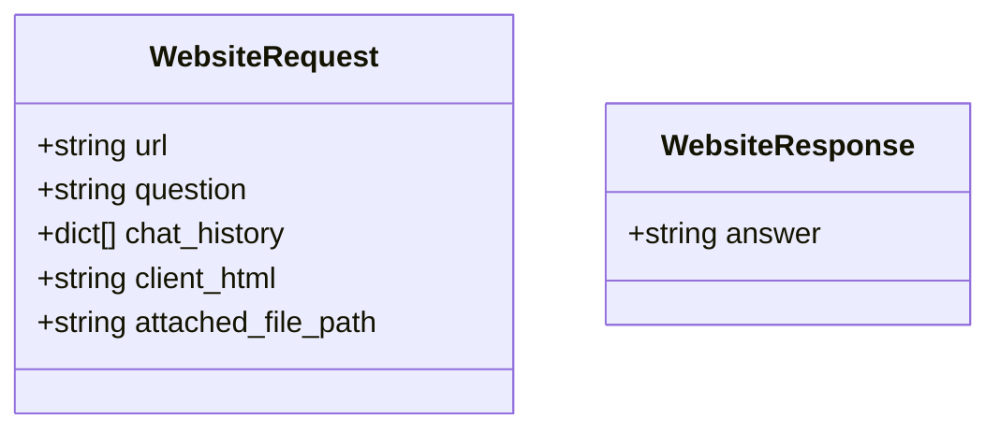
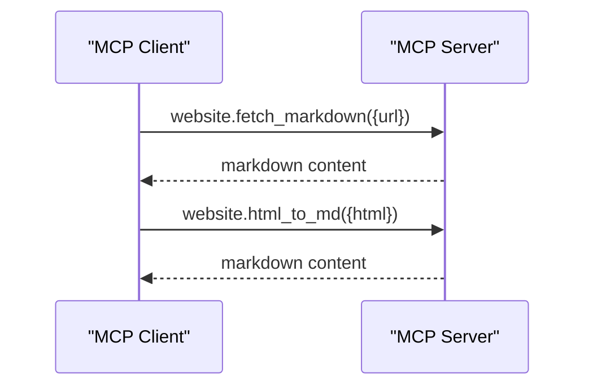
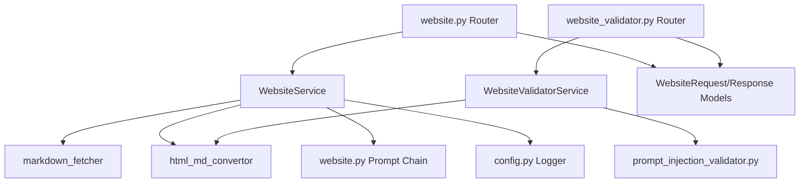

# Website Analysis Integration

<cite>
**Referenced Files in This Document**
- [website_service.py](file://services/website_service.py)
- [website_validator_service.py](file://services/website_validator_service.py)
- [website.py](file://routers/website.py)
- [website_validator.py](file://routers/website_validator.py)
- [website.py](file://models/requests/website.py)
- [website.py](file://models/response/website.py)
- [__init__.py](file://tools/website_context/__init__.py)
- [html_md.py](file://tools/website_context/html_md.py)
- [request_md.py](file://tools/website_context/request_md.py)
- [super_scraper.py](file://tools/website_context/super_scraper.py)
- [website.py](file://prompts/website.py)
- [prompt_injection_validator.py](file://prompts/prompt_injection_validator.py)
- [config.py](file://core/config.py)
- [server.py](file://mcp_server/server.py)
</cite>

## Table of Contents
1. [Introduction](#introduction)
2. [Project Structure](#project-structure)
3. [Core Components](#core-components)
4. [Architecture Overview](#architecture-overview)
5. [Detailed Component Analysis](#detailed-component-analysis)
6. [Dependency Analysis](#dependency-analysis)
7. [Performance Considerations](#performance-considerations)
8. [Troubleshooting Guide](#troubleshooting-guide)
9. [Conclusion](#conclusion)
10. [Appendices](#appendices)

## Introduction
This document explains the website analysis service integration, focusing on how HTML is converted to markdown, how request metadata is processed, and how advanced scraping capabilities are implemented. It also covers website validation mechanisms, content extraction patterns, and data transformation workflows. The super scraper functionality for intelligent web content extraction, DOM manipulation, and structured data processing is documented alongside practical examples of website analysis workflows, content processing patterns, and validation strategies. Finally, it addresses ethical scraping, rate limiting, performance optimization, and troubleshooting for common issues.

## Project Structure
The website analysis pipeline spans several layers:
- Routers define HTTP endpoints for website analysis and validation.
- Services orchestrate content fetching, conversion, and LLM-driven answer generation.
- Tools implement HTML-to-markdown conversion, server-side markdown fetching, and a super scraper for advanced content extraction.
- Prompts define the instruction templates and chains used to synthesize answers.
- Configuration manages environment variables and logging.

**Diagram sources**
- [website.py](file://routers/website.py#L1-L43)
- [website_validator.py](file://routers/website_validator.py#L1-L15)
- [website_service.py](file://services/website_service.py#L1-L97)
- [website_validator_service.py](file://services/website_validator_service.py#L1-L38)
- [__init__.py](file://tools/website_context/__init__.py#L1-L12)
- [html_md.py](file://tools/website_context/html_md.py#L1-L27)
- [request_md.py](file://tools/website_context/request_md.py#L1-L30)
- [super_scraper.py](file://tools/website_context/super_scraper.py#L1-L38)
- [website.py](file://prompts/website.py#L1-L115)
- [prompt_injection_validator.py](file://prompts/prompt_injection_validator.py#L1-L16)
- [website.py](file://models/requests/website.py#L1-L11)
- [website.py](file://models/response/website.py#L1-L6)
- [config.py](file://core/config.py#L1-L26)

**Section sources**
- [website.py](file://routers/website.py#L1-L43)
- [website_validator.py](file://routers/website_validator.py#L1-L15)
- [website_service.py](file://services/website_service.py#L1-L97)
- [website_validator_service.py](file://services/website_validator_service.py#L1-L38)
- [__init__.py](file://tools/website_context/__init__.py#L1-L12)
- [html_md.py](file://tools/website_context/html_md.py#L1-L27)
- [request_md.py](file://tools/website_context/request_md.py#L1-L30)
- [super_scraper.py](file://tools/website_context/super_scraper.py#L1-L38)
- [website.py](file://prompts/website.py#L1-L115)
- [prompt_injection_validator.py](file://prompts/prompt_injection_validator.py#L1-L16)
- [website.py](file://models/requests/website.py#L1-L11)
- [website.py](file://models/response/website.py#L1-L6)
- [config.py](file://core/config.py#L1-L26)

## Core Components
- WebsiteService orchestrates the end-to-end website analysis:
  - Fetches server-side markdown via a Jina AI proxy.
  - Converts client-provided HTML to markdown.
  - Builds a prompt chain with server and client contexts plus optional chat history.
  - Optionally integrates an attached file via the Google GenAI SDK.
  - Returns a synthesized answer from the LLM.
- WebsiteValidatorService validates HTML content by converting it to markdown and checking for prompt injection risks using a dedicated prompt and LLM.
- Routers expose endpoints for website analysis and validation with request/response models.
- Tools implement:
  - HTML-to-markdown conversion.
  - Server-side markdown fetching via Jina AI.
  - Super scraper for advanced content extraction with DOM filtering and asynchronous loading.
- Prompts define the instruction templates and chains for answer synthesis and validation.
- Configuration manages environment variables and logging.

**Section sources**
- [website_service.py](file://services/website_service.py#L9-L97)
- [website_validator_service.py](file://services/website_validator_service.py#L9-L38)
- [website.py](file://routers/website.py#L14-L32)
- [website_validator.py](file://routers/website_validator.py#L12-L14)
- [website.py](file://models/requests/website.py#L5-L11)
- [website.py](file://models/response/website.py#L4-L6)
- [__init__.py](file://tools/website_context/__init__.py#L5-L11)
- [html_md.py](file://tools/website_context/html_md.py#L5-L11)
- [request_md.py](file://tools/website_context/request_md.py#L7-L29)
- [super_scraper.py](file://tools/website_context/super_scraper.py#L8-L29)
- [website.py](file://prompts/website.py#L12-L115)
- [prompt_injection_validator.py](file://prompts/prompt_injection_validator.py#L1-L16)
- [config.py](file://core/config.py#L13-L25)

## Architecture Overview
The system follows a layered architecture:
- HTTP layer: FastAPI routers accept requests and delegate to services.
- Service layer: WebsiteService and WebsiteValidatorService encapsulate business logic.
- Tool layer: Utilities for HTML/markdown conversion and content fetching.
- Prompt layer: Instruction templates and chains for LLM interactions.
- Configuration layer: Environment and logging setup.

**Diagram sources**
- [website.py](file://routers/website.py#L14-L32)
- [website_service.py](file://services/website_service.py#L13-L92)
- [__init__.py](file://tools/website_context/__init__.py#L5-L11)
- [website.py](file://prompts/website.py#L96-L115)

## Detailed Component Analysis

### WebsiteService
WebsiteService coordinates:
- Server-side markdown retrieval via Jina AI.
- Client-side HTML-to-markdown conversion.
- Chat history formatting.
- Optional attached file processing via Google GenAI SDK.
- LLM answer synthesis using a composed prompt chain.

Key processing logic:
- Validates presence of required fields.
- Fetches server markdown and logs length.
- Converts client HTML to markdown when provided.
- Formats chat history into a string.
- Handles attached file upload and generation via Google GenAI if present.
- Falls back to LLM-based answer synthesis otherwise.

**Diagram sources**
- [website_service.py](file://services/website_service.py#L13-L92)

**Section sources**
- [website_service.py](file://services/website_service.py#L9-L97)

### WebsiteValidatorService
WebsiteValidatorService performs:
- HTML-to-markdown conversion.
- Prompt injection risk assessment using a dedicated prompt template and LLM.
- Boolean safety determination based on model output.

**Diagram sources**
- [website_validator.py](file://routers/website_validator.py#L12-L14)
- [website_validator_service.py](file://services/website_validator_service.py#L17-L37)
- [html_md.py](file://tools/website_context/html_md.py#L5-L11)
- [prompt_injection_validator.py](file://prompts/prompt_injection_validator.py#L1-L16)

**Section sources**
- [website_validator_service.py](file://services/website_validator_service.py#L9-L38)

### Tools: HTML to Markdown and Server-Side Fetching
- HTML-to-Markdown converter uses BeautifulSoup and html2text to normalize and convert HTML bodies to markdown.
- Server-side markdown fetcher uses a Jina AI proxy to retrieve clean markdown from URLs.
- Super scraper leverages WebBaseLoader with BeautifulSoup filters and asynchronous loading to extract structured content.

**Diagram sources**
- [html_md.py](file://tools/website_context/html_md.py#L5-L11)
- [request_md.py](file://tools/website_context/request_md.py#L7-L29)
- [super_scraper.py](file://tools/website_context/super_scraper.py#L8-L29)

**Section sources**
- [html_md.py](file://tools/website_context/html_md.py#L1-L27)
- [request_md.py](file://tools/website_context/request_md.py#L1-L30)
- [super_scraper.py](file://tools/website_context/super_scraper.py#L1-L38)

### Prompts and Chains
- The website prompt defines a two-context synthesis strategy: server-fetched markdown and client-rendered markdown, with guidelines for summaries, structure, links/media, code, metadata, data analysis, and formatting.
- A runnable chain composes the prompt with the LLM client and an output parser.
- The validator prompt checks for prompt injection attempts and returns a boolean safety signal.

**Diagram sources**
- [website.py](file://prompts/website.py#L73-L93)
- [prompt_injection_validator.py](file://prompts/prompt_injection_validator.py#L1-L16)

**Section sources**
- [website.py](file://prompts/website.py#L12-L115)
- [prompt_injection_validator.py](file://prompts/prompt_injection_validator.py#L1-L16)

### Request/Response Models
- WebsiteRequest includes URL, question, optional chat history, optional client HTML, and optional attached file path.
- WebsiteResponse wraps the generated answer.

**Diagram sources**
- [website.py](file://models/requests/website.py#L5-L11)
- [website.py](file://models/response/website.py#L4-L6)

**Section sources**
- [website.py](file://models/requests/website.py#L1-L11)
- [website.py](file://models/response/website.py#L1-L6)

### MCP Server Integration
The MCP server exposes tools for website analysis:
- website.fetch_markdown: Fetches markdown content for a given URL via a Jina proxy.
- website.html_to_md: Converts raw HTML to markdown.

**Diagram sources**
- [server.py](file://mcp_server/server.py#L62-L80)

**Section sources**
- [server.py](file://mcp_server/server.py#L50-L80)

## Dependency Analysis
- WebsiteService depends on:
  - Tools for markdown fetching and HTML conversion.
  - Prompts for constructing the answer chain.
  - Configuration for logging.
- WebsiteValidatorService depends on:
  - Tools for HTML-to-markdown conversion.
  - Validator prompt and LLM for safety assessment.
- Routers depend on:
  - Models for request/response validation.
  - Services for business logic.

**Diagram sources**
- [website_service.py](file://services/website_service.py#L1-L12)
- [website_validator_service.py](file://services/website_validator_service.py#L1-L7)
- [website.py](file://routers/website.py#L1-L7)
- [website_validator.py](file://routers/website_validator.py#L1-L9)
- [website.py](file://models/requests/website.py#L1-L11)
- [website.py](file://models/response/website.py#L1-L6)

**Section sources**
- [website_service.py](file://services/website_service.py#L1-L12)
- [website_validator_service.py](file://services/website_validator_service.py#L1-L7)
- [website.py](file://routers/website.py#L1-L7)
- [website_validator.py](file://routers/website_validator.py#L1-L9)

## Performance Considerations
- Asynchronous loading: The super scraper uses asynchronous document loading to improve throughput when fetching multiple pages.
- Selective parsing: BeautifulSoup filters limit parsing to relevant DOM sections, reducing overhead.
- Caching and reuse: Reuse server-fetched markdown and client-provided markdown to avoid redundant conversions.
- Rate limiting and retries: Integrate retry logic and backoff when calling external services like Jina AI and Google GenAI.
- Timeout configuration: Set explicit timeouts for network requests to prevent long blocking operations.
- Chunking and pagination: For very large pages, consider chunking content before passing to the LLM to manage token limits.
- Environment tuning: Adjust logging levels and environment variables for production deployments to minimize overhead.

[No sources needed since this section provides general guidance]

## Troubleshooting Guide
Common issues and resolutions:
- HTTP 400/500 errors from website router:
  - Ensure URL and question are provided in the request payload.
  - Check service logs for detailed error messages.
- Empty or malformed markdown:
  - Verify the URL resolves correctly and returns HTML.
  - Confirm client HTML is well-formed when passed for conversion.
- Prompt injection validation failures:
  - Review the validator response and sanitize HTML accordingly.
  - Consider additional sanitization steps before conversion.
- Google GenAI file processing errors:
  - Confirm API keys are configured and accessible.
  - Validate the file path and permissions.
- Network timeouts or rate limits:
  - Add retry logic with exponential backoff.
  - Monitor external service availability and adjust timeouts.

**Section sources**
- [website.py](file://routers/website.py#L23-L42)
- [website_service.py](file://services/website_service.py#L54-L79)
- [website_validator_service.py](file://services/website_validator_service.py#L17-L37)
- [config.py](file://core/config.py#L13-L18)

## Conclusion
The website analysis integration combines robust content fetching, intelligent HTML-to-markdown conversion, and LLM-driven synthesis to deliver accurate answers from web pages. Validation ensures safety against prompt injection, while advanced scraping tools enable structured content extraction. By following the outlined workflows, patterns, and best practices, teams can deploy reliable, ethical, and high-performance web analysis capabilities.

[No sources needed since this section summarizes without analyzing specific files]

## Appendices

### Example Workflows
- Basic website analysis:
  - Client posts WebsiteRequest to the website router.
  - Service fetches server markdown, optionally converts client HTML, builds the prompt chain, and returns an answer.
- Website validation:
  - Client posts WebsiteValidatorRequest to the validator router.
  - Service converts HTML to markdown and runs the validator prompt; returns a safety decision.
- Super scraper usage:
  - Invoke the super scraper to asynchronously load and filter content from a URL, returning a structured document for downstream processing.

**Section sources**
- [website.py](file://routers/website.py#L14-L32)
- [website_validator.py](file://routers/website_validator.py#L12-L14)
- [website_service.py](file://services/website_service.py#L13-L92)
- [website_validator_service.py](file://services/website_validator_service.py#L17-L37)
- [super_scraper.py](file://tools/website_context/super_scraper.py#L8-L29)