# YouTube Integration

<cite>
**Referenced Files in This Document**
- [youtube_service.py](file://services/youtube_service.py)
- [youtube.py](file://routers/youtube.py)
- [yt.py](file://models/yt.py)
- [__init__.py](file://tools/youtube_utils/__init__.py)
- [extract_id.py](file://tools/youtube_utils/extract_id.py)
- [get_info.py](file://tools/youtube_utils/get_info.py)
- [get_subs.py](file://tools/youtube_utils/get_subs.py)
- [youtube.py](file://prompts/youtube.py)
- [__init__.py](file://tools/youtube_utils/transcript_generator/__init__.py)
- [clean.py](file://tools/youtube_utils/transcript_generator/clean.py)
- [duplicate.py](file://tools/youtube_utils/transcript_generator/duplicate.py)
- [srt.py](file://tools/youtube_utils/transcript_generator/srt.py)
- [timestamp.py](file://tools/youtube_utils/transcript_generator/timestamp.py)
- [video_info.py](file://models/requests/video_info.py)
- [subtitles.py](file://models/requests/subtitles.py)
- [subtitles.py](file://models/response/subtitles.py)
</cite>

## Table of Contents
1. [Introduction](#introduction)
2. [Project Structure](#project-structure)
3. [Core Components](#core-components)
4. [Architecture Overview](#architecture-overview)
5. [Detailed Component Analysis](#detailed-component-analysis)
6. [Dependency Analysis](#dependency-analysis)
7. [Performance Considerations](#performance-considerations)
8. [Troubleshooting Guide](#troubleshooting-guide)
9. [Conclusion](#conclusion)
10. [Appendices](#appendices)

## Introduction
This document explains the YouTube integration implemented in the project. It covers how video information is retrieved, subtitles are extracted, video IDs are parsed, and transcripts are generated and processed. It also documents the service layer, FastAPI router integration, prompt-driven answer generation, and the transcript processing pipeline including cleaning, timestamp handling, and duplicate removal. Guidance is included for authentication, quota management, content access patterns, limitations, filtering, performance optimization, and troubleshooting.

## Project Structure
The YouTube integration spans several modules:
- Router: Exposes a FastAPI endpoint to ask questions about a YouTube video.
- Service: Orchestrates LLM-based answer generation using either a local transcript or an attached file via a generative AI SDK.
- Tools: Provides utilities for extracting video IDs, retrieving video metadata and subtitles, and generating transcripts.
- Transcript Generator: Applies cleaning, timestamp normalization, and duplicate removal to produce a readable transcript.
- Models: Defines request/response schemas for video info and subtitles.

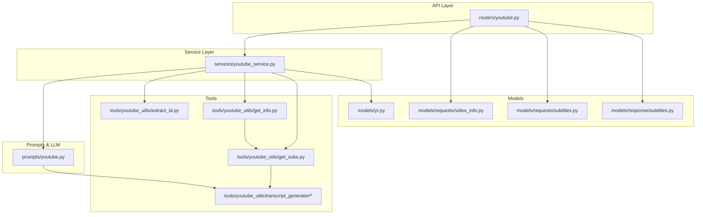

**Diagram sources**
- [youtube.py](file://routers/youtube.py#L1-L59)
- [youtube_service.py](file://services/youtube_service.py#L1-L71)
- [extract_id.py](file://tools/youtube_utils/extract_id.py#L1-L24)
- [get_info.py](file://tools/youtube_utils/get_info.py#L1-L77)
- [get_subs.py](file://tools/youtube_utils/get_subs.py#L1-L276)
- [__init__.py](file://tools/youtube_utils/transcript_generator/__init__.py#L1-L22)
- [clean.py](file://tools/youtube_utils/transcript_generator/clean.py#L1-L67)
- [duplicate.py](file://tools/youtube_utils/transcript_generator/duplicate.py#L1-L26)
- [srt.py](file://tools/youtube_utils/transcript_generator/srt.py#L1-L30)
- [timestamp.py](file://tools/youtube_utils/transcript_generator/timestamp.py#L1-L32)
- [yt.py](file://models/yt.py#L1-L17)
- [video_info.py](file://models/requests/video_info.py#L1-L7)
- [subtitles.py](file://models/requests/subtitles.py#L1-L8)
- [subtitles.py](file://models/response/subtitles.py#L1-L6)

**Section sources**
- [youtube.py](file://routers/youtube.py#L1-L59)
- [youtube_service.py](file://services/youtube_service.py#L1-L71)
- [__init__.py](file://tools/youtube_utils/__init__.py#L1-L14)

## Core Components
- YouTubeService: Implements the primary workflow for answering questions about a YouTube video. It supports two modes:
  - Attached file mode: Uploads a local file to a generative AI SDK and optionally augments the prompt with a YouTube transcript and chat history.
  - Prompt-driven mode: Builds a context from the video transcript and passes it to a LangChain chain that invokes an LLM.
- Router: Validates inputs, constructs a chat history string, and delegates to the service.
- Tools:
  - extract_video_id: Parses YouTube URLs to extract the video ID from both www.youtube.com and youtu.be domains.
  - get_info: Retrieves video metadata via yt-dlp and optionally attaches a cleaned transcript if available.
  - get_subs: Downloads subtitles in preferred language, falls back to alternative languages, and finally to audio transcription via Whisper if needed.
- Transcript Generator: Cleans and normalizes subtitles/transcripts by removing timestamps, cue tags, speaker tags, and align directives; deduplicates lines; and merges into coherent paragraphs.
- Models: Define typed request/response structures for video info and subtitles.

**Section sources**
- [youtube_service.py](file://services/youtube_service.py#L8-L71)
- [youtube.py](file://routers/youtube.py#L14-L59)
- [extract_id.py](file://tools/youtube_utils/extract_id.py#L8-L24)
- [get_info.py](file://tools/youtube_utils/get_info.py#L11-L77)
- [get_subs.py](file://tools/youtube_utils/get_subs.py#L8-L276)
- [__init__.py](file://tools/youtube_utils/transcript_generator/__init__.py#L11-L22)
- [yt.py](file://models/yt.py#L5-L17)
- [video_info.py](file://models/requests/video_info.py#L5-L7)
- [subtitles.py](file://models/requests/subtitles.py#L5-L8)
- [subtitles.py](file://models/response/subtitles.py#L4-L6)

## Architecture Overview
The system integrates a FastAPI router with a service layer and a prompt-driven LLM chain. The service can operate in two modes:
- With an attached file: Uses a generative AI SDK to generate answers directly from the file and optional transcript/chat context.
- Without an attached file: Builds a transcript-based context and passes it to the LLM chain.

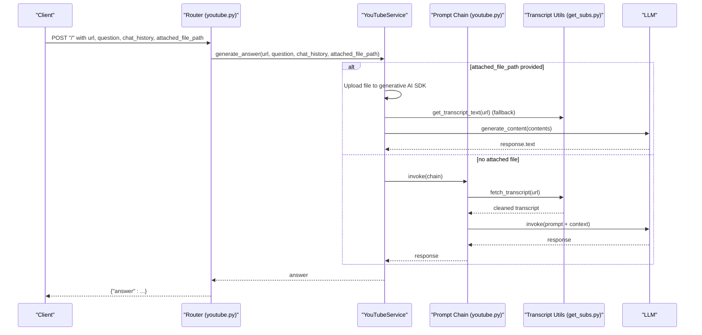

**Diagram sources**
- [youtube.py](file://routers/youtube.py#L14-L59)
- [youtube_service.py](file://services/youtube_service.py#L9-L70)
- [youtube.py](file://prompts/youtube.py#L37-L74)
- [get_subs.py](file://tools/youtube_utils/get_subs.py#L8-L106)

## Detailed Component Analysis

### Router: YouTube Endpoint
- Validates presence of url and question.
- Converts chat history entries into a formatted string.
- Delegates to YouTubeService.generate_answer and returns a JSON response with the answer.

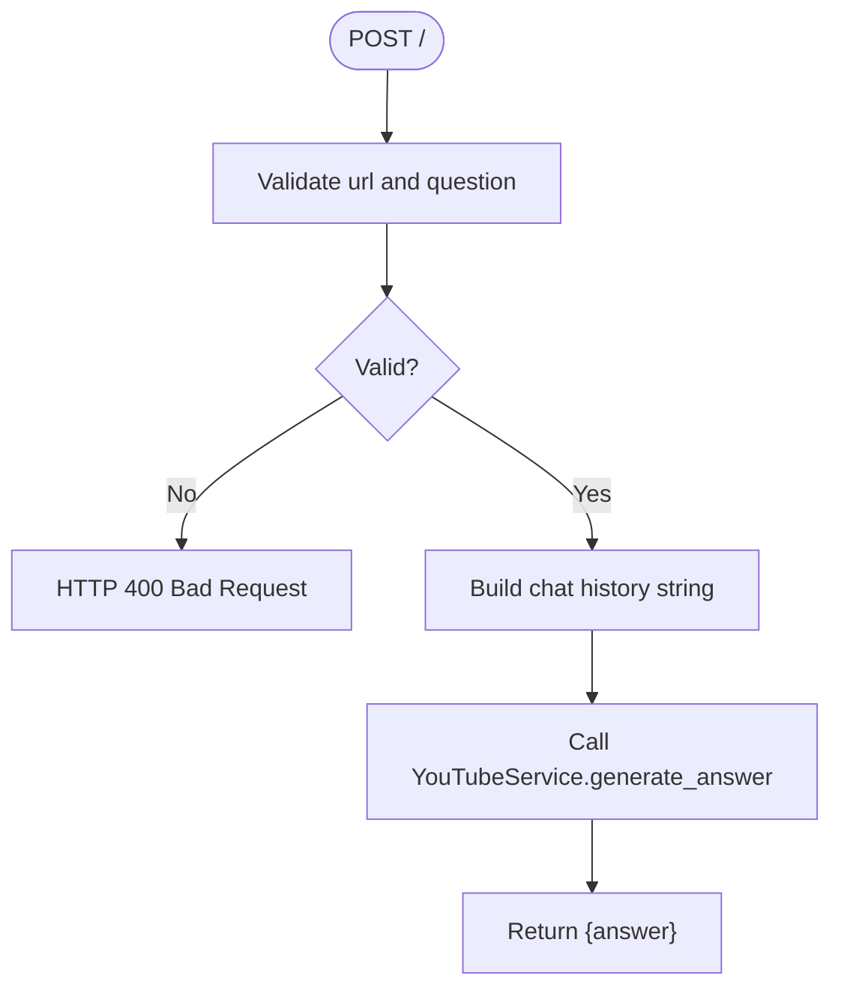

**Diagram sources**
- [youtube.py](file://routers/youtube.py#L14-L59)

**Section sources**
- [youtube.py](file://routers/youtube.py#L14-L59)

### Service: YouTubeService
- Two execution paths:
  - Attached file mode: Uploads the file to a generative AI SDK, optionally appends a YouTube transcript and chat history, and generates content using a configured model.
  - Prompt-driven mode: Uses a LangChain chain to build a context from the transcript and pass it to the LLM.
- Robust error handling: Catches exceptions during file processing and returns user-friendly messages.

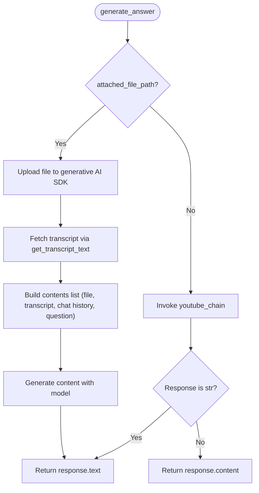

**Diagram sources**
- [youtube_service.py](file://services/youtube_service.py#L9-L70)

**Section sources**
- [youtube_service.py](file://services/youtube_service.py#L8-L71)

### Tools: YouTube Utilities

#### Video ID Extraction
- Supports youtube.com and youtu.be domains.
- Extracts the v parameter for youtube.com or the path fragment for youtu.be.

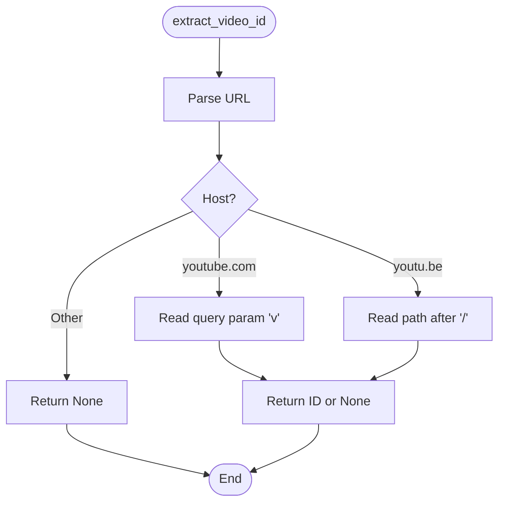

**Diagram sources**
- [extract_id.py](file://tools/youtube_utils/extract_id.py#L8-L24)

**Section sources**
- [extract_id.py](file://tools/youtube_utils/extract_id.py#L8-L24)

#### Video Info Retrieval
- Uses yt-dlp to extract metadata.
- Attempts to fetch subtitles and attach a cleaned transcript if available.
- Handles known error conditions and logs appropriate messages.

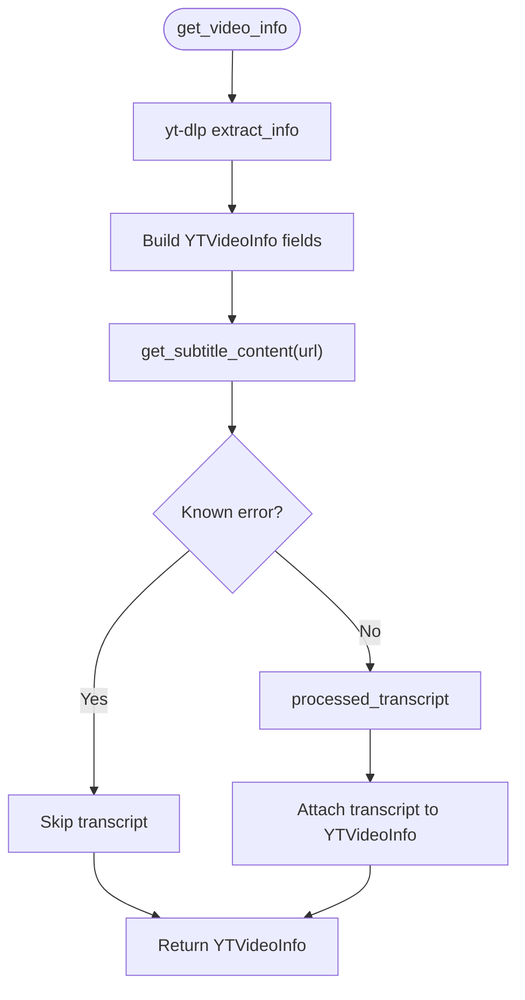

**Diagram sources**
- [get_info.py](file://tools/youtube_utils/get_info.py#L11-L77)

**Section sources**
- [get_info.py](file://tools/youtube_utils/get_info.py#L11-L77)

#### Subtitle Extraction and Fallback
- Single-pass attempt for preferred language subtitles (manual, auto-generated, auto-translated).
- If unavailable, finds an alternative language from available tracks and retries.
- Falls back to audio download and Whisper transcription if no subtitles are found.
- Includes robust error handling for rate limits and unavailable videos.

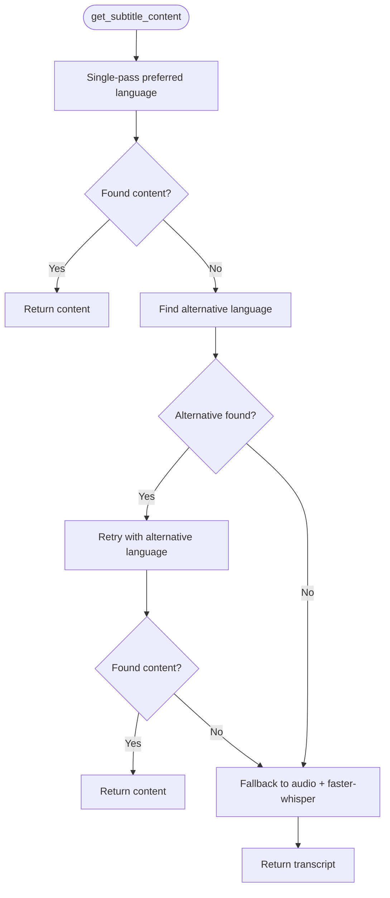

**Diagram sources**
- [get_subs.py](file://tools/youtube_utils/get_subs.py#L8-L106)

**Section sources**
- [get_subs.py](file://tools/youtube_utils/get_subs.py#L8-L276)

### Transcript Processing Pipeline
The transcript generator applies a series of transformations to normalize and clean the text:
- Remove full SRT/VTT timestamps and cue tags.
- Strip speaker tags and alignment directives.
- Normalize inline timestamps and collapse literal newline sequences.
- Deduplicate consecutive repeated lines.
- Merge into coherent paragraphs.

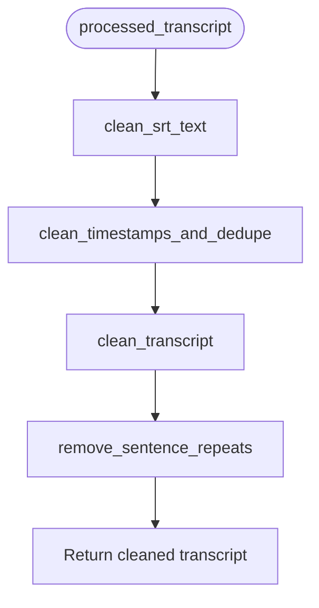

**Diagram sources**
- [__init__.py](file://tools/youtube_utils/transcript_generator/__init__.py#L11-L22)
- [srt.py](file://tools/youtube_utils/transcript_generator/srt.py#L4-L30)
- [timestamp.py](file://tools/youtube_utils/transcript_generator/timestamp.py#L10-L32)
- [clean.py](file://tools/youtube_utils/transcript_generator/clean.py#L22-L67)
- [duplicate.py](file://tools/youtube_utils/transcript_generator/duplicate.py#L4-L26)

**Section sources**
- [__init__.py](file://tools/youtube_utils/transcript_generator/__init__.py#L11-L22)
- [srt.py](file://tools/youtube_utils/transcript_generator/srt.py#L4-L30)
- [timestamp.py](file://tools/youtube_utils/transcript_generator/timestamp.py#L10-L32)
- [clean.py](file://tools/youtube_utils/transcript_generator/clean.py#L22-L67)
- [duplicate.py](file://tools/youtube_utils/transcript_generator/duplicate.py#L4-L26)

### Prompt Chain and LLM Integration
- The prompt defines strict guidelines for answering questions using only the video’s metadata and transcript.
- A LangChain chain composes:
  - A context builder that fetches and cleans the transcript.
  - The prompt template.
  - An LLM client.
  - A string output parser.
- The service can bypass this chain when using an attached file.

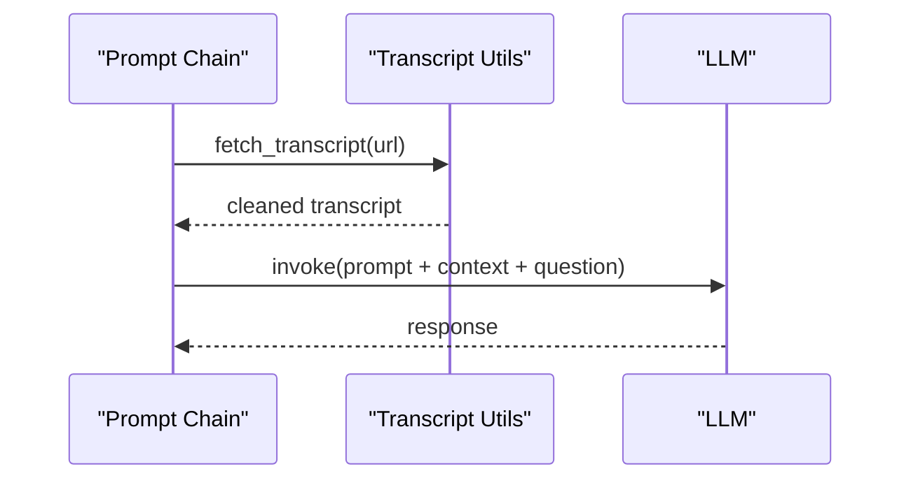

**Diagram sources**
- [youtube.py](file://prompts/youtube.py#L37-L74)
- [youtube.py](file://prompts/youtube.py#L130-L139)

**Section sources**
- [youtube.py](file://prompts/youtube.py#L37-L74)
- [youtube.py](file://prompts/youtube.py#L130-L139)

### Models and Schemas
- YTVideoInfo: Typed representation of video metadata and optional transcript/captions.
- VideoInfoRequest: Minimal request schema for video info endpoints.
- SubtitlesRequest: Request schema for subtitle extraction with optional language.
- SubtitlesResponse: Response schema for returning subtitle text.

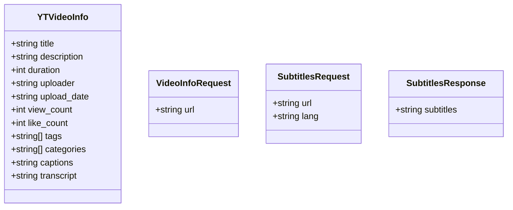

**Diagram sources**
- [yt.py](file://models/yt.py#L5-L17)
- [video_info.py](file://models/requests/video_info.py#L5-L7)
- [subtitles.py](file://models/requests/subtitles.py#L5-L8)
- [subtitles.py](file://models/response/subtitles.py#L4-L6)

**Section sources**
- [yt.py](file://models/yt.py#L5-L17)
- [video_info.py](file://models/requests/video_info.py#L5-L7)
- [subtitles.py](file://models/requests/subtitles.py#L5-L8)
- [subtitles.py](file://models/response/subtitles.py#L4-L6)

## Dependency Analysis
- Router depends on YouTubeService.
- YouTubeService depends on:
  - Prompt chain (LangChain) for non-file mode.
  - Generative AI SDK for file mode.
  - Tools for video ID extraction, info retrieval, and subtitle fetching.
- Tools depend on yt-dlp for metadata and subtitle retrieval, and optionally on Whisper for transcription.
- Transcript generator utilities are composed into a single processing function.

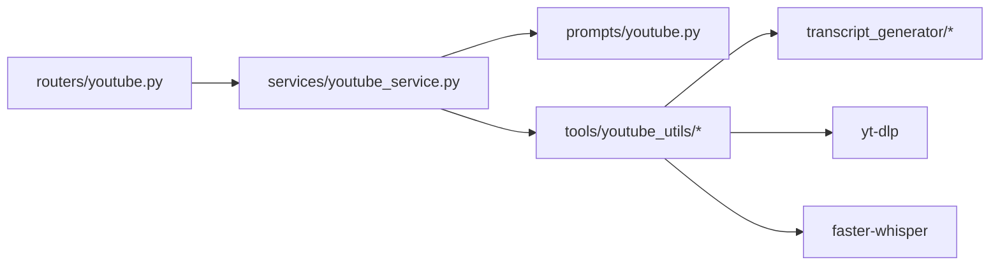

**Diagram sources**
- [youtube.py](file://routers/youtube.py#L1-L59)
- [youtube_service.py](file://services/youtube_service.py#L1-L71)
- [youtube.py](file://prompts/youtube.py#L1-L158)
- [get_subs.py](file://tools/youtube_utils/get_subs.py#L1-L276)
- [__init__.py](file://tools/youtube_utils/transcript_generator/__init__.py#L1-L22)

**Section sources**
- [youtube.py](file://routers/youtube.py#L1-L59)
- [youtube_service.py](file://services/youtube_service.py#L1-L71)
- [get_subs.py](file://tools/youtube_utils/get_subs.py#L1-L276)
- [__init__.py](file://tools/youtube_utils/transcript_generator/__init__.py#L1-L22)

## Performance Considerations
- Subtitle retrieval strategy:
  - Single-pass preferred language request minimizes API calls and avoids rate limiting.
  - Alternative language selection reduces retries.
  - Whisper fallback ensures coverage when no subtitles are available.
- Transcript processing:
  - Efficient regex-based cleaning and deduplication reduce memory overhead.
  - Paragraph merging improves readability without heavy computation.
- Audio transcription:
  - Lightweight model size and CPU execution optimize resource usage.
  - Temporary file cleanup prevents disk accumulation.
- Router and service:
  - Early validation and minimal string processing keep latency low.
  - Logging helps identify bottlenecks without impacting performance.

[No sources needed since this section provides general guidance]

## Troubleshooting Guide
- API access issues:
  - Rate limiting: The subtitle utility handles 429 errors by falling back to Whisper. Monitor logs for rate limit warnings.
  - Video unavailable: Errors are normalized and surfaced to the caller; verify the video URL and privacy settings.
- Transcript generation problems:
  - Empty or malformed transcripts: The processing pipeline removes timestamps and cue tags; confirm the source format.
  - Repeated lines: Deduplication is applied; check for repeated segments in the original content.
- Content availability concerns:
  - No subtitles: The system attempts alternative languages and falls back to audio transcription.
  - Language mismatch: Specify the desired language in the subtitles request schema.
- Service-level errors:
  - Validation failures: Ensure url and question are provided in the request.
  - Generative AI SDK errors: Confirm API keys and file upload permissions.

**Section sources**
- [get_subs.py](file://tools/youtube_utils/get_subs.py#L80-L106)
- [get_subs.py](file://tools/youtube_utils/get_subs.py#L201-L276)
- [youtube.py](file://routers/youtube.py#L34-L38)
- [youtube_service.py](file://services/youtube_service.py#L68-L70)

## Conclusion
The YouTube integration provides a robust pipeline for extracting video metadata, subtitles, and generating transcripts. It supports flexible answer generation via a LangChain prompt chain or direct file-based processing. The design emphasizes resilience against API limitations, efficient processing, and clear error handling. By leveraging yt-dlp and Whisper, it maximizes content accessibility while maintaining performance and reliability.

[No sources needed since this section summarizes without analyzing specific files]

## Appendices

### Example Workflows

- Video analysis workflow (prompt-driven):
  - Client sends a question and URL.
  - Router validates inputs and calls the service.
  - Service builds a transcript-based context and invokes the LLM chain.
  - Response is returned to the client.

- Content extraction pattern (subtitle retrieval):
  - Attempt single-pass preferred language.
  - Select alternative language if available.
  - Fall back to audio transcription if no subtitles exist.

- Transcript processing:
  - Clean SRT/VTT artifacts.
  - Remove timestamps and cue tags.
  - Deduplicate and merge into paragraphs.

[No sources needed since this section provides general guidance]