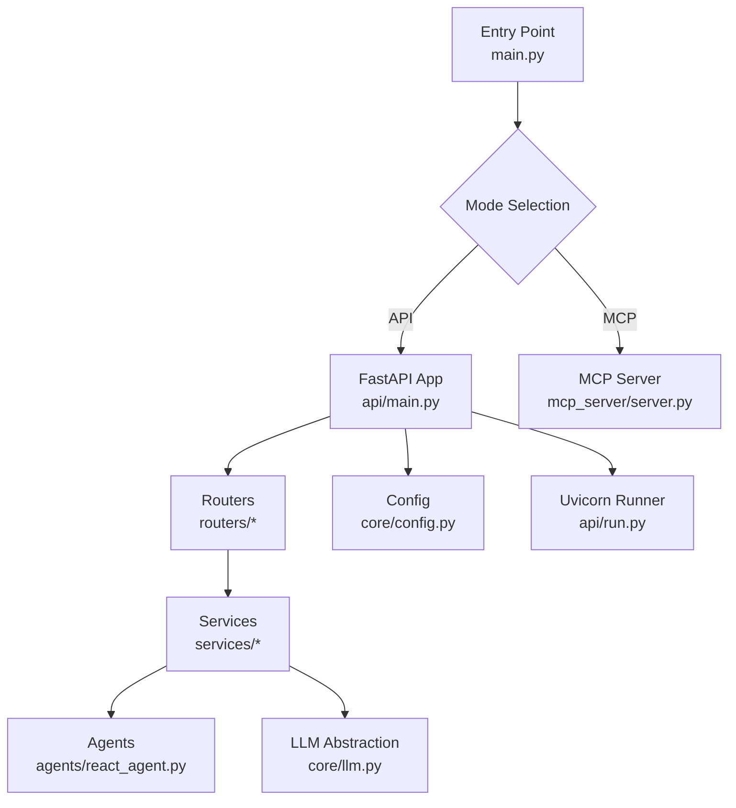
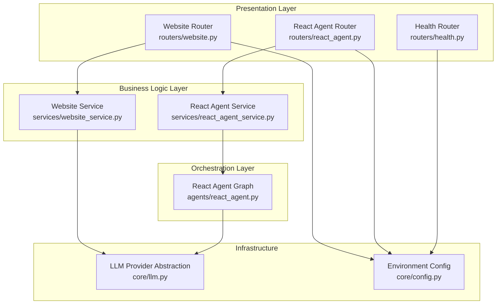
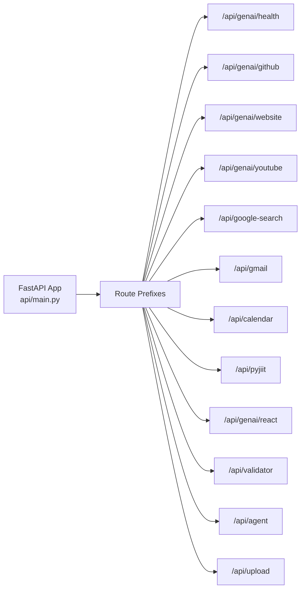
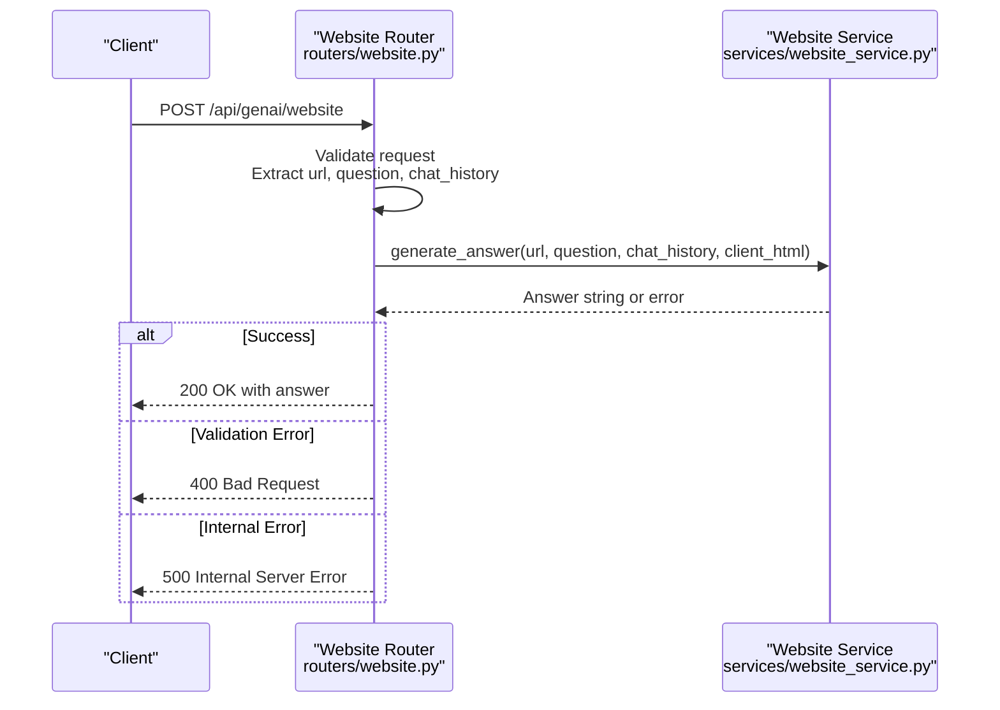
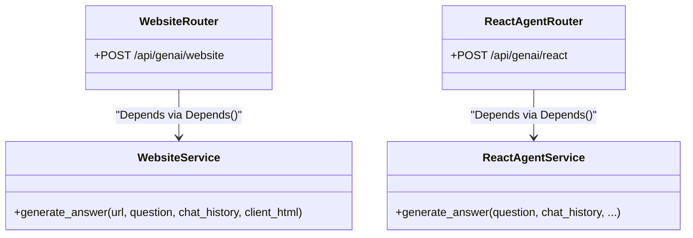
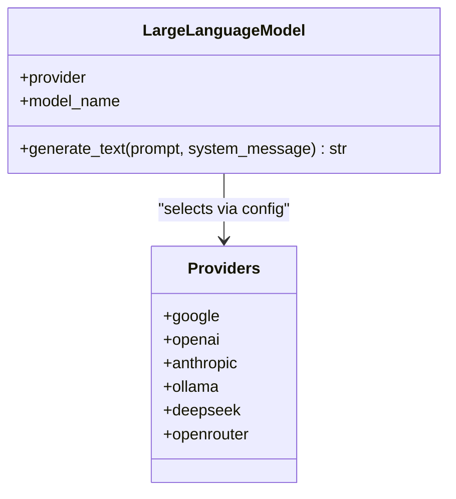
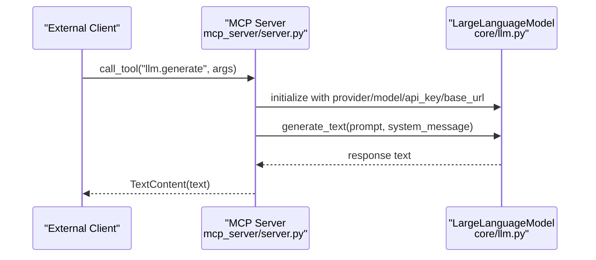
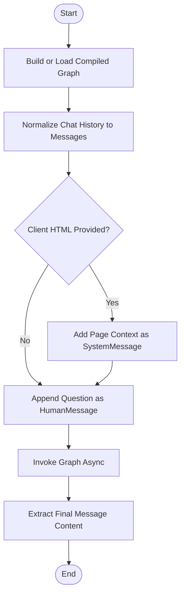
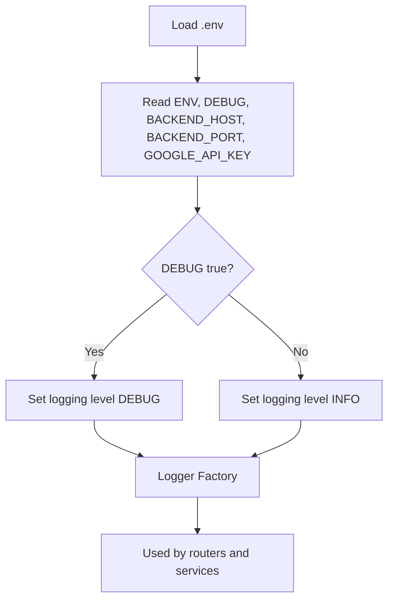
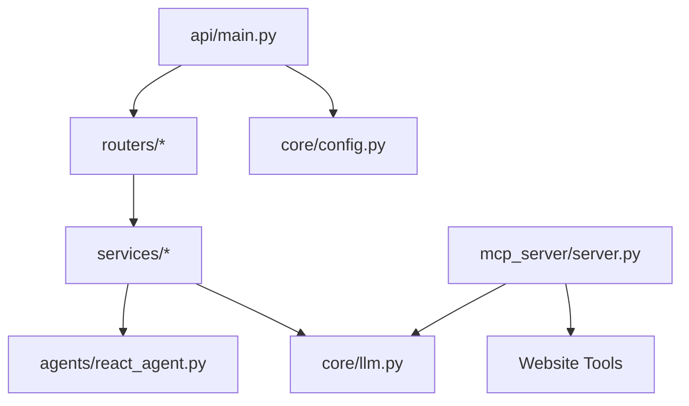

# Backend Server Design

<cite>
**Referenced Files in This Document**
- [main.py](file://main.py)
- [api/main.py](file://api/main.py)
- [api/run.py](file://api/run.py)
- [core/config.py](file://core/config.py)
- [core/llm.py](file://core/llm.py)
- [routers/health.py](file://routers/health.py)
- [routers/website.py](file://routers/website.py)
- [routers/react_agent.py](file://routers/react_agent.py)
- [services/website_service.py](file://services/website_service.py)
- [services/react_agent_service.py](file://services/react_agent_service.py)
- [agents/react_agent.py](file://agents/react_agent.py)
- [mcp_server/server.py](file://mcp_server/server.py)
- [models/requests/website.py](file://models/requests/website.py)
- [models/response/website.py](file://models/response/website.py)
- [pyproject.toml](file://pyproject.toml)
</cite>

## Table of Contents
1. [Introduction](#introduction)
2. [Project Structure](#project-structure)
3. [Core Components](#core-components)
4. [Architecture Overview](#architecture-overview)
5. [Detailed Component Analysis](#detailed-component-analysis)
6. [Dependency Analysis](#dependency-analysis)
7. [Performance Considerations](#performance-considerations)
8. [Troubleshooting Guide](#troubleshooting-guide)
9. [Conclusion](#conclusion)
10. [Appendices](#appendices)

## Introduction
This document describes the backend server design built with FastAPI and a complementary MCP server. It explains the application structure, routing organization, service layer architecture, and the LLM provider abstraction supporting multiple AI models. It documents configuration management across environments, the modular router system for API endpoints, request/response handling patterns, middleware implementation, and error handling strategies. It also covers the separation between API endpoints and business logic, dependency injection patterns, concurrency handling, external service integrations, caching strategies, performance optimization, scalability, load balancing, and monitoring approaches.

## Project Structure
The backend consists of:
- Application entrypoint that selects between API and MCP modes
- FastAPI application with modular routers and a central run script
- Core configuration and LLM abstraction
- Routers for each domain endpoint
- Services implementing business logic
- Agents orchestrating multi-step reasoning with tools
- MCP server exposing tools for external clients

**Diagram sources**
- [main.py](file://main.py#L11-L58)
- [api/main.py](file://api/main.py#L12-L47)
- [api/run.py](file://api/run.py#L4-L10)
- [core/config.py](file://core/config.py#L8-L25)
- [core/llm.py](file://core/llm.py#L78-L215)
- [mcp_server/server.py](file://mcp_server/server.py#L13-L139)

**Section sources**
- [main.py](file://main.py#L11-L58)
- [api/main.py](file://api/main.py#L12-L47)
- [api/run.py](file://api/run.py#L4-L10)
- [core/config.py](file://core/config.py#L8-L25)
- [core/llm.py](file://core/llm.py#L78-L215)
- [mcp_server/server.py](file://mcp_server/server.py#L13-L139)

## Core Components
- Entry point and mode selection: supports running as API server or MCP server with optional interactive or non-interactive mode.
- FastAPI application: defines routes under multiple prefixes and includes health, GitHub, website, YouTube, Google Search, Gmail, Calendar, PyJIIT, React agent, website validator, agent, and file upload endpoints.
- Configuration: environment-driven settings for host, port, debug level, and Google API key; centralized logger factory.
- LLM abstraction: provider-agnostic initialization and generation interface supporting Google, OpenAI, Anthropic, Ollama, DeepSeek, and OpenRouter.
- Routers: per-domain endpoints with dependency injection of services and standardized error handling.
- Services: business logic implementations for website QA, React agent orchestration, and related tasks.
- Agents: LangGraph-based reasoning with tool execution and message normalization.
- MCP server: exposes tools for LLM generation, GitHub Q&A, website markdown fetching, and HTML-to-markdown conversion.

**Section sources**
- [main.py](file://main.py#L11-L58)
- [api/main.py](file://api/main.py#L12-L47)
- [core/config.py](file://core/config.py#L8-L25)
- [core/llm.py](file://core/llm.py#L78-L215)
- [routers/website.py](file://routers/website.py#L14-L42)
- [services/website_service.py](file://services/website_service.py#L9-L97)
- [agents/react_agent.py](file://agents/react_agent.py#L138-L181)
- [mcp_server/server.py](file://mcp_server/server.py#L13-L139)

## Architecture Overview
The system separates concerns across layers:
- Presentation: FastAPI routers define endpoints and handle request validation and error mapping.
- Business logic: Services encapsulate domain-specific workflows.
- Orchestration: Agents coordinate tool use and multi-step reasoning.
- Infrastructure: Configuration and LLM abstraction provide pluggable providers and runtime settings.

**Diagram sources**
- [routers/website.py](file://routers/website.py#L14-L42)
- [routers/react_agent.py](file://routers/react_agent.py#L18-L57)
- [routers/health.py](file://routers/health.py#L7-L12)
- [services/website_service.py](file://services/website_service.py#L9-L97)
- [services/react_agent_service.py](file://services/react_agent_service.py#L16-L154)
- [agents/react_agent.py](file://agents/react_agent.py#L138-L181)
- [core/llm.py](file://core/llm.py#L78-L215)
- [core/config.py](file://core/config.py#L8-L25)

## Detailed Component Analysis

### FastAPI Application and Routing Organization
- Central app definition with title and version.
- Modular router inclusion under distinct prefixes for health, GitHub, website, YouTube, Google Search, Gmail, Calendar, PyJIIT, React agent, website validator, agent, and file upload.
- Root endpoint returns app metadata.

**Diagram sources**
- [api/main.py](file://api/main.py#L12-L41)

**Section sources**
- [api/main.py](file://api/main.py#L12-L47)

### Request/Response Handling Patterns and Error Handling
- Routers validate inputs and delegate to services using dependency injection.
- Standardized try/catch blocks log errors and raise HTTP exceptions with appropriate status codes.
- Responses are typed via Pydantic models where applicable.

**Diagram sources**
- [routers/website.py](file://routers/website.py#L14-L42)
- [services/website_service.py](file://services/website_service.py#L13-L97)

**Section sources**
- [routers/website.py](file://routers/website.py#L14-L42)
- [models/requests/website.py](file://models/requests/website.py#L5-L11)
- [models/response/website.py](file://models/response/website.py#L4-L6)

### Dependency Injection and Service Layer
- Routers define dependency factories returning service instances.
- Services encapsulate domain logic and integrate with tools and LLM providers.
- Example: Website router depends on WebsiteService; React agent router depends on ReactAgentService.

**Diagram sources**
- [routers/website.py](file://routers/website.py#L10-L11)
- [services/website_service.py](file://services/website_service.py#L9-L20)
- [routers/react_agent.py](file://routers/react_agent.py#L14-L15)
- [services/react_agent_service.py](file://services/react_agent_service.py#L16-L25)

**Section sources**
- [routers/website.py](file://routers/website.py#L10-L11)
- [routers/react_agent.py](file://routers/react_agent.py#L14-L15)
- [services/website_service.py](file://services/website_service.py#L9-L20)
- [services/react_agent_service.py](file://services/react_agent_service.py#L16-L25)

### LLM Provider Abstraction
- Provider configurations map provider names to LangChain classes and parameter mappings.
- Initialization validates provider support, model defaults, API keys, and base URLs.
- Generation method constructs system and human messages and invokes the underlying client.
- Default LLM instance is created for application-wide use.

**Diagram sources**
- [core/llm.py](file://core/llm.py#L78-L215)

**Section sources**
- [core/llm.py](file://core/llm.py#L21-L75)
- [core/llm.py](file://core/llm.py#L78-L215)

### MCP Server Integration
- Defines tools for LLM generation, GitHub Q&A, website markdown fetching, and HTML-to-markdown conversion.
- Implements tool dispatch based on tool name and arguments.
- Runs over stdio using MCP server framework.

**Diagram sources**
- [mcp_server/server.py](file://mcp_server/server.py#L83-L124)
- [core/llm.py](file://core/llm.py#L78-L215)

**Section sources**
- [mcp_server/server.py](file://mcp_server/server.py#L13-L139)
- [core/llm.py](file://core/llm.py#L78-L215)

### React Agent Orchestration
- Converts chat history and optional client HTML into LangGraph messages.
- Builds a graph with an agent node and a tool execution node, conditionally routing between them.
- Uses cached compilation for performance.

**Diagram sources**
- [agents/react_agent.py](file://agents/react_agent.py#L138-L181)
- [agents/react_agent.py](file://agents/react_agent.py#L123-L170)
- [services/react_agent_service.py](file://services/react_agent_service.py#L16-L154)

**Section sources**
- [agents/react_agent.py](file://agents/react_agent.py#L138-L181)
- [services/react_agent_service.py](file://services/react_agent_service.py#L16-L154)

### Configuration Management
- Environment variables drive host, port, debug level, and Google API key.
- Logging level is derived from debug flag.
- Centralized logger factory ensures consistent logging across modules.

**Diagram sources**
- [core/config.py](file://core/config.py#L6-L25)

**Section sources**
- [core/config.py](file://core/config.py#L6-L25)

### Middleware Implementation
- No explicit middleware is defined in the analyzed files. Logging is handled via module loggers and exception handlers in routers.

**Section sources**
- [api/main.py](file://api/main.py#L12-L47)
- [routers/website.py](file://routers/website.py#L37-L42)

### Concurrency and Request Handling
- FastAPI uses async route handlers; services implement async methods for I/O-bound operations (external APIs, LLM calls).
- LangGraph invocation is awaited, ensuring cooperative concurrency.

**Section sources**
- [routers/website.py](file://routers/website.py#L16-L29)
- [routers/react_agent.py](file://routers/react_agent.py#L21-L37)
- [services/website_service.py](file://services/website_service.py#L13-L97)
- [services/react_agent_service.py](file://services/react_agent_service.py#L16-L154)
- [agents/react_agent.py](file://agents/react_agent.py#L128-L135)

### External Service Integrations
- Website service integrates markdown fetching and HTML-to-Markdown conversion.
- React agent service optionally uploads files to Google GenAI and uses LangChain messages.
- MCP server integrates with LangChain providers and website tools.

**Section sources**
- [services/website_service.py](file://services/website_service.py#L25-L87)
- [services/react_agent_service.py](file://services/react_agent_service.py#L27-L65)
- [mcp_server/server.py](file://mcp_server/server.py#L83-L124)

### Caching Strategies
- LangGraph graph is compiled once and cached via a cached graph factory, reducing startup overhead for repeated invocations.

**Section sources**
- [agents/react_agent.py](file://agents/react_agent.py#L178-L181)

## Dependency Analysis
The system exhibits clear layering:
- Presentation depends on business logic
- Business logic depends on agents and LLM abstraction
- Configuration is consumed across layers
- MCP server reuses LLM and tools

**Diagram sources**
- [api/main.py](file://api/main.py#L12-L47)
- [core/llm.py](file://core/llm.py#L78-L215)
- [mcp_server/server.py](file://mcp_server/server.py#L13-L139)

**Section sources**
- [api/main.py](file://api/main.py#L12-L47)
- [core/llm.py](file://core/llm.py#L78-L215)
- [mcp_server/server.py](file://mcp_server/server.py#L13-L139)

## Performance Considerations
- Async-first design: route handlers and services use async to handle concurrent requests efficiently.
- Cached graph compilation: reduces repeated graph building costs in the React agent.
- Minimal synchronous work in hot paths; offloads heavy operations to external services.
- Environment-driven tuning: adjust debug level and provider/model settings via environment variables.

[No sources needed since this section provides general guidance]

## Troubleshooting Guide
- Missing environment variables: ensure required keys (e.g., provider API keys and base URLs) are set; the LLM initializer raises explicit errors when missing.
- Router-level validation: routers check required fields and return 400 for invalid requests.
- Service-level errors: services catch exceptions and return user-friendly messages; routers map unexpected errors to 500.
- Logging: configure logging level via environment; use module loggers to trace execution paths.

**Section sources**
- [core/llm.py](file://core/llm.py#L121-L155)
- [routers/website.py](file://routers/website.py#L23-L27)
- [services/website_service.py](file://services/website_service.py#L94-L97)
- [core/config.py](file://core/config.py#L17-L25)

## Conclusion
The backend employs a layered architecture with clear separation between presentation, business logic, orchestration, and infrastructure. FastAPI’s modular routers expose domain-specific endpoints under prefixed namespaces, while dependency injection keeps endpoints thin. The LLM abstraction enables multi-provider support and environment-driven configuration. Asynchronous services and cached graph compilation optimize concurrency and performance. The MCP server extends functionality externally, and robust error handling ensures predictable responses.

## Appendices

### Endpoint Catalog
- Health: GET /api/genai/health
- GitHub: GET /api/genai/github
- Website: POST /api/genai/website
- YouTube: GET /api/genai/youtube
- Google Search: GET /api/google-search
- Gmail: GET /api/gmail
- Calendar: GET /api/calendar
- PyJIIT: GET /api/pyjiit
- React Agent: POST /api/genai/react
- Website Validator: GET /api/validator
- Agent: POST /api/agent
- File Upload: POST /api/upload

**Section sources**
- [api/main.py](file://api/main.py#L29-L40)

### Startup and Runtime
- Entry point accepts mode flags and runs either API or MCP server.
- API server uses Uvicorn with host/port from configuration.

**Section sources**
- [main.py](file://main.py#L11-L58)
- [api/run.py](file://api/run.py#L4-L10)
- [core/config.py](file://core/config.py#L10-L11)

### Scripts and Entrypoints
- Project scripts expose CLI commands for running API and MCP servers.

**Section sources**
- [pyproject.toml](file://pyproject.toml#L31-L34)