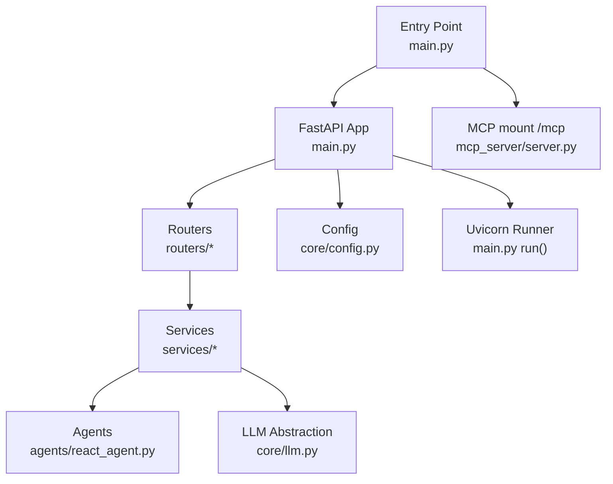
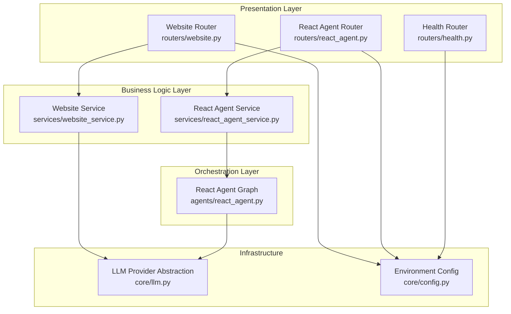
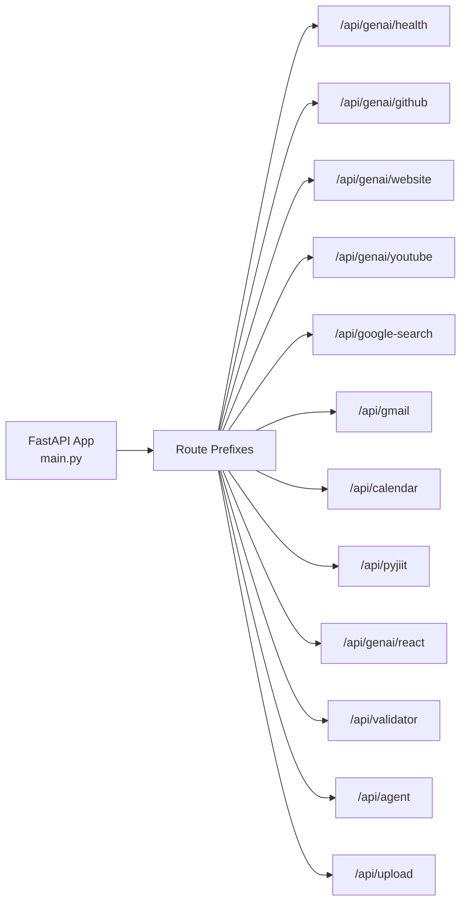
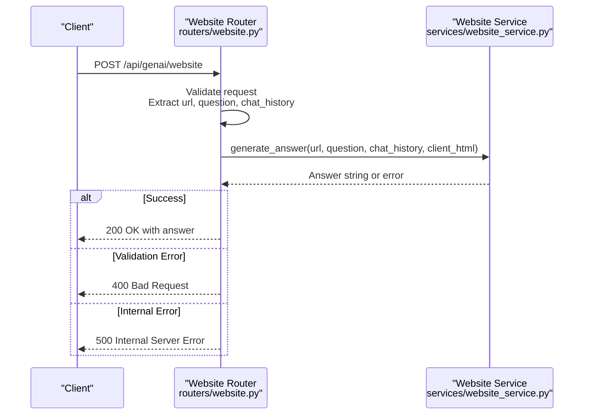
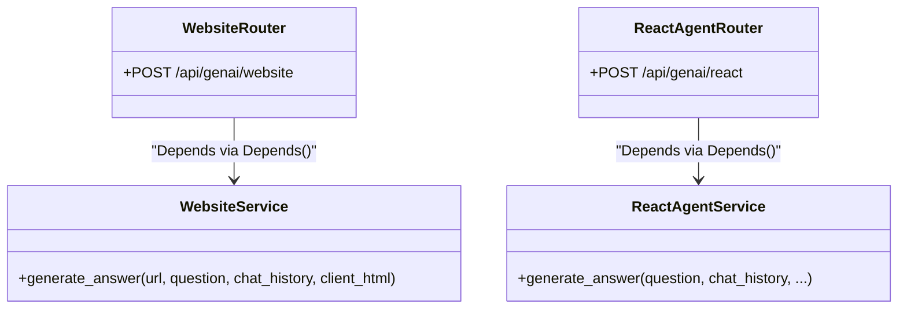
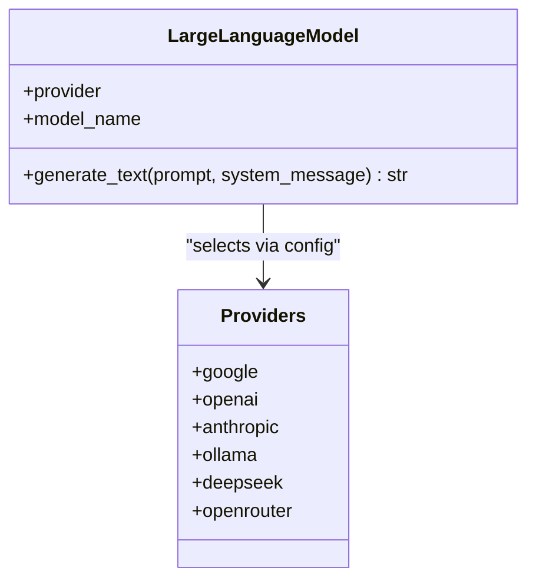
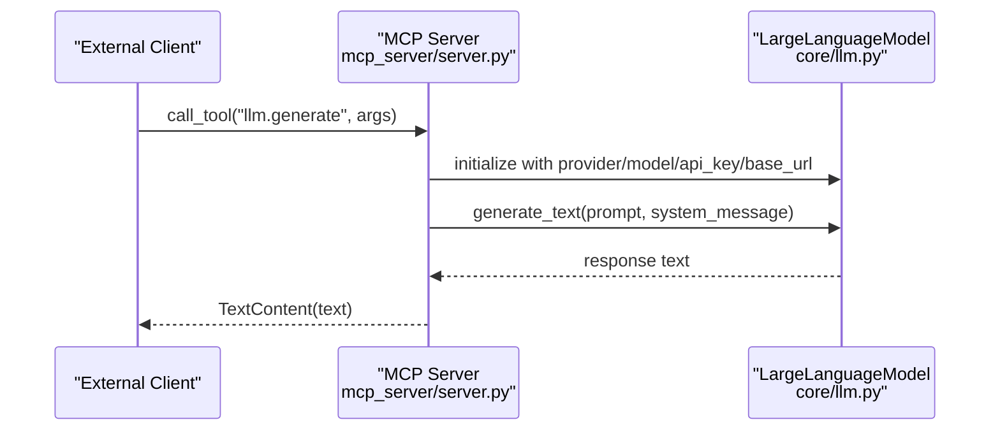
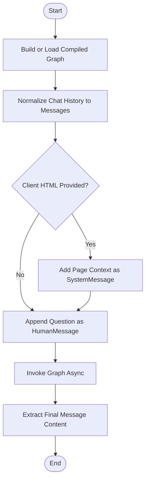
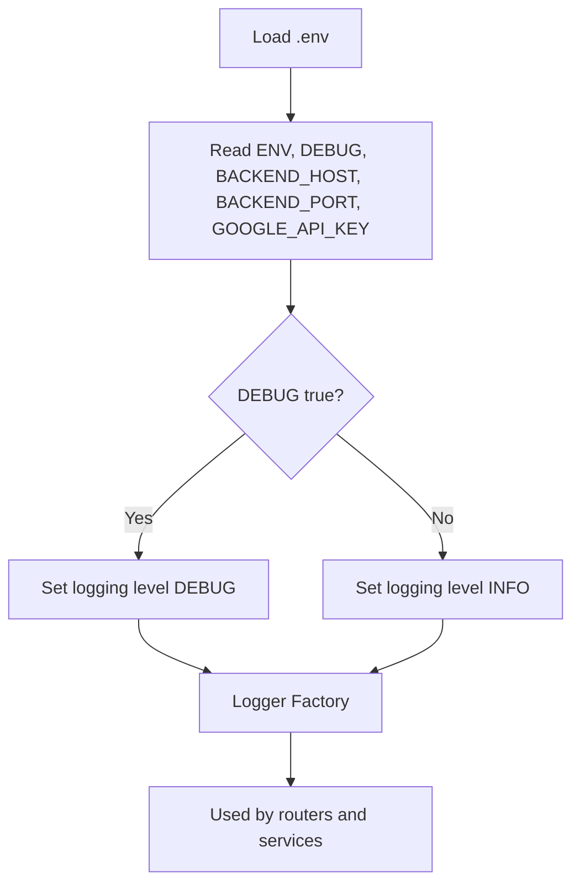
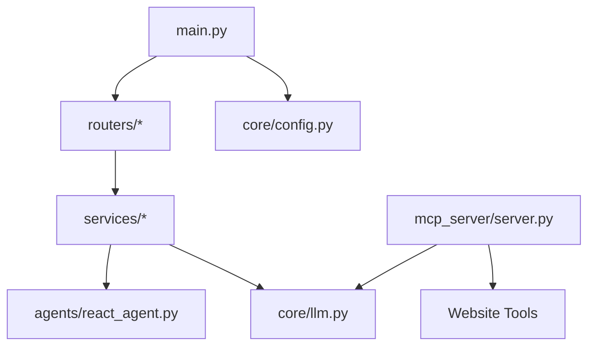

# Backend server design

## Introduction
FastAPI app structure, routers, services, LLM abstraction, config, errors, and concurrency. How the MCP server sits beside the REST API.

## Project structure
The backend consists of:
- FastAPI application in `main.py` with modular routers
- MCP server in `mcp_server/` (stdio via `agentic-mcp`, HTTP at `/mcp`)
- Core configuration and LLM abstraction
- Routers for each domain endpoint
- Services implementing business logic
- Agents orchestrating multi-step reasoning with tools
- Memory stores (sqlmodel/asyncpg, Neo4j, OpenSearch)

```mermaid
graph TB
Entry["Entry Point<br/>main.py"] --> APIApp["FastAPI App<br/>main.py"]
Entry --> MCP["MCP mount /mcp<br/>mcp_server/server.py"]
APIApp --> Routers["Routers<br/>routers/*"]
APIApp --> Config["Config<br/>core/config.py"]
APIApp --> Run["Uvicorn Runner<br/>main.py run()"]
Routers --> Services["Services<br/>services/*"]
Services --> Agents["Agents<br/>agents/react_agent.py"]
Services --> LLM["LLM Abstraction<br/>core/llm.py"]
```

## Core components
- Entry point: `main.py` starts FastAPI with Uvicorn and mounts MCP at `/mcp`. Stdio MCP is `agentic-mcp`.
- FastAPI application: defines routes under multiple prefixes and includes health, GitHub, website, YouTube, Google Search, Gmail, Calendar, PyJIIT, React agent, website validator, agent, and file upload endpoints.
- Configuration: environment-driven settings for host, port, debug level, and Google API key; centralized logger factory.
- LLM abstraction: provider-agnostic initialization and generation interface supporting Google, OpenAI, Anthropic, Ollama, DeepSeek, and OpenRouter.
- Routers: per-domain endpoints with dependency injection of services and standardized error handling.
- Services: business logic implementations for website QA, React agent orchestration, and related tasks.
- Agents: LangGraph-based reasoning with tool execution and message normalization.
- MCP server: exposes tools for LLM generation, GitHub Q&A, website markdown fetching, and HTML-to-markdown conversion.

## Architecture overview
The system separates concerns across layers:
- Presentation: FastAPI routers define endpoints and handle request validation and error mapping.
- Business logic: Services encapsulate domain-specific workflows.
- Orchestration: Agents coordinate tool use and multi-step reasoning.
- Infrastructure: Configuration and LLM abstraction provide pluggable providers and runtime settings.

```mermaid
graph TB
subgraph "Presentation Layer"
RWebsite["Website Router<br/>routers/website.py"]
RReact["React Agent Router<br/>routers/react_agent.py"]
RHealth["Health Router<br/>routers/health.py"]
end
subgraph "Business Logic Layer"
SWebsite["Website Service<br/>services/website_service.py"]
SReact["React Agent Service<br/>services/react_agent_service.py"]
end
subgraph "Orchestration Layer"
Agent["React Agent Graph<br/>agents/react_agent.py"]
end
subgraph "Infrastructure"
LLM["LLM Provider Abstraction<br/>core/llm.py"]
CFG["Environment Config<br/>core/config.py"]
end
RWebsite --> SWebsite
RReact --> SReact
SWebsite --> LLM
SReact --> Agent
Agent --> LLM
RWebsite --> CFG
RReact --> CFG
RHealth --> CFG
```

## Detailed component analysis

### FastAPI application and routing organization
- Central app definition with title and version.
- Modular router inclusion under distinct prefixes for health, GitHub, website, YouTube, Google Search, Gmail, Calendar, PyJIIT, React agent, website validator, agent, and file upload.
- Root endpoint returns app metadata.

```mermaid
graph LR
App["FastAPI App<br/>main.py"] --> Prefixes["Route Prefixes"]
Prefixes --> H["/api/genai/health"]
Prefixes --> G["/api/genai/github"]
Prefixes --> W["/api/genai/website"]
Prefixes --> Y["/api/genai/youtube"]
Prefixes --> GS["/api/google-search"]
Prefixes --> GM["/api/gmail"]
Prefixes --> C["/api/calendar"]
Prefixes --> P["/api/pyjiit"]
Prefixes --> RA["/api/genai/react"]
Prefixes --> V["/api/validator"]
Prefixes --> A["/api/agent"]
Prefixes --> U["/api/upload"]
```

### Request/Response handling patterns and error handling
- Routers validate inputs and delegate to services using dependency injection.
- Standardized try/catch blocks log errors and raise HTTP exceptions with appropriate status codes.
- Responses are typed via Pydantic models where applicable.

```mermaid
sequenceDiagram
participant Client as "Client"
participant Router as "Website Router<br/>routers/website.py"
participant Service as "Website Service<br/>services/website_service.py"
Client->>Router : POST /api/genai/website
Router->>Router : Validate request<br/>Extract url, question, chat_history
Router->>Service : generate_answer(url, question, chat_history, client_html)
Service-->>Router : Answer string or error
alt Success
Router-->>Client : 200 OK with answer
else Validation Error
Router-->>Client : 400 Bad Request
else Internal Error
Router-->>Client : 500 Internal Server Error
end
```

### Dependency injection and service layer
- Routers define dependency factories returning service instances.
- Services encapsulate domain logic and integrate with tools and LLM providers.
- Example: Website router depends on WebsiteService; React agent router depends on ReactAgentService.

```mermaid
classDiagram
class WebsiteRouter {
+POST /api/genai/website
}
class WebsiteService {
+generate_answer(url, question, chat_history, client_html)
}
class ReactAgentRouter {
+POST /api/genai/react
}
class ReactAgentService {
+generate_answer(question, chat_history, ...)
}
WebsiteRouter --> WebsiteService : "Depends via Depends()"
ReactAgentRouter --> ReactAgentService : "Depends via Depends()"
```

### LLM provider abstraction
- Provider configurations map provider names to LangChain classes and parameter mappings.
- Initialization validates provider support, model defaults, API keys, and base URLs.
- Generation method constructs system and human messages and invokes the underlying client.
- Default LLM instance is created for application-wide use.

```mermaid
classDiagram
class LargeLanguageModel {
+provider
+model_name
+generate_text(prompt, system_message) str
}
class Providers {
+google
+openai
+anthropic
+ollama
+deepseek
+openrouter
}
LargeLanguageModel --> Providers : "selects via config"
```

### MCP server integration
- Defines tools for LLM generation, GitHub Q&A, website markdown fetching, and HTML-to-markdown conversion.
- Implements tool dispatch based on tool name and arguments.
- Runs over stdio using MCP server framework.

```mermaid
sequenceDiagram
participant Ext as "External Client"
participant MCP as "MCP Server<br/>mcp_server/server.py"
participant LLM as "LargeLanguageModel<br/>core/llm.py"
Ext->>MCP : call_tool("llm.generate", args)
MCP->>LLM : initialize with provider/model/api_key/base_url
MCP->>LLM : generate_text(prompt, system_message)
LLM-->>MCP : response text
MCP-->>Ext : TextContent(text)
```

### React agent orchestration
- Converts chat history and optional client HTML into LangGraph messages.
- Builds a graph with an agent node and a tool execution node, conditionally routing between them.
- Uses cached compilation for performance.

```mermaid
flowchart TD
Start(["Start"]) --> BuildGraph["Build or Load Compiled Graph"]
BuildGraph --> Messages["Normalize Chat History to Messages"]
Messages --> InjectPage{"Client HTML Provided?"}
InjectPage --> |Yes| AddPage["Add Page Context as SystemMessage"]
InjectPage --> |No| AskQ["Append Question as HumanMessage"]
AddPage --> AskQ
AskQ --> RunGraph["Invoke Graph Async"]
RunGraph --> Output["Extract Final Message Content"]
Output --> End(["End"])
```

### Configuration management
- Environment variables drive host, port, debug level, and Google API key.
- Logging level is derived from debug flag.
- Centralized logger factory ensures consistent logging across modules.

```mermaid
flowchart TD
Env["Load .env"] --> ReadEnv["Read ENV, DEBUG, BACKEND_HOST, BACKEND_PORT, GOOGLE_API_KEY"]
ReadEnv --> SetLevel{"DEBUG true?"}
SetLevel --> |Yes| Debug["Set logging level DEBUG"]
SetLevel --> |No| Info["Set logging level INFO"]
Debug --> Logger["Logger Factory"]
Info --> Logger
Logger --> Use["Used by routers and services"]
```

### Middleware implementation
- No explicit middleware is defined in the analyzed files. Logging is handled via module loggers and exception handlers in routers.

### Concurrency and request handling
- FastAPI uses async route handlers; services implement async methods for I/O-bound operations (external APIs, LLM calls).
- LangGraph invocation is awaited so the event loop stays cooperative.

### External service integrations
- Website service integrates markdown fetching and HTML-to-Markdown conversion.
- React agent service optionally uploads files to Google GenAI and uses LangChain messages.
- MCP server integrates with LangChain providers and website tools.

### Caching strategies
- LangGraph graph is compiled once and cached via a cached graph factory, reducing startup overhead for repeated invocations.

## Dependency analysis
Layering:
- Presentation depends on business logic
- Business logic depends on agents and LLM abstraction
- Configuration is consumed across layers
- MCP server reuses LLM and tools

```mermaid
graph TB
API["main.py"] --> Routers["routers/*"]
Routers --> Services["services/*"]
Services --> Agents["agents/react_agent.py"]
Services --> LLM["core/llm.py"]
API --> Config["core/config.py"]
MCP["mcp_server/server.py"] --> LLM
MCP --> Tools["Website Tools"]
```

## Performance considerations
- Async-first design: route handlers and services use async to handle concurrent requests efficiently.
- Cached graph compilation: reduces repeated graph building costs in the React agent.
- Minimal synchronous work in hot paths; offloads heavy operations to external services.
- Environment-driven tuning: adjust debug level and provider/model settings via environment variables.

## Troubleshooting guide
- Missing environment variables: ensure required keys (e.g., provider API keys and base URLs) are set; the LLM initializer raises explicit errors when missing.
- Router-level validation: routers check required fields and return 400 for invalid requests.
- Service-level errors: services catch exceptions and return plain messages; routers map unexpected errors to 500.
- Logging: configure logging level via environment; use module loggers to trace execution paths.

## Conclusion
Thin routers, fat services, awaited LangGraph calls. Start the API with `python main.py` or `agentic-api-run`. Stdio MCP is `agentic-mcp`. Config comes from the environment.

## Appendices

### Endpoint catalog
- Health: GET /api/genai/health
- GitHub: GET /api/genai/github
- Website: POST /api/genai/website
- YouTube: GET /api/genai/youtube
- Google Search: GET /api/google-search
- Gmail: GET /api/gmail
- Calendar: GET /api/calendar
- PyJIIT: GET /api/pyjiit
- React Agent: POST /api/genai/react
- Website Validator: GET /api/validator
- Agent: POST /api/agent
- File Upload: POST /api/upload

### Startup and runtime
- Entry point `main.py` runs FastAPI via Uvicorn and mounts MCP at `/mcp`.
- Stdio MCP is `agentic-mcp`.
- API host/port come from configuration.

### Scripts and entrypoints
- Project scripts expose CLI commands for running API and MCP servers.
