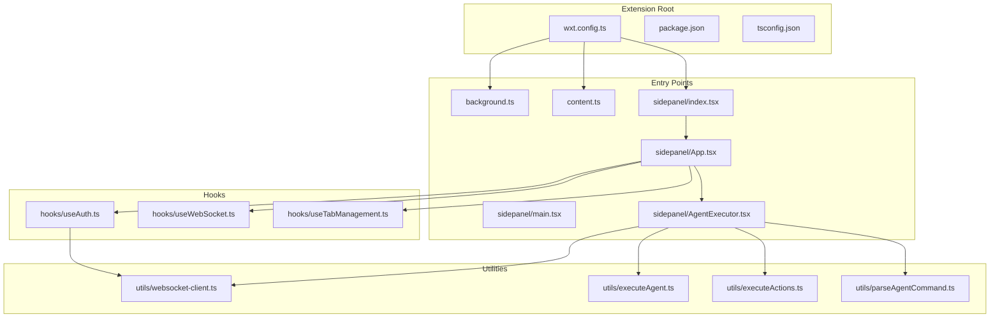
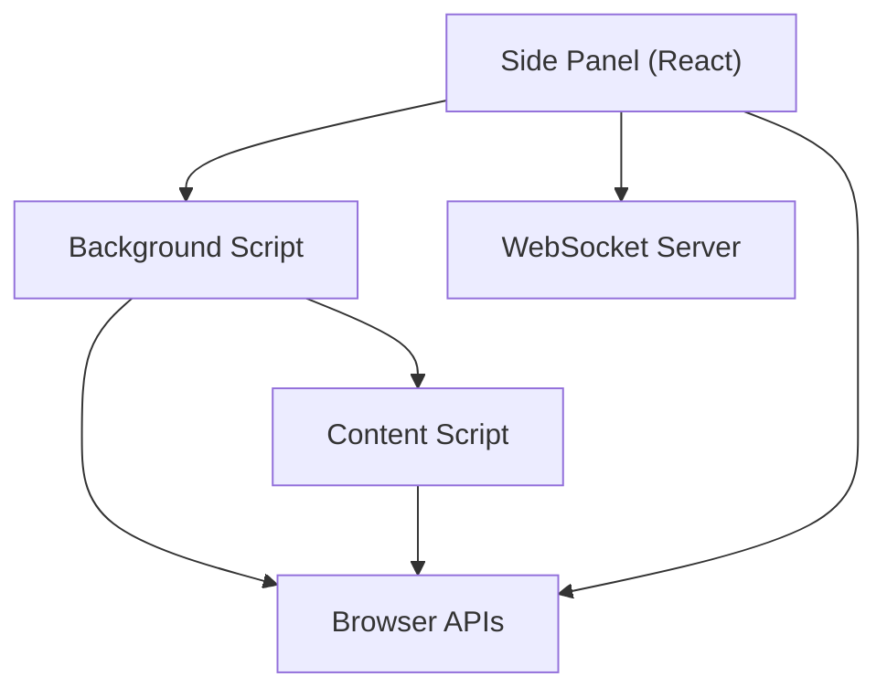
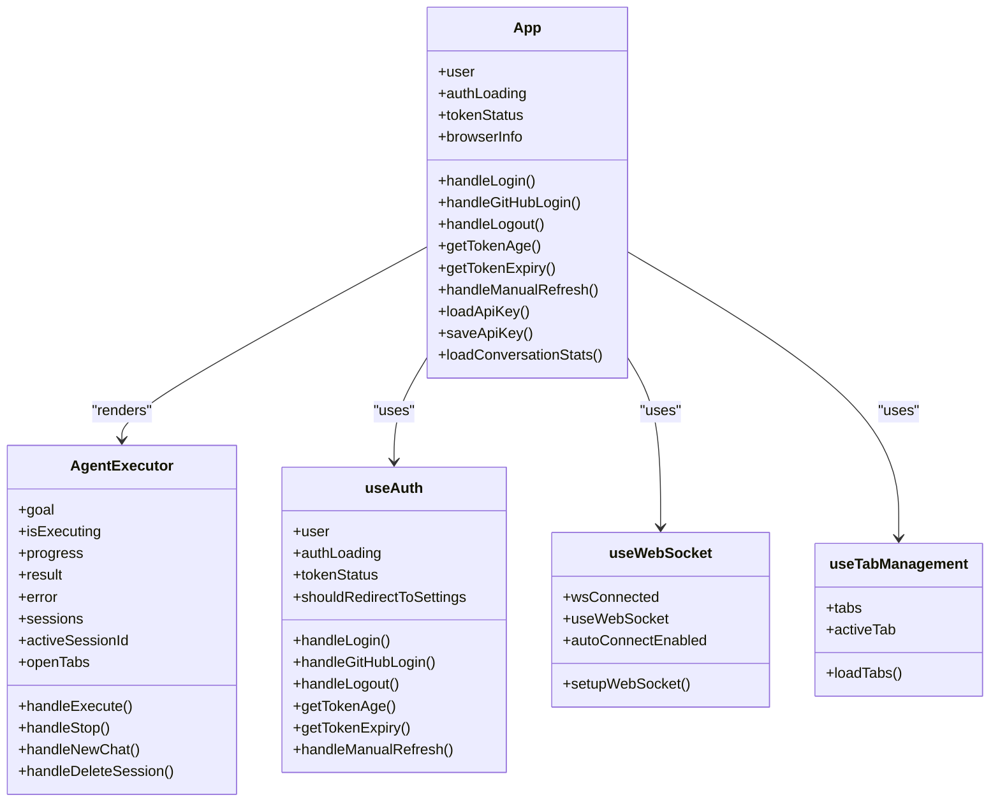
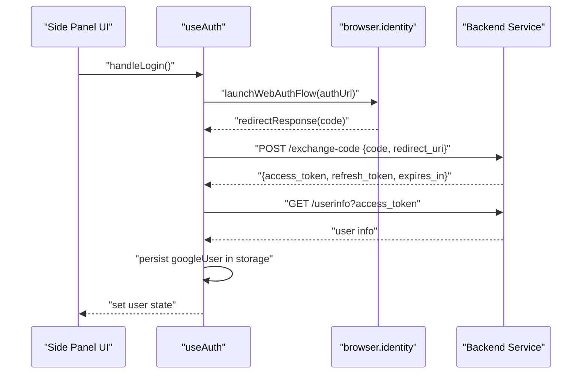
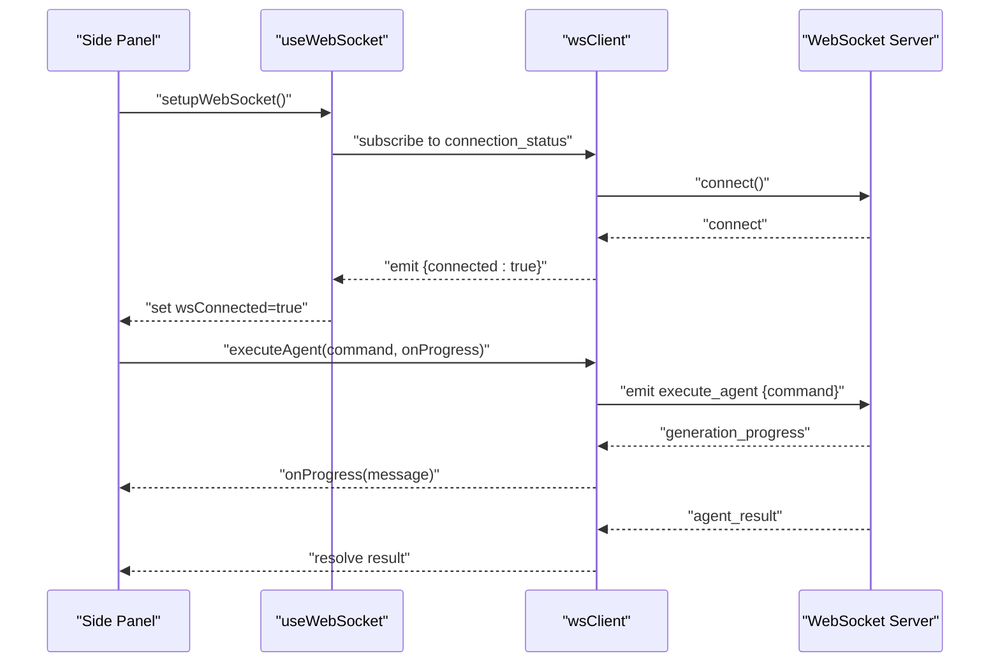
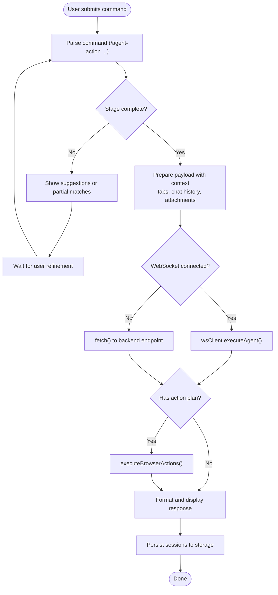
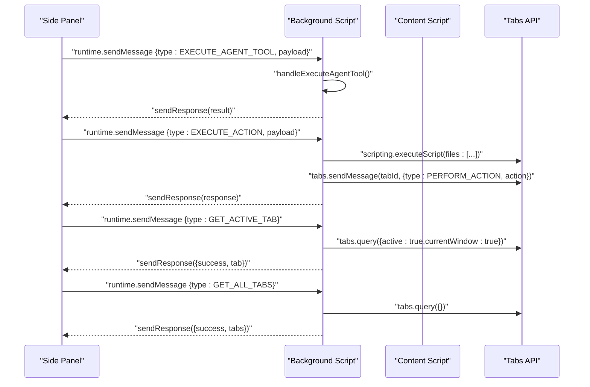
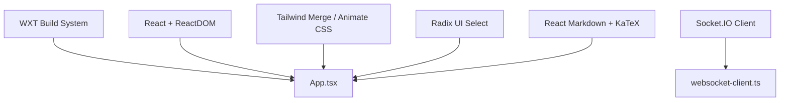

# Browser Extension Architecture

<cite>
**Referenced Files in This Document**
- [wxt.config.ts](file://extension/wxt.config.ts)
- [package.json](file://extension/package.json)
- [tsconfig.json](file://extension/tsconfig.json)
- [background.ts](file://extension/entrypoints/background.ts)
- [content.ts](file://extension/entrypoints/content.ts)
- [index.tsx](file://extension/entrypoints/sidepanel/index.tsx)
- [main.tsx](file://extension/entrypoints/sidepanel/main.tsx)
- [App.tsx](file://extension/entrypoints/sidepanel/App.tsx)
- [AgentExecutor.tsx](file://extension/entrypoints/sidepanel/AgentExecutor.tsx)
- [useAuth.ts](file://extension/entrypoints/sidepanel/hooks/useAuth.ts)
- [useWebSocket.ts](file://extension/entrypoints/sidepanel/hooks/useWebSocket.ts)
- [useTabManagement.ts](file://extension/entrypoints/sidepanel/hooks/useTabManagement.ts)
- [websocket-client.ts](file://extension/entrypoints/utils/websocket-client.ts)
- [executeAgent.ts](file://extension/entrypoints/utils/executeAgent.ts)
- [executeActions.ts](file://extension/entrypoints/utils/executeActions.ts)
- [parseAgentCommand.ts](file://extension/entrypoints/utils/parseAgentCommand.ts)
</cite>

## Table of Contents
1. [Introduction](#introduction)
2. [Project Structure](#project-structure)
3. [Core Components](#core-components)
4. [Architecture Overview](#architecture-overview)
5. [Detailed Component Analysis](#detailed-component-analysis)
6. [Dependency Analysis](#dependency-analysis)
7. [Performance Considerations](#performance-considerations)
8. [Troubleshooting Guide](#troubleshooting-guide)
9. [Conclusion](#conclusion)
10. [Appendices](#appendices)

## Introduction
This document explains the browser extension architecture built with WXT and React. It covers the side panel UI, background script functionality, content script integration, and the messaging system between extension components. It documents the WXT configuration, component hierarchy in the side panel, and how the extension communicates with the backend through WebSocket connections. It also includes examples of lifecycle management, permission handling, cross-origin communication, the agent executor pattern, real-time conversation display, and authentication flow. Finally, it addresses browser compatibility, packaging, and deployment strategies, along with component composition patterns and integration with browser APIs.

## Project Structure
The extension is organized into entrypoints for background, content, and side panel, plus shared utilities and hooks. WXT manages build, manifest generation, and browser-specific targets.

**Diagram sources**
- [wxt.config.ts](file://extension/wxt.config.ts#L1-L29)
- [package.json](file://extension/package.json#L1-L40)
- [tsconfig.json](file://extension/tsconfig.json#L1-L13)
- [background.ts](file://extension/entrypoints/background.ts#L1-L1642)
- [content.ts](file://extension/entrypoints/content.ts#L1-L326)
- [index.tsx](file://extension/entrypoints/sidepanel/index.tsx#L1-L26)
- [main.tsx](file://extension/entrypoints/sidepanel/main.tsx#L1-L10)
- [App.tsx](file://extension/entrypoints/sidepanel/App.tsx#L1-L200)
- [AgentExecutor.tsx](file://extension/entrypoints/sidepanel/AgentExecutor.tsx#L1-L800)
- [websocket-client.ts](file://extension/entrypoints/utils/websocket-client.ts#L1-L133)
- [executeAgent.ts](file://extension/entrypoints/utils/executeAgent.ts#L1-L299)
- [executeActions.ts](file://extension/entrypoints/utils/executeActions.ts#L1-L57)
- [parseAgentCommand.ts](file://extension/entrypoints/utils/parseAgentCommand.ts#L1-L86)
- [useAuth.ts](file://extension/entrypoints/sidepanel/hooks/useAuth.ts#L1-L311)
- [useWebSocket.ts](file://extension/entrypoints/sidepanel/hooks/useWebSocket.ts#L1-L49)
- [useTabManagement.ts](file://extension/entrypoints/sidepanel/hooks/useTabManagement.ts#L1-L94)

**Section sources**
- [wxt.config.ts](file://extension/wxt.config.ts#L1-L29)
- [package.json](file://extension/package.json#L1-L40)
- [tsconfig.json](file://extension/tsconfig.json#L1-L13)

## Core Components
- Side Panel (React): Hosted inside a shadow root UI, renders the main app, manages authentication, WebSocket connectivity, tab management, and the agent executor.
- Background Script: Handles cross-tab messaging, executes agent tools, performs browser-level actions, and manages Gemini requests.
- Content Script: Injects UI overlays and performs page-level actions when instructed by the background script.
- Messaging System: Uses browser runtime messaging for background ↔ side panel and background ↔ content script communication.
- WebSocket Client: Provides a minimal client for real-time agent execution updates and statistics retrieval.
- Utilities: Command parsing, agent execution, and browser action execution.

**Section sources**
- [index.tsx](file://extension/entrypoints/sidepanel/index.tsx#L1-L26)
- [main.tsx](file://extension/entrypoints/sidepanel/main.tsx#L1-L10)
- [App.tsx](file://extension/entrypoints/sidepanel/App.tsx#L1-L200)
- [AgentExecutor.tsx](file://extension/entrypoints/sidepanel/AgentExecutor.tsx#L1-L800)
- [background.ts](file://extension/entrypoints/background.ts#L1-L1642)
- [content.ts](file://extension/entrypoints/content.ts#L1-L326)
- [websocket-client.ts](file://extension/entrypoints/utils/websocket-client.ts#L1-L133)
- [executeAgent.ts](file://extension/entrypoints/utils/executeAgent.ts#L1-L299)
- [executeActions.ts](file://extension/entrypoints/utils/executeActions.ts#L1-L57)
- [parseAgentCommand.ts](file://extension/entrypoints/utils/parseAgentCommand.ts#L1-L86)

## Architecture Overview
The extension follows a layered architecture:
- UI Layer: Side panel React app with hooks for auth, WebSocket, and tab management.
- Control Layer: Side panel orchestrates agent execution and displays progress.
- Communication Layer: WebSocket client for real-time updates; browser messaging for background ↔ side panel and background ↔ content script.
- Execution Layer: Background script handles browser APIs and dispatches actions; content script executes DOM-level actions.

**Diagram sources**
- [background.ts](file://extension/entrypoints/background.ts#L1-L1642)
- [content.ts](file://extension/entrypoints/content.ts#L1-L326)
- [websocket-client.ts](file://extension/entrypoints/utils/websocket-client.ts#L1-L133)
- [App.tsx](file://extension/entrypoints/sidepanel/App.tsx#L1-L200)

## Detailed Component Analysis

### Side Panel React Application
The side panel is a React app mounted inside a shadow root UI. It initializes the app, sets up authentication, WebSocket connectivity, and tab management. It renders the agent executor and unified settings menu.

**Diagram sources**
- [App.tsx](file://extension/entrypoints/sidepanel/App.tsx#L1-L200)
- [AgentExecutor.tsx](file://extension/entrypoints/sidepanel/AgentExecutor.tsx#L1-L800)
- [useAuth.ts](file://extension/entrypoints/sidepanel/hooks/useAuth.ts#L1-L311)
- [useWebSocket.ts](file://extension/entrypoints/sidepanel/hooks/useWebSocket.ts#L1-L49)
- [useTabManagement.ts](file://extension/entrypoints/sidepanel/hooks/useTabManagement.ts#L1-L94)

**Section sources**
- [index.tsx](file://extension/entrypoints/sidepanel/index.tsx#L1-L26)
- [main.tsx](file://extension/entrypoints/sidepanel/main.tsx#L1-L10)
- [App.tsx](file://extension/entrypoints/sidepanel/App.tsx#L1-L200)

### Authentication Flow
The authentication hook integrates with browser identity and a backend service to exchange OAuth codes for tokens, persist user data, and manage token refresh. It supports both Google OAuth and a demo GitHub flow.

**Diagram sources**
- [useAuth.ts](file://extension/entrypoints/sidepanel/hooks/useAuth.ts#L128-L208)

**Section sources**
- [useAuth.ts](file://extension/entrypoints/sidepanel/hooks/useAuth.ts#L1-L311)

### WebSocket Integration and Real-Time Updates
The WebSocket client encapsulates connection management, event emission, and agent execution. The side panel hook subscribes to connection status and progress updates, displaying real-time feedback.

**Diagram sources**
- [websocket-client.ts](file://extension/entrypoints/utils/websocket-client.ts#L1-L133)
- [useWebSocket.ts](file://extension/entrypoints/sidepanel/hooks/useWebSocket.ts#L1-L49)
- [AgentExecutor.tsx](file://extension/entrypoints/sidepanel/AgentExecutor.tsx#L456-L478)

**Section sources**
- [websocket-client.ts](file://extension/entrypoints/utils/websocket-client.ts#L1-L133)
- [useWebSocket.ts](file://extension/entrypoints/sidepanel/hooks/useWebSocket.ts#L1-L49)
- [AgentExecutor.tsx](file://extension/entrypoints/sidepanel/AgentExecutor.tsx#L456-L478)

### Agent Executor Pattern and Action Execution
The agent executor parses slash commands, executes agents either via WebSocket or HTTP, and triggers browser actions. It maintains chat sessions and displays formatted responses.

**Diagram sources**
- [AgentExecutor.tsx](file://extension/entrypoints/sidepanel/AgentExecutor.tsx#L323-L516)
- [parseAgentCommand.ts](file://extension/entrypoints/utils/parseAgentCommand.ts#L1-L86)
- [executeAgent.ts](file://extension/entrypoints/utils/executeAgent.ts#L1-L299)
- [executeActions.ts](file://extension/entrypoints/utils/executeActions.ts#L1-L57)

**Section sources**
- [AgentExecutor.tsx](file://extension/entrypoints/sidepanel/AgentExecutor.tsx#L1-L800)
- [parseAgentCommand.ts](file://extension/entrypoints/utils/parseAgentCommand.ts#L1-L86)
- [executeAgent.ts](file://extension/entrypoints/utils/executeAgent.ts#L1-L299)
- [executeActions.ts](file://extension/entrypoints/utils/executeActions.ts#L1-L57)

### Background Script Functionality and Messaging
The background script listens for messages from the side panel and content script, executes agent tools, manages tabs, and performs browser-level actions. It injects content scripts and coordinates cross-tab communication.

**Diagram sources**
- [background.ts](file://extension/entrypoints/background.ts#L24-L128)
- [background.ts](file://extension/entrypoints/background.ts#L428-L449)
- [background.ts](file://extension/entrypoints/background.ts#L407-L426)

**Section sources**
- [background.ts](file://extension/entrypoints/background.ts#L1-L1642)

### Content Script Integration
The content script runs on all URLs and can be extended to perform page-level actions. It listens for messages from the background script and executes DOM operations.

**Section sources**
- [content.ts](file://extension/entrypoints/content.ts#L1-L326)

## Dependency Analysis
The extension relies on WXT for build and manifest generation, React for UI, and Socket.IO for real-time communication. Dependencies are declared in package.json and TypeScript configuration extends WXT’s generated tsconfig.

**Diagram sources**
- [package.json](file://extension/package.json#L17-L39)
- [App.tsx](file://extension/entrypoints/sidepanel/App.tsx#L1-L200)
- [websocket-client.ts](file://extension/entrypoints/utils/websocket-client.ts#L1-L133)

**Section sources**
- [package.json](file://extension/package.json#L1-L40)
- [tsconfig.json](file://extension/tsconfig.json#L1-L13)

## Performance Considerations
- Debounce or throttle frequent UI updates (e.g., tab list refresh) to reduce re-renders.
- Batch browser API calls (tabs.query, scripting.executeScript) and cache results where appropriate.
- Use lazy loading for heavy components and defer non-critical computations.
- Limit DOM extraction sizes (e.g., HTML capture) and apply timeouts to prevent long-running operations.
- Prefer polling fallbacks for stats retrieval when WebSocket is unavailable.

## Troubleshooting Guide
Common issues and resolutions:
- WebSocket not connecting: Verify VITE_API_URL and server availability; check connection events and fallback to HTTP stats.
- Authentication failures: Ensure backend is running and identity API is available; confirm OAuth redirect URI and scopes.
- Content script injection errors: Confirm permissions and that the content script path is correct; verify target tab exists.
- Tab management inconsistencies: Ensure listeners are registered/unregistered on mount/unmount; use query results before acting.
- Cross-origin limitations: Use host_permissions and appropriate permissions; avoid unsafe inline styles in injected UI.

**Section sources**
- [websocket-client.ts](file://extension/entrypoints/utils/websocket-client.ts#L1-L133)
- [useAuth.ts](file://extension/entrypoints/sidepanel/hooks/useAuth.ts#L1-L311)
- [background.ts](file://extension/entrypoints/background.ts#L1-L1642)
- [useTabManagement.ts](file://extension/entrypoints/sidepanel/hooks/useTabManagement.ts#L1-L94)

## Conclusion
The extension architecture cleanly separates concerns across UI, messaging, execution, and communication layers. The React-based side panel provides a modern interface with robust authentication and real-time updates via WebSocket. The background script centralizes browser API interactions and action orchestration, while the content script handles page-level operations. With proper permission handling, lifecycle management, and cross-origin considerations, the extension is ready for production deployment across browsers.

## Appendices

### WXT Configuration and Permissions
- Manifest permissions include activeTab, tabs, storage, scripting, identity, sidePanel, webNavigation, webRequest, cookies, bookmarks, history, clipboard, notifications, contextMenus, downloads.
- Host permissions grant access to all URLs.
- Scripts support development and build targets for Chrome and Firefox.

**Section sources**
- [wxt.config.ts](file://extension/wxt.config.ts#L1-L29)
- [package.json](file://extension/package.json#L7-L16)

### Browser Compatibility and Packaging
- Use WXT scripts to build and package for Chrome and Firefox.
- Shadow DOM UI ensures isolation and compatibility across pages.
- Feature detection for browser APIs (e.g., speech recognition) prevents runtime errors.

**Section sources**
- [package.json](file://extension/package.json#L7-L16)
- [index.tsx](file://extension/entrypoints/sidepanel/index.tsx#L1-L26)
- [AgentExecutor.tsx](file://extension/entrypoints/sidepanel/AgentExecutor.tsx#L592-L617)

### Cross-Origin Communication
- Use host_permissions for broad access.
- For OAuth, rely on browser.identity and secure redirects.
- For backend communication, configure CORS and environment variables for API base URL.

**Section sources**
- [wxt.config.ts](file://extension/wxt.config.ts#L26-L26)
- [useAuth.ts](file://extension/entrypoints/sidepanel/hooks/useAuth.ts#L131-L150)
- [websocket-client.ts](file://extension/entrypoints/utils/websocket-client.ts#L6-L6)