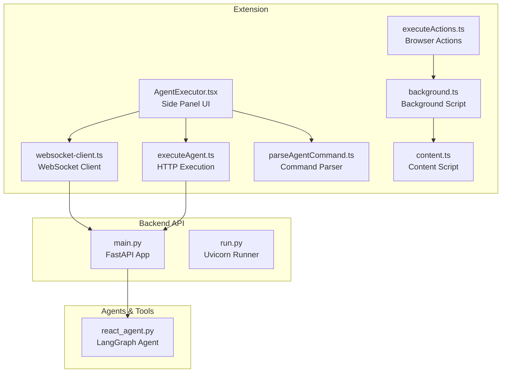
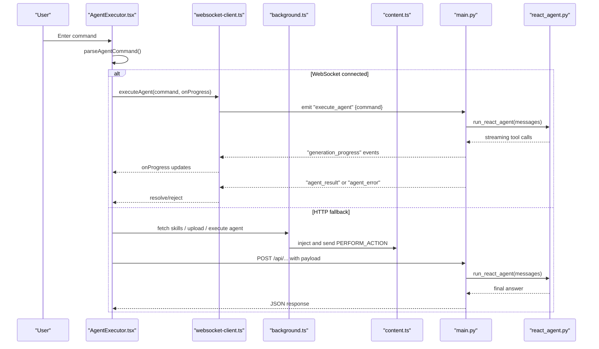
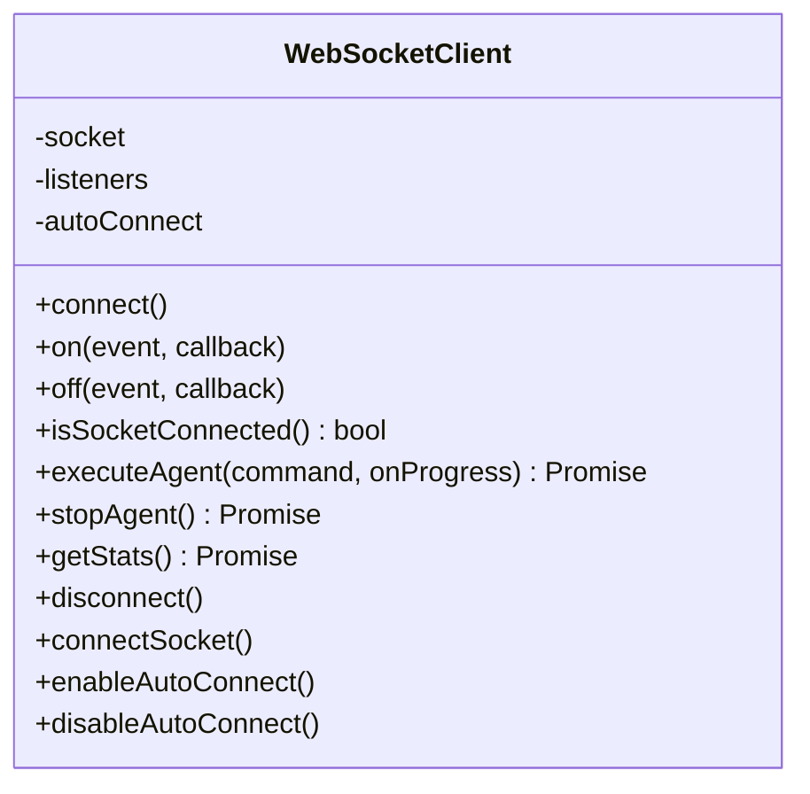
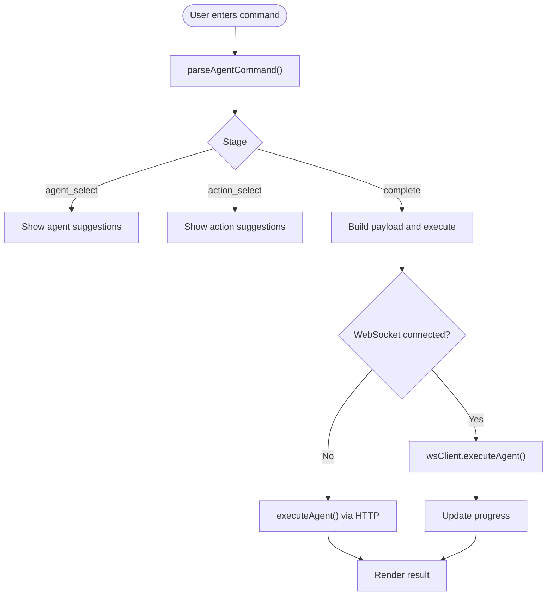
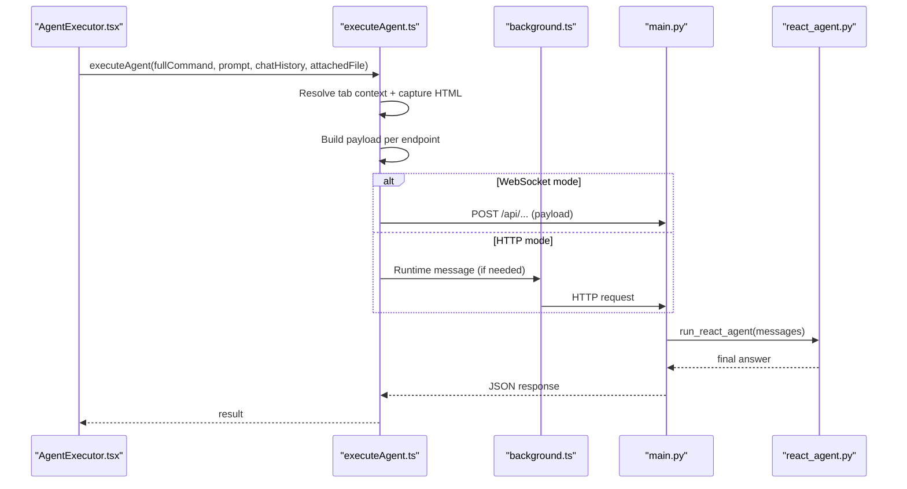
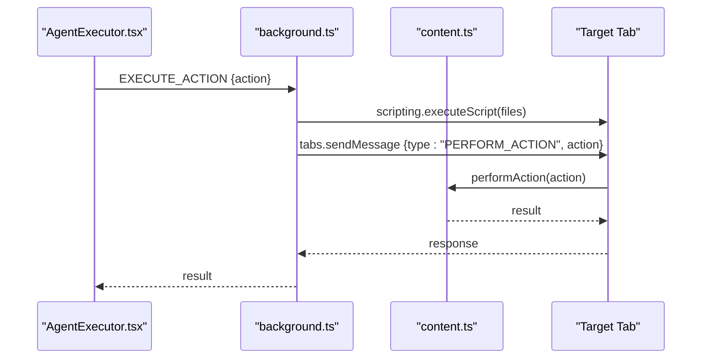
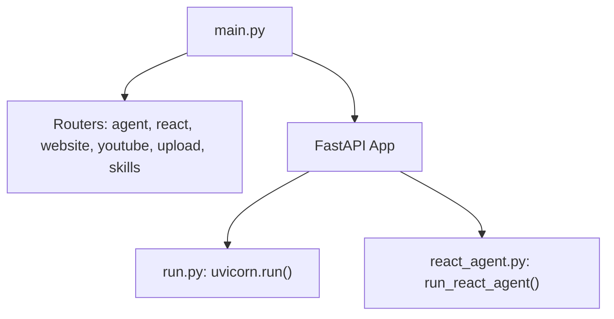
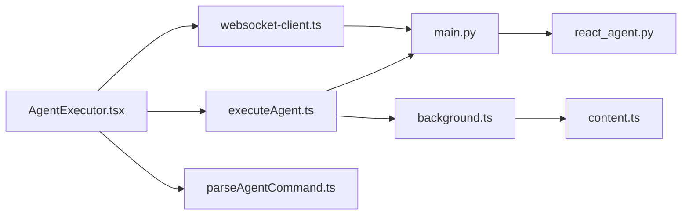

# Component Interactions and Data Flow

<cite>
**Referenced Files in This Document**
- [websocket-client.ts](file://extension/entrypoints/utils/websocket-client.ts)
- [useWebSocket.ts](file://extension/entrypoints/sidepanel/hooks/useWebSocket.ts)
- [AgentExecutor.tsx](file://extension/entrypoints/sidepanel/AgentExecutor.tsx)
- [background.ts](file://extension/entrypoints/background.ts)
- [content.ts](file://extension/entrypoints/content.ts)
- [executeAgent.ts](file://extension/entrypoints/utils/executeAgent.ts)
- [executeActions.ts](file://extension/entrypoints/utils/executeActions.ts)
- [parseAgentCommand.ts](file://extension/entrypoints/utils/parseAgentCommand.ts)
- [react_agent.py](file://agents/react_agent.py)
- [main.py](file://api/main.py)
- [run.py](file://api/run.py)
</cite>

## Table of Contents
1. [Introduction](#introduction)
2. [Project Structure](#project-structure)
3. [Core Components](#core-components)
4. [Architecture Overview](#architecture-overview)
5. [Detailed Component Analysis](#detailed-component-analysis)
6. [Dependency Analysis](#dependency-analysis)
7. [Performance Considerations](#performance-considerations)
8. [Troubleshooting Guide](#troubleshooting-guide)
9. [Conclusion](#conclusion)

## Introduction
This document explains how the browser extension, backend API, MCP server, and external services interact to deliver a seamless agentic browsing experience. It focuses on:
- Communication patterns between the React UI, background/content scripts, WebSocket client, backend API, and external services
- Real-time data synchronization via WebSocket and HTTP fallback
- Asynchronous flows for agent execution, tool invocation, and browser automation
- Error propagation, state management, and consistency across components
- Performance, caching, and fault tolerance strategies

## Project Structure
The system is organized into:
- Extension (React UI, background script, content script, WebSocket client, utilities)
- Backend API (FastAPI app, routers, services, models)
- Agents and tools (LangGraph-based React agent, tool registry)
- MCP server (external service integration)

**Diagram sources**
- [AgentExecutor.tsx](file://extension/entrypoints/sidepanel/AgentExecutor.tsx#L1-L120)
- [websocket-client.ts](file://extension/entrypoints/utils/websocket-client.ts#L1-L60)
- [background.ts](file://extension/entrypoints/background.ts#L1-L128)
- [content.ts](file://extension/entrypoints/content.ts#L1-L60)
- [executeAgent.ts](file://extension/entrypoints/utils/executeAgent.ts#L1-L60)
- [executeActions.ts](file://extension/entrypoints/utils/executeActions.ts#L1-L40)
- [parseAgentCommand.ts](file://extension/entrypoints/utils/parseAgentCommand.ts#L1-L40)
- [main.py](file://api/main.py#L1-L48)
- [run.py](file://api/run.py#L1-L15)
- [react_agent.py](file://agents/react_agent.py#L1-L60)

**Section sources**
- [AgentExecutor.tsx](file://extension/entrypoints/sidepanel/AgentExecutor.tsx#L1-L120)
- [websocket-client.ts](file://extension/entrypoints/utils/websocket-client.ts#L1-L60)
- [background.ts](file://extension/entrypoints/background.ts#L1-L128)
- [content.ts](file://extension/entrypoints/content.ts#L1-L60)
- [executeAgent.ts](file://extension/entrypoints/utils/executeAgent.ts#L1-L60)
- [executeActions.ts](file://extension/entrypoints/utils/executeActions.ts#L1-L40)
- [parseAgentCommand.ts](file://extension/entrypoints/utils/parseAgentCommand.ts#L1-L40)
- [main.py](file://api/main.py#L1-L48)
- [run.py](file://api/run.py#L1-L15)
- [react_agent.py](file://agents/react_agent.py#L1-L60)

## Core Components
- WebSocket client encapsulates connection lifecycle, event handling, and agent execution over WebSocket with automatic reconnection.
- Side panel UI manages user input, command parsing, progress updates, and browser storage-backed sessions.
- Background script handles cross-tab automation, content script injection, and runtime messaging.
- Content script provides page context and executes DOM-level actions.
- HTTP execution utility builds payloads, captures page context, and invokes backend endpoints.
- Backend API exposes routers for agents, tools, and services; runs on Uvicorn.
- React agent orchestrates LLM reasoning and tool execution via LangGraph.

**Section sources**
- [websocket-client.ts](file://extension/entrypoints/utils/websocket-client.ts#L1-L133)
- [AgentExecutor.tsx](file://extension/entrypoints/sidepanel/AgentExecutor.tsx#L1-L120)
- [background.ts](file://extension/entrypoints/background.ts#L164-L539)
- [content.ts](file://extension/entrypoints/content.ts#L197-L213)
- [executeAgent.ts](file://extension/entrypoints/utils/executeAgent.ts#L17-L120)
- [main.py](file://api/main.py#L12-L48)
- [react_agent.py](file://agents/react_agent.py#L138-L191)

## Architecture Overview
The system supports two primary execution modes:
- Real-time via WebSocket: UI emits commands; backend streams progress and returns results.
- HTTP fallback: UI sends commands via HTTP; backend responds with completion.

**Diagram sources**
- [AgentExecutor.tsx](file://extension/entrypoints/sidepanel/AgentExecutor.tsx#L323-L516)
- [websocket-client.ts](file://extension/entrypoints/utils/websocket-client.ts#L61-L91)
- [background.ts](file://extension/entrypoints/background.ts#L24-L128)
- [content.ts](file://extension/entrypoints/content.ts#L197-L213)
- [main.py](file://api/main.py#L14-L42)
- [react_agent.py](file://agents/react_agent.py#L183-L191)

## Detailed Component Analysis

### WebSocket Client and Real-Time Execution
- Establishes persistent connections with automatic reconnection and transport fallback.
- Emits connection status and generation progress events.
- Provides executeAgent, stopAgent, and stats APIs with timeouts and cleanup.

**Diagram sources**
- [websocket-client.ts](file://extension/entrypoints/utils/websocket-client.ts#L8-L133)

**Section sources**
- [websocket-client.ts](file://extension/entrypoints/utils/websocket-client.ts#L17-L108)
- [useWebSocket.ts](file://extension/entrypoints/sidepanel/hooks/useWebSocket.ts#L1-L49)

### Side Panel UI and Command Parsing
- Parses slash commands into agent/action endpoints and validates availability.
- Manages sessions, voice input, file attachments, and mention menus.
- Streams progress updates and renders Markdown responses.

**Diagram sources**
- [parseAgentCommand.ts](file://extension/entrypoints/utils/parseAgentCommand.ts#L5-L86)
- [AgentExecutor.tsx](file://extension/entrypoints/sidepanel/AgentExecutor.tsx#L323-L516)

**Section sources**
- [AgentExecutor.tsx](file://extension/entrypoints/sidepanel/AgentExecutor.tsx#L323-L516)
- [parseAgentCommand.ts](file://extension/entrypoints/utils/parseAgentCommand.ts#L5-L86)

### HTTP Execution Pipeline
- Resolves active or mentioned tab context, captures client HTML, normalizes URLs, and constructs payloads.
- Supports special endpoints (React agent, YouTube, website, GitHub, PyJIIT, skills).
- Uses GET/POST based on endpoint and returns structured responses.

**Diagram sources**
- [executeAgent.ts](file://extension/entrypoints/utils/executeAgent.ts#L17-L317)
- [background.ts](file://extension/entrypoints/background.ts#L24-L128)
- [main.py](file://api/main.py#L14-L42)
- [react_agent.py](file://agents/react_agent.py#L183-L191)

**Section sources**
- [executeAgent.ts](file://extension/entrypoints/utils/executeAgent.ts#L96-L127)
- [executeAgent.ts](file://extension/entrypoints/utils/executeAgent.ts#L128-L168)
- [executeAgent.ts](file://extension/entrypoints/utils/executeAgent.ts#L288-L317)

### Browser Automation and Content Scripts
- Background script injects content scripts and routes actions to active tabs.
- Content script performs DOM-level actions (click, type, scroll) and page info extraction.
- Action executor translates agent action plans into tab messages.

**Diagram sources**
- [background.ts](file://extension/entrypoints/background.ts#L428-L449)
- [background.ts](file://extension/entrypoints/background.ts#L541-L800)
- [content.ts](file://extension/entrypoints/content.ts#L220-L323)
- [executeActions.ts](file://extension/entrypoints/utils/executeActions.ts#L1-L57)

**Section sources**
- [background.ts](file://extension/entrypoints/background.ts#L428-L514)
- [content.ts](file://extension/entrypoints/content.ts#L220-L323)
- [executeActions.ts](file://extension/entrypoints/utils/executeActions.ts#L1-L57)

### Backend API and Agent Orchestration
- FastAPI app aggregates routers for agents, tools, and services.
- Uvicorn runner starts the server on a configurable host/port.
- React agent compiles a LangGraph workflow and executes tool calls asynchronously.

**Diagram sources**
- [main.py](file://api/main.py#L14-L42)
- [run.py](file://api/run.py#L4-L10)
- [react_agent.py](file://agents/react_agent.py#L138-L191)

**Section sources**
- [main.py](file://api/main.py#L12-L48)
- [run.py](file://api/run.py#L4-L10)
- [react_agent.py](file://agents/react_agent.py#L138-L191)

## Dependency Analysis
- UI depends on WebSocket client and HTTP execution utility.
- Background script depends on content script and browser APIs.
- HTTP execution utility depends on browser storage, tabs, and scripting APIs.
- Backend API depends on routers and the React agent.
- React agent depends on LLM and tool registry.

**Diagram sources**
- [AgentExecutor.tsx](file://extension/entrypoints/sidepanel/AgentExecutor.tsx#L30-L34)
- [websocket-client.ts](file://extension/entrypoints/utils/websocket-client.ts#L1-L20)
- [executeAgent.ts](file://extension/entrypoints/utils/executeAgent.ts#L1-L40)
- [background.ts](file://extension/entrypoints/background.ts#L1-L20)
- [content.ts](file://extension/entrypoints/content.ts#L1-L10)
- [main.py](file://api/main.py#L14-L42)
- [react_agent.py](file://agents/react_agent.py#L1-L25)

**Section sources**
- [AgentExecutor.tsx](file://extension/entrypoints/sidepanel/AgentExecutor.tsx#L30-L34)
- [websocket-client.ts](file://extension/entrypoints/utils/websocket-client.ts#L1-L20)
- [executeAgent.ts](file://extension/entrypoints/utils/executeAgent.ts#L1-L40)
- [background.ts](file://extension/entrypoints/background.ts#L1-L20)
- [content.ts](file://extension/entrypoints/content.ts#L1-L10)
- [main.py](file://api/main.py#L14-L42)
- [react_agent.py](file://agents/react_agent.py#L1-L25)

## Performance Considerations
- WebSocket streaming reduces latency for long-running agent executions; HTTP fallback ensures reliability when WebSocket is unavailable.
- Payload construction captures minimal client HTML and limits DOM introspection to reduce overhead.
- Action executor introduces small delays between actions to prevent race conditions and improve stability.
- Caching: React agent graph is cached via LRU to avoid recompilation costs.
- Recommendations:
  - Prefer WebSocket for interactive sessions; degrade gracefully to HTTP.
  - Limit DOM capture size and scope; avoid unnecessary reflows.
  - Batch browser actions and debounce UI updates.

[No sources needed since this section provides general guidance]

## Troubleshooting Guide
- WebSocket connectivity:
  - Monitor connection_status events and fallback to HTTP when disconnected.
  - Use getStats with timeout to detect backend responsiveness.
- Command parsing:
  - Ensure slash commands are complete; partial suggestions guide users.
- Browser automation:
  - Verify content script injection and tab permissions.
  - Handle unknown action types and timeouts during navigation/reload.
- HTTP errors:
  - Normalize error messages for rate limits, gateway errors, and service unavailability.
- Storage and sessions:
  - Persist sessions in browser storage; migrate legacy chat history if needed.

**Section sources**
- [useWebSocket.ts](file://extension/entrypoints/sidepanel/hooks/useWebSocket.ts#L19-L45)
- [AgentExecutor.tsx](file://extension/entrypoints/sidepanel/AgentExecutor.tsx#L479-L515)
- [background.ts](file://extension/entrypoints/background.ts#L541-L800)
- [executeAgent.ts](file://extension/entrypoints/utils/executeAgent.ts#L288-L317)

## Conclusion
The system integrates a React-based UI, background/content scripts, WebSocket streaming, and a FastAPI backend with a LangGraph-powered agent. It balances real-time responsiveness with robust HTTP fallback, manages state across browser storage and UI components, and provides clear error propagation and recovery paths. By leveraging caching, minimal payload construction, and cautious automation, it maintains performance and reliability across distributed components.