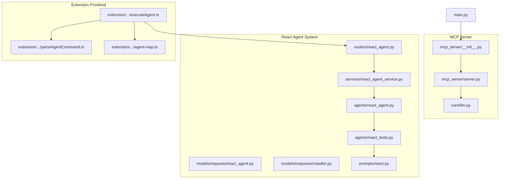
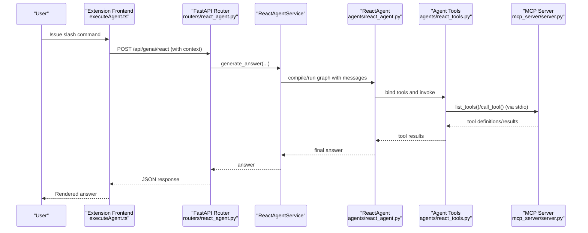
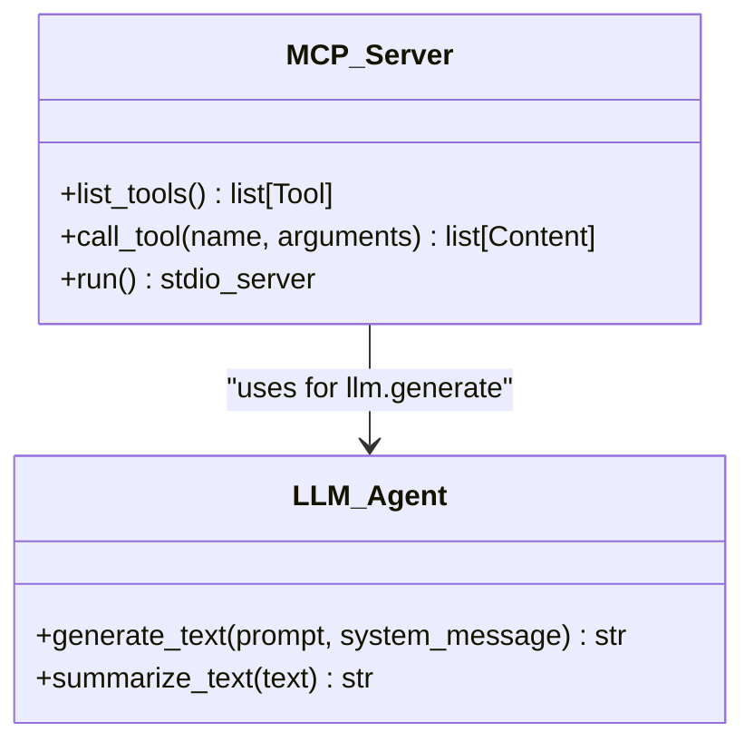
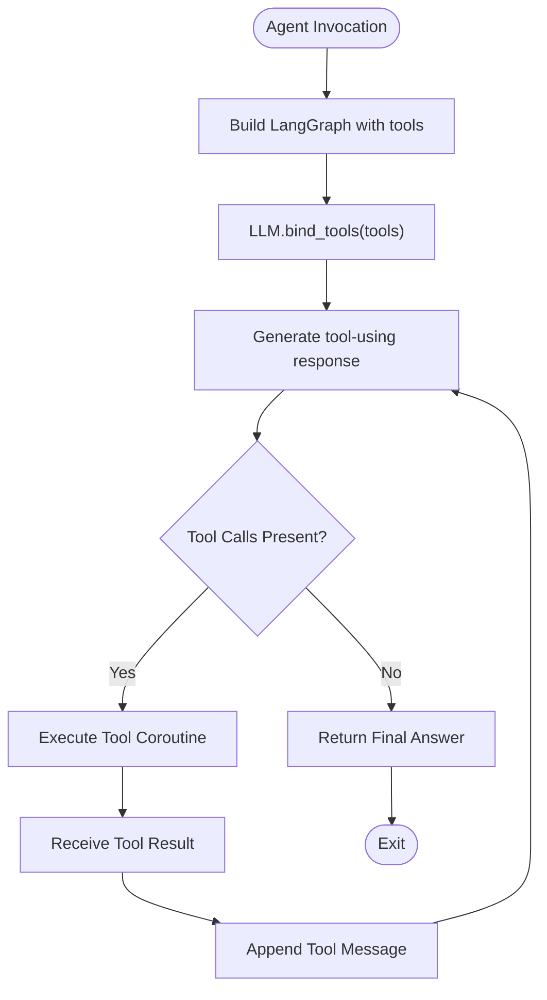
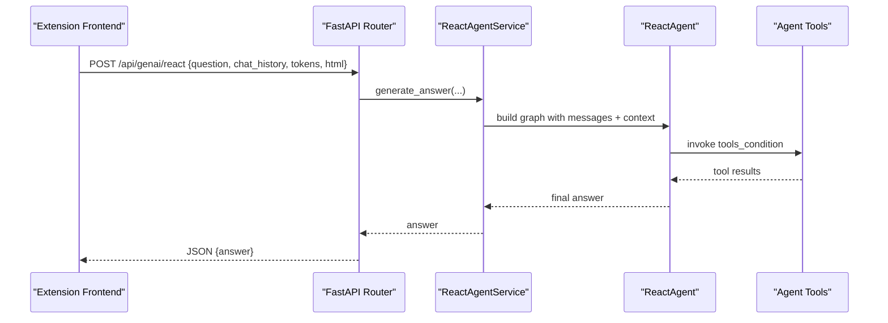
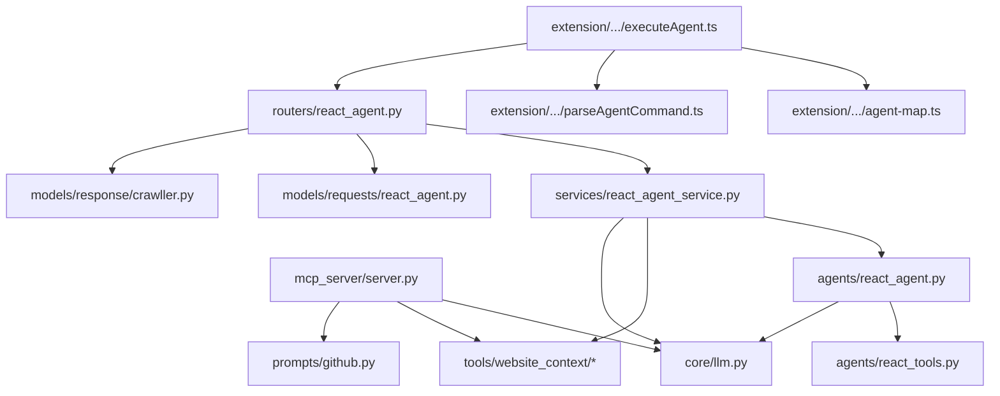

# MCP Protocol Implementation

<cite>
**Referenced Files in This Document**
- [main.py](file://main.py)
- [mcp_server/server.py](file://mcp_server/server.py)
- [mcp_server/__init__.py](file://mcp_server/__init__.py)
- [core/llm.py](file://core/llm.py)
- [agents/react_agent.py](file://agents/react_agent.py)
- [agents/react_tools.py](file://agents/react_tools.py)
- [services/react_agent_service.py](file://services/react_agent_service.py)
- [routers/react_agent.py](file://routers/react_agent.py)
- [models/requests/react_agent.py](file://models/requests/react_agent.py)
- [models/response/crawller.py](file://models/response/crawller.py)
- [prompts/react.py](file://prompts/react.py)
- [extension/entrypoints/utils/executeAgent.ts](file://extension/entrypoints/utils/executeAgent.ts)
- [extension/entrypoints/utils/parseAgentCommand.ts](file://extension/entrypoints/utils/parseAgentCommand.ts)
- [extension/entrypoints/sidepanel/lib/agent-map.ts](file://extension/entrypoints/sidepanel/lib/agent-map.ts)
</cite>

## Table of Contents
1. [Introduction](#introduction)
2. [Project Structure](#project-structure)
3. [Core Components](#core-components)
4. [Architecture Overview](#architecture-overview)
5. [Detailed Component Analysis](#detailed-component-analysis)
6. [Dependency Analysis](#dependency-analysis)
7. [Performance Considerations](#performance-considerations)
8. [Troubleshooting Guide](#troubleshooting-guide)
9. [Conclusion](#conclusion)
10. [Appendices](#appendices)

## Introduction
This document explains the Model Context Protocol (MCP) implementation in the Agentic Browser project. It covers the MCP server architecture, tool definition and registration patterns, and AI agent integration through the MCP protocol. It documents communication protocols, message formats, state management between the MCP server and AI agents, and provides concrete examples of tool registration, command execution, and response handling. It also explains how the MCP protocol enables standardized AI tool integration, the role of prompt engineering in tool descriptions, and the abstraction layer that allows multiple LLM providers. Protocol-specific error handling, retry mechanisms, and performance considerations are addressed, along with integration patterns with the React agent system and how MCP facilitates extensible tool development.

## Project Structure
The MCP implementation centers around a dedicated MCP server module that exposes tools via stdio, while the broader React agent system integrates with FastAPI routes and services. The extension front-end provides a command parser and executor that route commands to backend endpoints, which may leverage the MCP server depending on configuration.

**Diagram sources**
- [main.py](file://main.py#L1-L57)
- [mcp_server/__init__.py](file://mcp_server/__init__.py#L1-L2)
- [mcp_server/server.py](file://mcp_server/server.py#L1-L139)
- [core/llm.py](file://core/llm.py#L1-L215)
- [agents/react_agent.py](file://agents/react_agent.py#L1-L191)
- [agents/react_tools.py](file://agents/react_tools.py#L1-L721)
- [services/react_agent_service.py](file://services/react_agent_service.py#L1-L154)
- [routers/react_agent.py](file://routers/react_agent.py#L1-L57)
- [models/requests/react_agent.py](file://models/requests/react_agent.py#L1-L45)
- [models/response/crawller.py](file://models/response/crawller.py#L1-L6)
- [prompts/react.py](file://prompts/react.py#L1-L21)
- [extension/entrypoints/utils/executeAgent.ts](file://extension/entrypoints/utils/executeAgent.ts#L1-L299)
- [extension/entrypoints/utils/parseAgentCommand.ts](file://extension/entrypoints/utils/parseAgentCommand.ts#L1-L86)
- [extension/entrypoints/sidepanel/lib/agent-map.ts](file://extension/entrypoints/sidepanel/lib/agent-map.ts#L1-L80)

**Section sources**
- [main.py](file://main.py#L1-L57)
- [mcp_server/__init__.py](file://mcp_server/__init__.py#L1-L2)
- [mcp_server/server.py](file://mcp_server/server.py#L1-L139)
- [core/llm.py](file://core/llm.py#L1-L215)
- [agents/react_agent.py](file://agents/react_agent.py#L1-L191)
- [agents/react_tools.py](file://agents/react_tools.py#L1-L721)
- [services/react_agent_service.py](file://services/react_agent_service.py#L1-L154)
- [routers/react_agent.py](file://routers/react_agent.py#L1-L57)
- [models/requests/react_agent.py](file://models/requests/react_agent.py#L1-L45)
- [models/response/crawller.py](file://models/response/crawller.py#L1-L6)
- [prompts/react.py](file://prompts/react.py#L1-L21)
- [extension/entrypoints/utils/executeAgent.ts](file://extension/entrypoints/utils/executeAgent.ts#L1-L299)
- [extension/entrypoints/utils/parseAgentCommand.ts](file://extension/entrypoints/utils/parseAgentCommand.ts#L1-L86)
- [extension/entrypoints/sidepanel/lib/agent-map.ts](file://extension/entrypoints/sidepanel/lib/agent-map.ts#L1-L80)

## Core Components
- MCP Server: Exposes a list of tools and executes tool calls via stdio. Tools include text generation with configurable providers, GitHub Q&A, website content fetching and conversion, and HTML-to-markdown conversion.
- LLM Abstraction: Provides a unified interface across multiple LLM providers (Google, OpenAI, Anthropic, Ollama, DeepSeek, OpenRouter) with environment-driven configuration.
- React Agent System: Implements a LangGraph-based agent with structured tools, stateful message handling, and tool invocation.
- FastAPI Router and Service: Routes React agent requests to a service that orchestrates tool usage and LLM interactions.
- Extension Frontend: Parses slash commands, resolves endpoints, and posts payloads to backend APIs.

**Section sources**
- [mcp_server/server.py](file://mcp_server/server.py#L13-L139)
- [core/llm.py](file://core/llm.py#L21-L170)
- [agents/react_agent.py](file://agents/react_agent.py#L138-L191)
- [agents/react_tools.py](file://agents/react_tools.py#L524-L721)
- [services/react_agent_service.py](file://services/react_agent_service.py#L16-L154)
- [routers/react_agent.py](file://routers/react_agent.py#L14-L57)
- [extension/entrypoints/utils/executeAgent.ts](file://extension/entrypoints/utils/executeAgent.ts#L17-L299)

## Architecture Overview
The MCP server runs independently and communicates with clients via stdio. The React agent system is exposed via FastAPI endpoints and uses the MCP server’s tool definitions to provide standardized tool capabilities. The extension front-end parses user commands and dispatches them to appropriate endpoints, optionally including context such as active tab HTML.

**Diagram sources**
- [extension/entrypoints/utils/executeAgent.ts](file://extension/entrypoints/utils/executeAgent.ts#L17-L299)
- [routers/react_agent.py](file://routers/react_agent.py#L18-L57)
- [services/react_agent_service.py](file://services/react_agent_service.py#L17-L154)
- [agents/react_agent.py](file://agents/react_agent.py#L123-L191)
- [agents/react_tools.py](file://agents/react_tools.py#L524-L721)
- [mcp_server/server.py](file://mcp_server/server.py#L16-L139)

## Detailed Component Analysis

### MCP Server Architecture
The MCP server defines tools and handles tool invocations over stdio. It supports:
- Text generation via a configurable LLM provider
- GitHub repository Q&A
- Website content fetching and HTML-to-markdown conversion
- Tool discovery and execution

**Diagram sources**
- [mcp_server/server.py](file://mcp_server/server.py#L16-L139)
- [core/llm.py](file://core/llm.py#L78-L191)

**Section sources**
- [mcp_server/server.py](file://mcp_server/server.py#L13-L139)
- [core/llm.py](file://core/llm.py#L21-L170)

### Tool Definition and Registration Patterns
- Tool definitions specify name, description, and JSON Schema input validation.
- Tool registration occurs implicitly via decorators on the MCP server.
- Tool execution routes arguments to internal handlers and returns text content.

Concrete examples of tool registration and execution:
- llm.generate: Accepts provider, model, API key/base URL, temperature, and prompt; returns generated text.
- github.answer: Accepts question, repository text/tree/summary, and optional chat history; returns synthesized answer.
- website.fetch_markdown: Accepts a URL; returns markdown content.
- website.html_to_md: Accepts raw HTML; returns markdown.

**Section sources**
- [mcp_server/server.py](file://mcp_server/server.py#L16-L81)
- [mcp_server/server.py](file://mcp_server/server.py#L83-L124)

### AI Agent Integration Through MCP
- The React agent system builds a LangGraph workflow with a tool node and an agent node.
- Tools are structured with typed inputs and coroutines; the agent binds tools to the LLM and executes them based on tool calls.
- The MCP server’s tool definitions align with the agent’s toolset, enabling consistent tool behavior across environments.

**Diagram sources**
- [agents/react_agent.py](file://agents/react_agent.py#L123-L191)
- [agents/react_tools.py](file://agents/react_tools.py#L524-L721)

**Section sources**
- [agents/react_agent.py](file://agents/react_agent.py#L138-L191)
- [agents/react_tools.py](file://agents/react_tools.py#L524-L721)

### Communication Protocols and Message Formats
- MCP stdio protocol: The MCP server runs via stdio_server and exposes list_tools and call_tool endpoints.
- FastAPI protocol: The React agent endpoint accepts a request model with messages, optional tokens, and optional PyJIIT login payload; returns a simple answer response.
- Frontend command protocol: The extension parses slash commands, resolves endpoints, and posts JSON payloads with optional context (e.g., client HTML).

**Diagram sources**
- [extension/entrypoints/utils/executeAgent.ts](file://extension/entrypoints/utils/executeAgent.ts#L116-L168)
- [routers/react_agent.py](file://routers/react_agent.py#L18-L57)
- [services/react_agent_service.py](file://services/react_agent_service.py#L17-L154)
- [models/requests/react_agent.py](file://models/requests/react_agent.py#L27-L41)
- [models/response/crawller.py](file://models/response/crawller.py#L4-L6)

**Section sources**
- [mcp_server/server.py](file://mcp_server/server.py#L126-L139)
- [routers/react_agent.py](file://routers/react_agent.py#L18-L57)
- [models/requests/react_agent.py](file://models/requests/react_agent.py#L10-L45)
- [models/response/crawller.py](file://models/response/crawller.py#L4-L6)
- [extension/entrypoints/utils/executeAgent.ts](file://extension/entrypoints/utils/executeAgent.ts#L116-L168)

### State Management Between MCP Server and AI Agents
- MCP server stateless: It does not maintain persistent state between tool listings and calls; each call is independent.
- React agent stateful: Uses a typed state with a message list and a compiled graph; maintains conversation context across iterations.
- Context injection: The service injects client HTML as a system message to provide page context to the agent.

**Section sources**
- [mcp_server/server.py](file://mcp_server/server.py#L83-L124)
- [agents/react_agent.py](file://agents/react_agent.py#L40-L50)
- [services/react_agent_service.py](file://services/react_agent_service.py#L108-L118)

### Prompt Engineering in Tool Descriptions
- Tool descriptions are designed to be precise and actionable, aiding LLMs in selecting and invoking tools correctly.
- Examples include explicit provider selection, required fields, and default values to guide tool usage.

**Section sources**
- [mcp_server/server.py](file://mcp_server/server.py#L19-L80)

### Abstraction Layer for Multiple LLM Providers
- Provider configuration maps define class constructors, environment variables, default models, and parameter mappings.
- The LLM class initializes providers dynamically, validates API keys and base URLs, and generates text with a unified interface.

**Section sources**
- [core/llm.py](file://core/llm.py#L21-L170)

### Protocol-Specific Error Handling and Retry Mechanisms
- MCP server: Returns text content with error messages on exceptions during tool execution.
- React agent service: Catches exceptions and returns a user-friendly message; logs errors for diagnostics.
- Frontend: Validates command completion and throws descriptive errors for missing data (e.g., portal credentials).

**Section sources**
- [mcp_server/server.py](file://mcp_server/server.py#L122-L124)
- [services/react_agent_service.py](file://services/react_agent_service.py#L147-L154)
- [extension/entrypoints/utils/executeAgent.ts](file://extension/entrypoints/utils/executeAgent.ts#L128-L133)

### Integration Patterns with the React Agent System
- The MCP server’s tool definitions complement the React agent’s toolset, ensuring consistent behavior across environments.
- The frontend maps slash commands to endpoints and payloads, enabling seamless orchestration of agent workflows.

**Section sources**
- [agents/react_tools.py](file://agents/react_tools.py#L524-L721)
- [extension/entrypoints/utils/parseAgentCommand.ts](file://extension/entrypoints/utils/parseAgentCommand.ts#L5-L86)
- [extension/entrypoints/sidepanel/lib/agent-map.ts](file://extension/entrypoints/sidepanel/lib/agent-map.ts#L1-L80)

## Dependency Analysis
The MCP server depends on the LLM abstraction and several tool modules. The React agent system depends on the agent runtime, tools, and services. The FastAPI router depends on the service and request/response models. The extension front-end depends on agent mapping and command parsing utilities.

**Diagram sources**
- [mcp_server/server.py](file://mcp_server/server.py#L7-L11)
- [core/llm.py](file://core/llm.py#L1-L215)
- [agents/react_agent.py](file://agents/react_agent.py#L1-L37)
- [agents/react_tools.py](file://agents/react_tools.py#L1-L30)
- [services/react_agent_service.py](file://services/react_agent_service.py#L1-L13)
- [routers/react_agent.py](file://routers/react_agent.py#L1-L11)
- [models/requests/react_agent.py](file://models/requests/react_agent.py#L1-L10)
- [models/response/crawller.py](file://models/response/crawller.py#L1-L6)
- [extension/entrypoints/utils/executeAgent.ts](file://extension/entrypoints/utils/executeAgent.ts#L1-L4)
- [extension/entrypoints/utils/parseAgentCommand.ts](file://extension/entrypoints/utils/parseAgentCommand.ts#L1-L4)
- [extension/entrypoints/sidepanel/lib/agent-map.ts](file://extension/entrypoints/sidepanel/lib/agent-map.ts#L1-L80)

**Section sources**
- [mcp_server/server.py](file://mcp_server/server.py#L7-L11)
- [core/llm.py](file://core/llm.py#L1-L215)
- [agents/react_agent.py](file://agents/react_agent.py#L1-L37)
- [agents/react_tools.py](file://agents/react_tools.py#L1-L30)
- [services/react_agent_service.py](file://services/react_agent_service.py#L1-L13)
- [routers/react_agent.py](file://routers/react_agent.py#L1-L11)
- [models/requests/react_agent.py](file://models/requests/react_agent.py#L1-L10)
- [models/response/crawller.py](file://models/response/crawller.py#L1-L6)
- [extension/entrypoints/utils/executeAgent.ts](file://extension/entrypoints/utils/executeAgent.ts#L1-L4)
- [extension/entrypoints/utils/parseAgentCommand.ts](file://extension/entrypoints/utils/parseAgentCommand.ts#L1-L4)
- [extension/entrypoints/sidepanel/lib/agent-map.ts](file://extension/entrypoints/sidepanel/lib/agent-map.ts#L1-L80)

## Performance Considerations
- Asynchronous tool execution: Tools use asyncio to offload blocking operations (e.g., network requests) to threads, preventing UI stalls.
- Provider configuration: Environment-driven configuration avoids repeated validation overhead and ensures correct defaults.
- Payload normalization: Utilities normalize payloads to strings to ensure consistent message handling across agent states.
- Frontend context capture: HTML capture is performed only when needed to minimize overhead.

[No sources needed since this section provides general guidance]

## Troubleshooting Guide
Common issues and resolutions:
- Missing API keys or base URLs: Ensure environment variables are set for the selected provider.
- Unsupported provider: Verify provider name exists in the configuration map.
- Tool execution errors: The MCP server returns error text; check tool arguments and required fields.
- React agent failures: The service returns a friendly error message; review logs for details.
- Frontend command parsing: Ensure slash commands are complete and mapped to valid endpoints.

**Section sources**
- [core/llm.py](file://core/llm.py#L101-L113)
- [core/llm.py](file://core/llm.py#L121-L134)
- [core/llm.py](file://core/llm.py#L151-L155)
- [mcp_server/server.py](file://mcp_server/server.py#L122-L124)
- [services/react_agent_service.py](file://services/react_agent_service.py#L147-L154)
- [extension/entrypoints/utils/executeAgent.ts](file://extension/entrypoints/utils/executeAgent.ts#L19-L21)

## Conclusion
The MCP implementation provides a standardized, extensible mechanism for exposing tools to AI agents. By defining clear tool schemas and leveraging a robust LLM abstraction, the system supports multiple providers and consistent behavior across environments. The React agent system integrates seamlessly with these tools, while the FastAPI router and extension front-end enable practical user workflows. Together, these components form a cohesive framework for building and deploying agent-driven tool integrations.

[No sources needed since this section summarizes without analyzing specific files]

## Appendices

### MCP Tool Catalog
- llm.generate: Generates text with a specified provider and model.
- github.answer: Answers questions about a repository using provided context.
- website.fetch_markdown: Fetches markdown content for a given URL.
- website.html_to_md: Converts raw HTML to markdown.

**Section sources**
- [mcp_server/server.py](file://mcp_server/server.py#L19-L80)

### React Agent Request Model
- Messages: List of typed messages with roles and optional tool calls.
- Tokens and session data: Optional OAuth tokens and PyJIIT login payload.

**Section sources**
- [models/requests/react_agent.py](file://models/requests/react_agent.py#L10-L45)

### Extension Command Mapping
- Slash commands map to endpoints via a central agent map.
- Command parsing resolves agent and action keys to endpoints.

**Section sources**
- [extension/entrypoints/sidepanel/lib/agent-map.ts](file://extension/entrypoints/sidepanel/lib/agent-map.ts#L1-L80)
- [extension/entrypoints/utils/parseAgentCommand.ts](file://extension/entrypoints/utils/parseAgentCommand.ts#L5-L86)