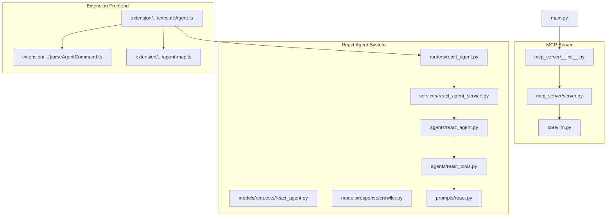
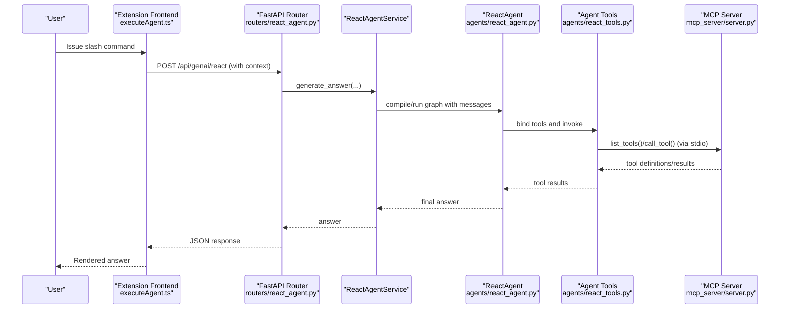
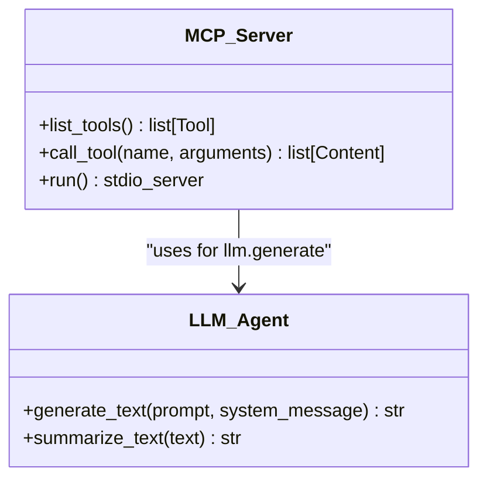
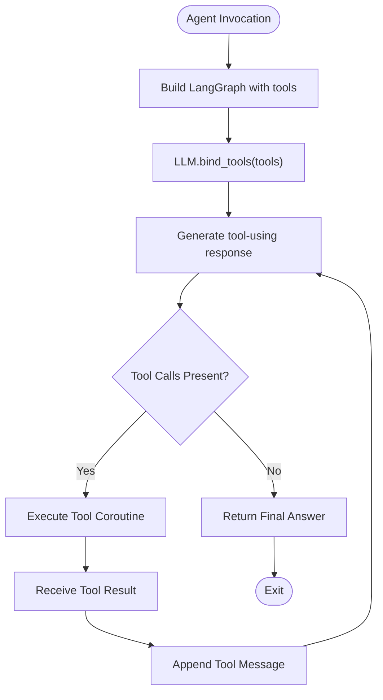
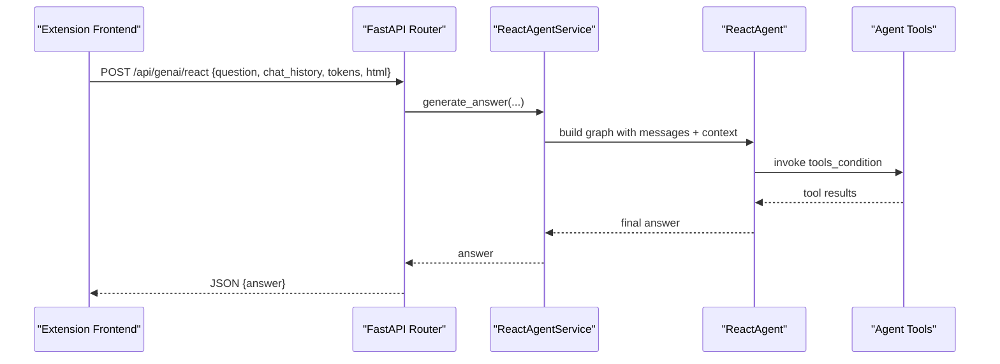
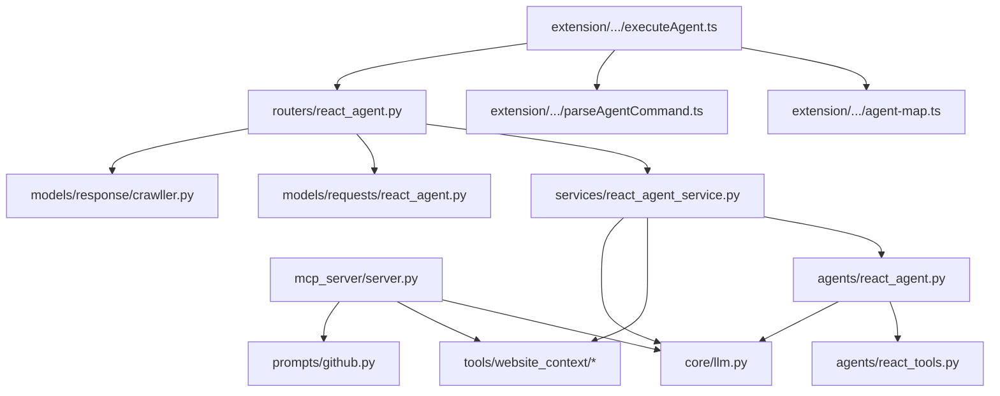

# MCP protocol implementation

## Introduction
This page explains the Model Context Protocol (MCP) implementation in the Agentic Browser project. It covers the MCP server architecture, tool definition and registration patterns, and AI agent integration through the MCP protocol. It documents communication protocols, message formats, state management between the MCP server and AI agents, and provides concrete examples of tool registration, command execution, and response handling. It also explains how the MCP protocol enables standardized AI tool integration, the role of prompt engineering in tool descriptions, and the abstraction layer that allows multiple LLM providers. Protocol-specific error handling, retry mechanisms, and performance considerations are addressed, along with integration patterns with the React agent system and how MCP facilitates extensible tool development.

## Project structure
The MCP implementation centers around a dedicated MCP server module that exposes tools via stdio, while the broader React agent system integrates with FastAPI routes and services. The extension front-end provides a command parser and executor that route commands to backend endpoints, which may use the MCP server depending on configuration.

```mermaid
graph TB
subgraph "MCP Server"
MCPInit["mcp_server/__init__.py"]
MCPServer["mcp_server/server.py"]
LLMAgent["core/llm.py"]
end
subgraph "React Agent System"
ReactAgent["agents/react_agent.py"]
ReactTools["agents/react_tools.py"]
ReactService["services/react_agent_service.py"]
ReactRouter["routers/react_agent.py"]
ReactReq["models/requests/react_agent.py"]
ReactResp["models/response/crawller.py"]
PromptReact["prompts/react.py"]
end
subgraph "Extension Frontend"
ExecAgent["extension/.../executeAgent.ts"]
ParseCmd["extension/.../parseAgentCommand.ts"]
AgentMap["extension/.../agent-map.ts"]
end
MainEntry["main.py"]
MainEntry --> MCPInit
MCPInit --> MCPServer
MCPServer --> LLMAgent
ExecAgent --> AgentMap
ExecAgent --> ParseCmd
ExecAgent --> ReactRouter
ReactRouter --> ReactService
ReactService --> ReactAgent
ReactAgent --> ReactTools
ReactTools --> PromptReact
```

## Core components
- MCP Server: Exposes a list of tools and executes tool calls via stdio. Tools include text generation with configurable providers, GitHub Q&A, website content fetching and conversion, and HTML-to-markdown conversion.
- LLM Abstraction: Provides a unified interface across multiple LLM providers (Google, OpenAI, Anthropic, Ollama, DeepSeek, OpenRouter) with environment-driven configuration.
- React Agent System: Implements a LangGraph-based agent with structured tools, stateful message handling, and tool invocation.
- FastAPI Router and Service: Routes React agent requests to a service that orchestrates tool usage and LLM interactions.
- Extension Frontend: Parses slash commands, resolves endpoints, and posts payloads to backend APIs.

## Architecture overview
The MCP server runs independently and communicates with clients via stdio. The React agent system is exposed via FastAPI endpoints and uses the MCP server's tool definitions to provide standardized tool capabilities. The extension front-end parses user commands and dispatches them to appropriate endpoints, optionally including context such as active tab HTML.

```mermaid
sequenceDiagram
participant User as "User"
participant Ext as "Extension Frontend<br/>executeAgent.ts"
participant API as "FastAPI Router<br/>routers/react_agent.py"
participant Svc as "ReactAgentService"
participant Agent as "ReactAgent<br/>agents/react_agent.py"
participant Tools as "Agent Tools<br/>agents/react_tools.py"
participant MCP as "MCP Server<br/>mcp_server/server.py"
User->>Ext : Issue slash command
Ext->>API : POST /api/genai/react (with context)
API->>Svc : generate_answer(...)
Svc->>Agent : compile/run graph with messages
Agent->>Tools : bind tools and invoke
Tools->>MCP : list_tools()/call_tool() (via stdio)
MCP-->>Tools : tool definitions/results
Tools-->>Agent : tool results
Agent-->>Svc : final answer
Svc-->>API : answer
API-->>Ext : JSON response
Ext-->>User : Rendered answer
```

## Detailed component analysis

### MCP server architecture
The MCP server defines tools and handles tool invocations over stdio. It supports:
- Text generation via a configurable LLM provider
- GitHub repository Q&A
- Website content fetching and HTML-to-markdown conversion
- Tool discovery and execution

```mermaid
classDiagram
class MCP_Server {
+list_tools() list[Tool]
+call_tool(name, arguments) list[Content]
+run() stdio_server
}
class LLM_Agent {
+generate_text(prompt, system_message) str
+summarize_text(text) str
}
MCP_Server --> LLM_Agent : "uses for llm.generate"
```

### Tool definition and registration patterns
- Tool definitions specify name, description, and JSON Schema input validation.
- Tool registration occurs implicitly via decorators on the MCP server.
- Tool execution routes arguments to internal handlers and returns text content.

Concrete examples of tool registration and execution:
- llm.generate: Accepts provider, model, API key/base URL, temperature, and prompt; returns generated text.
- github.answer: Accepts question, repository text/tree/summary, and optional chat history; returns synthesized answer.
- website.fetch_markdown: Accepts a URL; returns markdown content.
- website.html_to_md: Accepts raw HTML; returns markdown.

### AI agent integration through MCP
- The React agent system builds a LangGraph workflow with a tool node and an agent node.
- Tools are structured with typed inputs and coroutines; the agent binds tools to the LLM and executes them based on tool calls.
- The MCP server's tool definitions align with the agent's toolset, enabling consistent tool behavior across environments.

```mermaid
flowchart TD
Start(["Agent Invocation"]) --> BuildGraph["Build LangGraph with tools"]
BuildGraph --> BindTools["LLM.bind_tools(tools)"]
BindTools --> Generate["Generate tool-using response"]
Generate --> ToolCalls{"Tool Calls Present?"}
ToolCalls --> |Yes| ExecuteTool["Execute Tool Coroutine"]
ToolCalls --> |No| Finalize["Return Final Answer"]
ExecuteTool --> ReceiveResult["Receive Tool Result"]
ReceiveResult --> ContinueLoop["Append Tool Message"]
ContinueLoop --> Generate
Finalize --> End(["Exit"])
```

### Communication protocols and message formats
- MCP stdio protocol: The MCP server runs via stdio_server and exposes list_tools and call_tool endpoints.
- FastAPI protocol: The React agent endpoint accepts a request model with messages, optional tokens, and optional PyJIIT login payload; returns a simple answer response.
- Frontend command protocol: The extension parses slash commands, resolves endpoints, and posts JSON payloads with optional context (e.g., client HTML).

```mermaid
sequenceDiagram
participant Ext as "Extension Frontend"
participant API as "FastAPI Router"
participant Svc as "ReactAgentService"
participant Agent as "ReactAgent"
participant Tools as "Agent Tools"
Ext->>API : POST /api/genai/react {question, chat_history, tokens, html}
API->>Svc : generate_answer(...)
Svc->>Agent : build graph with messages + context
Agent->>Tools : invoke tools_condition
Tools-->>Agent : tool results
Agent-->>Svc : final answer
Svc-->>API : answer
API-->>Ext : JSON {answer}
```

### State management between MCP server and AI agents
- MCP server stateless: It does not maintain persistent state between tool listings and calls; each call is independent.
- React agent stateful: Uses a typed state with a message list and a compiled graph; maintains conversation context across iterations.
- Context injection: The service injects client HTML as a system message to provide page context to the agent.

### Prompt engineering in tool descriptions
- Tool descriptions are designed to be precise and actionable, aiding LLMs in selecting and invoking tools correctly.
- Examples include explicit provider selection, required fields, and default values to guide tool usage.

### Abstraction layer for multiple LLM providers
- Provider configuration maps define class constructors, environment variables, default models, and parameter mappings.
- The LLM class initializes providers dynamically, validates API keys and base URLs, and generates text with a unified interface.

### Protocol-Specific error handling and retry mechanisms
- MCP server: Returns text content with error messages on exceptions during tool execution.
- React agent service: Catches exceptions and returns a user-friendly message; logs errors for diagnostics.
- Frontend: Validates command completion and throws descriptive errors for missing data (e.g., portal credentials).

### Integration patterns with the React agent system
- The MCP server's tool definitions complement the React agent's toolset, ensuring consistent behavior across environments.
- The frontend maps slash commands to endpoints and payloads, enabling smooth orchestration of agent workflows.

## Dependency analysis
The MCP server depends on the LLM abstraction and several tool modules. The React agent system depends on the agent runtime, tools, and services. The FastAPI router depends on the service and request/response models. The extension front-end depends on agent mapping and command parsing utilities.

```mermaid
graph TB
MCPServer["mcp_server/server.py"] --> LLM["core/llm.py"]
MCPServer --> ToolsWebsite["tools/website_context/*"]
MCPServer --> PromptsGH["prompts/github.py"]
ReactAgent["agents/react_agent.py"] --> ReactTools["agents/react_tools.py"]
ReactAgent --> LLM
ReactService["services/react_agent_service.py"] --> ReactAgent
ReactService --> ToolsWebsite
ReactService --> LLM
ReactRouter["routers/react_agent.py"] --> ReactService
ReactRouter --> ReactReq["models/requests/react_agent.py"]
ReactRouter --> ReactResp["models/response/crawller.py"]
ExecAgent["extension/.../executeAgent.ts"] --> AgentMap["extension/.../agent-map.ts"]
ExecAgent --> ParseCmd["extension/.../parseAgentCommand.ts"]
ExecAgent --> ReactRouter
```

## Performance considerations
- Asynchronous tool execution: Tools use asyncio to offload blocking operations (e.g., network requests) to threads, preventing UI stalls.
- Provider configuration: Environment-driven configuration avoids repeated validation overhead and ensures correct defaults.
- Payload normalization: Utilities normalize payloads to strings to ensure consistent message handling across agent states.
- Frontend context capture: HTML capture is performed only when needed to minimize overhead.

[No sources needed since this section provides general guidance]

## Troubleshooting guide
Common issues and resolutions:
- Missing API keys or base URLs: Ensure environment variables are set for the selected provider.
- Unsupported provider: Verify provider name exists in the configuration map.
- Tool execution errors: The MCP server returns error text; check tool arguments and required fields.
- React agent failures: The service returns a friendly error message; review logs for details.
- Frontend command parsing: Ensure slash commands are complete and mapped to valid endpoints.

## Conclusion
The MCP implementation provides a standardized, extensible mechanism for exposing tools to AI agents. By defining clear tool schemas and using a reliable LLM abstraction, the system supports multiple providers and consistent behavior across environments. The React agent system integrates smoothly with these tools, while the FastAPI router and extension front-end enable practical user workflows. Together, these components form a cohesive framework for building and deploying agent-driven tool integrations.

[No sources needed since this section summarizes without analyzing specific files]

## Appendices

### MCP tool catalog
- llm.generate: Generates text with a specified provider and model.
- github.answer: Answers questions about a repository using provided context.
- website.fetch_markdown: Fetches markdown content for a given URL.
- website.html_to_md: Converts raw HTML to markdown.

### React agent request model
- Messages: List of typed messages with roles and optional tool calls.
- Tokens and session data: Optional OAuth tokens and PyJIIT login payload.

### Extension command mapping
- Slash commands map to endpoints via a central agent map.
- Command parsing resolves agent and action keys to endpoints.
