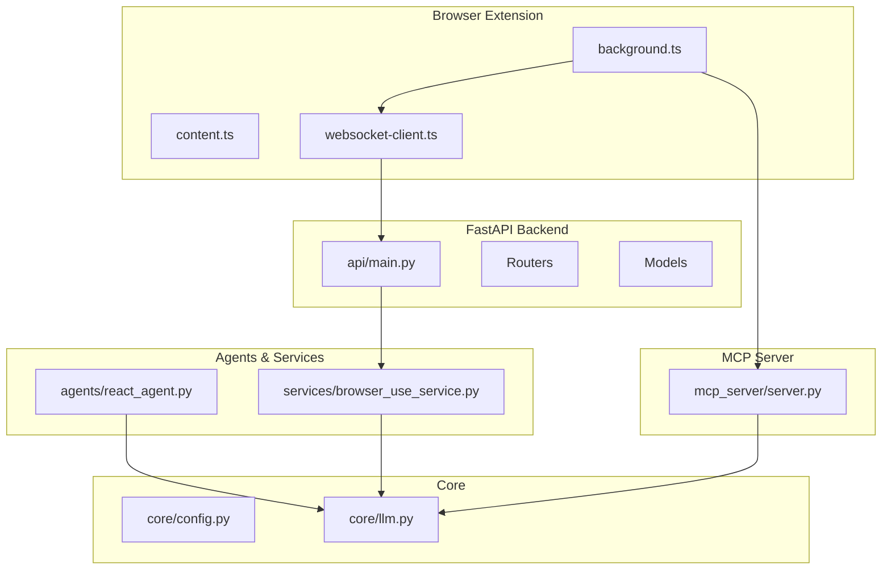
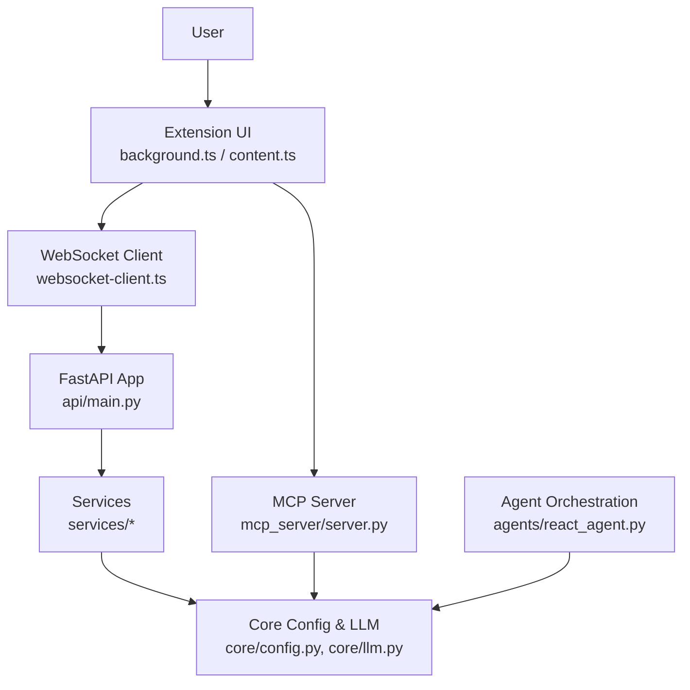
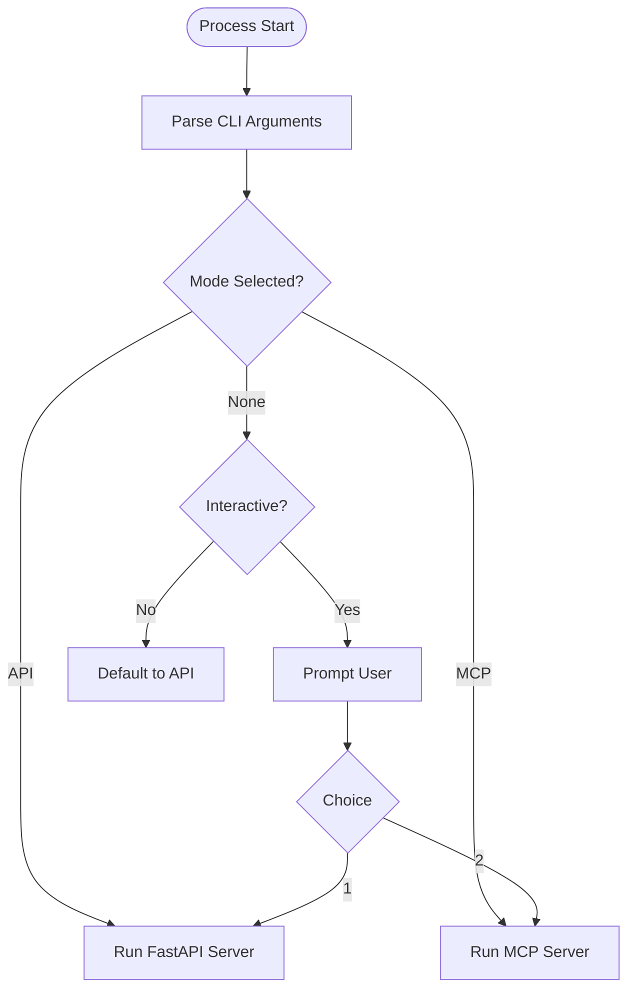
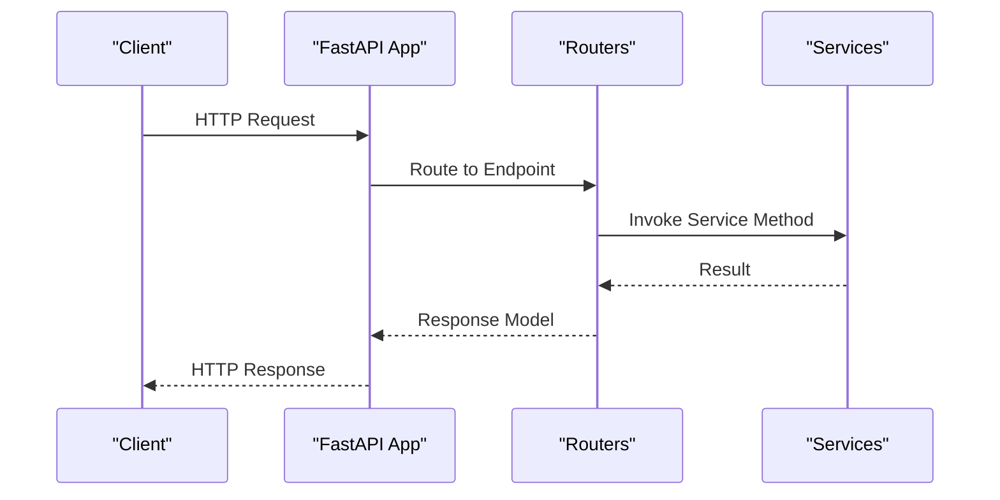
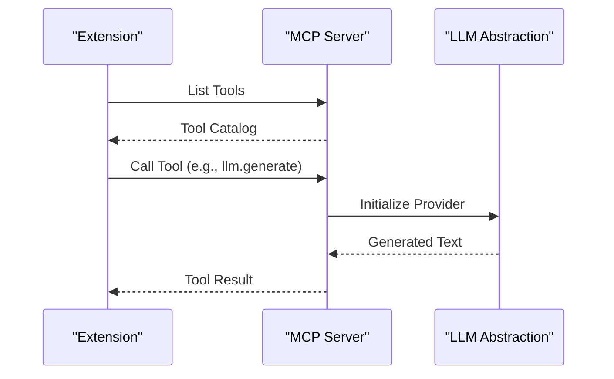
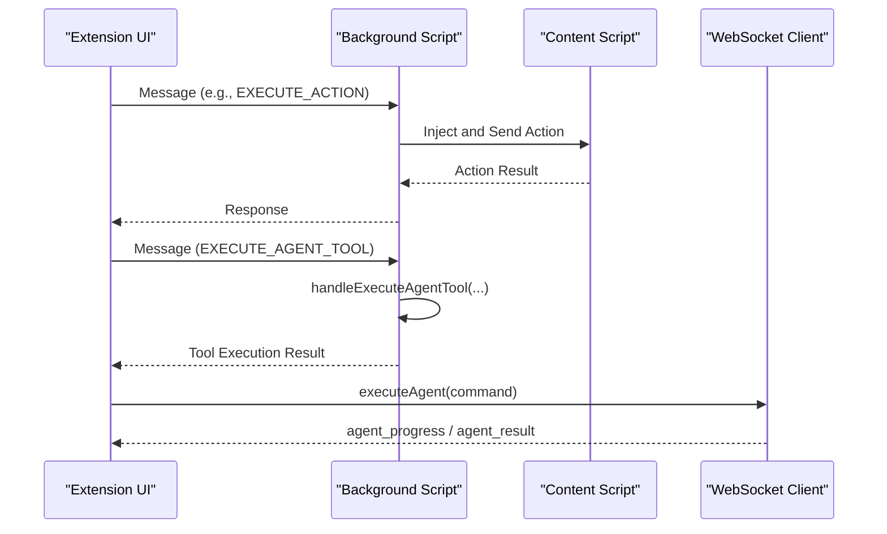
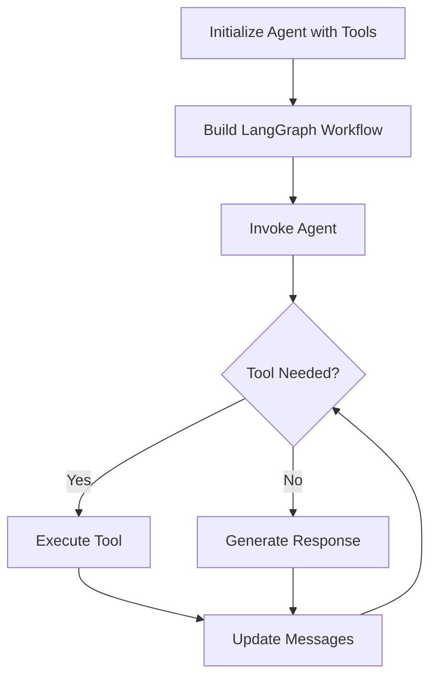
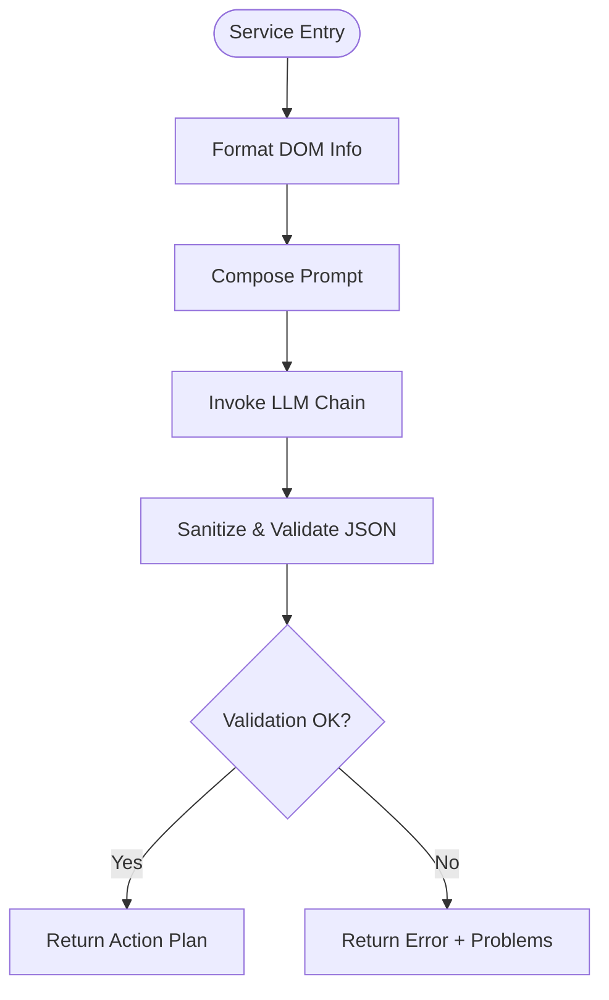
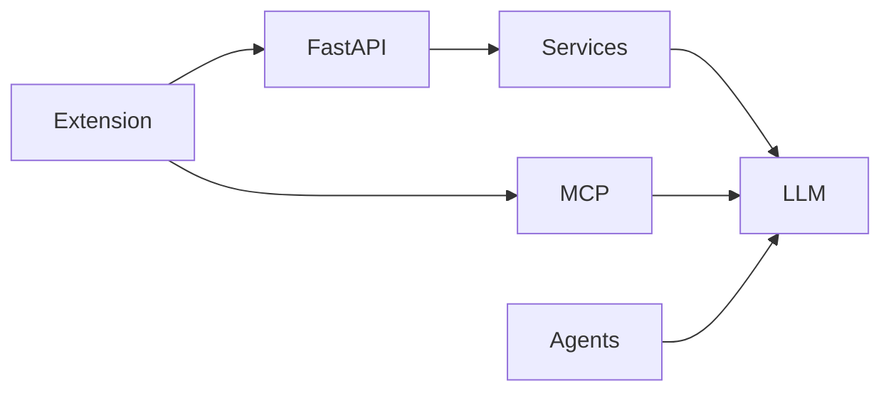
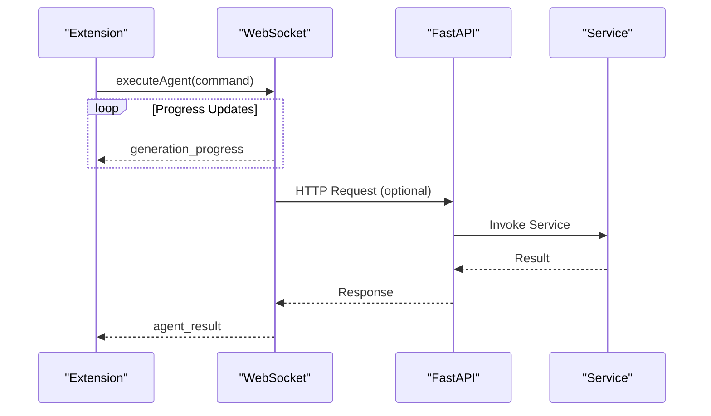

# Overall System Design

<cite>
**Referenced Files in This Document**
- [main.py](file://main.py)
- [mcp_server/server.py](file://mcp_server/server.py)
- [api/main.py](file://api/main.py)
- [core/config.py](file://core/config.py)
- [core/llm.py](file://core/llm.py)
- [agents/react_agent.py](file://agents/react_agent.py)
- [services/browser_use_service.py](file://services/browser_use_service.py)
- [routers/browser_use.py](file://routers/browser_use.py)
- [models/requests/agent.py](file://models/requests/agent.py)
- [extension/entrypoints/background.ts](file://extension/entrypoints/background.ts)
- [extension/entrypoints/content.ts](file://extension/entrypoints/content.ts)
- [extension/entrypoints/utils/websocket-client.ts](file://extension/entrypoints/utils/websocket-client.ts)
</cite>

## Table of Contents
1. [Introduction](#introduction)
2. [Project Structure](#project-structure)
3. [Core Components](#core-components)
4. [Architecture Overview](#architecture-overview)
5. [Detailed Component Analysis](#detailed-component-analysis)
6. [Dependency Analysis](#dependency-analysis)
7. [Performance Considerations](#performance-considerations)
8. [Security and Transparency](#security-and-transparency)
9. [Modular Tool System](#modular-tool-system)
10. [Distributed Communication Patterns](#distributed-communication-patterns)
11. [Troubleshooting Guide](#troubleshooting-guide)
12. [Conclusion](#conclusion)

## Introduction
This document describes the overall system design of Agentic Browser, a browser-centric AI agent platform. The system integrates a React-based browser extension, a Python MCP server, a FastAPI backend, and modular service/tool layers. It emphasizes a model-agnostic design, strong separation of concerns between frontend and backend, robust security and transparency controls, and a flexible, extensible tool ecosystem. The architecture supports asynchronous communication and distributed operation across components.

## Project Structure
The repository is organized into distinct layers:
- Extension: React UI, background/content scripts, and WebSocket client for browser integration
- Backend: FastAPI application exposing REST endpoints
- MCP Server: Python MCP server implementing standardized tool protocols
- Core: Shared configuration and LLM abstraction
- Agents: Agent orchestration and tool binding
- Services: Domain-specific business logic
- Routers: API routing and request/response models
- Tools: Modular capabilities for websites, YouTube, Gmail, GitHub, calendar, and more

**Diagram sources**
- [extension/entrypoints/background.ts](file://extension/entrypoints/background.ts#L1-L160)
- [extension/entrypoints/content.ts](file://extension/entrypoints/content.ts#L1-L120)
- [extension/entrypoints/utils/websocket-client.ts](file://extension/entrypoints/utils/websocket-client.ts#L1-L133)
- [api/main.py](file://api/main.py#L1-L47)
- [mcp_server/server.py](file://mcp_server/server.py#L1-L139)
- [core/config.py](file://core/config.py#L1-L26)
- [core/llm.py](file://core/llm.py#L1-L215)
- [agents/react_agent.py](file://agents/react_agent.py#L1-L191)
- [services/browser_use_service.py](file://services/browser_use_service.py#L1-L96)

**Section sources**
- [main.py](file://main.py#L1-L58)
- [api/main.py](file://api/main.py#L1-L47)
- [mcp_server/server.py](file://mcp_server/server.py#L1-L139)
- [core/config.py](file://core/config.py#L1-L26)
- [core/llm.py](file://core/llm.py#L1-L215)
- [agents/react_agent.py](file://agents/react_agent.py#L1-L191)
- [services/browser_use_service.py](file://services/browser_use_service.py#L1-L96)
- [routers/browser_use.py](file://routers/browser_use.py#L1-L51)
- [models/requests/agent.py](file://models/requests/agent.py#L1-L10)
- [extension/entrypoints/background.ts](file://extension/entrypoints/background.ts#L1-L160)
- [extension/entrypoints/content.ts](file://extension/entrypoints/content.ts#L1-L120)
- [extension/entrypoints/utils/websocket-client.ts](file://extension/entrypoints/utils/websocket-client.ts#L1-L133)

## Core Components
- Entry point and process orchestrator: main.py selects between API and MCP modes
- FastAPI backend: exposes REST endpoints for agent scripting, validators, and integrations
- MCP server: standardizes tool execution via the Model Context Protocol
- Core LLM abstraction: provider-agnostic LLM client supporting multiple providers
- Agent orchestration: React agent graph with tool execution nodes
- Service layer: domain-specific logic (e.g., browser-use action plan generation)
- Extension: background/content scripts and WebSocket client for UI and agent coordination

Responsibilities:
- Frontend (Extension): UI, tab management, action injection, and WebSocket-driven agent execution
- Backend (FastAPI): request routing, service orchestration, and response modeling
- Backend (MCP): tool catalog and execution for LLM-driven tasks
- Core: configuration, logging, and LLM provider selection
- Agents/Services: reasoning, tool binding, and domain logic

**Section sources**
- [main.py](file://main.py#L11-L58)
- [api/main.py](file://api/main.py#L12-L47)
- [mcp_server/server.py](file://mcp_server/server.py#L13-L139)
- [core/llm.py](file://core/llm.py#L78-L215)
- [agents/react_agent.py](file://agents/react_agent.py#L138-L191)
- [services/browser_use_service.py](file://services/browser_use_service.py#L11-L96)
- [extension/entrypoints/background.ts](file://extension/entrypoints/background.ts#L17-L128)
- [extension/entrypoints/utils/websocket-client.ts](file://extension/entrypoints/utils/websocket-client.ts#L8-L133)

## Architecture Overview
Agentic Browser operates in two primary modes:
- API mode: REST-driven orchestration via FastAPI
- MCP mode: Protocol-driven tool execution via MCP

The system boundary separates the browser extension (UI and automation) from the backend services. The extension communicates with the backend either through REST or MCP, depending on mode. The backend invokes services and tools, which may call external providers through the LLM abstraction.

**Diagram sources**
- [extension/entrypoints/background.ts](file://extension/entrypoints/background.ts#L17-L128)
- [extension/entrypoints/utils/websocket-client.ts](file://extension/entrypoints/utils/websocket-client.ts#L8-L133)
- [api/main.py](file://api/main.py#L12-L47)
- [mcp_server/server.py](file://mcp_server/server.py#L13-L139)
- [core/config.py](file://core/config.py#L1-L26)
- [core/llm.py](file://core/llm.py#L78-L215)
- [agents/react_agent.py](file://agents/react_agent.py#L138-L191)
- [services/browser_use_service.py](file://services/browser_use_service.py#L11-L96)

## Detailed Component Analysis

### System Entry and Mode Selection
The entrypoint determines whether to run the FastAPI server or the MCP server. It supports CLI flags and interactive selection.

**Diagram sources**
- [main.py](file://main.py#L11-L58)

**Section sources**
- [main.py](file://main.py#L11-L58)

### FastAPI Backend and Routing
The FastAPI application wires routers for various domains and exposes endpoints for agent scripting and validators. It includes dependency injection for services and consistent logging.

**Diagram sources**
- [api/main.py](file://api/main.py#L12-L47)
- [routers/browser_use.py](file://routers/browser_use.py#L16-L51)
- [services/browser_use_service.py](file://services/browser_use_service.py#L11-L96)
- [models/requests/agent.py](file://models/requests/agent.py#L5-L10)

**Section sources**
- [api/main.py](file://api/main.py#L12-L47)
- [routers/browser_use.py](file://routers/browser_use.py#L1-L51)
- [services/browser_use_service.py](file://services/browser_use_service.py#L11-L96)
- [models/requests/agent.py](file://models/requests/agent.py#L1-L10)

### MCP Server and Tool Execution
The MCP server defines a standardized tool catalog and routes tool invocations to provider-specific implementations. It supports LLM generation, GitHub Q&A, and website content extraction.

**Diagram sources**
- [mcp_server/server.py](file://mcp_server/server.py#L16-L139)
- [core/llm.py](file://core/llm.py#L78-L215)

**Section sources**
- [mcp_server/server.py](file://mcp_server/server.py#L16-L139)
- [core/llm.py](file://core/llm.py#L78-L215)

### Extension: Background Script and Messaging
The background script handles extension-level messaging for activation, tab management, action execution, and agent tool invocation. It coordinates with content scripts and the WebSocket client.

**Diagram sources**
- [extension/entrypoints/background.ts](file://extension/entrypoints/background.ts#L24-L128)
- [extension/entrypoints/content.ts](file://extension/entrypoints/content.ts#L197-L214)
- [extension/entrypoints/utils/websocket-client.ts](file://extension/entrypoints/utils/websocket-client.ts#L61-L95)

**Section sources**
- [extension/entrypoints/background.ts](file://extension/entrypoints/background.ts#L17-L128)
- [extension/entrypoints/content.ts](file://extension/entrypoints/content.ts#L197-L214)
- [extension/entrypoints/utils/websocket-client.ts](file://extension/entrypoints/utils/websocket-client.ts#L8-L133)

### Agent Orchestration and Tool Binding
The React agent composes a LangGraph workflow with an agent node and a tool execution node. It binds tools and manages state transitions.

**Diagram sources**
- [agents/react_agent.py](file://agents/react_agent.py#L138-L191)
- [core/llm.py](file://core/llm.py#L78-L215)

**Section sources**
- [agents/react_agent.py](file://agents/react_agent.py#L138-L191)
- [core/llm.py](file://core/llm.py#L78-L215)

### Service Layer: Browser Use Script Generation
The service generates an action plan for browser automation goals using LLM prompting and sanitization.

**Diagram sources**
- [services/browser_use_service.py](file://services/browser_use_service.py#L11-L96)
- [core/llm.py](file://core/llm.py#L171-L191)

**Section sources**
- [services/browser_use_service.py](file://services/browser_use_service.py#L11-L96)
- [core/llm.py](file://core/llm.py#L171-L191)

## Dependency Analysis
The system exhibits layered dependencies:
- Extension depends on background/content scripts and the WebSocket client
- FastAPI depends on routers, services, and models
- Services depend on core LLM and prompts
- MCP depends on core LLM and tool implementations
- Agents depend on LLM and tool definitions

**Diagram sources**
- [extension/entrypoints/background.ts](file://extension/entrypoints/background.ts#L17-L128)
- [extension/entrypoints/utils/websocket-client.ts](file://extension/entrypoints/utils/websocket-client.ts#L8-L133)
- [api/main.py](file://api/main.py#L12-L47)
- [mcp_server/server.py](file://mcp_server/server.py#L13-L139)
- [services/browser_use_service.py](file://services/browser_use_service.py#L11-L96)
- [core/llm.py](file://core/llm.py#L78-L215)
- [agents/react_agent.py](file://agents/react_agent.py#L138-L191)

**Section sources**
- [api/main.py](file://api/main.py#L12-L47)
- [mcp_server/server.py](file://mcp_server/server.py#L13-L139)
- [core/llm.py](file://core/llm.py#L78-L215)
- [services/browser_use_service.py](file://services/browser_use_service.py#L11-L96)
- [agents/react_agent.py](file://agents/react_agent.py#L138-L191)
- [extension/entrypoints/background.ts](file://extension/entrypoints/background.ts#L17-L128)
- [extension/entrypoints/utils/websocket-client.ts](file://extension/entrypoints/utils/websocket-client.ts#L8-L133)

## Performance Considerations
- Asynchronous messaging: Extension background and WebSocket client support non-blocking operations
- Caching: Agent graph compilation is cached to reduce overhead
- Streaming progress: WebSocket client emits incremental progress updates
- Provider selection: LLM abstraction defers initialization and validation to optimize startup
- Router composition: FastAPI routers keep endpoints focused and maintainable

[No sources needed since this section provides general guidance]

## Security and Transparency
- Guardrails: Prompt injection validation and sanitizer utilities protect against malformed inputs
- Transparency: WebSocket client emits progress and status events; MCP returns explicit errors
- Separation of concerns: LLM credentials and base URLs are managed centrally; providers are configurable
- Logging: Centralized logging via core configuration

**Section sources**
- [core/config.py](file://core/config.py#L1-L26)
- [extension/entrypoints/utils/websocket-client.ts](file://extension/entrypoints/utils/websocket-client.ts#L26-L40)
- [mcp_server/server.py](file://mcp_server/server.py#L122-L124)

## Modular Tool System
The MCP server exposes a standardized tool catalog:
- LLM generation with provider selection
- GitHub Q&A with context
- Website content extraction (markdown and HTML conversion)

This modularity enables:
- Extensibility: New tools can be added to the MCP catalog
- Interoperability: Tools are protocol-driven and decoupled from UI
- Reusability: Tools encapsulate domain logic and can be invoked from multiple entrypoints

**Section sources**
- [mcp_server/server.py](file://mcp_server/server.py#L16-L80)

## Distributed Communication Patterns
Asynchronous communication is central:
- WebSocket client: emits progress and receives results/events
- Background script: handles long-running actions and responds via message channels
- MCP: streaming-like tool results via protocol responses
- FastAPI: request-response with structured models

**Diagram sources**
- [extension/entrypoints/utils/websocket-client.ts](file://extension/entrypoints/utils/websocket-client.ts#L61-L95)
- [api/main.py](file://api/main.py#L12-L47)
- [services/browser_use_service.py](file://services/browser_use_service.py#L11-L96)

**Section sources**
- [extension/entrypoints/utils/websocket-client.ts](file://extension/entrypoints/utils/websocket-client.ts#L8-L133)
- [extension/entrypoints/background.ts](file://extension/entrypoints/background.ts#L17-L128)
- [api/main.py](file://api/main.py#L12-L47)
- [services/browser_use_service.py](file://services/browser_use_service.py#L11-L96)

## Troubleshooting Guide
Common issues and diagnostics:
- Missing API keys or base URLs: LLM initialization raises explicit errors when required environment variables are absent
- WebSocket connectivity: Client logs connection/disconnection events and retries automatically
- MCP tool errors: MCP returns error text for unknown tools or exceptions during execution
- FastAPI validation: Requests are validated by Pydantic models; invalid requests return structured errors

**Section sources**
- [core/llm.py](file://core/llm.py#L121-L155)
- [extension/entrypoints/utils/websocket-client.ts](file://extension/entrypoints/utils/websocket-client.ts#L17-L40)
- [mcp_server/server.py](file://mcp_server/server.py#L122-L124)
- [routers/browser_use.py](file://routers/browser_use.py#L22-L50)

## Conclusion
Agentic Browser’s architecture cleanly separates the browser extension (frontend) from the backend services (REST and MCP), enabling a model-agnostic, extensible, and transparent system. The React agent orchestrates tools, the service layer encapsulates domain logic, and the MCP server standardizes tool execution. Asynchronous communication and modular design support scalability and maintainability while preserving strong security and transparency controls.