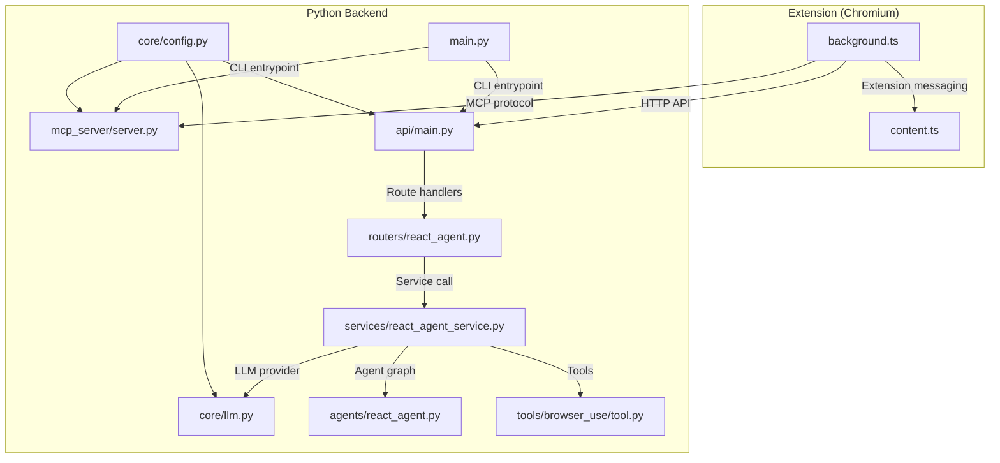
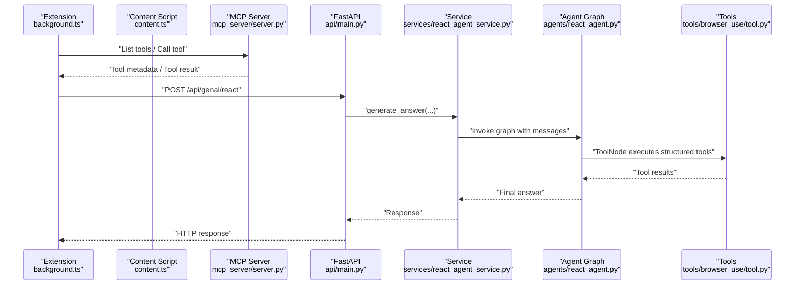
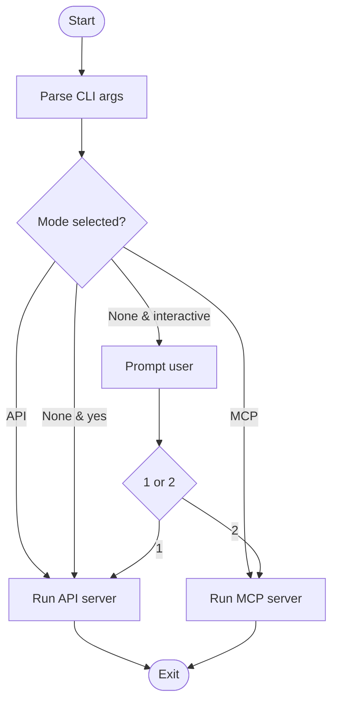
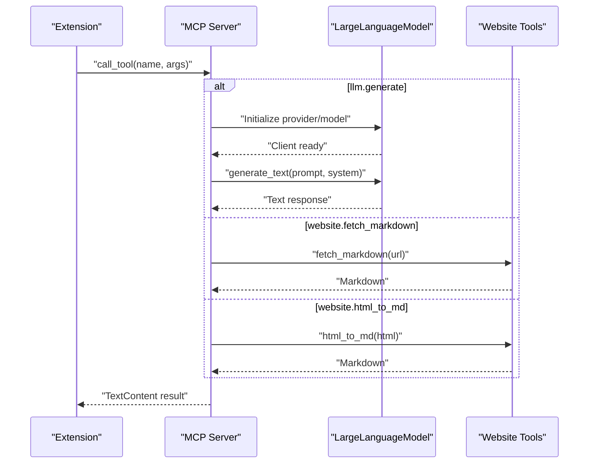
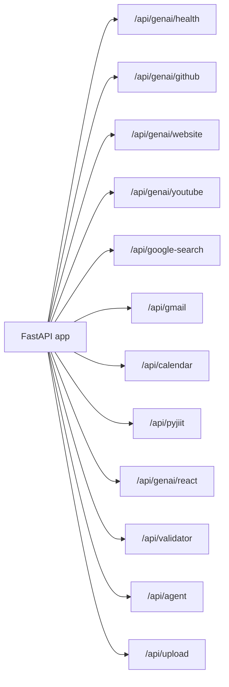
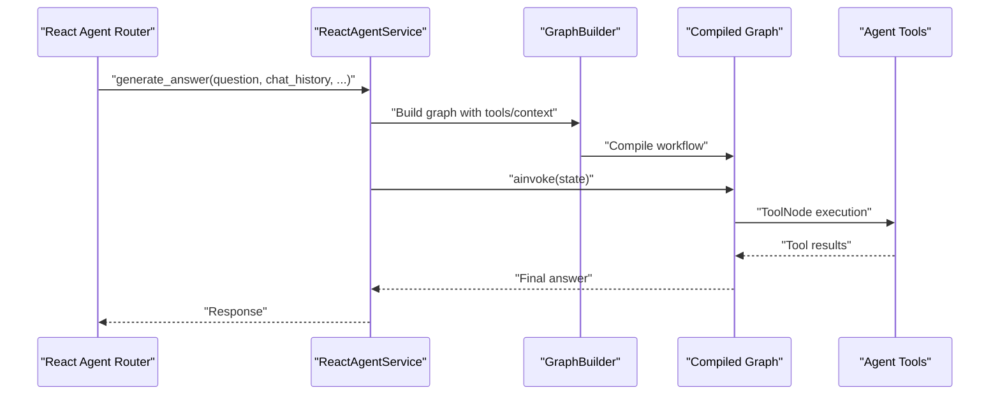
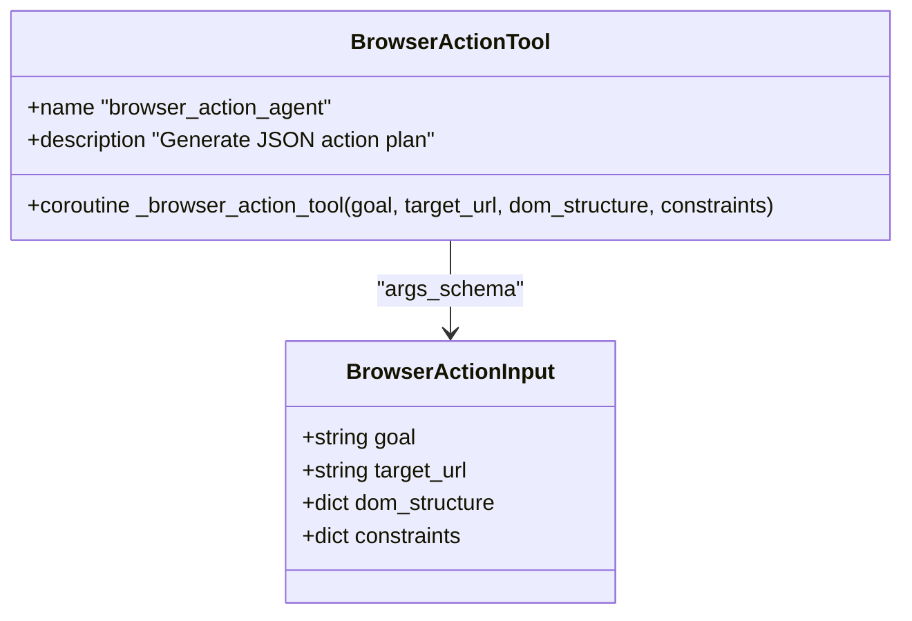
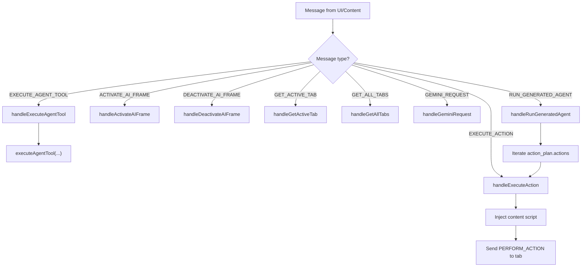
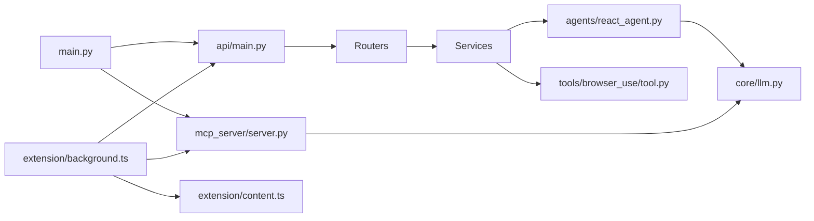

# System Architecture

<cite>
**Referenced Files in This Document**
- [main.py](file://main.py)
- [api/main.py](file://api/main.py)
- [mcp_server/server.py](file://mcp_server/server.py)
- [core/config.py](file://core/config.py)
- [core/llm.py](file://core/llm.py)
- [routers/react_agent.py](file://routers/react_agent.py)
- [services/react_agent_service.py](file://services/react_agent_service.py)
- [agents/react_agent.py](file://agents/react_agent.py)
- [tools/browser_use/tool.py](file://tools/browser_use/tool.py)
- [prompts/react.py](file://prompts/react.py)
- [extension/entrypoints/background.ts](file://extension/entrypoints/background.ts)
- [extension/entrypoints/content.ts](file://extension/entrypoints/content.ts)
</cite>

## Table of Contents
1. [Introduction](#introduction)
2. [Project Structure](#project-structure)
3. [Core Components](#core-components)
4. [Architecture Overview](#architecture-overview)
5. [Detailed Component Analysis](#detailed-component-analysis)
6. [Dependency Analysis](#dependency-analysis)
7. [Performance Considerations](#performance-considerations)
8. [Security and Transparency](#security-and-transparency)
9. [Monitoring and Observability](#monitoring-and-observability)
10. [Infrastructure Requirements and Deployment Topology](#infrastructure-requirements-and-deployment-topology)
11. [Troubleshooting Guide](#troubleshooting-guide)
12. [Conclusion](#conclusion)

## Introduction
This document describes the system architecture of Agentic Browser, focusing on the relationships between the React-based browser extension, the Python MCP server, the FastAPI backend, and the integrated services and tools. It explains how the MCP protocol enables the extension to communicate with the Python backend, how the FastAPI backend orchestrates services and tools, and how the model-agnostic design supports multiple LLM providers. Cross-cutting concerns such as security, transparency, monitoring, and separation of concerns between frontend and backend are addressed.

## Project Structure
The repository is organized into distinct layers:
- Extension: A Chromium extension built with React and TypeScript, implementing background and content scripts for browser automation and messaging.
- Backend: A Python application exposing both an MCP server and a FastAPI HTTP API.
- Core: Shared configuration and LLM abstraction.
- Services: Business logic and orchestration for domain capabilities.
- Tools: Modular, reusable tools consumed by agents and services.
- Agents: Orchestrated reasoning graphs using LangGraph and LangChain tools.
- Routers: FastAPI route handlers delegating to services.

**Diagram sources**
- [main.py](file://main.py#L1-L58)
- [api/main.py](file://api/main.py#L1-L47)
- [mcp_server/server.py](file://mcp_server/server.py#L1-L139)
- [core/config.py](file://core/config.py#L1-L26)
- [core/llm.py](file://core/llm.py#L1-L215)
- [services/react_agent_service.py](file://services/react_agent_service.py#L1-L154)
- [agents/react_agent.py](file://agents/react_agent.py#L1-L191)
- [tools/browser_use/tool.py](file://tools/browser_use/tool.py#L1-L49)
- [routers/react_agent.py](file://routers/react_agent.py#L1-L57)
- [extension/entrypoints/background.ts](file://extension/entrypoints/background.ts#L1-L1642)
- [extension/entrypoints/content.ts](file://extension/entrypoints/content.ts#L1-L326)

**Section sources**
- [main.py](file://main.py#L1-L58)
- [api/main.py](file://api/main.py#L1-L47)
- [mcp_server/server.py](file://mcp_server/server.py#L1-L139)
- [core/config.py](file://core/config.py#L1-L26)
- [core/llm.py](file://core/llm.py#L1-L215)
- [services/react_agent_service.py](file://services/react_agent_service.py#L1-L154)
- [agents/react_agent.py](file://agents/react_agent.py#L1-L191)
- [tools/browser_use/tool.py](file://tools/browser_use/tool.py#L1-L49)
- [routers/react_agent.py](file://routers/react_agent.py#L1-L57)
- [extension/entrypoints/background.ts](file://extension/entrypoints/background.ts#L1-L1642)
- [extension/entrypoints/content.ts](file://extension/entrypoints/content.ts#L1-L326)

## Core Components
- CLI entrypoint: Selects whether to run the API server or the MCP server.
- FastAPI backend: Exposes HTTP endpoints under a unified router registry.
- MCP server: Implements MCP protocol tools for LLM generation, GitHub Q&A, and website content conversion.
- LLM abstraction: Provider-agnostic configuration supporting multiple LLM providers.
- React agent service: Orchestrates agent workflows, integrates context, and coordinates tools.
- Agent graph: LangGraph-based reasoning pipeline with tool invocation.
- Browser-use tool: Structured tool for generating browser action plans.
- Extension background/content scripts: Manage extension lifecycle, inject content scripts, and coordinate actions.

**Section sources**
- [main.py](file://main.py#L1-L58)
- [api/main.py](file://api/main.py#L1-L47)
- [mcp_server/server.py](file://mcp_server/server.py#L1-L139)
- [core/llm.py](file://core/llm.py#L1-L215)
- [services/react_agent_service.py](file://services/react_agent_service.py#L1-L154)
- [agents/react_agent.py](file://agents/react_agent.py#L1-L191)
- [tools/browser_use/tool.py](file://tools/browser_use/tool.py#L1-L49)
- [extension/entrypoints/background.ts](file://extension/entrypoints/background.ts#L1-L1642)
- [extension/entrypoints/content.ts](file://extension/entrypoints/content.ts#L1-L326)

## Architecture Overview
Agentic Browser separates concerns across three primary channels:
- Browser extension messaging: Background script handles extension commands and delegates actions to content scripts or the MCP server.
- MCP protocol: The extension communicates with the Python MCP server to execute tools (e.g., LLM generation, website markdown extraction).
- HTTP API: The extension can also call the FastAPI backend for domain-specific routes (e.g., React agent).

**Diagram sources**
- [extension/entrypoints/background.ts](file://extension/entrypoints/background.ts#L1-L1642)
- [extension/entrypoints/content.ts](file://extension/entrypoints/content.ts#L1-L326)
- [mcp_server/server.py](file://mcp_server/server.py#L1-L139)
- [api/main.py](file://api/main.py#L1-L47)
- [services/react_agent_service.py](file://services/react_agent_service.py#L1-L154)
- [agents/react_agent.py](file://agents/react_agent.py#L1-L191)
- [tools/browser_use/tool.py](file://tools/browser_use/tool.py#L1-L49)

## Detailed Component Analysis

### CLI Entrypoint and Mode Selection
The CLI selects between running the API server or the MCP server, enabling flexible deployment modes.

**Diagram sources**
- [main.py](file://main.py#L1-L58)

**Section sources**
- [main.py](file://main.py#L1-L58)

### MCP Protocol Tools and Execution
The MCP server exposes tools for LLM generation, GitHub Q&A, and website content conversion. Tool execution delegates to the LLM abstraction and utility functions.

**Diagram sources**
- [mcp_server/server.py](file://mcp_server/server.py#L1-L139)
- [core/llm.py](file://core/llm.py#L1-L215)

**Section sources**
- [mcp_server/server.py](file://mcp_server/server.py#L1-L139)
- [core/llm.py](file://core/llm.py#L1-L215)

### FastAPI Backend and Route Composition
The FastAPI app composes routers for health, GitHub, website, YouTube, Google Search, Gmail, Calendar, PyJiIT, React agent, validator, agent, and file upload. The React agent router delegates to the React agent service.

**Diagram sources**
- [api/main.py](file://api/main.py#L1-L47)
- [routers/react_agent.py](file://routers/react_agent.py#L1-L57)

**Section sources**
- [api/main.py](file://api/main.py#L1-L47)
- [routers/react_agent.py](file://routers/react_agent.py#L1-L57)

### React Agent Orchestration
The React agent service constructs a LangGraph workflow, normalizes messages, injects page context when provided, and invokes the compiled graph. The agent graph uses a tool node to execute structured tools.

**Diagram sources**
- [services/react_agent_service.py](file://services/react_agent_service.py#L1-L154)
- [agents/react_agent.py](file://agents/react_agent.py#L1-L191)
- [prompts/react.py](file://prompts/react.py#L1-L21)

**Section sources**
- [services/react_agent_service.py](file://services/react_agent_service.py#L1-L154)
- [agents/react_agent.py](file://agents/react_agent.py#L1-L191)
- [prompts/react.py](file://prompts/react.py#L1-L21)

### Browser-Use Tool Integration
The browser-use tool defines a structured tool for generating browser action plans. It is consumed by the agent graph during tool execution.

**Diagram sources**
- [tools/browser_use/tool.py](file://tools/browser_use/tool.py#L1-L49)

**Section sources**
- [tools/browser_use/tool.py](file://tools/browser_use/tool.py#L1-L49)

### Extension Messaging and Action Execution
The extension’s background script listens for messages from the UI and content scripts, handles tab management, and executes actions by injecting content scripts and sending messages. It also supports dynamic Gemini requests and action-plan execution.

**Diagram sources**
- [extension/entrypoints/background.ts](file://extension/entrypoints/background.ts#L1-L1642)
- [extension/entrypoints/content.ts](file://extension/entrypoints/content.ts#L1-L326)

**Section sources**
- [extension/entrypoints/background.ts](file://extension/entrypoints/background.ts#L1-L1642)
- [extension/entrypoints/content.ts](file://extension/entrypoints/content.ts#L1-L326)

## Dependency Analysis
- The CLI depends on the MCP server and FastAPI entrypoints.
- The FastAPI app depends on routers, which depend on services.
- Services depend on the agent graph and tools.
- The agent graph depends on the LLM abstraction and tools.
- The MCP server depends on the LLM abstraction and website utilities.
- The extension depends on background and content scripts for messaging and automation.

**Diagram sources**
- [main.py](file://main.py#L1-L58)
- [api/main.py](file://api/main.py#L1-L47)
- [mcp_server/server.py](file://mcp_server/server.py#L1-L139)
- [core/llm.py](file://core/llm.py#L1-L215)
- [services/react_agent_service.py](file://services/react_agent_service.py#L1-L154)
- [agents/react_agent.py](file://agents/react_agent.py#L1-L191)
- [tools/browser_use/tool.py](file://tools/browser_use/tool.py#L1-L49)
- [extension/entrypoints/background.ts](file://extension/entrypoints/background.ts#L1-L1642)
- [extension/entrypoints/content.ts](file://extension/entrypoints/content.ts#L1-L326)

**Section sources**
- [main.py](file://main.py#L1-L58)
- [api/main.py](file://api/main.py#L1-L47)
- [mcp_server/server.py](file://mcp_server/server.py#L1-L139)
- [core/llm.py](file://core/llm.py#L1-L215)
- [services/react_agent_service.py](file://services/react_agent_service.py#L1-L154)
- [agents/react_agent.py](file://agents/react_agent.py#L1-L191)
- [tools/browser_use/tool.py](file://tools/browser_use/tool.py#L1-L49)
- [extension/entrypoints/background.ts](file://extension/entrypoints/background.ts#L1-L1642)
- [extension/entrypoints/content.ts](file://extension/entrypoints/content.ts#L1-L326)

## Performance Considerations
- Model selection and provider routing: The LLM abstraction chooses providers and defaults, minimizing cold starts by caching clients.
- Tool execution batching: The agent graph executes tools asynchronously; ensure tool implementations avoid blocking operations.
- HTTP API throughput: Use asynchronous FastAPI handlers and keep route logic lightweight; delegate heavy work to services.
- Extension responsiveness: Avoid long-running injected scripts; prefer background-worker coordination and short-lived content-script interactions.
- Caching: Reuse compiled agent graphs and compiled LLM clients where feasible.

[No sources needed since this section provides general guidance]

## Security and Transparency
- Guardrails and prompt injection: Dedicated prompt injection validator and explicit system prompts guide the agent toward safe, transparent behavior.
- API key management: LLM provider configuration reads keys from environment variables; avoid embedding secrets in code.
- Extension permissions: The extension interacts with tabs and content scripts; maintain minimal permissions and sanitize injected content.
- Transparency: The React agent service logs messages and context; expose logs for auditing while avoiding sensitive data leakage.
- MCP tool scope: Limit MCP tools to necessary capabilities and validate inputs rigorously.

**Section sources**
- [prompts/react.py](file://prompts/react.py#L1-L21)
- [core/llm.py](file://core/llm.py#L1-L215)
- [services/react_agent_service.py](file://services/react_agent_service.py#L1-L154)

## Monitoring and Observability
- Logging: Centralized logger configuration supports development and production logging levels.
- Endpoint visibility: Health routers and standardized responses enable readiness/liveness checks.
- Agent tracing: Log message counts and final outputs to track agent behavior and detect anomalies.

**Section sources**
- [core/config.py](file://core/config.py#L1-L26)
- [api/main.py](file://api/main.py#L1-L47)

## Infrastructure Requirements and Deployment Topology
- Runtime environments:
  - Python runtime for the MCP server and FastAPI backend.
  - Chromium-based browser for the extension.
- Networking:
  - Localhost binding controlled by configuration; adjust host/port for containerized deployments.
- Scalability:
  - Stateless FastAPI routes scale horizontally behind a reverse proxy.
  - MCP server runs as a single process; consider process isolation per tenant if needed.
  - Tool-heavy workloads benefit from caching and asynchronous processing.
- Containerization:
  - Package the Python backend and serve via a containerized FastAPI app; run the MCP server alongside or separately.
- Secrets management:
  - Store API keys and base URLs in environment variables; mount secrets securely in containers.

**Section sources**
- [core/config.py](file://core/config.py#L1-L26)
- [main.py](file://main.py#L1-L58)

## Troubleshooting Guide
- MCP tool errors: The MCP server wraps tool execution in try/catch and returns error text; verify tool names and arguments.
- LLM initialization failures: Provider configuration requires API keys or base URLs; check environment variables and model names.
- Extension action failures: Confirm content script injection and tab permissions; validate selectors and action parameters.
- React agent errors: Inspect chat history normalization and page-context injection; ensure HTML-to-markdown conversion succeeds.

**Section sources**
- [mcp_server/server.py](file://mcp_server/server.py#L1-L139)
- [core/llm.py](file://core/llm.py#L1-L215)
- [extension/entrypoints/background.ts](file://extension/entrypoints/background.ts#L1-L1642)
- [services/react_agent_service.py](file://services/react_agent_service.py#L1-L154)

## Conclusion
Agentic Browser’s architecture cleanly separates the extension, MCP server, and FastAPI backend, enabling modular tooling and model-agnostic LLM integration. The LangGraph-based agent orchestrates tools and services, while the extension manages browser automation and messaging. Security and transparency are embedded through guardrails and logging, and the design supports scalable, observable deployments.