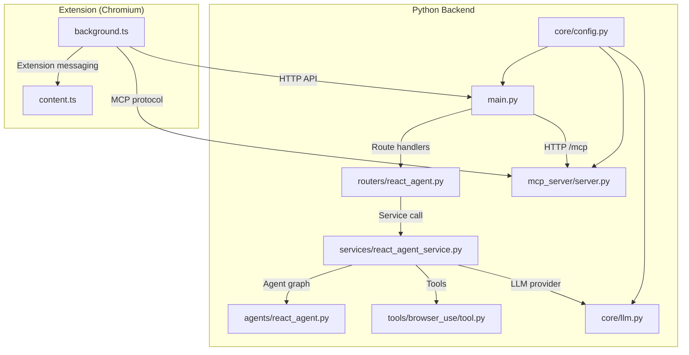
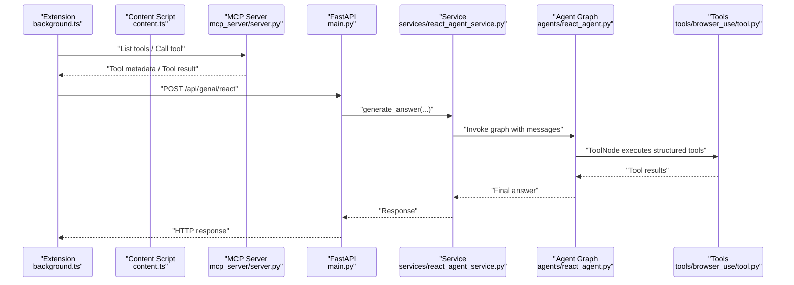
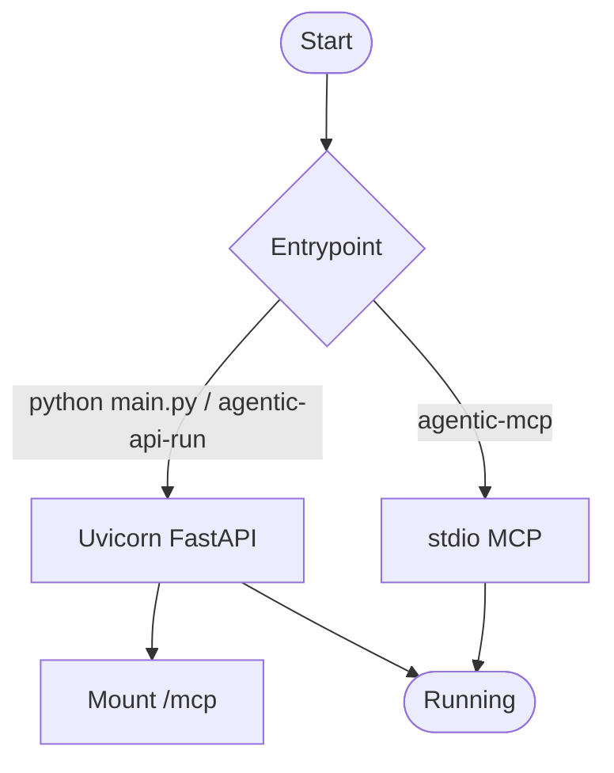
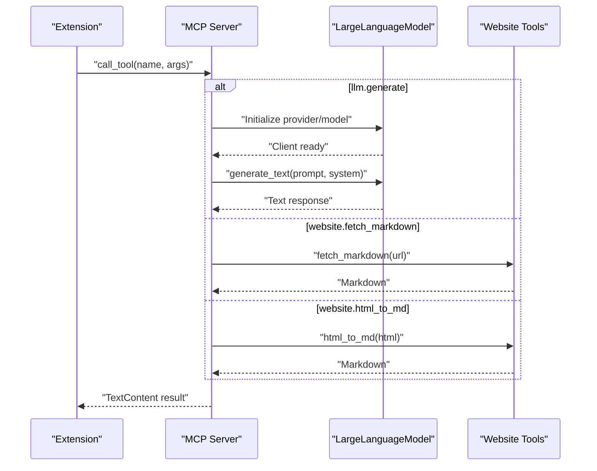
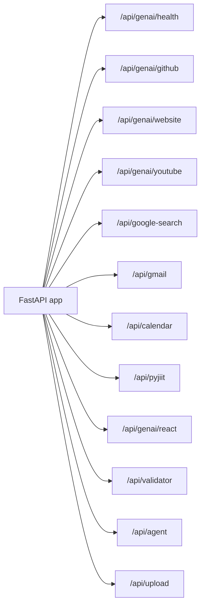
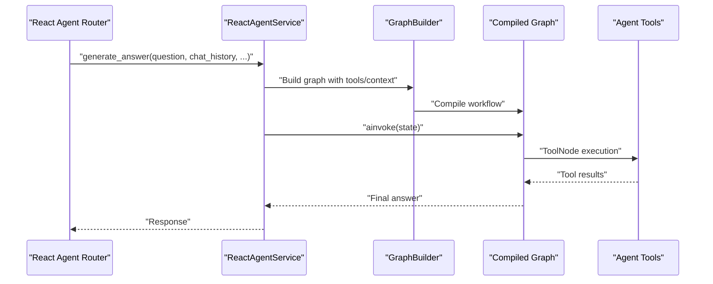
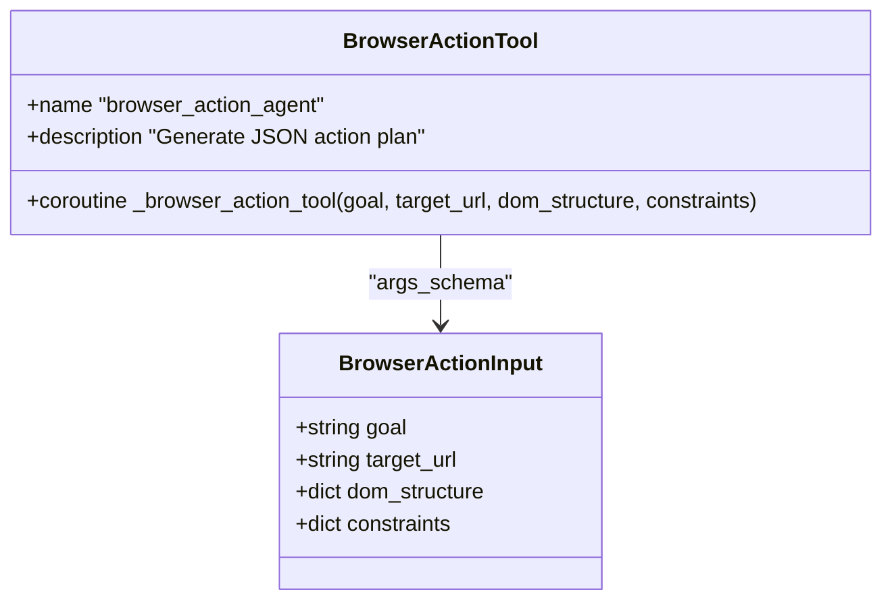
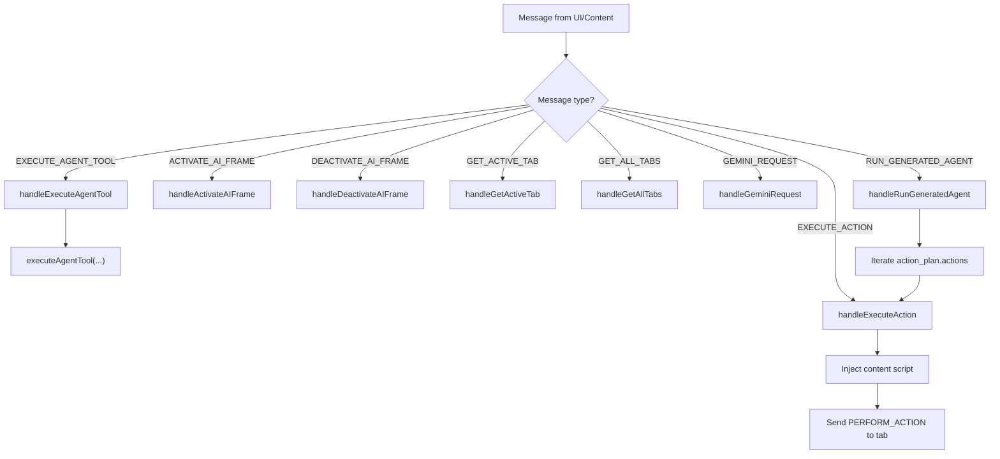
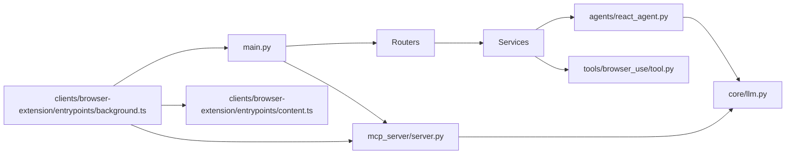

# System architecture

## Introduction
How the React extension, Python MCP server, FastAPI backend, and tools fit together. MCP for tool transport, FastAPI for REST, shared LLM layer for providers.

## Project structure
Layout:
- Extension: A Chromium extension built with React and TypeScript, implementing background and content scripts for browser automation and messaging.
- Backend: A Python application exposing both an MCP server and a FastAPI HTTP API.
- Core: Shared configuration and LLM abstraction.
- Services: Business logic and orchestration for domain capabilities.
- Tools: Modular, reusable tools consumed by agents and services.
- Agents: Orchestrated reasoning graphs using LangGraph and LangChain tools.
- Routers: FastAPI route handlers delegating to services.

```mermaid
graph TB
subgraph "Extension (Chromium)"
BG["background.ts"]
CT["content.ts"]
end
subgraph "Python Backend"
MAIN["main.py"]
MCP["mcp_server/server.py"]
CFG["core/config.py"]
LLM["core/llm.py"]
SRV_REACT["services/react_agent_service.py"]
AG_REACT["agents/react_agent.py"]
TOOL_BROWSER["tools/browser_use/tool.py"]
ROUTER_REACT["routers/react_agent.py"]
end
BG --> |"Extension messaging"| CT
BG --> |"MCP protocol"| MCP
BG --> |"HTTP API"| MAIN
MAIN --> |"Route handlers"| ROUTER_REACT
ROUTER_REACT --> |"Service call"| SRV_REACT
SRV_REACT --> |"Agent graph"| AG_REACT
SRV_REACT --> |"Tools"| TOOL_BROWSER
SRV_REACT --> |"LLM provider"| LLM
MAIN --> |"HTTP /mcp"| MCP
CFG --> MAIN
CFG --> MCP
CFG --> LLM
```

## Core components
- CLI entrypoint: `main.py` / `agentic-api-run` starts FastAPI. `agentic-mcp` starts stdio MCP. HTTP MCP is mounted at `/mcp`.
- FastAPI backend: Exposes HTTP endpoints under a unified router registry.
- MCP server: Implements MCP protocol tools for LLM generation, GitHub Q&A, and website content conversion.
- LLM abstraction: Provider-agnostic configuration supporting multiple LLM providers.
- React agent service: Orchestrates agent workflows, integrates context, and coordinates tools.
- Agent graph: LangGraph-based reasoning pipeline with tool invocation.
- Browser-use tool: Structured tool for generating browser action plans.
- Extension background/content scripts: Manage extension lifecycle, inject content scripts, and coordinate actions.

## Architecture overview
Agentic Browser separates concerns across three primary channels:
- Browser extension messaging: Background script handles extension commands and delegates actions to content scripts or the MCP server.
- MCP protocol: The extension communicates with the Python MCP server to execute tools (e.g., LLM generation, website markdown extraction).
- HTTP API: The extension can also call the FastAPI backend for domain-specific routes (e.g., React agent).

```mermaid
sequenceDiagram
participant Ext as "Extension<br/>background.ts"
participant Content as "Content Script<br/>content.ts"
participant MCP as "MCP Server<br/>mcp_server/server.py"
participant API as "FastAPI<br/>main.py"
participant Svc as "Service<br/>services/react_agent_service.py"
participant Agent as "Agent Graph<br/>agents/react_agent.py"
participant Tools as "Tools<br/>tools/browser_use/tool.py"
Ext->>MCP : "List tools / Call tool"
MCP-->>Ext : "Tool metadata / Tool result"
Ext->>API : "POST /api/genai/react"
API->>Svc : "generate_answer(...)"
Svc->>Agent : "Invoke graph with messages"
Agent->>Tools : "ToolNode executes structured tools"
Tools-->>Agent : "Tool results"
Agent-->>Svc : "Final answer"
Svc-->>API : "Response"
API-->>Ext : "HTTP response"
```

## Detailed component analysis

### CLI entrypoint
`python main.py` and `agentic-api-run` start FastAPI with MCP at `/mcp`. `agentic-mcp` starts stdio MCP.

```mermaid
flowchart TD
Start(["Start"]) --> Choose{"Entrypoint"}
Choose --> |python main.py / agentic-api-run| RunAPI["Uvicorn FastAPI"]
Choose --> |agentic-mcp| RunMCP["stdio MCP"]
RunAPI --> Mount["Mount /mcp"]
RunAPI --> End(["Running"])
RunMCP --> End
```

### MCP protocol tools and execution
The MCP server exposes tools for LLM generation, GitHub Q&A, and website content conversion. Tool execution delegates to the LLM abstraction and utility functions.

```mermaid
sequenceDiagram
participant Ext as "Extension"
participant MCP as "MCP Server"
participant LLM as "LargeLanguageModel"
participant Util as "Website Tools"
Ext->>MCP : "call_tool(name, args)"
alt llm.generate
MCP->>LLM : "Initialize provider/model"
LLM-->>MCP : "Client ready"
MCP->>LLM : "generate_text(prompt, system)"
LLM-->>MCP : "Text response"
else website.fetch_markdown
MCP->>Util : "fetch_markdown(url)"
Util-->>MCP : "Markdown"
else website.html_to_md
MCP->>Util : "html_to_md(html)"
Util-->>MCP : "Markdown"
end
MCP-->>Ext : "TextContent result"
```

### FastAPI backend and route composition
The FastAPI app composes routers for health, GitHub, website, YouTube, Google Search, Gmail, Calendar, PyJiIT, React agent, validator, agent, and file upload. The React agent router delegates to the React agent service.

```mermaid
graph LR
API["FastAPI app"]
Health["/api/genai/health"]
GH["/api/genai/github"]
Site["/api/genai/website"]
YT["/api/genai/youtube"]
GSearch["/api/google-search"]
Gmail["/api/gmail"]
Cal["/api/calendar"]
Pyj["/api/pyjiit"]
React["/api/genai/react"]
Validator["/api/validator"]
Agent["/api/agent"]
Upload["/api/upload"]
API --> Health
API --> GH
API --> Site
API --> YT
API --> GSearch
API --> Gmail
API --> Cal
API --> Pyj
API --> React
API --> Validator
API --> Agent
API --> Upload
```

### React agent orchestration
The React agent service constructs a LangGraph workflow, normalizes messages, injects page context when provided, and invokes the compiled graph. The agent graph uses a tool node to execute structured tools.

```mermaid
sequenceDiagram
participant API as "React Agent Router"
participant Svc as "ReactAgentService"
participant Agent as "GraphBuilder"
participant Graph as "Compiled Graph"
participant Tools as "Agent Tools"
API->>Svc : "generate_answer(question, chat_history, ...)"
Svc->>Agent : "Build graph with tools/context"
Agent->>Graph : "Compile workflow"
Svc->>Graph : "ainvoke(state)"
Graph->>Tools : "ToolNode execution"
Tools-->>Graph : "Tool results"
Graph-->>Svc : "Final answer"
Svc-->>API : "Response"
```

### Browser-Use tool integration
The browser-use tool defines a structured tool for generating browser action plans. It is consumed by the agent graph during tool execution.

```mermaid
classDiagram
class BrowserActionInput {
+string goal
+string target_url
+dict dom_structure
+dict constraints
}
class BrowserActionTool {
+name "browser_action_agent"
+description "Generate JSON action plan"
+coroutine _browser_action_tool(goal, target_url, dom_structure, constraints)
}
BrowserActionTool --> BrowserActionInput : "args_schema"
```

### Extension messaging and action execution
The extension's background script listens for messages from the UI and content scripts, handles tab management, and executes actions by injecting content scripts and sending messages. It supports dynamic Gemini requests and action-plan execution.

```mermaid
flowchart TD
Msg["Message from UI/Content"] --> Type{"Message type?"}
Type --> |EXECUTE_AGENT_TOOL| ExecTool["handleExecuteAgentTool"]
Type --> |ACTIVATE_AI_FRAME| ActFrame["handleActivateAIFrame"]
Type --> |DEACTIVATE_AI_FRAME| DeactFrame["handleDeactivateAIFrame"]
Type --> |GET_ACTIVE_TAB| GetActive["handleGetActiveTab"]
Type --> |GET_ALL_TABS| GetAll["handleGetAllTabs"]
Type --> |EXECUTE_ACTION| ExecAct["handleExecuteAction"]
Type --> |GEMINI_REQUEST| Gemini["handleGeminiRequest"]
Type --> |RUN_GENERATED_AGENT| RunAgent["handleRunGeneratedAgent"]
ExecAct --> Inject["Inject content script"]
Inject --> SendMsg["Send PERFORM_ACTION to tab"]
ExecTool --> CallTool["executeAgentTool(...)"]
RunAgent --> Loop["Iterate action_plan.actions"]
Loop --> ExecAct
```

## Dependency analysis
- The CLI depends on the MCP server and FastAPI entrypoints.
- The FastAPI app depends on routers, which depend on services.
- Services depend on the agent graph and tools.
- The agent graph depends on the LLM abstraction and tools.
- The MCP server depends on the LLM abstraction and website utilities.
- The extension depends on background and content scripts for messaging and automation.

```mermaid
graph LR
MAIN["main.py"] --> MCP["mcp_server/server.py"]
MAIN --> ROUTERS["Routers"]
ROUTERS --> SRV["Services"]
SRV --> AG["agents/react_agent.py"]
SRV --> TOOL["tools/browser_use/tool.py"]
AG --> LLM["core/llm.py"]
MCP --> LLM
BG["clients/browser-extension/entrypoints/background.ts"] --> MCP
BG --> MAIN
BG --> CT["clients/browser-extension/entrypoints/content.ts"]
```

## Performance considerations
- Model selection and provider routing: The LLM abstraction chooses providers and defaults, minimizing cold starts by caching clients.
- Tool execution batching: The agent graph executes tools asynchronously; ensure tool implementations avoid blocking operations.
- HTTP API throughput: Use asynchronous FastAPI handlers and keep route logic lightweight; delegate heavy work to services.
- Extension responsiveness: Avoid long-running injected scripts; prefer background-worker coordination and short-lived content-script interactions.
- Caching: Reuse compiled agent graphs and compiled LLM clients where feasible.

## Security and transparency
- Guardrails and prompt injection: Dedicated prompt injection validator and explicit system prompts guide the agent toward safe, transparent behavior.
- API key management: LLM provider configuration reads keys from environment variables; avoid embedding secrets in code.
- Extension permissions: The extension interacts with tabs and content scripts; maintain minimal permissions and sanitize injected content.
- Transparency: The React agent service logs messages and context; expose logs for auditing while avoiding sensitive data leakage.
- MCP tool scope: Limit MCP tools to necessary capabilities and validate inputs rigorously.

## Monitoring and observability
- Logging: Centralized logger configuration supports development and production logging levels.
- Endpoint visibility: Health routers and standardized responses enable readiness/liveness checks.
- Agent tracing: Log message counts and final outputs to track agent behavior and detect anomalies.

## Infrastructure requirements and deployment topology
- Runtime environments:
 - Python runtime for the MCP server and FastAPI backend.
 - Chromium-based browser for the extension.
- Networking:
 - Localhost binding controlled by configuration; adjust host/port for containerized deployments.
- Scalability:
 - Stateless FastAPI routes scale horizontally behind a reverse proxy.
 - MCP server runs as a single process; consider process isolation per tenant if needed.
 - Tool-heavy workloads benefit from caching and asynchronous processing.
- Containerization:
 - Package the Python backend and serve via a containerized FastAPI app; run the MCP server alongside or separately.
- Secrets management:
 - Store API keys and base URLs in environment variables; mount secrets securely in containers.

## Troubleshooting guide
- MCP tool errors: The MCP server wraps tool execution in try/catch and returns error text; verify tool names and arguments.
- LLM initialization failures: Provider configuration requires API keys or base URLs; check environment variables and model names.
- Extension action failures: Confirm content script injection and tab permissions; validate selectors and action parameters.
- React agent errors: Inspect chat history normalization and page-context injection; ensure HTML-to-markdown conversion succeeds.

## Conclusion
Extension, MCP, and FastAPI stay separate on purpose. LangGraph runs the agent; the extension runs the browser. Guardrails and logs cut across both.

