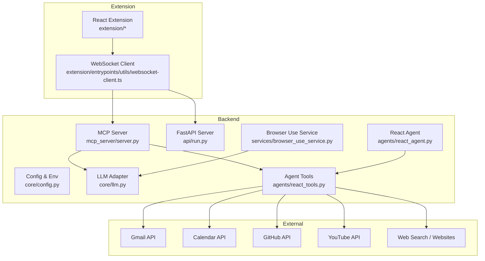
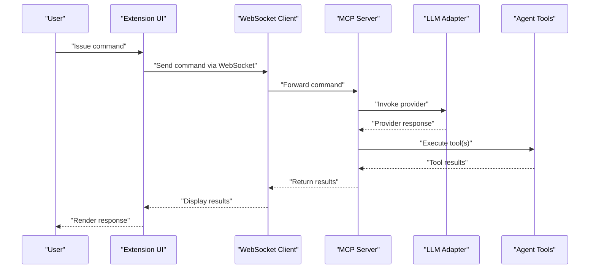
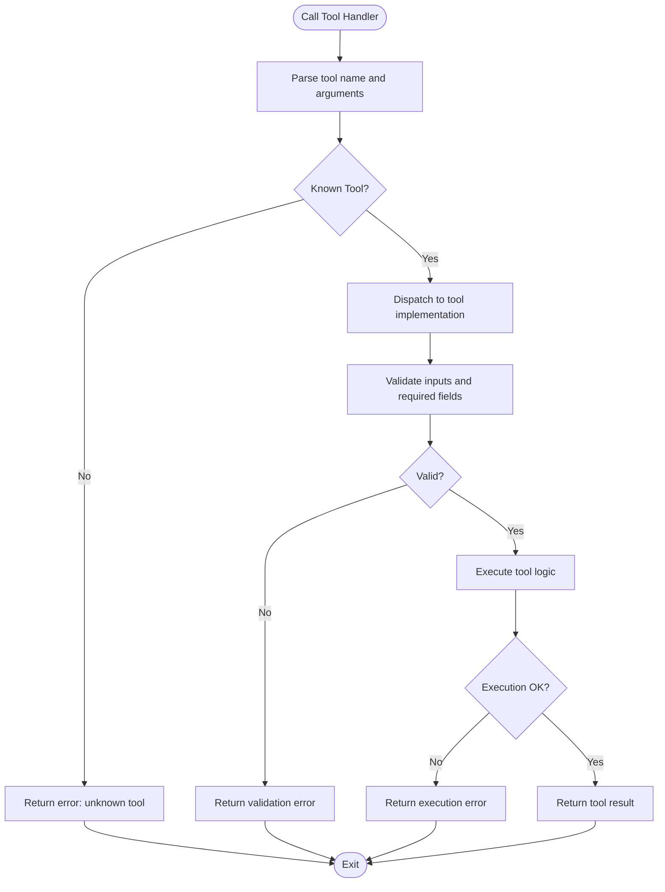
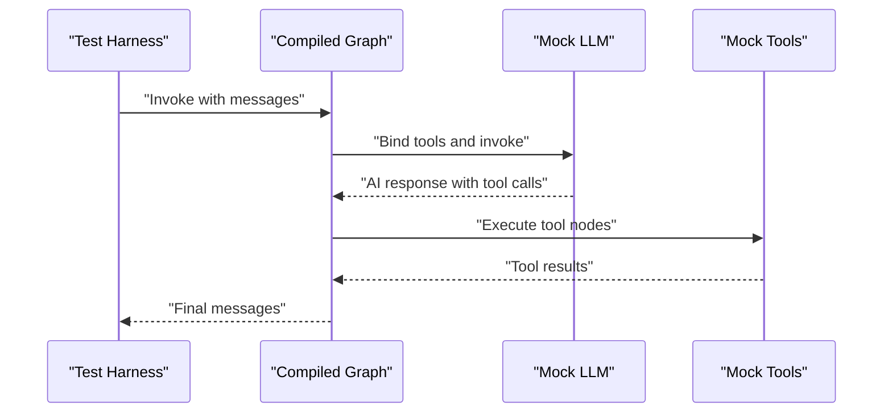
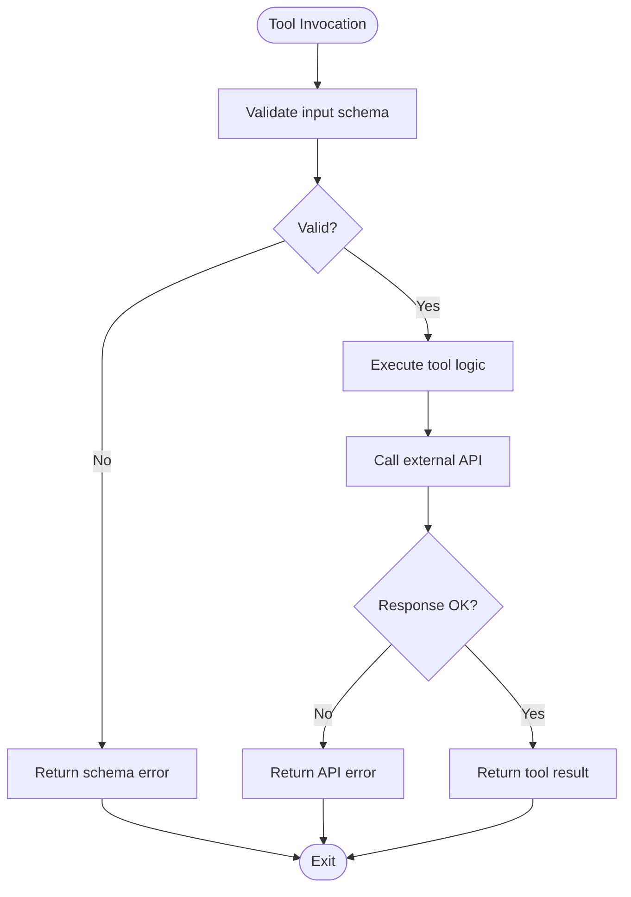
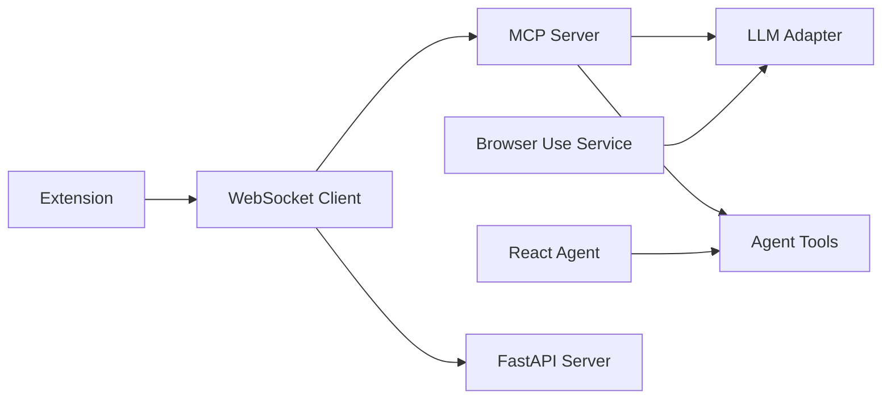

# Testing Strategy

<cite>
**Referenced Files in This Document**
- [README.md](file://README.md)
- [main.py](file://main.py)
- [mcp_server/server.py](file://mcp_server/server.py)
- [api/run.py](file://api/run.py)
- [core/config.py](file://core/config.py)
- [core/llm.py](file://core/llm.py)
- [agents/react_agent.py](file://agents/react_agent.py)
- [agents/react_tools.py](file://agents/react_tools.py)
- [services/browser_use_service.py](file://services/browser_use_service.py)
- [tools/browser_use/tool.py](file://tools/browser_use/tool.py)
- [extension/package.json](file://extension/package.json)
</cite>

## Table of Contents
1. [Introduction](#introduction)
2. [Project Structure](#project-structure)
3. [Core Components](#core-components)
4. [Architecture Overview](#architecture-overview)
5. [Detailed Component Analysis](#detailed-component-analysis)
6. [Dependency Analysis](#dependency-analysis)
7. [Performance Considerations](#performance-considerations)
8. [Troubleshooting Guide](#troubleshooting-guide)
9. [Conclusion](#conclusion)
10. [Appendices](#appendices)

## Introduction
This document defines a comprehensive testing strategy for Agentic Browser. It covers unit testing, integration testing, API testing, and browser extension testing methodologies. It explains the frameworks and patterns used, mock strategies for external dependencies, and how to test AI agent behavior, tool execution, service integrations, and browser automation. It also documents MCP protocol communication, WebSocket functionality, and extension messaging. Guidance is included for asynchronous operations, browser automation scenarios, and external API interactions, along with examples of test implementation, CI setup, and automated workflows. Challenges specific to AI systems, browser automation, and multi-component architectures are addressed, alongside performance, security, and user acceptance testing approaches.

## Project Structure
Agentic Browser comprises:
- A Python MCP server that exposes tools and orchestrates LLM-based actions
- A FastAPI-based HTTP API server
- An agent runtime built on LangGraph and LangChain
- A browser extension (React + Vite) with WebExtensions APIs and WebSocket client
- Services and tools that integrate with external providers (Gmail, Calendar, GitHub, YouTube, PyJIIT, web search)
- Configuration and environment management

**Diagram sources**
- [mcp_server/server.py](file://mcp_server/server.py#L1-L139)
- [api/run.py](file://api/run.py#L1-L15)
- [core/config.py](file://core/config.py#L1-L26)
- [core/llm.py](file://core/llm.py#L1-L215)
- [agents/react_agent.py](file://agents/react_agent.py#L1-L191)
- [agents/react_tools.py](file://agents/react_tools.py#L1-L721)
- [services/browser_use_service.py](file://services/browser_use_service.py#L1-L96)
- [extension/package.json](file://extension/package.json#L1-L40)

**Section sources**
- [README.md](file://README.md#L1-L185)
- [main.py](file://main.py#L1-L58)
- [mcp_server/server.py](file://mcp_server/server.py#L1-L139)
- [api/run.py](file://api/run.py#L1-L15)
- [core/config.py](file://core/config.py#L1-L26)
- [core/llm.py](file://core/llm.py#L1-L215)
- [agents/react_agent.py](file://agents/react_agent.py#L1-L191)
- [agents/react_tools.py](file://agents/react_tools.py#L1-L721)
- [services/browser_use_service.py](file://services/browser_use_service.py#L1-L96)
- [tools/browser_use/tool.py](file://tools/browser_use/tool.py#L1-L49)
- [extension/package.json](file://extension/package.json#L1-L40)

## Core Components
- MCP Server: Exposes tools (LLM generation, GitHub QA, website markdown fetch/convert) and routes tool calls to implementations. It runs via stdio and integrates with LangChain LLM clients.
- FastAPI Server: Runs uvicorn and serves the HTTP API.
- Config and Environment: Loads environment variables and sets logging levels.
- LLM Adapter: Provider-agnostic LLM client factory supporting multiple providers and base URLs.
- React Agent: LangGraph-based agent that decides when to use tools and executes them asynchronously.
- Agent Tools: Structured tools for GitHub, web search, website QA, YouTube QA, Gmail, Calendar, PyJIIT, and browser action generation.
- Browser Use Service: Generates JSON action plans from goals and DOM context using LLMs and sanitizes outputs.
- Extension: React app with sidepanel, multi-session chat, and WebSocket client for real-time communication with the backend.

**Section sources**
- [mcp_server/server.py](file://mcp_server/server.py#L1-L139)
- [api/run.py](file://api/run.py#L1-L15)
- [core/config.py](file://core/config.py#L1-L26)
- [core/llm.py](file://core/llm.py#L1-L215)
- [agents/react_agent.py](file://agents/react_agent.py#L1-L191)
- [agents/react_tools.py](file://agents/react_tools.py#L1-L721)
- [services/browser_use_service.py](file://services/browser_use_service.py#L1-L96)
- [tools/browser_use/tool.py](file://tools/browser_use/tool.py#L1-L49)
- [extension/package.json](file://extension/package.json#L1-L40)

## Architecture Overview
The system is composed of:
- CLI entrypoint selecting between API and MCP modes
- MCP server exposing tools and invoking LLM adapters
- Agent runtime orchestrating tool use and execution
- Services and tools integrating with external APIs
- Extension communicating with backend via WebSocket and UI

**Diagram sources**
- [mcp_server/server.py](file://mcp_server/server.py#L83-L124)
- [core/llm.py](file://core/llm.py#L78-L191)
- [agents/react_tools.py](file://agents/react_tools.py#L217-L277)
- [extension/package.json](file://extension/package.json#L29-L29)

## Detailed Component Analysis

### MCP Server Testing
Approach:
- Unit tests for tool discovery and tool invocation handlers
- Mock provider clients to isolate LLM behavior and external API calls
- Test error propagation and invalid tool names
- Validate input schemas and required fields

Frameworks and patterns:
- Use pytest for unit tests
- Use unittest.mock or pytest-mock for mocking provider clients and external services
- Parameterized tests for supported providers and input variations

Mock strategies:
- Replace provider clients with mocks that return deterministic responses
- Stub external tool dependencies (e.g., GitHub markdown fetcher) to controlled fixtures
- Simulate network errors and timeouts to validate error handling

**Diagram sources**
- [mcp_server/server.py](file://mcp_server/server.py#L83-L124)

**Section sources**
- [mcp_server/server.py](file://mcp_server/server.py#L16-L124)

### LLM Adapter Testing
Approach:
- Unit tests for provider selection and parameter mapping
- Tests for missing API keys and base URLs
- Tests for model initialization failures and fallback behavior
- Validation of default model selection and provider-specific overrides

Mock strategies:
- Patch provider client constructors to avoid network calls
- Inject environment variables for API keys and base URLs
- Simulate provider-specific exceptions to validate error handling

Best practices:
- Keep provider-specific logic isolated behind a configuration map
- Validate inputs early and fail fast with clear error messages

**Section sources**
- [core/llm.py](file://core/llm.py#L21-L170)

### Agent Runtime Testing
Approach:
- Unit tests for message normalization and payload conversion
- Integration tests for the compiled LangGraph workflow
- Tests for tool binding and conditional edges
- Async execution tests for tool calls and agent steps

Mock strategies:
- Replace LLM client with a deterministic mock that returns fixed responses
- Mock tool implementations to return controlled outputs
- Use asyncio event loop controls to manage concurrency

**Diagram sources**
- [agents/react_agent.py](file://agents/react_agent.py#L123-L175)
- [agents/react_agent.py](file://agents/react_agent.py#L183-L191)

**Section sources**
- [agents/react_agent.py](file://agents/react_agent.py#L40-L191)

### Agent Tools Testing
Approach:
- Unit tests for each tool’s input schema validation
- Integration tests for tool execution with mocked external services
- Tests for optional credentials and default token/session handling
- Tests for error handling and informative error messages

Mock strategies:
- Replace external API calls with fixtures and controlled responses
- Use partial application to inject default tokens/sessions
- Simulate OAuth failures and rate limits

**Diagram sources**
- [agents/react_tools.py](file://agents/react_tools.py#L217-L277)
- [agents/react_tools.py](file://agents/react_tools.py#L279-L436)

**Section sources**
- [agents/react_tools.py](file://agents/react_tools.py#L61-L721)

### Browser Use Service Testing
Approach:
- Unit tests for prompt construction and LLM invocation
- Tests for DOM info formatting and constraints handling
- Tests for action plan sanitization and validation
- Error handling for LLM failures and sanitizer issues

Mock strategies:
- Mock the LLM chain to return deterministic outputs
- Provide synthetic DOM structures and constraints
- Validate sanitized outputs meet expected schema

**Section sources**
- [services/browser_use_service.py](file://services/browser_use_service.py#L11-L96)
- [tools/browser_use/tool.py](file://tools/browser_use/tool.py#L27-L48)

### Extension Messaging and WebSocket Testing
Approach:
- Unit tests for WebSocket client initialization and connection handling
- Integration tests simulating message exchange between extension and backend
- Tests for UI components that depend on WebSocket state
- Mock backend responses to validate UI rendering and error handling

Frameworks and patterns:
- Use pytest for unit tests
- Use pytest-asyncio for async WebSocket operations
- Use mocking to simulate backend MCP/API responses

**Section sources**
- [extension/package.json](file://extension/package.json#L29-L29)

### API Testing
Approach:
- Unit tests for server startup and configuration loading
- Integration tests for FastAPI endpoints (if present)
- Tests for environment-driven configuration and logging

Frameworks and patterns:
- Use pytest with FastAPI test client
- Mock external dependencies during API tests

**Section sources**
- [api/run.py](file://api/run.py#L1-L15)
- [core/config.py](file://core/config.py#L1-L26)

## Dependency Analysis
Key dependencies and testing implications:
- MCP server depends on LLM adapter and agent tools
- Agent runtime depends on LLM adapter and tools
- Browser use service depends on LLM adapter and sanitizer
- Extension depends on WebSocket client and backend servers

**Diagram sources**
- [mcp_server/server.py](file://mcp_server/server.py#L1-L139)
- [core/llm.py](file://core/llm.py#L1-L215)
- [agents/react_agent.py](file://agents/react_agent.py#L1-L191)
- [agents/react_tools.py](file://agents/react_tools.py#L1-L721)
- [services/browser_use_service.py](file://services/browser_use_service.py#L1-L96)
- [extension/package.json](file://extension/package.json#L1-L40)

**Section sources**
- [mcp_server/server.py](file://mcp_server/server.py#L1-L139)
- [core/llm.py](file://core/llm.py#L1-L215)
- [agents/react_agent.py](file://agents/react_agent.py#L1-L191)
- [agents/react_tools.py](file://agents/react_tools.py#L1-L721)
- [services/browser_use_service.py](file://services/browser_use_service.py#L1-L96)
- [extension/package.json](file://extension/package.json#L1-L40)

## Performance Considerations
- Asynchronous tool execution: Ensure tests capture latency and concurrency behavior
- LLM cost and rate limits: Use throttling and caching in tests; mock providers to avoid quota issues
- Browser automation: Limit DOM size and action plan complexity; validate sanitization overhead
- WebSocket throughput: Test message batching and reconnection logic

[No sources needed since this section provides general guidance]

## Troubleshooting Guide
Common issues and remedies:
- Missing environment variables for API keys or base URLs: Validate configuration loading and provide clear error messages
- Provider client initialization failures: Add fallbacks and logging; test with invalid configurations
- Tool execution errors: Capture and propagate errors with context; validate input schemas
- WebSocket connection drops: Implement retry logic and UI feedback; test disconnection/reconnection flows

**Section sources**
- [core/config.py](file://core/config.py#L1-L26)
- [core/llm.py](file://core/llm.py#L121-L169)
- [mcp_server/server.py](file://mcp_server/server.py#L122-L124)

## Conclusion
This testing strategy emphasizes isolation of external dependencies, deterministic mocking, and comprehensive coverage of asynchronous flows. By structuring tests around the MCP server, agent runtime, tools, services, and extension, teams can ensure reliable behavior across model providers, browser automation, and multi-component integrations.

[No sources needed since this section summarizes without analyzing specific files]

## Appendices

### Testing Best Practices for Asynchronous Operations
- Use pytest-asyncio for async tests
- Prefer deterministic mocks over real network calls
- Test timeout and cancellation paths
- Validate concurrency and resource cleanup

[No sources needed since this section provides general guidance]

### Browser Automation Scenarios
- Simulate DOM structures and constraints
- Validate action plan generation and sanitization
- Test navigation, click, and type actions
- Verify tab management commands

**Section sources**
- [services/browser_use_service.py](file://services/browser_use_service.py#L11-L96)
- [tools/browser_use/tool.py](file://tools/browser_use/tool.py#L12-L48)

### External API Interactions
- Mock OAuth flows and API responses
- Validate error propagation and user-friendly messages
- Test optional credentials and default session handling

**Section sources**
- [agents/react_tools.py](file://agents/react_tools.py#L279-L436)

### Continuous Integration Setup
- Separate jobs for backend and extension
- Backend job: run Python unit tests and integration tests
- Extension job: run TypeScript checks and build verification
- Cache dependencies and reuse virtual environments

[No sources needed since this section provides general guidance]

### Automated Testing Workflows
- Pre-submit checks: lint, type checks, unit tests
- Post-submit checks: integration tests against staging
- Nightly smoke tests: end-to-end MCP and WebSocket flows

[No sources needed since this section provides general guidance]

### Security Testing Approaches
- Input validation and sanitization for agent inputs and DOM structures
- Authorization checks for tools requiring credentials
- Audit logs for all tool invocations and browser actions

[No sources needed since this section provides general guidance]

### User Acceptance Testing
- Define scenarios for agent workflows and browser automation
- Validate UI rendering and user feedback for WebSocket status
- Collect regression tests from real-world usage

[No sources needed since this section provides general guidance]